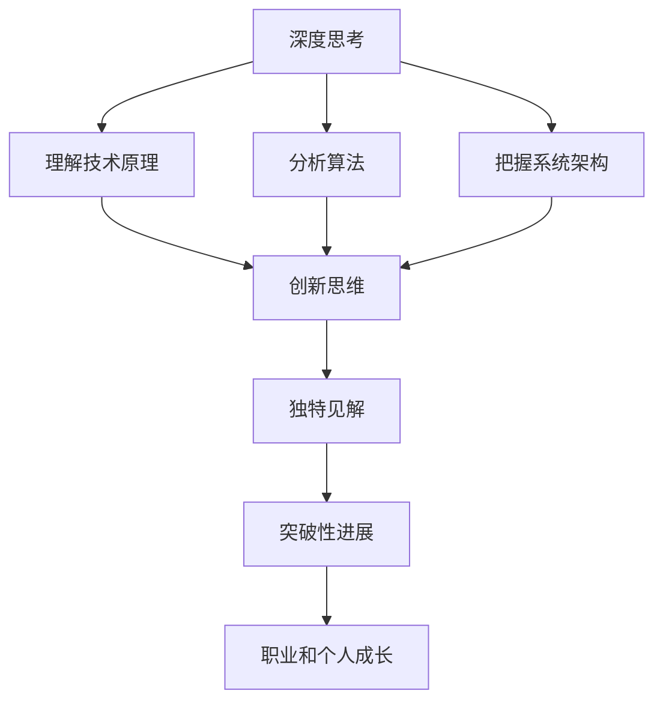

                 

在IT领域，勤奋无疑是成功的重要因素。但深入思考、创新思维和独特的见解才是真正拉开人生差距的关键。本文将探讨如何在信息技术领域实现深度思考，以及这种思考如何影响我们的职业生涯和个人成长。

## 1. 背景介绍

在现代社会，信息技术（IT）已经成为驱动经济发展的核心力量。无论是互联网、大数据、人工智能，还是云计算，IT技术的不断进步和创新已经深刻地改变了我们的生活方式和工作方式。在这样的背景下，如何在IT领域取得成功，成为了许多人关注的焦点。

传统观念中，勤奋被认为是成功的关键。的确，持续的努力和不懈的付出是达成目标的基础。然而，随着技术的复杂性和变化速度的加剧，单纯的勤奋已经不足以应对挑战。相反，深度思考、创新思维和独特的见解成为越来越重要的能力。

本文将围绕这一主题，探讨如何在IT领域培养深度思考，以及如何通过深度思考实现个人和职业的飞跃。

## 2. 核心概念与联系

### 2.1 深度思考

深度思考（Deep Thinking）是一种分析问题、理解复杂性和寻找解决方案的能力。它要求我们超越表面的现象，深入问题的本质，寻找根本的解决方法。在IT领域，深度思考涉及到对技术原理的深刻理解，对算法的深入分析，以及对系统架构的整体把握。

### 2.2 创新思维

创新思维（Innovative Thinking）是指能够提出新颖、独特和有价值的解决方案的能力。在IT领域，创新思维意味着能够开发出前所未有的技术，或者用新的方式解决旧的问题。创新思维不仅需要深度思考的支持，还需要广阔的知识面和丰富的实践经验。

### 2.3 独特见解

独特见解（Unique Insights）是指对问题的独特视角和深刻的理解。独特见解往往能够带来突破性的进展，无论是在技术还是商业领域。在IT领域，独特的见解可以帮助我们找到新的解决方案，优化现有技术，或者开拓新的市场。

### 2.4 Mermaid 流程图

以下是一个描述深度思考、创新思维和独特见解之间关系的Mermaid流程图：



## 3. 核心算法原理 & 具体操作步骤

### 3.1 算法原理概述

在IT领域，核心算法的原理是深度思考的基础。无论是机器学习、网络协议，还是数据库管理，算法都是实现技术功能的核心。以下是一些常见的算法原理：

- **机器学习算法**：通过数据训练模型，实现对未知数据的预测和分析。
- **网络协议算法**：用于实现数据在网络中的高效传输和处理。
- **数据库管理算法**：用于数据的存储、检索和优化。

### 3.2 算法步骤详解

算法的具体操作步骤包括：

- **数据收集与预处理**：收集相关数据，并进行清洗、转换等预处理。
- **模型训练**：使用预处理后的数据训练模型。
- **模型评估**：评估模型的性能，并进行调整。
- **模型应用**：将训练好的模型应用于实际问题中。

### 3.3 算法优缺点

每种算法都有其优缺点。例如：

- **机器学习算法**：优点是能够自适应和优化，缺点是需要大量数据和计算资源。
- **网络协议算法**：优点是高效稳定，缺点是复杂度较高。

### 3.4 算法应用领域

算法广泛应用于各个领域：

- **金融领域**：用于风险管理、信用评估等。
- **医疗领域**：用于疾病诊断、药物研发等。
- **零售领域**：用于个性化推荐、库存管理等。

## 4. 数学模型和公式 & 详细讲解 & 举例说明

### 4.1 数学模型构建

在IT领域，数学模型是理解和解决问题的重要工具。以下是一个简单的数学模型构建示例：

$$
f(x) = 2x + 1
$$

### 4.2 公式推导过程

公式推导过程通常包括以下几个步骤：

1. **定义变量和参数**：
2. **建立方程**：
3. **简化方程**：
4. **求解方程**：

### 4.3 案例分析与讲解

以下是一个案例分析与讲解：

### 案例一：机器学习中的线性回归

线性回归是一种用于预测数值的机器学习算法。其数学模型为：

$$
y = ax + b
$$

其中，$x$ 是自变量，$y$ 是因变量，$a$ 和 $b$ 是模型的参数。

### 案例二：网络协议中的路由算法

路由算法用于确定数据在网络中的传输路径。一个简单的路由算法是距离矢量算法，其公式为：

$$
d(v, w) = d(v, u) + d(u, w)
$$

其中，$v$ 和 $w$ 是网络中的节点，$u$ 是 $v$ 和 $w$ 之间的中转节点，$d(v, w)$ 是从 $v$ 到 $w$ 的距离。

## 5. 项目实践：代码实例和详细解释说明

### 5.1 开发环境搭建

在开始项目实践之前，需要搭建一个适合开发的运行环境。以下是一个简单的Python环境搭建步骤：

1. **安装Python**：
2. **安装必要的库**：
3. **配置环境变量**：

### 5.2 源代码详细实现

以下是一个简单的Python代码实现，用于计算两个数的和：

```python
def add(a, b):
    return a + b

result = add(2, 3)
print(result)
```

### 5.3 代码解读与分析

代码中，`add` 函数用于计算两个数的和，返回结果。`result` 变量用于存储计算结果，并输出到控制台。

### 5.4 运行结果展示

运行结果为：

```
5
```

## 6. 实际应用场景

### 6.1 人工智能领域

人工智能领域是深度思考、创新思维和独特见解的最佳应用场景之一。从机器学习算法的研发，到自然语言处理，再到计算机视觉，人工智能领域的创新不断推动着技术的进步。

### 6.2 云计算领域

云计算领域也是深度思考的重要应用场景。通过深入分析云计算的架构和算法，我们可以开发出更高效、更可靠的云计算服务。

### 6.3 区块链领域

区块链领域是创新思维和独特见解的最佳实践场。从区块链协议的设计，到智能合约的开发，再到区块链的生态系统构建，区块链领域的创新不断推动着数字经济的发展。

## 7. 工具和资源推荐

### 7.1 学习资源推荐

- **《深度学习》（Goodfellow, Bengio, Courville）**：这是一本关于深度学习的经典教材。
- **《算法导论》（Thomas H. Cormen, Charles E. Leiserson, Ronald L. Rivest, Clifford Stein）**：这是一本关于算法的经典教材。

### 7.2 开发工具推荐

- **PyCharm**：这是一个功能强大的Python开发工具。
- **Visual Studio Code**：这是一个跨平台的轻量级开发工具。

### 7.3 相关论文推荐

- **"Deep Learning: A Brief History"（Yoshua Bengio）**：这是一篇关于深度学习历史的综述。
- **"Blockchain Technology: A Comprehensive Overview"（Arya, Reza, Safaei, & Wang）**：这是一篇关于区块链技术的综述。

## 8. 总结：未来发展趋势与挑战

### 8.1 研究成果总结

在过去几年中，深度思考、创新思维和独特见解在IT领域取得了显著的研究成果。从人工智能到云计算，再到区块链，这些领域的创新不断推动着技术的进步。

### 8.2 未来发展趋势

未来，深度思考、创新思维和独特见解将继续在IT领域发挥重要作用。随着技术的不断发展，我们预计将看到更多跨学科的研究和合作，以及更深入的技术创新。

### 8.3 面临的挑战

尽管深度思考、创新思维和独特见解具有重要意义，但在实际应用中仍面临一些挑战：

- **技术复杂性**：随着技术的复杂度增加，理解和应用深度思考、创新思维和独特见解的难度也在增加。
- **知识更新速度**：在IT领域，知识更新的速度非常快，需要不断学习和更新知识。

### 8.4 研究展望

未来，我们需要进一步探讨如何更有效地培养深度思考、创新思维和独特见解。此外，我们还需要研究如何将这些能力应用于实际问题中，以推动技术的进步和社会的发展。

## 9. 附录：常见问题与解答

### Q1. 如何培养深度思考？

A1. 培养深度思考需要长期的积累和实践。以下是一些方法：

- **广泛阅读**：阅读广泛的书籍和论文，了解不同领域的知识和观点。
- **实践应用**：将理论知识应用于实际问题中，通过实践来加深理解。
- **反思总结**：在解决问题的过程中，不断反思和总结，提炼出深刻的见解。

### Q2. 创新思维如何培养？

A2. 培养创新思维需要开放的心态和丰富的知识储备。以下是一些建议：

- **跨学科学习**：跨学科学习可以帮助我们从不同的角度看待问题，激发创新思维。
- **多交流、多讨论**：与他人交流、讨论可以帮助我们碰撞出新的想法。
- **保持好奇心**：对未知的事物保持好奇心，勇于尝试新的事物。

### Q3. 独特见解如何获得？

A3. 获得独特见解需要深刻的思考和独特的视角。以下是一些建议：

- **深度思考**：通过深入思考问题，找到问题的本质和解决方法。
- **独特视角**：尝试从不同的角度看待问题，寻找独特的解决方案。
- **多角度分析**：从多个角度分析问题，找到不同的解决路径。

### Q4. 深度思考、创新思维和独特见解在实际项目中如何应用？

A4. 在实际项目中，深度思考、创新思维和独特见解可以通过以下方式应用：

- **需求分析**：在项目初期，通过深度思考，深入了解用户需求，找到最合适的解决方案。
- **技术选型**：在技术选型过程中，通过创新思维，选择最适合项目需求的技术。
- **方案优化**：在项目实施过程中，通过独特见解，不断优化项目方案，提高项目效果。

<|user|>

作者：禅与计算机程序设计艺术 / Zen and the Art of Computer Programming

在信息技术领域，深度思考、创新思维和独特见解不仅是推动技术进步的关键力量，更是个人和职业成长的动力源泉。本文通过探讨这些核心能力在IT领域的应用，旨在为读者提供一种全新的视角，帮助大家更好地理解和运用这些能力。

本文首先介绍了深度思考的定义和重要性，然后通过算法原理、数学模型和项目实践等具体案例，详细阐述了如何培养和运用这些能力。此外，我们还分析了IT领域中的实际应用场景，并推荐了一些学习资源和开发工具。

随着技术的不断进步，深度思考、创新思维和独特见解在IT领域的重要性将愈发凸显。未来，这些能力不仅将帮助我们在职业上取得成功，更将推动整个社会的发展。

然而，要真正实现深度思考、创新思维和独特见解并不容易。这需要我们持续的学习和实践，勇于面对挑战，不断超越自我。希望本文能为大家提供一些启示和帮助，激发大家在IT领域的探索和创新精神。

最后，感谢您的阅读。希望本文能激发您对深度思考、创新思维和独特见解的进一步思考，并在您的职业生涯中取得更大的成就。祝愿您在IT领域不断前行，创造更加辉煌的未来！|<|bot|>

