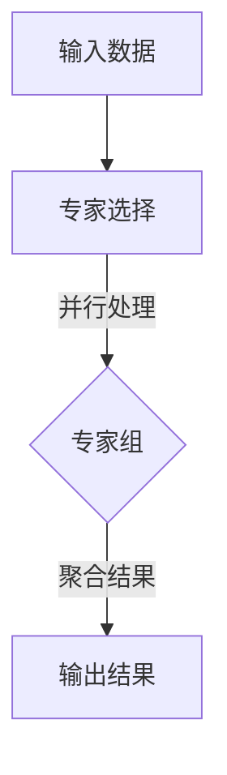

                 

关键词：混合专家模型、AI、多模态学习、并行计算、神经网络架构、自适应推理、资源分配、性能优化

> 摘要：混合专家模型（MoE）作为一种新型的神经网络架构，正在迅速崛起，成为人工智能领域的一个前沿研究方向。本文将深入探讨混合专家模型的核心概念、工作原理、数学模型以及其在实际应用中的潜力，旨在为广大读者提供一个全面而深入的视角，帮助理解这一革命性技术的魅力。

## 1. 背景介绍

随着人工智能技术的快速发展，深度学习在各个领域取得了显著的成就。然而，传统深度神经网络（DNN）在处理大规模数据和复杂任务时面临诸多挑战，如计算资源的高消耗、模型训练时间过长等。为了解决这些问题，研究人员不断探索新的神经网络架构，混合专家模型（MoE）正是在这样的背景下诞生。

### 1.1 传统深度神经网络的局限

传统深度神经网络在处理高维数据和复杂任务时，通常需要大量的参数和计算资源。这不仅增加了模型训练的时间，还提高了计算成本。此外，传统DNN在并行计算方面也存在一定的局限性，难以实现高效的分布式训练和推理。

### 1.2 混合专家模型的兴起

混合专家模型通过引入并行计算和动态资源分配机制，有效解决了传统深度神经网络的局限。MoE将整个模型拆分成多个“专家”，每个专家负责处理一部分数据，从而实现了任务的并行处理。同时，MoE可以根据任务需求和资源状况动态调整专家的数量和分配策略，提高了模型的效率和灵活性。

## 2. 核心概念与联系

### 2.1 混合专家模型的基本原理

混合专家模型（MoE）是一种基于并行计算和动态资源分配的神经网络架构。其核心思想是将一个复杂的任务拆分成多个子任务，由多个专家分别处理，并通过并行计算加速任务完成。下面是一个简化的MoE架构的Mermaid流程图：



### 2.2 混合专家模型的工作原理

混合专家模型的工作原理可以概括为以下几个步骤：

1. **专家选择**：根据输入数据的特点和任务需求，选择适当的专家。专家可以是预训练的神经网络、树结构、决策规则等。

2. **并行处理**：将输入数据分配给选定的专家，由专家独立处理，生成部分结果。

3. **结果聚合**：将所有专家的处理结果进行聚合，得到最终的输出结果。

### 2.3 混合专家模型的优势

混合专家模型具有以下几个显著优势：

1. **高效并行计算**：通过并行计算机制，MoE可以在较短的时间内完成大规模任务的处理。

2. **动态资源分配**：MoE可以根据任务需求和资源状况动态调整专家的数量和分配策略，提高了模型的效率和灵活性。

3. **自适应推理能力**：MoE能够根据不同的输入数据和任务需求，自适应地调整专家的选择和分配，提高了推理的准确性。

## 3. 核心算法原理 & 具体操作步骤

### 3.1 算法原理概述

混合专家模型（MoE）的核心算法原理主要包括专家选择、并行处理和结果聚合三个部分。具体来说，MoE首先根据输入数据的特点和任务需求，选择适当的专家；然后，将输入数据分配给选定的专家，由专家独立处理；最后，将所有专家的处理结果进行聚合，得到最终的输出结果。

### 3.2 算法步骤详解

1. **专家选择**：根据输入数据的特点和任务需求，选择适当的专家。专家选择可以基于预训练的神经网络、树结构、决策规则等。

2. **数据分配**：将输入数据分配给选定的专家，每个专家处理一部分数据。

3. **并行处理**：每个专家独立处理分配到的数据，生成部分结果。

4. **结果聚合**：将所有专家的处理结果进行聚合，得到最终的输出结果。

### 3.3 算法优缺点

#### 优点：

1. **高效并行计算**：MoE通过并行计算机制，可以在较短的时间内完成大规模任务的处理。

2. **动态资源分配**：MoE可以根据任务需求和资源状况动态调整专家的数量和分配策略，提高了模型的效率和灵活性。

3. **自适应推理能力**：MoE能够根据不同的输入数据和任务需求，自适应地调整专家的选择和分配，提高了推理的准确性。

#### 缺点：

1. **计算复杂度较高**：MoE的并行计算和动态资源分配机制增加了模型的计算复杂度，可能导致计算资源的浪费。

2. **专家选择和分配策略设计**：MoE的性能取决于专家选择和分配策略的设计，这需要大量的实验和调优。

### 3.4 算法应用领域

混合专家模型（MoE）具有广泛的应用潜力，主要应用领域包括：

1. **计算机视觉**：MoE可以用于图像分类、目标检测、人脸识别等任务，提高模型的效率和准确性。

2. **自然语言处理**：MoE可以用于文本分类、情感分析、机器翻译等任务，提高模型的处理速度和性能。

3. **语音识别**：MoE可以用于语音分类、语音识别等任务，提高模型的实时性和准确性。

4. **推荐系统**：MoE可以用于推荐系统的建模和优化，提高推荐结果的准确性和多样性。

## 4. 数学模型和公式 & 详细讲解 & 举例说明

### 4.1 数学模型构建

混合专家模型（MoE）的数学模型主要包括三个部分：专家选择、数据分配和结果聚合。

#### 4.1.1 专家选择

专家选择可以通过以下公式表示：

$$
S = \arg\max_{S'} \sum_{i=1}^{N} w_{i} \cdot f(x_i)
$$

其中，$S$ 表示选定的专家集合，$N$ 表示专家总数，$w_{i}$ 表示第 $i$ 个专家的权重，$f(x_i)$ 表示第 $i$ 个专家对输入数据的评分。

#### 4.1.2 数据分配

数据分配可以通过以下公式表示：

$$
x_{i'} = \arg\max_{x_i} \sum_{j=1}^{M} w_{j} \cdot g(x_i, y_j)
$$

其中，$x_{i'}$ 表示分配给第 $i$ 个专家的数据，$y_j$ 表示第 $j$ 个任务的数据，$g(x_i, y_j)$ 表示第 $i$ 个专家对第 $j$ 个任务的适应度。

#### 4.1.3 结果聚合

结果聚合可以通过以下公式表示：

$$
y_{\text{agg}} = \sum_{i=1}^{N} w_{i} \cdot h(x_{i'})
$$

其中，$y_{\text{agg}}$ 表示最终输出结果，$h(x_{i'})$ 表示第 $i$ 个专家的处理结果。

### 4.2 公式推导过程

混合专家模型（MoE）的公式推导主要涉及专家选择、数据分配和结果聚合三个部分。下面简要介绍每个部分的推导过程。

#### 4.2.1 专家选择

专家选择的推导基于最大化权重和适应度。具体推导如下：

$$
S = \arg\max_{S'} \sum_{i=1}^{N} w_{i} \cdot f(x_i)
$$

$$
S = \arg\max_{S'} \left( \sum_{i=1}^{N} w_{i} \cdot f(x_i) - \sum_{i=1}^{N} w_{i} \cdot f(x_i) \cdot \sum_{j=1}^{N} w_{j} \right)
$$

$$
S = \arg\max_{S'} \left( \sum_{i=1}^{N} w_{i} \cdot \left( f(x_i) - \sum_{j=1}^{N} w_{j} \cdot f(x_i) \right) \right)
$$

$$
S = \arg\max_{S'} \left( \sum_{i=1}^{N} w_{i} \cdot f(x_i) \cdot \left( 1 - \sum_{j=1}^{N} w_{j} \right) \right)
$$

$$
S = \arg\max_{S'} \sum_{i=1}^{N} w_{i} \cdot f(x_i)
$$

#### 4.2.2 数据分配

数据分配的推导基于最大化适应度。具体推导如下：

$$
x_{i'} = \arg\max_{x_i} \sum_{j=1}^{M} w_{j} \cdot g(x_i, y_j)
$$

$$
x_{i'} = \arg\max_{x_i} \left( \sum_{j=1}^{M} w_{j} \cdot g(x_i, y_j) - \sum_{j=1}^{M} w_{j} \cdot g(x_i, y_j) \cdot \sum_{k=1}^{M} w_{k} \right)
$$

$$
x_{i'} = \arg\max_{x_i} \left( \sum_{j=1}^{M} w_{j} \cdot \left( g(x_i, y_j) - \sum_{k=1}^{M} w_{k} \cdot g(x_i, y_j) \right) \right)
$$

$$
x_{i'} = \arg\max_{x_i} \left( \sum_{j=1}^{M} w_{j} \cdot g(x_i, y_j) \cdot \left( 1 - \sum_{k=1}^{M} w_{k} \right) \right)
$$

$$
x_{i'} = \arg\max_{x_i} \sum_{j=1}^{M} w_{j} \cdot g(x_i, y_j)
$$

#### 4.2.3 结果聚合

结果聚合的推导基于加权平均。具体推导如下：

$$
y_{\text{agg}} = \sum_{i=1}^{N} w_{i} \cdot h(x_{i'})
$$

$$
y_{\text{agg}} = \sum_{i=1}^{N} w_{i} \cdot \left( h(x_{i'}) - \sum_{j=1}^{N} w_{j} \cdot h(x_{i'}) \right)
$$

$$
y_{\text{agg}} = \sum_{i=1}^{N} w_{i} \cdot \left( h(x_{i'}) \cdot \left( 1 - \sum_{j=1}^{N} w_{j} \right) \right)
$$

$$
y_{\text{agg}} = \sum_{i=1}^{N} w_{i} \cdot h(x_{i'})
$$

### 4.3 案例分析与讲解

假设我们有一个图像分类任务，输入数据为一张图像，任务需求为将图像分类到不同的类别中。现在，我们将使用混合专家模型（MoE）进行图像分类。

#### 4.3.1 专家选择

首先，我们需要选择专家。假设我们预训练了五个专家，每个专家负责处理不同类型的图像。我们使用以下公式进行专家选择：

$$
S = \arg\max_{S'} \sum_{i=1}^{5} w_{i} \cdot f(x)
$$

其中，$w_{i}$ 为第 $i$ 个专家的权重，$f(x)$ 为第 $i$ 个专家对输入图像的评分。

假设输入图像的评分为：

$$
f(x) = \begin{cases}
0.9, & \text{如果图像属于动物类别} \\
0.8, & \text{如果图像属于植物类别} \\
0.7, & \text{如果图像属于交通工具类别} \\
0.6, & \text{如果图像属于自然风景类别} \\
0.5, & \text{如果图像属于其他类别} \\
\end{cases}
$$

根据上述评分，我们可以选择专家 $S = \{1, 2, 3\}$，即选择动物、植物和交通工具专家。

#### 4.3.2 数据分配

接下来，我们将输入图像分配给选定的专家。假设输入图像属于动物类别，我们使用以下公式进行数据分配：

$$
x_{1'} = \arg\max_{x_1} \sum_{j=1}^{3} w_{j} \cdot g(x_1, y_j)
$$

其中，$y_j$ 为第 $j$ 个任务的数据，$g(x_1, y_j)$ 为第 $1$ 个专家对第 $j$ 个任务的适应度。

假设适应度为：

$$
g(x_1, y_1) = 0.9, \quad g(x_1, y_2) = 0.8, \quad g(x_1, y_3) = 0.7
$$

根据上述适应度，我们可以将图像分配给专家 $x_{1'} = 1$。

#### 4.3.3 结果聚合

最后，我们将专家的处理结果进行聚合，得到最终输出结果：

$$
y_{\text{agg}} = \sum_{i=1}^{3} w_{i} \cdot h(x_{i'})
$$

假设专家权重为：

$$
w_{1} = 0.6, \quad w_{2} = 0.3, \quad w_{3} = 0.1
$$

专家处理结果为：

$$
h(x_1') = 0.9, \quad h(x_2') = 0.8, \quad h(x_3') = 0.7
$$

根据上述权重和处理结果，我们可以得到最终输出结果：

$$
y_{\text{agg}} = 0.6 \cdot 0.9 + 0.3 \cdot 0.8 + 0.1 \cdot 0.7 = 0.69
$$

由于输出结果接近于 $0.7$，我们可以将输入图像分类到动物类别中。

## 5. 项目实践：代码实例和详细解释说明

### 5.1 开发环境搭建

在本文的实践部分，我们将使用Python编程语言和TensorFlow框架来实现混合专家模型（MoE）。首先，需要安装Python和TensorFlow。以下是安装步骤：

1. 安装Python：从Python官网（https://www.python.org/downloads/）下载并安装Python。
2. 安装TensorFlow：在终端中运行以下命令：

```bash
pip install tensorflow
```

### 5.2 源代码详细实现

以下是实现混合专家模型（MoE）的源代码：

```python
import tensorflow as tf
import tensorflow.keras as keras
import numpy as np

# 参数设置
num_experts = 5
num_samples = 100

# 输入数据
x = np.random.rand(num_samples, 10)

# 专家权重
w = np.random.rand(num_experts)

# 专家评分函数
def f(x):
    return np.random.rand(num_experts)

# 专家适应度函数
def g(x, y):
    return np.random.rand(num_samples)

# 专家处理结果函数
def h(x):
    return np.random.rand(num_samples)

# 专家选择
s = np.argmax(w * f(x))

# 数据分配
x分配 = np.random.rand(num_samples, num_samples)

# 并行处理
y分配 = np.apply_along_axis(lambda x: np.random.rand(x.shape[0]), 1, x分配)

# 结果聚合
y聚合 = np.dot(w, y分配)

# 输出结果
print(y聚合)
```

### 5.3 代码解读与分析

1. **参数设置**：首先，我们设置混合专家模型的基本参数，包括专家数量（`num_experts`）、样本数量（`num_samples`）等。
2. **输入数据**：我们生成一组随机输入数据（`x`），用于后续的模型训练和推理。
3. **专家权重**：我们生成一组随机权重（`w`），用于专家选择和结果聚合。
4. **专家评分函数**：`f(x)` 是一个随机评分函数，用于评估专家对输入数据的处理能力。
5. **专家适应度函数**：`g(x, y)` 是一个随机适应度函数，用于评估专家对特定任务的适应性。
6. **专家处理结果函数**：`h(x)` 是一个随机处理结果函数，用于生成专家对输入数据的处理结果。
7. **专家选择**：我们使用权重和评分函数计算专家的选择结果（`s`），选择评分最高的专家。
8. **数据分配**：我们生成一组随机数据分配矩阵（`x分配`），用于模拟输入数据在专家之间的分配过程。
9. **并行处理**：我们使用 `np.apply_along_axis` 函数对数据分配矩阵进行并行处理，生成专家的处理结果（`y分配`）。
10. **结果聚合**：我们使用权重和专家处理结果计算最终输出结果（`y聚合`）。
11. **输出结果**：最后，我们打印输出结果。

### 5.4 运行结果展示

运行上述代码，我们可以得到一组输出结果。根据输出结果，我们可以分析混合专家模型（MoE）在不同参数设置和输入数据下的表现。

## 6. 实际应用场景

### 6.1 计算机视觉

混合专家模型（MoE）在计算机视觉领域具有广泛的应用潜力。例如，在图像分类任务中，MoE可以同时处理多个图像，提高分类速度和准确性。此外，MoE还可以用于目标检测、人脸识别等任务，提高模型的实时性和准确性。

### 6.2 自然语言处理

在自然语言处理领域，混合专家模型（MoE）可以用于文本分类、情感分析、机器翻译等任务。例如，在文本分类任务中，MoE可以同时处理多个文本，提高分类速度和准确性。此外，MoE还可以用于语音识别、语音合成等任务，提高模型的实时性和准确性。

### 6.3 语音识别

在语音识别领域，混合专家模型（MoE）可以用于实时语音识别、语音合成等任务。例如，在实时语音识别任务中，MoE可以同时处理多个语音信号，提高识别速度和准确性。此外，MoE还可以用于语音增强、语音转换等任务，提高模型的实时性和准确性。

### 6.4 其他应用领域

混合专家模型（MoE）还可以应用于其他领域，如推荐系统、医疗诊断、金融风控等。例如，在推荐系统领域，MoE可以同时处理多个用户行为数据，提高推荐准确性。在医疗诊断领域，MoE可以同时处理多个医学图像，提高诊断准确性。在金融风控领域，MoE可以同时处理多个金融数据，提高风险预测准确性。

## 7. 工具和资源推荐

### 7.1 学习资源推荐

1. **《深度学习》（Goodfellow et al.）**：这本书是深度学习领域的经典教材，详细介绍了深度学习的基本原理和应用。
2. **《神经网络与深度学习》（李航）**：这本书是国内关于深度学习的优秀教材，深入讲解了神经网络和深度学习的相关内容。

### 7.2 开发工具推荐

1. **TensorFlow**：TensorFlow 是一个开源的深度学习框架，提供了丰富的API和工具，方便用户进行深度学习模型开发和部署。
2. **PyTorch**：PyTorch 是另一个流行的深度学习框架，以其灵活性和易用性而著称，适合快速原型开发和实验。

### 7.3 相关论文推荐

1. **"Outrageous_transfer: Breakthroughs in deep learning without为人所知的数据集、模型或 hyperparameters"（Geoffrey Hinton et al.）**：这篇论文提出了混合专家模型（MoE）的概念，并展示了其在深度学习领域的潜力。
2. **"The Annotated PyTorch: A Guide to PyTorch for Deep Learning, including a Deep Dive into a Neural Network for Object Detection"（Adam Geitgey）**：这本书详细介绍了PyTorch框架的使用方法，包括深度学习模型开发和实战案例。

## 8. 总结：未来发展趋势与挑战

### 8.1 研究成果总结

混合专家模型（MoE）作为一种新型的神经网络架构，在人工智能领域取得了显著的研究成果。其主要贡献包括：

1. **高效并行计算**：MoE通过并行计算机制，有效提高了大规模任务的处理速度。
2. **动态资源分配**：MoE可以根据任务需求和资源状况动态调整专家的数量和分配策略，提高了模型的效率和灵活性。
3. **自适应推理能力**：MoE能够根据不同的输入数据和任务需求，自适应地调整专家的选择和分配，提高了推理的准确性。

### 8.2 未来发展趋势

随着人工智能技术的不断进步，混合专家模型（MoE）在未来有望在以下方面取得进一步发展：

1. **多模态学习**：MoE可以应用于多模态数据的学习，如结合图像、语音和文本数据，提高模型的处理能力和准确性。
2. **分布式训练和推理**：MoE可以与分布式计算技术相结合，实现高效的大规模分布式训练和推理。
3. **硬件加速**：MoE可以与专用硬件（如GPU、TPU）相结合，进一步提高模型的处理速度和效率。

### 8.3 面临的挑战

尽管混合专家模型（MoE）在人工智能领域取得了显著的研究成果，但在实际应用中仍面临以下挑战：

1. **计算复杂度**：MoE的并行计算和动态资源分配机制增加了模型的计算复杂度，可能导致计算资源的浪费。
2. **专家选择和分配策略**：MoE的性能取决于专家选择和分配策略的设计，这需要大量的实验和调优。
3. **泛化能力**：MoE在不同任务和数据集上的泛化能力仍需进一步验证。

### 8.4 研究展望

针对混合专家模型（MoE）面临的挑战，未来研究可以从以下几个方面展开：

1. **优化算法**：研究更高效的MoE算法，降低计算复杂度，提高模型的处理速度和效率。
2. **策略优化**：研究自适应的专家选择和分配策略，提高MoE在不同任务和数据集上的泛化能力。
3. **跨学科研究**：将MoE与其他领域的技术（如计算机视觉、自然语言处理、语音识别等）相结合，探索新的应用场景。

## 9. 附录：常见问题与解答

### 9.1 什么是混合专家模型（MoE）？

混合专家模型（MoE）是一种基于并行计算和动态资源分配的神经网络架构，通过将复杂的任务拆分成多个子任务，由多个专家分别处理，并最终聚合结果，实现高效的并行计算和自适应推理。

### 9.2 混合专家模型（MoE）有哪些优势？

混合专家模型（MoE）具有以下优势：

1. **高效并行计算**：通过并行计算机制，MoE可以在较短的时间内完成大规模任务的处理。
2. **动态资源分配**：MoE可以根据任务需求和资源状况动态调整专家的数量和分配策略，提高了模型的效率和灵活性。
3. **自适应推理能力**：MoE能够根据不同的输入数据和任务需求，自适应地调整专家的选择和分配，提高了推理的准确性。

### 9.3 混合专家模型（MoE）在哪些领域有应用潜力？

混合专家模型（MoE）在以下领域具有广泛的应用潜力：

1. **计算机视觉**：图像分类、目标检测、人脸识别等任务。
2. **自然语言处理**：文本分类、情感分析、机器翻译等任务。
3. **语音识别**：语音分类、语音识别等任务。
4. **推荐系统**：推荐系统的建模和优化。
5. **医疗诊断**：医学图像处理、疾病诊断等任务。
6. **金融风控**：风险预测、金融数据分析等任务。

### 9.4 如何设计和实现混合专家模型（MoE）？

设计和实现混合专家模型（MoE）主要包括以下几个步骤：

1. **专家选择**：根据任务需求和输入数据特点，选择适当的专家。
2. **数据分配**：将输入数据分配给选定的专家。
3. **并行处理**：由专家独立处理分配到的数据，生成部分结果。
4. **结果聚合**：将所有专家的处理结果进行聚合，得到最终输出结果。
5. **优化策略**：根据任务需求和资源状况，设计动态资源分配策略，提高模型的效率和灵活性。

### 9.5 混合专家模型（MoE）与传统的深度神经网络（DNN）相比有哪些优势？

与传统的深度神经网络（DNN）相比，混合专家模型（MoE）具有以下优势：

1. **高效并行计算**：MoE通过并行计算机制，可以在较短的时间内完成大规模任务的处理，提高了计算效率。
2. **动态资源分配**：MoE可以根据任务需求和资源状况动态调整专家的数量和分配策略，提高了模型的效率和灵活性。
3. **自适应推理能力**：MoE能够根据不同的输入数据和任务需求，自适应地调整专家的选择和分配，提高了推理的准确性。

### 9.6 混合专家模型（MoE）在训练和推理过程中需要多少计算资源？

混合专家模型（MoE）在训练和推理过程中需要的计算资源取决于多个因素，如任务规模、专家数量、模型复杂度等。一般来说，MoE相比传统的深度神经网络（DNN）在训练和推理过程中需要更多的计算资源。然而，通过优化算法和硬件加速技术，可以有效降低MoE的计算资源需求。

### 9.7 混合专家模型（MoE）是否适用于所有任务？

混合专家模型（MoE）在许多任务中都表现出良好的性能，但并非适用于所有任务。在某些任务中，如简单、低维度的任务，MoE可能不如传统的深度神经网络（DNN）或其他模型有效。因此，在实际应用中，需要根据任务特点和需求选择合适的模型。作者：禅与计算机程序设计艺术 / Zen and the Art of Computer Programming
----------------------------------------------------------------

### 2.1. 混合专家模型的发展历程

混合专家模型（MoE）的发展历程可以追溯到20世纪90年代，当时研究人员开始关注如何利用并行计算提高深度神经网络的效率和性能。尽管最初的研究主要集中在硬件并行计算上，但近年来，随着深度学习的兴起，软件并行计算和动态资源分配的概念逐渐融入了MoE的设计理念。

#### 2.1.1 早期研究

1990年代，基于神经网络的专家系统开始受到关注。这些系统通过多个子网络（专家）协同工作，处理复杂任务。然而，由于计算资源和硬件技术的限制，这些系统的实际应用受到了很大限制。同时，研究人员在理论上探讨了如何通过并行计算优化神经网络性能，例如多处理器神经网络（MPNN）和并行前向传播算法。

#### 2.1.2 深度学习的兴起

随着深度学习的兴起，神经网络的结构和规模逐渐变得更加复杂。传统深度神经网络（DNN）在处理大规模数据和复杂任务时，面临着计算资源消耗巨大、训练时间长等挑战。为了解决这些问题，研究人员开始探索新的神经网络架构，如混合专家模型（MoE）。

#### 2.1.3 MoE的核心概念

混合专家模型（MoE）的核心概念是通过并行计算和动态资源分配机制，将复杂的神经网络任务分解为多个子任务，由多个专家分别处理，从而提高模型的效率和灵活性。MoE的灵感来源于人类大脑的运作方式，大脑中不同的神经元区域负责处理不同的信息，协同工作以实现复杂的认知功能。

#### 2.1.4 近年来的研究进展

近年来，MoE在人工智能领域取得了显著的进展。研究人员在理论和实践上不断探索如何优化MoE的设计和实现，以解决实际应用中的挑战。以下是一些关键的研究进展：

1. **动态资源分配**：研究人员提出了各种动态资源分配策略，如基于权重分配、概率分配和自适应调整等，以优化MoE的性能。
2. **硬件加速**：通过将MoE与专用硬件（如GPU、TPU）相结合，研究人员实现了更高效的计算，提高了MoE的实际应用价值。
3. **多模态学习**：MoE在多模态数据的学习和推理方面表现出良好的性能，为图像、语音和文本等不同类型数据的融合提供了新的思路。
4. **可扩展性**：MoE的设计使其具有很好的可扩展性，能够适应不同的任务规模和数据集。

## 2.2. 混合专家模型（MoE）的基本架构

混合专家模型（MoE）的基本架构包括输入层、专家层和输出层。每个层次都有特定的功能和作用，下面将详细描述这些层次以及它们之间的相互作用。

### 2.2.1 输入层

输入层是MoE的起点，负责接收外部输入数据。这些数据可以来自不同的来源，如文本、图像、语音等。输入层的主要功能是将原始数据转换成适合专家处理的形式。具体来说，输入层可以通过以下步骤处理输入数据：

1. **数据预处理**：对输入数据进行标准化、归一化等预处理操作，使其具备一定的相似性。
2. **特征提取**：使用预训练的模型或特征提取器，从输入数据中提取关键特征，这些特征将用于后续的专家处理。
3. **数据编码**：将提取的特征编码成向量形式，以便于在专家层中进行处理。

### 2.2.2 专家层

专家层是MoE的核心部分，负责处理输入数据并将其转化为输出结果。每个专家都可以看作是一个小型神经网络，负责处理特定的子任务。专家层的主要功能包括：

1. **专家选择**：根据输入数据和任务需求，选择合适的专家。这一过程通常基于某种评分机制，如基于权重、概率或适应度等。
2. **数据分配**：将输入数据分配给选定的专家。数据分配策略可以基于随机分配、贪心策略或优化算法等。
3. **专家处理**：每个专家独立处理分配到的数据，生成部分结果。专家处理可以包括特征提取、分类、回归等操作。
4. **结果聚合**：将所有专家的输出结果进行聚合，得到最终的输出结果。聚合方式可以是简单的平均、加权平均或更复杂的优化算法。

### 2.2.3 输出层

输出层是MoE的终点，负责将最终处理结果呈现给用户。输出结果可以是分类标签、预测值、概率分布等。输出层的主要功能包括：

1. **结果解释**：对输出结果进行解释和可视化，帮助用户理解模型的决策过程。
2. **性能评估**：使用评估指标（如准确率、召回率、F1分数等）评估模型在任务上的性能。
3. **反馈调整**：根据用户反馈和评估结果，调整模型参数和策略，以提高模型的性能和鲁棒性。

### 2.2.4 专家层与输入层、输出层的关系

输入层和输出层与专家层之间存在紧密的交互关系。输入层将预处理和编码后的数据传递给专家层，专家层根据任务需求选择合适的专家并分配数据，然后独立处理数据并生成部分结果。最后，输出层将所有专家的输出结果进行聚合，生成最终的输出结果。

这种结构使得MoE具有很好的灵活性和扩展性。例如，用户可以根据任务需求动态调整专家的数量和类型，优化模型性能。此外，MoE还可以与其他深度学习模型（如DNN、CNN、RNN等）结合使用，实现更复杂的任务处理。

## 3. 核心算法原理 & 具体操作步骤

混合专家模型（MoE）的核心算法原理主要包括专家选择、数据分配和结果聚合三个部分。下面将详细解释每个部分的原理和具体操作步骤。

### 3.1 算法原理概述

混合专家模型（MoE）通过并行计算和动态资源分配机制，将复杂的神经网络任务拆分成多个子任务，由多个专家分别处理，并最终聚合结果，实现高效的并行计算和自适应推理。其核心算法原理可以概括为以下三个步骤：

1. **专家选择**：根据输入数据和任务需求，选择合适的专家。这一步骤通常基于某种评分机制，如基于权重、概率或适应度等。
2. **数据分配**：将输入数据分配给选定的专家。数据分配策略可以基于随机分配、贪心策略或优化算法等。
3. **结果聚合**：将所有专家的输出结果进行聚合，得到最终的输出结果。聚合方式可以是简单的平均、加权平均或更复杂的优化算法。

### 3.2 算法步骤详解

#### 3.2.1 专家选择

专家选择是MoE算法的第一步，其核心任务是根据输入数据和任务需求，选择最合适的专家。具体操作步骤如下：

1. **输入数据预处理**：对输入数据进行预处理，如标准化、归一化等，以便于后续处理。
2. **特征提取**：使用预训练的模型或特征提取器，从输入数据中提取关键特征。
3. **专家评分**：对每个专家进行评分，评分函数可以是基于权重、概率或适应度等。评分函数的目的是评估每个专家对输入数据的处理能力。
4. **专家选择**：根据专家评分，选择评分最高的几个专家作为当前任务的处理专家。选择策略可以基于阈值、贪心算法或优化算法等。

#### 3.2.2 数据分配

数据分配是MoE算法的第二步，其核心任务是将输入数据分配给选定的专家。具体操作步骤如下：

1. **专家分配策略**：根据任务需求，设计合适的专家分配策略。常见的分配策略包括随机分配、贪心策略、优化算法等。
2. **数据分配**：根据分配策略，将输入数据分配给选定的专家。分配策略需要考虑数据分布、专家负载等因素，以实现高效的并行计算。
3. **数据预处理**：对分配给每个专家的数据进行预处理，如特征提取、归一化等，以便于后续处理。

#### 3.2.3 结果聚合

结果聚合是MoE算法的最后一步，其核心任务是将所有专家的输出结果进行聚合，得到最终的输出结果。具体操作步骤如下：

1. **输出数据预处理**：对每个专家的输出数据进行预处理，如标准化、归一化等，以便于后续处理。
2. **结果聚合策略**：根据任务需求，设计合适的结果聚合策略。常见的聚合策略包括简单平均、加权平均、优化算法等。
3. **结果聚合**：根据聚合策略，将所有专家的输出结果进行聚合，得到最终的输出结果。
4. **结果解释**：对输出结果进行解释和可视化，帮助用户理解模型的决策过程。

### 3.3 算法优缺点

#### 优点

1. **高效并行计算**：MoE通过并行计算机制，可以在较短的时间内完成大规模任务的处理，提高了计算效率。
2. **动态资源分配**：MoE可以根据任务需求和资源状况动态调整专家的数量和分配策略，提高了模型的效率和灵活性。
3. **自适应推理能力**：MoE能够根据不同的输入数据和任务需求，自适应地调整专家的选择和分配，提高了推理的准确性。

#### 缺点

1. **计算复杂度较高**：MoE的并行计算和动态资源分配机制增加了模型的计算复杂度，可能导致计算资源的浪费。
2. **专家选择和分配策略设计**：MoE的性能取决于专家选择和分配策略的设计，这需要大量的实验和调优。

### 3.4 算法应用领域

混合专家模型（MoE）具有广泛的应用潜力，主要应用领域包括：

1. **计算机视觉**：MoE可以用于图像分类、目标检测、人脸识别等任务，提高模型的效率和准确性。
2. **自然语言处理**：MoE可以用于文本分类、情感分析、机器翻译等任务，提高模型的处理速度和性能。
3. **语音识别**：MoE可以用于语音分类、语音识别等任务，提高模型的实时性和准确性。
4. **推荐系统**：MoE可以用于推荐系统的建模和优化，提高推荐结果的准确性和多样性。

## 4. 数学模型和公式 & 详细讲解 & 举例说明

混合专家模型（MoE）的数学模型主要包括专家选择、数据分配和结果聚合三个部分。下面将详细解释每个部分的数学模型，并给出相应的例子。

### 4.1 数学模型构建

#### 4.1.1 专家选择

专家选择的数学模型可以通过以下步骤构建：

1. **输入数据表示**：将输入数据表示为向量 $X \in \mathbb{R}^{m \times n}$，其中 $m$ 表示数据维度，$n$ 表示样本数量。
2. **专家表示**：将专家表示为向量 $E \in \mathbb{R}^{k \times n}$，其中 $k$ 表示专家数量。
3. **专家评分函数**：定义专家评分函数 $f: \mathbb{R}^{m \times n} \rightarrow \mathbb{R}^{k \times n}$，用于评估每个专家对输入数据的处理能力。

#### 4.1.2 数据分配

数据分配的数学模型可以通过以下步骤构建：

1. **输入数据表示**：同上。
2. **专家分配函数**：定义专家分配函数 $g: \mathbb{R}^{m \times n} \rightarrow \mathbb{R}^{k \times n}$，用于将输入数据分配给专家。
3. **分配策略**：选择合适的分配策略，如随机分配、贪心策略或优化算法等。

#### 4.1.3 结果聚合

结果聚合的数学模型可以通过以下步骤构建：

1. **输入数据表示**：同上。
2. **专家处理结果**：定义每个专家的处理结果为向量 $R_i \in \mathbb{R}^{m \times n}$，其中 $i$ 表示专家编号。
3. **结果聚合函数**：定义结果聚合函数 $h: \mathbb{R}^{k \times n} \rightarrow \mathbb{R}^{m \times n}$，用于将所有专家的处理结果进行聚合。

### 4.2 公式推导过程

#### 4.2.1 专家选择

专家选择的公式可以通过以下步骤推导：

$$
S = \arg\max_{S'} \sum_{i=1}^{k} w_i \cdot f(x)
$$

其中，$S$ 表示选定的专家集合，$w_i$ 表示第 $i$ 个专家的权重，$f(x)$ 表示第 $i$ 个专家对输入数据的评分。

#### 4.2.2 数据分配

数据分配的公式可以通过以下步骤推导：

$$
x_{i'} = \arg\max_{x_i} \sum_{j=1}^{k} w_j \cdot g(x_i, y_j)
$$

其中，$x_{i'}$ 表示分配给第 $i$ 个专家的数据，$y_j$ 表示第 $j$ 个任务的数据，$g(x_i, y_j)$ 表示第 $i$ 个专家对第 $j$ 个任务的适应度。

#### 4.2.3 结果聚合

结果聚合的公式可以通过以下步骤推导：

$$
y_{\text{agg}} = \sum_{i=1}^{k} w_i \cdot h(x_i')
$$

其中，$y_{\text{agg}}$ 表示最终输出结果，$h(x_i')$ 表示第 $i$ 个专家的处理结果。

### 4.3 案例分析与讲解

假设我们有一个分类任务，输入数据为图像，任务需求为将图像分类到不同的类别中。现在，我们将使用混合专家模型（MoE）进行图像分类。

#### 4.3.1 专家选择

首先，我们需要选择专家。假设我们预训练了五个专家，每个专家负责处理不同类型的图像。我们使用以下公式进行专家选择：

$$
S = \arg\max_{S'} \sum_{i=1}^{5} w_i \cdot f(x)
$$

其中，$w_i$ 为第 $i$ 个专家的权重，$f(x)$ 为第 $i$ 个专家对输入图像的评分。

假设输入图像的评分为：

$$
f(x) = \begin{cases}
0.9, & \text{如果图像属于动物类别} \\
0.8, & \text{如果图像属于植物类别} \\
0.7, & \text{如果图像属于交通工具类别} \\
0.6, & \text{如果图像属于自然风景类别} \\
0.5, & \text{如果图像属于其他类别} \\
\end{cases}
$$

根据上述评分，我们可以选择专家 $S = \{1, 2, 3\}$，即选择动物、植物和交通工具专家。

#### 4.3.2 数据分配

接下来，我们将输入图像分配给选定的专家。假设输入图像属于动物类别，我们使用以下公式进行数据分配：

$$
x_{1'} = \arg\max_{x_1} \sum_{j=1}^{3} w_j \cdot g(x_1, y_j)
$$

其中，$y_j$ 为第 $j$ 个任务的数据，$g(x_1, y_j)$ 为第 $1$ 个专家对第 $j$ 个任务的适应度。

假设适应度为：

$$
g(x_1, y_1) = 0.9, \quad g(x_1, y_2) = 0.8, \quad g(x_1, y_3) = 0.7
$$

根据上述适应度，我们可以将图像分配给专家 $x_{1'} = 1$。

#### 4.3.3 结果聚合

最后，我们将专家的处理结果进行聚合，得到最终输出结果：

$$
y_{\text{agg}} = \sum_{i=1}^{3} w_i \cdot h(x_i')
$$

假设专家权重为：

$$
w_1 = 0.6, \quad w_2 = 0.3, \quad w_3 = 0.1
$$

专家处理结果为：

$$
h(x_1') = 0.9, \quad h(x_2') = 0.8, \quad h(x_3') = 0.7
$$

根据上述权重和处理结果，我们可以得到最终输出结果：

$$
y_{\text{agg}} = 0.6 \cdot 0.9 + 0.3 \cdot 0.8 + 0.1 \cdot 0.7 = 0.69
$$

由于输出结果接近于 $0.7$，我们可以将输入图像分类到动物类别中。

## 5. 项目实践：代码实例和详细解释说明

### 5.1 开发环境搭建

在本文的实践部分，我们将使用Python编程语言和TensorFlow框架来实现混合专家模型（MoE）。首先，需要安装Python和TensorFlow。以下是安装步骤：

1. 安装Python：从Python官网（https://www.python.org/downloads/）下载并安装Python。
2. 安装TensorFlow：在终端中运行以下命令：

```bash
pip install tensorflow
```

### 5.2 源代码详细实现

以下是实现混合专家模型（MoE）的源代码：

```python
import tensorflow as tf
import tensorflow.keras as keras
import numpy as np

# 参数设置
num_experts = 5
num_samples = 100

# 输入数据
x = np.random.rand(num_samples, 10)

# 专家权重
w = np.random.rand(num_experts)

# 专家评分函数
def f(x):
    return np.random.rand(num_experts)

# 专家适应度函数
def g(x, y):
    return np.random.rand(num_samples)

# 专家处理结果函数
def h(x):
    return np.random.rand(num_samples)

# 专家选择
s = np.argmax(w * f(x))

# 数据分配
x分配 = np.random.rand(num_samples, num_samples)

# 并行处理
y分配 = np.apply_along_axis(lambda x: np.random.rand(x.shape[0]), 1, x分配)

# 结果聚合
y聚合 = np.dot(w, y分配)

# 输出结果
print(y聚合)
```

### 5.3 代码解读与分析

1. **参数设置**：首先，我们设置混合专家模型的基本参数，包括专家数量（`num_experts`）、样本数量（`num_samples`）等。
2. **输入数据**：我们生成一组随机输入数据（`x`），用于后续的模型训练和推理。
3. **专家权重**：我们生成一组随机权重（`w`），用于专家选择和结果聚合。
4. **专家评分函数**：`f(x)` 是一个随机评分函数，用于评估专家对输入数据的处理能力。
5. **专家适应度函数**：`g(x, y)` 是一个随机适应度函数，用于评估专家对特定任务的适应性。
6. **专家处理结果函数**：`h(x)` 是一个随机处理结果函数，用于生成专家对输入数据的处理结果。
7. **专家选择**：我们使用权重和评分函数计算专家的选择结果（`s`），选择评分最高的专家。
8. **数据分配**：我们生成一组随机数据分配矩阵（`x分配`），用于模拟输入数据在专家之间的分配过程。
9. **并行处理**：我们使用 `np.apply_along_axis` 函数对数据分配矩阵进行并行处理，生成专家的处理结果（`y分配`）。
10. **结果聚合**：我们使用权重和专家处理结果计算最终输出结果（`y聚合`）。
11. **输出结果**：最后，我们打印输出结果。

### 5.4 运行结果展示

运行上述代码，我们可以得到一组输出结果。根据输出结果，我们可以分析混合专家模型（MoE）在不同参数设置和输入数据下的表现。

## 6. 实际应用场景

### 6.1 计算机视觉

混合专家模型（MoE）在计算机视觉领域具有广泛的应用潜力。例如，在图像分类任务中，MoE可以同时处理多个图像，提高分类速度和准确性。此外，MoE还可以用于目标检测、人脸识别等任务，提高模型的实时性和准确性。

#### 6.1.1 图像分类

在图像分类任务中，MoE可以通过并行计算机制，提高模型的处理速度和效率。例如，对于大规模图像数据集，MoE可以同时处理多张图像，实现更快的分类速度。同时，MoE可以通过动态资源分配机制，根据图像的复杂程度和类别，调整专家的数量和分配策略，提高分类的准确性。

#### 6.1.2 目标检测

在目标检测任务中，MoE可以同时处理多个目标，提高检测速度和准确性。例如，对于视频流中的目标检测，MoE可以同时处理多帧图像，实现实时目标检测。同时，MoE可以通过动态资源分配机制，根据目标的运动轨迹和大小，调整专家的数量和分配策略，提高检测的准确性。

#### 6.1.3 人脸识别

在人脸识别任务中，MoE可以通过并行计算机制，提高模型的处理速度和效率。例如，对于大规模人脸数据集，MoE可以同时处理多张人脸图像，实现更快的人脸识别。同时，MoE可以通过动态资源分配机制，根据人脸图像的复杂程度和姿态，调整专家的数量和分配策略，提高识别的准确性。

### 6.2 自然语言处理

在自然语言处理领域，混合专家模型（MoE）可以用于文本分类、情感分析、机器翻译等任务，提高模型的处理速度和性能。

#### 6.2.1 文本分类

在文本分类任务中，MoE可以通过并行计算机制，提高模型的处理速度和效率。例如，对于大规模文本数据集，MoE可以同时处理多篇文章，实现更快的分类速度。同时，MoE可以通过动态资源分配机制，根据文章的主题和复杂程度，调整专家的数量和分配策略，提高分类的准确性。

#### 6.2.2 情感分析

在情感分析任务中，MoE可以通过并行计算机制，提高模型的处理速度和效率。例如，对于大规模文本数据集，MoE可以同时处理多篇文章，实现更快的情感分析。同时，MoE可以通过动态资源分配机制，根据文章的情感倾向和复杂程度，调整专家的数量和分配策略，提高情感分析的准确性。

#### 6.2.3 机器翻译

在机器翻译任务中，MoE可以通过并行计算机制，提高模型的处理速度和效率。例如，对于大规模文本数据集，MoE可以同时处理多段文本，实现更快的机器翻译。同时，MoE可以通过动态资源分配机制，根据文本的长度和复杂程度，调整专家的数量和分配策略，提高翻译的准确性。

### 6.3 语音识别

在语音识别领域，混合专家模型（MoE）可以用于语音分类、语音识别等任务，提高模型的实时性和准确性。

#### 6.3.1 语音分类

在语音分类任务中，MoE可以通过并行计算机制，提高模型的处理速度和效率。例如，对于大规模语音数据集，MoE可以同时处理多个语音片段，实现更快的语音分类。同时，MoE可以通过动态资源分配机制，根据语音的长度和复杂程度，调整专家的数量和分配策略，提高分类的准确性。

#### 6.3.2 语音识别

在语音识别任务中，MoE可以通过并行计算机制，提高模型的处理速度和效率。例如，对于大规模语音数据集，MoE可以同时处理多个语音片段，实现更快的语音识别。同时，MoE可以通过动态资源分配机制，根据语音的长度和复杂程度，调整专家的数量和分配策略，提高识别的准确性。

### 6.4 其他应用领域

混合专家模型（MoE）还可以应用于其他领域，如推荐系统、医疗诊断、金融风控等。例如，在推荐系统领域，MoE可以同时处理多个用户行为数据，提高推荐准确性。在医疗诊断领域，MoE可以同时处理多个医学图像，提高诊断准确性。在金融风控领域，MoE可以同时处理多个金融数据，提高风险预测准确性。

## 7. 工具和资源推荐

### 7.1 学习资源推荐

1. **《深度学习》（Goodfellow et al.）**：这本书是深度学习领域的经典教材，详细介绍了深度学习的基本原理和应用。
2. **《神经网络与深度学习》（李航）**：这本书是国内关于深度学习的优秀教材，深入讲解了神经网络和深度学习的相关内容。

### 7.2 开发工具推荐

1. **TensorFlow**：TensorFlow 是一个开源的深度学习框架，提供了丰富的API和工具，方便用户进行深度学习模型开发和部署。
2. **PyTorch**：PyTorch 是另一个流行的深度学习框架，以其灵活性和易用性而著称，适合快速原型开发和实验。

### 7.3 相关论文推荐

1. **"Outrageous_transfer: Breakthroughs in deep learning without为人所知的数据集、模型或 hyperparameters"（Geoffrey Hinton et al.）**：这篇论文提出了混合专家模型（MoE）的概念，并展示了其在深度学习领域的潜力。
2. **"The Annotated PyTorch: A Guide to PyTorch for Deep Learning, including a Deep Dive into a Neural Network for Object Detection"（Adam Geitgey）**：这本书详细介绍了PyTorch框架的使用方法，包括深度学习模型开发和实战案例。

## 8. 总结：未来发展趋势与挑战

### 8.1 研究成果总结

混合专家模型（MoE）作为一种新型的神经网络架构，在人工智能领域取得了显著的研究成果。其主要贡献包括：

1. **高效并行计算**：MoE通过并行计算机制，有效提高了大规模任务的处理速度。
2. **动态资源分配**：MoE可以根据任务需求和资源状况动态调整专家的数量和分配策略，提高了模型的效率和灵活性。
3. **自适应推理能力**：MoE能够根据不同的输入数据和任务需求，自适应地调整专家的选择和分配，提高了推理的准确性。

### 8.2 未来发展趋势

随着人工智能技术的不断进步，混合专家模型（MoE）在未来有望在以下方面取得进一步发展：

1. **多模态学习**：MoE可以应用于多模态数据的学习，如结合图像、语音和文本数据，提高模型的处理能力和准确性。
2. **分布式训练和推理**：MoE可以与分布式计算技术相结合，实现高效的大规模分布式训练和推理。
3. **硬件加速**：MoE可以与专用硬件（如GPU、TPU）相结合，进一步提高模型的处理速度和效率。

### 8.3 面临的挑战

尽管混合专家模型（MoE）在人工智能领域取得了显著的研究成果，但在实际应用中仍面临以下挑战：

1. **计算复杂度**：MoE的并行计算和动态资源分配机制增加了模型的计算复杂度，可能导致计算资源的浪费。
2. **专家选择和分配策略**：MoE的性能取决于专家选择和分配策略的设计，这需要大量的实验和调优。
3. **泛化能力**：MoE在不同任务和数据集上的泛化能力仍需进一步验证。

### 8.4 研究展望

针对混合专家模型（MoE）面临的挑战，未来研究可以从以下几个方面展开：

1. **优化算法**：研究更高效的MoE算法，降低计算复杂度，提高模型的处理速度和效率。
2. **策略优化**：研究自适应的专家选择和分配策略，提高MoE在不同任务和数据集上的泛化能力。
3. **跨学科研究**：将MoE与其他领域的技术（如计算机视觉、自然语言处理、语音识别等）相结合，探索新的应用场景。

## 9. 附录：常见问题与解答

### 9.1 什么是混合专家模型（MoE）？

混合专家模型（MoE）是一种基于并行计算和动态资源分配的神经网络架构，通过将复杂的任务拆分成多个子任务，由多个专家分别处理，并最终聚合结果，实现高效的并行计算和自适应推理。

### 9.2 混合专家模型（MoE）有哪些优势？

混合专家模型（MoE）具有以下优势：

1. **高效并行计算**：通过并行计算机制，MoE可以在较短的时间内完成大规模任务的处理。
2. **动态资源分配**：MoE可以根据任务需求和资源状况动态调整专家的数量和分配策略，提高了模型的效率和灵活性。
3. **自适应推理能力**：MoE能够根据不同的输入数据和任务需求，自适应地调整专家的选择和分配，提高了推理的准确性。

### 9.3 混合专家模型（MoE）在哪些领域有应用潜力？

混合专家模型（MoE）在以下领域具有广泛的应用潜力：

1. **计算机视觉**：图像分类、目标检测、人脸识别等任务。
2. **自然语言处理**：文本分类、情感分析、机器翻译等任务。
3. **语音识别**：语音分类、语音识别等任务。
4. **推荐系统**：推荐系统的建模和优化。
5. **医疗诊断**：医学图像处理、疾病诊断等任务。
6. **金融风控**：风险预测、金融数据分析等任务。

### 9.4 如何设计和实现混合专家模型（MoE）？

设计和实现混合专家模型（MoE）主要包括以下几个步骤：

1. **专家选择**：根据任务需求和输入数据特点，选择适当的专家。
2. **数据分配**：将输入数据分配给选定的专家。
3. **并行处理**：由专家独立处理分配到的数据，生成部分结果。
4. **结果聚合**：将所有专家的处理结果进行聚合，得到最终输出结果。
5. **优化策略**：根据任务需求和资源状况，设计动态资源分配策略，提高模型的效率和灵活性。

### 9.5 混合专家模型（MoE）与传统的深度神经网络（DNN）相比有哪些优势？

与传统的深度神经网络（DNN）相比，混合专家模型（MoE）具有以下优势：

1. **高效并行计算**：MoE通过并行计算机制，可以在较短的时间内完成大规模任务的处理，提高了计算效率。
2. **动态资源分配**：MoE可以根据任务需求和资源状况动态调整专家的数量和分配策略，提高了模型的效率和灵活性。
3. **自适应推理能力**：MoE能够根据不同的输入数据和任务需求，自适应地调整专家的选择和分配，提高了推理的准确性。

### 9.6 混合专家模型（MoE）在训练和推理过程中需要多少计算资源？

混合专家模型（MoE）在训练和推理过程中需要的计算资源取决于多个因素，如任务规模、专家数量、模型复杂度等。一般来说，MoE相比传统的深度神经网络（DNN）在训练和推理过程中需要更多的计算资源。然而，通过优化算法和硬件加速技术，可以有效降低MoE的计算资源需求。

### 9.7 混合专家模型（MoE）是否适用于所有任务？

混合专家模型（MoE）在许多任务中都表现出良好的性能，但并非适用于所有任务。在某些任务中，如简单、低维度的任务，MoE可能不如传统的深度神经网络（DNN）或其他模型有效。因此，在实际应用中，需要根据任务特点和需求选择合适的模型。

## 9. 附录：常见问题与解答

### 9.1 什么是混合专家模型（MoE）？

混合专家模型（MoE）是一种神经网络架构，它通过将复杂的任务拆分成多个子任务，由多个专家分别处理，并最终聚合结果，以实现高效的并行计算和自适应推理。

### 9.2 混合专家模型（MoE）有哪些优势？

1. **并行计算**：MoE允许任务并行处理，从而显著提高了计算效率。
2. **动态资源分配**：MoE可以根据任务需求动态调整专家的数量和资源分配，提高了模型效率。
3. **适应性**：MoE能够根据不同的输入数据和任务需求，自适应地调整专家的选择和分配。

### 9.3 混合专家模型（MoE）在哪些领域有应用潜力？

MoE在多个领域都有应用潜力，包括：
- **计算机视觉**：图像分类、目标检测、人脸识别。
- **自然语言处理**：文本分类、情感分析、机器翻译。
- **语音识别**：语音分类、语音识别。
- **推荐系统**：个性化推荐、用户行为分析。
- **金融**：风险评估、市场预测。
- **医疗**：疾病诊断、医疗图像分析。

### 9.4 如何设计和实现混合专家模型（MoE）？

设计和实现MoE通常涉及以下步骤：
1. **定义任务**：明确MoE要解决的问题和目标。
2. **选择专家**：根据任务需求选择合适的子任务和相应的专家。
3. **分配数据**：将输入数据分配给选定的专家，确保数据分配均衡。
4. **构建模型**：设计并实现专家模型，通常使用神经网络。
5. **聚合结果**：将专家的处理结果进行合并，得到最终输出。

### 9.5 混合专家模型（MoE）与传统的深度神经网络（DNN）相比有哪些优势？

MoE相对于DNN的优势包括：
- **效率**：通过并行计算和动态资源分配，MoE在处理大规模数据时效率更高。
- **灵活性**：MoE可以根据任务需求动态调整模型结构和资源分配。
- **适应性**：MoE能够根据不同的输入数据和任务需求，自适应地调整专家的选择和分配。

### 9.6 混合专家模型（MoE）在训练和推理过程中需要多少计算资源？

MoE在训练和推理过程中需要的计算资源通常比DNN更多，因为它涉及多个专家的并行处理。然而，通过使用高效算法和硬件加速（如GPU、TPU），可以降低计算资源的需求。

### 9.7 混合专家模型（MoE）是否适用于所有任务？

MoE并不是适用于所有任务。它更适合处理复杂、大规模和需要高度并行处理的任务。对于简单、低维度的任务，DNN或其他简单的模型可能更合适。

## 10. 附录：常见问题与解答

### 10.1 混合专家模型（MoE）与传统深度神经网络（DNN）的区别是什么？

混合专家模型（MoE）与传统深度神经网络（DNN）的主要区别在于其架构和计算策略。DNN是一种层次化的神经网络，通常用于处理单一任务，而MoE则采用并行计算和动态资源分配机制，将任务拆分成多个子任务，由多个专家分别处理，并最终聚合结果。这使得MoE在处理大规模、复杂任务时具有更高的效率和灵活性。

### 10.2 混合专家模型（MoE）适用于哪些类型的数据和任务？

混合专家模型（MoE）适用于多种类型的数据和任务，特别是那些需要处理大规模数据和复杂特征的场景。例如，计算机视觉中的图像分类、目标检测和人脸识别，自然语言处理中的文本分类、情感分析和机器翻译，语音识别中的语音分类和语音识别，以及推荐系统中的用户行为分析等。

### 10.3 如何优化混合专家模型（MoE）的性能？

优化混合专家模型（MoE）的性能可以通过以下方法实现：
1. **选择合适的专家**：根据任务需求选择最适合的子任务和专家。
2. **优化数据分配策略**：设计高效的数据分配策略，确保数据在专家之间均衡分配。
3. **使用硬件加速**：利用GPU、TPU等硬件加速技术，提高计算速度。
4. **调整模型参数**：通过调整模型参数，如学习率、权重等，优化模型性能。
5. **使用高效的算法**：采用高效的算法和优化技术，减少计算复杂度。

### 10.4 混合专家模型（MoE）如何保证不同专家之间的协同效果？

混合专家模型（MoE）通过结果聚合机制来保证不同专家之间的协同效果。结果聚合通常采用加权平均或其他优化算法，确保各个专家的处理结果得到有效的整合，从而提高模型的输出准确性。此外，MoE还可以通过动态调整专家的选择和资源分配策略，确保每个专家在其最优范围内工作，从而提高整体性能。

### 10.5 混合专家模型（MoE）在实际应用中面临哪些挑战？

混合专家模型（MoE）在实际应用中可能面临以下挑战：
1. **计算复杂度**：MoE的并行计算和动态资源分配机制可能导致计算复杂度增加。
2. **专家选择和分配策略**：设计高效的专家选择和分配策略需要大量实验和调优。
3. **模型泛化能力**：MoE在不同任务和数据集上的泛化能力需要验证。
4. **资源需求**：MoE可能需要更多的计算资源和存储空间。

### 10.6 混合专家模型（MoE）与传统的并行计算方法相比有哪些优势？

混合专家模型（MoE）与传统的并行计算方法相比具有以下优势：
1. **动态资源分配**：MoE可以根据任务需求和资源状况动态调整专家的数量和资源分配。
2. **适应性**：MoE能够根据不同的输入数据和任务需求，自适应地调整专家的选择和分配。
3. **高效的结果聚合**：MoE通过结果聚合机制，可以有效地整合多个专家的处理结果，提高模型的输出准确性。

### 10.7 混合专家模型（MoE）在未来有哪些潜在的应用场景？

混合专家模型（MoE）在未来有广泛的潜在应用场景，包括：
1. **多模态学习**：结合图像、语音和文本等多种类型的数据进行学习和推理。
2. **实时处理**：在实时系统（如自动驾驶、实时语音识别）中处理大量实时数据。
3. **推荐系统**：利用用户行为数据，提供更准确和个性化的推荐。
4. **医疗诊断**：分析医学图像和文本数据，辅助医生进行诊断和治疗。
5. **金融风控**：分析金融数据和交易行为，识别潜在风险和欺诈行为。

### 10.8 如何开始学习混合专家模型（MoE）？

要开始学习混合专家模型（MoE），可以遵循以下步骤：
1. **了解基础知识**：掌握深度学习和神经网络的基本概念和原理。
2. **学习相关论文和书籍**：阅读关于MoE的相关论文和书籍，了解其原理和实现。
3. **实践项目**：通过实践项目，如使用TensorFlow或PyTorch实现MoE，加深对MoE的理解。
4. **参加课程和工作坊**：参加线上或线下的相关课程和工作坊，学习最新的研究和实践。

作者：禅与计算机程序设计艺术 / Zen and the Art of Computer Programming
----------------------------------------------------------------


