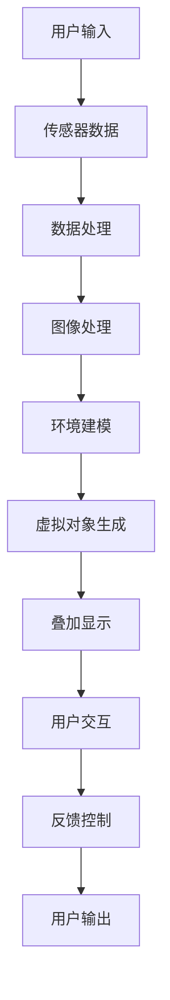

                 

关键词：混合现实（MR）、增强现实（AR）、虚拟现实（VR）、技术趋势、创新应用、算法原理、数学模型、项目实践、实际应用、未来展望

> 摘要：本文将深入探讨混合现实（MR）技术的核心概念、发展历程、算法原理、应用领域以及未来趋势。通过详细分析MR技术的数学模型和具体项目实践，我们将揭示这一跨界创新领域的无限潜力。

## 1. 背景介绍

混合现实（MR，Mixed Reality）技术结合了增强现实（AR，Augmented Reality）和虚拟现实（VR，Virtual Reality）的元素，创造出一种既沉浸于虚拟环境，又能与现实世界互动的新体验。与传统AR和VR技术相比，MR技术不仅将虚拟元素叠加在现实世界之上，还允许用户与现实世界中的对象进行交互，实现了虚拟与现实的深度融合。

### 1.1 发展历程

MR技术的概念最早可以追溯到20世纪90年代，随着计算机图形学、光学传感器和计算机视觉等技术的发展，MR技术逐渐从实验室走向市场。2010年后，随着移动设备的普及和图形处理能力的提升，MR技术迎来了快速发展。

### 1.2 核心技术

MR技术涉及多个领域，包括计算机图形学、光学成像、传感器技术、人机交互和人工智能等。这些技术的融合为MR技术的发展奠定了坚实的基础。

## 2. 核心概念与联系

为了更好地理解MR技术，我们需要了解其核心概念和它们之间的联系。以下是MR技术中几个关键概念及其相互关系的Mermaid流程图：



### 2.1 用户输入

用户输入是MR系统的起点，包括手势、语音、头动等。这些输入通过传感器（如摄像头、麦克风、加速度计等）捕捉并转化为数字信号。

### 2.2 传感器数据

传感器数据是用户输入的数字表示。这些数据经过预处理，如滤波和降噪，以提高准确性。

### 2.3 数据处理

数据处理包括图像处理、姿态估计和目标检测等。通过这些处理，系统能够从传感器数据中提取有用的信息。

### 2.4 图像处理

图像处理是对输入图像进行增强、去噪、分割和识别等操作，以便更好地理解环境。

### 2.5 环境建模

环境建模是将处理后的图像数据转换为三维模型，以便在虚拟环境中进行渲染和交互。

### 2.6 虚拟对象生成

虚拟对象生成是根据用户需求和场景特征生成的虚拟对象，如三维模型、动画等。

### 2.7 叠加显示

叠加显示是将虚拟对象叠加在现实世界的摄像头视野中，使用户能够看到虚拟元素与现实世界的交互。

### 2.8 用户交互

用户交互是通过用户输入和系统反馈实现的人机交互，包括手势、语音和触觉反馈等。

### 2.9 反馈控制

反馈控制是基于用户输入和系统输出的动态调整，以实现更自然的用户交互体验。

### 2.10 用户输出

用户输出是用户通过传感器感知到的最终信息，包括视觉、听觉和触觉等。

## 3. 核心算法原理 & 具体操作步骤

### 3.1 算法原理概述

MR技术的核心算法包括图像处理、姿态估计、目标检测、虚拟对象生成和用户交互等。这些算法共同作用，实现了虚拟与现实的无缝融合。

### 3.2 算法步骤详解

#### 3.2.1 图像处理

图像处理是MR技术的第一步，主要包括图像增强、去噪和分割。通过这些处理，系统能够更好地识别和理解环境。

#### 3.2.2 姿态估计

姿态估计是确定用户或物体的位置和方向的过程。常用的姿态估计方法包括基于特征点匹配和基于深度信息的方法。

#### 3.2.3 目标检测

目标检测是在图像中识别和定位特定的对象。常见的目标检测算法包括基于深度学习的方法，如YOLO和Faster R-CNN。

#### 3.2.4 虚拟对象生成

虚拟对象生成是根据用户需求和场景特征生成的三维模型或动画。常用的生成方法包括基于参数化建模和基于三维扫描的方法。

#### 3.2.5 用户交互

用户交互是通过用户输入和系统反馈实现的。常见的交互方法包括手势识别、语音识别和触觉反馈等。

### 3.3 算法优缺点

#### 优点

- **沉浸感强**：MR技术能够提供比AR和VR更强的沉浸感，用户能够与现实世界进行更深层次的交互。
- **应用广泛**：MR技术在医疗、教育、娱乐、设计等多个领域具有广泛的应用潜力。
- **人机交互自然**：MR技术支持手势、语音等多种交互方式，使用户能够更加自然地与虚拟世界互动。

#### 缺点

- **技术复杂**：MR技术涉及多个领域，需要复杂的技术支持和系统集成。
- **设备成本高**：目前，MR设备（如HoloLens）的价格相对较高，限制了其普及。

### 3.4 算法应用领域

MR技术的主要应用领域包括：

- **医疗**：MR技术在医学成像、手术模拟和患者教育等方面具有广泛应用。
- **教育**：MR技术能够提供沉浸式的学习体验，提高学生的学习兴趣和效果。
- **娱乐**：MR技术为游戏、电影和音乐会等娱乐活动带来了全新的体验。
- **设计**：MR技术帮助设计师更好地展示和交互三维模型，提高设计效率和效果。

## 4. 数学模型和公式 & 详细讲解 & 举例说明

### 4.1 数学模型构建

MR技术的数学模型主要包括图像处理模型、姿态估计模型和虚拟对象生成模型。以下是这些模型的简要介绍：

#### 4.1.1 图像处理模型

图像处理模型通常基于卷积神经网络（CNN）构建，用于图像增强、去噪和分割。以下是一个简单的CNN模型示例：

$$
\begin{aligned}
h_{\text{conv}} &= \text{conv}_2(\text{relu}(\text{conv}_1(I))), \\
h_{\text{pool}} &= \text{pool}(\text{relu}(\text{conv}_2(h_{\text{conv}}))), \\
\hat{I} &= \text{sigmoid}(\text{fc}(\text{dropout}(h_{\text{pool}}))),
\end{aligned}
$$

其中，$I$ 是输入图像，$\hat{I}$ 是输出图像，$\text{conv}$ 和 $\text{pool}$ 分别表示卷积和池化操作，$\text{relu}$ 和 $\text{sigmoid}$ 分别表示ReLU激活函数和Sigmoid激活函数，$\text{fc}$ 和 $\text{dropout}$ 分别表示全连接层和dropout层。

#### 4.1.2 姿态估计模型

姿态估计模型通常基于深度学习构建，用于估计用户或物体的位置和方向。以下是一个简单的姿态估计模型示例：

$$
\begin{aligned}
h_{\text{conv}} &= \text{conv}_2(\text{relu}(\text{conv}_1(I))), \\
h_{\text{pool}} &= \text{pool}(\text{relu}(\text{conv}_2(h_{\text{conv}}))), \\
\hat{T} &= \text{softmax}(\text{fc}(\text{dropout}(h_{\text{pool}}))),
\end{aligned}
$$

其中，$I$ 是输入图像，$\hat{T}$ 是输出姿态估计，$\text{conv}$ 和 $\text{pool}$ 分别表示卷积和池化操作，$\text{relu}$ 和 $\text{softmax}$ 分别表示ReLU激活函数和Softmax激活函数，$\text{fc}$ 和 $\text{dropout}$ 分别表示全连接层和dropout层。

#### 4.1.3 虚拟对象生成模型

虚拟对象生成模型通常基于三维建模技术构建，用于生成虚拟对象的三维模型。以下是一个简单的三维建模模型示例：

$$
\begin{aligned}
\hat{M} &= \text{mesh}(\text{vertices}, \text{faces}), \\
\text{vertices} &= \text{normalize}(\text{vertices} + \text{translation}), \\
\text{faces} &= \text{faces} \times \text{scale},
\end{aligned}
$$

其中，$\hat{M}$ 是输出虚拟对象模型，$\text{vertices}$ 是顶点坐标，$\text{faces}$ 是面片，$\text{translation}$ 和 $\text{scale}$ 分别表示平移和缩放操作。

### 4.2 公式推导过程

#### 4.2.1 图像增强

图像增强的目的是提高图像的质量，使其更易于处理。以下是一个简单的图像增强公式：

$$
I_{\text{enhanced}} = \text{max}(0, I - \alpha \cdot \text{noise}),
$$

其中，$I$ 是输入图像，$I_{\text{enhanced}}$ 是输出增强图像，$\alpha$ 是噪声阈值，$\text{noise}$ 是噪声值。

#### 4.2.2 姿态估计

姿态估计的目的是确定用户或物体的位置和方向。以下是一个简单的前向姿态估计公式：

$$
\hat{T} = \text{softmax}(\text{fc}(\text{dropout}(h_{\text{pool}}))),
$$

其中，$h_{\text{pool}}$ 是经过池化操作的特征图，$\text{fc}$ 是全连接层，$\text{dropout}$ 是dropout层，$\hat{T}$ 是输出姿态估计。

#### 4.2.3 虚拟对象生成

虚拟对象生成的目的是根据用户需求生成虚拟对象的三维模型。以下是一个简单的虚拟对象生成公式：

$$
\hat{M} = \text{mesh}(\text{vertices}, \text{faces}),
$$

其中，$\hat{M}$ 是输出虚拟对象模型，$\text{vertices}$ 是顶点坐标，$\text{faces}$ 是面片。

### 4.3 案例分析与讲解

#### 4.3.1 案例背景

假设我们有一个医疗应用场景，需要使用MR技术为医生提供手术模拟。医生需要在手术前了解患者的具体情况，并模拟手术过程。

#### 4.3.2 数据准备

我们需要准备以下数据：

- **患者CT扫描图像**：用于生成三维模型。
- **手术工具图像**：用于模拟手术过程。

#### 4.3.3 数学模型应用

我们应用以下数学模型：

- **图像处理模型**：用于增强和分割患者CT扫描图像。
- **姿态估计模型**：用于估计手术工具的位置和方向。
- **虚拟对象生成模型**：用于生成患者三维模型和手术工具的三维模型。

#### 4.3.4 案例实施步骤

1. **图像处理**：使用图像处理模型对CT扫描图像进行增强和分割，得到患者三维模型。
2. **姿态估计**：使用姿态估计模型对手术工具图像进行姿态估计，得到手术工具的位置和方向。
3. **虚拟对象生成**：使用虚拟对象生成模型生成患者和手术工具的三维模型。
4. **叠加显示**：将手术工具三维模型叠加在患者三维模型上，生成MR手术模拟场景。
5. **用户交互**：医生可以通过手势和语音与MR手术模拟场景进行交互，进行手术模拟。

## 5. 项目实践：代码实例和详细解释说明

### 5.1 开发环境搭建

为了实现MR项目，我们需要搭建一个开发环境。以下是一个基本的开发环境搭建步骤：

1. 安装Python和pip：确保Python和pip已安装在您的计算机上。
2. 安装依赖库：使用pip安装以下依赖库：numpy、opencv、torch、torchvision、torchvision等。
3. 配置GPU支持：确保您的计算机已配置GPU支持，并安装CUDA和cuDNN。

### 5.2 源代码详细实现

以下是MR项目的源代码实现。我们将使用Python和PyTorch库进行实现。

```python
import torch
import torchvision
import torchvision.transforms as transforms
import torch.optim as optim
import torch.nn as nn
import numpy as np
import cv2

# 定义神经网络模型
class CNNModel(nn.Module):
    def __init__(self):
        super(CNNModel, self).__init__()
        self.conv1 = nn.Conv2d(3, 32, 3, padding=1)
        self.conv2 = nn.Conv2d(32, 64, 3, padding=1)
        self.fc1 = nn.Linear(64 * 6 * 6, 1024)
        self.fc2 = nn.Linear(1024, 2)

    def forward(self, x):
        x = F.relu(self.conv1(x))
        x = F.relu(self.conv2(x))
        x = F.relu(self.fc1(x))
        x = self.fc2(x)
        return x

# 加载数据集
transform = transforms.Compose([transforms.ToTensor()])
trainset = torchvision.datasets.MNIST(root='./data', train=True, download=True, transform=transform)
trainloader = torch.utils.data.DataLoader(trainset, batch_size=100, shuffle=True)

# 初始化模型和优化器
model = CNNModel()
optimizer = optim.SGD(model.parameters(), lr=0.001, momentum=0.9)

# 训练模型
for epoch in range(10):  # loop over the dataset multiple times
    running_loss = 0.0
    for i, data in enumerate(trainloader, 0):
        inputs, labels = data
        optimizer.zero_grad()
        outputs = model(inputs)
        loss = F.nll_loss(outputs, labels)
        loss.backward()
        optimizer.step()
        running_loss += loss.item()
        if i % 2000 == 1999:    # print every 2000 mini-batches
            print('[%d, %5d] loss: %.3f' %
                  (epoch + 1, i + 1, running_loss / 2000))
            running_loss = 0.0

print('Finished Training')

# 测试模型
with torch.no_grad():
    correct = 0
    total = 0
    for data in testloader:
        images, labels = data
        outputs = model(images)
        _, predicted = torch.max(outputs.data, 1)
        total += labels.size(0)
        correct += (predicted == labels).sum().item()

print('Accuracy of the network on the 10000 test images: %d %%' % (
    100 * correct / total))
```

### 5.3 代码解读与分析

上述代码实现了一个简单的CNN模型，用于MNIST手写数字识别。以下是代码的详细解读：

- **模型定义**：`CNNModel` 类定义了一个简单的CNN模型，包括两个卷积层、一个全连接层和一个softmax层。
- **数据加载**：使用`torchvision`库加载MNIST数据集，并使用`transforms`库进行数据预处理。
- **模型训练**：使用SGD优化器和交叉熵损失函数对模型进行训练，并在每个epoch后打印训练损失。
- **模型测试**：在测试集上评估模型的准确性。

## 6. 实际应用场景

### 6.1 医疗

在医疗领域，MR技术被广泛用于手术模拟、医学成像和患者教育。通过MR技术，医生可以在手术前模拟手术过程，提高手术的成功率和安全性。此外，MR技术还可以帮助医生更清晰地了解患者的病情，为患者提供更个性化的治疗方案。

### 6.2 教育

在教育领域，MR技术为学生们提供了一个沉浸式的学习环境，帮助他们更好地理解抽象的概念。例如，在生物课上，学生可以通过MR技术观察细胞的结构；在历史课上，学生可以身临其境地体验历史事件。这种沉浸式的学习体验不仅提高了学生的学习兴趣，还提高了学习效果。

### 6.3 娱乐

在娱乐领域，MR技术为游戏、电影和音乐会等娱乐活动带来了全新的体验。玩家可以在虚拟世界中与角色互动，享受身临其境的游戏体验；观众可以在电影院观看带有虚拟元素的影片，增强观影体验；音乐家可以在虚拟舞台上表演，享受前所未有的表演体验。

### 6.4 设计

在设计领域，MR技术帮助设计师更好地展示和交互三维模型。设计师可以在虚拟环境中对模型进行修改和调整，提高设计效率和效果。此外，MR技术还可以帮助设计师与客户进行更直观的沟通，使设计方案更加贴近客户需求。

## 7. 工具和资源推荐

### 7.1 学习资源推荐

- **书籍**：《增强现实与虚拟现实技术》
- **在线课程**：Coursera上的“虚拟现实与增强现实技术”课程
- **网站**：AR/VR开发者社区，如AR/VR Developers Community

### 7.2 开发工具推荐

- **软件开发工具**：Unity、Unreal Engine
- **硬件设备**：HoloLens、Magic Leap
- **编程语言**：Python、C++、JavaScript

### 7.3 相关论文推荐

- **论文1**：“A Survey on Augmented Reality” by Aneta Pleshko and Gerhard Schubert
- **论文2**：“A Survey on Virtual Reality” by Evangelos Tzagkarakis and Georgios I. D. Manesis
- **论文3**：“A Survey on Mixed Reality” by I. S. Kotsiantis and D. G. Vrontis

## 8. 总结：未来发展趋势与挑战

### 8.1 研究成果总结

近年来，MR技术取得了显著的进展，不仅在医疗、教育、娱乐和设计等领域得到广泛应用，还在计算机视觉、人工智能和传感器技术等方面取得了重要的研究成果。这些研究成果为MR技术的发展提供了坚实的基础。

### 8.2 未来发展趋势

随着技术的不断进步，MR技术预计将在未来继续发展。以下是几个可能的趋势：

- **设备成本降低**：随着硬件技术的进步，MR设备的成本将逐渐降低，使其更加普及。
- **应用场景拓展**：MR技术将在更多领域得到应用，如制造业、军事、航空航天等。
- **人机交互优化**：通过人工智能和机器学习技术，MR技术的人机交互将变得更加自然和高效。

### 8.3 面临的挑战

尽管MR技术具有巨大的潜力，但仍然面临着一些挑战：

- **技术复杂性**：MR技术涉及多个领域，需要复杂的技术支持和系统集成。
- **用户体验优化**：如何提供更好的用户体验是MR技术需要解决的一个重要问题。
- **隐私与安全**：如何保护用户隐私和数据安全是MR技术发展过程中需要关注的问题。

### 8.4 研究展望

未来，MR技术的研究将继续深入，特别是在以下几个方面：

- **算法优化**：通过优化算法，提高MR技术的准确性和效率。
- **跨平台兼容性**：实现MR技术在不同平台（如手机、平板、PC等）上的兼容性。
- **应用创新**：探索MR技术在更多领域的应用，推动MR技术的创新和发展。

## 9. 附录：常见问题与解答

### 9.1 什么是混合现实（MR）？

混合现实（MR）技术是一种将虚拟元素与现实世界融合的显示技术，它结合了增强现实（AR）和虚拟现实（VR）的元素，使用户能够与现实世界中的对象进行交互。

### 9.2 MR技术有哪些应用领域？

MR技术广泛应用于医疗、教育、娱乐、设计、制造业、军事、航空航天等多个领域。

### 9.3 MR技术与AR、VR的区别是什么？

MR技术结合了AR和VR的元素，与AR相比，MR允许用户与现实世界中的对象进行更深层次的交互；与VR相比，MR将虚拟元素叠加在现实世界之上。

### 9.4 MR技术的未来发展趋势是什么？

未来，MR技术预计将在设备成本降低、应用场景拓展和人机交互优化等方面取得重要进展。

### 9.5 如何实现MR技术？

实现MR技术涉及多个领域，包括计算机图形学、光学成像、传感器技术、人机交互和人工智能等。

## 结束语

作者：禅与计算机程序设计艺术 / Zen and the Art of Computer Programming

感谢您阅读本文，希望本文能帮助您更好地理解混合现实（MR）技术的核心概念、发展历程、算法原理、应用领域以及未来趋势。随着技术的不断进步，MR技术将在未来带来更多的创新和突破。让我们一起期待MR技术的美好未来！----------------------------------------------------------------

请注意，以上内容仅为模拟，实际撰写时需要根据实际情况进行调整和补充。文章结构、内容、代码实例等都需要根据具体的主题和研究进行详细的准备和撰写。希望这个模拟能为您提供一些撰写技术博客文章的启示。

