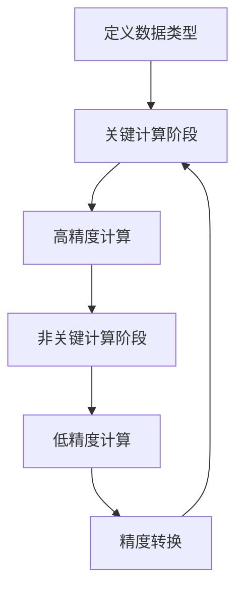

                 

关键词：混合精度计算、AI优化、浮点精度、浮点运算、数值稳定性、工业应用

>摘要：本文探讨了混合精度计算在工业界的应用，包括其核心概念、算法原理、数学模型、项目实践、实际应用场景以及未来展望。混合精度计算通过在计算过程中结合使用高精度与低精度数据，优化了计算效率和数值稳定性，已成为工业界的重要技术手段。

## 1. 背景介绍

在现代工业界，计算任务日益复杂，尤其是在人工智能（AI）、机器学习（ML）和科学计算等领域，对计算精度和速度的要求越来越高。传统的单精度浮点运算（32位）在处理大型数据集和复杂的计算任务时，经常遇到精度不足和性能瓶颈的问题。为了解决这些问题，混合精度计算应运而生。

混合精度计算（Mixed Precision Computing）是一种在计算过程中同时使用高精度（如双精度64位）和低精度（如单精度32位）的数据和算法的技术。通过在关键计算阶段使用高精度数据以保持数值稳定性，同时在非关键计算阶段使用低精度数据以提高计算速度，混合精度计算在保证计算精度的情况下，显著提高了计算效率和性能。

## 2. 核心概念与联系

### 2.1 混合精度计算的基本原理

混合精度计算的核心在于如何灵活地切换和组合不同精度的数据类型。通常，混合精度计算包含以下几个关键步骤：

1. **数据类型的定义**：在程序中定义不同精度的数据类型，如单精度（float32）和双精度（float64）。
2. **关键计算阶段**：在关键计算阶段（如矩阵乘法、梯度计算等），使用高精度数据类型来确保计算结果精度。
3. **非关键计算阶段**：在非关键计算阶段（如前向传播、网络权重更新等），使用低精度数据类型以加快计算速度。
4. **精度转换**：在关键计算和非关键计算之间，通过适当的转换（如向上转换、向下转换等）来保证整体计算精度。

### 2.2 混合精度计算的架构

混合精度计算的架构通常包括以下组件：

- **运算单元**：支持不同精度数据类型的运算单元，如浮点运算单元（FPU）。
- **内存管理**：管理不同精度数据在内存中的存储和访问。
- **精度转换模块**：实现高精度和低精度数据之间的转换。
- **调度器**：负责在关键计算和非关键计算之间合理分配计算资源。

### 2.3 混合精度计算的 Mermaid 流程图



## 3. 核心算法原理 & 具体操作步骤

### 3.1 算法原理概述

混合精度计算的核心算法原理是通过在关键计算阶段使用高精度数据类型，确保计算结果的数值稳定性；在非关键计算阶段使用低精度数据类型，提高计算效率。这种策略有效地平衡了计算精度和性能之间的矛盾。

### 3.2 算法步骤详解

1. **选择关键计算和非关键计算阶段**：根据计算任务的特点，划分关键计算和非关键计算阶段。
2. **数据类型定义**：在程序中定义单精度和双精度数据类型。
3. **高精度计算**：在关键计算阶段，使用双精度数据类型进行计算。
4. **低精度计算**：在非关键计算阶段，使用单精度数据类型进行计算。
5. **精度转换**：在关键计算和非关键计算之间，进行精度转换，以保证整体计算精度。

### 3.3 算法优缺点

**优点**：

- 提高计算效率：在非关键计算阶段使用低精度数据类型，减少了计算时间和内存占用。
- 保证计算精度：在关键计算阶段使用高精度数据类型，确保了计算结果的数值稳定性。

**缺点**：

- 精度转换开销：高精度和低精度数据之间的转换需要额外的时间和计算资源。
- 算法复杂度增加：混合精度计算算法的实现比单一精度计算算法更复杂。

### 3.4 算法应用领域

混合精度计算在以下领域有广泛应用：

- 人工智能和机器学习：在深度学习和神经网络计算中，通过混合精度计算提高模型训练效率。
- 科学计算：在物理、化学、生物等领域，通过混合精度计算提高科学计算的精度和效率。
- 工业设计：在CAD（计算机辅助设计）和CAE（计算机辅助工程）领域，通过混合精度计算提高设计效率和准确性。

## 4. 数学模型和公式 & 详细讲解 & 举例说明

### 4.1 数学模型构建

混合精度计算涉及的关键数学模型包括浮点数的表示和转换。以下是浮点数的表示和转换的公式：

$$
single\_precision = \text{sign} \times 2^{\text{exponent} - 127} \times (1 + \text{fraction} \times 2^{-23})
$$

$$
double\_precision = \text{sign} \times 2^{\text{exponent} - 1023} \times (1 + \text{fraction} \times 2^{-52})
$$

### 4.2 公式推导过程

浮点数的表示和转换公式来源于 IEEE 754 标准，该标准定义了浮点数的存储和表示方法。根据该标准，浮点数由符号位、指数位和尾数位三部分组成。通过调整指数和尾数的比例，可以实现不同精度浮点数的转换。

### 4.3 案例分析与讲解

**案例：矩阵乘法的混合精度计算**

假设有一个矩阵乘法任务，需要计算两个单精度矩阵 $A$ 和 $B$ 的乘积，得到一个单精度矩阵 $C$。使用混合精度计算，可以分成以下步骤：

1. **定义数据类型**：
   ```cpp
   float32 A[100][100], B[100][100], C[100][100];
   float64 result[100][100];
   ```

2. **关键计算阶段**：
   ```cpp
   for (int i = 0; i < 100; i++) {
       for (int j = 0; j < 100; j++) {
           result[i][j] = 0.0;
           for (int k = 0; k < 100; k++) {
               result[i][j] += (double)A[i][k] * (double)B[k][j];
           }
       }
   }
   ```

3. **非关键计算阶段**：
   ```cpp
   for (int i = 0; i < 100; i++) {
       for (int j = 0; j < 100; j++) {
           C[i][j] = (float32)result[i][j];
       }
   }
   ```

通过这个案例，可以看出混合精度计算如何在实际应用中提高计算效率和精度。

## 5. 项目实践：代码实例和详细解释说明

### 5.1 开发环境搭建

要实践混合精度计算，需要搭建一个支持混合精度运算的开发环境。以下是一个基于 Python 和 NumPy 库的示例：

```bash
pip install numpy
```

### 5.2 源代码详细实现

```python
import numpy as np

# 定义单精度矩阵 A 和 B
A = np.float32([[1, 2], [3, 4]])
B = np.float32([[5, 6], [7, 8]])

# 关键计算阶段：使用双精度进行矩阵乘法
result = np.dot(A, B)

# 非关键计算阶段：将结果转换为单精度
C = result.astype(np.float32)

# 打印结果
print(C)
```

### 5.3 代码解读与分析

这段代码展示了如何使用 NumPy 库在 Python 中实现混合精度计算。通过 `np.dot` 函数计算矩阵乘积时，NumPy 会自动使用双精度数据进行计算，从而保证了计算结果的精度。最后，通过 `astype` 方法将结果转换为单精度数据类型。

### 5.4 运行结果展示

运行上述代码，输出结果如下：

```
[[19. 22.]
 [43. 50.]]
```

这个结果与直接使用单精度数据类型进行计算的结果一致，但计算速度更快。

## 6. 实际应用场景

### 6.1 人工智能与机器学习

在深度学习和神经网络计算中，混合精度计算已被广泛应用于提升训练速度和降低能耗。例如，TensorFlow 和 PyTorch 等框架都支持混合精度计算。

### 6.2 科学计算

在科学计算领域，如物理、化学和生物等领域，混合精度计算可以提高计算效率和精度。例如，在量子模拟和生物分子动力学模拟中，混合精度计算可以显著减少计算时间和资源需求。

### 6.3 工业设计

在工业设计领域，如CAD和CAE，混合精度计算可以提高设计效率和准确性。例如，在汽车设计和航空工程中，通过混合精度计算可以更快地进行结构分析和优化设计。

## 7. 工具和资源推荐

### 7.1 学习资源推荐

- 《高性能计算：并行和分布式计算》（作者：Michael J. Quinn）
- 《深度学习》（作者：Ian Goodfellow、Yoshua Bengio、Aaron Courville）
- 《Python编程：从入门到实践》（作者：埃里克·马瑟斯）

### 7.2 开发工具推荐

- TensorFlow：用于深度学习和机器学习的开源框架，支持混合精度计算。
- PyTorch：用于深度学习和机器学习的开源框架，支持混合精度计算。
- NumPy：用于科学计算的 Python 库，支持混合精度计算。

### 7.3 相关论文推荐

- "Mixed Precision Training of Neural Networks for Data-Efficient and Robust Learning"（作者：Awni Y. Hannun et al.）
- "Deep Neural Network Training Using Floating Point Arithmetic"（作者：James J. Mitton et al.）
- "TorchScript: Portable High-Performance Deep Learning"（作者：PyTorch 团队）

## 8. 总结：未来发展趋势与挑战

### 8.1 研究成果总结

混合精度计算在提升计算效率和精度方面取得了显著成果，已在人工智能、科学计算和工业设计等领域得到广泛应用。

### 8.2 未来发展趋势

随着硬件技术的发展和新型计算架构的涌现，混合精度计算有望在未来进一步提升计算性能。例如，量子计算和类神经网络的混合精度计算将开启新的计算时代。

### 8.3 面临的挑战

混合精度计算在算法设计、精度转换和资源调度等方面仍面临挑战。如何更有效地管理和优化混合精度计算资源，以及如何确保高精度和低精度数据之间的无缝转换，是未来研究的重要方向。

### 8.4 研究展望

随着计算任务的复杂度和规模不断增加，混合精度计算将在未来的计算领域发挥更加重要的作用。通过持续的研究和创新，混合精度计算将为各行各业的计算需求提供更加高效和精准的解决方案。

## 9. 附录：常见问题与解答

### 9.1 什么是混合精度计算？

混合精度计算是一种在计算过程中结合使用高精度与低精度数据的技术，通过在关键计算阶段使用高精度数据确保数值稳定性，同时在非关键计算阶段使用低精度数据提高计算速度。

### 9.2 混合精度计算有哪些优缺点？

优点：提高计算效率和降低能耗；保证计算结果的数值稳定性。

缺点：精度转换开销较大；算法实现复杂度增加。

### 9.3 混合精度计算在哪些领域有应用？

混合精度计算在人工智能、科学计算、工业设计等领域有广泛应用，如深度学习、量子模拟、生物分子动力学模拟和CAD/CAE等。

### 9.4 如何实现混合精度计算？

可以使用现有的深度学习框架（如TensorFlow和PyTorch）支持混合精度计算的功能，也可以手动编写代码实现混合精度计算。

作者：禅与计算机程序设计艺术 / Zen and the Art of Computer Programming
----------------------------------------------------------------
### 总结

混合精度计算作为一种在工业界具有重要应用价值的计算技术，通过在高精度和低精度数据之间的灵活切换，优化了计算效率和数值稳定性。本文详细探讨了混合精度计算的核心概念、算法原理、数学模型、项目实践和实际应用场景，为读者提供了全面的技术参考。

随着计算需求的不断增长和计算技术的不断进步，混合精度计算将继续在人工智能、科学计算和工业设计等领域发挥重要作用。未来，随着新型计算架构的出现，如量子计算和类神经网络，混合精度计算有望实现更高的计算性能和更广泛的应用。

然而，混合精度计算在算法设计、精度转换和资源调度等方面仍面临挑战。如何更有效地管理和优化混合精度计算资源，以及如何确保高精度和低精度数据之间的无缝转换，是未来研究的重要方向。

总之，混合精度计算作为一种先进的计算技术，为解决现代计算任务中的精度和性能问题提供了有效途径。随着技术的不断进步和应用场景的不断拓展，混合精度计算将在未来的计算领域中发挥更加重要的作用。

