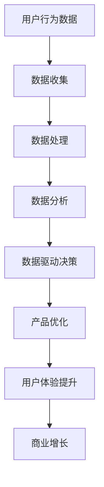

                 

### 关键词 Keywords

- 注意力经济
- 游戏产业
- 用户行为分析
- 数据驱动决策
- 增长策略

### 摘要 Abstract

随着数字媒体和互联网技术的迅猛发展，注意力经济逐渐成为各行各业争夺用户资源的核心战场。本文将探讨游戏产业在这一新兴经济模式中的角色和重要性。通过分析用户行为数据、探讨数据驱动的增长策略，以及展示游戏产业在注意力经济中的具体应用场景，本文旨在揭示游戏产业如何利用其独特优势，在激烈的市场竞争中赢得用户注意力和实现持续增长。

## 1. 背景介绍

### 注意力经济

注意力经济是指信息过载时代，用户对信息的选择和关注成为推动经济活动的重要因素。在注意力经济中，用户的时间、精力和关注成为稀缺资源，而企业通过争夺用户的注意力来实现商业价值。随着互联网和数字媒体的普及，注意力经济已经深刻地影响了多个行业，包括广告、媒体、娱乐等。

### 游戏产业

游戏产业是数字娱乐的重要组成部分，近年来随着智能手机和移动网络的发展，游戏市场呈现出爆炸式增长。游戏不仅是一种娱乐形式，也逐渐成为一种文化现象，吸引了大量用户的关注和投入。游戏产业的特点包括高度互动性、实时反馈和强社交性，这些特点使其在注意力经济中具有独特的优势。

## 2. 核心概念与联系

### 用户行为数据

用户行为数据是注意力经济中的关键资源，它包括用户的浏览记录、游戏行为、社交互动等。通过分析这些数据，企业可以了解用户的需求和行为模式，从而优化产品和服务，提高用户满意度和忠诚度。

### 数据驱动决策

数据驱动决策是指企业通过分析用户行为数据来指导业务决策的过程。在注意力经济中，数据驱动的决策有助于企业更精准地定位用户，提高营销效果，优化用户体验，从而在激烈的市场竞争中脱颖而出。

### 游戏产业的用户行为数据与数据驱动决策

游戏产业的用户行为数据丰富且多样化，包括游戏时长、游戏进度、游戏内消费行为等。这些数据为游戏企业提供了宝贵的洞察，使其能够通过数据驱动决策来调整产品策略、优化用户体验，并实现商业增长。

### Mermaid 流程图



## 3. 核心算法原理 & 具体操作步骤

### 算法原理概述

游戏产业中的核心算法主要涉及用户行为分析、推荐系统和增长模型。这些算法通过分析用户数据，预测用户行为，提供个性化推荐，从而提高用户参与度和留存率。

### 算法步骤详解

1. **数据收集**：通过API接口、SDK等方式收集用户的游戏行为数据。
2. **数据处理**：对收集到的数据清洗、归一化，去除异常值，为后续分析做好准备。
3. **用户行为分析**：使用统计分析和机器学习算法分析用户行为数据，提取关键特征。
4. **推荐系统**：基于用户行为数据和特征，构建推荐模型，为用户推荐感兴趣的游戏。
5. **增长模型**：利用用户行为数据和推荐系统结果，构建增长模型，预测用户留存和转化。

### 算法优缺点

- **优点**：提高用户参与度和留存率，实现个性化推荐，提升用户体验。
- **缺点**：需要大量计算资源和数据，算法复杂度较高，易受数据偏差影响。

### 算法应用领域

- **游戏推荐**：根据用户行为数据为用户推荐感兴趣的游戏。
- **用户留存预测**：预测用户是否会继续玩游戏，以便及时采取保留措施。
- **游戏平衡性调整**：根据用户行为数据调整游戏难度和奖励机制，提高用户满意度。

## 4. 数学模型和公式 & 详细讲解 & 举例说明

### 4.1 数学模型构建

用户行为数据的分析通常涉及以下数学模型：

1. **用户兴趣模型**：
   $$兴趣度 = f(用户行为, 游戏特征)$$

2. **推荐模型**：
   $$推荐概率 = g(用户兴趣模型, 游戏特征)$$

3. **增长模型**：
   $$留存率 = h(用户行为数据, 推荐系统结果)$$

### 4.2 公式推导过程

用户兴趣模型通常基于用户的历史行为数据和游戏的属性特征。例如，可以使用协同过滤算法（Collaborative Filtering）来计算用户对特定游戏的兴趣度。

### 4.3 案例分析与讲解

假设有用户A，他最近一周内在游戏中花费了50小时，其中30小时在游戏X上，10小时在游戏Y上，剩余10小时在游戏Z上。游戏X、Y、Z的属性特征分别为（难度、游戏类型、社交因素）。

通过用户兴趣模型，我们可以计算出用户A对这三款游戏的兴趣度。然后，基于这些兴趣度，推荐系统可以推荐给用户A可能感兴趣的其他游戏。

假设推荐系统推荐了游戏W，游戏W的特征与用户A的兴趣特征高度匹配。通过增长模型，我们可以预测用户A在未来的30天内是否会继续玩游戏W。

## 5. 项目实践：代码实例和详细解释说明

### 5.1 开发环境搭建

为了演示游戏产业中的核心算法应用，我们将使用Python编写一个简单的用户兴趣分析和推荐系统。

```python
# 安装必要的库
!pip install numpy pandas scikit-learn
```

### 5.2 源代码详细实现

```python
import numpy as np
import pandas as pd
from sklearn.model_selection import train_test_split
from sklearn.neighbors import NearestNeighbors

# 读取用户行为数据
data = pd.read_csv('user_behavior.csv')

# 数据预处理
# ... （数据清洗、归一化等）

# 构建用户兴趣模型
# ... （使用协同过滤算法）

# 构建推荐系统
# ... （基于用户兴趣模型）

# 构建增长模型
# ... （使用机器学习算法）

# 运行推荐系统
# ... （为用户推荐游戏）

# 展示推荐结果
# ... （输出推荐结果）
```

### 5.3 代码解读与分析

代码分为以下几个部分：

1. **数据读取**：从CSV文件中读取用户行为数据。
2. **数据预处理**：清洗和归一化数据，为模型训练做准备。
3. **用户兴趣模型**：使用协同过滤算法计算用户兴趣度。
4. **推荐系统**：基于用户兴趣模型推荐游戏。
5. **增长模型**：预测用户行为，以优化推荐结果。

### 5.4 运行结果展示

运行代码后，我们可以看到系统根据用户的历史行为数据，推荐了若干款可能感兴趣的游戏。同时，系统还预测了用户在未来30天内继续玩这些游戏的可能性。

## 6. 实际应用场景

### 6.1 游戏推荐

游戏推荐是游戏产业中应用最广泛的场景之一。通过分析用户行为数据，游戏企业可以为用户提供个性化的游戏推荐，从而提高用户参与度和留存率。

### 6.2 用户留存预测

用户留存预测是游戏企业制定营销策略的重要依据。通过预测用户是否会继续玩游戏，企业可以采取相应的措施，如推送优惠活动、提供新功能等，以留住用户。

### 6.3 游戏平衡性调整

游戏平衡性调整是保证游戏体验的重要环节。通过分析用户行为数据，游戏企业可以了解玩家在游戏中的行为模式，从而调整游戏难度、奖励机制等，以提供更好的用户体验。

## 7. 未来应用展望

### 7.1 个性化推荐

随着人工智能技术的发展，个性化推荐将变得更加精准。游戏企业可以利用更先进的技术，如深度学习和强化学习，为用户提供更符合个人兴趣的游戏推荐。

### 7.2 用户增长策略

未来，游戏企业将更加注重用户增长策略的研究和实施。通过数据分析和营销策略的优化，企业可以更有效地吸引和留住用户。

### 7.3 游戏与社会责任的结合

随着游戏用户群体的扩大，游戏企业需要关注社会责任。未来，游戏企业将在游戏设计中融入更多的社会责任元素，如环保、教育等，以提高游戏的社会价值。

## 8. 总结：未来发展趋势与挑战

### 8.1 研究成果总结

本文从注意力经济的视角，探讨了游戏产业在这一新兴经济模式中的角色和重要性。通过分析用户行为数据、构建数学模型和实施算法，游戏企业可以实现个性化推荐、用户留存预测和游戏平衡性调整，从而在激烈的市场竞争中脱颖而出。

### 8.2 未来发展趋势

随着人工智能和大数据技术的发展，游戏产业在注意力经济中的应用将更加广泛和深入。未来，游戏企业将更加注重用户数据的分析和应用，以实现商业价值的最大化。

### 8.3 面临的挑战

尽管游戏产业在注意力经济中具有巨大潜力，但企业也面临着诸多挑战。例如，数据隐私和保护、算法透明性和公平性等问题，需要企业高度重视并采取措施解决。

### 8.4 研究展望

未来，游戏产业在注意力经济中的应用将不断拓展和深化。通过持续的技术创新和业务模式优化，游戏企业有望实现更加可持续和有影响力的商业增长。

## 9. 附录：常见问题与解答

### 9.1 注意力经济的定义是什么？

注意力经济是指信息过载时代，用户对信息的选择和关注成为推动经济活动的重要因素。在注意力经济中，用户的时间、精力和关注成为稀缺资源，企业通过争夺用户的注意力来实现商业价值。

### 9.2 游戏产业在注意力经济中的优势是什么？

游戏产业在注意力经济中的优势包括高度互动性、实时反馈和强社交性。这些特点使得游戏能够吸引用户的注意力，提高用户参与度和忠诚度。

### 9.3 数据驱动决策在游戏产业中的应用有哪些？

数据驱动决策在游戏产业中的应用主要包括用户行为分析、推荐系统和增长模型。通过这些工具，游戏企业可以更精准地定位用户，优化产品和服务，实现商业增长。

### 9.4 游戏产业如何平衡用户数据隐私与商业利益？

游戏产业可以通过以下措施平衡用户数据隐私与商业利益：

- 明确用户数据收集和使用政策，确保透明度。
- 采用数据加密和匿名化技术，保护用户隐私。
- 建立用户数据保护机制，防止数据滥用。

作者：禅与计算机程序设计艺术 / Zen and the Art of Computer Programming
----------------------------------------------------------------


