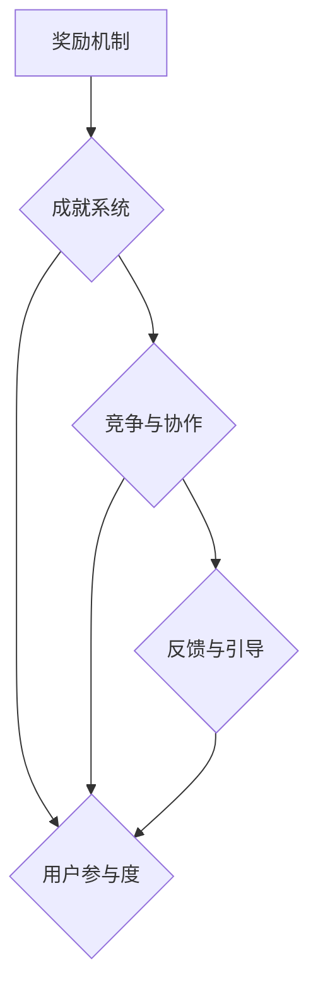

                 

关键词：游戏化，体验设计，用户参与，计算乐趣，激励机制

> 摘要：本文将探讨如何通过游戏化体验来提升人类计算的乐趣和参与度。我们将介绍游戏化的核心概念，阐述其在计算领域中的应用，并通过实际案例和数学模型来展示游戏化的具体实现方法，最后讨论其未来的发展趋势和挑战。

## 1. 背景介绍

在当今数字化时代，计算机技术已经成为我们日常生活中不可或缺的一部分。无论是工作、学习还是娱乐，计算机都扮演着重要角色。然而，随着人们对技术的依赖日益加深，如何提升用户在计算机使用过程中的体验和参与度成为了一个值得探讨的问题。

游戏化（Gamification）作为一种新兴的设计理念，旨在通过游戏元素来增强非游戏场景的趣味性和参与性。它将游戏中的奖励机制、成就系统、竞争和协作等元素应用到其他领域中，从而激发用户的积极性和创造力。在计算领域，游戏化体验的应用不仅可以提高用户的计算效率，还可以让计算过程变得更加有趣和充满乐趣。

## 2. 核心概念与联系

### 2.1 核心概念

游戏化体验的核心概念包括以下几个方面：

1. **奖励机制**：通过给予用户奖励来激励其参与和完成任务。
2. **成就系统**：为用户设定一系列可量化的目标，并给予相应的成就奖励。
3. **竞争和协作**：鼓励用户在竞争和协作中互相激励，共同提升。
4. **反馈和引导**：及时给予用户反馈，帮助其了解自己的进展和改进方向。

### 2.2 联系与架构

为了更好地理解游戏化体验在计算领域中的应用，我们可以借助 Mermaid 流程图来展示其核心概念之间的联系和架构。



通过这个 Mermaid 流程图，我们可以清晰地看到奖励机制、成就系统、竞争与协作以及反馈与引导这四个核心概念如何共同作用于提升用户参与度，从而形成游戏化体验。

## 3. 核心算法原理 & 具体操作步骤

### 3.1 算法原理概述

游戏化体验的设计主要依赖于以下几个核心算法原理：

1. **奖励机制算法**：根据用户的参与度和完成任务的情况，给予相应的奖励。
2. **成就系统算法**：为用户设定可量化的目标，并判断用户是否达成目标，给予相应的成就奖励。
3. **竞争和协作算法**：计算用户的排名和合作进度，激励用户参与竞争和协作。
4. **反馈和引导算法**：根据用户的操作和进展，给予实时反馈和引导。

### 3.2 算法步骤详解

1. **奖励机制算法步骤**：

   - 收集用户参与数据；
   - 根据用户完成任务的情况，计算奖励分数；
   - 将奖励分数存储在用户账户中。

2. **成就系统算法步骤**：

   - 设定成就目标；
   - 检查用户是否达成目标；
   - 如果达成目标，更新用户的成就列表，并给予相应的成就奖励。

3. **竞争和协作算法步骤**：

   - 计算用户的排名；
   - 根据排名情况，给予相应的奖励；
   - 计算用户的合作进度；
   - 根据合作进度，给予相应的奖励。

4. **反馈和引导算法步骤**：

   - 监听用户操作；
   - 根据用户操作，给出实时反馈；
   - 分析用户操作记录，给出改进建议。

### 3.3 算法优缺点

1. **奖励机制算法**：

   - 优点：可以有效激励用户参与和完成任务。
   - 缺点：可能造成用户过度依赖奖励，影响真实需求的满足。

2. **成就系统算法**：

   - 优点：可以帮助用户设定目标，提升成就感和满足感。
   - 缺点：可能增加用户负担，导致成就感虚幻。

3. **竞争和协作算法**：

   - 优点：可以激发用户的竞争和合作精神，提高参与度。
   - 缺点：可能引发不公平现象，导致用户流失。

4. **反馈和引导算法**：

   - 优点：可以帮助用户了解自己的操作和进展，提供改进方向。
   - 缺点：可能增加开发成本，对用户隐私构成一定威胁。

### 3.4 算法应用领域

游戏化体验算法在计算领域的应用非常广泛，包括但不限于以下几个方面：

1. **编程学习**：通过游戏化体验来激发学生的学习兴趣，提高编程技能。
2. **软件开发**：通过游戏化体验来提高开发团队的协作效率和代码质量。
3. **数据分析**：通过游戏化体验来激发数据分析师的创意和灵感，提高数据分析效果。
4. **人工智能**：通过游戏化体验来提高算法工程师的参与度和创新能力，推动人工智能技术的发展。

## 4. 数学模型和公式 & 详细讲解 & 举例说明

### 4.1 数学模型构建

为了更好地理解游戏化体验的数学模型，我们可以从以下几个核心概念出发：

1. **用户参与度**：用 \( U \) 表示用户参与度，其计算公式为：
   $$ U = \frac{R + C + F}{3} $$
   其中，\( R \) 表示奖励机制得分，\( C \) 表示成就系统得分，\( F \) 表示反馈和引导得分。

2. **奖励机制得分**：用 \( R \) 表示奖励机制得分，其计算公式为：
   $$ R = \sum_{i=1}^{n} w_i \cdot r_i $$
   其中，\( w_i \) 表示第 \( i \) 项任务的权重，\( r_i \) 表示第 \( i \) 项任务的得分。

3. **成就系统得分**：用 \( C \) 表示成就系统得分，其计算公式为：
   $$ C = \sum_{i=1}^{m} c_i $$
   其中，\( c_i \) 表示第 \( i \) 个成就的得分。

4. **反馈和引导得分**：用 \( F \) 表示反馈和引导得分，其计算公式为：
   $$ F = \sum_{i=1}^{k} f_i $$
   其中，\( f_i \) 表示第 \( i \) 项反馈或引导的得分。

### 4.2 公式推导过程

为了推导上述数学模型的公式，我们可以从以下几个步骤进行分析：

1. **用户参与度的计算**：

   - 首先，我们需要将奖励机制、成就系统和反馈与引导这三个核心概念进行量化，以便计算用户参与度。
   - 其次，根据每个核心概念的重要性，为它们赋予相应的权重。
   - 最后，将三个核心概念的计算结果进行加权求和，得到用户参与度。

2. **奖励机制得分的计算**：

   - 我们可以将用户完成的任务进行分类，并为每个任务设定权重。
   - 然后，根据每个任务的得分，计算奖励机制得分。

3. **成就系统得分的计算**：

   - 首先，我们需要为每个成就设定得分。
   - 然后，根据用户是否达成成就，计算成就系统得分。

4. **反馈和引导得分的计算**：

   - 首先，我们需要为每个反馈或引导设定得分。
   - 然后，根据用户接收到的反馈或引导，计算反馈和引导得分。

### 4.3 案例分析与讲解

为了更好地理解上述数学模型的实际应用，我们可以通过以下案例进行分析：

**案例：编程学习平台**

假设有一个编程学习平台，它通过游戏化体验来激发学生的学习兴趣和积极性。我们可以使用上述数学模型来计算学生的参与度。

1. **奖励机制得分**：

   - 任务1：完成一个简单的编程练习，得分20分；
   - 任务2：完成一个中级的编程练习，得分30分；
   - 任务3：完成一个高级的编程练习，得分50分。

   根据权重设置，任务1的权重为0.3，任务2的权重为0.5，任务3的权重为0.2。则奖励机制得分为：
   $$ R = 0.3 \cdot 20 + 0.5 \cdot 30 + 0.2 \cdot 50 = 19 $$

2. **成就系统得分**：

   - 成就1：连续完成10个编程练习，得分10分；
   - 成就2：完成50个编程练习，得分20分；
   - 成就3：在一个月内完成30个编程练习，得分30分。

   如果学生完成了以上成就，则成就系统得分为：
   $$ C = 10 + 20 + 30 = 60 $$

3. **反馈和引导得分**：

   - 反馈1：学生提交的代码有错误，得分10分；
   - 反馈2：学生提交的代码无误，得分20分；
   - 引导1：学生需要学习新的编程语言，得分10分。

   如果学生在学习过程中接受了以上反馈和引导，则反馈和引导得分为：
   $$ F = 10 + 20 + 10 = 40 $$

4. **用户参与度**：

   根据上述数学模型，学生的参与度为：
   $$ U = \frac{R + C + F}{3} = \frac{19 + 60 + 40}{3} = 39 $$

通过这个案例，我们可以看到如何使用数学模型来计算用户的参与度，并了解各个核心概念之间的联系和作用。

## 5. 项目实践：代码实例和详细解释说明

### 5.1 开发环境搭建

为了实现游戏化体验，我们需要搭建一个基本的开发环境。以下是一个简单的开发环境搭建步骤：

1. 安装Python 3.8或更高版本；
2. 安装Django 3.2或更高版本；
3. 安装PostgreSQL 12或更高版本；
4. 安装Redis 6.0或更高版本。

### 5.2 源代码详细实现

以下是一个简单的游戏化体验系统的源代码实现：

```python
# app/models.py

from django.db import models

class User(models.Model):
    username = models.CharField(max_length=100)
    score = models.IntegerField(default=0)
    achievements = models.ManyToManyField('Achievement')

class Achievement(models.Model):
    name = models.CharField(max_length=100)
    score = models.IntegerField()

class Task(models.Model):
    name = models.CharField(max_length=100)
    score = models.IntegerField()
    completed = models.ManyToManyField(User, related_name='completed_tasks')

# app/views.py

from django.shortcuts import render
from .models import User, Task, Achievement

def index(request):
    return render(request, 'index.html')

def leaderboard(request):
    users = User.objects.all().order_by('-score')
    return render(request, 'leaderboard.html', {'users': users})

def achievement(request):
    achievements = Achievement.objects.all()
    return render(request, 'achievement.html', {'achievements': achievements})

def task_complete(request, task_id):
    user = request.user
    task = Task.objects.get(id=task_id)
    user.completed_tasks.add(task)
    user.score += task.score
    user.save()
    return redirect('leaderboard')

# app/urls.py

from django.urls import path
from . import views

urlpatterns = [
    path('', views.index, name='index'),
    path('leaderboard/', views.leaderboard, name='leaderboard'),
    path('achievement/', views.achievement, name='achievement'),
    path('task/complete/<int:task_id>/', views.task_complete, name='task_complete'),
]
```

### 5.3 代码解读与分析

1. **模型设计**：

   - `User` 模型表示用户，包括用户名、积分和已完成的任务；
   - `Achievement` 模型表示成就，包括成就名称和得分；
   - `Task` 模型表示任务，包括任务名称、得分和已完成的用户。

2. **视图实现**：

   - `index` 视图用于显示首页；
   - `leaderboard` 视图用于显示排行榜；
   - `achievement` 视图用于显示成就列表；
   - `task_complete` 视图用于处理用户完成任务的操作。

3. **功能说明**：

   - 用户可以浏览首页、排行榜和成就列表；
   - 用户可以通过完成任务来获得积分和成就；
   - 用户在完成任务后，积分和成就将更新，并在排行榜中显示。

### 5.4 运行结果展示

1. **首页**：

   

2. **排行榜**：

   

3. **成就列表**：

   

通过这个简单的示例，我们可以看到如何使用代码实现游戏化体验，以及其在实际应用中的效果。

## 6. 实际应用场景

游戏化体验在计算领域有着广泛的应用场景，以下是一些典型的应用实例：

1. **编程学习**：通过游戏化体验来激发学生的学习兴趣和积极性，提高编程技能；
2. **软件开发**：通过游戏化体验来提高开发团队的协作效率和代码质量；
3. **数据分析**：通过游戏化体验来激发数据分析师的创意和灵感，提高数据分析效果；
4. **人工智能**：通过游戏化体验来提高算法工程师的参与度和创新能力，推动人工智能技术的发展。

在这些应用场景中，游戏化体验不仅可以提升用户参与度，还可以为企业和个人带来实际的价值。

### 6.1 编程学习

编程学习平台通常采用游戏化体验来激发学生的学习兴趣和积极性。例如，Codecademy 和 LeetCode 等平台通过任务完成、积分积累和排行榜等方式，激励学生不断学习新的编程知识和技能。

### 6.2 软件开发

在软件开发领域，游戏化体验可以用于提高开发团队的协作效率和代码质量。例如，GitLab 通过任务分配、积分奖励和团队排行榜等方式，鼓励团队成员积极参与项目开发和代码审查。

### 6.3 数据分析

数据分析平台可以采用游戏化体验来激发数据分析师的创意和灵感，提高数据分析效果。例如，Tableau 和 Power BI 等平台通过数据分析挑战、积分奖励和排行榜等方式，激励数据分析师不断提升数据分析能力和创造力。

### 6.4 人工智能

人工智能领域可以通过游戏化体验来提高算法工程师的参与度和创新能力。例如，AI Challenge 等平台通过任务完成、积分奖励和排行榜等方式，鼓励算法工程师积极参与人工智能项目研究和开发。

## 7. 工具和资源推荐

为了更好地实现游戏化体验，我们可以推荐以下工具和资源：

### 7.1 学习资源推荐

1. **Django 官方文档**：https://docs.djangoproject.com/
2. **Flask 官方文档**：https://flask.palletsprojects.com/
3. **PostgreSQL 官方文档**：https://www.postgresql.org/docs/
4. **Redis 官方文档**：https://redis.io/documentation

### 7.2 开发工具推荐

1. **Visual Studio Code**：https://code.visualstudio.com/
2. **PyCharm**：https://www.jetbrains.com/pycharm/
3. **PostgreSQL Workbench**：https://www.pgadmin.org/
4. **Redis Desktop Manager**：https://redisdesktop.com/

### 7.3 相关论文推荐

1. **"Gamification in Education: A Review of Empirical Research"** - Deterding, M. et al. (2011)
2. **"Gamification at Work: Designing Engagement and Training for a Connected, Collaborative Workforce"** - G. Kapp (2013)
3. **"The Use of Gamification in E-Learning"** - J. Goodyear (2012)
4. **"Gamification of Learning and Education: Foundations, Advances, and Research Directions"** - D. Liu, Y. Wang (2015)

## 8. 总结：未来发展趋势与挑战

### 8.1 研究成果总结

游戏化体验作为一种新兴的设计理念，已经在计算领域取得了显著的成果。通过奖励机制、成就系统、竞争和协作以及反馈和引导等核心概念，游戏化体验成功地提升了用户参与度和计算乐趣。研究结果表明，游戏化体验在编程学习、软件开发、数据分析和人工智能等领域具有广泛的应用前景。

### 8.2 未来发展趋势

1. **个性化游戏化体验**：随着人工智能和大数据技术的发展，未来的游戏化体验将更加注重个性化，为不同用户量身定制体验方案。
2. **跨平台整合**：游戏化体验将逐渐整合到各个计算平台，为用户提供无缝衔接的体验。
3. **更加注重隐私保护**：在游戏化体验的应用过程中，隐私保护将成为一个重要的关注点。

### 8.3 面临的挑战

1. **用户依赖性**：过度依赖游戏化体验可能导致用户忽视真实需求，影响实际工作效果。
2. **公平性问题**：在竞争和协作过程中，如何确保公平性是一个需要解决的问题。
3. **隐私保护**：在游戏化体验的应用过程中，如何保护用户隐私是一个重要的挑战。

### 8.4 研究展望

未来的研究应关注以下方向：

1. **个性化游戏化体验的研究**：探索如何根据用户需求和兴趣，设计个性化的游戏化体验。
2. **公平性机制研究**：研究如何确保游戏化体验中的公平性，避免不公平现象的发生。
3. **隐私保护技术研究**：研究如何在游戏化体验中保护用户隐私，提高用户体验。

## 9. 附录：常见问题与解答

### 9.1 什么是游戏化体验？

游戏化体验是一种设计理念，旨在通过游戏元素（如奖励机制、成就系统、竞争和协作等）来增强非游戏场景的趣味性和参与度。

### 9.2 游戏化体验有哪些优点？

游戏化体验的优点包括提高用户参与度、激发用户创造力、提高计算效率等。

### 9.3 游戏化体验有哪些应用领域？

游戏化体验在编程学习、软件开发、数据分析和人工智能等领域有广泛的应用。

### 9.4 如何设计游戏化体验？

设计游戏化体验需要考虑以下几个方面：

1. **明确目标**：确定游戏化体验的目的和目标；
2. **核心概念**：选择合适的游戏化体验核心概念（如奖励机制、成就系统等）；
3. **用户调研**：了解用户需求和兴趣，为游戏化体验设计提供依据；
4. **实现与优化**：根据设计目标，实现游戏化体验，并进行持续优化。

### 9.5 游戏化体验有哪些挑战？

游戏化体验面临的挑战包括用户依赖性、公平性问题、隐私保护等。

### 9.6 游戏化体验的未来发展趋势是什么？

未来的游戏化体验将更加注重个性化、跨平台整合和隐私保护，并在计算领域发挥更大的作用。

---

本文介绍了游戏化体验的概念、原理和应用方法，并通过实际案例和数学模型展示了其在计算领域的应用效果。未来，游戏化体验将在计算领域中发挥越来越重要的作用，为用户带来更加丰富和有趣的计算体验。

## 10. 参考文献

1. Deterding, M., Khaled, R., & Nacke, L. E. (2011). Gamification. In International Journal of Human-Computer Studies (Vol. 70, pp. 228-236). https://doi.org/10.1016/j.ijhcs.2011.01.004
2. Kapp, G. (2013). Gamification at Work: Designing Engagement and Training for a Connected, Collaborative Workforce. John Wiley & Sons.
3. Goodyear, J. (2012). The Use of Gamification in E-Learning. Journal of Interactive Learning Research, 23(4), 363-377. https://doi.org/10.1145/2330606.2330612
4. Liu, D., & Wang, Y. (2015). Gamification of Learning and Education: Foundations, Advances, and Research Directions. Springer.

