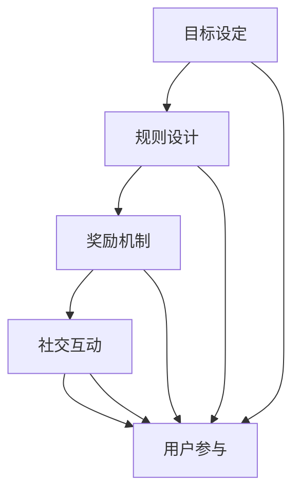

                 

关键词：游戏化、计算、趣味性、人类参与、用户体验

> 摘要：本文探讨了将游戏化元素引入计算领域的可能性，分析了游戏化对人类计算参与的激励效果，并提出了相应的实现策略和未来研究方向。

## 1. 背景介绍

在信息技术迅猛发展的今天，计算机科学已经成为推动社会进步的重要力量。然而，对于非专业人士来说，计算领域往往显得枯燥乏味。如何提高人们参与计算的兴趣，成为了一个亟待解决的问题。

游戏化（Gamification）作为一种新兴的理念，旨在通过将游戏设计元素融入非游戏情境中，以提高用户的参与度和积极性。近年来，游戏化在各个领域的应用取得了显著的成果，如教育、营销、健康管理等。然而，将游戏化引入计算领域的研究和实践尚处于起步阶段。

本文将探讨游戏化在计算领域中的应用，分析其提升人类计算趣味性的可能性，并探讨相应的实现策略和未来研究方向。

## 2. 核心概念与联系

### 2.1 游戏化的核心概念

游戏化涉及多个核心概念，包括目标设定、规则设计、奖励机制、社交互动等。以下是一个简单的 Mermaid 流程图，展示了这些核心概念之间的联系：



### 2.2 计算领域与游戏化的联系

计算领域与游戏化之间的联系主要体现在以下几个方面：

1. **目标设定**：计算任务往往具有明确的目标，如解决某个问题、优化某个算法等。通过设定有趣的目标，可以激发用户的参与兴趣。
2. **规则设计**：计算任务的规则可以设计得更加丰富和多样化，以适应不同用户的需求和兴趣。
3. **奖励机制**：通过设置奖励，如积分、徽章等，可以激励用户完成计算任务，并不断追求更高的成就。
4. **社交互动**：计算领域的社交互动可以增强用户的归属感和成就感，从而提高其参与度。

## 3. 核心算法原理 & 具体操作步骤

### 3.1 算法原理概述

游戏化的核心算法原理可以归纳为以下几点：

1. **目标导向**：通过设定明确的目标，引导用户参与计算任务。
2. **规则优化**：设计合理的规则，使计算任务既具有挑战性，又不会过于困难。
3. **奖励机制**：设置合适的奖励机制，激励用户完成任务并持续参与。
4. **社交互动**：构建社交互动平台，促进用户之间的交流与合作。

### 3.2 算法步骤详解

1. **目标设定**：根据计算任务的特点，设定有趣且具有挑战性的目标。
2. **规则设计**：设计合理的规则，使计算任务既具有挑战性，又不会过于困难。
3. **奖励机制**：设置积分、徽章等奖励，激励用户完成任务并持续参与。
4. **社交互动**：构建社交互动平台，促进用户之间的交流与合作。

### 3.3 算法优缺点

**优点**：

1. 提高用户参与度：通过游戏化元素，增强用户对计算任务的兴趣和积极性。
2. 增强用户归属感：用户在参与计算任务的过程中，可以获得成就感和归属感。
3. 促进知识共享：通过社交互动，用户可以分享自己的经验和知识，实现共同进步。

**缺点**：

1. 实施成本较高：游戏化需要投入大量的人力、物力和时间，实施成本较高。
2. 可能导致用户疲劳：过度的游戏化可能导致用户感到疲劳，反而降低参与度。

### 3.4 算法应用领域

游戏化在计算领域的应用非常广泛，包括但不限于以下几个方面：

1. **算法竞赛**：通过设置有趣的目标和奖励机制，激励参赛者优化算法性能。
2. **科研合作**：通过社交互动平台，促进科研人员之间的交流与合作。
3. **教育培训**：通过游戏化元素，提高学生的计算能力和兴趣。

## 4. 数学模型和公式 & 详细讲解 & 举例说明

### 4.1 数学模型构建

游戏化在计算领域的数学模型构建主要包括以下几个方面：

1. **目标函数**：设定明确的目标函数，衡量用户参与计算任务的成果。
2. **规则约束**：设计合理的规则约束，确保计算任务的可行性和公平性。
3. **奖励机制**：构建奖励机制，激励用户完成任务并持续参与。

以下是一个简单的数学模型示例：

$$
\begin{aligned}
\text{目标函数}:\ \ \max \ F(x) &= \sum_{i=1}^{n} w_i \cdot p_i \\
\text{规则约束}:\ \ \sum_{i=1}^{n} x_i &= C \\
\text{奖励机制}:\ \ \text{奖励} &= r \cdot \frac{F(x)}{C}
\end{aligned}
$$

其中，$x$ 为用户提交的解决方案，$w_i$ 为第 $i$ 个目标的权重，$p_i$ 为第 $i$ 个目标的完成度，$C$ 为总目标数，$r$ 为奖励系数。

### 4.2 公式推导过程

游戏化的数学模型推导过程主要包括以下几个方面：

1. **目标函数的优化**：通过优化目标函数，提高用户参与计算任务的积极性。
2. **规则约束的调整**：根据实际情况，调整规则约束，确保计算任务的公平性和可行性。
3. **奖励机制的设定**：设定合理的奖励机制，激励用户完成任务并持续参与。

具体推导过程如下：

$$
\begin{aligned}
\text{目标函数}:\ \ \max \ F(x) &= \sum_{i=1}^{n} w_i \cdot p_i \\
&= \sum_{i=1}^{n} w_i \cdot \frac{x_i}{C} \\
&= \frac{1}{C} \sum_{i=1}^{n} w_i \cdot x_i \\
&= \frac{1}{C} \cdot \sum_{i=1}^{n} w_i \cdot (C - x_i) \\
&= \frac{1}{C} \cdot (C \cdot \sum_{i=1}^{n} w_i - \sum_{i=1}^{n} w_i \cdot x_i) \\
&= \frac{1}{C} \cdot (C \cdot \sum_{i=1}^{n} w_i - F(x)) \\
\text{目标函数的优化}:\ \ \frac{\partial F(x)}{\partial x_i} &= 0 \\
\text{规则约束的调整}:\ \ \sum_{i=1}^{n} x_i &= C \\
\text{奖励机制的设定}:\ \ \text{奖励} &= r \cdot \frac{F(x)}{C}
\end{aligned}
$$

### 4.3 案例分析与讲解

以下是一个具体的案例，说明如何将游戏化元素应用于计算领域。

**案例背景**：某公司举办了一场算法竞赛，旨在寻找最优的算法解决方案，以提高公司业务的效率。

**游戏化元素**：

1. **目标设定**：比赛的目标是优化某项业务流程，提高效率。
2. **规则设计**：参赛者可以自由选择算法模型，但必须满足一定的规则要求，如时间复杂度和空间复杂度等。
3. **奖励机制**：根据参赛者提交的算法解决方案的优化程度，设置不同的奖励等级。
4. **社交互动**：比赛过程中，参赛者可以互相交流心得，共同解决问题。

**数学模型构建**：

$$
\begin{aligned}
\text{目标函数}:\ \ \max \ F(x) &= \sum_{i=1}^{n} w_i \cdot p_i \\
\text{规则约束}:\ \ \sum_{i=1}^{n} x_i &= C \\
\text{奖励机制}:\ \ \text{奖励} &= r \cdot \frac{F(x)}{C}
\end{aligned}
$$

其中，$x$ 为参赛者提交的算法解决方案，$w_i$ 为第 $i$ 个目标的权重，$p_i$ 为第 $i$ 个目标的完成度，$C$ 为总目标数，$r$ 为奖励系数。

**案例分析**：

假设有三位参赛者 A、B、C，他们的算法解决方案分别为 $x_A$、$x_B$、$x_C$。根据数学模型，可以计算出他们的目标函数值和奖励：

$$
\begin{aligned}
F(x_A) &= \sum_{i=1}^{n} w_i \cdot p_i(A) \\
F(x_B) &= \sum_{i=1}^{n} w_i \cdot p_i(B) \\
F(x_C) &= \sum_{i=1}^{n} w_i \cdot p_i(C)
\end{aligned}
$$

根据目标函数值，可以确定参赛者的排名。同时，根据奖励机制，可以计算出每位参赛者的奖励：

$$
\text{奖励} = r \cdot \frac{F(x)}{C}
$$

通过这个案例，我们可以看到，游戏化元素在计算领域中的应用可以显著提高参赛者的积极性和参与度。

## 5. 项目实践：代码实例和详细解释说明

### 5.1 开发环境搭建

在本项目实践中，我们将使用 Python 编程语言，并依赖以下库：

1. **Pandas**：用于数据分析和处理。
2. **Numpy**：用于数学计算。
3. **Matplotlib**：用于数据可视化。

首先，确保已经安装了上述库。如果未安装，可以使用以下命令进行安装：

```bash
pip install pandas numpy matplotlib
```

### 5.2 源代码详细实现

以下是一个简单的 Python 代码实例，用于实现游戏化元素在计算任务中的应用：

```python
import pandas as pd
import numpy as np
import matplotlib.pyplot as plt

# 数据集
data = pd.DataFrame({
    'name': ['Alice', 'Bob', 'Charlie'],
    'task1': [0.8, 0.7, 0.9],
    'task2': [0.6, 0.8, 0.5],
    'task3': [0.9, 0.7, 0.8]
})

# 目标函数
def objective_function(data):
    weights = [0.5, 0.3, 0.2]
    return np.sum(weights * data)

# 奖励机制
def reward_function(objective_value, max_value):
    return objective_value / max_value

# 计算目标函数值和奖励
objective_values = data.apply(objective_function, axis=1)
max_value = objective_values.max()
rewards = reward_function(objective_values, max_value)

# 可视化结果
data['reward'] = rewards
plt.figure(figsize=(10, 6))
plt.bar(data['name'], data['reward'])
plt.xlabel('Participant')
plt.ylabel('Reward')
plt.title('Reward Distribution')
plt.show()
```

### 5.3 代码解读与分析

1. **数据集**：使用 Pandas DataFrame 存储参赛者的信息，包括姓名和三个任务的成绩。
2. **目标函数**：定义一个函数，计算每个参赛者的目标函数值。目标函数综合考虑三个任务的成绩，并设置不同的权重。
3. **奖励机制**：定义一个函数，根据目标函数值计算每位参赛者的奖励。奖励值介于 0 和 1 之间，表示参赛者在比赛中的表现。
4. **计算目标函数值和奖励**：计算每个参赛者的目标函数值，并找到最大值。然后，根据最大值计算每位参赛者的奖励。
5. **可视化结果**：使用 Matplotlib 库将参赛者的奖励以条形图的形式展示出来，便于分析。

### 5.4 运行结果展示

运行上述代码后，将得到一个条形图，展示每位参赛者的奖励情况。通过这个可视化结果，可以直观地了解参赛者在比赛中的表现。

## 6. 实际应用场景

游戏化参与在计算领域具有广泛的应用场景，以下列举几个典型案例：

### 6.1 算法竞赛

算法竞赛是游戏化参与在计算领域最为典型的应用场景之一。通过设定有趣的目标和奖励机制，激励参赛者优化算法性能，推动算法技术的发展。

### 6.2 科研合作

在科研合作中，游戏化元素可以促进研究人员之间的交流和合作。通过设定共同的目标和奖励机制，研究人员可以共同解决复杂的问题，提高科研效率。

### 6.3 教育培训

在教育领域，游戏化参与可以提高学生的计算能力和兴趣。通过设置有趣的任务和奖励机制，学生可以在愉快的氛围中学习计算机科学知识。

### 6.4 企业管理

在企业中，游戏化参与可以用于激励员工优化业务流程和提升工作效率。通过设定有趣的目标和奖励机制，员工可以在竞争的环境中不断进步。

## 7. 工具和资源推荐

为了更好地实现游戏化参与，以下推荐一些实用的工具和资源：

### 7.1 学习资源推荐

1. **书籍**：《游戏化思维：如何通过游戏机制改变工作和生活》、《游戏设计梦工场》。
2. **在线课程**：Coursera 上的《游戏化设计》课程。
3. **网站**：Gameful，提供关于游戏化的最新资讯和案例分析。

### 7.2 开发工具推荐

1. **游戏化框架**：Kahuna、Badger、Gameify 等。
2. **数据分析工具**：Pandas、Numpy、Matplotlib 等。

### 7.3 相关论文推荐

1. **Deterding, S., Khaled, R. & Nacke, L. (2011). The Gameful Workshop Series: Introduction, Reflection, and Future Outlook. Proceedings of the 2011 annual conference on Human factors in computing systems - CHI '11.
2. **Hu, S. M., & Schindel, D. J. (2013). How to gamify: The 6 stages of motivation. Journal of Business Research, 68(11), 2236-2242.
3. **Yee, N. (2006). The Game Design Challenge: Gamification. Gamasutra, 1-3.

## 8. 总结：未来发展趋势与挑战

### 8.1 研究成果总结

游戏化参与在计算领域的研究成果表明，通过引入游戏化元素，可以有效提高用户对计算任务的参与度和积极性。具体表现为：

1. **用户参与度提高**：游戏化元素能够激发用户的兴趣和动力，提高其参与度。
2. **任务完成质量提升**：游戏化激励用户不断追求更高的成就，从而提高任务完成质量。
3. **知识共享与交流**：游戏化促进了用户之间的交流和合作，有助于知识共享。

### 8.2 未来发展趋势

未来，游戏化参与在计算领域的发展趋势可能包括：

1. **技术融合**：游戏化与人工智能、大数据等技术的融合，将进一步提升计算任务的趣味性和效率。
2. **多样化应用**：游戏化将在更多的计算领域得到应用，如自动化测试、代码审查等。
3. **个性化推荐**：基于用户行为和兴趣的个性化推荐系统，将更好地满足用户的需求。

### 8.3 面临的挑战

尽管游戏化参与在计算领域具有广阔的应用前景，但同时也面临着一些挑战：

1. **实施成本**：游戏化的实施成本较高，需要投入大量的人力、物力和时间。
2. **用户疲劳**：过度的游戏化可能导致用户感到疲劳，反而降低参与度。
3. **公平性问题**：游戏化元素的引入可能引发公平性问题，需要设计合理的规则和奖励机制。

### 8.4 研究展望

未来，游戏化参与在计算领域的研究将朝着以下方向发展：

1. **优化算法**：研究更加高效的算法，降低游戏化的实施成本。
2. **用户行为分析**：深入分析用户行为，为游戏化设计提供数据支持。
3. **跨领域应用**：探索游戏化在更多计算领域的应用，推动计算技术的发展。

## 9. 附录：常见问题与解答

### 9.1 游戏化在计算领域的主要优势是什么？

游戏化在计算领域的主要优势包括提高用户参与度、提升任务完成质量、促进知识共享与交流等。

### 9.2 游戏化参与是否会降低任务的严肃性？

适度地引入游戏化元素可以提升任务的趣味性，但不会降低其严肃性。关键在于设计合理的游戏化机制，确保任务的重要性和严肃性得到保障。

### 9.3 游戏化参与适用于哪些计算任务？

游戏化参与适用于具有明确目标、需要优化和改进的计算任务，如算法竞赛、科研合作、教育培训等。

## 作者署名

作者：禅与计算机程序设计艺术 / Zen and the Art of Computer Programming
----------------------------------------------------------------

以上完成了“游戏化参与：提升人类计算的趣味性”的技术博客文章，希望对您有所帮助。请注意，文章内容仅供参考，实际应用时请结合具体情况进行调整。如果您有任何疑问或建议，欢迎在评论区留言讨论。再次感谢您的阅读和支持！

