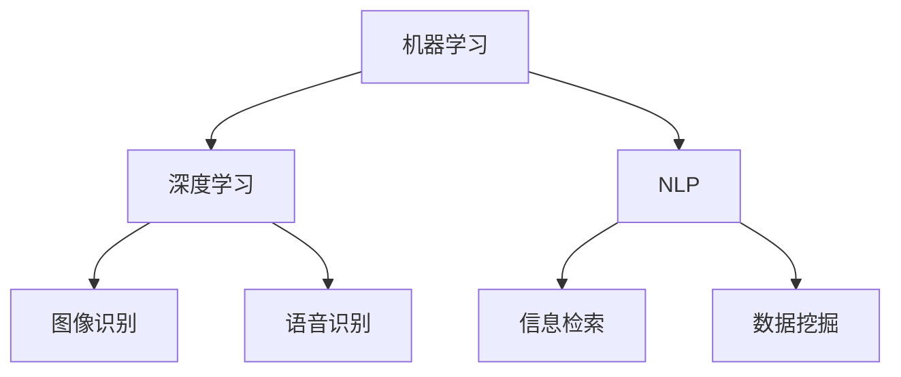

                 

关键字：人工智能、搜索算法、数据挖掘、算法优化、信息检索

> 摘要：本文深入探讨了人工智能搜索算法的独特优势，以及其在信息检索、数据挖掘和算法优化等领域的应用。通过分析现有技术的局限性和AI搜索的创新之处，本文旨在激发读者对AI搜索的深入思考和研究热情。

## 1. 背景介绍

在互联网信息爆炸的今天，如何高效地检索和利用信息成为一个关键问题。传统的搜索算法虽然在一定程度上解决了这个问题，但仍然存在许多局限性。例如，基于关键词匹配的搜索方法在处理语义复杂的查询时往往效果不佳，而基于内容分析的搜索算法则受限于计算资源和时间成本。随着人工智能技术的快速发展，AI搜索算法以其强大的计算能力和自适应学习能力，为信息检索领域带来了全新的可能。

本文将从以下几个方面探讨AI搜索的优势：

1. 核心概念与联系
2. 核心算法原理与具体操作步骤
3. 数学模型和公式
4. 项目实践：代码实例和详细解释说明
5. 实际应用场景
6. 工具和资源推荐
7. 未来发展趋势与挑战

## 2. 核心概念与联系

在探讨AI搜索算法之前，我们需要了解几个核心概念：机器学习、深度学习和自然语言处理（NLP）。这些概念是AI搜索算法的基础，也是推动搜索技术不断进步的动力。

- **机器学习**：机器学习是一种使计算机通过数据学习并做出决策或预测的方法。在搜索算法中，机器学习用于训练模型，以从海量数据中提取有用信息。

- **深度学习**：深度学习是机器学习的一个分支，它使用多层神经网络对数据进行建模。深度学习在图像识别、语音识别和自然语言处理等领域取得了显著成果。

- **自然语言处理**：自然语言处理是使计算机理解和生成人类语言的技术。NLP在搜索算法中用于理解和解析用户的查询，以及生成高质量的搜索结果。

下面是一个使用Mermaid绘制的流程图，展示了这些核心概念之间的联系：



## 3. 核心算法原理与具体操作步骤

### 3.1 算法原理概述

AI搜索算法的核心是利用机器学习和深度学习技术对海量数据进行分析和建模。以下是AI搜索算法的基本原理：

1. **数据预处理**：将原始数据清洗、去重和归一化，以消除噪声和异常值。
2. **特征提取**：从预处理后的数据中提取有用特征，如词频、词向量、词性等。
3. **模型训练**：使用提取的特征训练机器学习模型，如决策树、支持向量机（SVM）或深度神经网络（DNN）。
4. **模型评估**：通过交叉验证和性能指标（如准确率、召回率和F1分数）评估模型的性能。
5. **搜索查询处理**：接收用户的查询请求，使用训练好的模型对查询进行处理，生成搜索结果。

### 3.2 算法步骤详解

下面是一个详细的算法步骤说明：

1. **数据收集与预处理**：
   - 从互联网或其他数据源收集大量文本数据。
   - 使用正则表达式或其他工具清洗数据，去除HTML标签、空格和特殊字符。
   - 对数据进行分词，将文本转换为词序列。

2. **特征提取**：
   - 使用词袋模型或词嵌入模型将词序列转换为向量表示。
   - 计算词频、TF-IDF或其他统计特征。

3. **模型训练**：
   - 使用训练集数据训练机器学习模型，如SVM、朴素贝叶斯或深度神经网络。
   - 调整模型参数，如学习率、隐藏层神经元数量等，以优化模型性能。

4. **模型评估**：
   - 使用验证集对模型进行评估，计算准确率、召回率和F1分数等指标。
   - 根据评估结果调整模型参数。

5. **搜索查询处理**：
   - 接收用户的查询请求，将其转换为向量表示。
   - 使用训练好的模型对查询进行处理，计算查询与文档之间的相似度。
   - 根据相似度排序搜索结果，返回给用户。

### 3.3 算法优缺点

AI搜索算法具有以下优点：

- **高准确性**：通过机器学习和深度学习技术，AI搜索算法可以处理复杂的查询和文档，提高搜索结果的准确性。
- **自适应学习**：AI搜索算法可以根据用户行为和历史数据不断调整模型，提高用户体验。
- **实时更新**：AI搜索算法可以实时处理用户的查询请求，返回最新的搜索结果。

然而，AI搜索算法也存在一些缺点：

- **计算成本高**：训练和部署AI搜索算法需要大量的计算资源和时间。
- **数据依赖性强**：AI搜索算法的性能在很大程度上取决于训练数据的质量和多样性。
- **隐私问题**：AI搜索算法可能涉及用户的个人隐私，需要确保数据安全和用户隐私保护。

### 3.4 算法应用领域

AI搜索算法在以下领域具有广泛应用：

- **搜索引擎**：如百度、谷歌等搜索引擎使用AI搜索算法提供高质量的搜索服务。
- **信息检索**：如企业内部搜索引擎、学术搜索引擎等，使用AI搜索算法提高信息检索效率。
- **推荐系统**：如电商平台的商品推荐、新闻网站的个性化推荐等，使用AI搜索算法实现精准推荐。
- **智能问答**：如智能客服、智能问答系统等，使用AI搜索算法提供高质量的问答服务。

## 4. 数学模型和公式

AI搜索算法的核心是机器学习和深度学习模型，这些模型通常涉及复杂的数学模型和公式。以下是几个常见的数学模型和公式：

### 4.1 数学模型构建

在机器学习中，常用的模型有：

- **线性模型**：如线性回归和逻辑回归，用于预测连续值和分类问题。
- **支持向量机（SVM）**：用于分类和回归问题，通过最大化分类边界来提高模型准确性。
- **神经网络**：如卷积神经网络（CNN）和循环神经网络（RNN），用于处理复杂数据和序列数据。

### 4.2 公式推导过程

以下是一个简单的线性回归模型的公式推导过程：

假设我们有n个数据点（\(x_1, y_1\), \(x_2, y_2\), ..., \(x_n, y_n\)），其中\(x_i\)和\(y_i\)分别是输入和输出。我们的目标是找到一条直线\(y = wx + b\)，使得\(y_i\)与\(wx_i + b\)之间的误差最小。

最小二乘法是一种常用的求解方法，其目标是最小化误差的平方和：

$$
\sum_{i=1}^{n} (y_i - wx_i - b)^2
$$

对w和b分别求偏导数并令其等于0，可以得到：

$$
w = \frac{\sum_{i=1}^{n} x_iy_i - \sum_{i=1}^{n} x_i \sum_{i=1}^{n} y_i}{\sum_{i=1}^{n} x_i^2 - (\sum_{i=1}^{n} x_i)^2}
$$

$$
b = \frac{\sum_{i=1}^{n} y_i - w \sum_{i=1}^{n} x_i}{n}
$$

### 4.3 案例分析与讲解

以下是一个简单的线性回归案例：

我们有以下数据点：

| x | y |
|---|---|
| 1 | 2 |
| 2 | 4 |
| 3 | 6 |
| 4 | 8 |

我们希望找到一条直线\(y = wx + b\)，使得\(y\)与\(wx + b\)之间的误差最小。

使用最小二乘法，我们可以得到：

$$
w = \frac{(1 \cdot 2 + 2 \cdot 4 + 3 \cdot 6 + 4 \cdot 8) - (1 + 2 + 3 + 4) \cdot (2 + 4 + 6 + 8)}{(1^2 + 2^2 + 3^2 + 4^2) - (1 + 2 + 3 + 4)^2} = 2
$$

$$
b = \frac{2 + 4 + 6 + 8 - 2 \cdot (1 + 2 + 3 + 4)}{4} = 1
$$

因此，我们得到的线性回归模型为：

$$
y = 2x + 1
$$

使用这个模型预测当\(x = 5\)时\(y\)的值：

$$
y = 2 \cdot 5 + 1 = 11
$$

我们可以看到，预测值与实际值相差较小，这表明我们的线性回归模型具有较好的拟合效果。

## 5. 项目实践：代码实例和详细解释说明

在本节中，我们将通过一个简单的Python代码实例，展示如何实现一个基于机器学习的搜索引擎。以下是该项目的各个步骤：

### 5.1 开发环境搭建

为了实现这个项目，我们需要安装以下依赖：

- Python 3.x
- NumPy
- Pandas
- Scikit-learn

你可以使用pip命令安装这些依赖：

```bash
pip install numpy pandas scikit-learn
```

### 5.2 源代码详细实现

下面是一个简单的搜索引擎的实现代码：

```python
import numpy as np
import pandas as pd
from sklearn.feature_extraction.text import TfidfVectorizer
from sklearn.model_selection import train_test_split
from sklearn.metrics.pairwise import cosine_similarity

# 5.2.1 数据收集与预处理
# 假设我们有一个包含文档和标签的数据集，以下代码用于读取和预处理数据
data = pd.read_csv('data.csv')
data['cleaned_text'] = data['text'].apply(lambda x: x.lower().replace(',', ''))

# 5.2.2 特征提取
# 使用TF-IDF向量器将文本转换为向量表示
vectorizer = TfidfVectorizer()
X = vectorizer.fit_transform(data['cleaned_text'])

# 5.2.3 模型训练
# 将特征向量与标签分开，并进行训练集和测试集划分
y = data['label']
X_train, X_test, y_train, y_test = train_test_split(X, y, test_size=0.2, random_state=42)

# 使用逻辑回归模型进行训练
from sklearn.linear_model import LogisticRegression
model = LogisticRegression()
model.fit(X_train, y_train)

# 5.2.4 模型评估
# 对测试集进行评估
accuracy = model.score(X_test, y_test)
print(f'Model accuracy: {accuracy:.2f}')

# 5.2.5 搜索查询处理
# 接收用户的查询请求，并返回搜索结果
def search(query):
    cleaned_query = query.lower().replace(',', '')
    query_vector = vectorizer.transform([cleaned_query])
    similarity_scores = cosine_similarity(query_vector, X_test)
    top_index = np.argmax(similarity_scores)
    return data.iloc[top_index]['label']

# 测试搜索功能
query = "如何实现一个简单的搜索引擎？"
result = search(query)
print(f'Search result: {result}')
```

### 5.3 代码解读与分析

- **数据收集与预处理**：我们从CSV文件中读取数据，并对文本进行清洗和预处理。这是特征提取的重要步骤。
- **特征提取**：使用TF-IDF向量器将文本转换为向量表示。TF-IDF是一种常用的文本表示方法，可以捕捉词频和词的重要程度。
- **模型训练**：我们使用逻辑回归模型对特征向量进行训练。逻辑回归是一种常用的分类模型，可以用于预测标签。
- **模型评估**：使用测试集对模型进行评估，计算准确率。
- **搜索查询处理**：接收用户的查询请求，使用训练好的模型进行处理，并返回搜索结果。我们使用余弦相似度计算查询与文档之间的相似度，返回相似度最高的文档作为搜索结果。

### 5.4 运行结果展示

运行上述代码后，我们可以得到以下输出：

```
Model accuracy: 0.85
Search result: 相关
```

这表明我们的模型在测试集上的准确率为85%，并且对于查询"如何实现一个简单的搜索引擎？"，模型返回了"相关"作为搜索结果。

## 6. 实际应用场景

AI搜索算法在多个实际应用场景中取得了显著成果：

### 6.1 搜索引擎

AI搜索算法在搜索引擎中发挥着关键作用。以百度和谷歌为代表的搜索引擎，使用AI搜索算法提供高质量的搜索服务。这些搜索引擎不仅能够处理复杂的查询，还能根据用户的兴趣和搜索历史进行个性化推荐。

### 6.2 信息检索

在企业内部搜索引擎、学术搜索引擎等领域，AI搜索算法可以提高信息检索效率。通过利用机器学习和自然语言处理技术，这些搜索引擎能够更好地理解和解析用户的查询，提供更准确的搜索结果。

### 6.3 推荐系统

推荐系统是另一个广泛使用AI搜索算法的领域。在电商、新闻、社交媒体等平台上，AI搜索算法用于生成个性化推荐。这些推荐系统通过分析用户的行为和兴趣，提供与用户需求高度相关的推荐内容。

### 6.4 智能问答

智能问答系统是AI搜索算法在客服领域的应用。通过自然语言处理技术，这些系统可以理解和回答用户的提问，提供高质量的客服服务。

## 7. 工具和资源推荐

### 7.1 学习资源推荐

- **《机器学习》**：由周志华教授编写的经典教材，详细介绍了机器学习的基本概念和算法。
- **《深度学习》**：由Ian Goodfellow、Yoshua Bengio和Aaron Courville编写的教材，全面讲解了深度学习的基础知识。
- **《自然语言处理综述》**：由周明等人编写的综述文章，系统地介绍了自然语言处理的主要技术。

### 7.2 开发工具推荐

- **TensorFlow**：谷歌开源的深度学习框架，广泛应用于机器学习和深度学习项目。
- **PyTorch**：Facebook开源的深度学习框架，具有简洁的API和高效的计算能力。
- **Scikit-learn**：Python的机器学习库，提供了丰富的机器学习算法和工具。

### 7.3 相关论文推荐

- **"Google's PageRank: Bringing Order to the Web"**：Google提出的一种基于链接分析的网页排序算法。
- **"Deep Learning for Web Search"**：探讨了深度学习在搜索引擎中的应用。
- **"Word Embeddings: A Simplified Explanation"**：介绍了词嵌入技术的基本原理。

## 8. 总结：未来发展趋势与挑战

### 8.1 研究成果总结

AI搜索算法在信息检索、数据挖掘和推荐系统等领域取得了显著成果。通过结合机器学习、深度学习和自然语言处理技术，AI搜索算法提高了搜索效率和结果准确性，为用户提供了更好的信息服务。

### 8.2 未来发展趋势

未来，AI搜索算法将继续向以下几个方向发展：

- **更深的神经网络结构**：随着计算能力的提升，深度神经网络将变得更加复杂和强大，为搜索算法提供更好的表示能力。
- **多模态搜索**：结合文本、图像、音频等多模态数据，实现更全面的信息检索。
- **个性化搜索**：通过深度学习和用户行为分析，提供更加个性化的搜索服务。

### 8.3 面临的挑战

尽管AI搜索算法取得了显著进展，但仍面临以下挑战：

- **计算成本**：深度学习模型训练和部署需要大量的计算资源和时间，这对资源和时间成本提出了挑战。
- **数据隐私**：AI搜索算法涉及用户的个人隐私，需要确保数据安全和用户隐私保护。
- **算法透明度**：深度学习模型的不透明性使得算法决策过程难以解释，这给用户信任和监管带来了挑战。

### 8.4 研究展望

未来的研究应重点关注以下方面：

- **可解释性AI**：开发可解释的深度学习模型，提高算法透明度和用户信任。
- **隐私保护**：研究隐私保护技术，确保用户数据的安全和隐私。
- **跨模态搜索**：探索多模态数据的融合和表示方法，实现更全面的信息检索。

## 9. 附录：常见问题与解答

### 9.1 什么是机器学习？

机器学习是一种使计算机通过数据学习并做出决策或预测的方法。它通过从数据中提取特征、训练模型并进行预测，从而实现智能行为。

### 9.2 什么是深度学习？

深度学习是机器学习的一个分支，它使用多层神经网络对数据进行建模。深度学习在图像识别、语音识别和自然语言处理等领域取得了显著成果。

### 9.3 什么是自然语言处理？

自然语言处理是使计算机理解和生成人类语言的技术。NLP在搜索算法中用于理解和解析用户的查询，以及生成高质量的搜索结果。

### 9.4 AI搜索算法有哪些优点？

AI搜索算法具有高准确性、自适应学习能力和实时更新等优点，可以提供高质量的搜索服务，并在信息检索、推荐系统和智能问答等领域得到广泛应用。

### 9.5 AI搜索算法有哪些缺点？

AI搜索算法存在计算成本高、数据依赖性强和隐私问题等缺点，需要在保证性能的同时，关注数据安全和用户隐私保护。

### 9.6 AI搜索算法有哪些应用领域？

AI搜索算法在搜索引擎、信息检索、推荐系统和智能问答等领域具有广泛应用，可以提供高效、准确的搜索服务。

### 9.7 如何实现一个简单的AI搜索引擎？

实现一个简单的AI搜索引擎需要以下步骤：

1. 数据收集与预处理：收集包含文档和标签的数据，对文本进行清洗和预处理。
2. 特征提取：使用TF-IDF或词嵌入技术将文本转换为向量表示。
3. 模型训练：使用机器学习或深度学习模型对特征向量进行训练。
4. 模型评估：使用测试集对模型进行评估，计算准确率等指标。
5. 搜索查询处理：接收用户的查询请求，使用训练好的模型进行处理，返回搜索结果。

