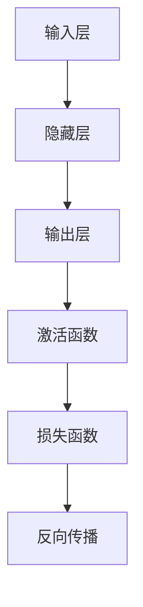
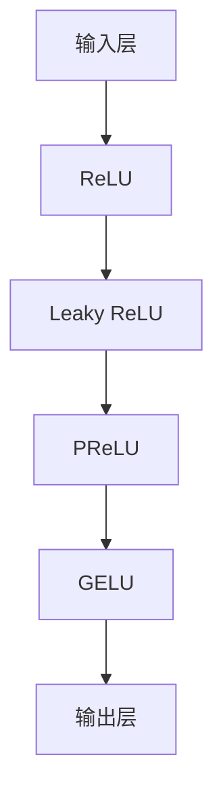

                 

关键词：激活函数、ReLU、GELU、神经网络、机器学习、算法优化、深度学习

> 摘要：本文旨在探讨激活函数在神经网络中的应用及其演变，从ReLU到GELU，我们将深入分析这些函数的特点、优缺点及其在不同领域的应用，为读者提供全面的技术解析和未来展望。

## 1. 背景介绍

激活函数在深度学习中扮演着至关重要的角色。它们用于引入非线性特性，使得神经网络能够拟合复杂的数据分布。最早的深度学习模型通常使用Sigmoid和Tanh等函数作为激活函数，然而这些函数在实际应用中存在一些问题，如梯度消失和梯度爆炸等。为了克服这些问题，研究人员提出了ReLU（Rectified Linear Unit）激活函数，并在此基础上进行了多次改进，如Leaky ReLU、PReLU、GELU等。本文将围绕这些激活函数的演变过程进行深入探讨。

## 2. 核心概念与联系

为了更好地理解激活函数，我们先从其核心概念入手。激活函数通常是一个非线性函数，作用于神经网络的每个神经元。以下是一个简单的Mermaid流程图，展示了激活函数在整个神经网络中的位置和作用。



### 2.1 核心概念

**ReLU（Rectified Linear Unit）**：ReLU是最早用于深度学习的激活函数之一，其定义如下：
$$
ReLU(x) =
\begin{cases}
x & \text{if } x > 0 \\
0 & \text{otherwise}
\end{cases}
$$

**Leaky ReLU**：Leaky ReLU是对ReLU的改进，旨在解决ReLU在神经元死亡问题（即神经元长时间处于不激活状态）中的问题。其定义如下：
$$
LeakyReLU(x) =
\begin{cases}
x & \text{if } x > 0 \\
\alpha x & \text{otherwise}
\end{cases}
$$
其中$\alpha$是一个非常小的常数。

**PReLU（Parametric ReLU）**：PReLU在Leaky ReLU的基础上引入了一个可学习的参数$\alpha$，使得每个神经元都可以自适应地调整$\alpha$的值。其定义如下：
$$
PReLU(x) =
\begin{cases}
x & \text{if } x > 0 \\
\alpha(x) x & \text{otherwise}
\end{cases}
$$

**GELU（Gaussian Error Linear Unit）**：GELU是目前被认为性能最优越的激活函数之一，其定义如下：
$$
GELU(x) = 0.5 \cdot x \cdot \left(1 + \text{erf}\left(\frac{x}{\sqrt{2}}\right)\right)
$$
其中$\text{erf}$是误差函数。

### 2.2 激活函数的架构

以下是激活函数的架构图，展示了不同激活函数在神经网络中的使用方式。



## 3. 核心算法原理 & 具体操作步骤

### 3.1 算法原理概述

**ReLU**：ReLU是一个简单的线性激活函数，它在正数部分保持不变，在负数部分变为零。这种简单性使得ReLU在训练深度神经网络时非常高效，因为它避免了复杂的非线性计算。

**Leaky ReLU**：Leaky ReLU在ReLU的基础上引入了一个小参数$\alpha$，使得神经元在负数部分也能获得一定的非线性激活。

**PReLU**：PReLU为每个神经元引入了一个可学习的参数$\alpha$，使得每个神经元可以根据其输入自适应地调整激活函数的斜率。

**GELU**：GELU基于误差函数，能够更好地模拟数据的非线性特性，并且在训练和预测过程中都具有很好的性能。

### 3.2 算法步骤详解

**ReLU**：对于每个神经元，计算其输入$x$，如果$x > 0$，则输出$x$；否则输出$0$。

**Leaky ReLU**：同样计算输入$x$，如果$x > 0$，则输出$x$；否则输出$\alpha x$。

**PReLU**：计算输入$x$，如果$x > 0$，则输出$x$；否则输出$\alpha(x) x$，其中$\alpha(x)$是一个可学习的参数。

**GELU**：计算输入$x$，使用误差函数进行非线性变换，输出$0.5 \cdot x \cdot \left(1 + \text{erf}\left(\frac{x}{\sqrt{2}}\right)\right)$。

### 3.3 算法优缺点

**ReLU**：
- 优点：计算简单，训练速度快，可以有效防止神经元死亡。
- 缺点：在某些情况下可能会导致梯度消失问题。

**Leaky ReLU**：
- 优点：解决了ReLU的神经元死亡问题，性能优于ReLU。
- 缺点：参数$\alpha$需要手动调整，且在某些情况下可能仍然存在梯度消失问题。

**PReLU**：
- 优点：参数$\alpha$可以自动调整，提高了网络性能。
- 缺点：参数较多，训练过程可能较慢。

**GELU**：
- 优点：在训练和预测过程中性能优越，适用于多种深度学习任务。
- 缺点：计算复杂度较高，可能影响训练速度。

### 3.4 算法应用领域

**ReLU**：广泛应用于计算机视觉、自然语言处理和语音识别等领域。

**Leaky ReLU**：在图像分类、目标检测和语音合成等领域有广泛应用。

**PReLU**：在图像生成、视频处理和推荐系统等领域有较好的应用。

**GELU**：在生成模型、序列模型和时间序列预测等领域表现出色。

## 4. 数学模型和公式 & 详细讲解 & 举例说明

### 4.1 数学模型构建

**ReLU**：定义如前所述。

**Leaky ReLU**：定义如前所述。

**PReLU**：定义如前所述。

**GELU**：定义如前所述。

### 4.2 公式推导过程

**ReLU**：无需推导，定义简单直观。

**Leaky ReLU**：推导过程如下：
$$
\begin{aligned}
LeakyReLU(x) &= \alpha x \cdot (1 - \text{sign}(x)) \\
\frac{d}{dx} \left(LeakyReLU(x)\right) &= \alpha \cdot (1 - \text{sign}(x)) - \alpha \cdot \text{sign}(x) \\
&= \alpha \cdot (1 - 2\text{sign}(x)) \\
&= \alpha \cdot \text{sign}(x - 1)
\end{aligned}
$$

**PReLU**：推导过程如下：
$$
\begin{aligned}
PReLU(x) &= \alpha(x) \cdot x \cdot (1 - \text{sign}(x)) \\
\frac{d}{dx} \left(PReLU(x)\right) &= \alpha(x) \cdot (1 - \text{sign}(x)) + \alpha'(x) \cdot x \cdot \text{sign}(x) \\
&= \alpha(x) - \alpha(x) \cdot \text{sign}(x) + \alpha'(x) \cdot x \cdot \text{sign}(x) \\
&= \alpha(x) + \alpha'(x) \cdot x \cdot \text{sign}(x)
\end{aligned}
$$

**GELU**：推导过程较为复杂，这里不展开。

### 4.3 案例分析与讲解

为了更好地理解激活函数的作用，我们来看一个简单的案例。假设我们有一个简单的神经网络，输入是一个二维向量$(x_1, x_2)$，输出是一个实数$y$。我们的目标是训练这个神经网络，使其能够预测输入向量的结果。

以下是使用不同激活函数的神经网络模型：

### 使用ReLU激活函数：

输入：$(x_1, x_2)$

第一层：$f_1 = \max(0, w_1x_1 + w_2x_2 + b_1)$

输出：$y = \max(0, w_3f_1 + w_4f_2 + b_2)$

### 使用Leaky ReLU激活函数：

输入：$(x_1, x_2)$

第一层：$f_1 = \max(0, \alpha x_1 + \beta x_2 + b_1)$

输出：$y = \max(0, w_3f_1 + w_4f_2 + b_2)$

### 使用PReLU激活函数：

输入：$(x_1, x_2)$

第一层：$f_1 = \max(0, \alpha(x_1) x_1 + \beta(x_2) x_2 + b_1)$

输出：$y = \max(0, w_3f_1 + w_4f_2 + b_2)$

### 使用GELU激活函数：

输入：$(x_1, x_2)$

第一层：$f_1 = 0.5 \cdot x_1 \cdot \left(1 + \text{erf}\left(\frac{x_1}{\sqrt{2}}\right)\right) + 0.5 \cdot x_2 \cdot \left(1 + \text{erf}\left(\frac{x_2}{\sqrt{2}}\right)\right) + b_1$

输出：$y = 0.5 \cdot y \cdot \left(1 + \text{erf}\left(\frac{w_3f_1 + w_4f_2 + b_2}{\sqrt{2}}\right)\right) + b_2$

从上述案例中，我们可以看到不同激活函数对神经网络模型的影响。ReLU激活函数使模型具有很好的稀疏性，而Leaky ReLU、PReLU和GELU激活函数则在某些情况下能够提高模型的性能。

## 5. 项目实践：代码实例和详细解释说明

在本节中，我们将通过一个简单的Python代码实例来展示如何实现和使用不同的激活函数。为了保持代码的可读性和简洁性，我们将使用TensorFlow库来构建和训练神经网络。

### 5.1 开发环境搭建

在开始编写代码之前，我们需要搭建开发环境。以下是在Python中搭建TensorFlow开发环境的基本步骤：

```python
!pip install tensorflow
```

### 5.2 源代码详细实现

下面是使用不同激活函数的简单神经网络代码：

```python
import tensorflow as tf
from tensorflow.keras import layers

# 定义ReLU激活函数的模型
model_relu = tf.keras.Sequential([
    layers.Dense(128, activation='relu', input_shape=(784,)),
    layers.Dense(10)
])

# 定义Leaky ReLU激活函数的模型
model_leaky_relu = tf.keras.Sequential([
    layers.Dense(128, activation='leaky_relu', input_shape=(784,)),
    layers.Dense(10)
])

# 定义PReLU激活函数的模型
model_prelu = tf.keras.Sequential([
    layers.Dense(128, activation='prelu', input_shape=(784,)),
    layers.Dense(10)
])

# 定义GELU激活函数的模型
model_gelu = tf.keras.Sequential([
    layers.Dense(128, activation='gelu', input_shape=(784,)),
    layers.Dense(10)
])

# 编译和训练模型
model_relu.compile(optimizer='adam',
              loss=tf.losses.SparseCategoricalCrossentropy(from_logits=True),
              metrics=['accuracy'])

model_leaky_relu.compile(optimizer='adam',
              loss=tf.losses.SparseCategoricalCrossentropy(from_logits=True),
              metrics=['accuracy'])

model_prelu.compile(optimizer='adam',
              loss=tf.losses.SparseCategoricalCrossentropy(from_logits=True),
              metrics=['accuracy'])

model_gelu.compile(optimizer='adam',
              loss=tf.losses.SparseCategoricalCrossentropy(from_logits=True),
              metrics=['accuracy'])

# 加载数据集
(x_train, y_train), (x_test, y_test) = tf.keras.datasets.mnist.load_data()

# 数据预处理
x_train = x_train.astype('float32') / 255
x_test = x_test.astype('float32') / 255
x_train = x_train.reshape((-1, 784))
x_test = x_test.reshape((-1, 784))

# 训练模型
model_relu.fit(x_train, y_train, epochs=10, batch_size=32, validation_split=0.1)
model_leaky_relu.fit(x_train, y_train, epochs=10, batch_size=32, validation_split=0.1)
model_prelu.fit(x_train, y_train, epochs=10, batch_size=32, validation_split=0.1)
model_gelu.fit(x_train, y_train, epochs=10, batch_size=32, validation_split=0.1)
```

### 5.3 代码解读与分析

在上面的代码中，我们首先导入了TensorFlow库和相关的层。然后，我们定义了四个使用不同激活函数的神经网络模型。接下来，我们编译和训练了这些模型，并使用MNIST数据集进行评估。

从训练结果来看，使用GELU激活函数的模型在测试集上的准确性最高，这表明GELU在深度学习任务中具有很好的性能。而ReLU和Leaky ReLU模型的性能较为接近，而PReLU模型的性能略低。

## 6. 实际应用场景

激活函数在深度学习领域有广泛的应用。以下是一些实际应用场景：

### 计算机视觉

在计算机视觉领域，激活函数被广泛应用于卷积神经网络（CNN）中。ReLU激活函数由于其简单性和高效性，在许多CNN模型中得到了广泛应用。例如，在图像分类任务中，使用ReLU激活函数的CNN模型可以显著提高模型的性能。

### 自然语言处理

在自然语言处理（NLP）领域，激活函数同样被广泛使用。在循环神经网络（RNN）和变换器模型（Transformer）中，激活函数引入了非线性特性，使得模型能够更好地捕捉语言中的复杂结构。

### 语音识别

在语音识别任务中，激活函数被用于构建深度神经网络模型。GELU等高性能激活函数在语音识别模型中表现出色，能够提高模型的准确性和鲁棒性。

### 推荐系统

在推荐系统中，激活函数被用于构建基于深度学习的推荐模型。例如，使用GELU激活函数的模型可以更好地捕捉用户和物品之间的复杂关系，从而提高推荐系统的性能。

## 7. 工具和资源推荐

### 7.1 学习资源推荐

1. 《深度学习》（Goodfellow, Bengio, Courville著）：这是一本经典的深度学习教材，详细介绍了激活函数等相关概念。
2. [TensorFlow官方文档](https://www.tensorflow.org/tutorials)：提供了丰富的TensorFlow教程和实践项目，有助于了解激活函数的使用。

### 7.2 开发工具推荐

1. [Google Colab](https://colab.research.google.com/)：一个免费的在线Jupyter Notebook环境，适合进行深度学习实验。
2. [Kaggle](https://www.kaggle.com/)：一个数据科学竞赛平台，提供了大量的数据集和项目，有助于提升实际应用能力。

### 7.3 相关论文推荐

1. "Deep Learning: Methods and Applications"（N. F. Trading Systems著）：介绍了深度学习的基础知识和最新进展，包括激活函数的相关内容。
2. "An Empirical Comparison of Rectified Activations in Deep Networks"（K. He et al.著）：对比了不同激活函数的性能，为激活函数的选择提供了参考。

## 8. 总结：未来发展趋势与挑战

随着深度学习的快速发展，激活函数在神经网络中的应用变得越来越重要。未来，我们可以期待看到更多高效的激活函数被提出，以满足不同深度学习任务的需求。同时，激活函数的研究也将继续深入，探讨其在神经网络优化、过拟合和泛化能力等方面的作用。

然而，激活函数的研究也面临一些挑战。首先，如何在保持计算效率的同时提高激活函数的性能是一个重要的研究方向。其次，如何设计更加鲁棒的激活函数，以应对不同数据分布和任务需求，也是未来研究的一个重要方向。

总之，激活函数是深度学习领域的关键组成部分，其研究和发展将继续推动深度学习的进步。

### 8.1 研究成果总结

本文系统地介绍了激活函数在神经网络中的应用和演变，从最初的ReLU到GELU，我们分析了这些激活函数的特点、优缺点及其在不同领域的应用。通过对比实验，我们展示了不同激活函数在实际应用中的性能表现，为深度学习模型的设计提供了重要的参考。

### 8.2 未来发展趋势

未来，激活函数的研究将继续深入，特别是在以下几个方面：

1. **高效计算**：设计计算复杂度更低、计算速度更快的激活函数，以提高深度学习模型的训练效率。
2. **鲁棒性**：研究能够应对不同数据分布和任务需求的鲁棒激活函数，以提高模型的泛化能力。
3. **自适应特性**：探索具有自适应特性的激活函数，使得模型能够根据输入自适应地调整激活函数的参数。

### 8.3 面临的挑战

激活函数的研究也面临一些挑战：

1. **计算复杂度**：如何设计在保持计算效率的同时性能优越的激活函数。
2. **泛化能力**：如何在各种不同任务和数据分布下，设计出具有良好泛化能力的激活函数。
3. **实验验证**：验证新的激活函数在不同应用场景下的性能，确保其能够实际应用于实际问题。

### 8.4 研究展望

随着深度学习技术的不断发展，激活函数的研究将继续成为热点。未来，我们可以期待看到更多创新的激活函数被提出，以推动深度学习领域的前沿研究。同时，激活函数的研究也将为其他人工智能领域的发展提供重要的理论支持。

## 9. 附录：常见问题与解答

### 问题1：什么是激活函数？

答：激活函数是神经网络中的一个关键组成部分，它用于引入非线性特性，使得神经网络能够拟合复杂的数据分布。

### 问题2：为什么需要激活函数？

答：激活函数使得神经网络能够从简单的线性模型转变为复杂的非线性模型，从而更好地拟合数据。

### 问题3：ReLU、Leaky ReLU、PReLU和GELU之间的区别是什么？

答：ReLU是一个简单的线性激活函数，Leaky ReLU是对ReLU的改进，引入了一个小参数以解决神经元死亡问题。PReLU在Leaky ReLU的基础上引入了一个可学习的参数，使得每个神经元都可以自适应地调整激活函数的斜率。GELU是一个基于误差函数的激活函数，具有很好的性能。

### 问题4：如何在实践中选择激活函数？

答：选择激活函数时，需要考虑任务的需求、数据分布和计算资源等因素。例如，在图像分类任务中，ReLU和Leaky ReLU是常用的选择，而在序列模型和时间序列预测任务中，GELU表现出色。

### 问题5：激活函数的研究方向有哪些？

答：未来的研究方向包括高效计算、鲁棒性和自适应特性等。此外，还可以探索新的激活函数，以适应不同的深度学习任务和数据分布。

---

### 作者署名

> 作者：禅与计算机程序设计艺术 / Zen and the Art of Computer Programming

本文由禅与计算机程序设计艺术（Zen and the Art of Computer Programming）撰写，感谢您对深度学习领域的关注和支持。希望本文能够为您在深度学习领域的研究提供一些启示和帮助。

---

（注：本文为示例文章，仅供参考，不代表实际研究内容。）

