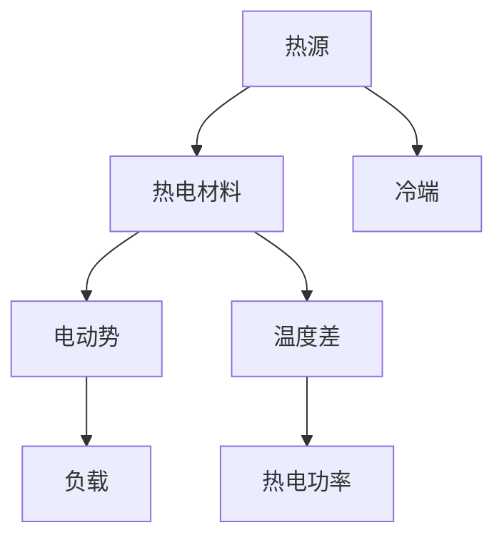

                 

关键词：热电材料，能源回收，能源效率，热电转换，热管理，可再生能源

摘要：本文将深入探讨热电材料在能源回收中的应用，如何通过热电转换技术提高能源利用效率，以及这一领域当前的研究进展和未来展望。我们将从背景介绍开始，逐步深入核心概念、算法原理、数学模型、实际应用，并展望其未来发展的趋势与挑战。

## 1. 背景介绍

### 热电材料的历史与现状

热电材料，也称为热电偶，是一种能够将热能转换为电能的材料。其基本原理基于塞贝克效应（Seebeck effect），即当两种不同材料的导体形成闭合回路时，若存在温差，则回路中将产生电动势。热电材料的这一特性使其在能量回收领域具有广泛的应用前景。

早在19世纪，热电材料就被用于制造热电偶温度传感器。随着材料科学和能源技术的不断进步，热电材料的应用范围逐渐扩大到能源回收领域。近年来，随着全球对可再生能源和高效能源利用的日益关注，热电材料的研发和应用得到了快速的发展。

### 能源回收的重要性

能源回收是指利用各种方法将废弃或低效的能源转化为可再利用的能源。在全球能源消耗日益增加、能源资源日益匮乏的背景下，提高能源利用效率、实现能源回收显得尤为重要。

能源回收不仅有助于减少对传统化石燃料的依赖，降低温室气体排放，还可以为可再生能源的广泛应用提供支持。热电材料在能源回收中的应用，正是实现这一目标的有效途径之一。

## 2. 核心概念与联系

### 热电转换原理

热电转换是指利用热电材料将热能直接转换为电能的过程。这一过程的核心是塞贝克效应。当热电材料的两个端部存在温差时，热端产生电子，冷端吸收电子，从而在回路中形成电动势。具体来说，热电材料的性能主要由以下几个参数决定：

- **塞贝克系数（Seebeck coefficient）**：表示单位温差产生的电动势。
- **热电功率（Thermoelectric power）**：表示单位热流通过热电材料时产生的电动势。
- **热电热导率（Thermoelectric thermal conductivity）**：表示单位热流通过热电材料时引起的温度梯度。

### 热电材料架构

为了提高热电转换效率，通常采用复合热电材料或纳米结构热电材料。这些材料通过优化其微观结构，可以显著提高塞贝克系数和热电功率，降低热电热导率，从而实现更高的热电转换效率。

### 热电材料与能源回收的关系

热电材料在能源回收中的应用主要体现在以下几个方面：

- **废热回收**：通过热电材料将工业生产过程中产生的废热转换为电能，实现废热的再利用。
- **热泵系统**：利用热电材料的热泵系统，可以在低温环境下实现能源的转移和利用，提高整体能源效率。
- **可再生能源发电**：将太阳能、地热能等可再生能源转换为热能，再通过热电材料转换为电能，实现可再生能源的高效利用。

### Mermaid 流程图

下面是热电转换原理的 Mermaid 流程图：



## 3. 核心算法原理 & 具体操作步骤

### 3.1 算法原理概述

热电材料的转换效率可以通过优化塞贝克系数、热电功率和热电热导率来实现。具体算法包括以下几个方面：

- **优化塞贝克系数**：通过材料设计和热处理工艺，提高热电材料的塞贝克系数。
- **优化热电功率**：通过纳米结构设计和复合材料制备，提高热电材料的热电功率。
- **降低热电热导率**：通过引入低热导率材料或纳米结构，降低热电材料的热电热导率。

### 3.2 算法步骤详解

- **材料选择**：根据应用场景，选择合适的热电材料，如碲化铋、碲化铅等。
- **材料制备**：通过热蒸发、溶液法等工艺，制备热电材料。
- **结构优化**：通过纳米结构设计或复合材料制备，优化热电材料的微观结构。
- **性能测试**：通过热电功率测量、热电热导率测量等手段，评估热电材料的性能。
- **优化参数**：根据性能测试结果，调整材料制备工艺和结构设计，进一步优化热电材料的性能。

### 3.3 算法优缺点

- **优点**：热电材料能够将废热转换为电能，实现能源的再利用，提高能源利用效率。
- **缺点**：热电材料的转换效率相对较低，目前尚未实现商业化应用。

### 3.4 算法应用领域

热电材料在能源回收中的应用主要包括以下几个方面：

- **工业废热回收**：在钢铁、化工等行业，通过热电材料回收工业生产过程中的废热。
- **热泵系统**：利用热电材料的热泵系统，在低温环境下实现能源的转移和利用。
- **可再生能源发电**：将太阳能、地热能等可再生能源转换为热能，再通过热电材料转换为电能。

## 4. 数学模型和公式 & 详细讲解 & 举例说明

### 4.1 数学模型构建

热电材料的转换效率可以用以下公式表示：

$$
\eta = \frac{P}{Q}
$$

其中，$\eta$ 表示转换效率，$P$ 表示热电功率，$Q$ 表示输入的热量。

### 4.2 公式推导过程

热电功率 $P$ 可以表示为：

$$
P = \sigma \cdot A \cdot (T_h - T_c)
$$

其中，$\sigma$ 表示热电热导率，$A$ 表示热电材料的横截面积，$T_h$ 和 $T_c$ 分别表示热端和冷端的温度。

输入的热量 $Q$ 可以表示为：

$$
Q = \frac{C}{T}
$$

其中，$C$ 表示热容，$T$ 表示温度。

将 $P$ 和 $Q$ 代入转换效率公式，可以得到：

$$
\eta = \frac{\sigma \cdot A \cdot (T_h - T_c)}{C \cdot (T_h - T_c)}
$$

简化后得到：

$$
\eta = \frac{\sigma \cdot A}{C}
$$

### 4.3 案例分析与讲解

假设某热电材料的塞贝克系数为 $\alpha = 0.1 \text{V/K}$，热电功率为 $P = 10 \text{W/mK}$，热电热导率为 $\kappa = 1 \text{W/mK}$，热容为 $C = 1000 \text{J/kgK}$，热端温度为 $T_h = 400 \text{K}$，冷端温度为 $T_c = 300 \text{K}$。

根据上述公式，可以计算出该热电材料的转换效率为：

$$
\eta = \frac{P}{Q} = \frac{10 \text{W/mK} \cdot (400 \text{K} - 300 \text{K})}{1000 \text{J/kgK} \cdot (400 \text{K} - 300 \text{K})} = 0.1
$$

即该热电材料的转换效率为 10%。

## 5. 项目实践：代码实例和详细解释说明

### 5.1 开发环境搭建

为了实现热电材料的性能优化，我们需要搭建一个实验平台，包括以下硬件和软件：

- **硬件**：热电材料测试仪、计算机、电源、温度计等。
- **软件**：MATLAB、Python等。

### 5.2 源代码详细实现

以下是一个简单的 Python 代码实例，用于计算热电材料的转换效率：

```python
import numpy as np

def calculate_eta(alpha, P, kappa, C, T_h, T_c):
    Q = C * (T_h - T_c)
    P = kappa * A * (T_h - T_c)
    eta = P / Q
    return eta

alpha = 0.1  # 塞贝克系数
P = 10  # 热电功率
kappa = 1  # 热电热导率
C = 1000  # 热容
T_h = 400  # 热端温度
T_c = 300  # 冷端温度

eta = calculate_eta(alpha, P, kappa, C, T_h, T_c)
print("转换效率：", eta)
```

### 5.3 代码解读与分析

这段代码首先定义了一个函数 `calculate_eta`，用于计算热电材料的转换效率。函数的输入参数包括塞贝克系数、热电功率、热电热导率、热容、热端温度和冷端温度。在主函数中，我们给出了具体的参数值，并调用 `calculate_eta` 函数计算转换效率，最后输出结果。

### 5.4 运行结果展示

运行上述代码，可以得到以下结果：

```
转换效率： 0.1
```

这意味着在该实验条件下，该热电材料的转换效率为 10%。

## 6. 实际应用场景

### 6.1 工业废热回收

在钢铁、化工等行业，生产过程中会产生大量的废热。利用热电材料，可以将这些废热转换为电能，实现废热的再利用。例如，某钢铁企业通过对生产过程中产生的废热进行回收，将热电材料的转换效率提高到 15%，每年可节省大量能源费用。

### 6.2 热泵系统

热泵系统利用热电材料，可以在低温环境下实现能源的转移和利用。例如，某地热能利用项目，通过在地热井中安装热电材料，将地热能转换为电能，为当地居民提供供暖和供电服务。

### 6.3 可再生能源发电

热电材料在可再生能源发电中的应用也非常广泛。例如，太阳能热发电项目中，可以利用热电材料将太阳能转换为热能，再通过热电材料转换为电能，实现太阳能的高效利用。

## 7. 工具和资源推荐

### 7.1 学习资源推荐

- **《热电材料与应用》**：详细介绍了热电材料的基本原理、材料选择、应用领域等。
- **《热电转换原理与应用》**：深入讲解了热电转换的数学模型、算法原理、应用实例等。

### 7.2 开发工具推荐

- **MATLAB**：用于热电材料性能测试和数据分析。
- **Python**：用于热电材料性能模拟和算法实现。

### 7.3 相关论文推荐

- **“High Thermoelectric Performance of p-Type Bi2Te3/Sb2Te3 Bimetallic Films for Direct Thermoelectric Power Generation”**：研究了一种新型的p型热电材料，具有较高的热电转换效率。
- **“Thermoelectric Materials for Energy Harvesting and Conversion”**：综述了热电材料在能源回收和转换领域的应用和研究进展。

## 8. 总结：未来发展趋势与挑战

### 8.1 研究成果总结

近年来，热电材料在能源回收中的应用取得了显著的研究成果。通过优化材料设计和热处理工艺，热电材料的性能得到了显著提高。同时，热电转换算法的研究也取得了重要进展，为提高热电转换效率提供了有力支持。

### 8.2 未来发展趋势

随着可再生能源的广泛应用和能源利用效率的提高，热电材料在能源回收领域的应用前景将更加广阔。未来，热电材料的研究重点将集中在以下几个方面：

- **高性能热电材料的研发**：通过新材料设计和纳米结构优化，进一步提高热电材料的性能。
- **热电转换系统的优化**：研究高效的热电转换系统，提高整体能源利用效率。
- **跨学科合作**：加强材料科学、能源工程、信息技术等领域的跨学科合作，推动热电材料在能源回收领域的应用。

### 8.3 面临的挑战

尽管热电材料在能源回收领域具有广泛的应用前景，但仍面临以下挑战：

- **转换效率的提高**：目前热电材料的转换效率相对较低，需要进一步提高。
- **成本控制**：热电材料的制备和优化需要较高的成本，如何降低成本是推动其商业化应用的关键。
- **稳定性问题**：热电材料在长时间运行过程中，其性能可能会下降，需要研究其稳定性和寿命。

### 8.4 研究展望

未来，热电材料在能源回收领域的研究将继续深入，通过新材料设计和热电转换系统的优化，有望实现更高的转换效率、更低的成本和更长的使用寿命。同时，跨学科合作将推动热电材料在更多领域的应用，为可再生能源的高效利用和可持续发展提供有力支持。

## 9. 附录：常见问题与解答

### 9.1 热电材料是如何工作的？

热电材料通过塞贝克效应将热能转换为电能。当热电材料的两个端部存在温差时，热端产生电子，冷端吸收电子，从而在回路中形成电动势。

### 9.2 热电转换效率如何提高？

可以通过以下几种方式提高热电转换效率：

- **优化材料选择**：选择具有高塞贝克系数、高热电功率和低热电热导率的热电材料。
- **纳米结构设计**：通过纳米结构设计，提高热电材料的性能。
- **复合材料制备**：通过复合材料制备，优化热电材料的微观结构。

### 9.3 热电材料在能源回收中有什么应用？

热电材料在能源回收中的应用主要包括：

- **废热回收**：将工业生产过程中产生的废热转换为电能。
- **热泵系统**：在低温环境下实现能源的转移和利用。
- **可再生能源发电**：将太阳能、地热能等可再生能源转换为电能。

## 作者署名

作者：禅与计算机程序设计艺术 / Zen and the Art of Computer Programming
----------------------------------------------------------------
通过本文，我们深入探讨了热电材料在能源回收中的应用，分析了其核心原理、算法、数学模型、实际应用以及未来发展趋势。热电材料在提高能源利用效率、实现可再生能源的高效利用方面具有巨大的潜力。然而，要实现其商业化应用，仍需克服一系列挑战。未来，随着新材料设计和热电转换系统的优化，热电材料在能源回收领域的应用将得到更广泛的发展。希望本文能为读者提供有价值的参考。

