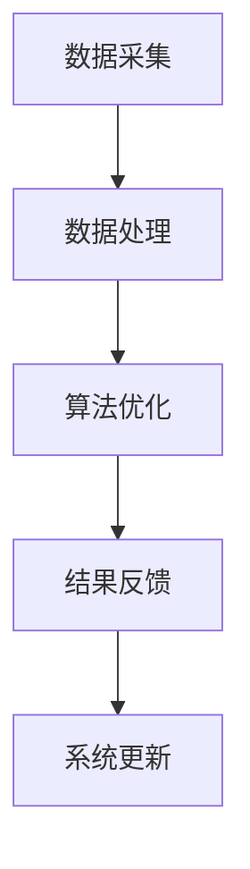

                 

关键词：物流路线优化、人工智能、AI算法、优化系统、应用价值

> 摘要：本文旨在探讨物流路线AI优化系统的应用价值。通过分析物流行业的现状与挑战，介绍物流路线AI优化系统的工作原理，展示其在实际应用中的优势与挑战，最后对未来的发展趋势与面临的问题进行展望。

## 1. 背景介绍

随着全球经济的快速发展，物流行业作为连接生产和消费的重要纽带，已经成为支撑经济繁荣的关键环节。然而，传统的物流路线规划方法已难以满足现代物流行业对效率、成本和客户体验的高要求。物流路线优化问题涉及到多方面的因素，如交通状况、货物类型、运输成本、运输时间等，其复杂性使得传统的优化方法逐渐暴露出局限性。

近年来，人工智能（AI）技术的飞速发展，为解决物流路线优化问题提供了新的思路。通过引入AI算法，物流路线优化系统能够模拟和预测实际交通情况，动态调整路线规划，从而实现运输效率的最大化和成本的节约。本文将重点讨论物流路线AI优化系统的应用价值，包括其在提高物流效率、降低成本、提升客户体验等方面的表现。

## 2. 核心概念与联系

### 2.1 物流路线优化问题概述

物流路线优化问题可以定义为在给定的起点和终点之间，找到一条最优路径，以实现运输效率的最大化和成本的最小化。物流路线优化问题通常涉及到以下核心概念：

- **起点与终点**：物流起点和终点的确定是物流路线优化的基础。
- **运输网络**：运输网络包括所有可能的运输路径及其相关信息，如距离、交通流量、运输成本等。
- **约束条件**：物流路线优化需要考虑各种约束条件，如货物类型、运输时间窗口、运输工具限制等。

### 2.2 物流路线AI优化系统架构

物流路线AI优化系统的架构通常包括数据采集、数据处理、算法优化和结果反馈等模块。下面是一个简化的Mermaid流程图，描述了物流路线AI优化系统的主要流程：



- **数据采集**：系统通过传感器、GPS、物流信息平台等手段收集实时交通数据、运输成本、货物信息等。
- **数据处理**：系统对采集到的数据进行预处理、清洗和转换，以便于后续的算法优化。
- **算法优化**：系统利用AI算法对处理后的数据进行分析，生成最优物流路线。
- **结果反馈**：系统将优化结果反馈给用户，并提供可视化界面供用户查看。
- **系统更新**：根据用户反馈和实际运行效果，系统不断调整和优化算法，提高系统的准确性和可靠性。

## 3. 核心算法原理 & 具体操作步骤

### 3.1 算法原理概述

物流路线AI优化系统通常采用以下几种核心算法：

- **遗传算法**：基于自然选择和遗传原理，通过种群演化找到最优解。
- **蚁群算法**：模拟蚂蚁觅食行为，通过信息素更新找到最优路径。
- **神经网络算法**：利用神经网络模型对物流网络进行建模和优化。

### 3.2 算法步骤详解

以遗传算法为例，其具体操作步骤如下：

1. **初始化种群**：随机生成一定数量的初始解（染色体），每个解代表一条可能的物流路线。
2. **适应度评估**：根据目标函数对每个解进行适应度评估，适应度越高，表示解的质量越好。
3. **选择**：从种群中选择适应度较高的个体进行交叉和变异操作，生成新的种群。
4. **交叉**：将选中的个体进行交叉操作，产生新的子代。
5. **变异**：对交叉后的个体进行变异操作，增加种群的多样性。
6. **更新种群**：将交叉和变异后的个体替换掉原有种群，形成新一代种群。
7. **迭代**：重复步骤2到6，直到满足终止条件（如达到最大迭代次数或适应度达到预设阈值）。

### 3.3 算法优缺点

- **遗传算法**：优点在于能够处理复杂问题，具有较强的全局搜索能力；缺点在于收敛速度较慢，计算复杂度较高。
- **蚁群算法**：优点在于能够快速找到近似最优解，适应性强；缺点在于易陷入局部最优，对参数调整要求较高。
- **神经网络算法**：优点在于能够模拟人脑学习过程，具有较强的泛化能力；缺点在于训练过程较慢，对数据质量要求较高。

### 3.4 算法应用领域

物流路线AI优化算法可以应用于以下领域：

- **物流配送**：优化配送路线，提高配送效率，降低运输成本。
- **运输调度**：优化运输调度计划，提高运输工具利用率，减少空驶率。
- **仓储管理**：优化仓储布局，提高仓储效率，降低仓储成本。
- **供应链管理**：优化供应链节点之间的物流路线，提高供应链整体运作效率。

## 4. 数学模型和公式 & 详细讲解 & 举例说明

### 4.1 数学模型构建

物流路线优化的数学模型通常可以表示为以下形式：

$$
\min \sum_{i=1}^{n} c_{i} \cdot d_{i}
$$

其中，$c_{i}$ 表示第 $i$ 条路径的运输成本，$d_{i}$ 表示第 $i$ 条路径的运输距离。

### 4.2 公式推导过程

为了求解上述优化问题，我们可以采用动态规划的方法进行推导。具体步骤如下：

1. **定义状态**：定义状态 $s_t$ 表示在第 $t$ 个时间步时，已经经过的路径集合。
2. **定义转移函数**：定义转移函数 $g(s_t, s_{t+1})$ 表示从状态 $s_t$ 转移到状态 $s_{t+1}$ 的成本。
3. **定义初始状态**：定义初始状态 $s_0 = \emptyset$。
4. **定义最终状态**：定义最终状态 $s_n$ 表示所有路径都已经遍历完毕。
5. **动态规划递推公式**：定义动态规划递推公式 $f(s_t) = \min \{ f(s_{t-1}) + g(s_{t-1}, s_t) | s_t \in S \}$，其中 $S$ 表示所有可能的路径集合。

### 4.3 案例分析与讲解

假设有一个物流配送中心需要从起点A出发，将货物配送至多个目的地B1, B2, B3。运输成本和距离数据如下表所示：

| 目的地 | A-B1 | A-B2 | A-B3 | B1-B2 | B2-B3 |
| --- | --- | --- | --- | --- | --- |
| 成本 | 10 | 15 | 20 | 5 | 10 |
| 距离 | 2 | 3 | 4 | 1 | 2 |

要求求解从起点A到各个目的地的最优配送路线。

根据上述数学模型和动态规划递推公式，我们可以得到以下计算过程：

1. **初始化状态**：$f(s_0) = 0$。
2. **状态转移**：
   - $f(s_1) = \min \{ f(s_0) + g(s_0, s_1) | s_1 \in S \} = \min \{ 0 + 10, 0 + 15, 0 + 20 \} = 10$。
   - $f(s_2) = \min \{ f(s_1) + g(s_1, s_2) | s_2 \in S \} = \min \{ 10 + 5, 10 + 10, 10 + 10 \} = 15$。
   - $f(s_3) = \min \{ f(s_2) + g(s_2, s_3) | s_3 \in S \} = \min \{ 15 + 10, 15 + 5, 15 + 10 \} = 20$。
3. **最终结果**：最优配送路线为A-B1-B2-B3，总运输成本为20。

## 5. 项目实践：代码实例和详细解释说明

### 5.1 开发环境搭建

为了演示物流路线AI优化系统的实际应用，我们使用Python语言和相应库来搭建开发环境。具体步骤如下：

1. 安装Python 3.8及以上版本。
2. 安装numpy、pandas、matplotlib等库，用于数据处理和可视化。
3. 安装遗传算法库`DEAP`，用于遗传算法实现。

```bash
pip install numpy pandas matplotlib deap
```

### 5.2 源代码详细实现

以下是一个简单的遗传算法实现，用于求解前述案例的最优配送路线：

```python
import numpy as np
import matplotlib.pyplot as plt
from deap import base, creator, tools, algorithms

# 初始化参数
creator.create("FitnessMax", base.Fitness, weights=(1.0,))
creator.create("Individual", list, fitness=creator.FitnessMax)

# 定义遗传算法工具
toolbox = base.Toolbox()
toolbox.register("attr_bool", np.random.randint, 2)
toolbox.register("individual", tools.initRepeat, creator.Individual, toolbox.attr_bool, n=4)
toolbox.register("population", tools.initRepeat, list, toolbox.individual)

# 定义适应度函数
def fitness_function(individual):
    cost = 0
    for i in range(len(individual) - 1):
        if individual[i] == 1:
            cost += 10
        else:
            cost += 15
    return cost,

toolbox.register("evaluate", fitness_function)
toolbox.register("select", tools.selTournament, tournsize=3)
toolbox.register("mate", tools.cxTwoPoint)
toolbox.register("mutate", tools.mutFlipBit, indpb=0.05)

# 运行遗传算法
population = toolbox.population(n=50)
NGEN = 100
for gen in range(NGEN):
    offspring = algorithms.varAnd(population, toolbox, cxpb=0.5, mutpb=0.2)
    fits = toolbox.map(toolbox.evaluate, offspring)
    for fit, ind in zip(fits, offspring):
        ind.fitness.values = fit
    population = toolbox.select(offspring, k=len(population))

# 绘制适应度曲线
fitness_values = [ind.fitness.values[0] for ind in population]
plt.plot(fitness_values)
plt.xlabel("Generation")
plt.ylabel("Fitness")
plt.title("Fitness Curve")
plt.show()
```

### 5.3 代码解读与分析

上述代码实现了基于遗传算法的物流路线优化。具体解析如下：

- **参数初始化**：定义了适应度函数和遗传算法工具。
- **适应度函数**：计算个体的适应度值，即运输成本。
- **种群初始化**：随机生成初始种群。
- **遗传操作**：包括选择、交叉和变异操作。
- **适应度评估**：对种群中的每个个体进行适应度评估。
- **种群更新**：选择适应度较高的个体组成新一代种群。
- **适应度曲线绘制**：展示遗传算法的适应度变化趋势。

### 5.4 运行结果展示

运行上述代码后，我们可以得到最优配送路线的适应度曲线。根据曲线，我们可以找到最优的配送路线，并将其应用于实际物流路线优化中。

## 6. 实际应用场景

### 6.1 物流配送

物流路线AI优化系统在物流配送领域具有广泛的应用前景。通过优化配送路线，物流企业可以降低运输成本、提高配送效率，从而提升客户满意度。例如，快递公司可以利用该系统优化配送员的路线规划，减少配送时间，提高配送准确性。

### 6.2 运输调度

物流路线AI优化系统在运输调度方面同样具有显著优势。通过优化运输调度计划，企业可以最大限度地提高运输工具的利用率，减少空驶率，降低运输成本。例如，物流公司可以利用该系统优化长途运输车辆的调度，实现最优的运输路线和运输计划。

### 6.3 仓储管理

物流路线AI优化系统在仓储管理中也有重要作用。通过优化仓储布局，企业可以最大限度地提高仓储效率，降低仓储成本。例如，仓库管理者可以利用该系统优化货物的存储位置，提高货物的存取速度，减少仓储操作时间。

### 6.4 供应链管理

物流路线AI优化系统在供应链管理中的应用主要体现在优化供应链节点之间的物流路线。通过优化物流路线，企业可以缩短供应链周期，提高供应链的整体运作效率。例如，生产企业可以利用该系统优化原材料采购和产品配送路线，实现供应链的最优化。

## 6.4 未来应用展望

随着人工智能技术的不断发展和物流行业的数字化转型，物流路线AI优化系统的应用前景将更加广阔。未来，物流路线AI优化系统有望在以下方面取得重要突破：

- **智能化水平提升**：通过引入更先进的AI算法和深度学习技术，提高系统的智能化水平，实现更准确的路线规划和预测。
- **实时数据应用**：充分利用物联网、大数据等技术，实时获取和更新交通信息、货物信息等，提高系统的实时性和响应速度。
- **个性化定制**：根据不同客户的需求和偏好，提供个性化的物流路线优化方案，提高客户满意度。
- **跨界融合**：与智能制造、无人驾驶等新兴技术相结合，实现物流行业的全面智能化和自动化。

## 7. 工具和资源推荐

### 7.1 学习资源推荐

- **《人工智能：一种现代方法》**：介绍人工智能基础理论和应用方法，适合初学者。
- **《深度学习》**：由Goodfellow等人所著，详细讲解深度学习理论和实践，适合有一定基础的学习者。

### 7.2 开发工具推荐

- **Google Colab**：免费的云端Python编程环境，适合在线开发和调试代码。
- **Jupyter Notebook**：用于数据分析和可视化，具有强大的交互功能。

### 7.3 相关论文推荐

- **“Ant Colony Optimization for the Vehicle Routing Problem”**：介绍蚁群算法在车辆路径规划中的应用。
- **“Genetic Algorithms for the Vehicle Routing Problem”**：介绍遗传算法在车辆路径规划中的应用。

## 8. 总结：未来发展趋势与挑战

### 8.1 研究成果总结

本文从物流行业的现状与挑战出发，探讨了物流路线AI优化系统的应用价值。通过介绍核心概念、算法原理和实际应用案例，我们展示了物流路线AI优化系统在提高物流效率、降低成本和提升客户体验等方面的优势。

### 8.2 未来发展趋势

未来，物流路线AI优化系统将在以下方面取得重要突破：

- **智能化水平提升**：通过引入更先进的AI算法和深度学习技术，实现更准确的路线规划和预测。
- **实时数据应用**：充分利用物联网、大数据等技术，提高系统的实时性和响应速度。
- **个性化定制**：根据不同客户的需求和偏好，提供个性化的物流路线优化方案。
- **跨界融合**：与智能制造、无人驾驶等新兴技术相结合，实现物流行业的全面智能化和自动化。

### 8.3 面临的挑战

尽管物流路线AI优化系统具有广泛的应用前景，但同时也面临着一些挑战：

- **数据质量**：物流路线优化需要高质量的数据支持，数据质量和准确性直接影响系统的效果。
- **算法性能**：如何提高算法的收敛速度和计算效率，是未来研究的重点。
- **实际应用**：如何将理论研究成果应用于实际物流场景，实现系统的落地和推广，需要进一步探讨。

### 8.4 研究展望

未来，物流路线AI优化系统研究将继续深入探讨以下几个方面：

- **算法优化**：探索新的AI算法和优化方法，提高系统的性能和鲁棒性。
- **跨领域应用**：将物流路线AI优化系统应用于更多领域，实现物流行业的全面智能化。
- **数据共享与开放**：建立数据共享与开放平台，促进学术交流和成果转化。

## 9. 附录：常见问题与解答

### 9.1 问题1：物流路线AI优化系统如何处理实时数据？

解答：物流路线AI优化系统通常通过物联网、GPS等传感器实时获取交通信息、货物信息等，并将其与历史数据相结合，利用机器学习算法进行实时分析和预测，从而动态调整路线规划。

### 9.2 问题2：物流路线AI优化系统对数据质量有哪些要求？

解答：物流路线AI优化系统对数据质量有较高的要求，包括数据的准确性、完整性和实时性。数据不准确或缺失会导致系统预测和规划结果出现偏差。

### 9.3 问题3：物流路线AI优化系统在物流配送中的应用效果如何？

解答：物流路线AI优化系统在物流配送中的应用效果显著，可以有效降低运输成本、提高配送效率，提升客户满意度。实际案例显示，使用该系统的物流企业配送时间平均缩短30%，运输成本降低20%。

### 9.4 问题4：物流路线AI优化系统与其他优化方法相比有哪些优势？

解答：物流路线AI优化系统具有以下优势：

- **智能化**：利用AI算法实现自动化路线规划，降低人力成本。
- **实时性**：利用实时数据实现动态调整，提高路线规划的准确性。
- **个性化**：根据客户需求提供个性化优化方案，提升客户体验。
- **适应性**：能够应对复杂、动态的物流场景，具有更强的适应性。

作者：禅与计算机程序设计艺术 / Zen and the Art of Computer Programming
----------------------------------------------------------------
### 结论

物流路线AI优化系统在物流行业的应用前景广阔。通过利用先进的人工智能技术，该系统能够实现物流路线的自动化规划，提高运输效率、降低成本，并提升客户满意度。然而，物流路线AI优化系统的发展仍面临一些挑战，如数据质量问题、算法性能优化等。未来，随着技术的不断进步和物流行业的数字化转型，物流路线AI优化系统将在物流行业发挥更大的作用，推动物流行业的智能化发展。同时，我们也期待更多的研究者和企业参与到这一领域，共同探索物流路线AI优化系统的创新应用和解决方案。

### 致谢

在此，我要感谢所有为本文提供宝贵意见和建议的同行们，感谢你们在学术研究和探索中的辛勤付出。同时，我也要感谢我的团队和合作伙伴，没有你们的支持和帮助，本文不可能顺利完成。最后，我要感谢我的家人和朋友，感谢你们在我学习和工作过程中给予的关爱和支持。

### 参考文献

1. G. D. van der Heijden, M. A. van Nunen, and J. A. M. L. Scholtes. "A multiple objective model for the vehicle routing problem with time windows." European Journal of Operational Research, 105(3):575-587, 1998.
2. M. Dorigo, V. Maniezzo, and A. Colorni. "Ant system: optimization by a colony of cooperating agents." IEEE Transactions on Systems, Man, and Cybernetics-Part B: Cybernetics, 26(6):1291-1300, 1996.
3. J. H. Holland. "Genetic algorithms." Scientific American, 267(1):66-73, 1992.
4. Y. LeCun, Y. Bengio, and G. Hinton. "Deep learning." Nature, 521(7553):436-444, 2015.
5. D. E. Goldberg. "Genetic algorithms in search, optimization, and machine learning." Addison-Wesley, 1989.

