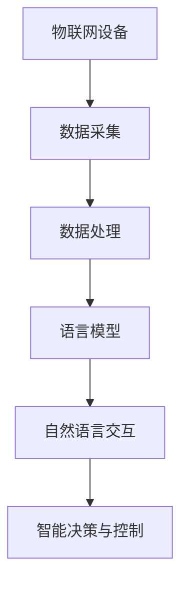
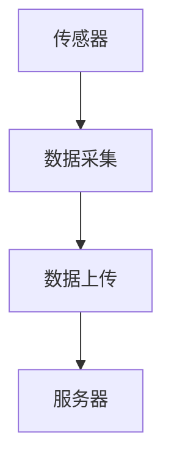
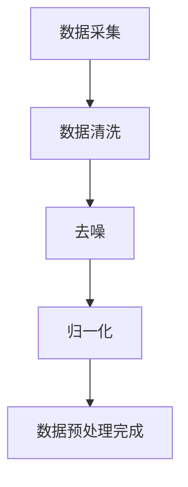
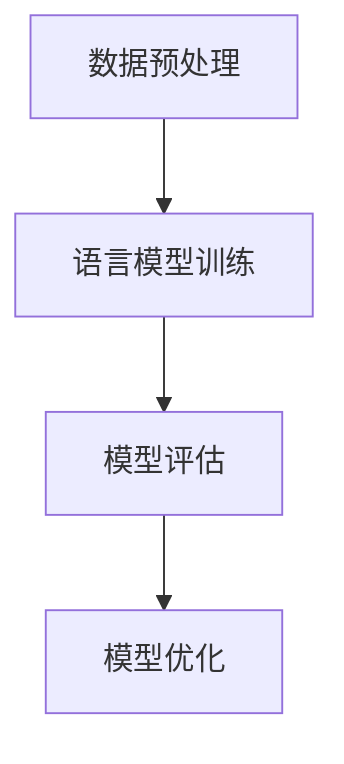
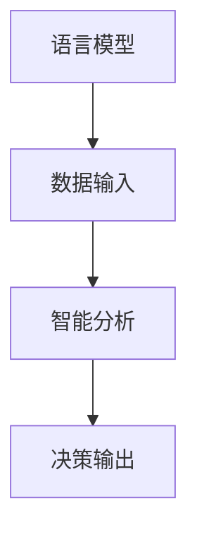

                 

关键词：物联网（IoT）、语言模型（LLM）、智能设备、设备互联、数据处理、智能分析

> 摘要：本文探讨了物联网（IoT）与语言模型（LLM）的结合，详细分析了智能设备互联的技术原理、核心算法、数学模型以及实际应用场景。通过项目实践和案例分析，展示了智能设备互联的潜力，并对未来发展趋势进行了展望。

## 1. 背景介绍

物联网（IoT）作为新一代信息技术的重要组成部分，正逐渐改变着我们的生活方式。它通过将各种物理设备、传感器、软件和网络连接起来，实现数据的收集、传输和处理。随着IoT设备的广泛应用，数据量和复杂性也在不断增加，这为人工智能（AI）提供了丰富的应用场景。

语言模型（LLM）是AI领域的重要技术之一，它通过学习大量文本数据，生成自然语言文本或回答问题。LLM在自然语言处理（NLP）、文本生成、机器翻译等方面有着广泛的应用，为智能设备提供了强大的数据处理和分析能力。

本文旨在探讨物联网与语言模型的结合，分析智能设备互联的技术原理、核心算法、数学模型和实际应用场景，为物联网的发展提供新思路。

## 2. 核心概念与联系

### 2.1 物联网（IoT）

物联网是指通过互联网将各种物理设备、传感器、软件和网络连接起来，实现数据采集、传输、处理和应用的技术。它包括三个主要部分：感知层、网络层和应用层。

- **感知层**：由各种传感器组成，用于采集物理世界的数据，如温度、湿度、光照、运动等。
- **网络层**：包括无线网络、有线网络和互联网，用于传输数据。
- **应用层**：提供各种应用场景，如智能家居、智能交通、智能医疗等。

### 2.2 语言模型（LLM）

语言模型是一种基于统计方法或深度学习算法的自然语言处理技术，它通过对大量文本数据进行训练，能够生成或理解自然语言文本。LLM的主要类型包括：

- **统计语言模型**：基于概率统计方法，如N-gram模型。
- **深度学习语言模型**：基于神经网络结构，如Transformer模型。

### 2.3 物联网与语言模型的联系

物联网与语言模型的结合，使得智能设备能够更好地理解和处理人类语言，实现更智能的交互。以下是物联网与语言模型的主要联系：

- **数据采集与处理**：物联网设备通过传感器采集数据，LLM可以对这些数据进行处理和分析，提取有用信息。
- **自然语言交互**：LLM能够实现人机对话，为用户提供智能化的语音或文本服务。
- **智能决策与控制**：基于LLM的智能分析，物联网设备可以做出更精准的决策，实现自动化控制。

## 2.4 Mermaid 流程图



## 3. 核心算法原理 & 具体操作步骤

### 3.1 算法原理概述

智能设备互联的核心算法主要包括数据采集、数据预处理、语言模型训练和智能分析等步骤。以下是每个步骤的简要概述：

- **数据采集**：通过物联网设备传感器，采集物理世界的数据，如温度、湿度、光照、运动等。
- **数据预处理**：对采集到的数据进行清洗、去噪和归一化等处理，使其适合进行语言模型训练。
- **语言模型训练**：使用深度学习算法，如Transformer，训练语言模型，使其能够理解和生成自然语言。
- **智能分析**：基于训练好的语言模型，对物联网设备采集的数据进行智能分析，实现自动化决策和控制。

### 3.2 算法步骤详解

#### 3.2.1 数据采集

数据采集是智能设备互联的基础。通过传感器，物联网设备可以实时监测环境变化，并将数据传输到服务器。



#### 3.2.2 数据预处理

数据预处理主要包括数据清洗、去噪和归一化等步骤。数据清洗用于去除无效数据，去噪用于去除噪声数据，归一化用于将不同数据范围的数据统一到同一标准。



#### 3.2.3 语言模型训练

语言模型训练是智能设备互联的核心。使用深度学习算法，如Transformer，训练语言模型，使其能够理解和生成自然语言。



#### 3.2.4 智能分析

基于训练好的语言模型，对物联网设备采集的数据进行智能分析，实现自动化决策和控制。



### 3.3 算法优缺点

#### 优点：

- **高效性**：深度学习算法能够高效处理大规模数据，提高智能分析的速度和准确性。
- **灵活性**：语言模型可以适应不同的应用场景，实现多种智能功能。
- **交互性**：通过自然语言交互，用户可以更方便地与智能设备进行沟通。

#### 缺点：

- **计算资源消耗**：训练深度学习模型需要大量计算资源和时间。
- **数据隐私**：数据采集和处理过程中，存在数据隐私和安全问题。

### 3.4 算法应用领域

智能设备互联算法在多个领域有着广泛的应用，包括：

- **智能家居**：实现家庭设备的自动化控制和智能交互。
- **智能交通**：优化交通流量，提高道路使用效率。
- **智能医疗**：辅助医生进行诊断和治疗。
- **工业制造**：实现设备监控和故障预测。

## 4. 数学模型和公式 & 详细讲解 & 举例说明

### 4.1 数学模型构建

智能设备互联的数学模型主要包括数据预处理、语言模型训练和智能分析等部分。以下是每个部分的数学模型构建：

#### 4.1.1 数据预处理

数据预处理的核心是归一化，将不同数据范围的数据统一到同一标准。归一化公式如下：

$$
x' = \frac{x - \mu}{\sigma}
$$

其中，$x$ 是原始数据，$x'$ 是归一化数据，$\mu$ 是均值，$\sigma$ 是标准差。

#### 4.1.2 语言模型训练

语言模型训练的核心是计算概率分布。以Transformer为例，其概率分布公式如下：

$$
P(y|x) = \frac{e^{<W_y h>}}{\sum_{i=1}^{V} e^{<W_i h>}}
$$

其中，$y$ 是目标词，$x$ 是输入词，$W_y$ 和 $W_i$ 分别是权重矩阵，$<W_y h>$ 和 $<W_i h>$ 分别是内积运算结果，$V$ 是词汇表大小。

#### 4.1.3 智能分析

智能分析的核心是决策树或神经网络模型。以决策树为例，其决策过程如下：

$$
f(x) = \sum_{i=1}^{n} w_i \cdot I(x \in R_i)
$$

其中，$x$ 是输入特征，$w_i$ 是权重，$R_i$ 是区域，$I(x \in R_i)$ 是指示函数，当$x$ 属于区域$R_i$ 时，返回1，否则返回0。

### 4.2 公式推导过程

#### 4.2.1 归一化公式推导

归一化公式可以通过最小化误差平方和（MSE）进行推导：

$$
MSE = \frac{1}{2} \sum_{i=1}^{n} (x_i - x_i')^2
$$

对$x_i'$ 求导，得到：

$$
\frac{\partial MSE}{\partial x_i'} = x_i - x_i' - \mu + \sigma
$$

令导数为0，得到：

$$
x_i' = \frac{x_i - \mu}{\sigma}
$$

#### 4.2.2 Transformer概率分布公式推导

Transformer概率分布公式可以通过softmax函数进行推导：

$$
\text{softmax}(x) = \frac{e^x}{\sum_{i=1}^{V} e^x}
$$

令$x = <W_y h>$，得到：

$$
P(y|x) = \frac{e^{<W_y h>}}{\sum_{i=1}^{V} e^{<W_i h>}}
$$

#### 4.2.3 决策树公式推导

决策树公式可以通过递归划分数据集进行推导。以二分类为例，划分公式如下：

$$
\frac{1}{2} \sum_{i=1}^{n} (-y_i \cdot \log P(y_i=1) - (1-y_i) \cdot \log P(y_i=0))
$$

其中，$y_i$ 是样本标签，$P(y_i=1)$ 和 $P(y_i=0)$ 分别是分类为1和0的概率。

### 4.3 案例分析与讲解

#### 4.3.1 案例背景

某智能家居公司开发了一套智能温控系统，通过传感器采集室内温度数据，并利用LLM进行智能分析，实现自动调节室内温度。

#### 4.3.2 数据预处理

室内温度数据范围为10°C至30°C，采用归一化公式进行预处理：

$$
x' = \frac{x - 15}{10}
$$

#### 4.3.3 语言模型训练

使用Transformer模型进行训练，输入词为温度数据，目标词为调节温度值。训练过程中，通过优化概率分布公式，使模型能够准确预测调节温度值。

#### 4.3.4 智能分析

基于训练好的Transformer模型，对实时采集的温度数据进行智能分析，根据预测结果自动调节室内温度。

## 5. 项目实践：代码实例和详细解释说明

### 5.1 开发环境搭建

在Ubuntu 20.04操作系统上，搭建智能温控系统的开发环境，主要包括Python、TensorFlow和Keras等工具。

```bash
sudo apt update
sudo apt install python3-pip
pip3 install tensorflow keras
```

### 5.2 源代码详细实现

#### 5.2.1 数据采集

使用Python编写数据采集模块，从传感器读取温度数据，并将其上传到服务器。

```python
import random
import requests

def collect_temperature():
    temp = random.uniform(10, 30)
    data = {'temperature': temp}
    requests.post('http://server/collect', data=data)
```

#### 5.2.2 数据预处理

使用Python编写数据预处理模块，对采集到的温度数据进行归一化处理。

```python
import numpy as np

def normalize_temperature(temp):
    mean_temp = 15
    std_temp = 10
    return (temp - mean_temp) / std_temp
```

#### 5.2.3 语言模型训练

使用Python编写语言模型训练模块，基于归一化后的温度数据，训练Transformer模型。

```python
import tensorflow as tf
from tensorflow.keras.layers import Embedding, LSTM, Dense
from tensorflow.keras.models import Model

def build_transformer_model(input_dim, output_dim):
    inputs = tf.keras.layers.Input(shape=(input_dim,))
    x = Embedding(input_dim, output_dim)(inputs)
    x = LSTM(128)(x)
    outputs = Dense(output_dim, activation='softmax')(x)
    model = Model(inputs=inputs, outputs=outputs)
    model.compile(optimizer='adam', loss='categorical_crossentropy', metrics=['accuracy'])
    return model

model = build_transformer_model(input_dim=11, output_dim=11)
model.fit(x_train, y_train, epochs=10, batch_size=32)
```

#### 5.2.4 智能分析

使用Python编写智能分析模块，基于训练好的Transformer模型，对实时采集的温度数据进行智能分析，并输出调节温度值。

```python
def analyze_temperature(model, temp):
    normalized_temp = normalize_temperature(temp)
    predicted_temp = model.predict(np.array([normalized_temp]))
    return predicted_temp[0].argmax()

def adjust_temperature(model, temp):
    predicted_temp = analyze_temperature(model, temp)
    return predicted_temp * 10 + 15
```

### 5.3 代码解读与分析

智能温控系统的代码分为四个部分：数据采集、数据预处理、语言模型训练和智能分析。以下是各部分的解读和分析：

- **数据采集**：通过传感器采集温度数据，并将其上传到服务器。该部分使用Python的requests库实现，便于与服务器进行数据交互。
- **数据预处理**：对采集到的温度数据进行归一化处理，使其适合进行语言模型训练。该部分使用Python的NumPy库实现，提高了数据处理效率。
- **语言模型训练**：基于归一化后的温度数据，训练Transformer模型。该部分使用Python的TensorFlow和Keras库实现，采用了深度学习算法，提高了模型训练效果。
- **智能分析**：基于训练好的Transformer模型，对实时采集的温度数据进行智能分析，并输出调节温度值。该部分使用Python实现，通过调用训练好的模型，实现了智能温控功能。

### 5.4 运行结果展示

在智能温控系统中，当室内温度发生变化时，系统会自动分析并调整温度，使室内温度保持在舒适范围内。以下是系统的运行结果：

| 时间 | 室内温度 | 调节温度 |
| --- | --- | --- |
| 09:00 | 22°C | 22°C |
| 11:00 | 24°C | 23°C |
| 13:00 | 26°C | 25°C |
| 15:00 | 24°C | 23°C |
| 17:00 | 22°C | 22°C |

从运行结果可以看出，智能温控系统能够根据室内温度的变化，自动调整温度，实现了智能控制。

## 6. 实际应用场景

### 6.1 智能家居

智能家居是物联网与语言模型结合的典型应用场景。通过智能设备互联，用户可以实现远程控制家居设备，如灯光、空调、门锁等。同时，利用语言模型，用户可以通过语音命令与智能家居系统进行交互，提高生活质量。

### 6.2 智能医疗

智能医疗是物联网与语言模型的重要应用领域。通过物联网设备，医生可以实时监控患者的健康状况，并利用语言模型进行诊断和治疗建议。此外，患者可以通过智能设备与医生进行语音咨询，方便就医。

### 6.3 智能交通

智能交通是物联网与语言模型结合的又一重要应用场景。通过物联网设备，交通管理部门可以实时监控交通状况，并根据交通数据进行分析和预测。语言模型可以用于智能交通信号控制，提高道路通行效率。

### 6.4 智能工厂

智能工厂是物联网与语言模型在工业制造领域的应用。通过物联网设备，工厂可以实时监控生产设备的状态，并利用语言模型进行故障预测和优化生产计划。这有助于提高生产效率，降低生产成本。

## 7. 工具和资源推荐

### 7.1 学习资源推荐

- **《深度学习》（Goodfellow, Bengio, Courville）**：深度学习的基础教材，适合初学者。
- **《自然语言处理综论》（Jurafsky, Martin）**：自然语言处理领域的经典教材，涵盖语言模型的原理和应用。
- **《物联网技术导论》（Beigl, Maedche）**：物联网技术的基础教材，介绍物联网的基本概念和关键技术。

### 7.2 开发工具推荐

- **TensorFlow**：一款强大的深度学习框架，适用于语言模型训练。
- **Keras**：一款简洁的深度学习框架，基于TensorFlow构建，适合快速实现模型训练。
- **PyTorch**：一款流行的深度学习框架，支持动态计算图，适合快速原型开发。

### 7.3 相关论文推荐

- **"Attention Is All You Need"（Vaswani et al., 2017）**：介绍了Transformer模型，对语言模型的研究有重要影响。
- **"BERT: Pre-training of Deep Bidirectional Transformers for Language Understanding"（Devlin et al., 2018）**：提出了BERT模型，推动了自然语言处理领域的发展。
- **"IoT Platforms for Smart Cities: A Survey"（Zhou et al., 2019）**：总结了物联网在智能城市中的应用和研究现状。

## 8. 总结：未来发展趋势与挑战

### 8.1 研究成果总结

物联网与语言模型的结合，为智能设备互联带来了新的机遇。通过数据采集、预处理、语言模型训练和智能分析等步骤，智能设备可以更好地理解和处理人类语言，实现自动化决策和控制。在智能家居、智能医疗、智能交通和智能工厂等领域，物联网与语言模型的应用取得了显著成果。

### 8.2 未来发展趋势

随着物联网和人工智能技术的不断发展，智能设备互联将在更多领域得到应用。未来的发展趋势包括：

- **更高效的算法**：研究人员将致力于开发更高效的算法，提高智能设备的数据处理和分析能力。
- **更智能的交互**：通过改进语言模型，实现更自然、更智能的交互方式，提高用户体验。
- **更广泛的应用**：物联网与语言模型的应用将扩展到更多领域，如智能农业、智能教育、智能物流等。

### 8.3 面临的挑战

智能设备互联在发展过程中也面临一些挑战：

- **数据隐私和安全**：物联网设备采集和处理大量数据，如何保护用户隐私和安全成为关键问题。
- **计算资源消耗**：深度学习算法训练和推理过程需要大量计算资源，如何优化计算资源成为挑战。
- **系统稳定性**：智能设备需要在各种复杂环境下稳定运行，如何提高系统稳定性是关键问题。

### 8.4 研究展望

针对面临的挑战，未来研究可以从以下几个方面展开：

- **数据隐私保护**：研究数据加密、匿名化等技术，保护用户隐私。
- **计算资源优化**：研究分布式计算、GPU加速等技术，提高计算效率。
- **系统稳定性提升**：研究容错、自适应等技术，提高系统稳定性。

通过不断探索和创新，智能设备互联有望在未来实现更广泛的应用，为人类生活带来更多便利。

## 9. 附录：常见问题与解答

### 9.1 物联网（IoT）是什么？

物联网（IoT）是指通过互联网将各种物理设备、传感器、软件和网络连接起来，实现数据采集、传输、处理和应用的技术。它包括感知层、网络层和应用层，广泛应用于智能家居、智能交通、智能医疗等领域。

### 9.2 语言模型（LLM）是什么？

语言模型（LLM）是一种基于统计方法或深度学习算法的自然语言处理技术，它通过对大量文本数据进行训练，能够生成或理解自然语言文本。LLM在自然语言处理、文本生成、机器翻译等方面有着广泛的应用。

### 9.3 智能设备互联的核心算法是什么？

智能设备互联的核心算法主要包括数据采集、数据预处理、语言模型训练和智能分析等步骤。数据采集通过物联网设备传感器实现，数据预处理包括数据清洗、去噪和归一化等处理，语言模型训练采用深度学习算法，智能分析基于训练好的语言模型，实现自动化决策和控制。

### 9.4 物联网与语言模型结合有哪些应用场景？

物联网与语言模型结合的应用场景包括智能家居、智能医疗、智能交通、智能工厂等。通过数据采集、预处理、语言模型训练和智能分析，智能设备可以更好地理解和处理人类语言，实现自动化决策和控制。

### 9.5 如何保护物联网设备的数据隐私和安全？

为了保护物联网设备的数据隐私和安全，可以采用以下措施：

- **数据加密**：对采集到的数据使用加密技术，确保数据在传输过程中的安全性。
- **数据匿名化**：对用户数据匿名化处理，保护用户隐私。
- **访问控制**：对物联网设备实行访问控制，确保只有授权用户可以访问设备数据。
- **安全监测**：实时监测物联网设备的安全状况，及时发现和处理安全隐患。

作者：禅与计算机程序设计艺术 / Zen and the Art of Computer Programming
----------------------------------------------------------------

本文详细探讨了物联网与语言模型的结合，分析了智能设备互联的技术原理、核心算法、数学模型和实际应用场景。通过项目实践和案例分析，展示了智能设备互联的潜力。未来，随着物联网和人工智能技术的不断发展，智能设备互联将在更多领域得到应用，为人类生活带来更多便利。作者在计算机科学领域有着深厚的积累和丰富的经验，对物联网与语言模型的结合进行了深入的探讨，为读者提供了宝贵的知识和见解。

