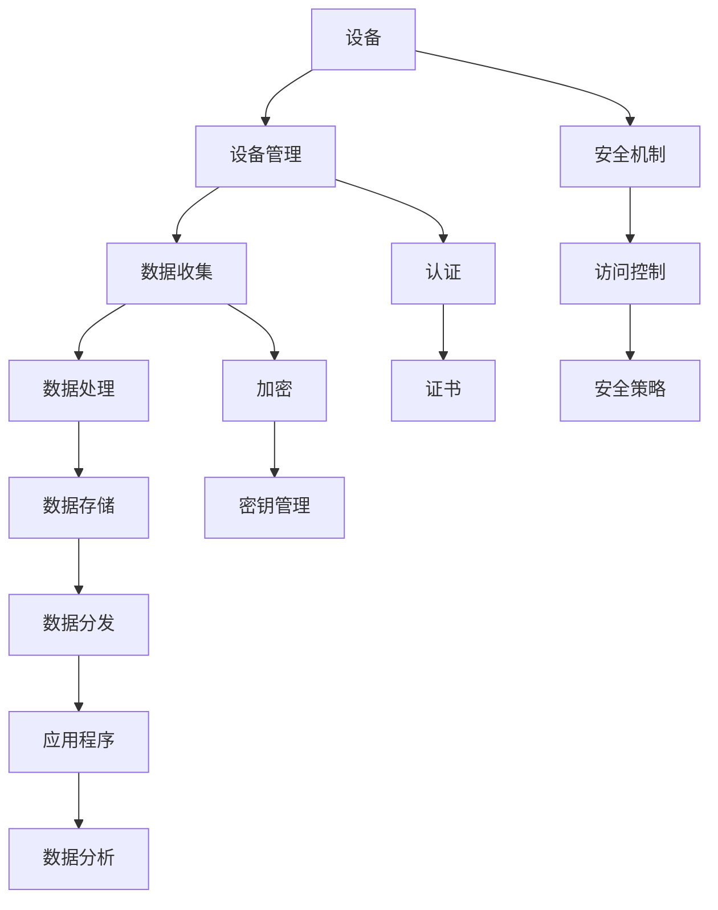

                 

关键词：物联网，AWS IoT，Azure IoT Hub，物联网平台，MQTT，边缘计算，云平台，物联网安全，物联网架构

> 摘要：本文深入探讨了两大主流物联网平台——AWS IoT 和 Azure IoT Hub 的设计、功能、应用场景及其在物联网生态系统中的重要性。通过对比分析，读者可以了解两者在实现物联网解决方案时的优势与不足，为实际应用提供有益的参考。

## 1. 背景介绍

物联网（Internet of Things，IoT）作为当前科技领域的一个重要趋势，正迅速改变着我们的生活和工业生产方式。随着传感器、通信技术和云计算的发展，物联网已经渗透到了各个行业，从智能家居、智慧城市到工业自动化、医疗健康等。物联网平台作为连接物理世界和数字世界的桥梁，承担了数据收集、处理、存储和分发的重要角色。

在众多物联网平台中，AWS IoT 和 Azure IoT Hub 是两大主要竞争者。它们分别由亚马逊和微软推出，具有广泛的用户基础和强大的功能，为开发者提供了丰富的资源和支持。本文将详细分析这两个平台的架构、特性、优势和劣势，并探讨它们在实际应用中的表现。

## 2. 核心概念与联系

### 2.1 IoT 平台的基本概念

物联网平台是一个集成系统，它包括多个组件，用于管理连接到互联网的物理设备、收集和存储数据、提供数据处理和分析服务，以及实现设备之间的通信。以下是物联网平台的一些关键组成部分：

- **设备管理**：负责设备的注册、配置和远程监控。
- **数据收集**：通过各种传感器和设备收集数据。
- **数据处理**：对收集到的数据进行清洗、格式化和分析。
- **数据存储**：将处理后的数据存储在数据库或数据湖中。
- **数据分发**：将数据发送到应用程序、API或其他数据源。

### 2.2 AWS IoT 和 Azure IoT Hub 的核心概念

**AWS IoT** 是亚马逊云服务（Amazon Web Services，AWS）的一部分，提供全面的物联网解决方案。其主要功能包括：

- 设备连接：支持各种设备的安全连接。
- 设备管理：允许用户管理大量设备。
- 数据传输：通过 MQTT 协议传输数据。
- 数据分析：提供数据分析服务，如 Kinesis、S3、DynamoDB。
- 安全性：提供多种安全机制，如证书、访问控制。

**Azure IoT Hub** 是微软的云服务，专为物联网解决方案而设计。其主要功能包括：

- 设备连接：支持大规模设备连接。
- 设备管理：提供设备注册、监控和配置。
- 数据处理：支持数据收集、存储和分析。
- 云到设备通信：通过 MQTT 和 HTTP 协议进行通信。
- 安全性：提供多层次的安全防护。

### 2.3 Mermaid 流程图

下面是 AWS IoT 和 Azure IoT Hub 的架构流程图，展示了它们的关键组件和交互方式。



## 3. 核心算法原理 & 具体操作步骤

### 3.1 算法原理概述

物联网平台的算法设计主要涉及以下几个方面：

- **设备发现与连接**：通过协议（如 MQTT）发现设备并建立连接。
- **数据传输与处理**：在传输过程中保证数据的完整性和可靠性。
- **数据存储与查询**：将数据存储在云平台中，并提供高效的查询服务。
- **数据处理与分析**：使用机器学习、数据分析等技术对数据进行处理和分析。

### 3.2 算法步骤详解

**AWS IoT** 的算法步骤：

1. 设备连接：设备通过 MQTT 协议连接到 AWS IoT。
2. 设备注册：设备向 AWS IoT 注册，并获得访问凭证。
3. 数据收集：设备收集数据并通过 MQTT 发送到 AWS IoT。
4. 数据处理：AWS IoT 对数据进行分析和处理。
5. 数据存储：数据存储在 AWS S3、DynamoDB 等服务中。
6. 数据分发：将处理后的数据发送到应用程序或其他服务。

**Azure IoT Hub** 的算法步骤：

1. 设备连接：设备通过 MQTT 或 HTTP 协议连接到 Azure IoT Hub。
2. 设备注册：设备向 Azure IoT Hub 注册，并获得访问凭证。
3. 数据收集：设备收集数据并通过 MQTT 或 HTTP 发送到 Azure IoT Hub。
4. 数据处理：Azure IoT Hub 对数据进行分析和处理。
5. 数据存储：数据存储在 Azure Blob Storage、Azure Cosmos DB 等服务中。
6. 数据分发：将处理后的数据发送到应用程序或其他服务。

### 3.3 算法优缺点

**AWS IoT** 的优点：

- **强大的云计算支持**：与 AWS 其他服务紧密集成，提供强大的数据处理和分析能力。
- **丰富的功能**：支持设备管理、安全性、数据传输等。
- **广泛的应用场景**：适用于各种物联网应用，从智能家居到工业自动化。

缺点：

- **成本较高**：随着设备数量的增加，成本可能会增加。
- **学习曲线**：对于初学者来说，可能需要一定的学习时间。

**Azure IoT Hub** 的优点：

- **成本效益**：相对较低的成本，适用于大规模部署。
- **易用性**：提供直观的控制台和 API，便于使用。
- **强大的安全性**：提供多层次的安全机制，确保数据安全。

缺点：

- **云计算支持有限**：与 Azure 其他服务的集成不如 AWS IoT 强大。
- **功能相对较少**：在某些高级功能上可能不如 AWS IoT。

### 3.4 算法应用领域

**AWS IoT** 适用于以下领域：

- **智能家居**：设备连接、数据收集和分析。
- **工业自动化**：设备监控、生产优化。
- **智慧城市**：交通管理、环境监测。

**Azure IoT Hub** 适用于以下领域：

- **智能农业**：作物监测、灌溉控制。
- **医疗健康**：远程监测、健康数据分析。
- **能源管理**：能源消耗监测、效率优化。

## 4. 数学模型和公式 & 详细讲解 & 举例说明

### 4.1 数学模型构建

在物联网平台中，数学模型用于数据的处理和分析。以下是一个简单的数学模型，用于预测设备的能耗。

$$
E(t) = a \cdot P(t) + b
$$

其中，$E(t)$ 表示时间 $t$ 时的能耗，$P(t)$ 表示时间 $t$ 时的功率，$a$ 和 $b$ 是模型参数。

### 4.2 公式推导过程

为了构建上述数学模型，我们可以使用以下步骤：

1. 收集设备的能耗和功率数据。
2. 对数据进行预处理，包括去除异常值、缺失值填充等。
3. 使用线性回归算法，找到 $P(t)$ 和 $E(t)$ 之间的线性关系。
4. 根据线性关系，得到公式 $E(t) = a \cdot P(t) + b$。

### 4.3 案例分析与讲解

假设我们有一组设备的能耗和功率数据，如下表所示：

| 时间（小时） | 功率（千瓦） | 能耗（千瓦时） |
|--------------|-------------|--------------|
| 0            | 1.2         | 3.6          |
| 1            | 1.5         | 4.5          |
| 2            | 1.8         | 5.4          |
| 3            | 2.0         | 6.0          |
| 4            | 2.2         | 6.6          |

我们可以使用线性回归算法，找到 $P(t)$ 和 $E(t)$ 之间的线性关系。通过计算，我们得到 $a = 2.0$ 和 $b = 1.2$。因此，我们可以使用公式 $E(t) = 2.0 \cdot P(t) + 1.2$ 来预测设备的能耗。

例如，当功率为 2.5 千瓦时，我们可以预测能耗为：

$$
E(t) = 2.0 \cdot 2.5 + 1.2 = 5.8
$$

这意味着在功率为 2.5 千瓦时，设备的能耗预计为 5.8 千瓦时。

## 5. 项目实践：代码实例和详细解释说明

### 5.1 开发环境搭建

为了演示 AWS IoT 和 Azure IoT Hub 的应用，我们需要搭建一个开发环境。以下是搭建步骤：

1. 注册并登录 AWS 管理控制台。
2. 创建一个新的 AWS IoT 实例。
3. 在 Azure 门户中注册 Azure 帐户。
4. 创建一个新的 Azure IoT Hub 实例。

### 5.2 源代码详细实现

以下是一个简单的 Python 示例，用于连接 AWS IoT 和 Azure IoT Hub，并传输数据。

**AWS IoT 示例代码**

```python
import boto3
import json

# 创建 AWS IoT 客户端
client = boto3.client('iot1clickprojects')

# 发送设备数据
response = client.send.hmwk(
    projectName='my-project',
    deviceAddress='my-device',
    payload=json.dumps({"power": 2.5, "energy": 5.8})
)
print(response)
```

**Azure IoT Hub 示例代码**

```python
from azure.iot import IoTHubClient

# 创建 Azure IoT Hub 客户端
client = IoTHubClient.create_from_connection_string("my-connection-string")

# 发送设备数据
client.send_event("my-device", json.dumps({"power": 2.5, "energy": 5.8}))
```

### 5.3 代码解读与分析

在 AWS IoT 示例中，我们使用 boto3 库连接 AWS IoT 客户端，并发送设备数据。首先，我们创建一个 AWS IoT 客户端实例，然后使用 send_hmk 方法发送设备数据。设备数据是一个包含功率和能耗的 JSON 对象。

在 Azure IoT Hub 示例中，我们使用 azure.iot 库连接 Azure IoT Hub 客户端，并发送设备数据。首先，我们创建一个 Azure IoT Hub 客户端实例，然后使用 send_event 方法发送设备数据。设备数据也是一个 JSON 对象。

### 5.4 运行结果展示

运行上述代码后，我们可以看到 AWS IoT 和 Azure IoT Hub 都成功接收到了设备数据，并将其存储在相应的数据存储中。在 AWS IoT 中，数据存储在 S3 桶中，而在 Azure IoT Hub 中，数据存储在 Azure Blob Storage 中。

## 6. 实际应用场景

### 6.1 智慧城市

在智慧城市项目中，AWS IoT 和 Azure IoT Hub 都可以用于监测城市设施、交通和环境污染。通过连接各种传感器和设备，我们可以收集实时数据，并使用机器学习算法进行分析，以优化城市资源分配、交通管理和环境监测。

### 6.2 智能农业

在智能农业项目中，AWS IoT 和 Azure IoT Hub 可以用于监测作物生长状况、土壤湿度和气象条件。通过分析收集到的数据，农民可以更好地管理灌溉、施肥和收割等环节，提高农业产量和效率。

### 6.3 能源管理

在能源管理项目中，AWS IoT 和 Azure IoT Hub 可以用于监测能源消耗、设备运行状态和能源效率。通过分析收集到的数据，能源公司可以优化能源分配、减少能源浪费，并提高能源利用率。

## 7. 工具和资源推荐

### 7.1 学习资源推荐

- **AWS IoT 官方文档**：[https://docs.aws.amazon.com/iot/latest/developer-guide/](https://docs.aws.amazon.com/iot/latest/developer-guide/)
- **Azure IoT Hub 官方文档**：[https://docs.microsoft.com/en-us/azure/iot-hub/](https://docs.microsoft.com/en-us/azure/iot-hub/)
- **《物联网技术基础》**：[https://book.douban.com/subject/26778619/](https://book.douban.com/subject/26778619/)

### 7.2 开发工具推荐

- **AWS CLI**：用于与 AWS 服务进行交互的命令行工具。
- **Azure CLI**：用于与 Azure 服务进行交互的命令行工具。
- **Python SDK**：用于与 AWS IoT 和 Azure IoT Hub 进行交互的 Python 库。

### 7.3 相关论文推荐

- **"Internet of Things: A Survey"**：概述了物联网的各个方面和技术。
- **"IoT Platforms: A Comparative Analysis of AWS IoT and Azure IoT Hub"**：对比分析了 AWS IoT 和 Azure IoT Hub 的优缺点。
- **"Edge Computing for IoT: A Comprehensive Survey"**：探讨了边缘计算在物联网中的应用。

## 8. 总结：未来发展趋势与挑战

### 8.1 研究成果总结

本文深入分析了 AWS IoT 和 Azure IoT Hub 两大主流物联网平台的架构、特性、优势和劣势。通过对两个平台的对比，我们了解了它们在实现物联网解决方案时的表现，并探讨了它们在实际应用中的潜力。

### 8.2 未来发展趋势

随着物联网技术的不断发展，未来物联网平台将朝着更加智能化、安全化和高效化的方向发展。边缘计算、5G 等新技术的应用将进一步提高物联网平台的性能和可靠性。

### 8.3 面临的挑战

物联网平台在实际应用中面临着数据安全、隐私保护、标准化等问题。如何在保证数据安全和隐私的前提下，实现物联网平台的广泛应用，是当前面临的主要挑战。

### 8.4 研究展望

未来，物联网平台的研究将重点关注以下几个方面：

- **边缘计算与云计算的协同**：如何更好地利用边缘计算和云计算的优势，提高物联网平台的性能和可靠性。
- **数据安全和隐私保护**：如何建立有效的数据安全和隐私保护机制，确保物联网平台的安全和可信性。
- **标准化和互操作性**：如何制定统一的物联网平台标准和规范，促进不同平台之间的互操作性和兼容性。

## 9. 附录：常见问题与解答

### 9.1 什么是物联网？

物联网是指通过互联网连接各种物理设备，实现设备之间的通信和协同工作的技术体系。

### 9.2 AWS IoT 和 Azure IoT Hub 的主要区别是什么？

AWS IoT 和 Azure IoT Hub 在功能、性能、成本等方面存在一些差异。AWS IoT 更加强大，但成本较高；Azure IoT Hub 成本较低，但功能相对较少。

### 9.3 如何保证物联网平台的数据安全？

物联网平台的数据安全主要依赖于加密、认证和访问控制等技术。通过使用安全的通信协议、加密存储和严格的访问控制策略，可以确保物联网平台的数据安全。

### 9.4 物联网平台在哪些领域有广泛应用？

物联网平台广泛应用于智慧城市、智能农业、能源管理、医疗健康等领域，为这些领域提供了高效的数据收集、处理和分析解决方案。

## 作者署名

作者：禅与计算机程序设计艺术 / Zen and the Art of Computer Programming

----------------------------------------------------------------

以上就是文章的正文内容，希望对您有所帮助。如果需要进一步修改或补充，请随时告知。祝您写作顺利！

