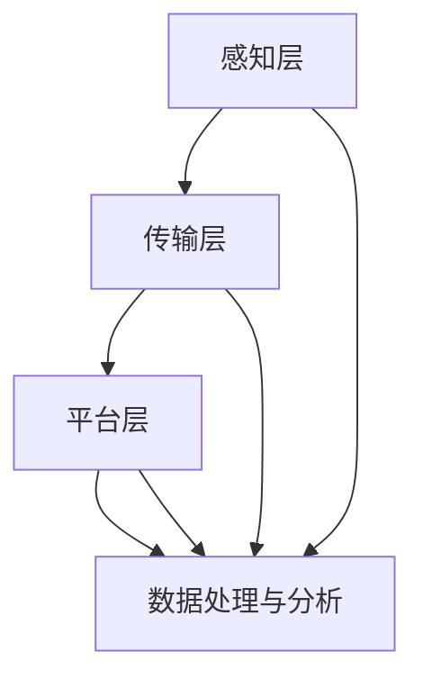

                 

关键词：物联网技术、传感器、数据流、边缘计算、云计算、数据处理、智能设备、M2M通信、网络架构、安全性、效率优化、智能分析、应用场景。

## 摘要

随着物联网技术的快速发展，智能设备和传感器在各个领域的应用越来越广泛。本文旨在探讨物联网技术的核心组成部分，从传感器到云端的数据流，以及其背后的技术原理、实现方式和未来发展趋势。通过对物联网技术体系结构的深入分析，我们将揭示其在数据采集、传输、处理和分析等方面的关键挑战，并提出优化方案和实际应用案例。

## 1. 背景介绍

### 物联网技术的定义和分类

物联网（Internet of Things, IoT）是指通过互联网将各种物理设备、传感器、软件系统和人员连接起来，实现信息的采集、传输、处理和分析，进而实现智能决策和自动化控制。根据连接对象的不同，物联网技术可以分为以下几类：

1. **消费类物联网**：主要包括智能家居、可穿戴设备等，这类设备通常具有友好的用户界面和丰富的功能，便于用户操作。
2. **工业物联网**：涵盖制造业、能源、医疗、交通等多个行业，通过物联网技术实现设备监控、故障预测、资源优化等。
3. **基础设施物联网**：包括智慧城市、智能交通、智能电网等，旨在提高基础设施的管理效率和公共服务的质量。

### 物联网技术的发展历程

物联网技术的发展可以追溯到20世纪80年代，当时一些公司和研究者开始探索如何将物理设备连接到互联网。最初的物联网设备主要是传感器和执行器，用于环境监测和自动化控制。

在21世纪初，随着无线通信技术的发展，物联网设备开始具备数据传输功能，能够实现远程监控和远程控制。这一阶段的代表性技术包括Wi-Fi、蓝牙和ZigBee等。

近年来，随着云计算、大数据和人工智能等技术的成熟，物联网技术进入了一个新的发展阶段。物联网设备不仅能够采集和传输数据，还能够进行实时处理和分析，从而实现更高级的智能应用。

### 物联网技术的现状和挑战

目前，物联网技术已经广泛应用于各个领域，推动了产业升级和社会进步。然而，物联网技术仍面临许多挑战：

1. **安全性**：物联网设备数量庞大，分布广泛，安全性成为亟待解决的问题。
2. **数据隐私**：大量个人和企业数据在物联网环境中流转，数据隐私保护至关重要。
3. **数据传输和处理效率**：物联网设备产生的数据量巨大，如何高效传输和处理这些数据是另一个关键挑战。
4. **标准化**：缺乏统一的标准和协议，使得不同设备之间的互操作性成为一个难题。

## 2. 核心概念与联系

### 物联网技术体系结构

物联网技术体系结构可以分为四个主要层次：感知层、传输层、平台层和应用层。

1. **感知层**：包括各种传感器和智能设备，用于数据的采集和初步处理。
2. **传输层**：负责数据的传输，包括有线和无线通信技术，如Wi-Fi、蜂窝网络、LoRa等。
3. **平台层**：提供数据存储、处理和分析功能，是实现物联网应用的核心。
4. **应用层**：包括各种物联网应用，如智能家居、智能医疗、智能交通等。

### 核心概念原理和架构的 Mermaid 流程图



### 感知层

感知层是物联网技术的基石，负责数据的采集和初步处理。常见的传感器包括温度传感器、湿度传感器、光照传感器、声音传感器等。这些传感器将物理信号转换为电信号，通过模数转换器（ADC）转换为数字信号，再通过接口与智能设备通信。

### 传输层

传输层负责数据的传输，包括有线和无线通信技术。有线通信技术如以太网、光纤等，具有较高的传输速率和稳定性。无线通信技术包括Wi-Fi、蓝牙、ZigBee、LoRa等，适用于移动性和灵活性要求较高的场景。

### 平台层

平台层是物联网技术的核心，提供数据存储、处理和分析功能。平台通常包括云计算平台和边缘计算平台。云计算平台如阿里云、腾讯云、华为云等，提供强大的计算和存储能力，适用于大规模数据处理。边缘计算平台如树莓派、ESP8266等，适用于数据处理需求较高的场景。

### 应用层

应用层包括各种物联网应用，如智能家居、智能医疗、智能交通等。这些应用通过平台层提供的数据处理和分析结果，实现智能决策和自动化控制。

## 3. 核心算法原理 & 具体操作步骤

### 3.1 算法原理概述

物联网技术的核心在于数据的采集、传输、处理和分析。在数据处理和分析过程中，常用的算法包括：

1. **数据预处理算法**：用于去除噪声、填充缺失值、归一化等。
2. **机器学习算法**：用于模式识别、分类、聚类等。
3. **数据分析算法**：用于数据可视化、统计分析等。

### 3.2 算法步骤详解

1. **数据采集**：通过传感器采集原始数据。
2. **数据预处理**：去除噪声、填充缺失值、归一化等。
3. **特征提取**：从预处理后的数据中提取有用的特征。
4. **模型训练**：使用机器学习算法训练模型。
5. **模型评估**：评估模型性能，调整模型参数。
6. **数据预测**：使用训练好的模型进行数据预测。

### 3.3 算法优缺点

1. **数据预处理算法**：
   - 优点：去除噪声、填充缺失值等，提高数据质量。
   - 缺点：可能引入新的偏差，影响数据真实性。
2. **机器学习算法**：
   - 优点：能够自动发现数据中的规律，提高预测准确性。
   - 缺点：训练过程复杂，对计算资源要求较高。
3. **数据分析算法**：
   - 优点：简单易用，能够快速获得数据的基本特征。
   - 缺点：可能无法发现深层次的规律。

### 3.4 算法应用领域

1. **智能家居**：通过数据预处理和机器学习算法，实现设备自动化控制。
2. **智能医疗**：通过数据分析算法，辅助医生诊断和治疗。
3. **智能交通**：通过数据预处理和机器学习算法，优化交通流量，减少拥堵。

## 4. 数学模型和公式 & 详细讲解 & 举例说明

### 4.1 数学模型构建

在物联网技术中，常用的数学模型包括：

1. **线性回归模型**：
   $$y = wx + b$$
   其中，$y$ 是因变量，$x$ 是自变量，$w$ 是权重，$b$ 是偏置。

2. **神经网络模型**：
   $$a = \sigma(w \cdot x + b)$$
   其中，$a$ 是输出值，$\sigma$ 是激活函数，$w$ 是权重，$x$ 是输入值，$b$ 是偏置。

### 4.2 公式推导过程

以线性回归模型为例，推导过程如下：

1. **假设**：
   假设因变量 $y$ 与自变量 $x$ 成线性关系，即 $y = wx + b$。

2. **损失函数**：
   $$L(w, b) = \frac{1}{2}(y - wx - b)^2$$
   其中，$L$ 是损失函数。

3. **梯度下降**：
   为了使损失函数最小，我们需要找到最优的权重 $w$ 和偏置 $b$。
   $$w_{new} = w_{old} - \alpha \frac{\partial L}{\partial w}$$
   $$b_{new} = b_{old} - \alpha \frac{\partial L}{\partial b}$$
   其中，$\alpha$ 是学习率。

### 4.3 案例分析与讲解

假设我们有一个智能家居系统，通过温度传感器采集室内温度数据，并使用线性回归模型预测室内温度。具体步骤如下：

1. **数据采集**：
   通过温度传感器采集室内温度数据，得到一组数据集。

2. **数据预处理**：
   对数据进行归一化处理，将数据缩放到 $[0, 1]$ 范围内。

3. **特征提取**：
   将温度数据作为特征，输入线性回归模型。

4. **模型训练**：
   使用梯度下降算法训练模型，找到最优的权重和偏置。

5. **模型评估**：
   使用训练好的模型预测室内温度，并计算预测值与真实值之间的误差。

6. **模型优化**：
   根据评估结果，调整模型参数，优化模型性能。

## 5. 项目实践：代码实例和详细解释说明

### 5.1 开发环境搭建

1. **硬件环境**：
   - 树莓派（Raspberry Pi）或ESP8266模块
   - 温度传感器（如DHT11、DHT22）

2. **软件环境**：
   - Raspberry Pi操作系统（如Raspbian）
   - Python编程环境（如PyCharm）

### 5.2 源代码详细实现

以下是一个使用Python编写的智能家居温度预测项目的源代码：

```python
import RPi.GPIO as GPIO
import time
import requests

# 定义温度传感器引脚
DHT_PIN = 21

# 初始化GPIO
GPIO.setmode(GPIO.BCM)
GPIO.setup(DHT_PIN, GPIO.IN)

# 读取温度传感器数据
def read_dht():
    GPIO.output(DHT_PIN, GPIO.HIGH)
    time.sleep(0.05)
    GPIO.output(DHT_PIN, GPIO.LOW)
    time.sleep(0.01)

    data = []
    for _ in range(5):
        read_data = GPIO.input(DHT_PIN)
        data.append(read_data)

    return data

# 解析温度传感器数据
def parse_dht(data):
    humidity_bits = (data[0] & 0x7f) << 8 | data[1]
    temperature_bits = (data[2] & 0x7f) << 8 | data[3]
    humidity = humidity_bits / 256.0
    temperature = temperature_bits / 256.0

    return humidity, temperature

# 发送数据到服务器
def send_data(humidity, temperature):
    url = "http://your_server.com/data"
    data = {
        "humidity": humidity,
        "temperature": temperature
    }
    requests.post(url, data=data)

# 主函数
def main():
    while True:
        read_dht()
        humidity, temperature = parse_dht(read_dht())
        send_data(humidity, temperature)
        time.sleep(60)

if __name__ == "__main__":
    main()
```

### 5.3 代码解读与分析

1. **导入模块**：
   - `RPi.GPIO`：用于控制GPIO引脚。
   - `time`：用于延时。
   - `requests`：用于发送HTTP请求。

2. **定义温度传感器引脚**：
   - `DHT_PIN`：温度传感器引脚。

3. **初始化GPIO**：
   - `GPIO.setmode(GPIO.BCM)`：设置GPIO模式。
   - `GPIO.setup(DHT_PIN, GPIO.IN)`：设置温度传感器引脚为输入模式。

4. **读取温度传感器数据**：
   - `read_dht()`：读取温度传感器数据。

5. **解析温度传感器数据**：
   - `parse_dht(data)`：解析温度传感器数据。

6. **发送数据到服务器**：
   - `send_data(humidity, temperature)`：将温度传感器数据发送到服务器。

7. **主函数**：
   - `main()`：循环读取温度传感器数据，发送到服务器。

### 5.4 运行结果展示

运行程序后，温度传感器将开始采集数据，并将数据发送到服务器。服务器端可以接收并处理这些数据，实现智能家居系统的实时监控和预测。

## 6. 实际应用场景

### 6.1 智能家居

智能家居是物联网技术的典型应用场景。通过传感器采集家庭环境数据，如温度、湿度、光照等，智能家居系统能够自动调整室内环境，提高居住舒适度。例如，智能空调可以根据室内温度自动调整制冷功率，智能照明可以根据室内光照强度自动调节亮度。

### 6.2 智能医疗

智能医疗是物联网技术在医疗领域的应用。通过传感器和智能设备，医生可以实时监测患者的生命体征，如心率、血压、血糖等。这些数据可以通过物联网平台实时传输到医生的电脑或手机上，实现远程诊断和监控。例如，智能手环可以实时监测用户的心率，并在异常情况下自动报警。

### 6.3 智能交通

智能交通是物联网技术在交通领域的应用。通过传感器和智能设备，交通管理部门可以实时监测交通流量，优化交通信号，减少拥堵。例如，智能摄像头可以实时监测道路情况，并根据道路状况调整信号灯时长。

### 6.4 未来应用展望

随着物联网技术的不断发展，未来将会有更多的应用场景出现。例如，智能农业可以通过物联网技术实现精准灌溉、病虫害监测等，提高农业生产效率。智能能源可以通过物联网技术实现智能调度、能耗监测等，提高能源利用效率。

## 7. 工具和资源推荐

### 7.1 学习资源推荐

1. **书籍**：
   - 《物联网技术导论》
   - 《智能设备与物联网》
2. **在线课程**：
   - Coursera上的《物联网基础》
   - edX上的《物联网技术与应用》

### 7.2 开发工具推荐

1. **硬件**：
   - 树莓派（Raspberry Pi）
   - ESP8266模块
2. **软件**：
   - Python编程环境（如PyCharm）
   - Eclipse IDE

### 7.3 相关论文推荐

1. **物联网安全技术**：
   - "A Survey on Security and Privacy in Internet of Things"
   - "A Comprehensive Review of Privacy Protection Techniques in Internet of Things"
2. **物联网应用场景**：
   - "Application Scenarios of Internet of Things in Smart City"
   - "IoT Applications in Agriculture: A Survey"

## 8. 总结：未来发展趋势与挑战

### 8.1 研究成果总结

物联网技术已经取得了显著的成果，广泛应用于智能家居、智能医疗、智能交通等多个领域。在数据采集、传输、处理和分析等方面，物联网技术逐渐实现了智能化和自动化。

### 8.2 未来发展趋势

未来，物联网技术将继续快速发展，以下是几个可能的发展趋势：

1. **边缘计算**：随着物联网设备数量的增加，边缘计算将成为重要趋势，以降低数据传输延迟，提高数据处理效率。
2. **5G技术**：5G技术的普及将为物联网提供更高速、更稳定的连接，推动物联网应用的创新。
3. **人工智能**：人工智能将深入物联网，实现更智能的数据处理和分析，推动物联网应用迈向新的高度。

### 8.3 面临的挑战

物联网技术仍面临许多挑战，主要包括：

1. **安全性**：随着物联网设备数量的增加，安全性问题日益突出，需要加强物联网设备的安全防护。
2. **数据隐私**：大量个人和企业数据在物联网环境中流转，如何保护数据隐私是一个重要挑战。
3. **标准化**：缺乏统一的标准和协议，使得不同设备之间的互操作性成为一个难题。

### 8.4 研究展望

未来，物联网技术的研究应重点关注以下几个方面：

1. **安全性**：加强物联网设备的安全防护，提高系统的抗攻击能力。
2. **数据隐私**：研究有效的数据隐私保护技术，保障用户数据安全。
3. **标准化**：推动物联网标准化进程，提高设备互操作性。

## 9. 附录：常见问题与解答

### Q：什么是物联网？
A：物联网是指通过互联网将各种物理设备、传感器、软件系统和人员连接起来，实现信息的采集、传输、处理和分析，进而实现智能决策和自动化控制。

### Q：物联网技术有哪些应用？
A：物联网技术广泛应用于智能家居、智能医疗、智能交通、智能农业、智能工业等领域。

### Q：物联网技术有哪些挑战？
A：物联网技术面临的挑战主要包括安全性、数据隐私、标准化等。

### Q：什么是边缘计算？
A：边缘计算是指将数据处理和分析任务从云端转移到网络边缘，以降低数据传输延迟，提高数据处理效率。

### Q：物联网技术与人工智能的关系是什么？
A：物联网技术为人工智能提供了丰富的数据来源，而人工智能则为物联网技术提供了智能化的数据处理和分析能力。两者相辅相成，共同推动物联网技术的发展。

### Q：物联网技术的未来发展趋势是什么？
A：物联网技术的未来发展趋势包括边缘计算、5G技术、人工智能等。

## 作者署名

作者：禅与计算机程序设计艺术 / Zen and the Art of Computer Programming

