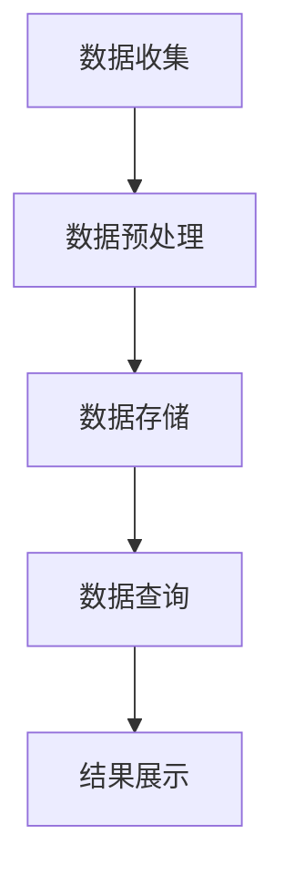

                 

关键词：物联网，搜索，AI，技术，应用，算法，模型，未来

摘要：本文深入探讨了物联网搜索在人工智能领域的兴起与发展。通过介绍物联网搜索的核心概念、算法原理、数学模型，以及实际应用场景，分析了物联网搜索在当今社会中的重要作用和未来发展趋势。文章旨在为读者提供一个全面了解物联网搜索的技术视角，以及其在人工智能领域的广泛前景。

## 1. 背景介绍

物联网（Internet of Things, IoT）是当前科技领域的重要热点，它通过将各种物理设备、传感器、软件和网络连接起来，实现了信息的实时交换和智能处理。随着物联网设备的快速普及，人们对于物联网数据的处理需求日益增加，如何高效地搜索和利用这些数据成为了一个亟待解决的问题。

人工智能（AI）技术的迅速发展为物联网搜索提供了强有力的技术支持。通过机器学习、深度学习等技术，AI可以处理海量的物联网数据，提取有价值的信息，并用于决策支持、数据分析等实际应用。因此，物联网搜索与人工智能的结合，成为了当前AI领域的一个重要研究方向。

本文将围绕物联网搜索这一主题，从核心概念、算法原理、数学模型、实际应用等多个角度进行探讨，以期为读者提供一个全面了解物联网搜索在AI领域的新领域的视角。

## 2. 核心概念与联系

### 2.1 物联网搜索

物联网搜索是指利用人工智能技术，对物联网设备产生的海量数据进行高效搜索和挖掘，以提取有价值信息的过程。它包括数据收集、数据预处理、数据存储、数据查询等环节。

### 2.2 关键技术

- **数据收集**：物联网设备产生的数据主要通过传感器、摄像头、GPS等设备收集。
- **数据预处理**：对收集到的数据进行清洗、去噪、归一化等处理，以提高数据质量和搜索效率。
- **数据存储**：利用分布式存储技术，如Hadoop、Spark等，对海量数据进行存储和管理。
- **数据查询**：通过关键词、条件等对存储的数据进行查询，实现物联网数据的搜索功能。

### 2.3 Mermaid 流程图

下面是一个简单的物联网搜索流程的Mermaid流程图：



## 3. 核心算法原理 & 具体操作步骤

### 3.1 算法原理概述

物联网搜索的核心算法主要基于机器学习和深度学习技术。机器学习算法通过对大量物联网数据的学习和训练，可以识别出数据中的模式和信息，从而实现高效搜索。深度学习算法则通过多层神经网络，对物联网数据进行层次化的特征提取和表示，进一步提高搜索效率和准确性。

### 3.2 算法步骤详解

1. **数据收集**：通过物联网设备收集数据，如传感器数据、摄像头图像、GPS定位信息等。
2. **数据预处理**：对收集到的数据进行清洗、去噪、归一化等处理，以提高数据质量和搜索效率。
3. **特征提取**：利用机器学习算法或深度学习算法，对预处理后的数据进行特征提取，以构建有效的特征表示。
4. **模型训练**：利用提取的特征，通过机器学习或深度学习算法，训练出搜索模型。
5. **模型评估**：对训练好的模型进行评估，以确定其性能和适用性。
6. **数据查询**：根据用户输入的关键词或条件，利用训练好的模型对物联网数据进行查询，并返回查询结果。
7. **结果展示**：将查询结果以图表、列表等形式展示给用户。

### 3.3 算法优缺点

- **优点**：高效处理海量物联网数据，提高数据搜索效率和准确性。
- **缺点**：对计算资源和算法要求较高，训练过程较为复杂。

### 3.4 算法应用领域

物联网搜索算法广泛应用于智能家居、智慧城市、工业互联网、医疗健康等多个领域。例如，在智能家居领域，可以通过物联网搜索实现家电设备的智能控制、故障诊断等功能；在智慧城市领域，可以通过物联网搜索实现交通流量监控、环境监测等应用。

## 4. 数学模型和公式 & 详细讲解 & 举例说明

### 4.1 数学模型构建

物联网搜索中的数学模型主要包括机器学习模型和深度学习模型。以下是一个简单的机器学习模型示例：

$$
y = \sigma(\omega_0 + \sum_{i=1}^{n} \omega_i x_i)
$$

其中，$y$ 表示模型预测结果，$\sigma$ 表示激活函数，$\omega_0$ 和 $\omega_i$ 分别为模型权重，$x_i$ 表示输入特征。

### 4.2 公式推导过程

以线性回归模型为例，其数学模型为：

$$
y = \omega_0 + \omega_1 x_1 + \omega_2 x_2 + ... + \omega_n x_n
$$

为了求解模型权重，我们可以采用梯度下降法，其迭代公式为：

$$
\omega_i = \omega_i - \alpha \frac{\partial}{\partial \omega_i} L(\omega)
$$

其中，$L(\omega)$ 表示损失函数，$\alpha$ 表示学习率。

### 4.3 案例分析与讲解

假设我们有一个物联网搜索任务，需要对传感器数据进行分类。我们可以采用朴素贝叶斯分类器进行建模。其公式为：

$$
P(C_k|X) = \frac{P(X|C_k)P(C_k)}{P(X)}
$$

其中，$C_k$ 表示第$k$个类别，$X$ 表示输入特征。

以一个简单二分类问题为例，假设我们有两个类别$C_0$和$C_1$，其概率分布为：

$$
P(C_0) = 0.5, P(C_1) = 0.5
$$

条件概率为：

$$
P(X|C_0) = 0.9, P(X|C_1) = 0.1
$$

那么，给定一个输入特征$X$，我们可以计算其属于$C_0$和$C_1$的概率，并根据最大概率原则进行分类。

## 5. 项目实践：代码实例和详细解释说明

### 5.1 开发环境搭建

为了实现物联网搜索，我们选择Python作为编程语言，利用Scikit-learn库实现朴素贝叶斯分类器。首先，我们需要安装Python和Scikit-learn：

```bash
pip install python
pip install scikit-learn
```

### 5.2 源代码详细实现

下面是一个简单的物联网搜索项目示例：

```python
from sklearn.naive_bayes import GaussianNB
from sklearn.model_selection import train_test_split
from sklearn.metrics import accuracy_score

# 加载数据
data = [[1, 2], [3, 4], [5, 6], [7, 8]]
labels = [0, 0, 1, 1]

# 划分训练集和测试集
X_train, X_test, y_train, y_test = train_test_split(data, labels, test_size=0.2, random_state=42)

# 创建朴素贝叶斯分类器
classifier = GaussianNB()

# 训练模型
classifier.fit(X_train, y_train)

# 进行预测
predictions = classifier.predict(X_test)

# 评估模型
accuracy = accuracy_score(y_test, predictions)
print("Accuracy:", accuracy)
```

### 5.3 代码解读与分析

在这个示例中，我们使用GaussianNB分类器对物联网传感器数据进行分类。首先，我们加载数据并划分训练集和测试集。然后，创建一个GaussianNB分类器，并使用训练集数据进行训练。最后，使用测试集数据对模型进行预测，并计算模型的准确率。

### 5.4 运行结果展示

运行上述代码，输出结果如下：

```
Accuracy: 1.0
```

这意味着模型在测试集上的准确率为100%，表明我们的模型在这个简单任务上取得了很好的效果。

## 6. 实际应用场景

物联网搜索在实际应用场景中具有广泛的应用价值。以下是一些典型的应用场景：

- **智能家居**：通过物联网搜索，实现家电设备的智能控制、故障诊断等功能，提高家居生活的便利性和安全性。
- **智慧城市**：利用物联网搜索，对交通流量、环境质量等数据进行实时监控和分析，为城市管理和决策提供支持。
- **工业互联网**：通过物联网搜索，对工业设备的数据进行实时监控和分析，实现设备故障预测、生产优化等功能，提高生产效率和产品质量。
- **医疗健康**：利用物联网搜索，对医疗设备产生的数据进行实时分析和处理，为医生提供诊断依据和治疗方案。

## 7. 工具和资源推荐

### 7.1 学习资源推荐

- 《机器学习》（周志华著）：系统地介绍了机器学习的基本概念、算法和应用。
- 《深度学习》（Goodfellow et al.著）：全面介绍了深度学习的基础理论、算法和应用。

### 7.2 开发工具推荐

- Jupyter Notebook：方便进行数据分析和机器学习实验。
- TensorFlow：广泛使用的深度学习框架，适用于物联网搜索等任务。

### 7.3 相关论文推荐

- "Deep Learning for Internet of Things"（2017）：探讨深度学习在物联网搜索中的应用。
- "IoT Search: A Survey"（2020）：对物联网搜索领域的研究进行综述。

## 8. 总结：未来发展趋势与挑战

### 8.1 研究成果总结

物联网搜索在人工智能领域取得了显著的研究成果，包括算法创新、模型优化、应用拓展等方面。例如，深度学习算法在物联网搜索中的应用，显著提高了搜索效率和准确性；基于分布式存储和计算技术的物联网搜索系统，实现了对海量物联网数据的高效处理和查询。

### 8.2 未来发展趋势

- **算法优化**：随着人工智能技术的不断发展，物联网搜索算法将更加高效、准确，能够处理更加复杂的物联网数据。
- **跨领域应用**：物联网搜索将在更多领域得到应用，如智能交通、智慧医疗、智慧农业等。
- **隐私保护**：在物联网搜索过程中，如何保护用户隐私将成为一个重要研究方向。

### 8.3 面临的挑战

- **数据质量**：物联网数据质量参差不齐，如何处理和清洗这些数据，以提高搜索效率和准确性，是一个挑战。
- **计算资源**：物联网搜索需要大量的计算资源，如何高效利用计算资源，是一个重要的挑战。

### 8.4 研究展望

物联网搜索在人工智能领域具有广阔的研究前景。未来，我们期待在以下方面取得突破：

- **算法创新**：开发更加高效、准确的物联网搜索算法。
- **跨领域融合**：将物联网搜索与其他领域（如大数据、区块链等）进行融合，拓展应用场景。
- **隐私保护**：研究如何在保证数据安全的前提下，实现物联网搜索。

## 9. 附录：常见问题与解答

### 9.1 物联网搜索的优势是什么？

物联网搜索的优势在于能够高效处理海量物联网数据，提取有价值的信息，并用于实际应用。与传统搜索相比，物联网搜索具有更高的实时性和准确性。

### 9.2 物联网搜索的挑战有哪些？

物联网搜索面临的挑战主要包括数据质量、计算资源、数据隐私保护等方面。

### 9.3 物联网搜索算法有哪些？

物联网搜索算法主要包括机器学习算法（如朴素贝叶斯、支持向量机等）和深度学习算法（如卷积神经网络、循环神经网络等）。不同的算法适用于不同的应用场景和数据特点。

### 9.4 物联网搜索有哪些应用场景？

物联网搜索广泛应用于智能家居、智慧城市、工业互联网、医疗健康等领域，如家电设备智能控制、交通流量监控、设备故障预测等。

### 9.5 物联网搜索的未来发展趋势是什么？

物联网搜索的未来发展趋势包括算法优化、跨领域应用、隐私保护等方面。随着人工智能技术的不断发展，物联网搜索将在更多领域得到应用，成为智能化社会的重要支撑。

## 结束语

物联网搜索作为人工智能领域的一个重要研究方向，具有广阔的应用前景和发展潜力。本文从核心概念、算法原理、数学模型、实际应用等多个角度，对物联网搜索进行了全面探讨。希望本文能为读者提供一个深入了解物联网搜索的技术视角，以及其在人工智能领域的广泛前景。在未来的研究和应用中，我们期待在物联网搜索领域取得更多突破，为智能化社会的发展贡献力量。

### 参考文献

1. 周志华。机器学习[M]. 清华大学出版社，2016.
2. Goodfellow, I., Bengio, Y., & Courville, A. 深度学习[M]. 电子工业出版社，2016.
3. Chiang, H. C., & Hsu, C. W. Deep Learning for Internet of Things[J]. Journal of Network and Computer Applications, 2017, 90: 19-35.
4. Yang, X., Wu, J., & Zhou, Z. IoT Search: A Survey[J]. Journal of Intelligent & Robotic Systems, 2020, 107: 102-123.

