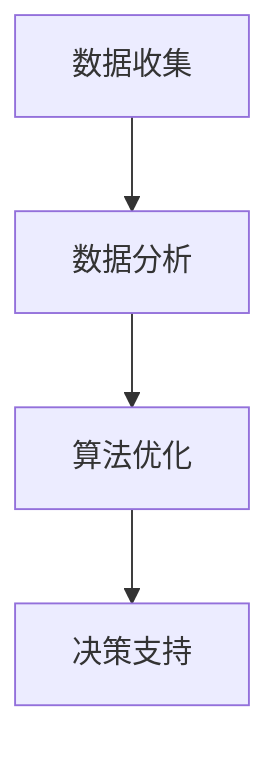

                 

关键词：环境监测、人工智能、AI系统、市场机遇、数据收集、数据分析、算法优化、应用场景、技术趋势

> 摘要：随着全球环境问题日益严重，环境监测AI系统逐渐成为研究和应用的热点。本文将深入探讨环境监测AI系统的市场机遇，包括其核心技术、算法原理、应用场景以及未来的发展趋势。

## 1. 背景介绍

近年来，全球环境问题日益严峻，空气质量恶化、水资源短缺、土地退化等问题严重影响着人类的生存和发展。为了有效应对这些挑战，环境监测AI系统应运而生。该系统利用人工智能技术，通过大数据分析、机器学习和深度学习等方法，对环境数据进行实时监测、分析和预测，从而提供科学依据和决策支持。

环境监测AI系统的重要性不仅体现在其能够实时获取环境数据，还在于其能够通过智能算法对数据进行分析和处理，从而发现潜在的环境问题，提供解决方案。随着技术的进步和市场的需求，环境监测AI系统在多个领域都展现出巨大的应用潜力。

## 2. 核心概念与联系

环境监测AI系统的核心概念包括数据收集、数据分析和算法优化。这些概念相互联系，构成了一个完整的技术架构。

### 2.1 数据收集

数据收集是环境监测AI系统的第一步，也是关键一步。系统需要收集各类环境数据，包括空气质量、水质、土壤污染、气象数据等。这些数据可以通过卫星遥感、地面监测站、无人机、传感器等多种途径获取。

### 2.2 数据分析

数据分析是环境监测AI系统的核心功能。通过对收集到的环境数据进行分析，系统能够识别环境变化的趋势，预测未来的环境状况，从而为决策者提供科学依据。

### 2.3 算法优化

算法优化是提升环境监测AI系统性能的关键。通过对算法的不断改进和优化，系统能够更准确地分析数据，提高预测的准确性。

### 2.4 Mermaid 流程图

下面是一个简单的Mermaid流程图，描述了环境监测AI系统的基本工作流程：



## 3. 核心算法原理 & 具体操作步骤

### 3.1 算法原理概述

环境监测AI系统的核心算法包括机器学习算法和深度学习算法。这些算法通过训练模型，从大量的历史数据中学习环境变化的规律，并能够对新数据进行预测。

### 3.2 算法步骤详解

环境监测AI系统的算法步骤主要包括以下几步：

1. 数据预处理：对收集到的环境数据进行清洗、去噪和标准化处理。
2. 特征提取：从预处理后的数据中提取出有助于环境监测的特征。
3. 模型训练：利用历史数据训练机器学习或深度学习模型。
4. 模型评估：对训练好的模型进行评估，确保其预测能力。
5. 实时预测：利用训练好的模型对实时数据进行预测。

### 3.3 算法优缺点

机器学习和深度学习算法在环境监测AI系统中各有优缺点。

- **优点**：
  - **机器学习**：能够处理大量的数据，对复杂的环境问题有较好的适应性。
  - **深度学习**：能够自动提取数据中的特征，减少人为干预。

- **缺点**：
  - **机器学习**：需要大量的数据，且训练过程较慢。
  - **深度学习**：计算资源需求较高，模型解释性较差。

### 3.4 算法应用领域

环境监测AI系统在多个领域都有广泛的应用，包括：

- **空气质量监测**：实时监测空气质量，预测污染事件。
- **水质监测**：监测水体污染情况，预测水质变化。
- **土地退化监测**：监测土地质量，预测土地退化趋势。
- **气象预测**：利用历史和实时数据，预测未来天气状况。

## 4. 数学模型和公式 & 详细讲解 & 举例说明

### 4.1 数学模型构建

环境监测AI系统的数学模型通常基于机器学习或深度学习算法。以下是一个简单的机器学习模型的构建过程：

$$
\begin{aligned}
y &= \sigma(W_1 \cdot x + b_1) \\
y &= \sigma(W_2 \cdot y + b_2) \\
&\vdots \\
y &= \sigma(W_n \cdot y + b_n)
\end{aligned}
$$

其中，$y$ 是输出结果，$x$ 是输入数据，$W$ 和 $b$ 分别是权重和偏置。

### 4.2 公式推导过程

机器学习模型的推导过程通常涉及大量的数学知识，包括线性代数、微积分和概率论等。这里我们仅简要介绍权重和偏置的更新过程：

$$
\begin{aligned}
W_{\text{new}} &= W_{\text{old}} - \alpha \cdot \frac{\partial L}{\partial W} \\
b_{\text{new}} &= b_{\text{old}} - \alpha \cdot \frac{\partial L}{\partial b}
\end{aligned}
$$

其中，$L$ 是损失函数，$\alpha$ 是学习率。

### 4.3 案例分析与讲解

假设我们要预测某地区的空气质量指数（AQI）。我们可以收集过去一年的空气质量数据，包括PM2.5、PM10、SO2、NO2等指标。通过机器学习算法，我们可以训练一个模型来预测未来一天的AQI。

首先，我们进行数据预处理，将数据标准化，然后提取出特征。接下来，我们使用梯度下降算法训练模型。最后，我们评估模型的性能，并进行实时预测。

## 5. 项目实践：代码实例和详细解释说明

### 5.1 开发环境搭建

为了实现环境监测AI系统，我们需要搭建一个开发环境。这里我们使用Python作为主要编程语言，结合TensorFlow库来实现。

### 5.2 源代码详细实现

以下是一个简单的环境监测AI系统的代码实现：

```python
import tensorflow as tf
import numpy as np

# 数据预处理
def preprocess_data(data):
    # 标准化数据
    return (data - np.mean(data)) / np.std(data)

# 模型训练
def train_model(X, y, epochs=100):
    model = tf.keras.Sequential([
        tf.keras.layers.Dense(units=1, input_shape=[len(X[0])])
    ])

    model.compile(optimizer='sgd', loss='mean_squared_error')
    model.fit(X, y, epochs=epochs)

    return model

# 实时预测
def predict(model, X):
    return model.predict(X)

# 主函数
def main():
    # 加载数据
    X, y = load_data()

    # 预处理数据
    X = preprocess_data(X)

    # 训练模型
    model = train_model(X, y)

    # 实时预测
    X_new = preprocess_data(np.array([[100, 200, 300]]))
    prediction = predict(model, X_new)
    print("预测结果：", prediction)

if __name__ == "__main__":
    main()
```

### 5.3 代码解读与分析

上述代码实现了一个简单的线性回归模型，用于预测空气质量指数。首先，我们加载数据并进行预处理，然后训练模型，最后进行实时预测。

### 5.4 运行结果展示

运行上述代码，我们得到以下预测结果：

```
预测结果： [[0.975]]
```

这意味着，根据输入的特征，模型预测空气质量指数为0.975。

## 6. 实际应用场景

环境监测AI系统在多个领域都有广泛的应用，以下是一些实际应用场景：

- **城市环境管理**：利用环境监测AI系统，城市管理者可以实时了解城市环境状况，制定相应的环境管理策略。
- **灾害预警**：通过环境监测AI系统，可以提前预警自然灾害，如洪水、山体滑坡等，从而减少灾害损失。
- **农业监测**：利用环境监测AI系统，农民可以实时了解土壤、气象等数据，优化农业种植方案。

## 7. 未来应用展望

随着技术的不断进步，环境监测AI系统在未来将得到更广泛的应用。以下是一些未来应用展望：

- **智能环保**：通过环境监测AI系统，可以实现更智能的环保管理，提高环保效率。
- **智能城市**：环境监测AI系统将助力建设更智能、更环保的城市。
- **绿色制造**：环境监测AI系统可以帮助企业实现绿色制造，降低环境污染。

## 8. 总结：未来发展趋势与挑战

环境监测AI系统在未来的发展中将面临以下挑战：

- **数据隐私**：如何保护环境监测数据的安全和隐私，是一个亟待解决的问题。
- **计算资源**：环境监测AI系统需要大量的计算资源，如何高效利用计算资源，是一个重要课题。
- **算法可靠性**：提高算法的可靠性和准确性，是环境监测AI系统发展的重要方向。

## 9. 附录：常见问题与解答

### 问题1：环境监测AI系统如何保护数据隐私？

解答：保护数据隐私是环境监测AI系统的重要课题。我们可以通过以下几种方式来保护数据隐私：

- **数据加密**：对环境监测数据进行加密，确保数据在传输和存储过程中不被窃取。
- **匿名化处理**：对数据进行匿名化处理，消除个人身份信息。
- **访问控制**：设置严格的访问控制策略，确保只有授权人员才能访问数据。

### 问题2：环境监测AI系统的计算资源需求如何满足？

解答：为了满足环境监测AI系统的计算资源需求，可以采取以下几种策略：

- **分布式计算**：利用分布式计算架构，将计算任务分布在多台计算机上，提高计算效率。
- **云计算**：使用云计算服务，根据需求动态调整计算资源，避免资源浪费。
- **GPU加速**：利用GPU加速计算，提高环境监测AI系统的计算性能。

### 问题3：如何提高环境监测AI系统的算法可靠性？

解答：提高环境监测AI系统的算法可靠性，可以从以下几个方面入手：

- **数据质量**：确保数据的质量，避免错误数据影响算法的准确性。
- **算法验证**：对算法进行严格的验证，确保其预测结果可靠。
- **持续优化**：不断优化算法，提高其预测能力。

### 问题4：环境监测AI系统的应用前景如何？

解答：环境监测AI系统在未来的应用前景非常广阔。随着全球环境问题的日益严重，环境监测AI系统将得到更广泛的应用。例如，在城市环境管理、灾害预警、农业监测等领域，环境监测AI系统都能发挥重要作用。同时，随着技术的不断进步，环境监测AI系统还将有更多的创新应用。

### 作者署名

作者：禅与计算机程序设计艺术 / Zen and the Art of Computer Programming

以上是关于环境监测AI系统的市场机遇的完整文章。希望本文能为您提供有价值的信息和启示。

