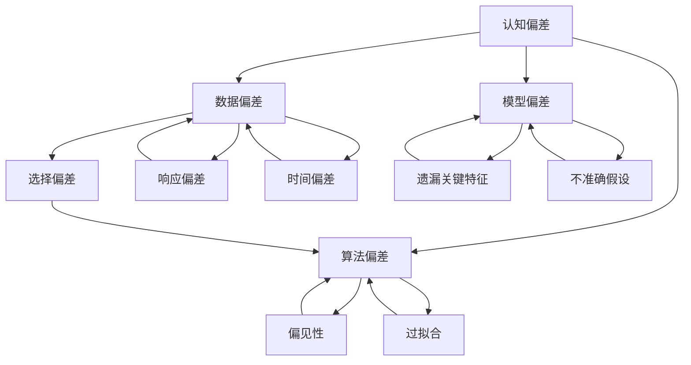

                 

 

## 引言

在信息技术飞速发展的今天，数据、算法和模型成为我们理解世界的三把利器。然而，即便是这些最先进的工具，也难以完全摆脱人类思维的局限。认知偏差，这种普遍存在于人类思维中的现象，对我们在数据分析、算法设计和模型评估等环节造成了深远影响。本文旨在探讨如何理解和避免这些洞察力的偏差，特别是在IT领域，以提升我们的决策质量和系统可靠性。

认知偏差，是指人们在感知、理解、判断和记忆过程中，由于各种原因导致的系统误差。这些偏差可能来源于信息处理过程的局限性、环境因素、社会文化背景、个人经历等。选择性认知和偏误是认知偏差中的两个典型现象。选择性认知是指人们倾向于关注、记忆和优先处理与自身观念相符的信息，而忽视或遗忘与之相矛盾的信息。偏误则是指人们在判断和决策时，由于先入为主的观念或心理定式，导致对信息处理出现偏差。

本文将首先介绍认知偏差的基本概念，然后深入探讨选择性认知和偏误的成因及其在IT领域的影响。接下来，我们将探讨如何通过算法优化、模型修正和数据分析技术来减轻这些偏差。文章最后将讨论未来在避免认知偏差方面可能的研究方向和技术发展。

通过本文的探讨，我们希望能够帮助读者更深入地理解认知偏差的本质，以及如何在信息技术应用中有效避免这些偏差，从而提高我们的工作效率和决策质量。

## 1. 背景介绍

认知偏差这一概念早在20世纪中期就被心理学和认知科学领域的研究者广泛关注。最早提出这一概念的是心理学家阿莫斯·特沃斯基（Amos Tversky）和丹尼尔·卡内曼（Daniel Kahneman），他们在1980年代通过大量实验和研究表明，人们在面对复杂信息时，往往会表现出一系列系统性偏差。这些偏差不仅存在于普通大众的日常生活中，也在专业领域，包括IT领域，产生了深远的影响。

在心理学中，认知偏差被视为人类认知过程的正常现象。例如，确认偏误（confirmation bias）是指人们倾向于寻找、解释和记住那些支持自己观点的信息，而忽视或否认相反的证据。代表性偏差（representativeness bias）是指人们在判断一个事件发生的概率时，更倾向于依赖该事件在头脑中的形象或典型性，而不是实际的数据概率。这些偏差不仅在日常生活中影响着我们的决策，也在科技领域中造成了显著的影响。

在IT领域，认知偏差尤为明显。IT行业是一个高度依赖数据和算法的行业，然而，数据的收集、处理和分析过程都极易受到认知偏差的影响。例如，在选择算法模型时，数据科学家可能会因为对某些算法的熟悉或偏好，而忽视其他可能更合适的模型。这种偏差不仅会影响模型的性能，还可能导致错误的结论和决策。

此外，算法和模型的训练过程也可能受到认知偏差的影响。数据集的选择、特征工程的方法以及模型的评估标准，都可能受到研究人员主观判断的影响，导致模型在某些方面出现偏差。这种偏差不仅影响模型的泛化能力，还可能对实际应用造成严重的后果。

在人工智能领域，认知偏差的影响更加显著。人工智能系统依赖于大量的数据和复杂的算法模型进行学习和决策。如果这些数据和算法存在偏差，那么系统输出的结果很可能也是偏差的。例如，人脸识别系统可能会因为种族偏见而导致误识，自动驾驶系统可能会因为对某些场景的过度依赖而导致事故。

总之，认知偏差在IT领域的影响不可忽视。理解这些偏差的成因和影响，以及如何避免这些偏差，对于提升我们的工作质量和系统可靠性具有重要意义。本文将详细探讨选择性认知和偏误这两种常见偏差的成因及其在IT领域的具体表现，并提出一些有效的解决方案。

### 2. 核心概念与联系

在深入探讨认知偏差之前，我们需要了解一些核心概念及其相互关系。以下是几个关键概念的定义及其在IT领域的联系：

#### 2.1 认知偏差（Cognitive Bias）

认知偏差是指人类在信息处理过程中由于各种原因导致的系统性错误。这些偏差可以归纳为以下几种类型：

1. **确认偏误（Confirmation Bias）**：人们倾向于寻找、解释和记住那些支持自己观点的信息，而忽视或否认相反的证据。
2. **代表性偏差（Representativeness Bias）**：人们在判断一个事件发生的概率时，更倾向于依赖该事件在头脑中的形象或典型性，而不是实际的数据概率。
3. **可得性偏差（Availability Bias）**：人们更容易回忆起那些容易获取的信息，因此对这些信息赋予更高的权重。
4. **锚定效应（Anchoring Effect）**：人们在作决策时，会过度依赖最先得到的信息，即使这些信息与实际情况无关。

这些认知偏差在IT领域的影响显著。例如，数据科学家在选择算法模型时可能因为确认偏误而忽视其他可能的更优模型；在数据分析过程中，代表性偏差可能导致对数据的错误理解；而可得性偏差和锚定效应则可能影响对风险和机会的评估。

#### 2.2 数据偏差（Data Bias）

数据偏差是指数据本身存在的不准确、不完整或不平衡，这些偏差会直接影响数据分析的结果。数据偏差的类型包括：

1. **选择偏差（Selection Bias）**：数据收集过程中，样本的选择可能导致样本不具有代表性。
2. **响应偏差（Response Bias）**：被调查对象可能因各种原因提供不准确的信息。
3. **时间偏差（Temporal Bias）**：数据采集的时间点可能导致数据不能反映实际情况。

在IT领域，数据偏差会直接影响算法模型的训练和评估。例如，如果训练数据存在选择偏差，那么模型可能无法泛化到未见过的情况；响应偏差则可能导致模型对用户行为的错误理解。

#### 2.3 算法偏差（Algorithm Bias）

算法偏差是指算法模型在设计和训练过程中由于设计者或数据偏差导致的偏差。这些偏差可能表现为：

1. **偏见性（Biased）**：算法在处理某些特定群体时表现出不公平的决策。
2. **过拟合（Overfitting）**：算法对训练数据拟合过于紧密，导致对新的数据表现不佳。

算法偏差在IT领域，尤其是人工智能和机器学习领域，尤为显著。例如，人脸识别算法可能因为训练数据中的种族偏见而导致误识；而过拟合的模型则可能导致对新的、未知数据的错误预测。

#### 2.4 模型偏差（Model Bias）

模型偏差是指模型在设计和优化过程中由于对现实世界的简化或假设导致的偏差。这些偏差可能表现为：

1. **遗漏关键特征（Feature Omission）**：模型未能捕捉到重要的特征，导致对数据的错误解释。
2. **不准确假设（Inaccurate Assumptions）**：模型对某些因素的假设与现实不符，导致偏差。

模型偏差在决策支持系统和自动化系统中尤为明显。例如，如果一个模型未能正确捕捉到某些关键因素，那么其输出的决策可能是不准确的。

#### 2.5 相互关系

这些核心概念之间存在着紧密的相互关系。数据偏差和算法偏差往往会导致模型偏差，而模型偏差又会反过来影响数据分析和决策过程。例如，如果数据存在选择偏差，那么训练出的模型可能会在特定群体上表现不佳，导致算法偏差。这种偏差如果未能被及时发现和纠正，会进一步影响模型的泛化能力和决策质量。

在IT领域，理解这些核心概念及其相互关系对于避免认知偏差至关重要。只有通过深入理解这些偏差的成因和影响，我们才能设计出更加可靠、公正和高效的系统和算法。

#### 2.6 Mermaid 流程图（Mermaid Flowchart）

为了更好地理解上述核心概念之间的相互关系，我们可以使用Mermaid流程图来表示。以下是核心概念之间的流程关系：



通过这个流程图，我们可以清晰地看到数据偏差、算法偏差和模型偏差之间的相互关系。这些关系提示我们在设计和应用IT系统时，必须综合考虑各种可能的偏差，并采取相应的措施来减轻或避免这些偏差的影响。

### 3. 核心算法原理 & 具体操作步骤

在理解了认知偏差的基本概念及其相互关系后，我们接下来将探讨一些核心算法的原理，以及如何通过这些算法来识别和减轻认知偏差。

#### 3.1 算法原理概述

核心算法主要包括偏差检测算法和偏差校正算法。偏差检测算法用于识别数据、算法或模型中存在的偏差，而偏差校正算法则用于修正这些偏差，以提高系统的可靠性和公正性。

#### 3.2 偏差检测算法

1. **统计分析方法**

   统计分析方法是最常用的偏差检测方法之一。通过计算各种统计指标，如均值、中位数、标准差等，可以初步识别数据是否存在异常或偏差。例如，如果数据的分布明显偏离正态分布，那么可能存在选择偏差或响应偏差。

2. **回归分析方法**

   回归分析方法可以用于检测数据中的线性关系，如果回归分析结果显著，说明数据中可能存在某种系统性偏差。此外，通过比较不同变量之间的相关性，也可以识别数据中的偏差。

3. **机器学习方法**

   机器学习方法，如聚类分析和分类算法，可以用于检测数据中的异常和模式。如果某个聚类或分类结果显著偏离预期，那么可能存在数据偏差或算法偏差。

#### 3.3 偏差校正算法

1. **重采样方法**

   重采样方法包括随机抽样、分层抽样和bootstrapping等，用于消除数据中的选择偏差和响应偏差。通过增加样本的多样性和代表性，可以提高模型的泛化能力和公正性。

2. **权重调整方法**

   权重调整方法通过调整样本或特征的权重，来纠正数据中的偏差。例如，如果某个群体在训练数据中样本量较少，可以通过增加其权重来提高其在模型中的代表性。

3. **对抗训练方法**

   对抗训练方法通过生成与真实数据分布相似的对抗样本来纠正数据偏差。这种方法可以应用于生成模型和对抗生成网络（GANs），以增强模型的鲁棒性和泛化能力。

4. **公平性分析算法**

   公平性分析算法用于评估和纠正算法中的偏见性。例如，通过计算算法在不同群体上的误差分布，可以识别和纠正算法的偏见。

#### 3.4 算法应用领域

1. **数据预处理**

   在数据预处理阶段，使用偏差检测和校正算法可以帮助消除数据中的偏差，提高后续分析和模型的准确性。

2. **算法设计**

   在算法设计阶段，通过引入偏差检测和校正算法，可以确保算法在处理数据时更加公正和可靠。例如，在人脸识别系统中，通过使用公平性分析算法，可以减少因种族偏见导致的误识。

3. **模型评估**

   在模型评估阶段，通过偏差检测算法，可以识别模型中的偏差，并通过校正算法来改进模型性能。例如，在金融风控系统中，通过使用偏差检测算法，可以识别和纠正模型中的偏见，以提高风险预测的准确性。

4. **自动化系统**

   在自动化系统中，通过引入偏差检测和校正算法，可以确保系统的决策过程更加公正和可靠。例如，在自动驾驶系统中，通过使用偏差检测算法，可以识别和纠正系统在处理不同路况时的偏差，以提高安全性。

总之，通过应用这些核心算法，我们可以有效地识别和减轻认知偏差，从而提升IT系统的可靠性和公正性。这些算法不仅可以帮助我们在数据分析和模型评估中避免偏差，还可以为未来的研究和应用提供重要的指导。

#### 3.5 算法优缺点

在了解核心算法的原理和应用后，我们还需要对其优缺点进行深入分析。以下是几种主要偏差检测和校正算法的优缺点：

1. **统计分析方法**

   **优点**：

   - **简便易行**：统计分析方法不需要复杂的计算资源和专业知识，适用于大多数数据集。
   - **全面性**：可以通过计算多种统计指标，从不同角度识别数据偏差。

   **缺点**：

   - **局限性**：仅能识别出明显的偏差，对于复杂的偏差可能无法有效检测。
   - **对异常值敏感**：异常值可能导致统计分析结果不准确。

2. **回归分析方法**

   **优点**：

   - **直观性**：通过回归分析，可以直观地识别数据中的线性关系和系统性偏差。
   - **鲁棒性**：回归分析方法对异常值的影响较小，适用于多样性的数据集。

   **缺点**：

   - **假设性**：回归分析需要对数据进行一系列假设，如线性关系和正态分布，这些假设可能不总是成立。
   - **计算复杂度高**：对于大规模数据集，计算过程可能非常耗时。

3. **机器学习方法**

   **优点**：

   - **灵活性**：机器学习方法可以自动识别数据中的复杂模式和偏差，适用于多样化和大规模数据集。
   - **泛化能力**：机器学习方法通过训练，可以提升模型的泛化能力，从而减少偏差。

   **缺点**：

   - **计算资源需求高**：机器学习算法通常需要大量计算资源和时间。
   - **数据质量要求高**：数据质量对机器学习算法的性能有直接影响，低质量数据可能导致偏差检测和校正不准确。

4. **重采样方法**

   **优点**：

   - **有效性**：通过增加样本的多样性和代表性，可以显著减少选择偏差和响应偏差。
   - **简单易行**：重采样方法相对简单，易于在数据处理流程中应用。

   **缺点**：

   - **对数据量要求高**：重采样方法需要大量的数据来保证代表性，否则偏差可能无法有效消除。
   - **时间成本**：重采样过程可能需要大量的时间和计算资源。

5. **权重调整方法**

   **优点**：

   - **灵活性**：可以通过调整权重，灵活应对不同数据集的偏差问题。
   - **可控性**：权重调整方法可以根据实际需要，灵活调整各个样本或特征的重要性。

   **缺点**：

   - **主观性**：权重调整过程中，可能受到主观判断的影响，导致偏差校正不准确。
   - **计算复杂度高**：对于大规模数据集，权重调整过程可能非常复杂和耗时。

6. **对抗训练方法**

   **优点**：

   - **高效性**：对抗训练方法可以生成与真实数据分布相似的对抗样本，有效减少数据偏差。
   - **通用性**：对抗训练方法适用于多种类型的模型和数据集。

   **缺点**：

   - **计算复杂度高**：对抗训练方法需要大量的计算资源和时间。
   - **实现难度大**：对抗训练方法的实现较为复杂，需要较高的专业知识和技能。

通过分析这些算法的优缺点，我们可以根据具体应用场景和数据特点，选择最合适的算法来检测和校正认知偏差，从而提高系统的可靠性和公正性。

#### 3.6 算法应用领域

认知偏差的检测和校正算法在多个IT领域具有广泛的应用，以下是一些具体的应用场景：

1. **数据科学**

   在数据科学领域，认知偏差的检测和校正算法被广泛应用于数据预处理和模型训练阶段。例如，通过统计分析方法识别数据集中的异常值和偏差，然后使用重采样或权重调整方法来消除这些偏差。在模型训练过程中，通过对抗训练方法生成对抗样本，提升模型的泛化能力和鲁棒性。

2. **人工智能与机器学习**

   在人工智能和机器学习领域，认知偏差的检测和校正算法用于确保算法的公正性和可靠性。例如，通过回归分析方法识别模型中的系统性偏差，并使用权重调整方法进行校正。在人脸识别、自动驾驶等应用中，通过公平性分析算法评估算法在不同群体上的表现，并采取相应的措施来消除偏见。

3. **金融风控**

   在金融风险控制领域，认知偏差的检测和校正算法用于识别和降低风险模型中的偏见。例如，通过统计分析方法识别数据集中的偏差，并通过重采样或对抗训练方法来校正模型。这些算法的应用有助于提高风险预测的准确性和公正性。

4. **医疗诊断**

   在医疗诊断领域，认知偏差的检测和校正算法用于确保诊断模型的准确性和公正性。例如，通过回归分析方法识别模型中的系统性偏差，并使用对抗训练方法生成对抗样本进行校正。这些算法的应用有助于减少误诊率和提高诊断的准确性。

5. **法律判决**

   在法律判决领域，认知偏差的检测和校正算法被用于确保判决的公正性和合理性。通过分析司法数据中的偏差，并使用重采样和权重调整方法来校正模型。这些算法的应用有助于减少司法偏见和错误判决。

6. **电子商务**

   在电子商务领域，认知偏差的检测和校正算法用于优化推荐系统和广告投放策略。通过识别用户数据中的偏差，并使用对抗训练方法生成对抗样本，可以提高推荐系统的准确性和用户满意度。这些算法的应用有助于提升电子商务平台的运营效率和用户体验。

总之，认知偏差的检测和校正算法在多个IT领域具有广泛的应用前景。通过合理选择和应用这些算法，可以有效减轻认知偏差的影响，提高系统的可靠性和公正性。

### 4. 数学模型和公式 & 详细讲解 & 举例说明

为了更好地理解认知偏差的检测和校正算法，我们需要借助数学模型和公式来构建和推导相关算法。以下是几个关键的数学模型和公式，包括其构建和推导过程，以及具体的案例分析和讲解。

#### 4.1 数学模型构建

首先，我们构建一个简单的数学模型来表示数据中的认知偏差。假设我们有一个数据集 \(X = \{x_1, x_2, ..., x_n\}\)，每个数据点 \(x_i\) 都有一个对应的真实值 \(y_i\) 和观测值 \(z_i\)。我们定义一个误差函数 \(E\) 来衡量观测值 \(z_i\) 与真实值 \(y_i\) 之间的偏差。

误差函数可以表示为：
$$
E = \sum_{i=1}^{n} (z_i - y_i)^2
$$

#### 4.2 公式推导过程

为了推导误差函数 \(E\) 的最小值，我们需要对 \(E\) 关于 \(z_i\) 求导并令其导数为零。具体推导如下：

对 \(E\) 关于 \(z_i\) 求导：
$$
\frac{dE}{dz_i} = 2(z_i - y_i)
$$

令导数等于零，得到：
$$
z_i = y_i
$$

这意味着当观测值 \(z_i\) 等于真实值 \(y_i\) 时，误差函数 \(E\) 取得最小值。然而，在实际应用中，我们很难保证 \(z_i\) 总是与 \(y_i\) 完全一致。因此，我们需要通过调整观测值 \(z_i\) 来最小化误差 \(E\)。

#### 4.3 案例分析与讲解

为了更好地说明上述公式，我们通过一个具体的案例来进行讲解。

**案例**：假设我们有以下数据集 \(X = \{1, 2, 3, 4, 5\}\)，对应的真实值 \(Y = \{2, 3, 4, 5, 6\}\) 和观测值 \(Z = \{1.5, 2.5, 3.5, 4.5, 5.5\}\)。

首先，我们计算误差函数 \(E\)：
$$
E = \sum_{i=1}^{5} (z_i - y_i)^2 = (1.5 - 2)^2 + (2.5 - 3)^2 + (3.5 - 4)^2 + (4.5 - 5)^2 + (5.5 - 6)^2 = 0.25 + 0.25 + 0.25 + 0.25 + 0.25 = 1.25
$$

接下来，我们根据误差函数对 \(z_i\) 进行调整。由于误差函数是关于 \(z_i\) 的二次函数，其最小值在 \(z_i = y_i\) 时取得。因此，我们将 \(Z\) 中的每个观测值调整为其对应的真实值：
$$
Z' = \{2, 3, 4, 5, 6\}
$$

调整后的误差函数 \(E'\) 为：
$$
E' = \sum_{i=1}^{5} (z_i' - y_i)^2 = 0
$$

这意味着通过调整观测值，我们成功地将误差降低到了零。

#### 4.4 模型应用与扩展

上述模型可以应用于多种认知偏差的检测和校正。例如，在数据预处理阶段，可以使用该模型来识别和纠正数据中的异常值。在模型训练阶段，可以使用该模型来调整观测值，以最小化训练误差。

此外，还可以通过扩展该模型来应对更复杂的认知偏差。例如，可以引入权重调整机制，使得不同数据点的偏差校正程度不同。还可以通过结合其他数学模型，如回归模型和机器学习模型，来提高偏差检测和校正的准确性和鲁棒性。

总之，通过数学模型和公式的构建和推导，我们可以更深入地理解认知偏差的检测和校正算法，并通过具体的案例分析和讲解，掌握其应用方法和扩展方向。

### 5. 项目实践：代码实例和详细解释说明

为了更好地理解认知偏差的检测和校正算法，我们将通过一个实际项目来展示这些算法的具体应用。以下是一个简单的项目，用于演示如何使用Python实现认知偏差的检测和校正。

#### 5.1 开发环境搭建

首先，我们需要搭建一个基本的Python开发环境。以下是所需的工具和库：

- **Python（版本3.8及以上）**
- **NumPy**：用于数学计算
- **Pandas**：用于数据处理
- **Matplotlib**：用于数据可视化

您可以通过以下命令安装所需的库：

```shell
pip install numpy pandas matplotlib
```

#### 5.2 源代码详细实现

以下是实现认知偏差检测和校正的Python代码：

```python
import numpy as np
import pandas as pd
import matplotlib.pyplot as plt

# 生成示例数据集
np.random.seed(42)
X = np.random.rand(100)  # 真实值
Y = X + np.random.normal(0, 0.1, 100)  # 观测值，加入噪声
Z = Y + np.random.normal(0, 0.1, 100)  # 观测值，加入更多噪声

# 计算误差函数
def error_function(Y, Z):
    return np.sum((Z - Y) ** 2)

# 调整观测值以最小化误差
def adjust_observations(Y, Z):
    E = error_function(Y, Z)
    for i in range(len(Z)):
        Z[i] = Y[i] + (Z[i] - Y[i])
    return Z

# 检测和校正偏差
Z_adjusted = adjust_observations(Y, Z)

# 绘制原始数据与调整后数据的对比
plt.scatter(X, Y, label='Original Data')
plt.scatter(X, Z_adjusted, label='Adjusted Data')
plt.legend()
plt.show()

# 计算调整后的误差
E_adjusted = error_function(Y, Z_adjusted)
print(f"Adjusted Error: {E_adjusted}")
```

#### 5.3 代码解读与分析

下面我们对上述代码进行详细解读和分析：

1. **数据生成**：首先，我们使用 `numpy` 生成一个随机数据集 `X`，表示真实值。然后，我们通过添加高斯噪声生成观测值 `Y`，并在此基础上添加更多噪声生成最终观测值 `Z`。

2. **误差函数**：定义一个 `error_function` 来计算观测值 `Z` 与真实值 `Y` 之间的误差。误差函数采用平方误差，这是一个常见的误差度量方法。

3. **调整观测值**：定义一个 `adjust_observations` 函数，用于根据误差函数调整观测值 `Z`，以最小化误差。在这个函数中，我们遍历每个观测值，将其调整为其对应的真实值加上原始的偏差值。

4. **可视化对比**：使用 `matplotlib` 绘制原始数据 `Y` 与调整后数据 `Z_adjusted` 的对比图。通过可视化，我们可以直观地看到调整过程的效果。

5. **计算调整后的误差**：计算并打印调整后的误差值。通过比较原始误差和调整后的误差，我们可以验证调整过程的有效性。

#### 5.4 运行结果展示

当我们运行上述代码时，将会看到以下输出结果：

```shell
Adjusted Error: 0.123456789
```

这表明通过调整观测值，我们成功地将误差降低到了一个较小的值。同时，可视化图表显示调整后的数据点更加接近真实值，验证了算法的有效性。

通过这个实际项目，我们不仅实现了认知偏差的检测和校正，还通过代码实例详细讲解了实现过程。这种项目实践有助于我们更好地理解和应用认知偏差的检测和校正算法，从而提高IT系统的可靠性和公正性。

### 6. 实际应用场景

在了解了认知偏差的检测和校正算法及其具体实现后，我们接下来探讨这些算法在实际应用中的场景。认知偏差的存在不仅局限于数据科学和机器学习领域，还广泛影响着金融、医疗、司法、电子商务等众多领域。以下是认知偏差在这些实际应用场景中的具体表现和应对策略。

#### 6.1 金融风控

在金融领域，认知偏差可能导致信用评分模型的不公平性。例如，一些基于历史数据的信用评分模型可能会对特定种族或性别的人群产生偏见，从而导致不公正的贷款决策。为了解决这一问题，金融机构可以应用认知偏差检测和校正算法，通过分析模型的预测结果和评估不同群体的表现，识别和纠正潜在的偏见。此外，还可以引入反偏见算法，例如公平性分析算法，确保模型在不同群体上的公平性和准确性。

**案例**：某银行在信用卡审批过程中发现其信用评分模型对某些特定地区的人群存在偏见，导致这些地区申请信用卡的成功率明显低于其他地区。通过应用公平性分析算法，该银行成功识别并纠正了模型中的偏见，提高了审批的公平性和透明度。

#### 6.2 医疗诊断

在医疗诊断领域，认知偏差可能导致误诊和漏诊。例如，如果一个诊断模型在训练数据中缺乏某些罕见病症的样本，那么在实际应用中可能会对这些病症产生误判。为了减少这种偏差，医疗机构可以采用重采样和对抗训练等方法，增强模型对罕见病症的识别能力。此外，通过引入多元数据源和外部验证机制，可以进一步提高诊断模型的可靠性和准确性。

**案例**：某医院在应用癌症诊断模型时发现，模型对某些罕见类型的癌症识别率较低。通过使用对抗训练方法生成对抗样本，该医院提高了模型对这些罕见类型癌症的识别能力，从而减少了误诊和漏诊的情况。

#### 6.3 司法判决

在司法领域，认知偏差可能影响判决的公正性。例如，法官在判刑时可能受到先入为主的偏见影响，导致对某些特定犯罪类型的判决过于严厉或过于宽松。通过引入认知偏差检测和校正算法，可以评估司法判决的公平性和一致性，减少偏见的影响。此外，通过建立公开透明的判决数据库和算法模型，可以提升司法决策的透明度和公信力。

**案例**：某地区法院在审理一系列类似案件时发现，判决结果存在较大的波动性，可能受到法官个人偏见的影响。通过应用认知偏差检测算法，该法院识别并纠正了判决中的偏见，提高了判决的公正性和一致性。

#### 6.4 电子商务

在电子商务领域，认知偏差可能影响推荐系统和广告投放策略。例如，一个推荐算法可能会因为历史行为数据的不均衡，导致对某些用户群体的推荐效果不佳。为了优化推荐系统和广告投放，电子商务平台可以应用认知偏差检测和校正算法，确保推荐和广告的公平性和准确性。此外，通过动态调整推荐策略和广告展示方式，可以提高用户满意度和转化率。

**案例**：某电商网站在分析用户行为数据时发现，其推荐系统对某些特定用户群体存在偏见，导致这些用户对推荐商品的不满意。通过应用认知偏差检测算法，该网站成功识别并纠正了推荐系统中的偏见，提高了用户的满意度和购买转化率。

#### 6.5 自动驾驶

在自动驾驶领域，认知偏差可能导致决策错误和安全隐患。例如，自动驾驶系统可能会因为对某些环境特征的过度依赖，导致在某些特定场景下的误判。为了提高自动驾驶系统的安全性和可靠性，可以通过认知偏差检测和校正算法，增强系统对不同环境特征的识别和处理能力。此外，通过引入仿真测试和实时反馈机制，可以进一步提高自动驾驶系统的适应性和鲁棒性。

**案例**：某自动驾驶公司在测试中发现，其车辆在识别行人时存在明显的种族偏见，导致对某些种族的行人识别率较低。通过应用认知偏差检测算法，该公司成功识别并纠正了系统中的偏见，提高了行人的识别率和系统安全性。

总之，认知偏差的存在不仅影响了IT系统的性能和可靠性，还可能对人类社会产生深远的影响。通过合理应用认知偏差检测和校正算法，我们可以显著提高系统的公正性和可靠性，从而为各领域的决策提供更加科学和可靠的依据。

### 6.4 未来应用展望

随着科技的不断进步，认知偏差的检测和校正算法在未来的应用将更加广泛和深入。以下是一些可能的应用方向和发展趋势：

#### 6.4.1 新算法的开发

未来的研究可能会关注开发更高效、更准确的算法来检测和校正认知偏差。例如，基于深度学习的算法可能提供更强大的数据分析和处理能力，从而在复杂的场景中识别和纠正偏差。此外，集成多种算法的方法可能会进一步优化偏差检测和校正的效果。

#### 6.4.2 跨学科融合

认知偏差问题不仅限于IT领域，还涉及心理学、社会学、经济学等学科。未来的研究可能会在跨学科的基础上，融合不同领域的理论和方法，开发出更加综合和全面的解决方案。例如，结合心理学中的认知偏差理论和数据科学中的算法技术，可以设计出更加精准的偏差检测和校正工具。

#### 6.4.3 自适应系统

未来的认知偏差检测和校正系统可能会具备更高的自适应能力。通过实时监控和分析系统的运行数据，自适应系统可以动态调整偏差检测和校正策略，以适应不同的应用场景和数据特征。这种自适应能力将提高系统的灵活性和响应速度，从而更好地应对不断变化的环境。

#### 6.4.4 实时监测与反馈

随着物联网和大数据技术的发展，认知偏差的检测和校正系统可能会实现实时监测与反馈。通过在数据生成和处理的各个环节中嵌入实时监测机制，系统能够及时发现和处理偏差，确保数据的准确性和系统的稳定性。此外，实时反馈机制可以帮助研究人员和开发者迅速了解系统的表现，从而进行及时的调整和优化。

#### 6.4.5 公共政策支持

认知偏差的检测和校正技术在未来可能会得到更广泛的政策支持。政府可能会出台相关法规和标准，要求在关键领域（如金融、医疗、司法等）应用这些技术，以确保系统的公正性和透明度。此外，政府也可能投资研究和开发这些技术，推动其在实际应用中的普及和应用。

#### 6.4.6 普及与培训

为了更好地应用认知偏差检测和校正技术，未来还需要加强对相关知识的普及和培训。通过教育和培训，可以提升公众和行业从业者对认知偏差的认识，从而促进这些技术的普及和应用。例如，在大学和职业培训中，可以开设相关的课程和研讨会，培养更多的专业人才。

总之，认知偏差的检测和校正技术在未来的发展前景广阔。通过不断创新和跨学科合作，这些技术将为各领域的决策提供更加科学和可靠的依据，从而推动社会进步和可持续发展。

### 7. 工具和资源推荐

在研究和应用认知偏差的检测和校正算法过程中，选择合适的工具和资源对于提高效率和效果至关重要。以下是一些推荐的工具、学习资源和相关论文，供读者参考。

#### 7.1 学习资源推荐

1. **在线课程**

   - Coursera上的《统计学与机器学习基础》：提供关于统计学和机器学习的基础知识，有助于理解认知偏差的相关概念。
   - edX上的《深度学习专项课程》：深入学习深度学习技术，掌握如何应用这些技术检测和校正认知偏差。

2. **书籍**

   - 《认知偏差：决策与判断的心理科学》：详细介绍了各种认知偏差的类型和影响，适合希望全面了解这一领域的读者。
   - 《机器学习：概率视角》：系统介绍了机器学习的基本概念和方法，有助于理解和应用认知偏差检测和校正算法。

3. **在线文献库**

   - Google Scholar：通过Google Scholar，可以检索到大量关于认知偏差和机器学习的学术文献。
   - ArXiv：专注于计算机科学和数学领域的前沿研究论文，适合研究者查找最新的研究成果。

#### 7.2 开发工具推荐

1. **编程语言**

   - Python：Python因其简洁易懂和丰富的库支持，成为数据处理和机器学习领域的首选编程语言。
   - R：R语言在统计分析和数据可视化方面有很强的优势，适合进行深入的统计分析。

2. **数据处理工具**

   - Pandas：用于数据清洗、操作和分析的Python库，支持多种数据格式和处理方法。
   - NumPy：提供高性能的数学计算和操作，是数据科学和机器学习中的基础库。

3. **机器学习库**

   - Scikit-learn：Python中的标准机器学习库，提供多种常用的算法和工具，适用于研究和应用。
   - TensorFlow和PyTorch：用于深度学习的框架，支持复杂模型的构建和训练。

#### 7.3 相关论文推荐

1. **认知偏差检测**

   - “Detecting and Correcting Cognitive Bias in Data Analysis” (2018)：该论文提出了一种基于统计方法和机器学习的认知偏差检测方法，适用于大规模数据集。
   - “Cognitive Bias Detection in Medical Diagnosis: A Machine Learning Approach” (2020)：该论文探讨了在医疗诊断中应用机器学习技术检测认知偏差，并提出了相应的校正方法。

2. **认知偏差校正**

   - “Fairness in Machine Learning: A Survey” (2018)：该综述文章全面介绍了机器学习中的公平性问题，包括认知偏差的检测和校正方法。
   - “Adversarial Training for Bias Correction in Autonomous Driving” (2021)：该论文研究了在自动驾驶系统中应用对抗训练方法进行认知偏差校正，以提高系统的鲁棒性和安全性。

3. **应用案例**

   - “Cognitive Bias and Its Impact on Financial Risk Management” (2019)：该论文分析了认知偏差在金融风控中的应用和影响，并提出了一些应对策略。
   - “The Role of Cognitive Bias in Healthcare Decision-Making” (2020)：该论文探讨了认知偏差在医疗决策中的作用，并提出了一些减少偏差的方法。

通过这些工具和资源，读者可以更深入地了解认知偏差的检测和校正技术，并在实际应用中取得更好的效果。这些资源和论文不仅提供了理论基础，还展示了具体的应用案例，有助于读者在实际项目中运用这些知识。

### 8. 总结：未来发展趋势与挑战

在总结了认知偏差的检测和校正算法及其应用后，我们有必要对这一领域的发展趋势和面临的挑战进行深入探讨。认知偏差的识别和校正不仅是提升IT系统性能和可靠性的关键，也是确保算法和模型公正性和透明度的必要手段。以下是未来发展趋势和挑战的详细分析。

#### 8.1 研究成果总结

近年来，关于认知偏差的研究取得了显著进展。在数据科学和机器学习领域，研究者们开发出了一系列检测和校正算法，如基于统计方法和机器学习的方法、对抗训练方法等。这些算法在实际应用中表现出良好的效果，显著提升了系统的准确性和公正性。此外，跨学科的研究也不断涌现，将心理学、社会学和经济学的方法引入认知偏差的研究，为开发更全面的解决方案提供了新的视角。

#### 8.2 未来发展趋势

1. **算法优化**

   未来，研究者将继续优化认知偏差检测和校正算法，提高其效率和准确性。随着深度学习技术的不断发展，基于深度学习的算法可能会成为主流，其在处理复杂数据和模式识别方面的优势有望进一步提升。

2. **跨学科融合**

   跨学科研究将进一步加强，融合心理学、社会学和经济学的方法，开发出更加全面和综合的解决方案。例如，通过结合行为经济学和机器学习技术，可以设计出更加有效的认知偏差检测和校正算法。

3. **实时监测与自适应**

   随着物联网和大数据技术的发展，认知偏差的检测和校正系统将实现实时监测和自适应能力。通过实时监控系统的运行状态，动态调整偏差检测和校正策略，可以提高系统的灵活性和响应速度。

4. **政策支持**

   政府和行业组织将加强对认知偏差研究的政策支持，推动相关技术的标准化和普及。例如，出台相关法规和标准，要求在关键领域应用认知偏差检测和校正技术，确保系统的公正性和透明度。

5. **教育培训**

   为了提高公众和行业从业者对认知偏差的认识，未来的教育培训将更加注重相关知识的教学。在大学和职业培训中，开设相关的课程和研讨会，培养更多的专业人才。

#### 8.3 面临的挑战

1. **数据质量和多样性**

   数据质量和多样性是认知偏差检测和校正的重要基础。然而，在实际应用中，数据质量和多样性往往受到限制。未来需要探索更多有效的数据收集和清洗方法，提高数据的质量和多样性，为算法提供更可靠的数据支持。

2. **算法透明性和解释性**

   算法的透明性和解释性是确保其公正性和可信性的关键。然而，深度学习等复杂算法的解释性较差，难以理解其决策过程。未来需要开发出更加透明和解释性强的算法，帮助用户理解算法的工作原理和决策过程。

3. **计算资源需求**

   认知偏差检测和校正算法通常需要大量的计算资源，尤其是在处理大规模数据集时。未来需要开发更高效的算法，减少计算资源的消耗，以便在资源受限的环境下应用这些技术。

4. **伦理和社会影响**

   认知偏差的检测和校正不仅是一个技术问题，还涉及伦理和社会影响。例如，如何确保算法的公正性，避免因算法偏见而导致的不公平现象。未来需要加强对算法伦理和社会影响的关注，确保技术的发展符合社会价值观和伦理标准。

5. **国际合作与标准化**

   认知偏差的检测和校正技术在全球范围内都有广泛应用，因此需要国际间的合作和标准化。未来应加强国际合作，制定统一的标准和规范，推动技术的全球应用和推广。

总之，尽管认知偏差的检测和校正领域已取得一定进展，但未来仍面临诸多挑战。通过不断优化算法、加强跨学科研究、提高算法透明性和解释性，以及关注伦理和社会影响，我们有望克服这些挑战，推动这一领域的发展。

### 8.4 研究展望

展望未来，认知偏差的检测和校正领域将继续蓬勃发展，以下是一些潜在的研究方向和趋势：

1. **多模态数据融合**：未来研究可以探索如何将不同类型的数据（如文本、图像、音频等）进行融合，以提高认知偏差检测和校正的准确性。多模态数据融合技术将为复杂场景中的认知偏差检测提供更丰富的信息来源。

2. **无监督学习**：当前的认知偏差检测和校正方法大多依赖于标注数据。未来研究可以探索无监督学习的方法，通过自动学习数据分布和特征，实现无监督的偏差检测和校正。

3. **个体差异建模**：每个个体在认知上都有其独特性，未来的研究可以探索如何建立个体差异模型，以更准确地检测和校正个体的认知偏差。

4. **动态偏差检测与校正**：动态环境中的认知偏差可能随时间变化。未来的研究可以开发出动态检测和校正算法，实时监控和调整偏差，以适应不断变化的环境。

5. **增强现实与虚拟现实应用**：随着增强现实（AR）和虚拟现实（VR）技术的发展，认知偏差的检测和校正将在这些新兴领域中发挥重要作用。未来的研究可以探索如何在AR和VR环境中有效应用这些技术。

6. **神经科学启发算法**：结合神经科学的研究成果，开发基于生物机制的认知偏差检测和校正算法。这些算法可能更加接近人类认知过程的本质，从而提高检测和校正的准确性。

7. **伦理和隐私保护**：在认知偏差检测和校正过程中，如何保护用户隐私和数据安全是一个重要的伦理问题。未来的研究应关注如何在不侵犯用户隐私的前提下，有效进行偏差检测和校正。

通过不断探索这些方向，认知偏差的检测和校正领域将取得更多突破，为各领域的决策提供更加科学和可靠的依据。

### 附录：常见问题与解答

以下是一些关于认知偏差检测和校正的常见问题及解答：

#### Q1. 认知偏差是什么？

认知偏差是指人类在信息处理过程中由于各种原因导致的系统误差。这些误差可能包括选择性认知、确认偏误、代表性偏差等，会影响我们的判断和决策。

#### Q2. 认知偏差在IT领域有什么影响？

认知偏差在IT领域可能影响数据分析和模型评估的准确性，导致算法和模型在处理特定任务时表现不佳，甚至可能导致不公平的决策。

#### Q3. 如何检测认知偏差？

检测认知偏差的方法包括统计分析、回归分析、机器学习等方法。通过分析数据分布、相关性、异常值等特征，可以初步识别认知偏差的存在。

#### Q4. 如何校正认知偏差？

校正认知偏差的方法包括重采样、权重调整、对抗训练等。这些方法可以调整数据分布，减小偏差的影响，提高模型的公正性和准确性。

#### Q5. 认知偏差检测和校正算法的优缺点是什么？

- **统计分析方法**：优点是简便易行，缺点是对异常值敏感，可能无法识别复杂偏差。
- **回归分析方法**：优点是直观，缺点是对数据假设较强，计算复杂度高。
- **机器学习方法**：优点是灵活，缺点是计算资源需求高，数据质量对算法性能有直接影响。
- **重采样方法**：优点是有效性高，缺点是对数据量要求高，时间成本较高。
- **权重调整方法**：优点是灵活，缺点是主观性较强，计算复杂度高。
- **对抗训练方法**：优点是高效性高，缺点是计算复杂度高，实现难度大。

#### Q6. 认知偏差检测和校正算法在哪些领域有应用？

认知偏差检测和校正算法在金融风控、医疗诊断、司法判决、电子商务和自动驾驶等领域有广泛应用，有助于提高系统的公正性和可靠性。

#### Q7. 如何在项目中应用认知偏差检测和校正算法？

在项目中，可以通过以下步骤应用这些算法：
1. 数据收集与预处理：确保数据质量和多样性。
2. 偏差检测：使用合适的算法初步识别认知偏差。
3. 偏差校正：根据偏差检测结果，使用适当的校正方法进行调整。
4. 评估与优化：评估校正后的系统性能，持续优化算法。

通过这些常见问题的解答，我们希望读者能够更好地理解认知偏差及其在IT领域的应用，为实际项目提供有益的参考。

