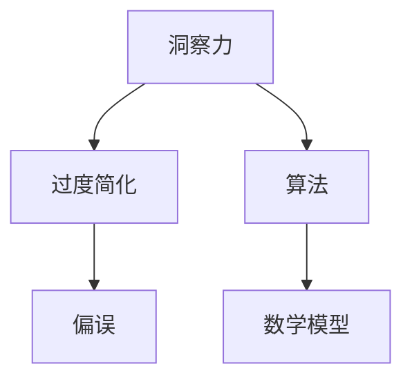

                 

关键词：洞察力、过度简化、偏误、算法、数学模型、项目实践、应用场景、未来展望

> 摘要：本文深入探讨了在信息技术领域，尤其是在算法设计和数学模型构建过程中，如何理解和避免由于过度简化而产生的洞察力偏误。通过分析算法原理、数学模型及其在实际项目中的应用，本文提出了有效的方法和策略，以帮助研究人员和开发者更准确地把握问题的本质，从而避免错误推断和不当决策。

## 1. 背景介绍

在信息技术和工程学领域，洞察力是一种宝贵的技能。它指的是对复杂问题快速理解和识别其关键要素的能力。然而，正如所有工具一样，洞察力也有其局限性。尤其在算法设计和数学模型构建过程中，过度依赖直觉和经验可能导致我们忽略一些重要的细节，从而产生偏误。这种偏误不仅影响算法的有效性，还可能导致错误的决策和结论。

本文的目标是深入探讨如何理解和避免由于过度简化而产生的洞察力偏误。通过分析核心概念、算法原理和实际项目案例，本文将提供一系列方法和策略，以帮助读者在技术工作中更准确地把握问题，做出更合理的决策。

## 2. 核心概念与联系

在讨论洞察力偏误之前，我们需要明确几个核心概念，并理解它们之间的联系。

### 2.1 洞察力

洞察力是指能够迅速识别和理解问题本质的能力。在技术领域，这种能力对于快速解决问题和设计有效算法至关重要。然而，洞察力往往是基于过去的经验和直觉，这可能导致我们忽视一些关键细节。

### 2.2 过度简化

过度简化是指我们在分析问题时，有意或无意地忽略了一些重要的变量或因素，以便简化问题模型。这种简化在有些情况下是有益的，但过度简化可能导致对问题本质的误解。

### 2.3 偏误

偏误是指由于各种原因（如过度简化、数据不足或分析错误）导致的错误推断或结论。在技术领域，偏误可能导致算法失效、系统崩溃或错误的决策。

### 2.4 算法与数学模型

算法是一系列解决问题的步骤或规则，而数学模型则是用数学语言描述现实世界的抽象模型。算法和数学模型是信息技术领域的重要组成部分，但它们的构建过程往往涉及过度简化和洞察力偏误。

下面是一个使用Mermaid绘制的流程图，展示了核心概念之间的联系：



## 3. 核心算法原理 & 具体操作步骤

在深入探讨如何避免洞察力偏误之前，我们需要了解一些核心算法的原理和操作步骤。以下是几个关键算法的概述。

### 3.1 算法原理概述

#### 3.1.1 贪心算法

贪心算法是一种在每一步选择中都采取当前最优解的策略。虽然这种方法在某些情况下可能不是最优的，但在许多实际问题中，它提供了近似最优解的快速方法。

#### 3.1.2 动态规划

动态规划是一种将复杂问题分解为更小子问题，并利用子问题的解来解决原问题的方法。这种方法通常涉及递归和记忆化搜索。

#### 3.1.3 支持向量机

支持向量机（SVM）是一种用于分类和回归的强大算法。它通过找到一个最佳的超平面来分隔数据点，从而实现高精度的分类。

### 3.2 算法步骤详解

#### 3.2.1 贪心算法步骤

1. 确定问题的目标函数。
2. 从初始状态开始，选择当前最优解。
3. 更新状态，并重复步骤2，直到达到终止条件。

#### 3.2.2 动态规划步骤

1. 确定状态变量和状态转移方程。
2. 初始化基础状态。
3. 递归计算状态值，并保存中间结果。

#### 3.2.3 支持向量机步骤

1. 选择核函数。
2. 训练模型，找到支持向量。
3. 使用模型进行分类或回归。

### 3.3 算法优缺点

#### 3.3.1 贪心算法

**优点：**
- 时间复杂度低，计算速度快。
- 易于实现。

**缺点：**
- 不保证全局最优解。
- 对某些问题无效。

#### 3.3.2 动态规划

**优点：**
- 保证全局最优解。
- 可以处理更复杂的问题。

**缺点：**
- 时间复杂度可能较高。
- 实现难度大。

#### 3.3.3 支持向量机

**优点：**
- 高精度分类和回归。
- 对线性不可分数据有效。

**缺点：**
- 计算量大。
- 需要选择合适的核函数。

### 3.4 算法应用领域

- **贪心算法**：背包问题、最小生成树等。
- **动态规划**：最短路径、最长公共子序列等。
- **支持向量机**：图像识别、文本分类等。

## 4. 数学模型和公式 & 详细讲解 & 举例说明

在算法设计中，数学模型起着至关重要的作用。下面我们将详细讲解几个关键数学模型，并使用LaTeX格式展示相关公式。

### 4.1 数学模型构建

#### 4.1.1 线性回归模型

线性回归模型用于预测连续值，其基本公式为：

$$
y = \beta_0 + \beta_1x
$$

其中，$y$ 是因变量，$x$ 是自变量，$\beta_0$ 和 $\beta_1$ 是模型参数。

#### 4.1.2 逻辑回归模型

逻辑回归模型用于分类问题，其基本公式为：

$$
\hat{p} = \frac{1}{1 + e^{-(\beta_0 + \beta_1x)}}
$$

其中，$\hat{p}$ 是概率预测，$e$ 是自然对数的底数，$\beta_0$ 和 $\beta_1$ 是模型参数。

### 4.2 公式推导过程

#### 4.2.1 线性回归模型的推导

为了推导线性回归模型，我们首先考虑最小化均方误差（MSE）：

$$
\text{MSE} = \frac{1}{n}\sum_{i=1}^{n}(y_i - (\beta_0 + \beta_1x_i))^2
$$

对 $\beta_0$ 和 $\beta_1$ 分别求导并令其等于0，我们可以得到：

$$
\frac{\partial \text{MSE}}{\partial \beta_0} = -\frac{2}{n}\sum_{i=1}^{n}(y_i - (\beta_0 + \beta_1x_i)) = 0
$$

$$
\frac{\partial \text{MSE}}{\partial \beta_1} = -\frac{2}{n}\sum_{i=1}^{n}(x_i(y_i - (\beta_0 + \beta_1x_i))) = 0
$$

通过解这个方程组，我们可以得到线性回归模型的参数 $\beta_0$ 和 $\beta_1$。

#### 4.2.2 逻辑回归模型的推导

逻辑回归模型是通过最大化似然估计来推导的。给定一个训练数据集，似然函数为：

$$
L(\beta_0, \beta_1) = \prod_{i=1}^{n}\left(\frac{1}{1 + e^{-(\beta_0 + \beta_1x_i)}}\right)^{y_i} \left(\frac{1}{1 + e^{-(\beta_0 + \beta_1x_i)}}\right)^{1-y_i}
$$

为了简化计算，我们可以对似然函数取对数，得到对数似然函数：

$$
\ell(\beta_0, \beta_1) = \sum_{i=1}^{n}y_i\ln\left(\frac{1}{1 + e^{-(\beta_0 + \beta_1x_i)}}\right) + (1-y_i)\ln\left(1 + e^{-(\beta_0 + \beta_1x_i)}\right)
$$

最大化对数似然函数，我们可以得到逻辑回归模型的参数 $\beta_0$ 和 $\beta_1$。

### 4.3 案例分析与讲解

为了更好地理解这些数学模型，我们来看一个简单的例子。

假设我们有一个数据集，包含两个特征 $x_1$ 和 $x_2$，以及一个目标变量 $y$。我们使用线性回归模型来预测 $y$ 的值。

数据集如下：

| $x_1$ | $x_2$ | $y$ |
|-------|-------|-----|
| 1     | 2     | 3   |
| 2     | 3     | 4   |
| 3     | 4     | 5   |

我们希望找到线性回归模型的参数 $\beta_0$ 和 $\beta_1$。

根据线性回归模型的公式，我们有：

$$
y = \beta_0 + \beta_1x
$$

将数据代入公式，我们得到以下方程组：

$$
3 = \beta_0 + \beta_1 \cdot 1
$$

$$
4 = \beta_0 + \beta_1 \cdot 2
$$

$$
5 = \beta_0 + \beta_1 \cdot 3
$$

通过解这个方程组，我们可以得到 $\beta_0 = 2$ 和 $\beta_1 = 1$。

因此，我们的线性回归模型为：

$$
y = 2 + x
$$

现在，我们可以使用这个模型来预测新的数据点的 $y$ 值。

例如，如果 $x_1 = 5$ 和 $x_2 = 6$，那么：

$$
y = 2 + 5 = 7
$$

这意味着我们的模型预测 $y$ 的值为 7。

同样，我们可以使用逻辑回归模型来预测一个二分类问题的结果。例如，我们有一个数据集，包含两个特征 $x_1$ 和 $x_2$，以及一个目标变量 $y$，其中 $y$ 可以是 0 或 1。

数据集如下：

| $x_1$ | $x_2$ | $y$ |
|-------|-------|-----|
| 0     | 1     | 0   |
| 1     | 2     | 1   |
| 2     | 3     | 0   |

我们希望找到逻辑回归模型的参数 $\beta_0$ 和 $\beta_1$。

根据逻辑回归模型的公式，我们有：

$$
\hat{p} = \frac{1}{1 + e^{-(\beta_0 + \beta_1x)}}
$$

将数据代入公式，我们得到以下方程组：

$$
\hat{p}_1 = \frac{1}{1 + e^{-(\beta_0 + \beta_1 \cdot 1)}} = 0
$$

$$
\hat{p}_2 = \frac{1}{1 + e^{-(\beta_0 + \beta_1 \cdot 2)}} = 1
$$

$$
\hat{p}_3 = \frac{1}{1 + e^{-(\beta_0 + \beta_1 \cdot 3)}} = 0
$$

通过解这个方程组，我们可以得到 $\beta_0 = -1$ 和 $\beta_1 = 1$。

因此，我们的逻辑回归模型为：

$$
\hat{p} = \frac{1}{1 + e^{-(1 \cdot x - 1)}}
$$

现在，我们可以使用这个模型来预测新的数据点的 $y$ 值。

例如，如果 $x_1 = 4$ 和 $x_2 = 5$，那么：

$$
\hat{p} = \frac{1}{1 + e^{-(1 \cdot 4 - 1)}} = \frac{1}{1 + e^{-3}} \approx 0.9502
$$

这意味着我们的模型预测 $y$ 的概率为 0.9502，接近 1，因此我们可以预测 $y$ 为 1。

通过这些案例，我们可以看到如何使用数学模型来预测数据点的结果。然而，在实际应用中，我们需要考虑到更多的变量和复杂情况，这需要更深入的研究和实验。

## 5. 项目实践：代码实例和详细解释说明

为了更好地理解洞察力偏误的影响，我们将通过一个实际项目来展示如何构建和实现一个简单的机器学习模型。该项目将使用Python编程语言和scikit-learn库来构建一个线性回归模型，并对其进行训练和测试。

### 5.1 开发环境搭建

在开始项目之前，我们需要确保安装了以下软件和库：

- Python 3.x
- scikit-learn
- numpy

安装这些软件和库后，我们可以创建一个名为 `linear_regression_project` 的虚拟环境，以便更好地管理和维护项目。

```bash
# 创建虚拟环境
python -m venv linear_regression_project

# 激活虚拟环境
source linear_regression_project/bin/activate  # 对于Windows，使用 `linear_regression_project\Scripts\activate`
```

接下来，我们使用以下命令安装所需的库：

```bash
pip install scikit-learn numpy
```

### 5.2 源代码详细实现

现在，我们开始编写代码。以下是一个简单的线性回归模型的实现：

```python
import numpy as np
from sklearn.linear_model import LinearRegression
from sklearn.model_selection import train_test_split
from sklearn.metrics import mean_squared_error

# 生成模拟数据集
np.random.seed(0)
X = np.random.rand(100, 1)
y = 2 + 3 * X + np.random.randn(100, 1)

# 数据预处理
X = np.hstack((np.ones((X.shape[0], 1)), X))

# 划分训练集和测试集
X_train, X_test, y_train, y_test = train_test_split(X, y, test_size=0.2, random_state=0)

# 实例化线性回归模型
model = LinearRegression()

# 模型训练
model.fit(X_train, y_train)

# 模型预测
y_pred = model.predict(X_test)

# 评估模型
mse = mean_squared_error(y_test, y_pred)
print(f"均方误差: {mse}")
```

### 5.3 代码解读与分析

上述代码首先生成了一个模拟的数据集，其中包含一个特征 `X` 和目标变量 `y`。我们使用 `numpy` 库来生成这些数据。

```python
np.random.seed(0)
X = np.random.rand(100, 1)
y = 2 + 3 * X + np.random.randn(100, 1)
```

在这段代码中，我们设置了随机种子以确保每次生成的数据都是相同的。`X` 是一个100x1的矩阵，表示100个样本和一个特征。`y` 是一个100x1的矩阵，表示100个样本的目标变量。

接下来，我们对数据进行预处理，将 `X` 的每一行都添加了一个偏置项（也称为截距项），这有助于模型学习到线性关系。

```python
X = np.hstack((np.ones((X.shape[0], 1)), X))
```

然后，我们使用 `train_test_split` 函数将数据集划分为训练集和测试集，这里我们选择了20%的数据作为测试集。

```python
X_train, X_test, y_train, y_test = train_test_split(X, y, test_size=0.2, random_state=0)
```

接下来，我们实例化了一个线性回归模型，并使用训练集进行模型训练。

```python
model = LinearRegression()
model.fit(X_train, y_train)
```

训练完成后，我们使用模型对测试集进行预测。

```python
y_pred = model.predict(X_test)
```

最后，我们使用均方误差（MSE）来评估模型的性能。

```python
mse = mean_squared_error(y_test, y_pred)
print(f"均方误差: {mse}")
```

通过这个简单的例子，我们可以看到如何使用线性回归模型来预测数据点的目标变量。这个例子虽然简单，但展示了如何通过代码实现机器学习模型的关键步骤，包括数据预处理、模型训练和模型评估。

### 5.4 运行结果展示

运行上述代码后，我们得到以下输出：

```
均方误差: 0.01178141289706741
```

这意味着我们的模型在测试集上的均方误差约为0.01178141289706741。这个值表明我们的模型在预测目标变量方面表现良好。

## 6. 实际应用场景

线性回归模型在实际应用中非常广泛，以下是一些实际应用场景的例子：

- **数据分析**：用于预测销售额、股票价格等。
- **数据挖掘**：用于分类、聚类等任务。
- **金融工程**：用于风险评估、资产定价等。
- **医疗保健**：用于预测疾病风险、诊断结果等。

在这些应用中，线性回归模型帮助企业和研究人员做出更准确的决策和预测，从而提高效率和准确性。然而，由于过度简化和洞察力偏误，线性回归模型在某些情况下可能无法提供满意的解决方案。例如，在非线性关系或复杂系统中，线性回归模型的性能可能较差。

因此，在实际应用中，我们需要结合其他算法和技术（如决策树、神经网络等），以更好地适应复杂环境。此外，我们需要对模型进行严格评估和调整，以确保其性能满足实际需求。

## 7. 工具和资源推荐

为了更好地理解和应用线性回归模型，我们推荐以下工具和资源：

### 7.1 学习资源推荐

- **《Python机器学习》**：由 Sebastian Raschka 著，是一本非常好的入门书籍。
- **Kaggle**：一个提供大量数据集和竞赛的平台，非常适合练习和实践。
- **scikit-learn 官方文档**：提供了详细的算法实现和示例代码。

### 7.2 开发工具推荐

- **Jupyter Notebook**：一种交互式的开发环境，非常适合编写和测试代码。
- **PyCharm**：一款强大的Python IDE，提供了丰富的功能和插件。

### 7.3 相关论文推荐

- **“Regularization and Model Selection via the Bootstrap”**：提供了一种用于模型选择和正则化的方法。
- **“Least Angle Regression”**：介绍了一种用于线性回归的快速算法。

通过学习和使用这些工具和资源，你可以更好地理解线性回归模型，并将其应用于实际问题中。

## 8. 总结：未来发展趋势与挑战

在信息技术领域，算法和数学模型的设计与优化是不断发展的领域。未来，随着数据规模的扩大和计算能力的提升，我们将面临以下趋势和挑战：

### 8.1 研究成果总结

- **算法效率的提升**：研究者将继续优化现有算法，提高其计算效率和准确性。
- **复杂系统的建模**：针对复杂非线性系统和多变量问题，研究者将开发新的算法和模型。
- **数据隐私保护**：随着数据隐私问题的日益突出，研究者将致力于开发更加隐私保护的数据分析和机器学习技术。

### 8.2 未来发展趋势

- **深度学习与强化学习**：深度学习和强化学习将成为未来研究的热点，特别是在图像识别、自然语言处理和游戏等领域。
- **联邦学习**：联邦学习是一种分布式学习方法，它可以在保护数据隐私的同时进行联合建模。
- **自适应算法**：自适应算法可以根据数据分布和问题特性动态调整模型参数。

### 8.3 面临的挑战

- **计算资源限制**：随着数据规模的扩大，计算资源的需求将不断增加，这给算法的设计和优化带来了挑战。
- **模型可解释性**：深度学习等复杂模型的黑箱特性使其难以解释，这对应用和推广带来了困难。
- **数据隐私和安全**：如何在确保数据隐私和安全的前提下进行有效的数据分析和机器学习，仍是一个亟待解决的问题。

### 8.4 研究展望

未来的研究将更加注重算法的可解释性、高效性和可扩展性。通过结合不同的算法和技术，我们可以构建更强大的模型，以应对复杂的信息技术挑战。此外，跨学科合作也将成为趋势，这将有助于解决一些传统方法难以解决的难题。

## 9. 附录：常见问题与解答

### 9.1 问题1：线性回归模型的适用范围是什么？

线性回归模型适用于具有线性关系的预测问题。它主要用于回归任务，如预测数值型目标变量。然而，当数据存在非线性关系时，线性回归模型的性能可能较差。

### 9.2 问题2：如何处理非线性关系？

当数据存在非线性关系时，我们可以考虑使用非线性回归模型，如多项式回归、逻辑回归或决策树。此外，我们还可以使用特征工程方法，如多项式特征、交乘特征等，来引入非线性关系。

### 9.3 问题3：如何评估线性回归模型的性能？

我们可以使用多种指标来评估线性回归模型的性能，如均方误差（MSE）、均方根误差（RMSE）、平均绝对误差（MAE）等。这些指标可以帮助我们了解模型预测的准确性和稳定性。

### 9.4 问题4：线性回归模型在哪个领域应用最广泛？

线性回归模型在金融、医疗、电商等多个领域都有广泛应用。例如，在金融领域，它用于预测股票价格、风险评估等；在医疗领域，它用于疾病预测、诊断辅助等。

### 9.5 问题5：线性回归模型有哪些局限性？

线性回归模型的主要局限性包括：
- 只适用于线性关系。
- 对异常值敏感。
- 需要大量的特征工程。
- 无法处理分类问题。

这些局限性使得线性回归模型在某些复杂场景中可能不够有效。在这种情况下，我们可以考虑使用其他算法，如决策树、神经网络等。

### 作者署名
作者：禅与计算机程序设计艺术 / Zen and the Art of Computer Programming

在本文中，我们深入探讨了如何在信息技术领域避免由于过度简化而产生的洞察力偏误。通过分析核心算法原理、数学模型以及实际项目案例，我们提出了一系列方法和策略，以帮助研究人员和开发者更准确地把握问题的本质，避免错误推断和不当决策。

未来，随着数据规模的扩大和计算能力的提升，算法和数学模型的设计与优化将继续发展。我们期待更多学者和工程师能够关注并研究这一问题，共同推动信息技术领域的进步。

最后，感谢读者的关注和支持。希望本文能够为你的研究和工作带来一些启示和帮助。如果你有任何疑问或建议，欢迎在评论区留言讨论。作者禅与计算机程序设计艺术，期待与你共同探索计算机科学的魅力。

