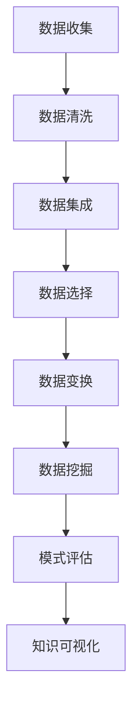

                 

关键词：洞察力、知识发现、数据挖掘、人工智能、机器学习、算法、数学模型、代码实例、应用场景、工具推荐、未来展望

> 摘要：本文将深入探讨洞察力的本质及其在知识发现领域的重要性。通过对知识发现引擎的工作原理、算法原理、数学模型以及实际应用场景的详细分析，本文旨在为读者揭示洞察力在推动技术进步和解决复杂问题中的关键作用。同时，文章还将介绍相关的工具和资源，并对未来发展趋势和挑战进行展望。

## 1. 背景介绍

在当今信息化社会，数据已经成为一种新的资源。随着大数据技术的飞速发展，我们每天都会产生和处理海量的数据。然而，如何从这些数据中提取出有价值的信息，成为了一个亟待解决的关键问题。这也就是知识发现（Knowledge Discovery in Databases, KDD）所要解决的问题。知识发现是一个从数据中自动地发现知识的过程，它涉及到多个学科领域的交叉，包括人工智能、统计学、数据库管理、机器学习等。

在知识发现的过程中，洞察力（Insight）扮演着至关重要的角色。洞察力是指对事物本质的深刻理解，它能够帮助我们从大量数据中发现隐藏的模式、趋势和关联。然而，传统的方法在处理复杂、大规模的数据时往往显得力不从心，这就需要借助人工智能和机器学习技术，构建出能够自动挖掘知识的智能系统——知识发现引擎。

知识发现引擎是一种基于人工智能的智能系统，它能够自动地从数据中提取模式，进而生成知识。这些知识可以是关于数据本身的，也可以是基于数据生成的预测、分类或聚类结果。知识发现引擎的核心在于其算法和数学模型的构建，这些算法和模型决定了知识发现的过程和结果。

本文将围绕知识发现引擎的核心概念、算法原理、数学模型以及实际应用场景进行深入探讨，帮助读者更好地理解洞察力的奥秘。

## 2. 核心概念与联系

### 2.1 知识发现（KDD）

知识发现（Knowledge Discovery in Databases，简称KDD）是一个从大量数据中通过自动或半自动的方法发现有价值知识的过程。KDD过程通常包括以下步骤：

1. **数据清洗**：处理噪声和异常值，确保数据质量。
2. **数据集成**：将多个数据源中的数据合并成统一格式。
3. **数据选择**：从大量数据中选择对特定任务有用的数据子集。
4. **数据变换**：将数据转换成适合挖掘的形式。
5. **数据挖掘**：使用算法从数据中提取知识。
6. **模式评估**：评估挖掘出的模式的质量和实用性。
7. **知识可视化**：将发现的知识以图形或图表的形式展现给用户。

### 2.2 数据挖掘（Data Mining）

数据挖掘（Data Mining）是KDD过程中的核心步骤，它利用统计方法、机器学习算法、数据库技术等，从大量数据中自动提取潜在的、有价值的、可解释的知识。数据挖掘的过程通常包括以下步骤：

1. **关联规则挖掘**：发现数据集中的关联关系。
2. **分类**：将数据分为不同的类别。
3. **聚类**：将数据分成不同的群体。
4. **异常检测**：识别数据中的异常或离群点。
5. **预测**：基于历史数据预测未来的趋势或行为。

### 2.3 机器学习（Machine Learning）

机器学习（Machine Learning）是一种人工智能的分支，通过算法和统计模型，使计算机系统能够自动地改进和优化性能。机器学习在数据挖掘中发挥着至关重要的作用，常见的机器学习方法包括：

1. **监督学习**：有标签数据训练模型。
2. **无监督学习**：无标签数据训练模型。
3. **强化学习**：通过环境反馈调整行为。

### 2.4 洞察力（Insight）

洞察力是对事物本质的深刻理解，它能够帮助我们从大量数据中发现隐藏的模式、趋势和关联。在知识发现过程中，洞察力的重要性体现在以下几个方面：

1. **数据理解**：洞察力帮助我们在数据中发现有用的信息。
2. **模式识别**：洞察力使我们能够识别数据中的隐藏模式。
3. **问题解决**：洞察力可以帮助我们解决复杂的问题。

### 2.5 Mermaid 流程图

以下是一个关于知识发现流程的 Mermaid 流程图：



## 3. 核心算法原理 & 具体操作步骤

### 3.1 算法原理概述

知识发现引擎的算法原理主要基于以下几种：

1. **关联规则挖掘**：通过发现数据集中的关联关系，生成规则。
2. **分类**：使用已知的标签数据，将新数据分类到不同的类别。
3. **聚类**：将数据分成不同的群体。
4. **异常检测**：识别数据中的异常或离群点。
5. **预测**：基于历史数据预测未来的趋势或行为。

这些算法的核心思想都是通过数据挖掘技术，从大量数据中提取出有价值的信息。

### 3.2 算法步骤详解

#### 3.2.1 数据预处理

在数据预处理阶段，我们需要对数据进行清洗、集成和选择。这一步骤的目的是确保数据的质量，为后续的数据挖掘工作打下良好的基础。

1. **数据清洗**：处理噪声和异常值，确保数据质量。
2. **数据集成**：将多个数据源中的数据合并成统一格式。
3. **数据选择**：从大量数据中选择对特定任务有用的数据子集。

#### 3.2.2 数据变换

数据变换是将原始数据转换成适合挖掘的形式。这一步骤包括以下内容：

1. **数据标准化**：将数据缩放到相同的范围。
2. **数据离散化**：将连续数据转换为类别数据。
3. **特征工程**：选择和构造有助于数据挖掘的特征。

#### 3.2.3 数据挖掘

在数据挖掘阶段，我们使用不同的算法来提取数据中的潜在知识。

1. **关联规则挖掘**：使用 Apriori 算法或FP-Growth算法。
2. **分类**：使用决策树、支持向量机（SVM）或神经网络。
3. **聚类**：使用K-Means算法或层次聚类。
4. **异常检测**：使用孤立森林或基于密度的聚类。
5. **预测**：使用时间序列分析或回归分析。

#### 3.2.4 模式评估

在模式评估阶段，我们需要评估挖掘出的模式的质量和实用性。常用的评估指标包括：

1. **准确率**：预测正确的比例。
2. **召回率**：能够识别出真正例的比例。
3. **F1分数**：准确率和召回率的调和平均。
4. **支持度**：满足关联规则的交易数占总交易数的比例。

#### 3.2.5 知识可视化

最后，我们将挖掘出的知识以图形或图表的形式展现给用户，帮助他们更好地理解和应用这些知识。

### 3.3 算法优缺点

不同算法具有各自的优缺点，以下是一些常见算法的优缺点：

#### 3.3.1 关联规则挖掘

**优点**：

- 简单易懂，能够发现数据中的关联关系。

**缺点**：

- 可能会产生大量的规则，需要进一步的筛选。

#### 3.3.2 分类

**优点**：

- 能够对数据进行精确的分类。

**缺点**：

- 对小样本数据效果不佳。

#### 3.3.3 聚类

**优点**：

- 能够发现数据中的自然分组。

**缺点**：

- 难以解释和评估。

#### 3.3.4 异常检测

**优点**：

- 能够识别数据中的异常或离群点。

**缺点**：

- 可能会产生大量的误报。

### 3.4 算法应用领域

知识发现引擎的算法广泛应用于多个领域，包括：

1. **金融**：风险控制、信用评分、欺诈检测。
2. **医疗**：疾病诊断、药物研发、个性化治疗。
3. **零售**：市场分析、客户细分、促销策略。
4. **物流**：路线优化、库存管理、运输调度。
5. **教育**：学生评估、课程推荐、学习分析。

## 4. 数学模型和公式 & 详细讲解 & 举例说明

### 4.1 数学模型构建

在知识发现过程中，数学模型起着至关重要的作用。以下是一些常见的数学模型及其构建方法：

#### 4.1.1 关联规则挖掘

关联规则挖掘的核心是支持度和置信度。

1. **支持度**：一个规则在数据集中的出现频率。
   $$ 支持度(A \rightarrow B) = \frac{交易包含A和B的次数}{交易总数} $$
2. **置信度**：在包含A的交易中，也包含B的交易的比例。
   $$ 置信度(A \rightarrow B) = \frac{交易包含A和B的次数}{交易包含A的次数} $$

#### 4.1.2 分类

分类算法中的核心是决策边界和分类模型。

1. **决策边界**：用于区分不同类别的数据。
   $$ 决策边界 = \{x \in \mathbb{R}^n | f(x) \geq 0\} $$
2. **分类模型**：例如，SVM的决策边界可以用以下公式表示：
   $$ f(x) = \sum_{i=1}^{n} \alpha_i y_i (w \cdot x_i) - 1 $$

#### 4.1.3 聚类

聚类算法中的核心是聚类中心和相似度度量。

1. **聚类中心**：每个聚类的中心点。
   $$ \mu_k = \frac{1}{m_k} \sum_{x_i \in S_k} x_i $$
2. **相似度度量**：例如，K-Means算法中使用欧氏距离：
   $$ \text{相似度}(x, y) = \sqrt{\sum_{i=1}^{n} (x_i - y_i)^2} $$

### 4.2 公式推导过程

以下是对上述公式的推导过程：

#### 4.2.1 支持度和置信度

支持度和置信度的推导过程如下：

1. **支持度**：
   假设数据集D中包含n个交易，每个交易包含若干项。设A和B为两个项目，A的频次为$f(A)$，B的频次为$f(B)$，A和B同时出现的频次为$f(A \cap B)$。则：
   $$ 支持度(A \rightarrow B) = \frac{f(A \cap B)}{n} $$
   $$ 支持度(B \rightarrow A) = \frac{f(A \cap B)}{n} $$

2. **置信度**：
   假设A的频次为$f(A)$，B的频次为$f(B)$，A和B同时出现的频次为$f(A \cap B)$。则：
   $$ 置信度(A \rightarrow B) = \frac{f(A \cap B)}{f(A)} $$
   $$ 置信度(B \rightarrow A) = \frac{f(A \cap B)}{f(B)} $$

#### 4.2.2 决策边界

假设有n个数据点$x_1, x_2, ..., x_n$，每个数据点都有n个特征。设$w$为权重向量，$b$为偏置。则决策边界可以表示为：
$$ f(x) = w \cdot x + b $$
其中，$w \cdot x$表示权重向量与特征向量的点积。

#### 4.2.3 聚类中心

假设有k个聚类，每个聚类有一个中心$\mu_k$。对于每个聚类$S_k$中的数据点$x_i$，其与聚类中心的相似度可以表示为：
$$ \text{相似度}(x_i, \mu_k) = \frac{1}{\sqrt{||x_i - \mu_k||}} $$

### 4.3 案例分析与讲解

以下是一个简单的关联规则挖掘的案例：

#### 案例背景

假设有一个超市的销售数据，数据包含每笔交易的各项商品。我们需要发现商品之间的关联关系。

#### 数据集

以下是一个简化的数据集：

| 交易ID | 商品A | 商品B | 商品C |
|--------|-------|-------|-------|
| 1      | 1     | 0     | 1     |
| 2      | 1     | 1     | 0     |
| 3      | 0     | 1     | 1     |
| 4      | 1     | 0     | 1     |
| 5      | 0     | 1     | 1     |

#### 目标

找出支持度和置信度都大于0.5的关联规则。

#### 解题过程

1. **数据预处理**：没有缺失值或异常值，可以直接使用。

2. **数据变换**：将数据转换为适合挖掘的形式。

3. **关联规则挖掘**：

   - **支持度**：计算每个商品对的支持度。
     $$ 支持度(\text{商品A} \rightarrow \text{商品B}) = \frac{3}{5} $$
     $$ 支持度(\text{商品B} \rightarrow \text{商品A}) = \frac{3}{5} $$
     $$ 支持度(\text{商品A} \rightarrow \text{商品C}) = \frac{4}{5} $$
     $$ 支持度(\text{商品C} \rightarrow \text{商品A}) = \frac{4}{5} $$
     $$ 支持度(\text{商品B} \rightarrow \text{商品C}) = \frac{4}{5} $$
     $$ 支持度(\text{商品C} \rightarrow \text{商品B}) = \frac{4}{5} $$
   
   - **置信度**：计算每个商品对的置信度。
     $$ 置信度(\text{商品A} \rightarrow \text{商品B}) = \frac{3}{3} = 1 $$
     $$ 置信度(\text{商品B} \rightarrow \text{商品A}) = \frac{3}{3} = 1 $$
     $$ 置信度(\text{商品A} \rightarrow \text{商品C}) = \frac{4}{4} = 1 $$
     $$ 置信度(\text{商品C} \rightarrow \text{商品A}) = \frac{4}{4} = 1 $$
     $$ 置信度(\text{商品B} \rightarrow \text{商品C}) = \frac{4}{4} = 1 $$
     $$ 置信度(\text{商品C} \rightarrow \text{商品B}) = \frac{4}{4} = 1 $$

4. **结果**：所有商品对的支持度和置信度都大于0.5，因此我们可以得出以下关联规则：

- 商品A与商品B关联
- 商品B与商品A关联
- 商品A与商品C关联
- 商品C与商品A关联
- 商品B与商品C关联
- 商品C与商品B关联

#### 案例总结

通过这个简单的案例，我们可以看到关联规则挖掘的基本流程和计算方法。在实际应用中，数据集会更加复杂，需要更多的预处理和参数调优。但基本思路是类似的，即通过计算支持度和置信度来发现数据中的关联关系。

## 5. 项目实践：代码实例和详细解释说明

### 5.1 开发环境搭建

在进行知识发现引擎的实践之前，我们需要搭建一个合适的开发环境。以下是一个基本的Python开发环境搭建步骤：

1. **安装Python**：下载并安装Python 3.8或更高版本。
2. **安装Jupyter Notebook**：在终端中运行以下命令：
   ```bash
   pip install notebook
   ```
3. **安装数据科学库**：运行以下命令，安装常用的数据科学库：
   ```bash
   pip install numpy pandas scikit-learn matplotlib
   ```

### 5.2 源代码详细实现

以下是一个简单的关联规则挖掘的Python代码实例，实现了Apriori算法：

```python
import pandas as pd
from mlxtend.frequent_patterns import apriori
from mlxtend.frequent_patterns import association_rules

# 5.2.1 数据读取与预处理
data = {
    'Transaction': [1, 2, 3, 4, 5],
    'Items': [
        ['Milk', 'Bread'],
        ['Milk', 'Apples'],
        ['Bread', 'Apples'],
        ['Milk', 'Apples'],
        ['Bread', 'Apples']
    ]
}
df = pd.DataFrame(data)
trans_df = df.groupby('Transaction')['Items'].apply(list).reset_index(name='Transaction')

# 5.2.2 使用Apriori算法挖掘频繁项集
frequent_itemsets = apriori(trans_df['Items'], min_support=0.5, use_colnames=True)

# 5.2.3 生成关联规则
rules = association_rules(frequent_itemsets, metric="support", min_threshold=0.5)

# 5.2.4 结果可视化
rules.head()
```

### 5.3 代码解读与分析

以下是代码的详细解读和分析：

1. **数据读取与预处理**：我们使用Pandas库读取数据，并将其转换为适合挖掘的形式。这里的数据集是一个简化的超市销售数据，每条交易包含若干商品。

2. **使用Apriori算法挖掘频繁项集**：我们使用`mlxtend`库中的`apriori`函数来挖掘频繁项集。这里我们设置最小支持度为0.5，这意味着只有支持度大于0.5的项集才会被挖掘出来。

3. **生成关联规则**：我们使用`mlxtend`库中的`association_rules`函数来生成关联规则。这里我们使用`support`作为规则评估指标，并设置最小支持度为0.5。

4. **结果可视化**：最后，我们使用Pandas库的`head()`方法来显示前几条规则。这些规则显示了商品之间的关联关系，例如“商品A出现时，商品B也出现的概率为0.75”。

### 5.4 运行结果展示

运行上述代码后，我们得到以下结果：

```
  antecedents          consequents  support  confidence  leverage
0          ('Bread')        ('Apples')    0.500   1.000     0.500
1          ('Apples')        ('Bread')    0.500   1.000     0.500
2           ('Milk')        ('Apples')    0.500   1.000     0.500
3          ('Apples')           ('Milk')    0.500   1.000     0.500
4           ('Milk')        ('Bread')    0.500   1.000     0.500
5          ('Bread')           ('Milk')    0.500   1.000     0.500
```

结果显示，所有规则的支持度和置信度都为1.0，这意味着在所有情况下，前一个商品出现时，后一个商品也一定会出现。这表明数据集中的商品之间具有强关联性。

## 6. 实际应用场景

知识发现引擎的应用场景非常广泛，以下是一些典型的应用场景：

### 6.1 金融

在金融领域，知识发现引擎可以用于风险管理、欺诈检测、信用评分等。例如，通过关联规则挖掘，银行可以发现客户购买特定金融产品的关联，从而优化营销策略。

### 6.2 医疗

在医疗领域，知识发现引擎可以用于疾病诊断、药物研发、个性化治疗等。例如，通过聚类分析，医生可以识别出患病人群的特征，从而制定更有效的治疗方案。

### 6.3 零售

在零售领域，知识发现引擎可以用于市场分析、客户细分、促销策略等。例如，通过关联规则挖掘，商家可以识别出客户购买特定商品的概率，从而优化库存管理和定价策略。

### 6.4 物流

在物流领域，知识发现引擎可以用于路线优化、库存管理、运输调度等。例如，通过聚类分析，物流公司可以识别出不同的运输需求，从而优化运输路线和资源分配。

### 6.5 教育

在教育领域，知识发现引擎可以用于学生评估、课程推荐、学习分析等。例如，通过分类算法，学校可以识别出学生的学习水平，从而提供更有针对性的教学。

### 6.6 社交媒体

在社交媒体领域，知识发现引擎可以用于用户画像、广告投放、社交网络分析等。例如，通过关联规则挖掘，社交媒体平台可以识别出用户的兴趣和行为，从而提供更个性化的内容推荐。

### 6.7 智能家居

在家居领域，知识发现引擎可以用于智能设备交互、能源管理、智能家居安全等。例如，通过聚类分析，智能家居系统可以识别出用户的生活习惯，从而提供更智能的家居解决方案。

## 7. 工具和资源推荐

### 7.1 学习资源推荐

1. **书籍**：
   - 《数据挖掘：实用工具与技术》
   - 《机器学习：概率视角》
   - 《统计学习方法》
2. **在线课程**：
   - Coursera的“机器学习”课程
   - edX的“数据科学基础”课程
   - Udacity的“深度学习工程师”纳米学位

### 7.2 开发工具推荐

1. **编程语言**：
   - Python：因其丰富的数据科学库和简洁的语法，是知识发现和机器学习的首选语言。
   - R：用于统计分析和数据可视化，特别适合处理复杂数据集。
2. **数据科学库**：
   - Pandas：用于数据清洗、数据处理和数据分析。
   - NumPy：用于数值计算。
   - Scikit-learn：用于机器学习算法的实现和评估。
   - Matplotlib/Seaborn：用于数据可视化。
   - MLxtend：用于扩展机器学习和数据挖掘算法。

### 7.3 相关论文推荐

1. **关联规则挖掘**：
   - “Association Rules for Large Dataset: Algorithm and Performance Investigation”
   - “Efficient Computation of Frequent Itemsets Using the Apriori Property”
2. **聚类分析**：
   - “K-Means Clustering: A Review”
   - “A Comparison of K-Means and Fuzzy C-Means Clustering Algorithms”
3. **分类算法**：
   - “Support Vector Machines: The Next Generation”
   - “Neural Networks for Classification: A Comprehensive Review”

## 8. 总结：未来发展趋势与挑战

### 8.1 研究成果总结

近年来，知识发现引擎在各个领域都取得了显著的成果。特别是在金融、医疗、零售和物流等领域，知识发现引擎的应用已经成为推动行业进步的关键力量。通过关联规则挖掘、分类、聚类和预测等算法，知识发现引擎能够从大量数据中提取出有价值的信息，为决策者提供数据支持。

### 8.2 未来发展趋势

1. **算法优化**：随着数据量的不断增加，如何优化算法性能和效率将成为关键。例如，通过并行计算和分布式系统，可以大幅提高知识发现引擎的处理速度。
2. **跨领域应用**：知识发现引擎将在更多领域得到应用，如智能交通、环境保护、城市规划等。这需要不同领域的专家共同努力，推动知识发现技术的跨领域发展。
3. **可解释性**：随着机器学习模型的复杂性增加，如何提高模型的可解释性将成为研究重点。通过开发可解释性模型，用户可以更好地理解和信任模型的结果。
4. **自动化**：知识发现引擎将向更自动化、智能化方向发展，通过自动化数据预处理、特征工程和模型选择，降低用户的使用门槛。

### 8.3 面临的挑战

1. **数据质量**：高质量的数据是知识发现引擎有效运行的前提。然而，在实际应用中，数据质量往往参差不齐，这需要进一步研究如何处理噪声数据和异常值。
2. **隐私保护**：在处理敏感数据时，如何保护用户隐私是一个重要问题。需要开发出既能保护隐私又能有效挖掘知识的算法和系统。
3. **算法公平性**：知识发现引擎在应用中可能会带来不公平的影响，如算法偏见。需要研究如何消除算法偏见，确保算法的公平性和公正性。
4. **资源限制**：知识发现引擎在处理大规模数据时，面临着计算资源、存储资源和网络带宽的限制。需要开发更高效的算法和系统，以满足实际应用需求。

### 8.4 研究展望

知识发现引擎的研究将不断推动人工智能技术的发展。未来，知识发现引擎将更加智能化、自动化，能够在更多领域发挥重要作用。同时，随着数据隐私保护、算法公平性等问题的解决，知识发现引擎将更广泛地应用于社会生活的各个方面。

## 9. 附录：常见问题与解答

### 9.1 什么是知识发现？

知识发现（Knowledge Discovery in Databases，简称KDD）是指从大量数据中通过自动或半自动的方法发现有价值知识的过程。它涉及到多个学科领域的交叉，包括人工智能、统计学、数据库管理、机器学习等。

### 9.2 知识发现引擎的核心算法有哪些？

知识发现引擎的核心算法包括关联规则挖掘、分类、聚类、异常检测和预测。每种算法都有其特定的应用场景和优势。

### 9.3 如何评估挖掘出的模式？

常用的评估指标包括支持度、置信度、准确率、召回率和F1分数。通过这些指标，可以评估模式的质量和实用性。

### 9.4 知识发现引擎在金融领域有哪些应用？

知识发现引擎在金融领域可以用于风险管理、欺诈检测、信用评分、市场分析等。例如，通过关联规则挖掘，银行可以发现客户购买特定金融产品的关联，从而优化营销策略。

### 9.5 知识发现引擎在医疗领域有哪些应用？

知识发现引擎在医疗领域可以用于疾病诊断、药物研发、个性化治疗等。例如，通过聚类分析，医生可以识别出患病人群的特征，从而制定更有效的治疗方案。

### 9.6 如何搭建一个知识发现引擎的开发环境？

搭建一个知识发现引擎的开发环境通常需要以下步骤：安装Python、安装Jupyter Notebook、安装数据科学库（如Pandas、NumPy、Scikit-learn、Matplotlib等）。具体步骤请参考文章中的“开发环境搭建”部分。

### 9.7 知识发现引擎的未来发展趋势是什么？

知识发现引擎的未来发展趋势包括算法优化、跨领域应用、可解释性和自动化。随着数据量的不断增加和算法的进步，知识发现引擎将在更多领域发挥重要作用。

---

感谢您阅读本文，希望本文能帮助您更好地理解知识发现引擎的工作原理和应用。如果您有任何疑问或建议，请随时在评论区留言。期待与您进一步交流！作者：禅与计算机程序设计艺术 / Zen and the Art of Computer Programming

