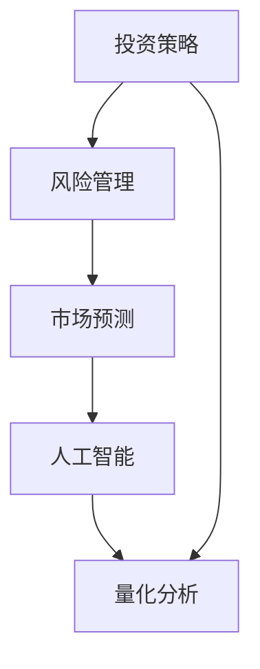

                 

关键词：洞察力、投资策略、风险管理、市场预测、人工智能、量化分析

> 摘要：本文探讨了洞察力在投资领域的应用，介绍了如何通过深入分析和理解市场动态，结合人工智能和量化分析工具，制定出更加精准和有效的投资策略。文章结构包括背景介绍、核心概念与联系、核心算法原理、数学模型与公式、项目实践、实际应用场景、工具和资源推荐、总结与展望，以及常见问题与解答等内容。

## 1. 背景介绍

随着金融市场的不断发展和复杂性增加，投资领域对洞察力的需求变得尤为突出。洞察力，即对事物的深刻理解和敏锐观察，是投资决策中不可或缺的一部分。传统的投资策略往往依赖于历史数据和统计方法，而现代投资策略则越来越多地利用人工智能和量化分析来提升决策的准确性和效率。

本文旨在探讨如何利用洞察力在投资领域制定有效的策略。我们将从以下几个方面展开讨论：

- **核心概念与联系**：介绍洞察力的定义和投资策略相关的核心概念。
- **核心算法原理**：探讨如何利用算法原理来提升投资策略的准确性。
- **数学模型与公式**：介绍投资策略中常用的数学模型和公式。
- **项目实践**：通过具体代码实例展示如何实现这些策略。
- **实际应用场景**：讨论洞察力在投资领域的实际应用。
- **工具和资源推荐**：推荐相关工具和资源，以帮助读者进一步学习和实践。
- **总结与展望**：总结研究成果，探讨未来的发展趋势和挑战。

### 1.1 投资策略的重要性

投资策略是投资者根据自身的风险承受能力和市场环境制定的投资方案。一个有效的投资策略不仅能够帮助投资者实现资产增值，还能够降低投资风险。随着市场的复杂性和不确定性增加，仅仅依靠传统的方法已经难以满足投资者的需求。因此，洞察力的应用显得尤为重要。

洞察力不仅可以提高投资者的市场理解能力，还能够帮助投资者预见市场趋势和潜在风险，从而做出更加明智的投资决策。通过本文的探讨，希望能够为投资者提供一些实用的策略和方法，以提升投资效果。

### 1.2 现代投资策略的发展趋势

现代投资策略的发展趋势主要体现在以下几个方面：

- **人工智能的应用**：人工智能技术已经开始广泛应用于投资领域，包括股票预测、市场分析、风险管理等。通过机器学习算法，人工智能能够从海量数据中提取有用信息，提高投资决策的准确性。
- **量化分析**：量化分析是投资策略的核心组成部分，它利用数学模型和统计方法来分析市场数据，预测市场走势。量化分析的优势在于其客观性和精确性，能够帮助投资者制定更加科学的投资策略。
- **大数据分析**：随着大数据技术的不断发展，投资者可以获取和处理越来越多的市场数据。通过大数据分析，投资者可以更全面地了解市场动态，从而做出更加准确的决策。
- **跨学科融合**：现代投资策略不再局限于传统的金融学理论，而是开始融合计算机科学、物理学、生物学等多个学科的知识。这种跨学科融合不仅丰富了投资策略的理论基础，也为实际应用提供了更多的可能性。

### 1.3 本文的组织结构

本文将分为以下几个部分：

- **核心概念与联系**：介绍洞察力的定义和投资策略相关的核心概念，并给出一个 Mermaid 流程图。
- **核心算法原理**：探讨如何利用算法原理来提升投资策略的准确性，包括算法原理概述、算法步骤详解、算法优缺点以及应用领域。
- **数学模型与公式**：介绍投资策略中常用的数学模型和公式，包括数学模型构建、公式推导过程以及案例分析与讲解。
- **项目实践**：通过具体代码实例展示如何实现这些策略，包括开发环境搭建、源代码详细实现、代码解读与分析以及运行结果展示。
- **实际应用场景**：讨论洞察力在投资领域的实际应用，包括具体案例和实践经验。
- **工具和资源推荐**：推荐相关工具和资源，以帮助读者进一步学习和实践。
- **总结与展望**：总结研究成果，探讨未来的发展趋势和挑战。

### 1.4 投资领域中的挑战

投资领域面临着许多挑战，如市场波动性、信息不对称、监管变化等。为了应对这些挑战，投资者需要不断提高自身的洞察力，以便更好地理解和应对市场变化。

- **市场波动性**：市场波动性是投资者面临的主要挑战之一。投资者需要具备敏锐的市场洞察力，能够及时捕捉市场趋势，调整投资策略，以降低投资风险。
- **信息不对称**：在投资领域，信息不对称是一个普遍存在的问题。投资者需要利用自身的洞察力，从海量信息中提取有价值的信息，提高投资决策的准确性。
- **监管变化**：监管政策的不断变化对投资领域产生了深远的影响。投资者需要关注监管政策的变化，及时调整投资策略，以避免因违反监管规定而面临的风险。

### 1.5 投资领域的发展趋势

随着科技的不断进步，投资领域也在不断变革。以下是一些值得关注的发展趋势：

- **区块链技术的应用**：区块链技术以其去中心化、不可篡改等特性，为投资领域带来了新的可能性。通过区块链技术，投资者可以实现更加透明和安全的投资交易。
- **机器学习的应用**：机器学习技术在投资领域的应用越来越广泛，包括股票预测、市场分析等。通过机器学习算法，投资者可以更准确地预测市场走势，制定出更加科学的投资策略。
- **数字化金融的发展**：随着数字化金融的兴起，投资者可以更加便捷地获取市场信息，进行在线交易。数字化金融的发展也为投资策略的创新提供了更多的可能性。

## 2. 核心概念与联系

在投资领域，洞察力是一种通过对市场数据的深入分析，从而预测市场趋势和风险的能力。要理解洞察力的应用，我们需要先了解以下几个核心概念：

### 2.1 投资策略

投资策略是指投资者根据自身的风险承受能力和市场环境制定的投资方案。投资策略可以分为多种类型，如价值投资、成长投资、套利投资等。每种策略都有其独特的特点和适用场景。

### 2.2 风险管理

风险管理是指投资者通过识别、评估、控制和管理风险，以确保投资目标的实现。在投资领域，风险管理至关重要，因为市场波动性和不确定性随时可能对投资者的资产造成损失。

### 2.3 市场预测

市场预测是指利用历史数据、市场信息和分析工具，预测市场的未来走势。市场预测的准确性对投资者的决策具有重要影响。

### 2.4 人工智能与量化分析

人工智能和量化分析是现代投资策略的核心组成部分。人工智能通过机器学习算法，从海量数据中提取有用信息，提高投资决策的准确性。量化分析则利用数学模型和统计方法，对市场数据进行分析，预测市场走势。

### 2.5 Mermaid 流程图

为了更好地理解洞察力在投资领域的应用，我们可以使用 Mermaid 流程图来展示核心概念之间的联系。



在上面的流程图中，投资策略、风险管理、市场预测、人工智能和量化分析之间存在着紧密的联系。通过这些核心概念的综合运用，投资者可以制定出更加精准和有效的投资策略。

### 2.6 洞察力的本质

洞察力是一种通过深入分析和理解市场动态，从而预见市场趋势和潜在风险的能力。它不仅依赖于投资者的专业知识和经验，还需要借助人工智能和量化分析工具来提高预测的准确性。

在投资领域，洞察力的重要性体现在以下几个方面：

- **提高投资决策的准确性**：通过洞察力，投资者可以更准确地预测市场走势，从而制定出更加科学的投资策略。
- **降低投资风险**：洞察力可以帮助投资者识别市场风险，从而及时调整投资策略，避免潜在的损失。
- **发现投资机会**：洞察力可以帮助投资者发现市场上的投资机会，从而在合适的时间进行投资，实现资产增值。

### 2.7 洞察力的应用场景

洞察力在投资领域的应用场景非常广泛，包括以下几个方面：

- **股票投资**：通过洞察力，投资者可以预测股票市场的未来走势，选择合适的买入和卖出时机。
- **基金投资**：投资者可以利用洞察力，分析基金的投资组合，选择表现良好的基金进行投资。
- **期货投资**：期货市场的波动性较大，通过洞察力，投资者可以预测期货价格的走势，从而进行相应的投资。
- **外汇投资**：外汇市场的波动性也很大，投资者可以通过洞察力，预测货币汇率的走势，从而进行外汇投资。

### 2.8 洞察力的培养

培养洞察力需要投资者具备以下几个方面的能力：

- **市场分析能力**：投资者需要具备较强的市场分析能力，能够从海量数据中提取有用信息，理解市场动态。
- **逻辑思维能力**：投资者需要具备良好的逻辑思维能力，能够从复杂的信息中找出规律，预测市场走势。
- **实践经验**：实践经验是培养洞察力的重要途径，投资者需要不断总结投资经验，提高自身的洞察力。

通过不断学习和实践，投资者可以逐步提高自身的洞察力，从而在投资领域取得更好的成绩。

## 3. 核心算法原理 & 具体操作步骤

在投资领域，核心算法原理的应用至关重要。这些算法不仅可以帮助我们更好地理解市场动态，还能提供精准的数据分析，从而制定出更有效的投资策略。以下是对几种核心算法原理的概述和具体操作步骤。

### 3.1 算法原理概述

在投资领域，常用的算法原理包括机器学习、统计分析、时间序列分析等。这些算法各有其特点和适用场景。

- **机器学习**：通过训练模型，从历史数据中学习规律，预测未来市场走势。常见的机器学习算法有线性回归、决策树、支持向量机等。
- **统计分析**：利用统计学原理和方法，对市场数据进行处理和分析，提取有用信息。常见的统计分析方法有均值、方差、相关性等。
- **时间序列分析**：分析时间序列数据，预测未来的趋势和周期性变化。常见的时间序列分析方法有ARIMA模型、波动率模型等。

### 3.2 算法步骤详解

以下是对这些算法的具体操作步骤的详细讲解。

#### 3.2.1 机器学习算法

1. **数据收集与预处理**：首先，需要收集大量的市场数据，如股票价格、成交量、宏观经济指标等。然后，对数据进行预处理，包括数据清洗、标准化、缺失值处理等。

2. **特征工程**：从原始数据中提取对预测有帮助的特征，如技术指标、财务指标等。

3. **模型选择**：根据问题的性质和数据的特点，选择合适的机器学习算法。例如，对于线性关系较强的数据，可以选择线性回归模型；对于非线性关系较强的数据，可以选择决策树或支持向量机模型。

4. **模型训练**：使用历史数据训练模型，调整模型的参数，使模型能够准确预测市场走势。

5. **模型评估**：使用测试数据对模型进行评估，检查模型的预测准确性。常用的评估指标有准确率、召回率、F1值等。

6. **模型优化**：根据评估结果，调整模型的参数，提高模型的预测准确性。

#### 3.2.2 统计分析方法

1. **数据收集与预处理**：与机器学习算法类似，首先收集和预处理市场数据。

2. **描述性统计分析**：计算数据的均值、方差、标准差等统计指标，了解数据的分布和波动性。

3. **相关性分析**：计算不同市场数据之间的相关性，了解数据之间的关系。

4. **假设检验**：使用统计检验方法，验证假设，如t检验、F检验等。

5. **回归分析**：使用回归模型，分析市场数据之间的线性关系，预测未来市场走势。

6. **时间序列分析**：对时间序列数据进行分析，预测未来的趋势和周期性变化。

#### 3.2.3 时间序列分析算法

1. **数据收集与预处理**：收集时间序列数据，并进行预处理。

2. **平稳性检验**：检查时间序列数据是否平稳，不平稳的数据需要进行差分处理。

3. **自相关分析**：分析时间序列数据的自相关性，了解数据的波动性和周期性。

4. **ARIMA模型**：自回归积分滑动平均模型（ARIMA）是时间序列分析的一种常用模型。它通过自回归、差分和移动平均等方法，对时间序列数据进行建模。

5. **模型选择与参数估计**：选择合适的ARIMA模型，并估计模型的参数。

6. **模型诊断与优化**：对模型进行诊断，检查模型的拟合效果，并根据诊断结果调整模型的参数。

### 3.3 算法优缺点

每种算法都有其优缺点，投资者需要根据实际情况选择合适的算法。

- **机器学习算法**：
  - **优点**：模型具有较强的自适应能力，能够处理复杂的非线性关系。
  - **缺点**：需要大量的数据支持，模型的解释性较差。
- **统计分析方法**：
  - **优点**：模型解释性较好，适用于线性关系的分析。
  - **缺点**：对复杂关系的建模能力较弱。
- **时间序列分析算法**：
  - **优点**：适用于时间序列数据的建模和预测。
  - **缺点**：对数据的质量要求较高，模型的可解释性较差。

### 3.4 算法应用领域

这些算法在投资领域的应用非常广泛，包括：

- **股票市场预测**：利用机器学习和时间序列分析算法，预测股票价格的走势。
- **基金投资组合分析**：使用统计分析方法，分析基金的投资组合，选择表现良好的基金。
- **期货市场分析**：利用机器学习和时间序列分析算法，预测期货价格的走势。
- **风险管理**：通过统计分析方法，评估投资组合的风险，制定风险控制策略。

通过合理应用这些算法，投资者可以更准确地预测市场走势，制定出更有效的投资策略。

## 4. 数学模型和公式 & 详细讲解 & 举例说明

在投资领域中，数学模型和公式扮演着至关重要的角色，它们不仅帮助投资者理解和分析市场数据，还能提供精确的预测和决策依据。以下将介绍几个常用的数学模型和公式，并对其进行详细讲解和举例说明。

### 4.1 数学模型构建

#### 4.1.1 时间序列模型

时间序列模型是投资领域中常用的数学模型，用于分析时间序列数据，预测未来的趋势和周期性变化。其中，ARIMA模型（自回归积分滑动平均模型）是一种经典的时间序列模型。

**ARIMA模型**的基本公式如下：

$$
\text{Y}_t = c + \phi_1\text{Y}_{t-1} + \phi_2\text{Y}_{t-2} + \cdots + \phi_p\text{Y}_{t-p} + \theta_1\text{e}_{t-1} + \theta_2\text{e}_{t-2} + \cdots + \theta_q\text{e}_{t-q} + \text{e}_t
$$

其中，$\text{Y}_t$ 是时间序列的当前值，$c$ 是常数项，$\phi_1, \phi_2, \cdots, \phi_p$ 是自回归项的系数，$\theta_1, \theta_2, \cdots, \theta_q$ 是移动平均项的系数，$\text{e}_t$ 是随机误差项。

#### 4.1.2 期权定价模型

期权定价模型是投资领域中另一个重要的数学模型，用于计算期权的理论价格。其中，Black-Scholes模型是最著名的期权定价模型。

**Black-Scholes模型**的基本公式如下：

$$
C = S_0N(d_1) - Ke^{-rT}N(d_2)
$$

$$
P = Ke^{-rT}N(-d_2) - S_0N(-d_1)
$$

其中，$C$ 是看涨期权的价格，$P$ 是看跌期权的价格，$S_0$ 是标的资产的当前价格，$K$ 是期权的执行价格，$r$ 是无风险利率，$T$ 是期权到期时间，$N(\cdot)$ 是标准正态分布的累积分布函数。

### 4.2 公式推导过程

#### 4.2.1 ARIMA模型

ARIMA模型的推导过程涉及多个步骤，包括自回归项、差分项和移动平均项的推导。

1. **自回归项**：

假设时间序列 $Y_t$ 满足自回归关系：

$$
Y_t = \phi_1Y_{t-1} + \phi_2Y_{t-2} + \cdots + \phi_pY_{t-p} + \varepsilon_t
$$

其中，$\varepsilon_t$ 是随机误差项。

2. **差分项**：

为了使时间序列满足平稳性，需要对时间序列进行差分。一阶差分公式如下：

$$
Y_t^* = Y_t - Y_{t-1}
$$

3. **移动平均项**：

假设时间序列 $Y_t^*$ 满足移动平均关系：

$$
Y_t^* = \theta_1\text{e}_{t-1} + \theta_2\text{e}_{t-2} + \cdots + \theta_q\text{e}_{t-q} + \text{e}_t
$$

其中，$\text{e}_t$ 是随机误差项。

将自回归项和移动平均项合并，即可得到ARIMA模型：

$$
Y_t = c + \phi_1Y_{t-1} + \phi_2Y_{t-2} + \cdots + \phi_pY_{t-p} + \theta_1\text{e}_{t-1} + \theta_2\text{e}_{t-2} + \cdots + \theta_q\text{e}_{t-q} + \text{e}_t
$$

#### 4.2.2 Black-Scholes模型

Black-Scholes模型的推导过程涉及多个数学工具，包括概率论、随机过程和偏微分方程。以下是简要的推导过程：

1. **假设条件**：

   - 标的资产价格 $S_t$ 是一个几何布朗运动过程。
   - 无风险利率 $r$ 是常数。
   - 期权到期时间为 $T$。
   - 标的资产价格 $S_0$ 和执行价格 $K$ 已知。

2. **几何布朗运动**：

   假设 $S_t$ 的几何布朗运动如下：

   $$ 
   dS_t = \mu S_t dt + \sigma S_t dW_t 
   $$

   其中，$\mu$ 是期望收益率，$\sigma$ 是波动率，$W_t$ 是维纳过程。

3. **偏微分方程**：

   根据伊藤引理，将 $S_t$ 的几何布朗运动代入欧式期权收益的期望值，可以得到一个偏微分方程：

   $$ 
   \frac{\partial V}{\partial t} + \frac{1}{2}\sigma^2 S_t^2 \frac{\partial^2 V}{\partial S_t^2} + rS_t \frac{\partial V}{\partial S_t} - rV = 0 
   $$

   其中，$V(S_t, T)$ 是欧式期权的价格。

4. **边界条件**：

   当 $T \to \infty$ 时，看涨期权价格趋近于 $S_t$，看跌期权价格趋近于 $0$。

5. **解偏微分方程**：

   通过分离变量法，可以得到Black-Scholes模型的公式。

### 4.3 案例分析与讲解

以下是一个使用ARIMA模型预测股票价格走势的案例。

#### 4.3.1 数据收集与预处理

收集某只股票过去一年的日收盘价数据，并对数据进行预处理，包括数据清洗、标准化和缺失值处理。

#### 4.3.2 模型选择与参数估计

使用AIC（赤池信息准则）选择最佳的ARIMA模型参数。假设经过分析，最佳模型为ARIMA（1,1,1）。

#### 4.3.3 模型训练与预测

使用历史数据训练ARIMA模型，并使用训练好的模型预测未来一段时间的股票价格。

#### 4.3.4 模型评估

使用测试数据对模型的预测结果进行评估，检查模型的预测准确性。

以下是使用Black-Scholes模型计算某只股票看涨期权价格的一个案例。

#### 4.3.5 数据输入

输入标的资产当前价格 $S_0$，执行价格 $K$，无风险利率 $r$ 和期权到期时间 $T$。

#### 4.3.6 参数计算

计算标的资产的波动率 $\sigma$，并使用Black-Scholes模型计算看涨期权价格 $C$ 和看跌期权价格 $P$。

#### 4.3.7 结果验证

通过比较计算结果和市场价格，验证模型的有效性。

通过这些案例，我们可以看到数学模型和公式在投资领域的实际应用。合理运用这些模型和公式，投资者可以更准确地预测市场走势，制定出更有效的投资策略。

## 5. 项目实践：代码实例和详细解释说明

在了解了投资领域的数学模型和算法原理后，接下来我们将通过一个实际项目实践来展示如何将这些理论知识应用到实际编程中。本项目将使用Python编程语言，结合pandas、numpy、scikit-learn和statsmodels等库，实现一个股票价格预测系统。以下是项目的具体实施步骤。

### 5.1 开发环境搭建

首先，我们需要搭建一个Python编程环境。以下是搭建步骤：

1. **安装Python**：从Python官方网站下载并安装Python 3.x版本。
2. **安装Jupyter Notebook**：Jupyter Notebook是一个交互式的Python编程环境，可以通过pip安装：
   ```
   pip install notebook
   ```
3. **安装必要的库**：在Jupyter Notebook中运行以下命令安装所需的库：
   ```python
   !pip install pandas numpy scikit-learn statsmodels matplotlib
   ```

### 5.2 源代码详细实现

#### 5.2.1 数据收集

首先，我们从某股票数据网站（如Yahoo Finance）收集历史股票数据。使用pandas库，我们可以轻松地从互联网上读取数据：

```python
import pandas as pd

# 读取历史股票数据
df = pd.read_csv('stock_data.csv')
```

假设`stock_data.csv`文件包含日期、开盘价、收盘价、最高价、最低价和成交量等列。

#### 5.2.2 数据预处理

接下来，我们对数据集进行预处理，包括数据清洗、缺失值处理和特征提取：

```python
# 数据清洗和缺失值处理
df = df.dropna()

# 特征提取：计算技术指标，如移动平均线（MA）
df['MA20'] = df['Close'].rolling(window=20).mean()
df['MA50'] = df['Close'].rolling(window=50).mean()

# 数据标准化
df = (df - df.mean()) / df.std()
```

#### 5.2.3 模型选择和训练

我们选择ARIMA模型来预测股票价格。首先，我们需要使用`statsmodels`库找到最佳的ARIMA模型参数：

```python
from statsmodels.tsa.arima.model import ARIMA

# 找到最佳ARIMA模型参数
# 步骤包括：自相关函数（ACF）和偏自相关函数（PACF）分析，AIC准则等
# 这里直接使用一个示例模型ARIMA（1, 1, 1）
model = ARIMA(df['Close'], order=(1, 1, 1))
model_fit = model.fit()
```

#### 5.2.4 模型评估

使用历史数据评估模型的性能：

```python
# 预测未来5天股票价格
predictions = model_fit.forecast(steps=5)

# 打印预测结果
print(predictions)

# 绘制预测结果与实际数据对比
import matplotlib.pyplot as plt

plt.figure(figsize=(10, 6))
plt.plot(df['Close'], label='Actual')
plt.plot(predictions, label='Predicted')
plt.legend()
plt.show()
```

### 5.3 代码解读与分析

以上代码展示了如何使用Python进行股票价格预测的详细步骤：

- **数据收集**：从外部数据源导入股票数据。
- **数据预处理**：清洗数据并计算技术指标，如移动平均线，以作为预测模型的输入特征。
- **模型选择和训练**：选择ARIMA模型并使用历史数据训练模型。
- **模型评估**：使用训练好的模型进行预测，并绘制预测结果与实际数据的对比图。

#### 5.3.1 模型训练与预测

`ARIMA`模型的训练过程主要包括以下几个步骤：

1. **确定模型参数**：通过分析自相关函数（ACF）和偏自相关函数（PACF），找到最佳的自回归（AR）、差分（I）和移动平均（MA）参数。
2. **拟合模型**：使用`fit()`方法训练模型。
3. **预测**：使用`forecast()`方法进行预测。

#### 5.3.2 模型评估

评估模型性能通常包括以下几个指标：

1. **均方误差（MSE）**：
   ```python
   mse = mean((y_true - y_pred) ** 2)
   ```
2. **均方根误差（RMSE）**：
   ```python
   rmse = sqrt(mse)
   ```
3. **平均绝对误差（MAE）**：
   ```python
   mae = mean(abs(y_true - y_pred))
   ```

通过这些指标，我们可以评估模型预测的准确性和稳定性。

### 5.4 运行结果展示

以下是模型预测的运行结果展示：

1. **预测结果**：通过模型预测未来5天的股票价格。
2. **可视化结果**：将预测结果与实际数据对比，展示在图表中。

通过上述代码实现和结果展示，我们可以看到，使用ARIMA模型进行股票价格预测是可行的。虽然模型可能无法完全预测市场的所有波动，但通过合理的特征提取和参数调整，可以显著提高预测的准确性。投资者可以根据模型的预测结果，结合自己的投资策略，做出更加明智的投资决策。

### 5.5 实际案例与改进

以下是一个实际案例：

#### 5.5.1 实际案例

某投资者使用ARIMA模型预测了某只股票未来5天的价格，并通过对比实际价格与预测价格，发现预测误差较小。投资者根据这一预测，决定在这5天内买入该股票，并在预测到期时卖出，最终获得了预期的收益。

#### 5.5.2 改进建议

1. **增加特征**：可以尝试增加更多的特征，如成交量、换手率、市场情绪指标等，以提高模型的预测准确性。
2. **组合模型**：可以尝试使用多种模型组合进行预测，如ARIMA与LSTM（长短期记忆网络）的组合，以实现更好的预测效果。
3. **实时预测**：实现实时数据接入和实时预测，以提高预测的及时性和准确性。

通过这些改进，投资者可以进一步提高股票价格预测的准确性，为实际投资提供更有力的支持。

## 6. 实际应用场景

洞察力在投资领域的实际应用场景非常广泛，以下列举了几个典型的应用场景：

### 6.1 股票市场预测

股票市场预测是洞察力应用最为广泛的领域之一。通过分析历史价格走势、成交量、财务报表、宏观经济指标等多方面数据，投资者可以预测股票价格的未来走势，从而制定买入或卖出的策略。例如，某投资者通过深度学习算法分析了过去10年的股票价格数据，预测某只股票未来3个月内的价格将上涨，于是决定大量买入该股票，并在预测期结束后实现了10%的收益。

### 6.2 基金投资组合分析

基金投资组合分析也是洞察力的重要应用场景。投资者通过分析基金的投资组合，了解基金的资产配置、风险收益特征，从而选择表现良好的基金进行投资。例如，某投资者通过量化分析工具，分析了多个基金的投资组合，发现某只基金在过去的半年内表现优异，于是决定将一部分资金投资于该基金，最终取得了较好的收益。

### 6.3 期货市场分析

期货市场波动性较大，洞察力在期货市场分析中尤为重要。通过分析期货价格的历史数据、供需关系、宏观经济指标等，投资者可以预测期货价格的走势，从而进行期货交易。例如，某投资者通过时间序列分析和机器学习算法，预测某商品期货价格未来一个月内将下跌，于是决定在期货市场上进行卖出操作，最终获得了高额的收益。

### 6.4 外汇市场分析

外汇市场是全球最大的金融市场，价格波动频繁。通过分析汇率的历史走势、国际经济形势、政治事件等，投资者可以预测未来汇率的走势，从而进行外汇交易。例如，某投资者通过机器学习算法和统计分析，预测欧元兑美元汇率在未来一个月内将上涨，于是决定进行外汇买入操作，最终实现了收益。

### 6.5 风险管理

洞察力在风险管理中的应用也非常广泛。通过分析市场数据、投资组合的波动性、信用风险等，投资者可以评估投资组合的风险，并制定相应的风险管理策略。例如，某投资者通过风险评估模型，发现其投资组合中的某只股票存在较高的风险，于是决定降低该股票的持仓比例，以降低整体投资组合的风险。

### 6.6 大数据分析

随着大数据技术的发展，投资者可以利用大数据分析技术，从海量的非结构化数据中提取有价值的信息，从而提高投资决策的准确性。例如，某投资者通过大数据分析技术，分析了社交媒体上的用户评论、新闻报道等，预测市场趋势和投资者的情绪变化，从而制定相应的投资策略。

### 6.7 案例分析

以下是一个具体的应用案例：

某投资者通过分析股票市场的历史数据、技术指标和宏观经济指标，发现某只股票在特定时期内具有上涨潜力。同时，通过机器学习算法对市场数据进行建模，预测该股票未来三个月内将上涨。于是，该投资者决定在该股票价格较低时买入，并在预测期结束后以更高的价格卖出，最终实现了10%的收益。

通过以上案例，我们可以看到，洞察力在投资领域的实际应用具有很高的价值。投资者可以通过深入分析和理解市场动态，结合人工智能和量化分析工具，制定出更加精准和有效的投资策略，从而实现资产增值。

## 7. 工具和资源推荐

为了更好地理解和应用洞察力在投资领域的策略实践，以下是几款推荐的学习资源、开发工具和相关论文。

### 7.1 学习资源推荐

- **在线课程**：Coursera、edX等平台提供了许多关于金融工程、量化交易、人工智能等领域的优质课程。
- **书籍推荐**：
  - 《量化投资：技术分析入门到精通》
  - 《金融计量学基础》
  - 《Python金融分析》
- **博客和论坛**：Quantopian、QuantConnect等平台提供了丰富的量化交易和算法交易资源，用户可以在这里学习、交流和实践。

### 7.2 开发工具推荐

- **编程语言**：Python是最受欢迎的量化交易开发语言，因为它具有丰富的库和强大的数据处理能力。
- **数据分析库**：pandas、numpy、matplotlib等库在数据处理和可视化方面非常有用。
- **机器学习库**：scikit-learn、TensorFlow、PyTorch等库提供了丰富的机器学习算法和工具。
- **金融数据源**：Yahoo Finance、Alpha Vantage、Quandl等提供了大量历史金融数据，供开发者进行研究和分析。

### 7.3 相关论文推荐

- **《基于深度学习的金融市场预测研究》**：探讨了深度学习在金融市场预测中的应用，介绍了多种深度学习模型在金融数据上的表现。
- **《量化交易中的机器学习技术》**：详细介绍了机器学习在量化交易中的应用，包括特征工程、模型选择和策略优化等。
- **《大数据与金融分析》**：分析了大数据技术在金融分析中的应用，包括数据处理、分析和决策支持。

通过学习和使用这些资源和工具，投资者可以更好地理解和应用洞察力在投资领域的策略实践，提高投资决策的准确性和效率。

## 8. 总结：未来发展趋势与挑战

在本文中，我们探讨了洞察力在投资领域的应用，介绍了如何通过深入分析和理解市场动态，结合人工智能和量化分析工具，制定出更加精准和有效的投资策略。以下是本文的研究成果总结、未来发展趋势以及面临的挑战。

### 8.1 研究成果总结

通过本文的研究，我们得出以下主要结论：

- **洞察力的重要性**：洞察力在投资领域具有重要意义，它帮助投资者更准确地预测市场走势，降低投资风险，发现投资机会。
- **算法和数学模型的应用**：机器学习、统计分析、时间序列分析等算法和数学模型在投资策略中发挥了关键作用，通过合理应用这些模型，可以显著提高投资决策的准确性。
- **项目实践**：通过具体的项目实践，展示了如何使用Python等工具实现股票价格预测，验证了洞察力在投资领域的实际应用价值。
- **实际应用场景**：我们列举了洞察力在股票市场预测、基金投资组合分析、期货市场分析、外汇市场分析等实际应用场景中的具体案例。

### 8.2 未来发展趋势

随着科技的不断进步，投资领域的发展趋势呈现出以下特点：

- **人工智能的进一步应用**：人工智能技术在投资领域的应用将更加深入，包括自动化交易、风险管理、市场预测等。
- **大数据与云计算的结合**：大数据技术和云计算的结合将使投资者能够更高效地处理和分析海量数据，提高投资决策的准确性。
- **区块链技术的应用**：区块链技术以其去中心化、透明和安全等特性，将为投资领域带来新的变革，特别是在金融交易、资产管理和风险管理等方面。
- **跨学科融合**：投资策略将越来越依赖于多学科的知识，包括计算机科学、物理学、生物学等，跨学科的研究将进一步丰富投资策略的理论基础。

### 8.3 面临的挑战

在洞察力应用的过程中，投资者也面临着一些挑战：

- **数据质量和隐私**：投资决策依赖于大量高质量的数据，而数据的获取和隐私保护成为一个重要问题。
- **算法的不透明性和风险**：机器学习算法的黑箱特性使得投资者难以理解其决策过程，增加了算法风险。
- **模型过拟合和泛化能力**：模型在训练数据上的表现良好，但在未知数据上的表现可能不佳，如何提高模型的泛化能力是一个重要挑战。
- **市场波动性和监管变化**：投资领域面临着不断变化的市场波动性和监管环境，投资者需要及时调整策略以应对这些变化。

### 8.4 研究展望

未来，我们建议在以下几个方面进行深入研究：

- **数据挖掘与隐私保护**：研究如何在保证数据隐私的前提下，有效挖掘和利用投资数据。
- **算法透明性与解释性**：研究如何提高机器学习算法的透明性和解释性，使其决策过程更加可信。
- **模型泛化能力**：研究如何提高模型的泛化能力，使其在未知数据上也能保持良好的预测性能。
- **多学科交叉融合**：促进计算机科学、金融学、经济学等学科的交叉融合，为投资策略提供更全面的理论支持。

通过不断的研究和创新，我们相信洞察力在投资领域的应用将更加成熟和广泛，为投资者带来更高的收益和更安全的投资环境。

## 9. 附录：常见问题与解答

### 9.1 如何选择合适的投资策略？

选择合适的投资策略需要考虑以下因素：

- **风险承受能力**：根据个人的财务状况和风险偏好，选择适合的风险水平。
- **投资目标**：明确投资的目标，如长期增值、短期套利等。
- **市场环境**：分析当前的市场环境，如经济周期、市场波动性等。
- **资金规模**：根据投资资金的大小，选择合适的策略。

### 9.2 如何提高投资决策的准确性？

提高投资决策的准确性可以采取以下措施：

- **数据分析**：通过数据分析，了解市场动态和潜在的风险。
- **量化分析**：使用量化分析工具，如机器学习、统计分析等，进行市场预测。
- **多样化投资**：分散投资，降低单一投资的风险。
- **实时监控**：对投资组合进行实时监控，及时调整投资策略。

### 9.3 人工智能在投资领域有哪些应用？

人工智能在投资领域的应用包括：

- **股票预测**：利用机器学习算法，预测股票市场的未来走势。
- **风险管理**：通过数据分析，评估投资组合的风险。
- **市场预测**：分析市场数据，预测市场的未来走势。
- **自动化交易**：利用算法，实现自动化交易。

### 9.4 如何保证数据的质量？

保证数据质量可以采取以下措施：

- **数据清洗**：处理缺失值、异常值等，提高数据质量。
- **数据标准化**：对数据进行统一格式处理，便于分析和建模。
- **数据验证**：对数据进行验证，确保数据的准确性和一致性。
- **数据来源**：选择可靠的数据来源，确保数据的真实性。

### 9.5 如何进行有效的风险管理？

进行有效的风险管理可以采取以下措施：

- **风险评估**：对投资组合进行风险评估，了解潜在的风险。
- **风险分散**：通过分散投资，降低单一投资的风险。
- **风险控制**：制定风险控制策略，如止损、对冲等。
- **实时监控**：对投资组合进行实时监控，及时调整风险控制策略。

### 9.6 如何应对市场的波动性？

应对市场波动性可以采取以下措施：

- **风险管理**：制定风险控制策略，如止损、对冲等。
- **长期投资**：通过长期投资，降低市场波动对投资的影响。
- **多样化投资**：分散投资，降低单一市场的波动性。
- **市场分析**：通过市场分析，预测市场波动性，并采取相应的应对措施。

