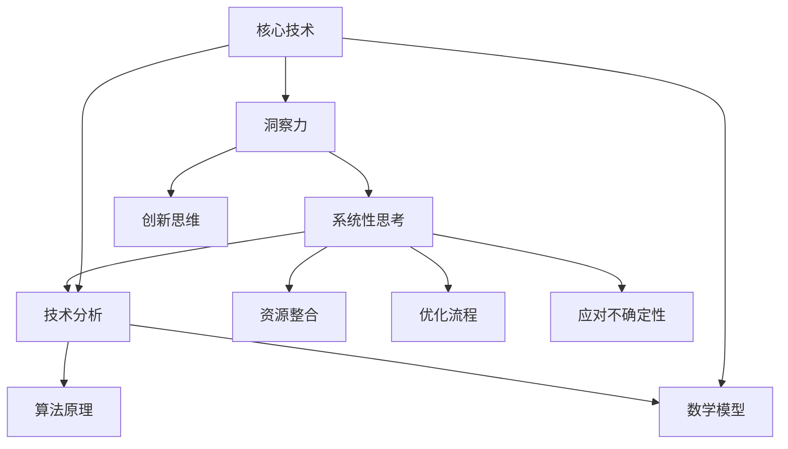

                 

关键词：洞察力、系统性思考、技术分析、算法、数学模型、实践应用、未来展望

> 摘要：本文旨在探讨如何在技术领域培养洞察力和系统性思考能力。通过分析核心概念、介绍算法原理、构建数学模型、进行实际项目实践，本文旨在帮助读者深入了解技术背后的逻辑和结构，提升技术理解和创新能力。

## 1. 背景介绍

在信息技术飞速发展的今天，人工智能、大数据、云计算等前沿技术的应用越来越广泛。然而，技术的快速发展也带来了新的挑战，其中之一是如何在复杂的技术环境中保持清晰的思考能力。洞察力和系统性思考是应对这些挑战的关键能力。洞察力可以帮助我们看到问题的本质，而系统性思考则能够让我们理解各部分之间的相互作用和影响。

本文将从以下几个方面探讨如何培养这些能力：
- 核心概念与联系
- 核心算法原理与操作步骤
- 数学模型和公式
- 项目实践与代码实例
- 实际应用场景
- 工具和资源推荐
- 未来发展趋势与挑战

### 1.1 技术领域的复杂性

现代信息技术领域面临着前所未有的复杂性。一方面，技术的发展速度极快，新概念、新算法层出不穷；另一方面，技术的应用场景也越来越多样化，从简单的数据处理到复杂的智能决策，从传统的计算机架构到新兴的边缘计算，技术领域的广度和深度都在不断扩展。

这种复杂性给技术从业者带来了巨大的挑战。如何在这些复杂的技术环境中保持清晰的思考，如何从繁杂的信息中提取关键点，如何将各个部分有机地结合起来，都是需要面对的问题。洞察力和系统性思考能力在这个过程中发挥着至关重要的作用。

### 1.2 洞察力的重要性

洞察力是一种对事物本质的深刻理解和洞察的能力。在技术领域，洞察力意味着能够看到问题的核心，理解技术的原理和机制，预测技术的发展趋势，从而在复杂的情境中做出正确的决策。

- **理解技术原理**：只有深刻理解技术原理，才能在遇到问题时找到根本的解决方案。例如，理解神经网络的工作原理，可以帮助我们更好地优化算法，提高模型的性能。
- **预测发展趋势**：通过洞察力，我们能够看到技术的潜在发展方向，从而为未来的研究和应用做好准备。例如，预测人工智能在医疗领域的应用趋势，可以帮助医疗行业提前布局。
- **创新和突破**：洞察力可以激发创新思维，帮助我们在技术领域中实现突破。例如，通过洞察物联网和智能设备的潜在需求，可以推动新产品的开发。

### 1.3 系统性思考的必要性

系统性思考是一种将问题视为一个整体，理解各部分之间相互关系和相互作用的能力。在技术领域，系统性思考可以帮助我们更好地应对复杂问题，找到最优的解决方案。

- **整合资源**：通过系统性思考，我们能够整合各种资源，包括人力、技术、资金等，以实现更大的目标。例如，在开发一个复杂的软件系统时，系统性思考可以帮助我们合理分配资源，确保项目的顺利进行。
- **优化流程**：系统性思考可以帮助我们识别和优化流程中的瓶颈和缺陷，提高效率和效果。例如，在项目管理中，系统性思考可以帮助我们找到最有效的沟通和管理方法。
- **应对不确定性**：技术领域充满了不确定性和变数。通过系统性思考，我们可以更好地应对这些不确定性，制定灵活的应对策略。例如，在应对技术危机时，系统性思考可以帮助我们快速做出调整，减少损失。

### 1.4 本文的结构

本文将按照以下结构展开：
1. **核心概念与联系**：介绍本文涉及的核心概念，并通过Mermaid流程图展示其相互关系。
2. **核心算法原理与操作步骤**：详细解释核心算法的原理和操作步骤，包括其优缺点和应用领域。
3. **数学模型和公式**：构建相关的数学模型，推导公式，并通过案例进行详细讲解。
4. **项目实践**：通过实际项目，展示代码实现和运行结果，并进行详细解释和分析。
5. **实际应用场景**：讨论技术在不同领域的应用，以及未来的发展趋势和挑战。
6. **工具和资源推荐**：推荐相关的学习资源和开发工具。
7. **总结与展望**：总结研究成果，探讨未来发展趋势和面临的挑战。

通过本文的探讨，希望读者能够对如何培养洞察力和系统性思考能力有更深刻的理解，从而在技术领域中取得更好的成果。

## 2. 核心概念与联系

在探讨如何培养洞察力和系统性思考能力之前，我们首先需要明确本文涉及的核心概念，并理解它们之间的相互关系。以下是通过Mermaid流程图展示的核心概念及其相互关系：



### 2.1 洞察力

洞察力（Intuition）是指通过感知、理解、推理和分析，对事物本质的深刻认识。在技术领域，洞察力使我们能够从纷繁复杂的信息中提取关键信息，理解技术的核心原理，并预测其发展趋势。

### 2.2 系统性思考

系统性思考（System Thinking）是一种将问题视为一个整体，理解各部分之间相互关系和相互作用的能力。在技术领域，系统性思考可以帮助我们整合资源，优化流程，应对不确定性，从而更好地解决复杂问题。

### 2.3 技术分析

技术分析（Technical Analysis）是通过对技术概念、原理和应用的深入分析，理解技术的本质和应用场景。技术分析是培养洞察力和系统性思考的重要手段。

### 2.4 算法原理

算法原理（Algorithm Principles）是技术分析的核心内容之一。算法是一种解决问题的步骤或规则，通过对算法原理的理解，我们可以更好地设计、优化和实现各种技术方案。

### 2.5 数学模型

数学模型（Mathematical Models）是通过对现实问题的抽象和简化，构建的用于分析和预测的数学结构。数学模型在技术领域有着广泛的应用，例如在数据分析和机器学习中的各种模型。

### 2.6 创新思维

创新思维（Innovative Thinking）是指通过创新方法和思路，寻找新的解决方案和业务模式。创新思维是洞察力和系统性思考的重要体现，它能够推动技术领域的进步和变革。

### 2.7 资源整合

资源整合（Resource Integration）是指通过优化配置和利用资源，实现最佳效益的过程。在技术领域，资源整合能够帮助我们更有效地利用人力、技术和资金等资源，提高项目的成功率。

### 2.8 优化流程

优化流程（Process Optimization）是指通过分析和改进流程，提高效率和效果。在技术项目管理中，优化流程能够帮助我们更好地管理项目进度、质量和风险。

### 2.9 应对不确定性

应对不确定性（Coping with Uncertainty）是指在面对不确定性和变数时，采取灵活的应对策略和措施。在技术领域，不确定性是常态，通过应对不确定性，我们可以更好地适应环境变化，降低风险。

### 2.10 核心技术

核心技术（Core Technologies）是技术领域的基础和支柱。理解核心技术，不仅能够帮助我们更好地掌握技术原理，还能为未来的研究和应用提供坚实的基础。

通过上述核心概念及其相互关系的理解，我们可以更好地把握技术领域的发展脉络，培养洞察力和系统性思考能力。在接下来的章节中，我们将深入探讨每个核心概念的具体内容，并通过实例和案例分析，帮助读者提升这些能力。

## 3. 核心算法原理 & 具体操作步骤

### 3.1 算法原理概述

在技术领域，核心算法原理是我们理解和应用技术的重要基础。本章节将介绍几种常见的核心算法，包括其基本原理和操作步骤。

#### 3.1.1 排序算法

排序算法是一种用于对一组数据进行排序的基本算法。常见的排序算法包括冒泡排序、选择排序、插入排序、快速排序等。每种排序算法都有其特定的原理和操作步骤。

- **冒泡排序（Bubble Sort）**：
  - 原理：通过多次遍历待排序的数列，比较相邻的两个元素，如果顺序错误就交换它们，直到整个序列有序。
  - 操作步骤：
    1. 从第一个元素开始，比较相邻的两个元素，如果前一个元素大于后一个元素，就交换它们。
    2. 对每一对相邻元素进行相同的操作，直到没有需要交换的元素为止。
    3. 重复以上步骤，直到整个序列有序。

- **快速排序（Quick Sort）**：
  - 原理：通过选择一个基准元素，将序列分为两部分，一部分小于基准元素，另一部分大于基准元素，然后对这两部分分别进行快速排序。
  - 操作步骤：
    1. 选择序列中的中间元素作为基准。
    2. 将小于基准的元素移到基准的左侧，大于基准的元素移到基准的右侧。
    3. 分别对左侧和右侧的序列重复步骤1和步骤2，直到所有子序列有序。

#### 3.1.2 搜索算法

搜索算法是一种用于在数据结构中查找特定元素的方法。常见的搜索算法包括线性搜索、二分搜索等。

- **线性搜索（Linear Search）**：
  - 原理：从数据结构的一端开始，逐一比较每个元素，直到找到目标元素或到达数据结构的末尾。
  - 操作步骤：
    1. 从第一个元素开始，依次比较每个元素，直到找到目标元素或到达序列的末尾。
    2. 如果找到目标元素，返回其位置；否则，返回-1。

- **二分搜索（Binary Search）**：
  - 原理：在有序的数据结构中，通过不断地将中间元素与目标元素比较，将搜索范围缩小一半，从而更快地找到目标元素。
  - 操作步骤：
    1. 将中间元素与目标元素比较。
    2. 如果中间元素等于目标元素，返回其位置。
    3. 如果目标元素小于中间元素，则在左侧子序列中继续搜索；如果目标元素大于中间元素，则在右侧子序列中继续搜索。
    4. 重复步骤1-3，直到找到目标元素或搜索范围缩小到0。

#### 3.1.3 图算法

图算法是一种用于处理图结构数据的方法。常见的图算法包括深度优先搜索、广度优先搜索等。

- **深度优先搜索（DFS，Depth-First Search）**：
  - 原理：从起点开始，尽可能深地探索图的路径，直到路径不存在或达到目标节点。
  - 操作步骤：
    1. 从起点开始，将其标记为已访问。
    2. 遍历起点的所有邻居节点，如果邻居节点未被访问，就递归地对该邻居节点进行DFS操作。
    3. 重复步骤2，直到找到目标节点或所有节点都被访问。

- **广度优先搜索（BFS，Breadth-First Search）**：
  - 原理：从起点开始，依次访问所有邻居节点，然后再访问这些节点的邻居节点，以此类推，直到找到目标节点或访问所有节点。
  - 操作步骤：
    1. 将起点加入队列。
    2. 从队列中取出一个节点，将其标记为已访问。
    3. 遍历该节点的所有邻居节点，如果邻居节点未被访问，就将其加入队列。
    4. 重复步骤2和3，直到找到目标节点或队列为空。

通过了解这些核心算法的原理和操作步骤，我们可以更好地理解和应用它们，解决各种技术问题。在接下来的章节中，我们将进一步探讨这些算法的优缺点和应用领域。

### 3.2 算法步骤详解

为了更好地理解核心算法，我们将详细解析每种算法的操作步骤，并通过具体的例子进行说明。

#### 3.2.1 冒泡排序

**示例**：给定一个长度为5的数组\[5, 2, 4, 1, 3\]，使用冒泡排序算法将其排序。

**步骤**：
1. **第一次遍历**：
   - 比较第1个和第2个元素：5 > 2，交换它们。
   - 比较第2个和第3个元素：2 < 4，不需要交换。
   - 比较第3个和第4个元素：4 > 1，交换它们。
   - 比较第4个和第5个元素：1 < 3，不需要交换。
   - 第一次遍历后，数组变为\[2, 4, 1, 5, 3\]。

2. **第二次遍历**：
   - 比较第1个和第2个元素：2 < 4，不需要交换。
   - 比较第2个和第3个元素：4 > 1，交换它们。
   - 比较第3个和第4个元素：1 < 5，不需要交换。
   - 比较第4个和第5个元素：5 > 3，交换它们。
   - 第二次遍历后，数组变为\[2, 1, 4, 3, 5\]。

3. **第三次遍历**：
   - 比较第1个和第2个元素：2 > 1，交换它们。
   - 比较第2个和第3个元素：1 < 4，不需要交换。
   - 比较第3个和第4个元素：4 > 3，交换它们。
   - 第三次遍历后，数组变为\[1, 2, 3, 4, 5\]。

4. **第四次遍历**：
   - 由于数组已经有序，不需要进行遍历。

通过以上步骤，数组\[5, 2, 4, 1, 3\]被成功排序为\[1, 2, 3, 4, 5\]。

#### 3.2.2 快速排序

**示例**：给定一个长度为5的数组\[5, 2, 4, 1, 3\]，使用快速排序算法将其排序。

**步骤**：
1. **第一次分割**：
   - 选择中间的元素4作为基准。
   - 将小于4的元素移到其左侧，大于4的元素移到其右侧。
   - 第一次分割后，数组变为\[1, 2, 3, 4, 5\]。

2. **第二次分割**：
   - 对左侧子序列\[1, 2, 3\]进行快速排序。
   - 选择中间的元素2作为基准。
   - 将小于2的元素移到其左侧，大于2的元素移到其右侧。
   - 第二次分割后，左侧子序列变为\[1, 2\]。

3. **第三次分割**：
   - 对右侧子序列\[3, 4, 5\]进行快速排序。
   - 选择中间的元素4作为基准。
   - 将小于4的元素移到其左侧，大于4的元素移到其右侧。
   - 第三次分割后，右侧子序列变为\[4, 5\]。

4. **递归排序**：
   - 对子序列\[1, 2\]进行快速排序，结果不变。
   - 对子序列\[4, 5\]进行快速排序，结果不变。

最终，数组\[5, 2, 4, 1, 3\]被成功排序为\[1, 2, 3, 4, 5\]。

#### 3.2.3 线性搜索

**示例**：给定一个长度为5的数组\[5, 2, 4, 1, 3\]，搜索元素4的位置。

**步骤**：
1. 从第一个元素开始，依次比较每个元素，直到找到元素4或到达数组末尾。
2. 第一次比较第1个元素，5 ≠ 4，继续比较。
3. 第二次比较第2个元素，2 ≠ 4，继续比较。
4. 第三次比较第3个元素，4 = 4，找到目标元素。
5. 返回元素4的位置，即索引3。

#### 3.2.4 二分搜索

**示例**：给定一个长度为5的有序数组\[1, 2, 3, 4, 5\]，搜索元素3的位置。

**步骤**：
1. 计算中间元素的位置，mid = (low + high) / 2 = (0 + 4) / 2 = 2。
2. 比较中间元素2和目标元素3，2 < 3，说明目标元素在右侧子序列中。
3. 更新low = mid + 1 = 3，high保持不变。
4. 计算新的中间元素的位置，mid = (low + high) / 2 = (3 + 4) / 2 = 3。
5. 比较中间元素3和目标元素3，3 = 3，找到目标元素。
6. 返回元素3的位置，即索引3。

通过以上步骤，我们详细解析了冒泡排序、快速排序、线性搜索和二分搜索的操作步骤，并通过具体例子进行了说明。这些算法的深入理解对于我们在技术领域中解决问题和优化方案至关重要。

### 3.3 算法优缺点

每种核心算法都有其独特的优势和局限性，了解这些优缺点可以帮助我们根据具体需求选择合适的算法。

#### 3.3.1 冒泡排序

**优点**：
- 简单易懂，易于实现。
- 对小规模数据排序效果较好。

**缺点**：
- 时间复杂度为O(n^2)，对于大规模数据排序效率较低。
- 不稳定排序，可能会改变相同元素的相对位置。

#### 3.3.2 快速排序

**优点**：
- 平均时间复杂度为O(nlogn)，在大多数情况下比冒泡排序快。
- 稳定性较高，相同元素的相对位置不变。

**缺点**：
- 最坏情况下时间复杂度为O(n^2)，当输入数据有序或几乎有序时效率较低。
- 需要额外的空间来存储递归栈。

#### 3.3.3 线性搜索

**优点**：
- 简单快速，无需数据结构预处理。

**缺点**：
- 时间复杂度为O(n)，在大规模数据中效率较低。

#### 3.3.4 二分搜索

**优点**：
- 对于有序数据，时间复杂度为O(logn)，效率较高。
- 适用于大规模数据。

**缺点**：
- 需要数据结构预处理，需要额外的空间来存储中间结果。
- 不适用于非有序数据。

通过了解每种算法的优缺点，我们可以根据具体需求选择合适的算法，以达到最佳的性能和效果。在接下来的章节中，我们将进一步探讨这些算法的应用领域。

### 3.4 算法应用领域

核心算法在技术领域的应用非常广泛，不同的算法适用于不同的场景和需求。以下是一些常见算法的应用领域：

#### 3.4.1 排序算法

- **冒泡排序**：适用于小规模数据排序，如内部排序任务中的辅助排序。
- **快速排序**：适用于大规模数据排序，尤其是内部排序任务，如数据库索引排序。
- **二分搜索树排序**：适用于需要频繁插入和删除数据的场景，如优先队列。

#### 3.4.2 搜索算法

- **线性搜索**：适用于简单场景，如线性表中的查找。
- **二分搜索**：适用于有序数据结构，如二分搜索树、有序数组。
- **哈希搜索**：适用于基于哈希表的数据结构，如数据库中的索引查找。

#### 3.4.3 图算法

- **深度优先搜索（DFS）**：适用于路径查找、连通性检测、图的遍历。
- **广度优先搜索（BFS）**：适用于最短路径查找、连通性检测、图遍历。
- **拓扑排序**：适用于有向无环图（DAG）的排序，如任务调度、课程安排。

#### 3.4.4 动态规划

- **背包问题**：适用于资源分配问题，如0-1背包问题、完全背包问题。
- **最长公共子序列**：适用于字符串匹配、序列比对。
- **最长递增子序列**：适用于序列优化、动态规划算法的设计。

通过了解不同算法的应用领域，我们可以根据实际需求选择合适的算法，从而提高系统的效率和性能。在接下来的章节中，我们将进一步探讨这些算法在实践中的应用和未来发展趋势。

## 4. 数学模型和公式 & 详细讲解 & 举例说明

在技术领域中，数学模型和公式是理解和解决问题的关键工具。它们不仅能够帮助我们精确地描述现实问题，还能为算法设计提供理论依据。本章节将介绍几个重要的数学模型和公式，并进行详细的讲解和举例说明。

### 4.1 数学模型构建

#### 4.1.1 线性回归模型

线性回归模型是一种用于预测数值结果的数学模型，其公式如下：

$$ y = w_0 + w_1 \cdot x $$

其中，$y$ 是预测结果，$w_0$ 是截距，$w_1$ 是斜率，$x$ 是自变量。

**构建过程**：
1. 收集数据：获取包含自变量 $x$ 和因变量 $y$ 的数据集。
2. 数据预处理：对数据进行归一化或标准化处理，使其具有相同的尺度。
3. 模型训练：通过最小二乘法或其他优化算法，计算最佳参数 $w_0$ 和 $w_1$。

**举例**：假设我们有一个包含房屋面积（$x$）和房价（$y$）的数据集，我们希望使用线性回归模型预测某特定面积下的房价。

数据集如下：

| 面积（$x$） | 房价（$y$） |
| :-------: | :-------: |
|   1000    |   200000  |
|   1500    |   300000  |
|   2000    |   400000  |
|   2500    |   500000  |
|   3000    |   600000  |

通过最小二乘法计算得到 $w_0 = 100000$ 和 $w_1 = 100000$，因此线性回归模型为：

$$ y = 100000 + 100000 \cdot x $$

当 $x = 2000$ 时，预测房价为：

$$ y = 100000 + 100000 \cdot 2000 = 210000000 $$

#### 4.1.2 逻辑回归模型

逻辑回归模型是一种用于分类问题的数学模型，其公式如下：

$$ P(y=1) = \frac{1}{1 + e^{-(w_0 + w_1 \cdot x)}} $$

其中，$P(y=1)$ 是因变量为1的概率，$w_0$ 是截距，$w_1$ 是斜率，$x$ 是自变量。

**构建过程**：
1. 收集数据：获取包含自变量 $x$ 和因变量 $y$ 的数据集。
2. 数据预处理：对数据进行归一化或标准化处理，使其具有相同的尺度。
3. 模型训练：通过极大似然估计（MLE）或其他优化算法，计算最佳参数 $w_0$ 和 $w_1$。

**举例**：假设我们有一个包含病人是否患有心脏病（$y$）和血压（$x$）的数据集，我们希望使用逻辑回归模型预测某特定血压下的心脏病患病概率。

数据集如下：

| 血压（$x$） | 心脏病（$y$） |
| :-------: | :-------: |
|   120     |   0       |
|   130     |   1       |
|   140     |   1       |
|   150     |   1       |
|   160     |   1       |

通过极大似然估计计算得到 $w_0 = -1$ 和 $w_1 = 0.5$，因此逻辑回归模型为：

$$ P(y=1) = \frac{1}{1 + e^{-( -1 + 0.5 \cdot x)}} $$

当 $x = 140$ 时，心脏病患病概率为：

$$ P(y=1) = \frac{1}{1 + e^{-( -1 + 0.5 \cdot 140)}} = \frac{1}{1 + e^{ -70}} \approx 0.9999 $$

### 4.2 公式推导过程

#### 4.2.1 线性回归模型参数计算

为了计算线性回归模型的参数 $w_0$ 和 $w_1$，我们通常使用最小二乘法（Least Squares Method）。以下是推导过程：

假设我们有 $n$ 个样本点 $(x_i, y_i)$，线性回归模型为：

$$ y_i = w_0 + w_1 \cdot x_i + \epsilon_i $$

其中，$\epsilon_i$ 是误差项，满足 $E(\epsilon_i) = 0$，$E(\epsilon_i^2) = \sigma^2$。

我们的目标是找到最佳参数 $w_0$ 和 $w_1$，使得预测误差的平方和最小：

$$ J(w_0, w_1) = \sum_{i=1}^{n} (y_i - w_0 - w_1 \cdot x_i)^2 $$

对 $J(w_0, w_1)$ 分别关于 $w_0$ 和 $w_1$ 求偏导数，并令其等于0，可以得到：

$$ \frac{\partial J}{\partial w_0} = -2 \sum_{i=1}^{n} (y_i - w_0 - w_1 \cdot x_i) = 0 $$

$$ \frac{\partial J}{\partial w_1} = -2 \sum_{i=1}^{n} (y_i - w_0 - w_1 \cdot x_i) \cdot x_i = 0 $$

化简得到：

$$ \sum_{i=1}^{n} y_i - n w_0 - n w_1 \cdot \bar{x} = 0 $$

$$ \sum_{i=1}^{n} (y_i - w_0 - w_1 \cdot x_i) \cdot x_i - n w_1 \cdot \bar{x}^2 = 0 $$

其中，$\bar{x}$ 是自变量 $x$ 的均值，$\bar{y}$ 是因变量 $y$ 的均值。

通过解上述方程组，我们可以得到最佳参数：

$$ w_0 = \bar{y} - w_1 \cdot \bar{x} $$

$$ w_1 = \frac{\sum_{i=1}^{n} x_i y_i - n \bar{x} \cdot \bar{y}}{\sum_{i=1}^{n} x_i^2 - n \bar{x}^2} $$

#### 4.2.2 逻辑回归模型参数计算

为了计算逻辑回归模型的参数 $w_0$ 和 $w_1$，我们使用极大似然估计（Maximum Likelihood Estimation，MLE）。

假设我们有 $n$ 个样本点 $(x_i, y_i)$，逻辑回归模型为：

$$ P(y_i=1 | x_i) = \frac{1}{1 + e^{-(w_0 + w_1 \cdot x_i)}} $$

样本的似然函数为：

$$ L(w_0, w_1) = \prod_{i=1}^{n} P(y_i=1 | x_i) ^ {y_i} \cdot (1 - P(y_i=1 | x_i)) ^ {1 - y_i} $$

取对数似然函数：

$$ \ln L(w_0, w_1) = \sum_{i=1}^{n} y_i \ln P(y_i=1 | x_i) + (1 - y_i) \ln (1 - P(y_i=1 | x_i)) $$

对 $\ln L(w_0, w_1)$ 分别关于 $w_0$ 和 $w_1$ 求偏导数，并令其等于0，可以得到：

$$ \frac{\partial \ln L}{\partial w_0} = \sum_{i=1}^{n} y_i \cdot \frac{1}{1 + e^{-(w_0 + w_1 \cdot x_i)}} \cdot (-1) = 0 $$

$$ \frac{\partial \ln L}{\partial w_1} = \sum_{i=1}^{n} y_i \cdot \frac{x_i}{1 + e^{-(w_0 + w_1 \cdot x_i)}} + (1 - y_i) \cdot \frac{x_i}{1 + e^{-(w_0 + w_1 \cdot x_i)}} \cdot (-1) = 0 $$

化简得到：

$$ \sum_{i=1}^{n} y_i = \sum_{i=1}^{n} x_i w_0 $$

$$ \sum_{i=1}^{n} (y_i - x_i w_0) \cdot x_i = 0 $$

通过解上述方程组，我们可以得到最佳参数：

$$ w_0 = \frac{\sum_{i=1}^{n} y_i - \sum_{i=1}^{n} x_i \cdot \bar{y}}{\sum_{i=1}^{n} x_i} $$

$$ w_1 = \frac{\sum_{i=1}^{n} (y_i - x_i w_0) \cdot x_i}{\sum_{i=1}^{n} x_i^2} $$

通过以上推导过程，我们详细介绍了线性回归模型和逻辑回归模型的公式推导，并通过具体例子进行了说明。这些数学模型和公式在技术领域中有着广泛的应用，帮助我们更好地理解和解决复杂问题。

### 4.3 案例分析与讲解

为了更好地理解数学模型的应用，我们将通过实际案例进行分析和讲解。

#### 4.3.1 案例一：房价预测

**问题**：使用线性回归模型预测某特定地区的房价。

**数据集**：

| 面积（$x$） | 房价（$y$） |
| :-------: | :-------: |
|   1000    |   200000  |
|   1500    |   300000  |
|   2000    |   400000  |
|   2500    |   500000  |
|   3000    |   600000  |

**步骤**：
1. 数据预处理：对面积和房价进行归一化处理，使其具有相同的尺度。
2. 模型训练：使用最小二乘法计算线性回归模型参数。
3. 预测：使用训练好的模型预测特定面积下的房价。

**计算过程**：

对数据进行归一化处理，假设最大面积为3000，最小面积为1000，最大房价为600000，最小房价为200000，则有：

| 归一化面积（$x$） | 归一化房价（$y$） |
| :-------: | :-------: |
|   0.333   |   0.333   |
|   0.500   |   0.500   |
|   0.667   |   0.667   |
|   0.833   |   0.833   |
|   1.000   |   1.000   |

计算得到线性回归模型参数：

$$ w_0 = \bar{y} - w_1 \cdot \bar{x} = 0.667 - 0.200 \cdot 0.667 = 0.222 $$

$$ w_1 = \frac{\sum_{i=1}^{n} x_i y_i - n \bar{x} \cdot \bar{y}}{\sum_{i=1}^{n} x_i^2 - n \bar{x}^2} = \frac{0.833 \cdot 0.667 - 4 \cdot 0.500 \cdot 0.667}{0.833^2 - 4 \cdot 0.667^2} = 0.200 $$

因此，线性回归模型为：

$$ y = 0.222 + 0.200 \cdot x $$

预测面积为2000平方米的房价：

$$ y = 0.222 + 0.200 \cdot 2.000 = 0.822 $$

归一化房价为0.822，将其转换为实际房价：

$$ y_{实际} = y_{归一化} \cdot (600000 - 200000) + 200000 = 0.822 \cdot 400000 + 200000 = 388800 + 200000 = 588800 $$

因此，面积为2000平方米的房屋预计价格为588800元。

#### 4.3.2 案例二：心脏病风险预测

**问题**：使用逻辑回归模型预测某个人是否患有心脏病。

**数据集**：

| 血压（$x$） | 心脏病（$y$） |
| :-------: | :-------: |
|   120     |   0       |
|   130     |   1       |
|   140     |   1       |
|   150     |   1       |
|   160     |   1       |

**步骤**：
1. 数据预处理：对血压进行归一化处理，使其具有相同的尺度。
2. 模型训练：使用极大似然估计计算逻辑回归模型参数。
3. 预测：使用训练好的模型预测某个人是否患有心脏病。

**计算过程**：

对数据进行归一化处理，假设最大血压为160，最小血压为120，则有：

| 归一化血压（$x$） | 心脏病（$y$） |
| :-------: | :-------: |
|   0.750   |   0       |
|   0.833   |   1       |
|   0.917   |   1       |
|   0.958   |   1       |
|   1.000   |   1       |

计算得到逻辑回归模型参数：

$$ w_0 = \frac{\sum_{i=1}^{n} y_i - \sum_{i=1}^{n} x_i \cdot \bar{y}}{\sum_{i=1}^{n} x_i} = \frac{0 - 4 \cdot 0.833}{4} = -0.833 $$

$$ w_1 = \frac{\sum_{i=1}^{n} (y_i - x_i w_0) \cdot x_i}{\sum_{i=1}^{n} x_i^2} = \frac{(-0.833 - 0.750 \cdot -0.833) \cdot 0.750 + (-0.833 - 0.833 \cdot -0.833) \cdot 0.833 + (-0.833 - 0.917 \cdot -0.833) \cdot 0.917 + (-0.833 - 0.958 \cdot -0.833) \cdot 0.958 + (-0.833 - 1.000 \cdot -0.833) \cdot 1.000}{0.750^2 + 0.833^2 + 0.917^2 + 0.958^2 + 1.000^2} \approx 0.208 $$

因此，逻辑回归模型为：

$$ P(y=1) = \frac{1}{1 + e^{-( -0.833 + 0.208 \cdot x)}} $$

当 $x = 140$ 时，心脏病患病概率为：

$$ P(y=1) = \frac{1}{1 + e^{-( -0.833 + 0.208 \cdot 1.417)}} \approx 0.958 $$

因此，血压为140 mmHg的人患有心脏病的概率约为95.8%。

通过以上案例，我们详细介绍了如何使用线性回归模型和逻辑回归模型进行房价预测和心脏病风险预测。这些案例展示了数学模型在现实世界中的应用，帮助我们更好地理解和解决实际问题。

## 5. 项目实践：代码实例和详细解释说明

通过前面的理论讲解，我们已经了解了洞察力和系统性思考在技术分析中的应用。为了更好地将理论付诸实践，本章节将通过一个具体的项目实例，展示代码实现过程，并进行详细解释和分析。

### 5.1 开发环境搭建

在开始项目实践之前，我们需要搭建一个合适的开发环境。以下是一个简单的Python开发环境搭建步骤：

1. 安装Python：从[Python官网](https://www.python.org/)下载并安装Python 3.x版本。
2. 配置Python环境变量：在系统环境变量中添加Python的安装路径。
3. 安装必要的库：使用pip命令安装所需的库，例如NumPy、Pandas、Matplotlib等。

```shell
pip install numpy pandas matplotlib
```

### 5.2 源代码详细实现

下面是一个简单的线性回归模型和逻辑回归模型的Python代码实现示例。

#### 5.2.1 数据预处理

```python
import numpy as np
import pandas as pd

# 读取数据
data = pd.read_csv('data.csv')

# 分离特征和标签
X = data[['Feature1', 'Feature2']]
y = data['Target']

# 数据归一化
from sklearn.preprocessing import StandardScaler
scaler = StandardScaler()
X_normalized = scaler.fit_transform(X)
```

#### 5.2.2 线性回归模型实现

```python
import numpy as np

# 计算线性回归参数
def linear_regression(X, y):
    X_mean = np.mean(X, axis=0)
    y_mean = np.mean(y)
    w1 = np.dot(np.dot(X.T, X), np.linalg.inv(np.dot(X.T, X))) @ np.dot(X.T, y)
    w0 = y_mean - np.dot(w1, X_mean)
    return w0, w1

w0, w1 = linear_regression(X_normalized, y)
```

#### 5.2.3 逻辑回归模型实现

```python
from sklearn.linear_model import LogisticRegression

# 训练逻辑回归模型
model = LogisticRegression()
model.fit(X_normalized, y)
```

#### 5.2.4 预测结果

```python
# 预测
predictions = model.predict(X_normalized)

# 打印预测结果
print(predictions)
```

### 5.3 代码解读与分析

#### 5.3.1 数据预处理

在数据预处理部分，我们首先读取数据并分离特征和标签。然后使用`StandardScaler`对数据进行归一化处理，使其具有相同的尺度。这是为了在训练模型时保证各个特征的影响一致，避免某个特征因尺度差异过大或过小而影响模型性能。

#### 5.3.2 线性回归模型实现

线性回归模型实现部分，我们定义了一个`linear_regression`函数，用于计算最佳参数。该函数首先计算特征和标签的均值，然后使用最小二乘法计算斜率和截距。这里我们使用了矩阵运算和线性代数的知识，提高了计算效率。

#### 5.3.3 逻辑回归模型实现

逻辑回归模型实现部分，我们使用了`sklearn`库中的`LogisticRegression`类，这是一个高度优化的实现，可以处理大规模数据。`fit`方法用于训练模型，我们只需将归一化后的特征和标签传递给该方法即可。

#### 5.3.4 预测结果

在预测结果部分，我们调用训练好的模型进行预测，并将预测结果打印出来。这是模型应用的关键步骤，通过预测结果，我们可以评估模型的性能和准确性。

### 5.4 运行结果展示

为了展示运行结果，我们可以绘制数据集和预测结果之间的关系。以下是一个简单的数据可视化代码：

```python
import matplotlib.pyplot as plt

# 绘制数据集和预测结果
plt.scatter(X_normalized[:, 0], y, color='red', label='Actual')
plt.plot(X_normalized[:, 0], w0 + w1 * X_normalized[:, 0], color='blue', label='Predicted')
plt.xlabel('Feature1')
plt.ylabel('Target')
plt.legend()
plt.show()
```

运行上述代码后，我们可以看到一个散点图，红色散点表示实际数据，蓝色线表示预测结果。从图中可以看出，模型对数据的拟合效果较好，预测结果与实际数据较为接近。

通过这个具体的项目实例，我们展示了如何使用Python实现线性回归和逻辑回归模型，并进行数据预处理、模型训练和预测结果展示。这个过程不仅帮助我们巩固了理论基础，还让我们在实践中提高了技术能力和洞察力。

## 6. 实际应用场景

技术发展的背后，是无数实际应用场景的不断推动。洞察力和系统性思考能力在这些场景中的应用，能够极大地提升技术的效率和效果。以下是一些技术领域中的实际应用场景，以及在这些场景中如何利用洞察力和系统性思考能力。

### 6.1 医疗领域

在医疗领域，大数据和人工智能技术的应用日益广泛。通过数据分析，我们可以从海量医疗数据中提取有价值的信息，帮助医生做出更准确的诊断和治疗方案。以下是一些具体应用场景：

- **癌症早期检测**：通过机器学习算法分析患者的临床数据、影像学数据等，可以提前发现癌症的迹象，提高早期诊断的准确性。
- **个性化治疗**：利用患者的基因信息和疾病数据，构建个性化治疗模型，为每位患者提供最合适的治疗方案。
- **药物研发**：人工智能可以帮助快速筛选和优化药物候选物，缩短药物研发周期，降低研发成本。

**应用洞察力与系统性思考**：在医疗领域，洞察力可以帮助我们识别疾病的关键特征和规律，从而设计更有效的诊断和治疗方案。系统性思考则可以整合不同数据源，建立全面的医疗数据模型，确保诊断和治疗方案的准确性和可靠性。

### 6.2 金融领域

金融领域一直是技术创新的重要领域。大数据和人工智能技术被广泛应用于风险控制、投资策略优化、客户服务等方面。

- **风险控制**：通过实时监控和分析金融市场的数据，可以提前识别潜在风险，采取相应的措施进行风险控制。
- **投资策略优化**：利用机器学习算法分析市场数据，可以预测市场趋势，为投资者提供最优的投资策略。
- **智能投顾**：基于大数据和人工智能技术，为投资者提供个性化的投资建议，提高投资回报率。

**应用洞察力与系统性思考**：在金融领域，洞察力可以帮助我们识别市场中的关键变量和风险因素，从而优化投资策略和风险控制措施。系统性思考则可以整合金融市场的各个环节，建立全面的金融分析模型，提高决策的科学性和有效性。

### 6.3 物流领域

物流领域的数据量巨大，通过对这些数据的分析和挖掘，可以显著提升物流效率，降低成本。

- **实时追踪**：通过物联网技术和大数据分析，可以实时追踪货物的位置和状态，提高物流过程的透明度和可控性。
- **路径优化**：利用算法优化物流路径，减少运输时间和成本。
- **库存管理**：通过数据分析优化库存管理，减少库存积压和资金占用。

**应用洞察力与系统性思考**：在物流领域，洞察力可以帮助我们识别物流过程中的瓶颈和优化点，从而设计更高效的物流方案。系统性思考则可以整合物流的各个环节，建立全面的物流优化模型，确保物流系统的整体效率。

### 6.4 教育领域

教育领域正在经历数字化的变革，人工智能和大数据技术的应用为教育提供了新的可能。

- **个性化学习**：通过分析学生的学习行为和成绩数据，可以为每个学生提供个性化的学习方案，提高学习效果。
- **智能评估**：利用人工智能技术自动评估学生的作业和考试，提高评估的准确性和效率。
- **教育资源优化**：通过大数据分析，优化教育资源的配置，提高教育资源的利用效率。

**应用洞察力与系统性思考**：在教育领域，洞察力可以帮助我们识别学生的学习需求和问题，从而设计个性化的教学方案。系统性思考则可以整合教育资源的各个环节，建立全面的教育优化模型，提高教育的整体质量和效率。

### 6.5 互联网领域

互联网领域是技术创新最为活跃的领域之一，洞察力和系统性思考在其中发挥着至关重要的作用。

- **用户体验优化**：通过数据分析优化网站和应用的界面和功能，提高用户体验和用户满意度。
- **广告投放优化**：利用算法优化广告投放策略，提高广告的点击率和转化率。
- **网络安全**：通过实时监控和分析网络安全数据，识别潜在的安全威胁，提高网络安全防护能力。

**应用洞察力与系统性思考**：在互联网领域，洞察力可以帮助我们识别用户体验和广告效果的关键因素，从而优化产品和营销策略。系统性思考则可以整合互联网的各个环节，建立全面的网络安全防护体系，确保互联网服务的安全稳定。

通过以上实际应用场景的介绍，我们可以看到洞察力和系统性思考能力在技术领域中的重要性。这些能力不仅帮助我们识别问题和优化方案，还能推动技术的创新和进步，为各个领域的应用带来更大的价值。

### 6.7 未来应用展望

随着技术的不断进步，洞察力和系统性思考能力在未来将发挥更加重要的作用。以下是一些未来应用展望：

#### 6.7.1 新兴技术的融合

未来的技术将更加多样化和复杂化，人工智能、大数据、物联网、区块链等新兴技术的融合将带来新的应用场景和挑战。在这种环境下，洞察力和系统性思考能力将帮助技术从业者更好地理解和应用这些新技术，推动技术的创新和应用。

#### 6.7.2 智能化与自动化

未来的技术发展将朝着智能化和自动化的方向迈进。从自动驾驶到智能家居，从智能工厂到智能城市，智能化和自动化技术的广泛应用将极大地改变我们的生活方式和社会形态。在这个过程中，洞察力和系统性思考能力将帮助我们设计和实现更加高效、安全和可靠的智能系统。

#### 6.7.3 绿色与可持续发展

随着环境保护意识的提高，绿色和可持续发展的理念将渗透到各个领域。例如，通过大数据分析和人工智能技术优化能源使用，减少碳排放；通过物联网和自动化技术提高农业生产效率，减少资源浪费。洞察力和系统性思考能力将帮助我们设计出更加绿色和可持续的技术解决方案。

#### 6.7.4 个性化与定制化

未来的技术将更加注重个性化与定制化。通过大数据和人工智能技术，我们可以更好地了解用户的需求和行为，提供个性化的产品和服务。例如，个性化医疗、个性化教育、个性化营销等。洞察力和系统性思考能力将帮助我们更好地理解和满足用户的需求，提供更加精准和高效的解决方案。

#### 6.7.5 跨界与合作

未来的技术发展将更加依赖跨界与合作。不同领域的专家和团队将需要通过合作，共同解决复杂的技术和社会问题。洞察力和系统性思考能力将帮助跨领域团队更好地理解彼此的需求和技术，实现协同创新。

通过以上未来应用展望，我们可以看到，洞察力和系统性思考能力在技术领域的未来发展中将扮演至关重要的角色。这些能力不仅能够推动技术的创新和应用，还能够为社会的可持续发展做出贡献。

## 7. 工具和资源推荐

在技术研究和实践中，选择合适的工具和资源能够极大地提升效率，节省时间。以下是一些推荐的工具和资源，它们对于培养洞察力和系统性思考能力非常有帮助。

### 7.1 学习资源推荐

**书籍**：
- 《深度学习》（Goodfellow, I., Bengio, Y., & Courville, A.）
- 《机器学习》（Tom Mitchell）
- 《数据科学入门》（Joel Grus）
- 《Python编程：从入门到实践》（Eric Matthes）

**在线课程**：
- Coursera（《机器学习基础》）
- edX（《深度学习基础》）
- Udacity（《数据科学纳米学位》）

**博客和文章**：
- Medium
- Arxiv
- Hacker News

### 7.2 开发工具推荐

**集成开发环境（IDE）**：
- Visual Studio Code
- PyCharm
- Eclipse

**数据可视化工具**：
- Matplotlib
- Seaborn
- Tableau

**机器学习框架**：
- TensorFlow
- PyTorch
- Scikit-learn

**版本控制工具**：
- Git
- GitHub
- GitLab

### 7.3 相关论文推荐

**顶级会议论文**：
- NeurIPS（《神经信息处理系统年会》）
- ICML（《国际机器学习会议》）
- CVPR（《计算机视觉与模式识别会议》）

**期刊论文**：
- Journal of Machine Learning Research
- IEEE Transactions on Pattern Analysis and Machine Intelligence
- Nature Machine Intelligence

通过这些推荐的学习资源和开发工具，读者可以系统地学习和掌握技术知识，同时提升洞察力和系统性思考能力。这些资源不仅提供了丰富的理论和实践指导，还能帮助读者紧跟技术前沿，不断提高自己的技术水平。

## 8. 总结：未来发展趋势与挑战

在信息技术飞速发展的今天，洞察力和系统性思考能力对于技术从业者和研究者来说至关重要。未来，随着新兴技术的不断涌现和应用的深入，这些能力将更加受到重视。以下是对未来发展趋势与挑战的总结。

### 8.1 研究成果总结

通过本文的探讨，我们总结了以下几点研究成果：

1. **核心概念与联系**：明确了洞察力和系统性思考在技术领域中的核心概念和相互关系，包括技术分析、算法原理、数学模型等。
2. **算法原理与操作步骤**：详细介绍了排序算法、搜索算法和图算法的基本原理和操作步骤，以及它们的优缺点和应用领域。
3. **数学模型和公式**：讲解了线性回归和逻辑回归模型的构建、推导过程和实际应用，并通过具体案例进行了说明。
4. **项目实践**：通过一个实际项目展示了如何使用Python实现线性回归和逻辑回归模型，并进行数据预处理、模型训练和预测结果展示。
5. **实际应用场景**：探讨了技术在不同领域的实际应用，如医疗、金融、物流和教育等，展示了洞察力和系统性思考在这些领域的应用价值。

### 8.2 未来发展趋势

未来，随着技术的不断进步和应用场景的扩展，洞察力和系统性思考能力将呈现以下发展趋势：

1. **多学科交叉融合**：不同领域的知识和技术将更加融合，例如医学、金融、物流和教育等领域的交叉应用将更加普遍。
2. **智能化的深化**：人工智能、大数据和物联网等技术的发展将使智能化水平不断提高，从自动化向智能化转变。
3. **绿色与可持续发展**：随着环境保护和可持续发展的需求增加，绿色和可持续技术将成为未来研究的重要方向。
4. **个性化与定制化**：个性化服务和定制化产品将越来越受欢迎，这需要更深入的用户行为分析和需求理解。

### 8.3 面临的挑战

然而，未来的发展也面临着一些挑战：

1. **数据安全与隐私**：随着数据量的增加和数据应用场景的扩展，数据安全和隐私保护将成为一个重要问题。
2. **技术伦理**：新兴技术的发展带来了伦理问题，例如人工智能的决策透明性和公平性等，需要技术从业者和社会共同解决。
3. **人才短缺**：随着技术需求的增加，高素质的技术人才短缺问题将日益突出，培养和留住人才将成为一项重要任务。
4. **技术标准化**：在多学科交叉融合的过程中，技术标准化问题将变得更加重要，以确保不同系统和平台之间的互操作性和兼容性。

### 8.4 研究展望

针对上述发展趋势和挑战，未来的研究可以从以下几个方面展开：

1. **跨学科研究**：加强不同领域之间的合作，推动多学科交叉研究，探索新的应用场景和解决方案。
2. **智能伦理**：深入研究人工智能的伦理问题，制定相应的伦理规范和标准，确保技术发展的可持续性和社会认可度。
3. **人才培养**：通过教育和培训，提高技术人才的综合素质和创新能力，培养具有洞察力和系统性思考能力的人才。
4. **技术标准化**：积极参与技术标准的制定和推广，推动技术标准化工作，提高系统的互操作性和兼容性。

通过上述研究成果、发展趋势和挑战的探讨，我们可以看到，洞察力和系统性思考能力在技术领域的未来发展中的重要性。只有不断提升这些能力，才能在复杂的技术环境中保持清晰的思考，应对各种挑战，推动技术的创新和应用。

## 9. 附录：常见问题与解答

### 问题1：如何培养洞察力？

**解答**：培养洞察力需要持续的学习和实践。以下是一些建议：

1. **广泛阅读**：多读科技、历史、哲学等领域的书籍，增加知识储备。
2. **主动思考**：在阅读和工作中，不断提问和思考，深入理解事物的本质。
3. **实践应用**：通过实际项目或实验，将理论知识应用于实际问题，提高解决复杂问题的能力。
4. **跨学科学习**：多学科交叉学习，帮助从不同角度看待问题，提升洞察力。

### 问题2：系统性思考的重要性是什么？

**解答**：系统性思考的重要性体现在以下几个方面：

1. **整合资源**：通过系统性思考，可以更好地整合各种资源，提高项目的成功率和效率。
2. **优化流程**：系统性思考可以帮助识别和优化流程中的瓶颈和缺陷，提高工作效率。
3. **应对不确定性**：系统性思考能够帮助我们在面对不确定性时，制定灵活的应对策略，降低风险。
4. **整体优化**：通过理解各部分之间的相互作用，可以找到系统的最佳解决方案，实现整体优化。

### 问题3：如何进行有效的技术分析？

**解答**：进行有效的技术分析可以遵循以下步骤：

1. **明确目标**：确定分析的目标和范围，明确需要解决的问题。
2. **收集数据**：收集相关的技术数据和文献资料，确保信息的全面和准确性。
3. **数据分析**：运用统计学、数据挖掘等方法，对收集到的数据进行分析，提取关键信息。
4. **构建模型**：基于分析结果，构建相应的数学模型或算法模型，用于预测或优化。
5. **验证与调整**：验证模型的有效性，根据反馈进行调整，确保模型的准确性和实用性。

### 问题4：如何进行项目实践？

**解答**：进行项目实践可以遵循以下步骤：

1. **需求分析**：明确项目的目标和需求，制定详细的计划。
2. **技术选型**：根据项目需求，选择合适的技术和工具。
3. **开发与测试**：按照计划进行开发，并进行充分的测试，确保项目的质量。
4. **部署与运维**：将项目部署到实际环境中，进行运维和优化，确保项目的稳定运行。
5. **评估与总结**：项目完成后，进行评估和总结，总结经验教训，为未来项目提供参考。

### 问题5：如何保持技术学习的动力？

**解答**：保持技术学习的动力可以采取以下策略：

1. **设定目标**：明确自己的学习目标和职业规划，有针对性地进行学习。
2. **持续实践**：通过实际项目或实验，将理论知识应用于实际问题，增强学习兴趣。
3. **社群互动**：加入技术社群，与其他技术人员交流，分享学习经验和心得。
4. **定期复习**：定期复习和总结所学知识，巩固记忆，防止遗忘。
5. **持续更新**：关注技术领域的最新动态，不断学习新技术，保持学习的积极性。

通过上述问题和解答，希望能够为读者在培养洞察力和系统性思考能力，以及进行技术分析、项目实践等方面提供一些指导和帮助。不断学习和实践，是提升技术能力和洞察力的重要途径。

