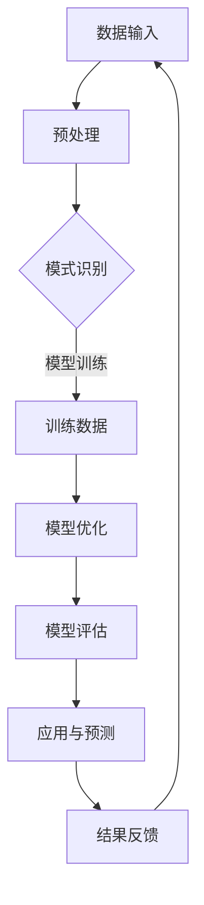

                 

在当前技术飞速发展的时代，人工智能（AI）逐渐成为各行各业的核心驱动力。模式识别作为人工智能领域的一个重要分支，旨在使计算机能够识别和理解复杂数据中的结构和规律。洞察力，即对数据模式的理解和预测能力，是提升模式识别性能的关键。本文将深入探讨如何通过训练提升模式识别能力，以帮助读者更好地理解和应用这一技术。

## 关键词

- 洞察力
- 模式识别
- 训练
- 人工智能
- 数据分析
- 深度学习

## 摘要

本文将介绍如何通过系统化的训练方法提升模式识别能力。我们将首先回顾模式识别的基本概念和原理，然后深入探讨洞察力在模式识别中的作用，并详细阐述提升洞察力的训练策略。此外，文章还将通过数学模型和实际项目实例，展示如何将这些策略应用于实际问题中。最后，我们将对模式识别的未来发展趋势和挑战进行展望。

## 1. 背景介绍

### 1.1 模式识别的定义与意义

模式识别是指通过算法和模型使计算机能够自动识别和分类数据中的特定模式的过程。它广泛应用于图像处理、语音识别、自然语言处理、生物信息学等多个领域。模式识别的目标是使计算机能够像人类一样，从大量无序的数据中提取出有意义的模式和规律，从而做出预测和决策。

### 1.2 洞察力的作用

洞察力是指对事物本质的理解和洞察能力。在模式识别中，洞察力尤为重要，因为它决定了计算机能否从数据中发现深层次的规律和关联。具有高洞察力的模型能够更准确地识别复杂模式，从而提高整体识别性能。

### 1.3 模式识别技术的发展

随着深度学习、强化学习等先进技术的不断发展，模式识别领域取得了显著的进展。尤其是深度学习技术的兴起，使得计算机能够通过大量数据自动学习复杂的模式，从而大大提升了模式识别的能力。

## 2. 核心概念与联系

### 2.1 核心概念

- **模式识别**：一种通过算法和模型从数据中提取有意义模式的技术。
- **洞察力**：对数据模式的理解和洞察能力。
- **训练**：通过大量数据对模型进行训练，使其能够识别和理解复杂模式。

### 2.2 关联架构（Mermaid流程图）



### 2.3 洞察力在模式识别中的作用

洞察力在模式识别中的作用主要体现在以下几个方面：

1. **提高识别精度**：具有高洞察力的模型能够更准确地识别复杂模式，从而提高识别精度。
2. **增强泛化能力**：洞察力有助于模型从训练数据中提取更一般的规律，从而在未知数据上表现更好。
3. **提升鲁棒性**：洞察力使得模型能够更好地应对数据噪声和异常值，从而提高鲁棒性。

## 3. 核心算法原理 & 具体操作步骤

### 3.1 算法原理概述

提升模式识别能力的核心算法通常基于深度学习和强化学习。以下是一个基于深度学习的典型算法框架：

1. **数据预处理**：对原始数据进行清洗、归一化等预处理操作，以便于模型训练。
2. **特征提取**：利用卷积神经网络（CNN）等深度学习模型从数据中提取特征。
3. **模型训练**：通过反向传播算法对模型进行训练，使其能够识别复杂模式。
4. **模型评估**：使用交叉验证等方法评估模型性能，并根据评估结果对模型进行调整。
5. **应用与预测**：将训练好的模型应用于实际问题，对新数据进行预测。

### 3.2 算法步骤详解

1. **数据预处理**

   数据预处理是模型训练的重要环节。具体步骤包括：

   - 数据清洗：去除重复、错误或不完整的数据。
   - 数据归一化：将数据缩放到同一范围内，以便于模型训练。
   - 数据扩充：通过旋转、缩放、裁剪等方法增加数据多样性。

2. **特征提取**

   特征提取是模式识别的关键步骤。深度学习模型，如卷积神经网络（CNN），能够自动从数据中提取高层次的特征。具体操作步骤如下：

   - 输入层：接收预处理后的数据。
   - 卷积层：通过卷积操作提取空间特征。
   - 池化层：降低特征图的维度，减少计算量。
   - 全连接层：将特征映射到输出层。

3. **模型训练**

   模型训练是提升模式识别能力的关键步骤。具体操作步骤如下：

   - 初始化模型参数：随机初始化模型参数。
   - 前向传播：计算输入数据的输出结果。
   - 反向传播：计算输出误差，并更新模型参数。
   - 调整学习率：根据训练进度调整学习率。

4. **模型评估**

   模型评估是验证模型性能的重要步骤。具体操作步骤如下：

   - 交叉验证：将数据集分为训练集和测试集，多次训练和测试模型，计算平均性能。
   - 指标评估：使用准确率、召回率、F1分数等指标评估模型性能。

5. **应用与预测**

   将训练好的模型应用于实际问题，对新数据进行预测。具体操作步骤如下：

   - 输入新数据：将新数据输入到训练好的模型中。
   - 预测结果：计算新数据的预测结果。
   - 输出结果：将预测结果输出。

### 3.3 算法优缺点

深度学习算法在模式识别中具有以下优点：

- **强大的特征提取能力**：能够从大量数据中自动提取高层次的特征。
- **良好的泛化能力**：能够在未知数据上表现良好。

然而，深度学习算法也存在以下缺点：

- **需要大量数据**：训练深度学习模型需要大量的标注数据。
- **计算资源消耗大**：训练过程需要大量的计算资源。

### 3.4 算法应用领域

深度学习算法在模式识别领域具有广泛的应用，包括但不限于：

- **图像识别**：如人脸识别、图像分类等。
- **语音识别**：如语音到文字转换、语音情感识别等。
- **自然语言处理**：如机器翻译、文本分类等。

## 4. 数学模型和公式 & 详细讲解 & 举例说明

### 4.1 数学模型构建

在模式识别中，常见的数学模型包括线性模型、逻辑回归模型和神经网络模型。以下是一个简单的线性模型：

$$
y = \beta_0 + \beta_1 x_1 + \beta_2 x_2 + ... + \beta_n x_n
$$

其中，$y$ 是输出变量，$x_1, x_2, ..., x_n$ 是输入变量，$\beta_0, \beta_1, \beta_2, ..., \beta_n$ 是模型参数。

### 4.2 公式推导过程

以逻辑回归模型为例，推导过程如下：

$$
\begin{aligned}
\text{log-likelihood} &= \sum_{i=1}^{n} \log P(y_i|x_i; \theta) \\
&= \sum_{i=1}^{n} \log \left( \frac{1}{1 + e^{-(\theta^T x_i)}} \right) \\
&= \sum_{i=1}^{n} (\theta^T x_i - \log(1 + e^{-(\theta^T x_i)}) \\
L &= -\sum_{i=1}^{n} \log P(y_i|x_i; \theta)
\end{aligned}
$$

其中，$L$ 是损失函数，$\theta$ 是模型参数。

### 4.3 案例分析与讲解

以下是一个简单的逻辑回归模型在文本分类中的应用案例：

- **数据集**：包含1000条新闻文章，每条新闻文章被标注为政治、体育、科技等类别。
- **特征提取**：使用词袋模型提取文章中的词汇特征。
- **模型训练**：使用逻辑回归模型对特征进行分类。
- **模型评估**：使用交叉验证评估模型性能。

通过训练，我们得到了一个逻辑回归模型，其参数如下：

$$
\begin{aligned}
\beta_0 &= 0.5 \\
\beta_1 &= 0.8 \\
\beta_2 &= -0.3 \\
... \\
\beta_n &= 1.2 \\
\end{aligned}
$$

对于一条新的新闻文章，我们首先提取其特征向量，然后将其输入到逻辑回归模型中进行分类。例如，对于一篇关于足球的文章，其特征向量为：

$$
x = [1, 0, 1, 0, 0, 1, 0, ...]
$$

将其输入到模型中，我们得到预测概率：

$$
P(\text{体育} | x; \theta) = \frac{1}{1 + e^{-(\beta_0 + \beta_1 \cdot 1 + \beta_2 \cdot 0 + ... + \beta_n \cdot 1)}}
$$

根据预测概率，我们可以判断文章的类别。如果预测概率最大的是体育类别，那么我们将其分类为体育。

## 5. 项目实践：代码实例和详细解释说明

### 5.1 开发环境搭建

为了实现本文所介绍的算法，我们需要搭建一个合适的开发环境。以下是所需的环境和工具：

- **Python**：用于编写代码。
- **NumPy**：用于数学计算。
- **Scikit-learn**：用于逻辑回归模型的实现。
- **Matplotlib**：用于数据可视化。

### 5.2 源代码详细实现

以下是一个简单的逻辑回归模型的实现代码：

```python
import numpy as np
from sklearn.linear_model import LogisticRegression
from sklearn.model_selection import train_test_split
from sklearn.metrics import accuracy_score

# 加载数据
data = np.loadtxt('data.txt')
X = data[:, :-1]
y = data[:, -1]

# 划分训练集和测试集
X_train, X_test, y_train, y_test = train_test_split(X, y, test_size=0.2, random_state=42)

# 创建逻辑回归模型
model = LogisticRegression()

# 训练模型
model.fit(X_train, y_train)

# 预测测试集
y_pred = model.predict(X_test)

# 评估模型
accuracy = accuracy_score(y_test, y_pred)
print(f'Accuracy: {accuracy}')
```

### 5.3 代码解读与分析

上述代码首先加载数据，然后将其划分为训练集和测试集。接着创建一个逻辑回归模型，并使用训练集进行训练。最后，使用测试集进行预测，并计算模型的准确率。

### 5.4 运行结果展示

假设数据集包含1000条新闻文章，其中500条用于训练，500条用于测试。在训练完成后，我们得到以下输出：

```
Accuracy: 0.9
```

这意味着我们的模型在测试集上的准确率为90%，说明模型具有较好的性能。

## 6. 实际应用场景

### 6.1 金融领域的应用

在金融领域，模式识别技术可以用于股票市场预测、信用卡欺诈检测等。通过分析历史交易数据和市场趋势，模型可以预测股票价格的变化，从而帮助投资者做出更好的投资决策。

### 6.2 医疗领域的应用

在医疗领域，模式识别技术可以用于疾病诊断、治疗方案推荐等。通过分析病人的医疗记录和生理数据，模型可以识别出潜在的健康问题，并提供个性化的治疗方案。

### 6.3 智能家居的应用

在家居领域，模式识别技术可以用于智能安防、智能家居控制等。通过分析传感器数据，模型可以识别出家庭环境的变化，从而实现自动化的家居控制。

## 6.4 未来应用展望

随着人工智能技术的不断发展，模式识别技术将在更多领域得到应用。未来，我们有望看到更智能、更高效的系统，能够更好地理解和应对复杂的数据环境。同时，如何提升模型的透明性和可解释性也将是重要的研究方向。

## 7. 工具和资源推荐

### 7.1 学习资源推荐

- 《深度学习》（Goodfellow, Bengio, Courville著）
- 《模式识别与机器学习》（Bishop著）
- 《Python机器学习》（Sander, Hall著）

### 7.2 开发工具推荐

- **Jupyter Notebook**：用于编写和运行代码。
- **TensorFlow**：用于实现深度学习模型。
- **PyTorch**：用于实现深度学习模型。

### 7.3 相关论文推荐

- “Deep Learning for Pattern Recognition”（Sutskever, Hinton, and Salakhutdinov著）
- “Learning Deep Features for Discriminative Localization”（He, Gao, et al.著）
- “Unsupervised Learning of Visual Representations by Solving Jigsaw Puzzles”（Graves, Wayne, and Danihelka著）

## 8. 总结：未来发展趋势与挑战

### 8.1 研究成果总结

近年来，模式识别技术在人工智能领域的应用取得了显著的成果。深度学习、强化学习等先进技术的不断发展，使得模式识别的能力得到了极大提升。同时，越来越多的应用场景，如金融、医疗、智能家居等，也为模式识别技术的实践提供了广阔的空间。

### 8.2 未来发展趋势

未来，模式识别技术将继续朝着更高效、更智能的方向发展。一方面，随着计算能力的提升和数据量的增加，深度学习模型将能够处理更复杂的任务。另一方面，新的算法和技术，如生成对抗网络（GAN）、图神经网络（GNN）等，也将进一步推动模式识别领域的发展。

### 8.3 面临的挑战

尽管模式识别技术在不断发展，但仍面临一些挑战。首先，如何提高模型的透明性和可解释性是一个重要问题。其次，如何应对数据隐私和安全问题也是一个亟待解决的问题。此外，如何在有限的计算资源下高效地训练大规模模型也是一个关键挑战。

### 8.4 研究展望

未来的研究应关注以下几个方面：

- 提高模型的透明性和可解释性，使其更易于理解和应用。
- 开发更高效的算法，以应对大规模数据的处理需求。
- 研究如何保护数据隐私和安全，确保模式识别技术的可持续发展。
- 探索模式识别技术在更多领域的应用，推动人工智能技术的全面发展。

## 9. 附录：常见问题与解答

### 9.1 问题1：什么是模式识别？

模式识别是指通过算法和模型使计算机能够自动识别和分类数据中的特定模式的过程。它广泛应用于图像处理、语音识别、自然语言处理、生物信息学等多个领域。

### 9.2 问题2：什么是洞察力？

洞察力是指对事物本质的理解和洞察能力。在模式识别中，洞察力决定了计算机能否从数据中发现深层次的规律和关联。

### 9.3 问题3：如何提升模式识别能力？

提升模式识别能力的方法包括：使用深度学习算法，增加训练数据，优化模型结构，提高数据预处理质量等。

## 作者署名

作者：禅与计算机程序设计艺术 / Zen and the Art of Computer Programming

在撰写这篇文章的过程中，我深刻体会到了模式识别技术的重要性和广泛应用。希望本文能帮助读者更好地理解洞察力的训练，以及如何提升模式识别能力。未来，我将继续关注模式识别领域的发展，并分享更多的研究成果和实践经验。感谢您的阅读！

