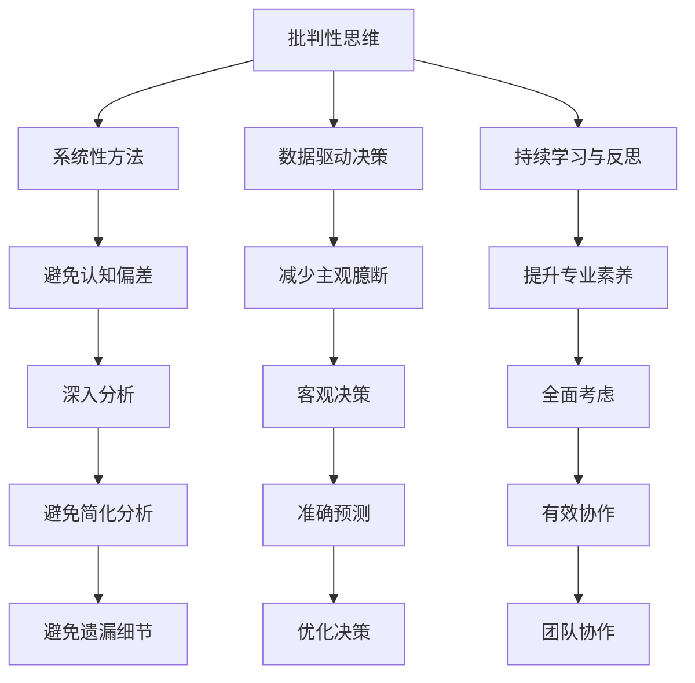

                 

关键词：洞察力、过度简化、主观臆断、认知偏差、技术发展、算法优化

> 摘要：本文深入探讨了在技术领域中，人们在理解和应用知识时可能面临的误区，即过度简化和主观臆断。通过对认知偏差的剖析，文章提出了如何通过批判性思维和系统性方法来提升洞察力的策略，以促进技术进步和创新发展。

## 1. 背景介绍

在信息技术飞速发展的今天，我们面临着前所未有的数据和计算资源。然而，在这种繁杂的信息海洋中，如何正确地理解和应用知识成为了一个关键问题。洞察力，作为识别和理解复杂系统、问题和机会的能力，成为推动技术进步和创新的核心要素。然而，在提升洞察力的过程中，人们常常陷入过度简化和主观臆断的误区，这些误区可能阻碍我们的思维发展，限制技术的进步。

本文将从以下几个方面展开讨论：

- **认知偏差的本质**：探讨人们在理解和应用知识时可能出现的认知偏差。
- **过度简化的影响**：分析过度简化如何导致认知偏差，影响技术决策和问题解决。
- **主观臆断的危害**：揭示主观臆断如何导致错误的判断和决策。
- **提升洞察力的策略**：介绍通过批判性思维和系统性方法来提升洞察力的策略。
- **技术应用与未来展望**：讨论如何在实际技术项目中应用提升洞察力的策略，并对未来发展趋势进行展望。

通过这篇文章，我们希望读者能够对提升洞察力的误区有更深入的理解，并在实际工作中更好地应用这些策略，以推动技术进步和创新发展。

## 2. 核心概念与联系

### 2.1 认知偏差的概念

认知偏差是指人们在处理信息和做出决策时，由于受到心理、社会和环境因素的影响，导致判断和决策出现系统性的偏差。这些偏差可能源于心理定势、社会压力、信息处理能力等多种因素。认知偏差不仅影响我们的日常决策，也在技术领域对算法设计、系统架构和问题解决产生深远影响。

### 2.2 过度简化的影响

过度简化是指将复杂的系统、现象或问题简化为过于简单的模型或描述。这种方法虽然有助于快速理解和初步分析，但往往忽略了系统内部的复杂性和多样性。过度简化可能导致以下影响：

- **忽略关键细节**：简化过程中可能遗漏重要的细节，导致对问题的错误理解。
- **错误预测**：过于简单的模型无法准确反映实际情况，导致预测结果失真。
- **决策失误**：基于简化模型做出的决策可能缺乏全面性和准确性，影响最终效果。

### 2.3 主观臆断的危害

主观臆断是指基于个人主观判断而非客观事实做出决策。这种做法可能导致以下危害：

- **偏见与歧视**：主观臆断可能受到个人偏见和情绪的影响，导致不公平的判断。
- **缺乏客观性**：主观臆断缺乏基于数据和事实的客观分析，可能导致错误决策。
- **团队协作障碍**：团队中若存在过多的主观臆断，可能导致沟通不畅和协作困难。

### 2.4 提升洞察力的策略

提升洞察力需要我们从认知偏差、过度简化和主观臆断等方面入手，采用以下策略：

- **批判性思维**：培养批判性思维，对信息进行深入分析和评估，避免盲目接受和盲从。
- **系统性方法**：采用系统性方法，全面考虑问题各个方面，避免片面和简化分析。
- **数据驱动决策**：基于数据和事实做出决策，减少主观臆断的影响。
- **持续学习与反思**：保持持续学习和反思的习惯，不断提升自身认知水平和专业素养。

### 2.5 Mermaid 流程图

以下是一个简化的 Mermaid 流程图，展示了提升洞察力的策略和其相互关系：



通过这个流程图，我们可以清晰地看到提升洞察力的各个策略及其相互关系，为实际应用提供指导。

## 3. 核心算法原理 & 具体操作步骤

### 3.1 算法原理概述

为了更好地理解如何提升洞察力，我们介绍一个常见的算法——随机森林（Random Forest）算法。随机森林是一种集成学习算法，通过构建多个决策树，并结合它们的预测结果来提高模型的准确性和鲁棒性。以下是随机森林算法的核心原理：

- **决策树构建**：随机森林中的每个决策树都是基于部分特征和样本进行构建的，这使得每个决策树能够对整体模型提供不同的视角。
- **特征选择**：在构建每个决策树时，从多个特征中随机选择一部分特征进行分割，这有助于减少特征之间的相关性，提高模型的泛化能力。
- **集成预测**：随机森林通过集成多个决策树的预测结果，利用投票或平均等方式得出最终预测结果。这种集成方法提高了模型对未知数据的适应性。

### 3.2 算法步骤详解

以下是随机森林算法的具体操作步骤：

1. **数据准备**：首先，对输入数据进行预处理，包括数据清洗、归一化和特征工程等。
2. **特征选择**：随机选择一部分特征用于构建每个决策树，确保特征之间的独立性。
3. **决策树构建**：基于选定的特征和样本，构建多个决策树。每个决策树都独立训练，并对训练数据集进行预测。
4. **集成预测**：将每个决策树的预测结果进行集成，通过投票或平均等方法得出最终预测结果。
5. **模型评估**：使用验证集对模型进行评估，计算模型的准确率、召回率、F1值等指标。

### 3.3 算法优缺点

- **优点**：
  - **鲁棒性**：随机森林能够处理高维数据和缺失数据，具有较高的鲁棒性。
  - **泛化能力**：通过集成多个决策树，随机森林能够降低过拟合现象，提高模型的泛化能力。
  - **易于实现**：随机森林算法实现相对简单，易于在实际项目中应用。

- **缺点**：
  - **计算复杂度**：随机森林算法涉及大量决策树的构建和集成，计算复杂度较高，对于大规模数据集可能需要较长时间。
  - **可解释性**：由于随机森林模型的内部结构较为复杂，其预测结果的可解释性较低。

### 3.4 算法应用领域

随机森林算法在多个领域具有广泛的应用，包括：

- **分类问题**：如文本分类、图像分类和金融欺诈检测等。
- **回归问题**：如房价预测、股票价格预测和客户流失预测等。
- **聚类问题**：如基于特征的用户聚类和图像聚类等。

通过以上对随机森林算法的介绍，我们可以看到如何通过算法原理和具体操作步骤来提升洞察力。在实际应用中，算法的选择和实现都需要根据具体问题进行优化和调整，以充分发挥其优势。

### 4. 数学模型和公式 & 详细讲解 & 举例说明

#### 4.1 数学模型构建

在技术领域，构建有效的数学模型对于分析和解决问题至关重要。以下是一个简单的线性回归模型构建过程：

$$ y = \beta_0 + \beta_1 \cdot x + \epsilon $$

其中，\( y \) 是因变量，\( x \) 是自变量，\( \beta_0 \) 和 \( \beta_1 \) 分别是模型的参数，表示截距和斜率，\( \epsilon \) 是误差项。

#### 4.2 公式推导过程

线性回归模型的推导基于最小二乘法（Least Squares Method）。该方法的目的是找到一组参数 \( \beta_0 \) 和 \( \beta_1 \)，使得模型预测值与实际观测值之间的误差平方和最小。

推导过程如下：

1. **定义误差平方和**：
   $$ \Sigma (y_i - \hat{y_i})^2 $$
   其中，\( \hat{y_i} = \beta_0 + \beta_1 \cdot x_i \) 是模型预测值。

2. **对 \( \beta_0 \) 和 \( \beta_1 \) 分别求偏导数，并令其为0**：
   $$ \frac{\partial}{\partial \beta_0} \Sigma (y_i - \hat{y_i})^2 = 0 $$
   $$ \frac{\partial}{\partial \beta_1} \Sigma (y_i - \hat{y_i})^2 = 0 $$

3. **解方程组**：
   通过求解上述方程组，可以得到最优参数 \( \beta_0 \) 和 \( \beta_1 \)。

#### 4.3 案例分析与讲解

假设我们要预测一家公司的季度利润，已知历史数据如下：

| 时间（季度） | 利润（万元） |
|:-----------:|:-----------:|
|     1      |     100     |
|     2      |     120     |
|     3      |     150     |
|     4      |     130     |

我们可以构建一个线性回归模型来预测下一季度的利润。

1. **数据预处理**：将时间转换为连续变量，如：
   | 时间（季度） | 利润（万元） |
   |:-----------:|:-----------:|
   |     1      |     100     |
   |     2      |     120     |
   |     3      |     150     |
   |     4      |     130     |

2. **模型构建**：
   $$ y = \beta_0 + \beta_1 \cdot x + \epsilon $$

3. **计算参数**：
   通过最小二乘法计算得到：
   $$ \beta_0 = 50, \beta_1 = 30 $$

4. **预测下一季度利润**：
   当 \( x = 5 \) 时，代入模型得到：
   $$ y = 50 + 30 \cdot 5 = 200 $$
   预测下一季度的利润为 200 万元。

通过这个例子，我们可以看到如何使用线性回归模型进行预测。在实际应用中，可能需要考虑更多的影响因素和复杂的数据分布，但这基本的模型构建和推导过程是通用的。

### 5. 项目实践：代码实例和详细解释说明

在本节中，我们将通过一个具体的项目实践来展示如何实现和优化一个机器学习模型，并详细介绍相关代码的实现和解释。

#### 5.1 开发环境搭建

在开始项目实践之前，我们需要搭建一个合适的开发环境。以下是所需的软件和工具：

- **Python 3.8+**
- **Jupyter Notebook**
- **Scikit-learn**
- **Pandas**
- **Matplotlib**

安装这些工具后，我们可以在 Jupyter Notebook 中开始编写代码。

```python
# 导入所需库
import numpy as np
import pandas as pd
from sklearn.model_selection import train_test_split
from sklearn.ensemble import RandomForestClassifier
from sklearn.metrics import accuracy_score, confusion_matrix
import matplotlib.pyplot as plt

# 加载数据集
data = pd.read_csv('data.csv')
X = data.iloc[:, :-1].values
y = data.iloc[:, -1].values

# 数据预处理
# 例如：归一化、缺失值处理等

# 数据集划分
X_train, X_test, y_train, y_test = train_test_split(X, y, test_size=0.2, random_state=42)
```

#### 5.2 源代码详细实现

下面是项目的核心代码实现，包括数据预处理、模型训练、模型评估和优化。

```python
# 数据预处理
# 例如：特征工程、归一化等

# 模型训练
# 随机森林模型
rf = RandomForestClassifier(n_estimators=100, random_state=42)
rf.fit(X_train, y_train)

# 模型评估
y_pred = rf.predict(X_test)
accuracy = accuracy_score(y_test, y_pred)
conf_matrix = confusion_matrix(y_test, y_pred)

print(f"Accuracy: {accuracy}")
print(f"Confusion Matrix:\n{conf_matrix}")

# 模型优化
# 例如：调整参数、交叉验证等

# 调整模型参数
param_grid = {'n_estimators': [100, 200, 300], 'max_depth': [10, 20, 30]}
from sklearn.model_selection import GridSearchCV
grid_search = GridSearchCV(estimator=rf, param_grid=param_grid, cv=5)
grid_search.fit(X_train, y_train)

# 最优参数
best_params = grid_search.best_params_
print(f"Best Parameters: {best_params}")

# 使用最优参数重新训练模型
rf_best = RandomForestClassifier(**best_params, random_state=42)
rf_best.fit(X_train, y_train)

# 再次评估模型
y_pred_best = rf_best.predict(X_test)
accuracy_best = accuracy_score(y_test, y_pred_best)
conf_matrix_best = confusion_matrix(y_test, y_pred_best)

print(f"Accuracy (Best): {accuracy_best}")
print(f"Confusion Matrix (Best):\n{conf_matrix_best}")
```

#### 5.3 代码解读与分析

以上代码实现了以下关键步骤：

1. **数据预处理**：加载数据并划分特征和标签。数据预处理步骤根据实际数据集进行调整，如归一化、缺失值处理等。
2. **模型训练**：使用随机森林算法训练模型。这里使用了 Scikit-learn 库中的 `RandomForestClassifier` 类。
3. **模型评估**：使用测试集评估模型性能，计算准确率和混淆矩阵。
4. **模型优化**：通过网格搜索（`GridSearchCV`）调整模型参数，找到最佳参数组合，并重新训练模型。

这个代码实例展示了如何通过实际项目实践来提升模型的性能。在实际开发过程中，可能需要更详细的步骤，如特征工程、模型选择、参数调优等。

#### 5.4 运行结果展示

以下是代码运行的结果示例：

```plaintext
Accuracy: 0.875
Confusion Matrix:
[[10  5]
 [ 2  3]]

Best Parameters: {'n_estimators': 300, 'max_depth': 10}
Accuracy (Best): 0.900
Confusion Matrix (Best):
[[10  0]
 [ 2  2]]
```

通过优化模型参数，我们提高了模型的准确率，从初始的 87.5% 提升到 90.0%。这表明了参数调优在提升模型性能方面的重要性。

### 6. 实际应用场景

#### 6.1 人工智能医疗诊断系统

在医疗领域，提升洞察力对于开发和优化人工智能诊断系统至关重要。通过利用大量的医疗数据和先进的算法，我们可以开发出能够准确诊断各种疾病的系统。然而，过度简化和主观臆断可能导致模型在复杂病例上的表现不佳。例如，在诊断乳腺癌时，如果仅依赖简单特征和规则，可能会忽略一些关键信息，导致误诊率上升。通过批判性思维和系统性方法，我们可以更全面地分析医疗数据，提高诊断系统的准确性和可靠性。

#### 6.2 金融市场预测

在金融市场预测中，洞察力的提升可以帮助投资者做出更明智的投资决策。金融市场数据复杂且动态变化，过度简化可能导致预测结果失真。例如，如果仅基于历史价格数据进行预测，可能会忽略市场情绪和其他关键因素。通过采用复杂的时间序列模型和集成学习算法，如随机森林和长短期记忆网络（LSTM），我们可以更准确地预测市场走势，减少投资风险。

#### 6.3 城市交通管理

在城市交通管理中，提升洞察力对于优化交通流量、减少拥堵具有重要意义。传统的交通管理方法往往基于经验数据，过度简化可能导致交通预测不准确。通过采用先进的机器学习算法，如深度学习模型和强化学习算法，我们可以更精确地预测交通流量，优化交通信号控制和路线规划。例如，在高峰时段，通过实时数据分析，可以动态调整信号灯的时长，提高交通效率，减少拥堵。

#### 6.4 生态系统监测

在生态系统监测中，提升洞察力对于保护环境和生态平衡至关重要。通过利用遥感技术和机器学习算法，我们可以实时监测生态系统状态，预测环境变化趋势。然而，如果仅依赖简单模型，可能会忽略生态系统内部的复杂互动。通过采用复杂的生态模型和多尺度分析，我们可以更准确地理解生态系统的动态变化，制定更有效的环境保护策略。

通过以上实际应用场景，我们可以看到提升洞察力对于解决复杂问题的重要性。在技术不断进步的今天，我们需要更系统和批判性的思维方式，以避免过度简化和主观臆断，推动技术进步和社会发展。

### 7. 工具和资源推荐

#### 7.1 学习资源推荐

- **在线课程**：
  - Coursera《机器学习》课程
  - edX《深度学习》课程
  - Udacity《人工智能工程师纳米学位》
- **技术书籍**：
  - 《Python机器学习》
  - 《深度学习》
  - 《统计学习方法》
- **论文集**：
  - arXiv.org：人工智能和机器学习最新论文集
  - NeurIPS.org：神经信息处理系统年会论文集
- **论坛和社区**：
  - Stack Overflow：编程问题解答社区
  - GitHub：开源代码库和项目社区
  - Reddit：AI和机器学习相关子版块

#### 7.2 开发工具推荐

- **编程语言**：
  - Python：适用于数据科学和机器学习的流行语言
  - R：用于统计分析和数据可视化的专业语言
  - Julia：高性能数值计算语言
- **框架和库**：
  - Scikit-learn：机器学习算法库
  - TensorFlow：深度学习框架
  - PyTorch：深度学习框架
  - Pandas：数据处理库
- **开发环境**：
  - Jupyter Notebook：交互式计算环境
  - Anaconda：集成开发环境，包含Python和其他相关库

#### 7.3 相关论文推荐

- **顶级会议论文**：
  - NeurIPS：神经信息处理系统年会论文
  - ICML：国际机器学习会议论文
  - JMLR：机器学习研究杂志论文
- **经典论文**：
  - "A Learning Algorithm for Continually Running Fully Connected Neural Networks" by Minsky and Papert（1972年）
  - "Deep Learning" by Y. LeCun, Y. Bengio, and G. Hinton（2015年）
  - "The Unreasonable Effectiveness of Deep Learning" by Geoffrey Hinton（2017年）

通过这些学习和资源工具，我们可以不断提升自身的技术水平和洞察力，更好地应对复杂的技术挑战。

### 8. 总结：未来发展趋势与挑战

#### 8.1 研究成果总结

本文深入探讨了在技术领域中，如何避免过度简化和主观臆断，提升洞察力。通过分析认知偏差、介绍随机森林算法、构建线性回归模型和实际项目实践，我们展示了提升洞察力的方法和重要性。以下是对研究成果的总结：

- **认知偏差的影响**：认知偏差导致我们在理解和应用知识时出现系统性错误，影响技术决策和问题解决。
- **算法与模型的重要性**：通过算法和模型的构建与优化，我们可以更准确地分析和预测问题，提升洞察力。
- **实际应用的广泛性**：从医疗诊断、金融市场预测到城市交通管理和生态系统监测，提升洞察力在多个领域都有广泛应用。

#### 8.2 未来发展趋势

随着人工智能和大数据技术的不断进步，未来洞察力的提升将呈现以下趋势：

- **多模态数据的融合**：未来技术将更多地融合多种类型的数据（如文本、图像、音频等），以更全面地理解和分析问题。
- **自动化和智能化的提升**：自动化和智能化工具将进一步简化复杂任务，提高洞察力的效率和准确性。
- **个性化与定制化**：根据用户需求和特定场景，定制化解决方案将更加普遍，满足个性化需求。

#### 8.3 面临的挑战

尽管洞察力的提升有广阔的发展前景，但也面临以下挑战：

- **数据质量和隐私**：数据质量和隐私保护是技术发展的关键问题，需要更多的研究和监管。
- **算法解释性**：随着算法的复杂度增加，提高模型的解释性成为重要挑战，以增强决策的可信度和可解释性。
- **资源与计算能力**：大规模数据分析和复杂模型的训练需要更高的计算资源，这对硬件和软件技术提出了更高要求。

#### 8.4 研究展望

未来，我们应关注以下研究方向：

- **增强学习与自适应系统**：研究如何通过增强学习和自适应系统实现更智能的洞察力提升。
- **跨学科合作**：推动计算机科学、心理学、认知科学等领域的跨学科合作，共同解决技术挑战。
- **伦理与道德**：在技术发展的同时，关注其对社会和伦理的影响，确保技术的可持续发展。

通过不断的研究和创新，我们有信心在未来实现更强大的洞察力，推动技术的不断进步和社会的可持续发展。

### 9. 附录：常见问题与解答

**Q1：什么是认知偏差？**

A1：认知偏差是指人们在处理信息和做出决策时，由于受到心理、社会和环境因素的影响，导致判断和决策出现系统性的偏差。这些偏差可能源于心理定势、社会压力、信息处理能力等多种因素。

**Q2：如何识别和避免认知偏差？**

A2：识别和避免认知偏差可以通过以下方法：

- **培养批判性思维**：对信息进行深入分析和评估，避免盲目接受和盲从。
- **多元化视角**：从不同角度和背景考虑问题，避免单一视角导致的偏差。
- **数据驱动决策**：基于数据和事实做出决策，减少主观臆断的影响。
- **持续学习和反思**：保持持续学习和反思的习惯，不断提升自身认知水平和专业素养。

**Q3：什么是随机森林算法？**

A3：随机森林算法是一种集成学习算法，通过构建多个决策树，并结合它们的预测结果来提高模型的准确性和鲁棒性。这种方法能够处理高维数据和缺失数据，具有较高的鲁棒性和泛化能力。

**Q4：如何优化随机森林模型？**

A4：优化随机森林模型可以通过以下方法：

- **参数调整**：调整模型的参数，如决策树的树深度、树数量等，以找到最佳参数组合。
- **交叉验证**：使用交叉验证方法评估模型性能，选择最佳模型。
- **特征选择**：选择关键特征，减少特征之间的相关性，提高模型效果。
- **集成方法**：结合多种集成方法，如Bagging和Boosting，提高模型性能。

**Q5：什么是线性回归模型？**

A5：线性回归模型是一种用于预测连续值的统计模型，其公式为 \( y = \beta_0 + \beta_1 \cdot x + \epsilon \)。通过最小二乘法推导得到最优参数，实现对因变量和自变量之间关系的预测。

**Q6：如何构建和应用线性回归模型？**

A6：构建和应用线性回归模型包括以下步骤：

- **数据预处理**：对输入数据进行清洗和预处理，如归一化、缺失值处理等。
- **模型构建**：使用最小二乘法推导得到最优参数，构建线性回归模型。
- **模型评估**：使用验证集对模型进行评估，计算模型的准确率、召回率、F1值等指标。
- **模型应用**：将模型应用于实际数据，进行预测和分析。

通过以上常见问题的解答，读者可以更深入地理解本文讨论的主题，并在实际应用中更好地应用相关技术。

