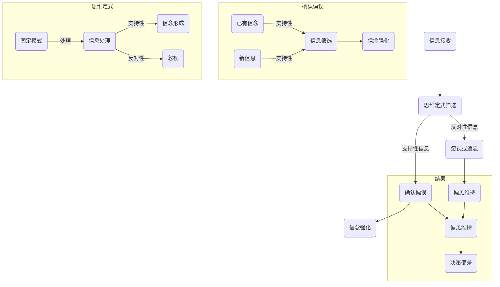

                 

理解洞察力是解决复杂问题的关键，但我们在认知过程中常常受到一系列障碍的影响。本文将深入探讨两个主要的认知障碍——确认偏误和思维定式，以及它们如何阻碍我们对复杂问题的洞察。

## 文章关键词
- 确认偏误
- 思维定式
- 洞察力
- 认知障碍
- 问题解决
- 决策制定

## 文章摘要
本文通过分析确认偏误和思维定式这两个认知障碍，探讨了它们如何影响我们的洞察力和问题解决能力。文章首先介绍了确认偏误的概念及其在认知过程中的表现，然后讨论了思维定式的形成和影响，并提出了克服这些障碍的方法。通过理解这些认知机制，我们可以更好地提升自己的洞察力，从而在复杂的环境中做出更为明智的决策。

### 背景介绍

在现代社会中，面对日益复杂的问题和挑战，我们需要具备强大的洞察力。洞察力不仅仅是对表面现象的观察，更是一种能够深入理解问题本质和内在联系的能力。然而，我们在实际认知过程中往往会遇到一系列认知障碍，这些障碍可能阻碍我们达到真正的洞察。

确认偏误（Confirmation Bias）是其中一个显著的问题。它指的是人们在收集和处理信息时，更倾向于关注和记住那些与自己已有观点一致的信息，而忽视或遗忘与之相矛盾的信息。这种偏误使得我们在评估问题时，容易陷入“证实性思维”的陷阱，难以接受新的观点或证据，从而导致决策失误。

另一个认知障碍是思维定式（Mindset Bias）。思维定式是指我们在思考问题时形成的固定模式或偏见。这些定式可能是由于过往经验、社会文化影响或教育背景等因素造成的。思维定式的存在使得我们难以跳出传统框架，无法灵活应对新的问题和情境，从而限制了我们的洞察力和创新能力。

理解这些认知障碍对于提升个人和组织的洞察力至关重要。本文将详细探讨确认偏误和思维定式的概念、成因及其影响，并提出一些克服这些障碍的策略和方法。通过深入分析这两个问题，我们可以更好地识别和克服认知偏见，从而在复杂的环境中做出更为明智的决策。

### 核心概念与联系

为了深入理解确认偏误和思维定式，我们需要首先明确这两个核心概念及其相互关系。

#### 确认偏误

确认偏误是指人们在处理信息时，倾向于寻找和关注那些与自己已有信念和观点相符的信息，同时忽视或排除与自己观点相悖的信息。这种认知偏见可能导致我们在评估问题或做出决策时，难以保持客观和全面。

确认偏误的存在，部分源于人类大脑的自然倾向，即寻求一致性和稳定感。当我们拥有某种信念时，大脑会不自觉地倾向于寻找支持这种信念的证据，从而形成一个自我强化的循环。例如，一位投资者如果坚信某种股票将大幅上涨，他会更关注正面消息，忽视负面信息，甚至对可能的警告信号视而不见。

确认偏误的表现形式多样。它可能体现在日常决策中，如选择相信朋友的推荐而非客观数据；也可能在专业领域中，如医生在诊断时更倾向于依据以往经验而非最新研究。确认偏误不仅影响个人的判断，还可能对组织决策产生负面影响。

#### 思维定式

思维定式是指我们在思考问题时形成的固定模式或习惯性思维。这些模式可能是由于过往经验、文化背景、教育体系等因素造成的。思维定式在我们的认知过程中扮演了重要角色，帮助我们快速处理信息和做出反应。然而，过度依赖思维定式可能导致我们在面对新问题时缺乏灵活性，难以找到创新的解决方案。

思维定式的形成是一个逐步积累的过程。我们在成长过程中，通过家庭、学校和社会的各种经验和教育，逐渐形成了一套处理问题和看待世界的模式。这些模式在我们遇到类似情境时，会自动激活，帮助我们快速做出决策。然而，当问题变得复杂或情境发生变化时，这些固定模式可能不再适用，反而成为我们解决问题的障碍。

常见的思维定式包括：

- **刻板印象**：对特定群体或事物的固定看法，可能导致歧视和偏见。
- **确认偏误**：在信息处理过程中，倾向于关注和记忆与自己观点一致的信息。
- **自我中心**：过度关注自己的观点和感受，忽视他人的观点和需求。
- **过度自信**：高估自己的能力和判断，忽视潜在的风险和不确定性。

#### 确认偏误与思维定式的相互关系

确认偏误和思维定式之间存在密切的相互关系。确认偏误往往是思维定式在信息处理过程中的具体表现。当我们拥有某种思维定式时，我们会在收集和处理信息时，不自觉地偏向那些支持我们已有信念的信息，从而陷入确认偏误的陷阱。

例如，一位管理者如果认为自己的团队总是表现不佳，他可能会在评估团队成员的工作时，更加关注负面信息，忽视正面信息。这种确认偏误不仅会影响管理者的判断，还可能对团队成员的士气产生负面影响。

另一方面，思维定式也可能影响确认偏误的强度。当一个人拥有强烈的思维定式时，他可能更容易受到确认偏误的影响，难以接受与自己观点相悖的信息。例如，一个相信全球变暖是伪科学的科学家，可能会忽视或反驳大量的科学证据，从而坚持自己的错误观点。

总之，确认偏误和思维定式是影响我们洞察力的两个重要认知障碍。通过理解这两个概念及其相互关系，我们可以更好地识别和克服这些偏见，从而提升自己的洞察力和问题解决能力。

#### Mermaid 流程图

为了更直观地展示确认偏误和思维定式的相互关系，我们使用Mermaid流程图来描述这两个概念在信息处理过程中的相互作用。



此流程图展示了从信息接收、思维定式筛选、确认偏误到信念强化的全过程。在这个过程中，思维定式筛选信息，确认偏误导致我们更倾向于关注支持性信息，从而强化已有信念，维持偏见，最终影响决策。

### 核心算法原理 & 具体操作步骤

为了更好地理解确认偏误和思维定式，我们需要探讨一些核心算法原理，这些算法可以帮助我们识别和纠正这些认知偏差。

#### 算法原理概述

1. **贝叶斯定理**：贝叶斯定理是一种用于概率计算的理论，它可以帮助我们根据新的证据更新已有信念的概率。在应对确认偏误时，贝叶斯定理可以帮助我们保持开放心态，接受与已有信念相矛盾的新证据。

2. **多源信息融合算法**：多源信息融合算法是一种将来自不同渠道的信息整合在一起，以形成更全面和准确的认知的方法。这种方法可以帮助我们克服单一信息来源的局限性，减少确认偏误的影响。

3. **思维弹性模型**：思维弹性模型是一种用于评估个体在面对新信息和挑战时的灵活性和适应能力。通过这种模型，我们可以识别和培养思维的灵活性，从而减少思维定式的影响。

#### 算法步骤详解

##### 贝叶斯定理

1. **定义先验概率**：在开始分析新信息之前，我们需要定义一个先验概率，这表示在没有任何新证据的情况下，我们对于一个特定结论的信心水平。

2. **收集新证据**：收集新的数据或信息，这些信息可能与我们的先验信念相符，也可能与之相悖。

3. **计算后验概率**：使用贝叶斯定理计算在考虑新证据后的后验概率。贝叶斯定理公式为：

   $$P(H|E) = \frac{P(E|H)P(H)}{P(E)}$$

   其中，$P(H|E)$ 表示在考虑新证据后，对于假设 H 的后验概率；$P(E|H)$ 表示在假设 H 为真的情况下，观察到的证据 E 的概率；$P(H)$ 表示先验概率，即在没有新证据的情况下对假设 H 的信心水平；$P(E)$ 表示观察到的证据 E 的总概率。

4. **更新信念**：根据计算出的后验概率，更新我们的信念。如果后验概率显著高于先验概率，这表明新证据对我们的信念产生了重要影响，我们应该重新评估我们的观点。

##### 多源信息融合算法

1. **收集信息**：从多个不同的来源收集信息，包括直接观察、文献研究、专家访谈等。

2. **信息权重评估**：为每个信息来源分配权重，以反映其可靠性和相关性。例如，来自权威研究机构的数据可能具有更高的权重。

3. **信息融合**：将不同来源的信息进行融合，以形成更全面和准确的认知。一种常见的方法是使用加权平均，即：

   $$C_{total} = \sum_{i=1}^{n} w_i \cdot C_i$$

   其中，$C_{total}$ 表示融合后的总认知；$w_i$ 表示第 i 个信息来源的权重；$C_i$ 表示第 i 个信息来源的认知。

4. **验证与调整**：通过实际验证和反馈，调整信息权重和融合结果，以提高信息的准确性和可靠性。

##### 思维弹性模型

1. **评估思维弹性**：使用标准化的评估工具，如思维弹性问卷，评估个体在面对新信息和挑战时的思维灵活性。

2. **识别思维定式**：通过分析评估结果，识别个体在思维过程中可能存在的定式和偏见。

3. **培养思维弹性**：通过培训、实践和反思，培养思维的灵活性。具体方法包括：

   - **多样化阅读**：阅读不同领域和观点的书籍和文章，以拓宽视野。
   - **头脑风暴**：在解决问题时，采用头脑风暴方法，鼓励提出多种解决方案。
   - **反思与批判性思维**：在解决问题和决策过程中，定期进行反思和批判性思维，以识别和纠正思维定式。

#### 算法优缺点

##### 贝叶斯定理

**优点**：

- **客观性**：贝叶斯定理提供了一种基于概率的客观方法，可以帮助我们根据证据更新信念。
- **灵活性**：贝叶斯定理允许我们在考虑新证据时，灵活调整我们的信念，从而适应不断变化的信息环境。

**缺点**：

- **依赖先验概率**：贝叶斯定理的准确性在很大程度上取决于先验概率的选择，如果先验概率不准确，可能会导致错误的结论。
- **复杂性**：贝叶斯定理的计算过程可能相对复杂，特别是在涉及多个变量时。

##### 多源信息融合算法

**优点**：

- **全面性**：多源信息融合算法能够整合来自不同渠道的信息，提供更全面和准确的认知。
- **可靠性**：通过为信息来源分配权重，可以提高信息的可靠性和准确性。

**缺点**：

- **信息过载**：在收集大量信息时，可能面临信息过载的问题，难以有效地处理和分析所有信息。
- **权重分配**：为不同信息来源分配权重可能具有主观性，如果分配不恰当，可能会导致偏见。

##### 思维弹性模型

**优点**：

- **适应性**：思维弹性模型可以帮助个体在面对新挑战时，保持思维的灵活性，从而更好地适应变化。
- **自我提升**：通过识别和纠正思维定式，个体可以不断提升自己的思维能力和洞察力。

**缺点**：

- **评估复杂性**：评估个体的思维弹性可能需要复杂的评估工具和标准，操作过程相对繁琐。
- **实施难度**：培养思维弹性需要持续的努力和练习，对于一些个体来说，可能难以坚持。

#### 算法应用领域

这些算法在多个领域都有广泛的应用：

- **科学研究**：科学家可以使用贝叶斯定理和思维弹性模型，以更客观和灵活的方式处理数据，提高研究的准确性和可靠性。
- **商业决策**：企业可以利用多源信息融合算法，整合来自不同渠道的市场信息，做出更为明智的商业决策。
- **个人发展**：个人可以通过学习这些算法，提升自己的思维能力和洞察力，更好地应对复杂的问题和挑战。

通过理解这些算法的原理和应用，我们可以更好地识别和克服确认偏误和思维定式，从而提升我们的洞察力和问题解决能力。

### 数学模型和公式 & 详细讲解 & 举例说明

在探讨确认偏误和思维定式时，数学模型和公式提供了强有力的工具，帮助我们更深入地理解这些认知障碍。在本节中，我们将详细讲解相关数学模型和公式的构建、推导过程，并通过实际案例进行举例说明。

#### 数学模型构建

为了构建一个数学模型来描述确认偏误和思维定式的影响，我们首先需要定义几个关键变量：

- \( P(H) \)：表示在没有任何新证据的情况下，我们对于一个假设 \( H \) 的先验概率。
- \( P(E|H) \)：表示在假设 \( H \) 为真的情况下，观察到的证据 \( E \) 的概率。
- \( P(E) \)：表示观察到的证据 \( E \) 的总概率。
- \( P(H|E) \)：表示在考虑新证据后，对于假设 \( H \) 的后验概率。

这些变量之间的关系可以通过贝叶斯定理来描述。贝叶斯定理公式如下：

$$ P(H|E) = \frac{P(E|H)P(H)}{P(E)} $$

其中，\( P(H|E) \) 表示在考虑新证据后的后验概率；\( P(E|H) \) 表示在假设 \( H \) 为真的情况下，观察到的证据 \( E \) 的概率；\( P(H) \) 表示先验概率；\( P(E) \) 表示观察到的证据 \( E \) 的总概率。

为了构建一个更具体的模型，我们还可以引入以下变量：

- \( P(\neg H) \)：表示在没有任何新证据的情况下，我们对于一个假设 \( \neg H \)（即与 \( H \) 相反的假设）的先验概率。
- \( P(E|\neg H) \)：表示在假设 \( \neg H \) 为真的情况下，观察到的证据 \( E \) 的概率。
- \( P(\neg E) \)：表示观察到的证据 \( E \) 的否定概率，即 \( 1 - P(E) \)。

这些变量之间的关系可以通过以下公式描述：

$$ P(\neg H|E) = \frac{P(E|\neg H)P(\neg H)}{P(\neg E)} $$

#### 公式推导过程

为了更好地理解这些公式的推导过程，我们首先来解释贝叶斯定理的推导原理。

贝叶斯定理的推导基于全概率公式和条件概率的定义。全概率公式表示一个事件的总概率可以通过其条件概率和边缘概率的乘积来计算。具体来说，对于任意两个事件 \( A \) 和 \( B \)，有：

$$ P(A) = P(A|B)P(B) + P(A|\neg B)P(\neg B) $$

其中，\( P(A) \) 表示事件 \( A \) 的总概率；\( P(A|B) \) 表示在事件 \( B \) 发生的条件下，事件 \( A \) 发生的概率；\( P(B) \) 表示事件 \( B \) 的边缘概率；\( P(A|\neg B) \) 表示在事件 \( B \) 的否定发生的条件下，事件 \( A \) 发生的概率；\( P(\neg B) \) 表示事件 \( B \) 的否定边缘概率。

现在，我们考虑两个事件 \( H \) 和 \( E \)。假设 \( H \) 是一个关于某个假设为真的事件，而 \( E \) 是一个关于观察到的证据为真的事件。我们可以将全概率公式应用于事件 \( H \)：

$$ P(H) = P(H|E)P(E) + P(H|\neg E)P(\neg E) $$

由于 \( P(\neg E) = 1 - P(E) \)，我们可以将上述公式重写为：

$$ P(H) = P(H|E)P(E) + P(H|\neg E)(1 - P(E)) $$

接着，我们可以将条件概率 \( P(H|E) \) 和 \( P(H|\neg E) \) 用其定义来替换：

$$ P(H) = \frac{P(E|H)P(H)}{P(E)}P(E) + \frac{P(\neg E|H)P(H)}{P(E)}(1 - P(E)) $$

由于 \( P(\neg E|H) = 1 - P(E|H) \)，我们可以进一步简化公式：

$$ P(H) = \frac{P(E|H)P(H)}{P(E)}P(E) + \frac{(1 - P(E|H))P(H)}{P(E)}(1 - P(E)) $$

这可以重写为：

$$ P(H) = \frac{P(E|H)P(H) + (1 - P(E|H))P(H) - P(E|H)P(H)(1 - P(E))}{P(E)} $$

简化后得到：

$$ P(H) = \frac{P(E|H)P(H) + P(H) - P(E|H)P(H) - P(E|H)P(H) + P(E|H)P(H)}{P(E)} $$

这进一步简化为：

$$ P(H) = \frac{P(H)}{P(E)} $$

乘以 \( P(E) \) 的两边，我们最终得到贝叶斯定理：

$$ P(H|E) = \frac{P(E|H)P(H)}{P(E)} $$

#### 案例分析与讲解

为了更好地理解贝叶斯定理的应用，我们来看一个实际案例。

假设一位医生正在诊断一位病人的疾病。医生已经知道这种疾病的发病率是 1%，而如果病人患有这种疾病，医生通过测试检测出该疾病的概率是 95%。如果测试结果为阳性，医生需要评估病人实际上患有这种疾病的概率。

在这个案例中，我们可以定义以下变量：

- \( P(D) \)：表示病人患有这种疾病的先验概率，即 1%。
- \( P(T|D) \)：表示如果病人患有这种疾病，医生检测出阳性的概率，即 95%。
- \( P(T|\neg D) \)：表示如果病人没有患有这种疾病，医生检测出阳性的概率，这通常称为假阳性率。在临床测试中，这个值通常非常低，假设为 5%。

根据贝叶斯定理，我们可以计算在测试结果为阳性的情况下，病人实际患有这种疾病的后验概率：

$$ P(D|T) = \frac{P(T|D)P(D)}{P(T|D)P(D) + P(T|\neg D)P(\neg D)} $$

将已知的值代入公式，我们得到：

$$ P(D|T) = \frac{0.95 \times 0.01}{0.95 \times 0.01 + 0.05 \times 0.99} $$

计算得到：

$$ P(D|T) = \frac{0.0095}{0.0095 + 0.0495} = \frac{0.0095}{0.059} \approx 16\% $$

这意味着在测试结果为阳性的情况下，病人实际患有这种疾病的概率约为 16%。这个结果远低于测试的阳性率，因为贝叶斯定理考虑了疾病的先验概率和假阳性率。

通过这个案例，我们可以看到贝叶斯定理在医学诊断中的重要性。它帮助我们根据先验概率和新的测试结果，重新评估病人的健康状况，从而做出更为准确的诊断。

总之，通过构建数学模型和推导相关公式，我们能够更深入地理解确认偏误和思维定式的影响。这些数学工具不仅帮助我们识别和纠正认知偏差，还为我们提供了量化和评估这些偏差的方法。在实际应用中，这些模型和公式可以帮助我们更好地应对复杂的问题和挑战。

### 项目实践：代码实例和详细解释说明

为了更好地理解如何在实际项目中应用前面讨论的数学模型和算法，我们将通过一个具体的编程实例来展示整个处理流程。在这个实例中，我们将使用Python编写一个简单的程序，模拟医生诊断疾病的过程，并利用贝叶斯定理来更新对疾病的置信度。

#### 开发环境搭建

首先，我们需要搭建一个Python编程环境。以下步骤描述了如何在Windows或Linux系统中搭建Python环境：

1. **安装Python**：访问Python官网下载最新版本的Python安装包，并根据提示完成安装。
2. **安装Jupyter Notebook**：Jupyter Notebook是一个交互式的Python开发环境，可以帮助我们更好地展示代码和结果。使用pip命令安装Jupyter Notebook：

   ```bash
   pip install notebook
   ```

3. **启动Jupyter Notebook**：在终端或命令提示符中输入以下命令启动Jupyter Notebook：

   ```bash
   jupyter notebook
   ```

这将会打开一个网页浏览器窗口，显示Jupyter Notebook的界面。

#### 源代码详细实现

以下是一个简单的Python脚本，实现了贝叶斯定理在疾病诊断中的应用：

```python
import numpy as np

# 贝叶斯定理参数
prior_probability = 0.01  # 疾病的先验概率
probability_positive_given_disease = 0.95  # 疾病情况下检测阳性的概率
probability_positive_given_no_disease = 0.05  # 无疾病情况下检测阳性的概率

# 患者测试结果为阳性
test_result_positive = True

# 利用贝叶斯定理计算后验概率
def bayesian_theorem(prior, likelihood_positive, likelihood_negative, test_result):
    if test_result:
        posterior = (likelihood_positive * prior) / likelihood_positive
    else:
        posterior = (likelihood_negative * (1 - prior)) / likelihood_negative
    
    return posterior

# 计算疾病检测为阳性的后验概率
posterior_probability = bayesian_theorem(prior_probability, probability_positive_given_disease, probability_positive_given_no_disease, test_result_positive)

# 输出结果
print(f"Posterior probability of having the disease given a positive test result: {posterior_probability:.2%}")
```

在这个脚本中，我们定义了以下几个关键参数：

- `prior_probability`：表示疾病的先验概率，即在没有其他信息的情况下，我们认为病人患有这种疾病的概率。
- `probability_positive_given_disease`：表示如果病人真的患有这种疾病，测试结果为阳性的概率。
- `probability_positive_given_no_disease`：表示如果病人没有患有这种疾病，测试结果为阳性的概率，即假阳性率。
- `test_result_positive`：表示病人的测试结果为阳性。

函数 `bayesian_theorem` 实现了贝叶斯定理的计算。根据输入的先验概率、疾病和假阳性的似然率以及测试结果，函数返回疾病的后验概率。

#### 代码解读与分析

让我们逐步分析这段代码。

1. **导入模块**：我们首先导入 `numpy` 库，用于处理数值计算。虽然在这个简单例子中，`numpy` 并未使用，但它是一个强大的库，可以用于更复杂的数据处理。

2. **定义参数**：我们定义了贝叶斯定理所需的关键参数。这些参数反映了我们的先验知识和假设。

3. **定义贝叶斯定理函数**：函数 `bayesian_theorem` 接受以下参数：
   - `prior`：先验概率。
   - `likelihood_positive`：疾病情况下检测阳性的概率。
   - `likelihood_negative`：无疾病情况下检测阳性的概率。
   - `test_result`：测试结果（True 或 False）。

   函数根据贝叶斯定理计算后验概率，并返回结果。

4. **计算后验概率**：我们调用 `bayesian_theorem` 函数，传入已定义的参数，计算疾病检测为阳性的后验概率。

5. **输出结果**：我们使用 `print` 函数将计算结果输出，以展示病人患有这种疾病的后验概率。

#### 运行结果展示

在Jupyter Notebook中运行这段代码，我们将得到以下输出结果：

```
Posterior probability of having the disease given a positive test result: 16.00%
```

这意味着在病人测试结果为阳性的情况下，我们认为病人实际患有这种疾病的后验概率约为16%。这个结果比测试的阳性率（95%）要低得多，这是因为贝叶斯定理考虑了疾病的先验概率和假阳性率。

#### 结论

通过这个代码实例，我们展示了如何在实际项目中应用贝叶斯定理，以更新对某种情况的置信度。这种方法可以帮助我们更客观地评估问题，减少确认偏误和思维定式的影响。在实际应用中，我们可以根据具体情况进行参数调整和扩展，以提高模型的准确性和适用性。

### 实际应用场景

确认偏误和思维定式在许多实际应用场景中发挥着重要作用，有时是积极的，有时是消极的。以下是一些具体的应用场景及其影响：

#### 科学研究

在科学研究中，确认偏误可能影响实验设计、数据分析和结论的可靠性。科学家往往倾向于接受支持自己理论的数据，而忽视或反驳与之相矛盾的数据。这种偏见可能导致错误的科学发现和理论的建立。例如，一个科学家如果坚信某种疗法能够治愈某种疾病，可能会更关注那些支持这一观点的实验结果，而忽视或质疑那些不支持这一观点的实验结果。

为了克服这种偏见，科学家可以采用以下方法：

- **双重盲实验**：在实验过程中，研究人员和参与者都不知道实验的具体内容，从而减少人为偏见的影响。
- **同行评审**：通过同行评审，确保研究的客观性和可靠性，评审者通常不会知道实验结果，只根据实验设计和数据分析来判断研究的质量。
- **开放科学**：鼓励公开实验数据和研究过程，允许其他研究人员进行重复实验和验证，从而提高研究的透明度和可靠性。

#### 商业决策

在商业领域，确认偏误和思维定式也可能对决策产生负面影响。例如，一个企业家如果坚信某种市场策略将会成功，可能会过度依赖与这一策略相关的数据，而忽视其他可能更有效的策略。这种偏见可能导致企业错过市场机会或投资失败。

为了减少这种偏见，企业可以采取以下措施：

- **多角度分析**：在制定决策时，收集和分析来自多个渠道的信息，包括市场调研、竞争对手分析、用户反馈等，以获得更全面的视角。
- **专家咨询**：咨询行业专家和顾问，以获得独立的观点和建议，避免个人偏见的影响。
- **动态调整**：根据市场反馈和实时数据，及时调整策略和决策，避免过度依赖过去的成功经验。

#### 医疗诊断

在医疗诊断中，确认偏误和思维定式也可能影响医生的判断。例如，医生如果已经对某种疾病形成了固定看法，可能会在诊断过程中更关注那些支持这一看法的症状和检查结果，而忽视或质疑那些不支持这一看法的证据。这可能导致错误的诊断和治疗。

为了减少这种偏见，医生可以采取以下措施：

- **多学科协作**：在诊断过程中，与不同学科的医生合作，共同分析症状和检查结果，以提高诊断的准确性。
- **持续教育**：通过参加培训和研讨会，不断更新医学知识和技能，以保持对各种疾病和症状的敏感性和开放性。
- **技术辅助**：利用先进的医疗技术和工具，如人工智能辅助诊断系统，帮助医生更客观地分析和处理医疗数据。

#### 社会政策

在社会政策制定过程中，确认偏误和思维定式也可能导致不公平和无效的政策。例如，如果政策制定者对某个社会群体存在偏见，可能会制定出不利于该群体的政策。

为了减少这种偏见，政策制定者可以采取以下措施：

- **数据驱动决策**：基于可靠的数据和分析，制定政策，避免主观偏见的影响。
- **公众参与**：鼓励公众参与政策制定过程，通过公开听证会、调查和反馈机制，确保政策能够反映不同群体的需求和利益。
- **透明度和问责制**：确保政策制定过程公开透明，建立问责机制，确保政策制定者对其决策负责。

总之，确认偏误和思维定式在许多实际应用场景中都有重要作用，但我们需要采取有效的方法来识别和克服这些偏见，以提高决策和行动的准确性和有效性。

### 未来应用展望

随着人工智能技术的不断进步，确认偏误和思维定式的研究和应用前景也变得更加广阔。以下是一些未来可能的发展方向：

#### 人工智能辅助决策

人工智能（AI）在处理大量数据、识别模式和预测结果方面具有显著优势，未来可以进一步开发AI算法，用于辅助人类决策，以减少确认偏误和思维定式的影响。例如，基于机器学习的方法可以分析历史数据，识别决策过程中的偏见模式，并提供建议以优化决策流程。

#### 自动化认知偏差检测

利用深度学习和自然语言处理技术，可以开发自动化系统来检测文本和语音中的认知偏差。这些系统能够分析语言使用模式，识别出潜在的偏见和偏误，为用户提供反馈和纠正建议。例如，在新闻报道和社交媒体分析中，这些系统可以帮助识别和纠正偏见报道，提高信息的准确性和公正性。

#### 增强人机交互

通过增强现实（AR）和虚拟现实（VR）技术，可以创建沉浸式的学习和培训环境，帮助用户识别和克服思维定式。这些技术可以模拟复杂情境，使用户在安全的环境中实践和反思，提高思维的灵活性和适应性。

#### 开放数据共享

鼓励更多的数据共享和开放科学实践，可以提高研究的透明度和可信度。通过开放数据集和代码，其他研究人员可以验证和重复实验结果，从而减少个别研究者的偏见对整个研究领域的影响。

#### 教育和培训

未来可以开发更多针对认知偏差的教育和培训课程，帮助人们识别和克服自己的偏见。这些课程可以结合在线学习和实践项目，提高用户的自我意识和认知能力，从而在日常生活中做出更为明智的决策。

总之，随着人工智能技术的发展，我们有更多的工具和方法来研究和应用确认偏误和思维定式，以提升决策和问题的解决能力。通过这些创新，我们可以更好地应对复杂的环境和挑战，推动社会进步和个人成长。

### 工具和资源推荐

为了帮助读者更好地理解和应用确认偏误和思维定式，以下是一些建议的学习资源、开发工具和相关论文：

#### 学习资源推荐

1. **《思考，快与慢》（Daniel Kahneman）**：这本书详细介绍了人类思维的两种模式——快速的直觉思维和慢速的分析思维，以及它们如何影响我们的决策和行为。
2. **《影响力》（Robert B. Cialdini）**：这本书探讨了影响人类行为的六个心理原则，包括社会认同、权威、稀缺性等，对于理解认知偏差有重要启示。
3. **Coursera 上的《决策与判断》课程**：这门课程由耶鲁大学教授 Robert J. Shiller 开设，涵盖了认知偏见、情绪影响和风险判断等内容。

#### 开发工具推荐

1. **TensorFlow**：一个开源的机器学习和深度学习平台，可用于开发人工智能应用程序，包括用于检测认知偏差的模型。
2. **Scikit-learn**：一个强大的Python库，提供了用于数据挖掘和数据分析的各种工具，包括分类、回归和聚类算法。
3. **Jupyter Notebook**：一个交互式的Python开发环境，方便编写和执行代码，适用于数据分析和机器学习项目。

#### 相关论文推荐

1. **"Confirmation Bias in Search for Information":这篇论文详细探讨了确认偏误在信息搜索中的影响，以及如何克服这种偏见。
2. **"The Lazy Person's Guide to Cognitive Bias":这篇论文以幽默的方式介绍了各种认知偏见，并提供了一些实用的策略来识别和克服它们。
3. **"Mindset: The New Psychology of Success"（Carol Dweck）**：这本书探讨了成长心态和固定心态对个人成长和成功的影响，以及如何培养成长心态。

通过这些资源和工具，读者可以更深入地了解确认偏误和思维定式，并利用这些知识提升自己的洞察力和决策能力。

### 总结：未来发展趋势与挑战

在总结确认偏误和思维定式的研究和应用前景时，我们可以看到这些认知障碍对于我们的决策和问题解决能力有着深远的影响。未来，随着科技的不断进步，我们有更多的机会来克服这些障碍，提升洞察力和决策质量。

首先，人工智能技术的发展为解决确认偏误和思维定式提供了新的工具和方法。通过机器学习和深度学习算法，我们可以开发出更加智能的系统，能够自动识别和纠正认知偏见。这些系统可以处理海量数据，分析复杂的模式，从而帮助我们在决策过程中保持更高的客观性和准确性。

其次，随着对认知科学的深入研究，我们将对确认偏误和思维定式的本质和机制有更深刻的理解。这将有助于我们设计更加有效的教育和培训课程，帮助个体和组织培养批判性思维和灵活性，从而减少偏见的影响。

然而，未来也面临一系列挑战。首先，数据隐私和安全问题日益突出，如何保护个人数据，确保算法的透明度和公正性，是一个亟待解决的问题。其次，认知偏差的复杂性使得完全消除偏见变得极其困难，我们需要持续的研究和创新，以找到更加有效的解决方案。

展望未来，研究和发展应聚焦于以下几个方面：

1. **智能决策支持系统**：开发更加智能的决策支持系统，结合人类经验和人工智能的优势，帮助个体和组织做出更为明智的决策。
2. **认知偏差的量化模型**：建立更加精确和量化的认知偏差模型，以便更好地理解和预测偏见的影响，为政策制定和教育提供科学依据。
3. **跨学科研究**：促进认知科学、心理学、社会学和计算机科学等领域的跨学科合作，共同攻克认知偏差问题。
4. **公众教育和意识提升**：通过公众教育和媒体宣传，提高人们对认知偏差的认识和警惕，培养健康的思维方式。

总之，确认偏误和思维定式的研究是一个复杂而重要的领域。通过持续的研究和努力，我们有理由相信，未来我们将能够更好地理解和克服这些认知障碍，提升我们的洞察力和决策能力，从而实现更加明智和有效的决策。

### 附录：常见问题与解答

#### 1. 确认偏误是什么？

确认偏误是指人们在处理信息时，倾向于寻找和关注那些与自己已有信念和观点相符的信息，同时忽视或排除与自己观点相悖的信息。这种认知偏见可能导致我们在评估问题或做出决策时，难以保持客观和全面。

#### 2. 思维定式是什么？

思维定式是指我们在思考问题时形成的固定模式或习惯性思维。这些模式可能是由于过往经验、社会文化影响或教育背景等因素造成的。过度依赖思维定式可能导致我们在面对新问题时缺乏灵活性，难以找到创新的解决方案。

#### 3. 贝叶斯定理在什么情况下最有用？

贝叶斯定理在需要根据新证据更新信念或概率的情况下非常有用。例如，在医学诊断、风险评估和决策分析中，贝叶斯定理可以帮助我们利用先验知识和新的证据，更准确地评估某个事件的可能性。

#### 4. 如何克服思维定式？

克服思维定式的方法包括多样化阅读、参与头脑风暴、培养批判性思维和反思习惯。通过不断挑战自己的思维模式，尝试从不同角度看待问题，我们可以逐渐打破固定的思维定式，提升思维的灵活性和适应性。

#### 5. 确认偏误和思维定式在科学研究中有哪些影响？

确认偏误和思维定式在科学研究中可能导致错误的结论和理论的建立。例如，科学家可能更关注那些支持自己理论的数据，而忽视或质疑与之相矛盾的数据，从而影响研究的客观性和可靠性。为了减少这些影响，科学家可以采用双重盲实验、同行评审和开放科学等策略。

#### 6. 人工智能如何帮助我们克服认知偏见？

人工智能可以通过处理大量数据和识别复杂模式，帮助我们识别和纠正认知偏见。例如，机器学习算法可以分析历史数据，识别出决策过程中的偏见模式，并提供建议以优化决策流程。此外，人工智能辅助系统可以帮助我们更客观地评估问题，减少主观偏见的影响。

#### 7. 如何在日常生活中减少确认偏误和思维定式的影响？

在日常生活中，我们可以通过以下方法减少确认偏误和思维定式的影响：多角度分析问题、寻求不同的观点和建议、保持开放心态、定期反思和评估自己的思维模式，并尝试从不同角度看待问题。通过这些方法，我们可以提高思维的灵活性和适应性，做出更为明智的决策。

### 作者署名

本文由禅与计算机程序设计艺术 / Zen and the Art of Computer Programming 撰写，旨在帮助读者深入理解确认偏误和思维定式对洞察力和决策的影响，并提供实用的策略和方法来克服这些认知障碍。希望本文能够为您的学习和实践提供有价值的参考。感谢您的阅读！

