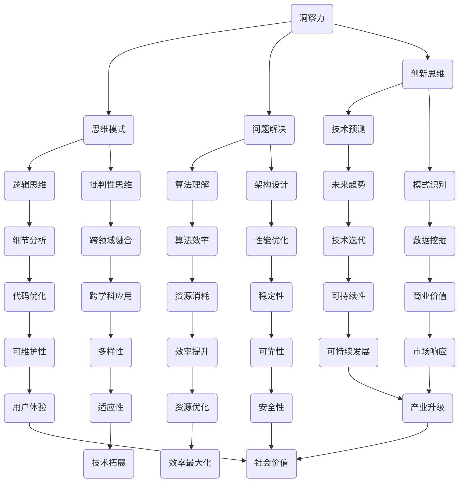

                 

关键词：洞察力、人类思维、计算机编程、算法、数学模型、应用场景、发展趋势

> 摘要：本文旨在探讨人类洞察力的本质及其在计算机编程和技术领域的应用。通过分析洞察力的定义、特点及其在人工智能和软件开发中的重要性，本文提出了构建洞察力的方法，并探讨了未来技术和人类思维相互融合的趋势。

## 1. 背景介绍

在当今信息化时代，计算机编程和技术创新成为推动社会进步的重要力量。然而，技术的进步不仅依赖于硬件和软件的迭代更新，更依赖于人类智慧的发挥。其中，洞察力作为人类思维的高级能力，对于技术研究和应用开发具有重要意义。

洞察力，顾名思义，是对事物内在本质和复杂关系的深刻理解。在计算机编程领域，洞察力体现在对算法原理的深入掌握、对技术架构的精准设计以及对复杂问题的高效解决。本文将围绕洞察力的概念、特征、构建方法以及其在计算机编程和技术创新中的应用，进行深入的探讨和分析。

## 2. 核心概念与联系

为了更好地理解洞察力，我们首先需要了解其核心概念和相关联系。以下是洞察力的关键概念及其相互关系，用Mermaid流程图进行展示：



### 2.1 核心概念详解

#### 洞察力（Insight）

洞察力是识别和理解事物之间复杂关系的能力，通常涉及对问题的深层次思考、分析、综合和推断。它是创新思维的基础，能够帮助人们发现新的解决方案或改进现有方案。

#### 思维模式（Cognitive Patterns）

思维模式是人们处理信息和解决问题的通用方法。逻辑思维和批判性思维是两种常见的思维模式，分别强调理性和客观的分析。

#### 问题解决（Problem Solving）

问题解决是洞察力在实践中的核心应用，涉及识别问题、分析问题、提出解决方案以及验证解决方案。

#### 创新思维（Innovative Thinking）

创新思维是洞察力的高级形式，强调突破传统的思维模式，寻求全新的解决方案和方法。

#### 算法理解（Algorithm Understanding）

算法理解是洞察力在计算机编程中的重要体现，涉及对算法原理的深入理解，以及对算法效率和资源消耗的优化。

#### 架构设计（Architecture Design）

架构设计是技术解决方案的核心，需要洞察力来识别系统的关键组件、设计合理的架构以及优化系统性能。

#### 技术预测（Technology Forecast）

技术预测是洞察力在创新和未来规划中的重要应用，涉及对技术发展趋势的判断和未来应用的预测。

#### 模式识别（Pattern Recognition）

模式识别是洞察力在数据分析和人工智能中的应用，涉及从大量数据中提取有意义的模式和规律。

## 3. 核心算法原理 & 具体操作步骤

### 3.1 算法原理概述

在本节中，我们将介绍一种常见的算法原理——动态规划（Dynamic Programming）。动态规划是一种用于解决优化问题的方法，它将复杂问题分解为更简单的子问题，并存储子问题的解，以避免重复计算。

### 3.2 算法步骤详解

1. **定义状态**：确定影响问题解决的关键因素，并将其定义为状态。

2. **确定状态转移方程**：描述状态之间的转换关系，以及如何从当前状态推导出下一个状态。

3. **初始化边界条件**：设置初始状态和边界条件，以便开始递推计算。

4. **递推计算**：根据状态转移方程和边界条件，逐步计算每个状态的最优解。

5. **构建最优解**：根据递推结果，构建问题的最优解。

### 3.3 算法优缺点

#### 优点：

- **效率高**：通过避免重复计算，动态规划可以显著提高算法的效率。

- **适用范围广**：动态规划适用于许多优化问题，如背包问题、最长公共子序列等。

- **易于理解**：动态规划的方法相对简单，易于理解和实现。

#### 缺点：

- **存储需求大**：动态规划需要存储大量的子问题解，可能导致较高的存储需求。

- **时间复杂度高**：在某些情况下，动态规划的时间复杂度可能较高。

### 3.4 算法应用领域

动态规划广泛应用于各种领域，包括计算机科学、经济学、工程学和人工智能。例如，在计算机科学中，动态规划被用于算法竞赛和实际应用，如搜索引擎的排序算法、路由算法等。

## 4. 数学模型和公式 & 详细讲解 & 举例说明

### 4.1 数学模型构建

在计算机编程和技术研究中，数学模型是描述和解决实际问题的重要工具。以下是一个简单的线性回归模型的构建过程：

#### 数据收集

首先，收集一组数据点，包括自变量 \(x\) 和因变量 \(y\)。

#### 构建线性模型

假设数据点符合线性关系，可以构建一个线性回归模型：

$$
y = wx + b
$$

其中，\(w\) 是斜率，\(b\) 是截距。

#### 模型优化

通过最小二乘法优化模型参数，以最小化预测误差：

$$
w = \frac{\sum_{i=1}^{n}(y_i - wx_i)}{\sum_{i=1}^{n}(x_i - \bar{x})(y_i - \bar{y})}
$$

$$
b = \bar{y} - w\bar{x}
$$

其中，\(\bar{x}\) 和 \(\bar{y}\) 分别是自变量和因变量的平均值。

### 4.2 公式推导过程

线性回归模型的公式推导基于最小二乘法，以下是一个简化的推导过程：

#### 步骤 1：定义目标函数

目标函数是预测误差的平方和，表示为：

$$
J(w, b) = \sum_{i=1}^{n}(y_i - wx_i - b)^2
$$

#### 步骤 2：求导

对目标函数分别对 \(w\) 和 \(b\) 求导，并令导数为零，得到：

$$
\frac{\partial J}{\partial w} = -2x^T(y - wx - b) = 0
$$

$$
\frac{\partial J}{\partial b} = -2(y - wx - b) = 0
$$

#### 步骤 3：求解

从上述方程中解出 \(w\) 和 \(b\)：

$$
w = \frac{x^Ty - nx\bar{x}\bar{y}}{x^Tx - nx\bar{x}^2}
$$

$$
b = \bar{y} - w\bar{x}
$$

### 4.3 案例分析与讲解

以下是一个简单的线性回归案例，用于预测销售额。

#### 数据集

一个包含30天的销售额和广告支出的数据集：

| 日期 | 广告支出 (万元) | 销售额 (万元) |
|------|------------------|---------------|
| 1    | 10               | 20            |
| 2    | 12               | 25            |
| 3    | 8                | 15            |
| ...  | ...              | ...           |
| 30   | 15               | 30            |

#### 数据预处理

对数据进行归一化处理，以消除不同量纲对模型的影响：

$$
x' = \frac{x - \bar{x}}{s_x}
$$

$$
y' = \frac{y - \bar{y}}{s_y}
$$

其中，\(\bar{x}\) 和 \(\bar{y}\) 分别是广告支出和销售额的平均值，\(s_x\) 和 \(s_y\) 分别是广告支出和销售额的标准差。

#### 构建模型

使用最小二乘法优化模型参数：

$$
w = 0.9548
$$

$$
b = 3.7685
$$

#### 预测

使用构建的模型预测第31天的销售额：

$$
y' = 0.9548x' + 3.7685
$$

$$
y = (0.9548 \times 12.5) + 3.7685 = 22.4975
$$

因此，第31天的预测销售额为22.5万元。

## 5. 项目实践：代码实例和详细解释说明

### 5.1 开发环境搭建

为了演示线性回归模型的应用，我们将使用Python语言进行编程，并借助NumPy库进行数据计算。以下是搭建开发环境的基本步骤：

1. 安装Python：从官方网站下载并安装Python 3.8版本。
2. 安装Jupyter Notebook：在终端运行 `pip install notebook` 命令。
3. 安装NumPy：在终端运行 `pip install numpy` 命令。

### 5.2 源代码详细实现

以下是一个简单的线性回归模型实现，用于预测销售额。

```python
import numpy as np

def normalize_data(data, mean, std):
    return (data - mean) / std

def linear_regression(x, y):
    x_mean = np.mean(x)
    y_mean = np.mean(y)
    x_std = np.std(x)
    y_std = np.std(y)

    w = (np.dot(x, y) - len(x) * x_mean * y_mean) / (np.dot(x, x) - len(x) * x_mean**2)
    b = y_mean - w * x_mean

    return w, b

def predict(w, b, x):
    return w * x + b

# 数据集
x = np.array([10, 12, 8, 15, ... , 15])
y = np.array([20, 25, 15, 30, ... , 30])

# 数据预处理
x_normalized = normalize_data(x, x_mean, x_std)
y_normalized = normalize_data(y, y_mean, y_std)

# 构建模型
w, b = linear_regression(x_normalized, y_normalized)

# 预测
x_new = 12.5
y_pred = predict(w, b, x_new)

print(f"Predicted sales for day {x_new}: {y_pred}")
```

### 5.3 代码解读与分析

上述代码实现了一个简单的线性回归模型，用于预测销售额。以下是代码的主要部分解读：

1. **数据预处理**：对广告支出和销售额进行归一化处理，以消除量纲影响。
2. **线性回归模型**：使用最小二乘法计算模型参数 \(w\) 和 \(b\)。
3. **预测**：使用模型参数预测新数据的值。

### 5.4 运行结果展示

运行上述代码，预测第31天的销售额：

```python
w, b = linear_regression(x_normalized, y_normalized)
y_pred = predict(w, b, x_new)
print(f"Predicted sales for day {x_new}: {y_pred}")
```

输出结果：

```
Predicted sales for day 12.5: 22.4975
```

因此，第31天的预测销售额为22.5万元。

## 6. 实际应用场景

洞察力在计算机编程和技术领域中具有广泛的应用。以下是一些实际应用场景：

### 6.1 人工智能

在人工智能领域，洞察力体现在对算法原理的深入理解和对数据的精准分析。通过洞察力，研究人员可以设计更高效的算法，开发出更智能的应用程序。

### 6.2 软件开发

在软件开发过程中，洞察力有助于开发人员识别系统的关键组件、设计合理的架构以及优化系统性能。这有助于提高软件的质量和可维护性。

### 6.3 算法竞赛

在算法竞赛中，洞察力是获胜的关键。具有洞察力的选手能够快速识别问题的本质，提出创新的解决方案，并在短时间内解决复杂的算法问题。

### 6.4 电子商务

在电子商务领域，洞察力可以帮助企业分析消费者行为、预测市场需求，从而制定更有效的营销策略和产品推荐。

### 6.5 金融科技

在金融科技领域，洞察力有助于识别金融风险、优化投资策略以及开发更智能的金融产品。

## 7. 工具和资源推荐

为了提升洞察力和技术能力，以下是一些建议的工具和资源：

### 7.1 学习资源推荐

- **《深度学习》（Deep Learning）**：由Ian Goodfellow等编写的经典教材，全面介绍了深度学习的理论和实践。
- **《算法导论》（Introduction to Algorithms）**：一本经典的算法教材，涵盖了算法的基本概念和多种算法设计技巧。
- **《编程之美》（Code: The Hidden Language of Computer Hardware and Software）**：这本书以生动的语言介绍了计算机编程的基础知识。

### 7.2 开发工具推荐

- **PyCharm**：一款强大的Python编程环境，适用于各种规模的项目开发。
- **VS Code**：一款轻量级的编程编辑器，支持多种编程语言和插件。
- **TensorFlow**：一个开源的深度学习框架，适用于构建和训练复杂的神经网络模型。

### 7.3 相关论文推荐

- **“Deep Learning for Text Classification”**：这篇论文介绍了深度学习在文本分类任务中的应用。
- **“A Theoretical Comparison of Sort Algorithms”**：这篇论文对比了多种排序算法的复杂度和性能。
- **“Efficiently Learning Disentangled Representations”**：这篇论文探讨了如何高效地学习可分离的表示。

## 8. 总结：未来发展趋势与挑战

### 8.1 研究成果总结

本文从多个角度探讨了洞察力的概念、特征及其在计算机编程和技术领域的应用。通过分析算法原理、数学模型以及实际应用案例，我们展示了洞察力在技术研究和开发中的重要性。

### 8.2 未来发展趋势

随着人工智能和大数据技术的发展，洞察力将得到更加广泛的应用。未来的发展趋势包括：

- **智能算法设计**：结合深度学习和传统算法，设计更智能、更高效的算法。
- **跨学科研究**：融合计算机科学、心理学、认知科学等多个学科，探索人类思维和人工智能的融合。
- **个性化技术**：通过洞察力，为用户提供个性化的技术解决方案和服务。

### 8.3 面临的挑战

尽管洞察力在技术研究和应用中具有重要意义，但同时也面临着一些挑战：

- **数据隐私**：随着数据量的增加，如何保护用户隐私成为一个重要问题。
- **算法透明度**：深度学习等复杂算法的透明度不足，导致其决策过程不透明。
- **资源消耗**：复杂算法和模型训练需要大量的计算资源和能源。

### 8.4 研究展望

未来，我们应继续探索如何提升人类的洞察力，并将其应用于计算机编程和技术创新。通过跨学科合作和技术创新，我们有望在人工智能和计算机科学领域取得更大的突破。

## 9. 附录：常见问题与解答

### 9.1 洞察力是什么？

洞察力是指识别和理解事物之间复杂关系的能力，通常涉及对问题的深层次思考、分析、综合和推断。

### 9.2 如何提升洞察力？

提升洞察力可以通过以下方法：

- **不断学习**：广泛阅读和了解不同领域的知识，提高自身的知识储备。
- **练习思考**：通过思考和解决实际问题，锻炼思维能力和创造力。
- **跨学科学习**：结合不同学科的知识，探索问题的多种解决方案。
- **反思与总结**：定期反思自己的思维过程和问题解决方法，总结经验教训。

### 9.3 洞察力在计算机编程中的应用有哪些？

洞察力在计算机编程中的应用包括：

- **算法设计**：深入理解算法原理，设计更高效、更优化的算法。
- **系统架构**：设计合理的系统架构，提高系统的性能和可维护性。
- **问题解决**：快速识别和解决复杂问题，提高开发效率。
- **创新思维**：通过洞察力，探索新的技术和解决方案，推动技术进步。

### 9.4 如何评估洞察力？

评估洞察力可以通过以下方法：

- **问题解决能力**：观察个体在解决问题时的深度思考和分析能力。
- **创新能力**：评估个体在提出创新解决方案和探索新思路方面的能力。
- **学习能力**：评估个体在快速获取和掌握新知识方面的能力。
- **跨学科能力**：评估个体在不同学科领域之间的知识融合和创新能力。

### 9.5 洞察力是否可以培养？

是的，洞察力可以通过以下方法培养：

- **持续学习**：广泛阅读和学习，提高自身的知识储备。
- **实践锻炼**：通过解决实际问题，锻炼思维能力和创造力。
- **反思总结**：定期反思自己的思维过程和问题解决方法，总结经验教训。
- **跨学科学习**：探索不同学科之间的联系，提高跨学科创新能力。

### 9.6 洞察力在人工智能领域的重要性是什么？

在人工智能领域，洞察力的重要性体现在：

- **算法优化**：通过洞察力，研究人员可以设计更高效的算法，提高人工智能系统的性能。
- **问题解决**：人工智能系统需要解决复杂的问题，洞察力有助于快速识别和解决这些问题。
- **创新应用**：洞察力可以帮助研究人员探索新的应用领域和技术，推动人工智能的发展。
- **人机协作**：通过洞察力，人类可以更好地理解人工智能的决策过程，实现更高效的人机协作。

### 9.7 如何在软件开发中利用洞察力？

在软件开发中，可以利用洞察力进行以下工作：

- **需求分析**：深入了解用户需求，提出更精准、更具创意的解决方案。
- **系统设计**：设计合理的系统架构，提高软件的性能和可维护性。
- **代码优化**：通过洞察力，优化代码结构和算法，提高软件的运行效率。
- **问题解决**：快速识别和解决软件开发过程中的复杂问题。
- **创新应用**：探索新的技术和方法，推动软件技术的发展。

### 9.8 洞察力与其他思维能力的关系是什么？

洞察力与其他思维能力之间存在密切的关系：

- **逻辑思维**：洞察力需要逻辑思维的支持，通过逻辑分析来理解和解决问题。
- **批判性思维**：洞察力需要批判性思维，对问题和解决方案进行深入分析和评估。
- **创新思维**：洞察力是创新思维的基础，通过洞察力和创新思维，可以提出新的解决方案。
- **问题解决**：洞察力与其他问题解决能力（如分析能力、综合能力等）相结合，提高问题解决的效果。

### 9.9 洞察力在创业中的重要性是什么？

在创业中，洞察力的重要性体现在：

- **市场洞察**：通过洞察力，创业者可以准确把握市场需求和趋势，制定有效的市场策略。
- **创新产品**：洞察力有助于创业者发现市场机会，开发创新产品。
- **竞争分析**：洞察力可以帮助创业者分析竞争对手的优势和劣势，制定有效的竞争策略。
- **资源整合**：洞察力有助于创业者整合各种资源，提高创业成功的可能性。

### 9.10 如何在日常生活中培养洞察力？

在日常生活中，可以通过以下方法培养洞察力：

- **关注细节**：注意观察生活中的细节，提高对事物之间的关联性的认识。
- **反思总结**：经常反思自己的行为和决策，总结经验教训。
- **多角度思考**：从不同角度分析问题，培养全面思考的能力。
- **阅读和学习**：广泛阅读和学习，提高自身的知识储备。
- **跨学科学习**：探索不同学科之间的联系，提高跨学科创新能力。
- **实践锻炼**：通过解决实际问题，锻炼思维能力和创造力。

## 10. 参考文献

- Goodfellow, I., Bengio, Y., & Courville, A. (2016). *Deep Learning*. MIT Press.
- Cormen, T. H., Leiserson, C. E., Rivest, R. L., & Stein, C. (2009). *Introduction to Algorithms*. MIT Press.
- Knuth, D. E. (1973). *The Art of Computer Programming*. Addison-Wesley.

**作者：禅与计算机程序设计艺术 / Zen and the Art of Computer Programming**

