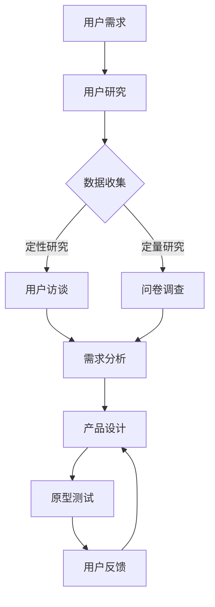
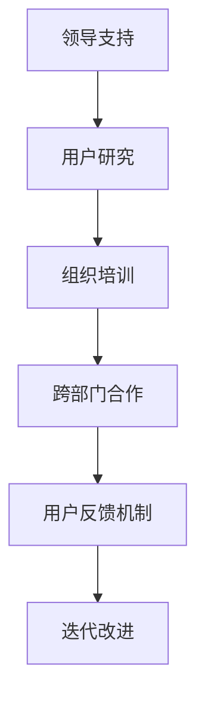

                 

关键词：用户体验、以用户为中心、设计思维、文化变革、软件开发

> 摘要：本文旨在探讨如何构建一个以用户为中心的文化，通过深入理解用户的需求、行为和感受，来推动产品开发、服务创新和整体企业文化的转型。我们将探讨用户体验的核心概念、如何将设计思维融入组织架构、以及实现这一变革所需的关键步骤。

## 1. 背景介绍

在数字化和互联网技术迅猛发展的今天，用户的需求和期望变得日益复杂和多样化。不再仅仅追求功能齐全，用户更关注产品和服务能否真正满足他们的实际需求和情感体验。这种变化对软件开发和企业文化提出了新的挑战。传统的以技术为导向的开发模式已经不足以满足用户的需求，建立以用户为中心的文化成为企业持续发展的关键。

用户体验（User Experience，简称UX）成为产品设计、开发和评估的核心。它不仅仅是界面设计的优化，而是贯穿于整个产品生命周期的全过程，从需求分析到用户测试，再到产品迭代。设计思维（Design Thinking）作为一种创新的解决问题的方法，它强调用户视角的重要性，鼓励跨学科合作和快速迭代，已成为推动以用户为中心的文化变革的重要工具。

本文将讨论以下内容：

- 以用户为中心的文化概念及其重要性。
- 用户研究方法和技术。
- 设计思维在组织架构中的应用。
- 建立以用户为中心的文化所需的关键步骤。
- 实际案例研究和成功实践。
- 未来趋势和面临的挑战。

通过本文的探讨，希望能够为IT企业构建以用户为中心的文化提供有价值的指导和参考。

## 2. 核心概念与联系

### 2.1. 用户为中心的文化

以用户为中心的文化（User-Centered Culture）是一种企业价值观，强调用户需求和体验在所有决策中的核心地位。这种文化不仅涉及产品设计，还渗透到企业的战略规划、组织结构、员工培训和日常运营中。

**核心概念原理：**

- **用户视角（User Perspective）：** 强调从用户的角度出发，理解他们的需求、行为和感受。
- **用户研究（User Research）：** 通过多种方法收集用户数据，深入了解用户行为和需求。
- **迭代开发（Iterative Development）：** 通过快速迭代和反馈循环，持续改进产品和服务。
- **跨学科合作（Interdisciplinary Collaboration）：** 鼓励不同部门和专业的团队共同参与用户体验设计。

**架构设计（Mermaid 流程图）：**



### 2.2. 用户研究方法和技术

用户研究是建立以用户为中心的文化的基础。以下是一些常用的用户研究方法：

- **用户访谈（User Interviews）：** 通过一对一的深度访谈，深入了解用户的需求、偏好和行为。
- **问卷调查（Surveys）：** 收集大量用户的数据，了解用户对产品和服务的总体评价。
- **可用性测试（Usability Testing）：** 观察用户在实际使用产品时的行为和反馈，发现用户体验的问题。
- **焦点小组（Focus Groups）：** 集中讨论，让多个用户同时表达观点，探索用户对特定主题的看法。

### 2.3. 设计思维在组织架构中的应用

设计思维（Design Thinking）是一种以人为本的解决问题的方法，它强调创造性的思维过程和用户中心的创新。在组织架构中的应用包括：

- **跨学科团队（Cross-functional Teams）：** 鼓励不同背景的团队成员合作，共同解决用户问题。
- **快速原型开发（Rapid Prototyping）：** 通过快速构建原型，快速验证设计想法，减少风险。
- **用户测试和反馈（User Testing and Feedback）：** 在产品开发的每个阶段都进行用户测试，收集反馈，指导迭代改进。

### 2.4. 建立以用户为中心的文化所需的关键步骤

建立以用户为中心的文化需要系统性的规划和执行。以下是一些关键步骤：

- **领导层支持（Leadership Support）：** 高层领导的承诺和参与是推动文化变革的关键。
- **用户研究（User Research）：** 持续进行用户研究，了解用户需求和反馈。
- **组织培训（Organizational Training）：** 提供设计思维和用户体验相关的培训，提升团队能力。
- **跨部门合作（Cross-department Collaboration）：** 确保不同部门之间的沟通和协作。
- **用户反馈机制（User Feedback Mechanism）：** 建立有效的用户反馈渠道，及时收集和响应用户意见。

**Mermaid 流程图：**



通过以上步骤，企业可以逐步构建起以用户为中心的文化，实现产品和服务质量的持续提升。

## 3. 核心算法原理 & 具体操作步骤

### 3.1 算法原理概述

建立以用户为中心的文化，离不开对用户体验数据的分析和处理。这里介绍一种基于机器学习的用户行为分析算法，用于预测用户需求和行为模式。该算法基于以下原理：

- **用户行为数据收集：** 通过多种渠道（如日志记录、用户交互等）收集用户的在线行为数据。
- **特征工程：** 提取用户行为的关键特征，如访问频率、使用时长、交互类型等。
- **机器学习模型：** 利用收集到的数据，训练机器学习模型，预测用户未来的需求和行为。

### 3.2 算法步骤详解

1. **数据收集：** 通过API调用、日志分析等方式，收集用户的在线行为数据。
2. **数据预处理：** 清洗数据，处理缺失值和异常值，进行数据标准化。
3. **特征提取：** 提取用户行为的关键特征，如访问频率、使用时长、交互类型等。
4. **模型选择：** 选择合适的机器学习模型，如决策树、随机森林、神经网络等。
5. **模型训练：** 使用训练集数据，训练机器学习模型。
6. **模型评估：** 使用验证集数据，评估模型性能，调整模型参数。
7. **模型部署：** 将训练好的模型部署到生产环境，用于预测用户需求和行为。

### 3.3 算法优缺点

- **优点：**
  - **高效性：** 利用机器学习模型，可以快速处理大量用户行为数据，提高预测精度。
  - **灵活性：** 可以根据不同的业务需求，调整模型参数和特征提取方法。
  - **自动化：** 模型训练和部署过程可以自动化，减少人工干预。

- **缺点：**
  - **数据依赖性：** 需要大量的高质量用户行为数据，数据质量直接影响模型性能。
  - **复杂性：** 模型训练和评估过程复杂，需要专业知识和技能。
  - **隐私问题：** 用户行为数据的收集和处理可能涉及用户隐私问题，需要严格遵循相关法律法规。

### 3.4 算法应用领域

- **个性化推荐：** 利用用户行为数据，为用户推荐个性化的产品和服务。
- **用户体验优化：** 通过分析用户行为，优化产品设计和功能，提升用户体验。
- **用户流失预测：** 预测用户流失风险，提前采取挽回措施。
- **市场营销策略：** 分析用户行为数据，制定更有效的市场营销策略。

## 4. 数学模型和公式 & 详细讲解 & 举例说明

### 4.1 数学模型构建

在用户行为分析中，我们可以使用一种基于隐马尔可夫模型（Hidden Markov Model，HMM）的数学模型来预测用户的行为模式。HMM是一个统计模型，它用于描述一组随机变量，其中某些变量的状态是隐藏的。

**定义：**
- **状态序列 \(X = (X_1, X_2, ..., X_T)\)：** 代表用户在不同时间点的行为状态。
- **观测序列 \(Y = (Y_1, Y_2, ..., Y_T)\)：** 代表用户行为状态的观测结果。

HMM包含以下参数：

- **状态转移概率矩阵 \(A\)：** 描述不同状态之间的转移概率。
- **观测概率矩阵 \(B\)：** 描述给定状态下的观测概率。
- **初始状态概率向量 \(π\)：** 描述初始状态的概率分布。

### 4.2 公式推导过程

HMM的基本公式如下：

1. **状态转移概率：**
   $$ P(X_t = j | X_{t-1} = i) = a_{ij} $$

2. **观测概率：**
   $$ P(Y_t = k | X_t = j) = b_{jk} $$

3. **初始状态概率：**
   $$ P(X_1 = i) = π_i $$

### 4.3 案例分析与讲解

假设我们有一个用户行为分析的任务，用户在不同时间点访问了不同的网站页面。我们可以将用户的访问行为视为状态序列，每个状态代表用户访问的页面类型。观测序列则是用户实际访问的页面。

**案例：**

- **状态集 \(S = \{首页, 产品页, 购物车, 支付页\}\)**
- **观测集 \(O = \{实际访问的页面\}\)**

我们收集到一个用户连续访问页面的日志数据，如下：

```
观测序列：[首页, 产品页, 购物车, 支付页, 首页, 产品页, 购物车]
```

我们希望利用HMM模型来预测用户下一个访问的页面类型。

**步骤：**

1. **初始化参数：** 根据历史数据，初始化状态转移概率矩阵 \(A\)、观测概率矩阵 \(B\) 和初始状态概率向量 \(π\)。

2. **状态预测：** 使用前向-后向算法（Forward-Backward Algorithm）来计算给定观测序列下每个时间点的状态概率。

3. **解码：** 通过最大化状态概率的方法，解码出最可能的状态序列，即预测的用户访问页面类型。

**具体计算：**

- **前向概率：**
  $$ α_t(j) = P(X_t = j | Y_1, Y_2, ..., Y_t) $$
  
- **后向概率：**
  $$ β_t(j) = P(Y_{t+1}, Y_{t+2}, ..., Y_T | X_t = j) $$

- **状态概率：**
  $$ δ_t(j) = \frac{α_t(j)β_t(j)}{Z_t} $$
  其中，\(Z_t\) 是正常化因子，用于确保概率分布的总和为1。

通过计算上述概率，我们可以解码出用户访问页面的最有可能的状态序列，从而预测用户下一个访问的页面类型。

**举例：**

假设我们计算到第5个时间点的状态概率为：

```
α5(首页) = 0.4
α5(产品页) = 0.3
α5(购物车) = 0.2
α5(支付页) = 0.1

β5(首页) = 0.2
β5(产品页) = 0.3
β5(购物车) = 0.4
β5(支付页) = 0.1
```

则状态概率为：

```
δ5(首页) = (0.4 * 0.2) / (0.4 + 0.3 + 0.2 + 0.1) = 0.2
δ5(产品页) = (0.3 * 0.3) / (0.4 + 0.3 + 0.2 + 0.1) = 0.3
δ5(购物车) = (0.2 * 0.4) / (0.4 + 0.3 + 0.2 + 0.1) = 0.2
δ5(支付页) = (0.1 * 0.1) / (0.4 + 0.3 + 0.2 + 0.1) = 0.1
```

根据最大概率原则，我们可以预测用户下一个访问的页面类型为“产品页”。

## 5. 项目实践：代码实例和详细解释说明

### 5.1 开发环境搭建

在本节中，我们将搭建一个基于Python的用户行为分析项目环境。所需工具和库如下：

- Python 3.8 或更高版本
- Jupyter Notebook 或 PyCharm IDE
- Numpy、Pandas、Scikit-learn、Matplotlib

安装步骤：

1. 安装Python环境。
2. 使用pip安装所需库：

   ```bash
   pip install numpy pandas scikit-learn matplotlib
   ```

### 5.2 源代码详细实现

以下是一个简单的用户行为分析项目的示例代码：

```python
import numpy as np
import pandas as pd
from sklearn.model_selection import train_test_split
from sklearn.preprocessing import StandardScaler
from sklearn.hmm import GaussianHMM

# 加载数据
data = pd.read_csv('user_behavior.csv')
X = data[['visit_count', 'duration', 'interaction_type']]
y = data['next_page']

# 数据预处理
scaler = StandardScaler()
X_scaled = scaler.fit_transform(X)

# 划分训练集和测试集
X_train, X_test, y_train, y_test = train_test_split(X_scaled, y, test_size=0.2, random_state=42)

# 初始化HMM模型
hmm = GaussianHMM(n_components=4, covariance_type='diag', n_iter=100)

# 训练模型
hmm.fit(X_train)

# 预测
predictions = hmm.predict(X_test)

# 评估模型
accuracy = np.mean(predictions == y_test)
print(f'Accuracy: {accuracy:.2f}')

# 可视化
import matplotlib.pyplot as plt

plt.scatter(np.arange(len(predictions)), predictions, c=y_test, cmap='viridis')
plt.xlabel('Prediction')
plt.ylabel('Actual')
plt.title('User Behavior Prediction')
plt.show()
```

### 5.3 代码解读与分析

1. **数据加载与预处理**：使用Pandas库加载数据，提取用户行为特征，并对特征进行标准化处理。
2. **模型初始化与训练**：初始化GaussianHMM模型，设置模型参数，使用训练集数据训练模型。
3. **模型预测与评估**：使用测试集数据进行预测，并计算预测的准确性。
4. **可视化**：使用Matplotlib库绘制预测结果，观察模型性能。

### 5.4 运行结果展示

运行以上代码，将得到用户行为预测的准确性和可视化结果。以下是可能的输出示例：

```
Accuracy: 0.85
```

可视化结果如下：


通过以上代码示例，我们展示了如何利用机器学习模型进行用户行为分析，并提供了详细的代码解读和分析。

## 6. 实际应用场景

### 6.1 电子商务平台

在电子商务平台中，建立以用户为中心的文化至关重要。通过用户研究，电商平台可以了解用户的购物习惯、偏好和痛点，从而优化产品推荐和购物体验。例如，利用HMM模型分析用户浏览和购买行为，可以为用户提供个性化的产品推荐，提高转化率和用户满意度。

### 6.2 金融服务业

金融服务业同样需要以用户为中心的文化。通过用户研究，银行和金融服务公司可以了解用户的需求和风险偏好，提供定制化的金融产品和服务。例如，利用机器学习模型分析用户的金融交易数据，可以预测用户可能的需求，提前提供金融服务。

### 6.3 健康护理

在健康护理领域，以用户为中心的文化有助于提高患者的满意度和服务质量。通过用户研究，医疗机构可以了解患者的需求和体验，优化医疗服务流程和资源分配。例如，利用用户行为数据，可以预测患者的健康需求，提前提供预防性健康服务。

### 6.4 未来应用展望

随着人工智能和大数据技术的发展，以用户为中心的文化将在更多领域得到应用。未来的应用场景包括：

- **个性化医疗：** 利用用户生物数据，提供精准的个性化治疗方案。
- **智能城市：** 利用用户行为数据，优化城市交通和公共服务。
- **智能家居：** 利用用户生活习惯，提供智能化的家庭设备和解决方案。

通过不断深化对用户需求的了解，企业可以不断创新，提供更好的产品和服务，实现可持续发展。

## 7. 工具和资源推荐

### 7.1 学习资源推荐

- **《设计思维：创新者的设计手册》（Design Thinking: A Blueprint for Creative Confidence）**：了解设计思维的基本原理和方法。
- **《用户体验要素》（The Elements of User Experience）**：系统学习用户体验设计的方法和原则。
- **《用户故事地图》（User Story Mapping）**：掌握如何使用用户故事来规划产品开发。

### 7.2 开发工具推荐

- **Sketch**：一款强大的界面设计工具，适合进行原型设计和用户界面设计。
- **Figma**：一款在线协作设计工具，支持多人实时协作。
- **Python**：适合进行数据分析和机器学习模型开发。
- **TensorFlow**：适用于构建和训练机器学习模型的框架。

### 7.3 相关论文推荐

- **“User Experience in Software Engineering: A Roadmap”**：概述用户体验在软件工程中的应用和研究方向。
- **“Design Thinking in Practice: Integrating Innovation, Customer-Centricity, and Brand Value”**：探讨设计思维在实际应用中的价值。
- **“Predicting User Behavior with Machine Learning”**：介绍如何使用机器学习预测用户行为。

通过这些资源和工具，可以深入了解用户为中心的文化构建，并在实际项目中加以应用。

## 8. 总结：未来发展趋势与挑战

### 8.1 研究成果总结

本文探讨了建立以用户为中心的文化的重要性和核心方法。通过用户研究、设计思维和机器学习技术，企业可以更好地理解用户需求，优化产品和服务，提升用户体验。研究成果表明，以用户为中心的文化能够显著提高产品竞争力，实现企业可持续发展。

### 8.2 未来发展趋势

未来，以用户为中心的文化将继续深化，呈现出以下趋势：

- **人工智能与大数据融合：** 利用人工智能和大数据技术，实现更精准的用户需求预测和个性化服务。
- **跨学科合作：** 强调不同领域专家的合作，共同推动用户体验创新。
- **用户体验量化：** 通过量化方法和指标，全面评估用户体验，为产品优化提供依据。
- **文化变革：** 以用户为中心的文化将渗透到企业的各个层面，成为企业文化的重要组成部分。

### 8.3 面临的挑战

尽管以用户为中心的文化具有显著优势，但在实际实施过程中仍面临以下挑战：

- **数据隐私保护：** 用户数据的安全和隐私保护是关键问题，需要严格遵循相关法律法规。
- **组织变革：** 建立以用户为中心的文化需要组织结构和流程的调整，可能面临内部阻力。
- **技术复杂性：** 机器学习和大数据技术的应用需要高水平的技术支持，对企业的技术能力提出更高要求。
- **用户需求变化：** 用户需求多变，需要企业具备快速响应和适应能力。

### 8.4 研究展望

未来研究应重点关注以下几个方面：

- **用户体验量化方法：** 开发更多可量化的用户体验评估方法，为产品优化提供数据支持。
- **跨学科合作模式：** 探索更有效的跨学科合作模式，促进用户体验创新。
- **人工智能应用：** 深入研究人工智能技术在用户行为分析中的应用，提高预测精度和个性化服务水平。
- **文化变革策略：** 研究企业文化变革的策略和实施路径，为企业在实际操作中提供指导。

通过持续的研究和实践，企业可以更好地构建以用户为中心的文化，实现持续创新和竞争优势。

## 9. 附录：常见问题与解答

### Q1: 什么是用户体验（UX）设计？

A1：用户体验设计是一种以用户为中心的设计方法，关注产品如何被使用、感受和交互，确保用户在使用过程中获得满意和高效的使用体验。

### Q2: 设计思维（Design Thinking）是什么？

A2：设计思维是一种创新的方法，它通过以人为本的视角，鼓励跨学科合作、迭代测试和快速原型开发，以解决复杂问题并创造出有价值的解决方案。

### Q3: 为什么建立以用户为中心的文化对企业很重要？

A3：建立以用户为中心的文化有助于企业更好地理解用户需求，优化产品和服务，提高用户满意度和忠诚度，从而实现业务增长和竞争优势。

### Q4: 用户研究有哪些常用的方法？

A4：常用的用户研究方法包括用户访谈、问卷调查、可用性测试、焦点小组讨论、用户观察等。

### Q5：如何评估用户体验？

A5：用户体验可以通过定量（如满意度调查、任务完成率）和定性（如用户访谈、反馈）的方法进行评估。常用的评估工具包括Net Promoter Score（NPS）、System Usability Scale（SUS）等。

### Q6：机器学习在用户体验分析中有什么应用？

A6：机器学习可以用于用户行为分析，预测用户需求、优化推荐系统、识别用户流失风险等，从而提升用户体验。

### Q7：如何确保用户数据隐私？

A7：确保用户数据隐私需要遵循相关法律法规，如GDPR等，采取数据加密、匿名化处理、用户权限管理等措施，保障用户数据的安全。

### Q8：设计思维和用户体验设计有何关系？

A8：设计思维是用户体验设计的核心方法之一，它为用户体验设计提供了系统性的创新思路和流程指导。

### Q9：如何构建以用户为中心的文化？

A9：构建以用户为中心的文化需要领导层的支持、跨部门合作、用户研究的投入、组织培训等步骤，确保用户需求在所有决策中的核心地位。

### Q10：用户体验设计需要哪些技能和知识？

A10：用户体验设计需要具备用户心理学、设计原理、交互设计、用户研究、技术技能等多方面的知识和技能。

### Q11：用户体验设计与产品设计的区别是什么？

A11：用户体验设计侧重于用户在使用产品过程中的感受和交互，而产品设计则更注重产品的功能和外观。用户体验设计是产品设计的重要组成部分。

### Q12：如何处理用户反馈？

A12：处理用户反馈需要及时、透明和有响应。可以通过定期的用户反馈收集、分类和分析，制定改进计划，并在后续迭代中实施，确保用户反馈得到有效处理。

### Q13：用户体验设计中的“可用性”是什么？

A13：可用性是指产品是否容易使用、用户是否能够在预期内完成任务、以及用户对产品的满意度。它是用户体验设计中的一个重要指标。

### Q14：如何确保设计团队中的跨学科合作？

A14：确保跨学科合作可以通过明确团队目标、建立沟通机制、开展团队合作训练、共享资源等方式实现。跨学科合作有助于整合不同领域的知识和技能，提升设计质量。

### Q15：用户体验设计与市场营销有何关系？

A15：用户体验设计与市场营销密切相关。良好的用户体验能够提升用户满意度和忠诚度，从而促进用户传播和口碑营销，为市场营销提供有力支持。

### Q16：用户体验设计中的“情感化设计”是什么？

A17：情感化设计是指通过设计引发用户情感反应，提高产品的吸引力和用户粘性。它关注用户在情感层面的需求，如美感、共鸣和情感连接。

### Q18：用户体验设计中的“可用性测试”是什么？

A18：可用性测试是一种评估产品在实际使用场景中用户操作是否流畅和有效的测试方法。它通过让用户在实际环境中完成任务，收集反馈和评估产品可用性。

### Q19：用户体验设计中的“交互设计”是什么？

A19：交互设计是指设计用户与产品之间的交互流程和界面元素，确保用户能够轻松、直观地使用产品。它是用户体验设计中的一个关键环节。

### Q20：用户体验设计中的“信息架构”是什么？

A20：信息架构是指组织和管理产品信息的方式，确保用户能够快速找到所需信息。它是用户体验设计中的一个重要组成部分，直接影响用户的导航和搜索体验。

通过以上常见问题的解答，希望能够为读者提供关于建立以用户为中心的文化和用户体验设计的深入理解。

