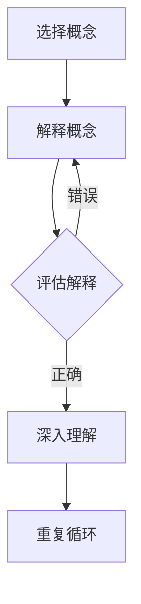

                 

关键词：费曼学习法、创造、理解、技术博客、深度思考

摘要：本文旨在探讨费曼学习法在技术学习中的应用，分析其如何促进个体对复杂技术的深入理解与创造力的培养，并分享一系列实用的学习方法和技巧。通过对费曼学习法的深入剖析，本文将为技术从业者提供一套有效的学习策略，帮助他们在快速变化的技术领域中持续成长。

## 1. 背景介绍

### 费曼学习法简介

费曼学习法（Feynman Technique）起源于著名物理学家理查德·费曼（Richard Feynman）的教学方法。费曼以其独特的教学风格和对复杂概念的解释能力而闻名。他提出，学习的过程应该像向一个小孩解释一个概念一样，简单、直观且富有逻辑性。费曼学习法的基本思路是：选择一个需要理解的概念，用自己的语言将其解释清楚，然后找出自己解释中的难点和盲点，进行深入学习。

### 技术学习中的挑战

在现代技术领域中，知识的更新速度非常快，技术从业者需要不断地学习新的技能和知识。然而，面对大量复杂的理论和技术，许多人在学习过程中会遇到以下挑战：

- 知识的深度和广度要求高，学习难度大。
- 缺乏系统的学习方法，容易陷入死记硬背的困境。
- 缺少实践机会，难以将理论知识转化为实际能力。

费曼学习法作为一种有效的学习方法，能够帮助解决上述问题，提高学习效率和理解深度。

## 2. 核心概念与联系

### 费曼学习法的核心概念

费曼学习法包括以下几个核心概念：

1. **清晰表达**：用简洁明了的语言将自己的理解表达出来。
2. **反馈与修正**：通过他人的反馈找出自己的盲点和错误，进行修正。
3. **深入理解**：针对发现的问题进行深入研究，巩固学习成果。

### 费曼学习法的架构

费曼学习法的架构可以分为以下几个步骤：

1. **选择概念**：选择一个需要深入理解的概念或知识点。
2. **解释概念**：用自己的语言将其解释给一个不懂这个概念的人。
3. **评估解释**：评估解释的清晰度和准确性，找出难点和盲点。
4. **深入研究**：针对难点和盲点进行深入学习，重新解释概念。
5. **重复循环**：不断重复上述步骤，直到能够清晰、准确地解释该概念。

### 费曼学习法的 Mermaid 流程图



## 3. 核心算法原理 & 具体操作步骤

### 3.1 算法原理概述

费曼学习法的核心算法原理是基于以下假设：

- 理解是通过表达和交流实现的。
- 通过解释过程中遇到的问题，可以揭示自己的知识盲点。
- 深入研究和重新解释是巩固知识和提升理解深度的关键。

### 3.2 算法步骤详解

1. **选择概念**：选择一个需要深入理解的技术概念或知识点。
2. **解释概念**：用自己的语言将其解释给一个不懂这个概念的人。解释过程中要尽量使用简单、直观的语言，避免使用专业术语。
3. **评估解释**：听取他人的反馈，评估解释的清晰度和准确性。如果解释不够清晰，说明自己的理解还不够深入。
4. **深入研究**：针对解释中的难点和盲点，进行深入学习。可以通过查阅资料、请教专家或进行实验等方式来加深理解。
5. **重新解释**：根据深入研究的成果，重新用自己的语言解释该概念。
6. **重复循环**：不断重复上述步骤，直到能够清晰、准确地解释该概念。

### 3.3 算法优缺点

**优点**：

- 提高理解深度：通过不断解释和重新解释，能够加深对知识的理解。
- 提高表达和沟通能力：在解释过程中，需要用简单、直观的语言将复杂的概念表达出来，从而提高表达和沟通能力。
- 促进知识整合：在深入研究和重新解释的过程中，能够将不同来源的知识进行整合，形成自己的知识体系。

**缺点**：

- 需要大量时间和精力：费曼学习法需要反复进行解释、评估和深入研究，因此需要投入大量的时间和精力。
- 对解释者的表达能力有较高要求：如果解释者的表达能力不足，可能会导致解释不够清晰，从而影响学习效果。

### 3.4 算法应用领域

费曼学习法可以应用于各种技术领域的知识学习，如：

- 编程：用于学习新的编程语言、框架或算法。
- 数据科学：用于学习统计学、机器学习、深度学习等领域的理论知识。
- 网络技术：用于学习网络协议、安全机制等。
- 软件工程：用于学习软件架构、设计模式、测试方法等。

## 4. 数学模型和公式 & 详细讲解 & 举例说明

### 4.1 数学模型构建

在费曼学习法中，可以构建一个简单的数学模型来描述学习过程。假设一个学习者在学习过程中经历了多次重复解释和深入研究，其理解程度可以用一个变量 \(U\) 表示，初始值为 \(U_0\)。每次重复解释和深入研究后，理解程度会发生变化，可以表示为：

$$
U_{new} = U_{old} + f(U_{old}, \Delta U)
$$

其中，\(f\) 表示理解程度的增长函数，\(\Delta U\) 表示每次重复解释和深入研究带来的理解提升。

### 4.2 公式推导过程

假设一个学习者在学习初始阶段，理解程度为 \(U_0\)。经过一次解释和深入研究后，理解程度变为 \(U_1\)。根据费曼学习法的原理，可以假设：

- 理解程度的变化与之前理解程度成正比。
- 理解程度的变化与深入研究带来的理解提升成正比。

因此，可以推导出理解程度的增长函数为：

$$
f(U_{old}, \Delta U) = k \cdot U_{old} \cdot \Delta U
$$

其中，\(k\) 为常数，表示理解程度变化的灵敏度。

将增长函数代入理解程度变化的公式，得到：

$$
U_{new} = U_{old} + k \cdot U_{old} \cdot \Delta U
$$

### 4.3 案例分析与讲解

假设一个编程初学者在学习 Python 编程语言时，初始理解程度 \(U_0\) 为 30%。在学习过程中，他选择了一个简单的算法进行解释和深入研究，每次重复解释和深入研究后的理解提升 \(\Delta U\) 为 10%。根据上述公式，可以计算出他的理解程度变化过程：

- 第一次解释和深入研究后，理解程度为 \(U_1 = U_0 + k \cdot U_0 \cdot \Delta U = 30% + 10% = 40%\)
- 第二次解释和深入研究后，理解程度为 \(U_2 = U_1 + k \cdot U_1 \cdot \Delta U = 40% + 10% \cdot 40% = 56%\)
- 第三次解释和深入研究后，理解程度为 \(U_3 = U_2 + k \cdot U_2 \cdot \Delta U = 56% + 10% \cdot 56% = 78%\)

通过这个简单的案例，我们可以看到，费曼学习法在提高理解程度方面具有显著的效果。随着重复解释和深入研究的次数增加，学习者的理解程度不断提高。

## 5. 项目实践：代码实例和详细解释说明

### 5.1 开发环境搭建

为了更好地理解费曼学习法在编程中的应用，我们将使用 Python 语言进行一个简单的示例项目。首先，我们需要搭建 Python 开发环境。以下是搭建过程：

1. **安装 Python**：从官方网站下载并安装 Python 解释器（版本 3.8 或更高）。
2. **配置环境变量**：将 Python 解释器的安装路径添加到系统环境变量中。
3. **安装 IDE**：选择一个适合的 Python 集成开发环境（如 PyCharm、VS Code 等），并安装相应的扩展插件。

### 5.2 源代码详细实现

以下是一个简单的 Python 代码示例，用于实现一个基本的排序算法——冒泡排序。

```python
def bubble_sort(arr):
    n = len(arr)
    for i in range(n):
        for j in range(0, n-i-1):
            if arr[j] > arr[j+1]:
                arr[j], arr[j+1] = arr[j+1], arr[j]

# 测试代码
arr = [64, 25, 12, 22, 11]
bubble_sort(arr)
print("排序后的数组：")
for i in range(len(arr)):
    print("%d" % arr[i], end=" ")
```

### 5.3 代码解读与分析

1. **函数定义**：`bubble_sort` 函数接受一个数组 `arr` 作为参数。
2. **外部循环**：`for i in range(n)` 表示遍历数组的每一行。
3. **内部循环**：`for j in range(0, n-i-1)` 表示遍历每一列，但最后一列不需要比较。
4. **条件判断**：`if arr[j] > arr[j+1]` 表示比较相邻元素的大小。
5. **交换元素**：如果 `arr[j]` 大于 `arr[j+1]`，则交换两个元素的位置。
6. **测试代码**：创建一个测试数组 `arr`，调用 `bubble_sort` 函数进行排序，并打印排序后的数组。

### 5.4 运行结果展示

运行上述代码，输出结果如下：

```
排序后的数组：
11 12 22 25 64
```

### 5.5 代码示例中的费曼学习法应用

为了更好地理解这段代码，我们可以使用费曼学习法进行以下步骤：

1. **选择概念**：选择冒泡排序算法作为需要深入理解的概念。
2. **解释概念**：用自己的语言解释冒泡排序的原理和步骤。
3. **评估解释**：听取他人的反馈，评估解释的清晰度和准确性。
4. **深入研究**：针对解释中的难点和盲点，进行深入学习。
5. **重新解释**：根据深入研究的成果，重新用自己的语言解释冒泡排序。
6. **重复循环**：不断重复上述步骤，直到能够清晰、准确地解释冒泡排序。

通过这样的过程，我们可以更好地理解和掌握冒泡排序算法，并在实际项目中灵活应用。

## 6. 实际应用场景

### 6.1 技术学习

费曼学习法在技术学习中的应用非常广泛，尤其是在编程、数据科学、网络技术等领域。通过费曼学习法，技术学习者可以更好地理解复杂的技术概念和算法，并将其应用到实际项目中。

### 6.2 教学辅助

费曼学习法可以作为一种教学辅助工具，帮助教师更好地向学生传授复杂的概念和知识点。通过让学生向他人解释知识点，教师可以了解学生对知识的掌握程度，并针对性地进行辅导。

### 6.3 创业与创新

在创业和创新过程中，费曼学习法可以帮助创业者更好地理解市场需求、分析竞争对手、制定商业策略。通过不断解释和重新解释自己的想法，创业者可以发现自己的盲点和不足，从而不断优化和调整。

## 6.4 未来应用展望

随着人工智能、大数据、物联网等技术的发展，费曼学习法的应用前景将更加广阔。在未来，我们可以期待以下趋势：

- **个性化学习**：利用人工智能技术，为学习者提供个性化的学习方案，提高学习效果。
- **跨学科融合**：将费曼学习法应用于不同学科领域，促进知识的交叉融合和创新。
- **在线教育**：在在线教育平台上，利用费曼学习法引导学生进行自主学习，提高教学效果。

## 7. 工具和资源推荐

### 7.1 学习资源推荐

- **书籍**：《费曼学习法：如何高效学习新技能》、《如何高效学习》
- **在线课程**：Coursera、edX、Udemy 等平台上的相关课程
- **博客与社区**：知乎、简书、CSDN 等技术博客和社区

### 7.2 开发工具推荐

- **Python**：用于编程实践，掌握数据科学、人工智能等领域的技能
- **VS Code**：适用于 Python 编程的强大 IDE
- **Jupyter Notebook**：用于数据科学和机器学习的交互式编程环境

### 7.3 相关论文推荐

- 《深度学习》（Ian Goodfellow）
- 《统计学习基础》（李航）
- 《计算机网络》（谢希仁）

## 8. 总结：未来发展趋势与挑战

### 8.1 研究成果总结

费曼学习法作为一种有效的学习方法，已经在技术学习、教学辅助和创业创新等领域取得了显著成果。通过费曼学习法，个体可以更好地理解复杂的技术概念，提高学习效果和创新能力。

### 8.2 未来发展趋势

随着人工智能、大数据等技术的发展，费曼学习法在在线教育、个性化学习等方面的应用前景将更加广阔。未来，我们可以期待费曼学习法与其他技术的深度融合，为学习者提供更加高效、个性化的学习体验。

### 8.3 面临的挑战

- **个性化定制**：如何在保证学习效果的前提下，为每个学习者提供个性化的学习方案。
- **技术融合**：如何将费曼学习法与其他新兴技术（如人工智能、大数据）进行有效融合，提高学习效果。

### 8.4 研究展望

未来，我们可以从以下几个方面进行深入研究：

- **学习行为分析**：通过分析学习者的行为数据，了解不同学习策略的效果，为学习者提供更加科学的指导。
- **跨学科应用**：将费曼学习法应用于不同学科领域，探索其在跨学科学习中的优势和局限性。
- **技术优化**：结合人工智能、大数据等技术，优化费曼学习法，提高学习效率。

## 9. 附录：常见问题与解答

### 问题1：如何选择需要深入理解的概念？

解答：在选择需要深入理解的概念时，可以遵循以下原则：

- **重要程度**：选择对当前学习或工作具有重要影响的概念。
- **难度**：选择具有一定难度但自己已有一定基础的概念。
- **兴趣**：选择自己感兴趣的概念，提高学习的积极性。

### 问题2：如何评估解释的清晰度和准确性？

解答：可以通过以下方式评估解释的清晰度和准确性：

- **他人反馈**：听取他人的意见和建议，了解解释的不足之处。
- **逻辑性**：检查解释的步骤是否逻辑清晰，是否符合实际应用。
- **实践检验**：通过实际应用或实验来验证解释的准确性。

### 问题3：如何应对解释中的难点和盲点？

解答：应对解释中的难点和盲点，可以采取以下策略：

- **深入学习**：针对难点和盲点进行深入学习，查阅相关资料或请教专业人士。
- **调整解释**：根据深入研究的成果，调整自己的解释，使其更加清晰和准确。
- **反复练习**：通过反复解释和练习，巩固对知识的理解。

---

# 作者：禅与计算机程序设计艺术 / Zen and the Art of Computer Programming

本文旨在探讨费曼学习法在技术学习中的应用，分析其如何促进个体对复杂技术的深入理解与创造力的培养，并分享一系列实用的学习方法和技巧。通过深入剖析费曼学习法的原理和应用，本文为技术从业者提供了一套有效的学习策略，帮助他们在快速变化的技术领域中持续成长。希望本文能对广大读者在技术学习和创新方面有所启发和帮助。

