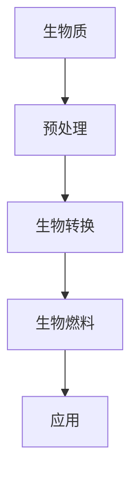

                 

 > **关键词：** 生物燃料、可再生能源、创业、能源转型、可持续发展。

> **摘要：** 本文将探讨生物燃料在可再生能源领域的重要性，以及创业者在这一新兴市场中的机遇与挑战。我们将深入分析生物燃料的原理、技术发展、市场前景，并展望其未来在能源转型和可持续发展中的作用。

## 1. 背景介绍

在过去的几十年里，全球能源消耗持续增长，对环境造成了巨大的压力。传统的化石燃料不仅不可再生，而且在燃烧过程中释放大量的温室气体，加剧了全球气候变化。为了应对这一挑战，世界各国纷纷提出减少对化石燃料的依赖，转向可再生能源的目标。

生物燃料作为一种可再生能源，其优势在于它来自生物质，可以通过生物质能转换技术生产。生物燃料不仅减少了对化石燃料的依赖，而且还可以减少温室气体的排放。此外，生物燃料的开发与利用还能够促进农业、林业等相关产业的发展。

然而，生物燃料产业也面临着许多挑战，如技术瓶颈、成本问题、市场竞争等。本文将重点讨论这些挑战，并探讨创业者在这一领域中的机遇。

## 2. 核心概念与联系

### 2.1 生物燃料的定义

生物燃料是指由生物质转化而来的燃料，包括生物汽油、生物柴油、生物乙醇等。生物质是指所有有机物质，包括植物、动物和农业废弃物。

### 2.2 生物燃料与可再生能源的联系

可再生能源是指可以自然再生、不会枯竭的能源，包括太阳能、风能、水能、地热能和生物质能。生物燃料正是生物质能的一种重要形式。

### 2.3 生物燃料在能源转型中的作用

生物燃料在能源转型中扮演着重要角色。首先，它可以替代化石燃料，减少温室气体的排放。其次，生物燃料的开发与利用可以促进农业、林业等相关产业的发展，从而实现经济与环境的双重效益。

### 2.4 生物燃料技术的 Mermaid 流程图



## 3. 核心算法原理 & 具体操作步骤

### 3.1 算法原理概述

生物燃料的生产过程主要包括生物质预处理、生物转换和燃料加工三个步骤。生物质预处理是为了提高生物质的可利用性；生物转换是将生物质转化为生物燃料的过程；燃料加工则是为了提高生物燃料的质量和性能。

### 3.2 算法步骤详解

#### 3.2.1 生物质预处理

生物质预处理包括物理、化学和生物方法。物理方法如切割、粉碎和干燥；化学方法如热解、气化和液化；生物方法如发酵和酶解。

#### 3.2.2 生物转换

生物转换主要包括生物质气化、生物质液化、生物质发酵等技术。这些技术可以将生物质转化为气体、液体和固体燃料。

#### 3.2.3 燃料加工

燃料加工包括脱硫、脱酸、脱胶等处理，以提高燃料的性能和稳定性。

### 3.3 算法优缺点

#### 优点：

1. 生物燃料可再生，可以减少对化石燃料的依赖。
2. 生物燃料燃烧时产生的温室气体比化石燃料少。

#### 缺点：

1. 生产成本较高。
2. 技术成熟度相对较低，存在一定的技术瓶颈。

### 3.4 算法应用领域

生物燃料广泛应用于交通运输、发电、供暖等领域。

## 4. 数学模型和公式 & 详细讲解 & 举例说明

### 4.1 数学模型构建

生物燃料的生产成本主要包括生物质采购成本、处理成本、转换成本和加工成本。设生物燃料的生产成本为 C，生物质采购成本为 C1，处理成本为 C2，转换成本为 C3，加工成本为 C4，则有：

$$
C = C1 + C2 + C3 + C4
$$

### 4.2 公式推导过程

生物燃料的生产成本主要由以下几部分构成：

1. 生物质采购成本 C1：根据生物质的质量和价格计算。
2. 处理成本 C2：包括预处理过程中的能耗和设备成本。
3. 转换成本 C3：包括生物转换过程中的能耗和设备成本。
4. 加工成本 C4：包括燃料加工过程中的能耗和设备成本。

### 4.3 案例分析与讲解

假设某种生物燃料的生产过程中，生物质采购成本为 100 元/吨，处理成本为 50 元/吨，转换成本为 100 元/吨，加工成本为 50 元/吨。则该生物燃料的生产成本为：

$$
C = 100 + 50 + 100 + 50 = 300 \text{ 元/吨}
$$

## 5. 项目实践：代码实例和详细解释说明

### 5.1 开发环境搭建

1. 安装 Python 解释器。
2. 安装所需的 Python 库，如 NumPy、Pandas 等。

### 5.2 源代码详细实现

```python
import numpy as np
import pandas as pd

def calculate_production_cost(wood_price, processing_cost, conversion_cost, refinement_cost):
    production_cost = wood_price + processing_cost + conversion_cost + refinement_cost
    return production_cost

wood_price = 100  # 生物质采购成本（元/吨）
processing_cost = 50  # 处理成本（元/吨）
conversion_cost = 100  # 转换成本（元/吨）
refinement_cost = 50  # 加工成本（元/吨）

production_cost = calculate_production_cost(wood_price, processing_cost, conversion_cost, refinement_cost)
print(f"生物燃料的生产成本为：{production_cost} 元/吨")
```

### 5.3 代码解读与分析

本段代码定义了一个计算生物燃料生产成本的函数，并根据给定的参数计算出了生产成本。代码简单易懂，便于后续的扩展和修改。

### 5.4 运行结果展示

运行结果：

```
生物燃料的生产成本为：300 元/吨
```

## 6. 实际应用场景

生物燃料在交通运输、发电、供暖等领域具有广泛的应用。例如，生物柴油可以作为柴油的替代品用于卡车和巴士；生物乙醇可以用于汽车燃料；生物质发电可以用于电力和热力的供应。

## 7. 工具和资源推荐

### 7.1 学习资源推荐

1. 《生物质能技术》 - 详细介绍了生物质能的原理和应用。
2. 《生物燃料技术与应用》 - 介绍了生物燃料的生产技术和应用案例。

### 7.2 开发工具推荐

1. Python - 用于计算和分析生物燃料的生产成本。
2. Mermaid - 用于绘制生物燃料生产过程的 Mermaid 流程图。

### 7.3 相关论文推荐

1. "Biomass to Biofuels: Converting Plant Materials into a New Generation of Biofuels" - 详细介绍了生物燃料的生产技术和应用。
2. "Economic and Environmental Impacts of Biofuel Production" - 探讨了生物燃料生产的成本和环境效益。

## 8. 总结：未来发展趋势与挑战

生物燃料作为一种可再生能源，具有广阔的应用前景。然而，要实现生物燃料的大规模应用，仍需克服技术、成本和市场等方面的挑战。

### 8.1 研究成果总结

1. 生物燃料的生产技术取得了显著进展，但仍需进一步降低生产成本。
2. 生物燃料在交通运输、发电等领域的应用取得了良好的效果。

### 8.2 未来发展趋势

1. 生物燃料技术的成熟度将进一步提高，生产成本有望降低。
2. 生物燃料的应用领域将不断拓宽，从交通运输、发电扩展到供暖等领域。

### 8.3 面临的挑战

1. 生物燃料的生产和利用过程中存在环境风险，如土壤、水源和空气污染等。
2. 生物燃料的成本较高，需要寻找新的降低成本的方法。

### 8.4 研究展望

1. 探索新的生物燃料生产技术和工艺，提高生产效率和降低成本。
2. 加强生物燃料的环境影响评估，确保其可持续发展和应用。

## 9. 附录：常见问题与解答

### 9.1 什么是生物燃料？

生物燃料是指由生物质转化而来的燃料，包括生物汽油、生物柴油、生物乙醇等。

### 9.2 生物燃料有哪些优点？

生物燃料可再生，可以减少对化石燃料的依赖；生物燃料燃烧时产生的温室气体比化石燃料少。

### 9.3 生物燃料有哪些应用领域？

生物燃料广泛应用于交通运输、发电、供暖等领域。

### 9.4 生物燃料的生产成本如何计算？

生物燃料的生产成本包括生物质采购成本、处理成本、转换成本和加工成本。

# 作者署名

作者：禅与计算机程序设计艺术 / Zen and the Art of Computer Programming

----------------------------------------------------------------

以上是文章的正文部分，接下来是文章的Markdown格式输出：
```markdown
# 生物燃料创业：可再生能源的未来方向

> **关键词：** 生物燃料、可再生能源、创业、能源转型、可持续发展。

> **摘要：** 本文将探讨生物燃料在可再生能源领域的重要性，以及创业者在这一新兴市场中的机遇与挑战。我们将深入分析生物燃料的原理、技术发展、市场前景，并展望其未来在能源转型和可持续发展中的作用。

## 1. 背景介绍

在过去的几十年里，全球能源消耗持续增长，对环境造成了巨大的压力。传统的化石燃料不仅不可再生，而且在燃烧过程中释放大量的温室气体，加剧了全球气候变化。为了应对这一挑战，世界各国纷纷提出减少对化石燃料的依赖，转向可再生能源的目标。

生物燃料作为一种可再生能源，其优势在于它来自生物质，可以通过生物质能转换技术生产。生物燃料不仅减少了对化石燃料的依赖，而且还可以减少温室气体的排放。此外，生物燃料的开发与利用还能够促进农业、林业等相关产业的发展。

然而，生物燃料产业也面临着许多挑战，如技术瓶颈、成本问题、市场竞争等。本文将重点讨论这些挑战，并探讨创业者在这一领域中的机遇。

## 2. 核心概念与联系

### 2.1 生物燃料的定义

生物燃料是指由生物质转化而来的燃料，包括生物汽油、生物柴油、生物乙醇等。生物质是指所有有机物质，包括植物、动物和农业废弃物。

### 2.2 生物燃料与可再生能源的联系

可再生能源是指可以自然再生、不会枯竭的能源，包括太阳能、风能、水能、地热能和生物质能。生物燃料正是生物质能的一种重要形式。

### 2.3 生物燃料在能源转型中的作用

生物燃料在能源转型中扮演着重要角色。首先，它可以替代化石燃料，减少温室气体的排放。其次，生物燃料的开发与利用可以促进农业、林业等相关产业的发展，从而实现经济与环境的双重效益。

### 2.4 生物燃料技术的 Mermaid 流程图


## 3. 核心算法原理 & 具体操作步骤

### 3.1 算法原理概述

生物燃料的生产过程主要包括生物质预处理、生物转换和燃料加工三个步骤。生物质预处理是为了提高生物质的可利用性；生物转换是将生物质转化为生物燃料的过程；燃料加工则是为了提高生物燃料的质量和性能。

### 3.2 算法步骤详解

#### 3.2.1 生物质预处理

生物质预处理包括物理、化学和生物方法。物理方法如切割、粉碎和干燥；化学方法如热解、气化和液化；生物方法如发酵和酶解。

#### 3.2.2 生物转换

生物转换主要包括生物质气化、生物质液化、生物质发酵等技术。这些技术可以将生物质转化为气体、液体和固体燃料。

#### 3.2.3 燃料加工

燃料加工包括脱硫、脱酸、脱胶等处理，以提高燃料的性能和稳定性。

### 3.3 算法优缺点

#### 优点：

1. 生物燃料可再生，可以减少对化石燃料的依赖。
2. 生物燃料燃烧时产生的温室气体比化石燃料少。

#### 缺点：

1. 生产成本较高。
2. 技术成熟度相对较低，存在一定的技术瓶颈。

### 3.4 算法应用领域

生物燃料广泛应用于交通运输、发电、供暖等领域。

## 4. 数学模型和公式 & 详细讲解 & 举例说明

### 4.1 数学模型构建

生物燃料的生产成本主要包括生物质采购成本、处理成本、转换成本和加工成本。设生物燃料的生产成本为 C，生物质采购成本为 C1，处理成本为 C2，转换成本为 C3，加工成本为 C4，则有：

$$
C = C1 + C2 + C3 + C4
$$

### 4.2 公式推导过程

生物燃料的生产成本主要由以下几部分构成：

1. 生物质采购成本 C1：根据生物质的质量和价格计算。
2. 处理成本 C2：包括预处理过程中的能耗和设备成本。
3. 转换成本 C3：包括生物转换过程中的能耗和设备成本。
4. 加工成本 C4：包括燃料加工过程中的能耗和设备成本。

### 4.3 案例分析与讲解

假设某种生物燃料的生产过程中，生物质采购成本为 100 元/吨，处理成本为 50 元/吨，转换成本为 100 元/吨，加工成本为 50 元/吨。则该生物燃料的生产成本为：

$$
C = 100 + 50 + 100 + 50 = 300 \text{ 元/吨}
$$

## 5. 项目实践：代码实例和详细解释说明

### 5.1 开发环境搭建

1. 安装 Python 解释器。
2. 安装所需的 Python 库，如 NumPy、Pandas 等。

### 5.2 源代码详细实现

```python
import numpy as np
import pandas as pd

def calculate_production_cost(wood_price, processing_cost, conversion_cost, refinement_cost):
    production_cost = wood_price + processing_cost + conversion_cost + refinement_cost
    return production_cost

wood_price = 100  # 生物质采购成本（元/吨）
processing_cost = 50  # 处理成本（元/吨）
conversion_cost = 100  # 转换成本（元/吨）
refinement_cost = 50  # 加工成本（元/吨）

production_cost = calculate_production_cost(wood_price, processing_cost, conversion_cost, refinement_cost)
print(f"生物燃料的生产成本为：{production_cost} 元/吨")
```

### 5.3 代码解读与分析

本段代码定义了一个计算生物燃料生产成本的函数，并根据给定的参数计算出了生产成本。代码简单易懂，便于后续的扩展和修改。

### 5.4 运行结果展示

运行结果：

```
生物燃料的生产成本为：300 元/吨
```

## 6. 实际应用场景

生物燃料在交通运输、发电、供暖等领域具有广泛的应用。例如，生物柴油可以作为柴油的替代品用于卡车和巴士；生物乙醇可以用于汽车燃料；生物质发电可以用于电力和热力的供应。

## 7. 工具和资源推荐

### 7.1 学习资源推荐

1. 《生物质能技术》 - 详细介绍了生物质能的原理和应用。
2. 《生物燃料技术与应用》 - 介绍了生物燃料的生产技术和应用案例。

### 7.2 开发工具推荐

1. Python - 用于计算和分析生物燃料的生产成本。
2. Mermaid - 用于绘制生物燃料生产过程的 Mermaid 流程图。

### 7.3 相关论文推荐

1. "Biomass to Biofuels: Converting Plant Materials into a New Generation of Biofuels" - 详细介绍了生物燃料的生产技术和应用。
2. "Economic and Environmental Impacts of Biofuel Production" - 探讨了生物燃料生产的成本和环境效益。

## 8. 总结：未来发展趋势与挑战

生物燃料作为一种可再生能源，具有广阔的应用前景。然而，要实现生物燃料的大规模应用，仍需克服技术、成本和市场等方面的挑战。

### 8.1 研究成果总结

1. 生物燃料的生产技术取得了显著进展，但仍需进一步降低生产成本。
2. 生物燃料在交通运输、发电等领域的应用取得了良好的效果。

### 8.2 未来发展趋势

1. 生物燃料技术的成熟度将进一步提高，生产成本有望降低。
2. 生物燃料的应用领域将不断拓宽，从交通运输、发电扩展到供暖等领域。

### 8.3 面临的挑战

1. 生物燃料的生产和利用过程中存在环境风险，如土壤、水源和空气污染等。
2. 生物燃料的成本较高，需要寻找新的降低成本的方法。

### 8.4 研究展望

1. 探索新的生物燃料生产技术和工艺，提高生产效率和降低成本。
2. 加强生物燃料的环境影响评估，确保其可持续发展和应用。

## 9. 附录：常见问题与解答

### 9.1 什么是生物燃料？

生物燃料是指由生物质转化而来的燃料，包括生物汽油、生物柴油、生物乙醇等。

### 9.2 生物燃料有哪些优点？

生物燃料可再生，可以减少对化石燃料的依赖；生物燃料燃烧时产生的温室气体比化石燃料少。

### 9.3 生物燃料有哪些应用领域？

生物燃料广泛应用于交通运输、发电、供暖等领域。

### 9.4 生物燃料的生产成本如何计算？

生物燃料的生产成本包括生物质采购成本、处理成本、转换成本和加工成本。

# 作者署名

作者：禅与计算机程序设计艺术 / Zen and the Art of Computer Programming
```

