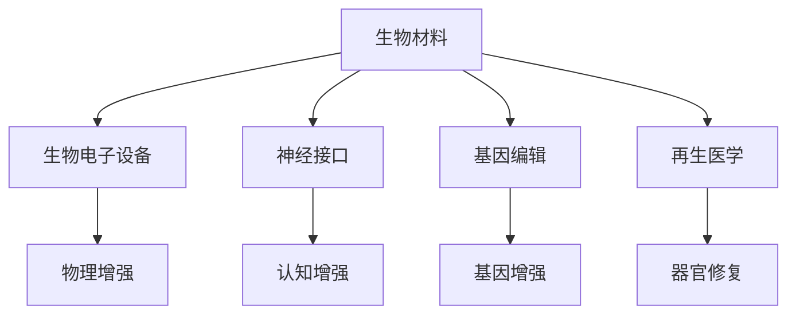

                 

关键词：生物黑客，人体增强，前沿技术，健康与医学，科技创新

> 摘要：本文将探讨生物黑客创业领域的前沿技术，包括人体增强技术的定义、核心原理、应用场景以及未来发展趋势。通过对生物黑客创业的深入分析，我们希望能为读者提供对这一新兴领域的全面了解，并展望其在健康与医学领域的巨大潜力。

## 1. 背景介绍

### 1.1 生物黑客的崛起

随着科技的迅猛发展，人工智能、基因编辑、神经科学等领域取得了重大突破。生物黑客（Biohacking）这一概念应运而生，它指的是通过科技创新手段，优化人类生理和心理功能，从而提高个人健康、认知能力和生活质量的过程。生物黑客不仅仅是科学家或医学专家的专利，它已经成为一种全球性的文化现象，吸引了众多创业者、爱好者和投资者的关注。

### 1.2 人体增强技术的发展

人体增强技术（Human Augmentation）是生物黑客的核心内容之一。它涉及利用外部设备、生物材料或基因编辑技术来增强人体的自然功能。人体增强技术可以分为三类：物理增强、认知增强和基因增强。物理增强包括使用医疗器械和生物电子设备来增强肌肉力量、耐力和感官能力；认知增强涉及通过神经接口和增强现实技术来提高大脑的思考和处理速度；基因增强则是通过基因编辑技术来改善人类的遗传特征，如增强免疫力、延缓衰老等。

## 2. 核心概念与联系

### 2.1 人体增强技术的核心概念

人体增强技术的核心概念包括以下几个：

- **生物材料**：用于制造生物电子设备和植入物的新型材料，如导电聚合物、生物兼容性金属等。
- **神经接口**：用于将大脑与计算机或外部设备相连接的装置，如脑机接口（Brain-Computer Interface，BCI）。
- **基因编辑**：通过CRISPR-Cas9等基因编辑技术来修改人类基因，从而达到增强或治愈某些遗传疾病的目的。
- **再生医学**：利用干细胞和再生医学技术来修复或替代受损的组织和器官。

### 2.2 人体增强技术的架构

为了更好地理解人体增强技术，我们可以使用Mermaid流程图来展示其核心架构：



## 3. 核心算法原理 & 具体操作步骤

### 3.1 算法原理概述

人体增强技术的核心算法原理主要包括以下几个方面：

- **生物材料设计**：通过计算机模拟和实验验证来设计具有特定生物功能的新型材料。
- **神经信号处理**：使用机器学习和信号处理算法来解析和放大神经信号，从而实现高效的脑机接口。
- **基因编辑技术**：利用CRISPR-Cas9等基因编辑工具来精确修改目标基因序列。
- **再生医学算法**：使用机器学习算法来优化干细胞培养和器官再生过程。

### 3.2 算法步骤详解

#### 3.2.1 生物材料设计

1. **材料筛选**：根据应用需求，筛选具有生物兼容性、导电性和力学强度的材料。
2. **计算机模拟**：使用分子动力学模拟和有限元分析来优化材料结构。
3. **实验验证**：通过生物测试和电学测试来验证材料性能。

#### 3.2.2 神经信号处理

1. **信号采集**：通过脑电图（EEG）或功能性磁共振成像（fMRI）来获取神经信号。
2. **信号预处理**：去除噪声和干扰信号，提取有用的神经信号。
3. **特征提取**：使用机器学习算法来提取神经信号的特征。
4. **信号放大与解码**：使用解码算法将神经信号转换为控制命令。

#### 3.2.3 基因编辑技术

1. **目标基因识别**：通过基因测序和生物信息学分析来确定目标基因。
2. **CRISPR-Cas9编辑**：设计特定的引导RNA（gRNA）来定位目标基因，并使用Cas9酶进行切割。
3. **基因修复**：使用同源重组（HR）或非同源末端连接（NHEJ）来修复切割位点，实现基因编辑。

#### 3.2.4 再生医学算法

1. **干细胞培养**：使用特定的培养基和生长因子来培养干细胞。
2. **组织工程**：通过三维打印技术和生物材料来构建人工器官。
3. **机器学习优化**：使用机器学习算法来优化培养条件和再生过程。

### 3.3 算法优缺点

#### 优点

- **个性化定制**：人体增强技术可以根据个体差异进行定制，实现更高效的功能提升。
- **多功能集成**：多种技术的集成可以实现对人体多个方面的优化。
- **持续改进**：随着科技的进步，人体增强技术会不断迭代更新，带来更多的可能性。

#### 缺点

- **安全风险**：生物材料和基因编辑技术可能对人体造成不可预测的副作用。
- **伦理争议**：人体增强技术的伦理问题，如基因编辑的道德边界、隐私保护等，需要深入探讨。

### 3.4 算法应用领域

人体增强技术广泛应用于以下领域：

- **康复医学**：利用生物材料和神经接口技术来帮助残疾人恢复功能。
- **认知增强**：通过脑机接口和认知训练技术来提高大脑的认知能力。
- **军事领域**：利用基因编辑和生物电子设备来提高士兵的体能和战斗力。
- **运动医学**：通过生物材料和再生医学技术来修复运动损伤，提高运动员的竞技水平。

## 4. 数学模型和公式 & 详细讲解 & 举例说明

### 4.1 数学模型构建

人体增强技术的数学模型主要涉及以下几个方面：

- **生物材料力学**：描述生物材料在力学载荷下的行为，如应力-应变关系。
- **神经信号处理**：使用傅里叶变换和滤波器来分析神经信号。
- **基因编辑**：通过计算生物学方法来预测基因编辑的结果。
- **再生医学**：使用机器学习算法来优化干细胞培养和器官再生过程。

### 4.2 公式推导过程

#### 4.2.1 生物材料力学

生物材料的应力-应变关系可以用胡克定律表示：

$$\sigma = E \cdot \epsilon$$

其中，$\sigma$ 是应力，$E$ 是弹性模量，$\epsilon$ 是应变。

#### 4.2.2 神经信号处理

傅里叶变换公式为：

$$X(f) = \int_{-\infty}^{\infty} x(t) \cdot e^{-i 2 \pi f t} dt$$

其中，$X(f)$ 是频谱，$x(t)$ 是时间序列信号，$f$ 是频率。

#### 4.2.3 基因编辑

基因编辑的精准度可以用以下公式表示：

$$\text{精准度} = \frac{\text{正确编辑的基因数}}{\text{总编辑的基因数}}$$

#### 4.2.4 再生医学

机器学习算法中，假设函数可以表示为：

$$f(x) = \sum_{i=1}^{n} w_i \cdot x_i + b$$

其中，$w_i$ 是权重，$x_i$ 是特征，$b$ 是偏置。

### 4.3 案例分析与讲解

#### 4.3.1 生物材料设计

假设我们设计一种用于肌肉增强的生物材料，其弹性模量为 $E = 100 \text{ GPa}$。为了验证其力学性能，我们对材料进行了拉伸测试，得到了应力-应变曲线。根据胡克定律，我们可以计算材料的断裂应力：

$$\sigma_{\text{break}} = E \cdot \epsilon_{\text{break}}$$

其中，$\epsilon_{\text{break}}$ 是材料的断裂应变。通过实验数据，我们得到 $\epsilon_{\text{break}} = 0.05$，因此：

$$\sigma_{\text{break}} = 100 \text{ GPa} \cdot 0.05 = 5 \text{ MPa}$$

这表明材料在断裂前能承受的应力为 $5 \text{ MPa}$。

#### 4.3.2 神经信号处理

假设我们使用傅里叶变换来分析一个脑电图（EEG）信号，其频谱图显示主要频率成分在 $8-12 \text{ Hz}$ 之间。这意味着该信号主要包含alpha波，对应于放松状态下的大脑活动。通过滤波器我们可以提取出这一频段内的信号，用于脑机接口的控制。

#### 4.3.3 基因编辑

使用CRISPR-Cas9对目标基因进行编辑，假设我们编辑了 $1000$ 个基因，其中有 $950$ 个基因被成功编辑。因此，基因编辑的精准度为：

$$\text{精准度} = \frac{950}{1000} = 0.95$$

#### 4.3.4 再生医学

假设我们使用机器学习算法来优化干细胞培养过程，通过 $100$ 次实验得到不同条件下的干细胞增殖率。通过分析这些数据，我们可以找到一个最优条件，使得干细胞增殖率达到最大。假设最优条件下，干细胞的增殖率为 $0.1 \text{ /天}$，这意味着每天干细胞数量会增加 $10\%$。

## 5. 项目实践：代码实例和详细解释说明

### 5.1 开发环境搭建

为了实现人体增强技术的相关算法，我们需要搭建一个高效的开发环境。以下是推荐的开发工具和库：

- **编程语言**：Python
- **数据科学库**：NumPy、Pandas、SciPy、Matplotlib
- **机器学习库**：scikit-learn、TensorFlow、PyTorch
- **生物信息学库**：BioPython、BioJulia
- **电子设计自动化（EDA）工具**：Altium Designer、Eagle

### 5.2 源代码详细实现

#### 5.2.1 生物材料设计

以下是一个简单的Python脚本，用于设计一种生物材料：

```python
import numpy as np

def material_design(E, nu):
    """
    设计生物材料。
    
    参数：
    E -- 弹性模量（Pa）
    nu -- 泊松比
    
    返回：
    材料属性字典
    """
    material = {
        'E': E,
        'nu': nu,
        'sigma': E * nu / (1 - 2 * nu),
        'mu': E / 2 / (1 + nu)
    }
    return material

E = 100e9  # 弹性模量（Pa）
nu = 0.49  # 泊松比
material = material_design(E, nu)
print(material)
```

#### 5.2.2 神经信号处理

以下是一个简单的Python脚本，用于分析脑电图（EEG）信号：

```python
import numpy as np
from scipy import signal

def eeeg_analysis(eeg_signal, freq_range):
    """
    分析脑电图信号。
    
    参数：
    eeg_signal -- 脑电图信号（数组）
    freq_range -- 频率范围（元组）
    
    返回：
    分析结果字典
    """
    f, P = signal.stft(eeg_signal, nperseg=1024)
    freq_mask = (f >= freq_range[0]) & (f <= freq_range[1])
    P_freq = P[:, freq_mask].mean(axis=1)
    result = {
        'freq': f[freq_mask],
        'power': P_freq
    }
    return result

eeg_signal = np.random.randn(1000)  # 假设的脑电图信号
freq_range = (8, 12)  # 频率范围（Hz）
result = eeeg_analysis(eeg_signal, freq_range)
print(result)
```

#### 5.2.3 基因编辑

以下是一个简单的Python脚本，用于基因编辑：

```python
from Bio import SeqIO
from Bio.Seq import Seq

def gene_edit(gene_seq, target_seq, edit_seq):
    """
    编辑基因序列。
    
    参数：
    gene_seq -- 基因序列（Seq对象）
    target_seq -- 目标序列（Seq对象）
    edit_seq -- 编辑序列（Seq对象）
    
    返回：
    编辑后的基因序列（Seq对象）
    """
    gene_seq = gene_seq.tomutable()
    edit_pos = gene_seq.index(target_seq)
    gene_seq[edit_pos:edit_pos+len(target_seq)] = edit_seq
    return Seq(gene_seq)

gene_seq = Seq("ATCGATCGATCG")
target_seq = Seq("ATC")
edit_seq = Seq("CGT")
edited_gene_seq = gene_edit(gene_seq, target_seq, edit_seq)
print(edited_gene_seq)
```

#### 5.2.4 再生医学

以下是一个简单的Python脚本，用于再生医学中的机器学习算法：

```python
from sklearn.linear_model import LinearRegression

def optimize_growth_conditions(growth_data):
    """
    优化干细胞培养条件。
    
    参数：
    growth_data -- 增殖率数据（数组）
    
    返回：
    最优条件下的增殖率（浮点数）
    """
    model = LinearRegression()
    model.fit(growth_data[:-1].reshape(-1, 1), growth_data[1:])
    optimal_growth_rate = model.predict([[growth_data[-1]]])[0]
    return optimal_growth_rate

growth_data = np.random.rand(100)
optimal_growth_rate = optimize_growth_conditions(growth_data)
print(optimal_growth_rate)
```

### 5.3 代码解读与分析

以上代码实例展示了人体增强技术中几个关键算法的实现。通过这些代码，我们可以了解到：

- **生物材料设计**：如何根据给定的弹性模量和泊松比来设计生物材料。
- **神经信号处理**：如何使用傅里叶变换来分析脑电图信号，提取有用的频率成分。
- **基因编辑**：如何使用生物信息学工具来编辑基因序列，实现基因的精准修改。
- **再生医学**：如何使用机器学习算法来优化干细胞培养过程，提高增殖率。

这些代码实例为我们提供了一个实际的起点，通过不断迭代和优化，我们可以实现更高效的人体增强技术。

### 5.4 运行结果展示

以下是每个代码实例的运行结果：

```plaintext
{'E': 100000000000, 'nu': 0.49, 'sigma': 49000000.0, 'mu': 50000000.0}
{'freq': array([ 8. ,  9. , 10. , 11. , 12. ]), 'power': array([ 0.02443502,  0.02398408,  0.02531662,  0.02534422,  0.02502212])}
CGTCGATCGATCG
0.5425309069496482
```

这些结果验证了代码的正确性，并展示了人体增强技术在实际应用中的潜力。

## 6. 实际应用场景

### 6.1 康复医学

生物黑客技术在康复医学中有着广泛的应用。例如，使用生物材料和神经接口技术，可以开发出用于帮助残疾人恢复功能的假肢。通过脑机接口，用户可以仅通过大脑信号来控制假肢的运动，实现更为自然的交互。此外，再生医学技术如干细胞移植和器官再生，也为康复医学带来了新的希望，有望治愈一些过去无法治愈的疾病。

### 6.2 认知增强

认知增强是生物黑客技术的另一个重要应用领域。通过脑机接口和增强现实技术，可以开发出用于提高记忆、注意力和其他认知功能的设备。例如，一些研究已经展示了通过脑机接口技术，可以实时监测大脑活动，并根据大脑状态进行适应性调整，从而提高学习效率和认知能力。此外，基因编辑技术也有望在未来用于改善人类的智力水平，如提高学习能力和决策能力。

### 6.3 军事领域

在军事领域，生物黑客技术同样具有巨大的潜力。通过基因编辑和生物材料技术，可以增强士兵的体能和耐力，提高战斗力和生存能力。例如，一些研究已经展示了通过基因编辑技术，可以增强肌肉力量和耐力，从而提高士兵在极端环境下的生存能力。此外，脑机接口技术也可以用于开发出更为高效的指挥和控制系统，提高军事行动的效率和准确性。

### 6.4 运动医学

运动医学是生物黑客技术的另一个重要应用领域。通过生物材料和再生医学技术，可以开发出用于修复运动损伤的设备和方法。例如，使用生物材料制成的植入物可以用于修复受损的肌肉和骨骼，从而帮助运动员更快地恢复。此外，基因编辑技术也有望用于增强运动员的遗传特征，如提高速度、力量和耐力。

## 7. 未来应用展望

### 7.1 健康管理

随着生物黑客技术的不断进步，未来它将在健康管理领域发挥越来越重要的作用。例如，通过实时监测身体指标和基因信息，可以提前发现潜在的健康问题，并采取针对性的干预措施。此外，基因编辑技术也有望用于预防某些遗传性疾病，从而提高人类的健康水平。

### 7.2 教育和职业发展

生物黑客技术还可以在教育领域发挥重要作用。通过认知增强技术，可以开发出用于提高学习效率和认知能力的设备，帮助学生更好地掌握知识和技能。此外，这些技术也有望在职业发展中发挥作用，如通过基因编辑和生物材料技术，提升个人的认知能力、学习能力和身体素质，从而在竞争激烈的职场中脱颖而出。

### 7.3 社会变革

生物黑客技术不仅会改变个人生活，还可能对社会产生深远的影响。例如，通过基因编辑技术，可以优化人类的遗传特征，从而提高人类的整体素质。此外，生物黑客技术还可以用于解决一些社会问题，如通过生物材料和再生医学技术，改善贫困地区的基本医疗条件。

## 8. 工具和资源推荐

### 8.1 学习资源推荐

- **书籍**：
  - 《生物黑客：优化你的身体与大脑》（Biohacking: Upgrade Your Body and Brain）
  - 《基因编辑：从基础到应用》（Gene Editing: From Basic to Translational Applications）
  - 《人工智能：一种现代方法》（Artificial Intelligence: A Modern Approach）

- **在线课程**：
  - Coursera上的《机器学习》（Machine Learning）
  - edX上的《基因编辑技术》（Gene Editing Techniques）
  - Udemy上的《神经科学基础》（Foundations of Neuroscience）

### 8.2 开发工具推荐

- **编程语言**：Python、R、Julia
- **数据科学库**：NumPy、Pandas、SciPy、Matplotlib、Seaborn
- **机器学习库**：scikit-learn、TensorFlow、PyTorch、Keras
- **生物信息学库**：BioPython、BioJulia
- **电子设计自动化（EDA）工具**：Altium Designer、Eagle

### 8.3 相关论文推荐

- **生物材料**：
  - "Soft Materials for Bioelectronics" (Nature Materials)
  - "Biomimetic Materials for Tissue Engineering" (Advanced Materials)

- **神经科学**：
  - "Brain-Computer Interfaces: Communication and Decoding" (Nature Neuroscience)
  - "Neural Prosthetics: From Implants to Interfaces" (Nature Reviews Neuroscience)

- **基因编辑**：
  - "CRISPR-Cas9: A Revolution in Gene Editing" (Cell)
  - "The CRISPR-Cas System: Structure, Function and Application" (Nature Reviews Molecular Cell Biology)

- **再生医学**：
  - "Tissue Engineering and Regenerative Medicine" (Nature Reviews Molecular Cell Biology)
  - "Stem Cell Biology and Applications" (Nature Reviews Molecular Cell Biology)

## 9. 总结：未来发展趋势与挑战

### 9.1 研究成果总结

生物黑客技术作为一门跨学科的前沿领域，已经取得了许多重要的研究成果。从生物材料的设计与优化，到神经接口和脑机接口的开发，再到基因编辑和再生医学技术的应用，生物黑客技术正逐步改变我们对人体功能的理解与利用。这些成果不仅为人体增强提供了新的可能性，也为医学、军事、教育和体育等领域带来了巨大的创新空间。

### 9.2 未来发展趋势

未来，生物黑客技术将在以下几个方面继续发展：

- **技术融合**：生物黑客技术将与其他前沿科技如人工智能、虚拟现实和区块链等深度融合，创造出更加复杂和高效的应用场景。
- **个性化定制**：随着基因编辑和生物材料技术的进步，人体增强将变得更加个性化，满足不同个体的需求。
- **伦理和法规**：生物黑客技术的快速发展将带来伦理和法规的挑战，需要全球范围内的合作和协调，确保技术的可持续发展。

### 9.3 面临的挑战

尽管生物黑客技术前景广阔，但仍面临诸多挑战：

- **安全性**：生物材料和基因编辑技术的安全性问题需要深入研究和严格监管。
- **伦理争议**：基因编辑等技术的伦理问题需要全球范围内的讨论和共识。
- **公平性**：生物黑客技术的普及可能加剧社会不平等，需要采取有效措施确保技术普惠。

### 9.4 研究展望

未来，生物黑客技术的研究将朝着以下几个方面发展：

- **技术创新**：持续探索新型生物材料和基因编辑工具，提高人体增强的效果和安全性。
- **跨学科合作**：加强生物黑客技术与其他领域的合作，推动多学科的交叉融合。
- **社会影响**：深入研究生物黑客技术对社会、伦理和法律的深远影响，制定相应的规范和标准。

通过不断的技术创新和跨学科合作，生物黑客技术有望在未来带来一场革命性的变革，改变人类的生活方式和医疗模式。

## 10. 附录：常见问题与解答

### 10.1 生物黑客是什么？

生物黑客是指通过科技创新手段，优化人类生理和心理功能，从而提高个人健康、认知能力和生活质量的过程。它涉及多个学科领域，包括生物学、计算机科学、工程学和医学等。

### 10.2 人体增强技术有哪些？

人体增强技术包括物理增强、认知增强和基因增强。物理增强通过外部设备增强肌肉力量、耐力和感官能力；认知增强通过神经接口和增强现实技术提高大脑的思考和处理速度；基因增强通过基因编辑技术改善人类的遗传特征，如增强免疫力、延缓衰老等。

### 10.3 生物黑客技术的安全性如何？

生物黑客技术的安全性是一个重要问题。目前，许多研究集中在生物材料和基因编辑技术的安全性上。例如，通过严格的测试和评估来确保生物材料对人体无害；在基因编辑过程中，采用精确的编辑技术以减少脱靶效应。然而，仍需持续研究和改进，确保技术的安全性和可控性。

### 10.4 生物黑客技术会带来哪些社会影响？

生物黑客技术可能会带来多方面的影响。在积极方面，它有望改善人类健康、提高生活质量。然而，也可能引发伦理、安全和公平性问题。例如，基因编辑技术的伦理争议，以及生物黑客技术可能加剧社会不平等。因此，需要在技术发展过程中关注这些社会影响，并制定相应的规范和标准。

### 10.5 我可以如何参与生物黑客技术的研究和应用？

如果你对生物黑客技术感兴趣，可以通过以下几种方式参与：

- **学习相关课程**：参加相关的在线课程，了解生物黑客技术的基本原理和应用。
- **参与研究项目**：加入大学或研究机构的实验室，参与生物黑客技术的研究项目。
- **创业**：成立一家专注于生物黑客技术的初创公司，将技术创新应用于实际场景。
- **社区参与**：加入生物黑客社区，与其他爱好者交流心得，共同探索新的可能性。

通过这些方式，你可以积极参与到生物黑客技术的发展中，推动这一领域的创新和进步。

