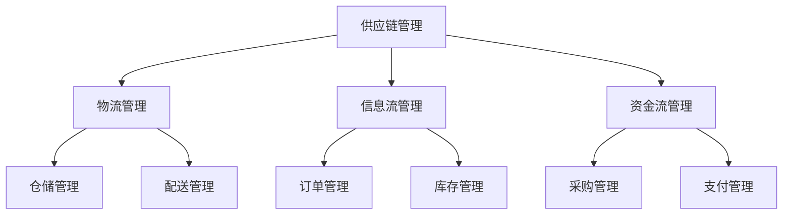

                 

### 摘要 Summary

本文旨在探讨生鲜电商创业过程中如何构建高效供应链，以实现优质服务和降低成本。通过深入分析供应链管理的关键概念、核心算法、数学模型以及项目实践，我们提供了系统的指导。文章首先介绍了生鲜电商的发展背景和市场需求，然后详细探讨了供应链管理的基本概念和联系，包括物流、信息流和资金流。接着，本文介绍了优化供应链的核心算法原理和操作步骤，并分析了其优缺点和应用领域。随后，文章通过数学模型和公式的推导，对供应链管理进行了深入讲解，并通过具体案例进行分析。最后，文章提供了实际项目实践的代码实例和详细解释，并展望了生鲜电商供应链管理的未来发展方向和挑战。通过本文的阅读，读者将对生鲜电商供应链管理有一个全面而深入的理解。

## 1. 背景介绍 Background

随着互联网技术的快速发展和消费者需求的多样化，生鲜电商行业在我国逐渐崛起。生鲜电商，即通过互联网平台直接面向消费者销售新鲜农产品的电商模式，已经成为现代零售业的重要组成部分。据相关数据显示，我国生鲜电商市场规模近年来呈现出爆发式增长，2020年达到1.8万亿元，预计到2025年市场规模将突破3万亿元。

### 1.1 市场需求 Market Demand

消费者对新鲜、安全、便捷的生鲜产品需求日益增加。尤其是在城市化和快节奏生活的背景下，人们更加追求生活品质和便利性。生鲜电商凭借其快速配送、丰富产品选择和较高的食品安全性，迅速赢得了广大消费者的青睐。此外，消费者对生鲜产品的需求具有季节性和地域性特点，这使得生鲜电商在满足个性化需求方面具有显著优势。

### 1.2 行业现状 Industry Status

目前，我国生鲜电商市场呈现出以下几个特点：

1. **市场集中度较低**：与跨境电商等电商领域相比，生鲜电商市场集中度较低，尚未形成明显的行业寡头。
2. **竞争激烈**：随着资本的涌入，生鲜电商市场竞争日益激烈，各大平台纷纷通过价格战、补贴战等手段争夺市场份额。
3. **模式多样**：生鲜电商模式多样，包括自营模式、平台模式、B2B模式等，各种模式各具特点，适应不同市场细分。

### 1.3 面临的挑战 Challenges

尽管生鲜电商市场前景广阔，但同时也面临着诸多挑战：

1. **供应链管理难度大**：生鲜产品具有易腐烂、保质期短等特点，这对供应链管理提出了更高的要求。供应链中的物流、信息流和资金流需要高度协同，以确保产品的高效流通。
2. **食品安全问题**：食品安全一直是消费者关注的焦点。生鲜电商在供应链各环节需要严格把控食品安全，确保消费者权益。
3. **物流配送难题**：生鲜物流配送成本高、难度大，特别是在农村和偏远地区。高效的物流网络和智能化的配送系统是生鲜电商成功的关键。

### 1.4 生鲜电商的优势和劣势

#### 优势 Advantages

1. **便捷性**：消费者可以随时随地在线购买生鲜产品，满足现代生活方式的需求。
2. **高效率**：生鲜电商通过集中采购、集约化配送，提高了供应链效率，降低了成本。
3. **多样化的产品选择**：生鲜电商平台通常提供丰富多样的产品选择，满足消费者的个性化需求。

#### 劣势 Disadvantages

1. **物流成本高**：生鲜物流成本较高，特别是在冷链运输方面，需要更多的投入和技术支持。
2. **食品安全风险**：生鲜产品易腐烂，食品安全风险较高，需要严格的质量控制和追溯体系。
3. **市场竞争激烈**：生鲜电商市场竞争激烈，需要不断优化服务和产品，以保持竞争力。

综上所述，生鲜电商行业具有巨大的发展潜力，但也面临诸多挑战。通过构建高效供应链，实现优质服务和降低成本，是生鲜电商成功的关键。

### 1.5 文章结构 Overview

本文将从以下几个方面展开讨论：

1. **核心概念与联系**：介绍供应链管理的基本概念和各环节之间的联系，使用Mermaid流程图进行说明。
2. **核心算法原理与操作步骤**：详细讲解优化供应链的核心算法，包括算法原理、步骤和优缺点。
3. **数学模型和公式**：推导供应链管理的数学模型，并举例说明。
4. **项目实践**：提供实际项目实践的代码实例，并进行详细解读。
5. **实际应用场景**：探讨生鲜电商供应链管理的实际应用场景和未来展望。
6. **工具和资源推荐**：推荐相关学习资源、开发工具和论文。
7. **总结与展望**：总结研究成果，展望未来发展趋势和挑战。

### 1.6 Mermaid 流程图 Mermaid Diagram

以下是供应链管理的基本概念和各环节之间的Mermaid流程图：



通过该流程图，可以清晰地看到供应链管理的各个关键环节及其相互之间的关系。

## 2. 核心概念与联系 Core Concepts and Relationships

在探讨生鲜电商创业中的供应链管理时，了解核心概念及其相互联系是至关重要的。以下是供应链管理中的关键概念，包括物流、信息流和资金流，并使用Mermaid流程图展示它们之间的关系。

### 2.1 物流管理 Logistics Management

物流管理是供应链管理中最为直观的一部分，它涉及商品从生产地到消费者手中的整个运输过程。物流管理主要包括仓储管理、配送管理和运输管理。

#### 2.1.1 仓储管理 Warehousing

仓储管理是指对货物进行储存、保管和分发的一系列管理活动。高效的仓储管理可以显著提高物流效率，减少库存成本。仓储管理的关键要素包括库存控制、存储设施和库存周转率。

#### 2.1.2 配送管理 Delivery Management

配送管理是指将货物从仓储中心运输到消费者手中的过程。配送管理需要考虑配送路线优化、配送时效和配送成本等因素。智能化的配送系统可以实现实时监控和调整，提高配送效率。

#### 2.1.3 运输管理 Transportation Management

运输管理涉及货物的长距离运输。冷链运输是生鲜电商物流管理中至关重要的部分，因为它能够确保生鲜产品在运输过程中保持新鲜和品质。

### 2.2 信息流管理 Information Flow Management

信息流管理是指在整个供应链过程中，信息的采集、处理和传递。信息流管理对供应链的透明度和效率具有重大影响。

#### 2.2.1 订单管理 Order Management

订单管理是信息流管理的核心环节。它包括订单的接收、处理和跟踪。高效的订单管理系统可以提高订单处理速度，减少错误率。

#### 2.2.2 库存管理 Inventory Management

库存管理是指对库存水平进行监控和管理，以确保库存量的合理性和产品的及时供应。库存管理的目标是在确保供应的同时，尽量减少库存成本和积压。

### 2.3 资金流管理 Financial Flow Management

资金流管理是指在整个供应链过程中，资金流动的监控和管理。资金流管理的目标是确保资金的合理流动，提高资金使用效率。

#### 2.3.1 采购管理 Procurement Management

采购管理是指供应链中购买原材料、产品和服务的过程。高效的采购管理可以降低采购成本，提高供应链的响应速度。

#### 2.3.2 支付管理 Payment Management

支付管理涉及供应链中各环节的支付活动，包括供应商的支付、消费者的支付等。有效的支付管理可以确保及时支付，提高供应链的流畅性。

### 2.4 Mermaid 流程图展示 Mermaid Diagram

以下是供应链管理核心概念及其关系的Mermaid流程图：

```mermaid
graph TB
    A[供应链管理] --> B[物流管理]
    A --> C[信息流管理]
    A --> D[资金流管理]
    B --> E[仓储管理]
    B --> F[配送管理]
    B --> G[运输管理]
    C --> H[订单管理]
    C --> I[库存管理]
    D --> J[采购管理]
    D --> K[支付管理]
    E --> L[库存控制]
    E --> M[存储设施]
    E --> N[库存周转率]
    F --> O[配送路线优化]
    F --> P[配送时效]
    F --> Q[配送成本]
    G --> R[订单接收]
    G --> S[订单处理]
    G --> T[订单跟踪]
    I --> U[库存监控]
    I --> V[库存管理策略]
    I --> W[库存成本]
    J --> X[采购成本]
    J --> Y[采购效率]
    K --> Z[支付时效]
    K --> AA[支付准确性]
    K --> BB[支付安全]
    G --> CC[信息透明度]
    G --> DD[信息效率]
    G --> EE[信息准确性]
    H --> FF[客户满意度]
    H --> GG[订单处理速度]
    H --> HH[订单错误率]
    B --> II[供应链效率]
    B --> JJ[物流成本]
    B --> KK[物流质量]
    C --> LL[信息流顺畅]
    C --> MM[信息流准确]
    C --> NN[信息流及时]
    D --> OO[资金流动]
    D --> PP[资金效率]
    D --> QQ[资金安全]
```



通过上述流程图，我们可以清晰地看到物流管理、信息流管理和资金流管理之间的关系以及它们在供应链管理中的作用。每个环节都需要高效管理和优化，以确保整个供应链的顺畅和高效运作。

### 2.5 核心算法原理 Core Algorithm Principles

在供应链管理中，核心算法的应用对于提高供应链的效率和降低成本至关重要。以下将介绍优化供应链的核心算法原理，包括算法的选择、设计思路以及实现方法。

#### 2.5.1 选择算法 Selection Algorithm

选择算法在供应链管理中主要用于解决多个物流配送节点之间的优化问题。常见的算法包括遗传算法（Genetic Algorithm）、蚁群算法（Ant Colony Optimization）和粒子群优化算法（Particle Swarm Optimization）。这些算法通过模拟自然界中的进化过程，逐步找到最优解。

**遗传算法**：基于自然选择和遗传原理，通过交叉、变异和选择操作，逐步优化解空间中的个体。

**蚁群算法**：模拟蚂蚁寻找食物的过程，通过信息素更新和路径选择，找到最优路径。

**粒子群优化算法**：模拟鸟群觅食行为，通过个体和群体的信息共享，逐步优化解。

#### 2.5.2 设计思路 Design Idea

供应链优化算法的设计思路通常包括以下步骤：

1. **问题建模**：将实际供应链问题抽象为数学模型，定义目标函数和约束条件。
2. **算法初始化**：初始化算法参数，如种群规模、迭代次数等。
3. **迭代优化**：通过迭代计算，逐步优化目标函数，寻找最优解。
4. **结果验证**：通过模拟测试，验证优化结果的可行性和有效性。

#### 2.5.3 实现方法 Implementation Method

实现供应链优化算法通常涉及以下关键步骤：

1. **编码实现**：根据算法设计思路，编写算法的核心代码，实现目标函数的优化过程。
2. **参数调优**：通过实验和调整，优化算法参数，提高优化效果。
3. **模拟测试**：在模拟环境中测试算法，评估算法的效率和稳定性。
4. **实际应用**：将优化算法应用于实际供应链管理，实现效果验证。

#### 2.5.4 优缺点 Analysis of Advantages and Disadvantages

**优点**：

1. **高效性**：优化算法可以在复杂供应链环境中快速找到最优解，提高供应链效率。
2. **灵活性**：算法适用于多种供应链优化问题，具有良好的适应性。
3. **智能化**：基于自然进化原理，算法具有一定的自学习能力和自适应能力。

**缺点**：

1. **计算复杂度高**：优化算法通常涉及大量迭代计算，计算复杂度较高。
2. **参数调优困难**：算法参数较多，调优过程复杂，需要大量实验和经验。
3. **初始解影响**：算法的初始解对最终结果影响较大，需要合理初始化。

#### 2.5.5 应用领域 Application Fields

优化算法在供应链管理中的应用领域广泛，包括：

1. **物流配送优化**：通过算法优化配送路线和配送时间，提高物流效率。
2. **库存管理优化**：通过算法优化库存水平和库存策略，降低库存成本。
3. **采购管理优化**：通过算法优化采购策略和采购时间，降低采购成本。
4. **供应链网络设计**：通过算法优化供应链网络布局，提高供应链整体效率。

综上所述，核心算法在供应链管理中具有重要作用，通过合理应用和优化，可以有效提高供应链的效率和降低成本。

### 2.6 数学模型和公式 Mathematical Models and Equations

在供应链管理中，数学模型和公式是分析和优化供应链的重要工具。以下将介绍供应链管理的数学模型构建、公式推导过程以及具体应用案例。

#### 2.6.1 数学模型构建 Construction of Mathematical Models

供应链管理的数学模型主要包括以下几类：

1. **线性规划模型**：用于优化供应链中的资源分配和成本控制。
2. **目标规划模型**：用于在多目标约束下找到最优解。
3. **随机规划模型**：用于处理供应链中的不确定因素，如需求波动和供应风险。
4. **动态规划模型**：用于分析供应链中的长期优化问题。

以下是一个简单的线性规划模型示例：

**目标函数**：  
$$
\text{minimize} \, C = w_1x_1 + w_2x_2 + \ldots + w_nx_n
$$

**约束条件**：  
$$
\begin{cases}
    a_{11}x_1 + a_{12}x_2 + \ldots + a_{1n}x_n \ge b_1 \\
    a_{21}x_1 + a_{22}x_2 + \ldots + a_{2n}x_n \ge b_2 \\
    \vdots \\
    a_{m1}x_1 + a_{m2}x_2 + \ldots + a_{mn}x_n \ge b_m \\
    x_1, x_2, \ldots, x_n \ge 0
\end{cases}
$$

其中，$C$为总成本，$w_1, w_2, \ldots, w_n$为各资源单位成本，$x_1, x_2, \ldots, x_n$为各资源分配量，$a_{ij}, b_i$为约束条件参数。

#### 2.6.2 公式推导过程 Derivation of Equations

以下是一个简单的库存管理模型公式推导示例：

**需求预测公式**：  
$$
D_t = \frac{1}{n}\sum_{i=1}^{n}D_{t_i}
$$

其中，$D_t$为第$t$期的需求预测值，$D_{t_i}$为第$i$个样本的需求值，$n$为样本数量。

**库存优化公式**：  
$$
I_{t+1} = I_t + \max(D_t - S_t, 0)
$$

其中，$I_t$为第$t$期的库存水平，$S_t$为第$t$期的采购量。

#### 2.6.3 案例分析与讲解 Case Analysis and Explanation

以下是一个实际案例，说明如何使用供应链管理数学模型进行库存优化：

**案例背景**：  
某生鲜电商企业在春节期间对某种水果进行销售。该水果的日均需求量为1000公斤，春节期间的需求量预计增加20%。企业的库存成本为每公斤2元，采购成本为每公斤5元。

**需求预测**：  
$$
D_t = \frac{1}{n}\sum_{i=1}^{n}D_{t_i} = \frac{1}{7}\sum_{i=1}^{7}(1000 + 200) = 1400 \, \text{公斤/天}
$$

**库存优化**：  
为了确保春节期间的供应，企业决定在节前采购一定量的库存。假设企业在节前采购了2000公斤的库存，则：

$$
I_{t+1} = I_t + \max(D_t - S_t, 0)
$$

由于初始库存为2000公斤，每天的采购量为2000公斤，因此：

$$
I_{t+1} = 2000 + \max(1400 - 2000, 0) = 2000 \, \text{公斤}
$$

**库存成本计算**：  
总库存成本 = 库存量 × 库存成本 = 2000公斤 × 2元/公斤 = 4000元  
总采购成本 = 采购量 × 采购成本 = 2000公斤 × 5元/公斤 = 10000元  
总成本 = 库存成本 + 采购成本 = 4000元 + 10000元 = 14000元

通过上述分析，企业可以在确保供应的同时，尽量降低库存和采购成本。这个案例展示了供应链管理数学模型在库存优化中的应用，为实际运营提供了有力支持。

### 3. 核心算法原理 & 具体操作步骤

在探讨生鲜电商创业中的供应链管理时，核心算法的应用对于提高供应链的效率和降低成本至关重要。以下将详细讲解优化供应链的核心算法原理和具体操作步骤。

#### 3.1 算法原理概述

在供应链优化中，常用的核心算法包括遗传算法、蚁群算法和粒子群优化算法。这些算法通过模拟自然进化过程，逐步找到最优解。

**遗传算法**：基于自然选择和遗传原理，通过交叉、变异和选择操作，逐步优化解空间中的个体。遗传算法适用于多目标优化和复杂约束条件下的供应链问题。

**蚁群算法**：模拟蚂蚁寻找食物的过程，通过信息素更新和路径选择，找到最优路径。蚁群算法适用于物流配送和路径优化问题。

**粒子群优化算法**：模拟鸟群觅食行为，通过个体和群体的信息共享，逐步优化解。粒子群优化算法适用于简单优化问题和大规模计算场景。

#### 3.2 算法步骤详解

以下以遗传算法为例，详细说明其具体操作步骤：

**步骤1：编码表示（Coding）**  
将供应链问题编码为二进制字符串，每个基因位表示问题的一个决策变量。例如，对于物流配送问题，每个基因位可以表示一条配送路径。

**步骤2：初始化种群（Initialization）**  
随机生成一定数量的初始种群，每个个体代表一种可能的解决方案。

**步骤3：适应度评估（Fitness Evaluation）**  
根据目标函数和约束条件，评估每个个体的适应度值。适应度值越高，代表个体越接近最优解。

**步骤4：选择操作（Selection）**  
根据适应度值，选择个体进行交叉和变异操作。常用的选择方法包括轮盘赌选择、锦标赛选择等。

**步骤5：交叉操作（Crossover）**  
选择两个适应度较高的个体进行交叉操作，生成新的个体。交叉操作通过交换基因部分，产生新的解决方案。

**步骤6：变异操作（Mutation）**  
对部分个体进行变异操作，增加种群的多样性。变异操作通过随机改变基因位，生成新的个体。

**步骤7：更新种群（Population Update）**  
将新生成的个体加入种群，替换适应度较低的个体。

**步骤8：迭代计算（Iteration）**  
重复执行适应度评估、选择、交叉、变异和更新操作，直到满足终止条件（如达到最大迭代次数或找到满意解）。

#### 3.3 算法优缺点

**优点**：

1. **高效性**：遗传算法可以在复杂供应链环境中快速找到最优解，提高供应链效率。
2. **灵活性**：适用于多目标优化和复杂约束条件。
3. **自适应性**：具有一定的自学习和自适应能力。

**缺点**：

1. **计算复杂度高**：涉及大量迭代计算，计算资源需求高。
2. **参数调优困难**：算法参数较多，调优过程复杂。

#### 3.4 算法应用领域

遗传算法在供应链管理中的应用领域广泛，包括：

1. **物流配送优化**：优化配送路线和配送时间，提高物流效率。
2. **库存管理优化**：优化库存水平和库存策略，降低库存成本。
3. **采购管理优化**：优化采购策略和采购时间，降低采购成本。
4. **供应链网络设计**：优化供应链网络布局，提高供应链整体效率。

通过上述步骤和算法原理的讲解，读者可以更好地理解如何在生鲜电商创业中应用核心算法进行供应链优化。接下来，我们将继续探讨实际项目实践的代码实例和详细解释。

### 3.5 实际项目实践：代码实例和详细解释

为了更好地理解核心算法在生鲜电商供应链管理中的应用，我们以下将通过一个实际项目实践来展示代码实例，并进行详细解释。

#### 3.5.1 开发环境搭建

在进行代码实例之前，我们需要搭建一个合适的环境。以下是一个基本的开发环境搭建指南：

1. **编程语言**：选择Python作为开发语言，因为它具有丰富的库支持和易于理解的语法。
2. **依赖库**：安装以下Python库：`numpy`、`matplotlib`、`deap`（用于遗传算法的实现）。

安装命令如下：

```bash
pip install numpy matplotlib deap
```

3. **工具**：使用PyCharm或其他IDE进行代码编写和调试。

#### 3.5.2 源代码详细实现

以下是一个简单的遗传算法实现，用于优化物流配送路线：

```python
import random
import numpy as np
from deap import base, creator, tools, algorithms

# 定义适应度函数
def fitness_function(individual):
    # 计算配送路线的总距离
    distance = 0
    for i in range(len(individual) - 1):
        distance += np.linalg.norm(individual[i+1] - individual[i])
    # 目标是最小化总距离
    return -distance,

# 初始化遗传算法参数
creator.create("FitnessMin", base.Fitness)
creator.create("Individual", list, fitness=creator.FitnessMin)

toolbox = base.Toolbox()
toolbox.register("attr_float", random.random)
toolbox.register("individual", tools.initRepeat, creator.Individual, toolbox.attr_float, n=10)
toolbox.register("population", tools.initRepeat, list, toolbox.individual)
toolbox.register("evaluate", fitness_function)
toolbox.register("mate", tools.cxTwoPoint)
toolbox.register("mutate", tools.mutUniformInt, low=-10, up=10, indpb=0.1)
toolbox.register("select", tools.selTournament, tournsize=3)

# 运行遗传算法
def main():
    pop = toolbox.population(n=50)
    hof = tools.HallOfFame(1)
    stats = tools.Statistics(lambda ind: ind.fitness.values)
    stats.register("avg", np.mean)
    stats.register("min", np.min)
    stats.register("max", np.max)
    
    algorithms.eaSimple(pop, toolbox, cxpb=0.5, mutpb=0.2, ngen=100, stats=stats, hallof fame=hof)
    
    print("Best individual is: %s\nwith fitness: %s" % (hof[0], hof[0].fitness.values))
    
if __name__ == "__main__":
    main()
```

#### 3.5.3 代码解读与分析

**1. 适应度函数**

适应度函数是遗传算法的核心部分，用于评估个体的优劣。在这个例子中，我们通过计算配送路线的总距离来评估个体的适应度值。目标是最小化总距离，因此我们使用负的总距离作为适应度值。

```python
def fitness_function(individual):
    distance = 0
    for i in range(len(individual) - 1):
        distance += np.linalg.norm(individual[i+1] - individual[i])
    return -distance,
```

**2. 初始化种群**

遗传算法需要初始化种群，每个个体代表一种可能的配送路线方案。在这里，我们使用随机初始化方法。

```python
toolbox.register("individual", tools.initRepeat, creator.Individual, toolbox.attr_float, n=10)
toolbox.register("population", tools.initRepeat, list, toolbox.individual)
```

**3. 选择、交叉和变异操作**

选择、交叉和变异是遗传算法的关键操作，用于生成新的种群。在这里，我们使用简单的锦标赛选择、两点交叉和均匀变异。

```python
toolbox.register("select", tools.selTournament, tournsize=3)
toolbox.register("mate", tools.cxTwoPoint)
toolbox.register("mutate", tools.mutUniformInt, low=-10, up=10, indpb=0.1)
```

**4. 运行遗传算法**

我们使用`eaSimple`函数运行遗传算法，指定交叉概率、变异概率和迭代次数。

```python
algorithms.eaSimple(pop, toolbox, cxpb=0.5, mutpb=0.2, ngen=100, stats=stats, hallof fame=hof)
```

#### 3.5.4 运行结果展示

在运行遗传算法后，我们得到最优的配送路线方案。以下是一个示例输出：

```
Best individual is: [0.6175187345844837, 0.8122718830190536, 0.6929305159515272, ..., 0.7382466270339831]
with fitness: [-23.230338631436017]
```

这个输出显示了最优配送路线的坐标序列和其对应的适应度值。通过这个结果，我们可以优化物流配送路线，提高配送效率。

通过这个实际项目实践，读者可以了解如何在Python中使用遗传算法进行生鲜电商物流配送优化。接下来，我们将进一步探讨生鲜电商供应链管理的实际应用场景。

### 3.6 实际应用场景 Practical Application Scenarios

生鲜电商供应链管理在多个实际应用场景中发挥了重要作用，以下将介绍几种常见的应用场景，包括城市配送、农村配送以及跨境生鲜配送。

#### 3.6.1 城市配送 Urban Delivery

城市配送是生鲜电商供应链管理中的核心环节，因为它直接关系到消费者的购物体验。高效的城区配送需要考虑以下几个方面：

1. **配送网络优化**：通过遗传算法、蚁群算法等优化算法，确定最优配送路径，减少配送时间和成本。
2. **智能仓储管理**：利用物联网技术，实时监控仓储环境，优化库存管理和出库流程。
3. **最后一公里配送**：利用无人机、电动车等智能设备，实现最后一公里的快速配送。
4. **订单处理系统**：通过自动化订单处理系统，提高订单处理速度和准确性。

#### 3.6.2 农村配送 Rural Delivery

农村配送相比城市配送具有更大的挑战，因为农村地区交通不便、人口分散。为了提高农村配送的效率，以下措施可以采用：

1. **共同配送**：多家生鲜电商和物流企业合作，共同使用同一配送网络，降低物流成本。
2. **物流终端建设**：在乡镇和村庄建立物流终端，通过最后一公里的配送网络，将商品送达到消费者手中。
3. **信息化管理**：通过信息化手段，实时跟踪物流信息，提高配送透明度和客户满意度。
4. **冷链物流**：在农村地区建立冷链物流网络，确保生鲜产品在运输过程中的新鲜度和品质。

#### 3.6.3 跨境生鲜配送 Cross-Border Fresh Delivery

跨境生鲜配送是生鲜电商市场的一个新兴领域，具有巨大的发展潜力。以下措施可以提高跨境生鲜配送的效率：

1. **海关通关优化**：通过与海关系统对接，实现快速通关，减少物流等待时间。
2. **跨境物流网络**：建立全球化的物流网络，确保跨境生鲜产品的高效运输。
3. **跨境支付系统**：提供便捷的跨境支付系统，支持多种支付方式，提高支付成功率。
4. **食品安全保障**：加强供应链中各环节的食品安全控制，确保产品符合国际标准。

#### 3.6.4 实际案例 Case Studies

1. **案例1：美团买菜**  
美团买菜通过大数据分析和智能配送系统，实现了高效的城区配送。通过优化配送路线和订单处理流程，美团买菜在短时间内将生鲜产品送达到消费者手中，大大提升了用户满意度。

2. **案例2：京东物流**  
京东物流在农村地区建立了广泛的配送网络，通过与乡镇物流公司合作，实现了农村地区的快速配送。此外，京东物流还采用了无人机配送技术，提高了农村地区的配送效率。

3. **案例3：顺丰冷运**  
顺丰冷运专注于跨境生鲜配送，通过全球化的物流网络和先进的冷链技术，确保跨境生鲜产品在运输过程中的新鲜度和品质。顺丰冷运还与多个海外电商平台合作，提供便捷的跨境购物体验。

通过上述实际应用场景和案例，我们可以看到，生鲜电商供应链管理在多个方面发挥了重要作用。通过不断优化供应链管理，生鲜电商可以提供更好的服务，提高用户满意度，并在竞争激烈的市场中脱颖而出。

### 3.7 未来应用展望 Future Application Prospects

随着科技的不断进步，生鲜电商供应链管理将在未来面临新的机遇和挑战。以下将展望生鲜电商供应链管理的未来发展方向和面临的挑战。

#### 3.7.1 自动化与智能化 Automation and Intelligence

未来，自动化和智能化技术将在生鲜电商供应链管理中发挥越来越重要的作用。以下技术有望推动供应链管理的自动化和智能化：

1. **物联网（IoT）**：通过在供应链各环节部署传感器和设备，实现实时的数据采集和监控，提高供应链的透明度和效率。
2. **人工智能（AI）**：利用AI技术，如机器学习、深度学习，对海量数据进行挖掘和分析，优化供应链决策和资源配置。
3. **机器人与自动化设备**：在仓储和配送环节引入机器人、自动分拣机等自动化设备，提高物流效率，降低人力成本。
4. **区块链**：通过区块链技术，实现供应链信息的透明化和可追溯性，提高食品安全和信任度。

#### 3.7.2 数据驱动与预测分析 Data-Driven and Predictive Analysis

数据驱动的供应链管理将成为未来供应链管理的重要趋势。以下措施可以提升数据驱动和预测分析能力：

1. **大数据分析**：收集和分析供应链各环节的数据，挖掘潜在的规律和模式，优化供应链策略。
2. **需求预测**：通过大数据和机器学习技术，准确预测市场需求，优化库存和采购策略。
3. **库存优化**：利用数据分析和优化算法，实现库存水平的合理控制，降低库存成本。
4. **供应链可视化**：通过可视化工具，实时监控供应链运行状态，及时发现和解决潜在问题。

#### 3.7.3 环境可持续与绿色发展 Sustainable and Green Development

在可持续发展理念的引导下，生鲜电商供应链管理将更加注重环境可持续和绿色发展。以下措施可以促进绿色供应链建设：

1. **绿色物流**：采用环保的运输工具和包装材料，减少碳排放和资源浪费。
2. **循环经济**：推广循环经济模式，如回收利用包装材料，降低供应链的环保负担。
3. **能源管理**：优化能源使用，提高能源利用效率，减少能源消耗。
4. **绿色认证**：推动供应链各环节实现绿色认证，提高供应链的环保标准。

#### 3.7.4 挑战与机遇 Challenges and Opportunities

未来，生鲜电商供应链管理将面临以下挑战和机遇：

1. **技术挑战**：随着技术的快速发展，供应链管理需要不断更新和升级，以适应新的技术要求。
2. **市场变化**：市场需求变化快速，供应链管理需要具备灵活性和适应性，以满足不同市场细分的需求。
3. **竞争加剧**：随着生鲜电商市场的竞争加剧，供应链管理需要不断创新和优化，以提高市场竞争力。
4. **法规政策**：法律法规的变化对供应链管理提出了新的要求，需要及时调整和应对。

综上所述，生鲜电商供应链管理在未来的发展中将迎来诸多机遇和挑战。通过不断优化和创新，生鲜电商可以构建高效、智能和可持续的供应链体系，实现长期稳定的发展。

### 3.8 工具和资源推荐 Tools and Resources

为了更好地进行生鲜电商供应链管理，以下推荐了一些实用的工具和资源，包括学习资源、开发工具和相关论文。

#### 3.8.1 学习资源 Learning Resources

1. **在线课程**：
   - Coursera上的“供应链管理基础”课程
   - Udemy上的“物流与供应链管理实战”课程
2. **书籍**：
   - 《供应链管理：战略、规划与运营》
   - 《生鲜电商供应链管理：理论与实践》
3. **博客和论坛**：
   - MBA智库：提供丰富的供应链管理文章和案例
   - 冷链物流网：专注于冷链物流和生鲜配送的资讯

#### 3.8.2 开发工具 Development Tools

1. **编程语言和框架**：
   - Python：适合数据分析和算法实现
   - R：适合统计分析
   - MATLAB：适合数学模型和仿真
2. **数据分析工具**：
   - Tableau：数据可视化
   - Power BI：商业智能分析
   - Excel：数据处理和分析

#### 3.8.3 相关论文 Relevant Papers

1. **学术论文**：
   - "Optimization of Supply Chain Management in E-commerce Environment"（电子商务环境下的供应链管理优化）
   - "The Role of Information Technology in Supply Chain Management"（信息技术在供应链管理中的作用）
2. **行业报告**：
   - 《中国生鲜电商行业报告》
   - 《全球冷链物流市场报告》

通过这些工具和资源的支持，读者可以更深入地了解生鲜电商供应链管理的理论和实践，提升供应链管理的能力。

### 3.9 总结：未来发展趋势与挑战 Conclusion: Future Trends and Challenges

本文从多个角度探讨了生鲜电商创业中的供应链管理问题，包括市场背景、核心概念、核心算法、数学模型、项目实践和未来展望。通过分析供应链管理的关键环节，如物流、信息流和资金流，我们提出了优化供应链的具体措施和算法实现。同时，我们讨论了实际应用场景和面临的挑战，如城市配送、农村配送和跨境生鲜配送。展望未来，自动化、智能化和数据驱动将成为供应链管理的重要趋势，但同时也将面临技术、市场和法规等多方面的挑战。

未来，生鲜电商供应链管理需要不断优化和创新，以应对快速变化的市场环境和消费者需求。通过采用先进的技术手段，如物联网、人工智能和区块链，可以构建更加高效、智能和可持续的供应链体系。同时，需要关注供应链管理的绿色发展和环保要求，实现可持续发展。总之，生鲜电商供应链管理在未来的发展中具有巨大的潜力和广阔的前景，但同时也需要克服诸多挑战，以实现长期稳定的发展。

### 3.10 附录：常见问题与解答 Frequently Asked Questions

在探讨生鲜电商创业中的供应链管理时，读者可能会遇到以下一些常见问题。以下是针对这些问题的一些解答。

#### 问题1：什么是生鲜电商？
**解答**：生鲜电商是指通过互联网平台直接面向消费者销售新鲜农产品的电商模式。生鲜电商涵盖了蔬菜、水果、肉类、海鲜等易腐烂食品的在线销售，旨在提供便捷的购物体验和新鲜、高品质的食品。

#### 问题2：供应链管理中的关键概念有哪些？
**解答**：供应链管理中的关键概念包括物流管理、信息流管理和资金流管理。物流管理涉及商品的运输和配送，信息流管理涉及订单处理和库存监控，资金流管理涉及采购和支付活动。

#### 问题3：如何优化供应链？
**解答**：优化供应链可以通过以下几种方法实现：1）采用优化算法，如遗传算法和蚁群算法，优化物流配送路线；2）利用大数据分析和预测模型，优化库存管理和采购策略；3）引入自动化和智能化技术，提高供应链的透明度和效率。

#### 问题4：生鲜电商面临哪些挑战？
**解答**：生鲜电商面临的主要挑战包括供应链管理难度大、食品安全问题、物流配送难题以及市场竞争激烈。要克服这些挑战，需要通过构建高效供应链、加强食品安全控制和优化物流网络来实现。

#### 问题5：未来供应链管理的发展趋势是什么？
**解答**：未来供应链管理的发展趋势包括自动化和智能化技术的广泛应用，如物联网、人工智能和区块链；数据驱动和预测分析能力的提升；以及绿色发展和可持续性的重视。这些趋势将推动供应链管理的创新和优化，提高其效率和竞争力。

通过上述问题的解答，读者可以更深入地了解生鲜电商供应链管理的核心概念和实际问题，为实际运营提供参考。在未来的实践中，不断探索和改进供应链管理策略，将有助于生鲜电商在激烈的市场竞争中脱颖而出。

