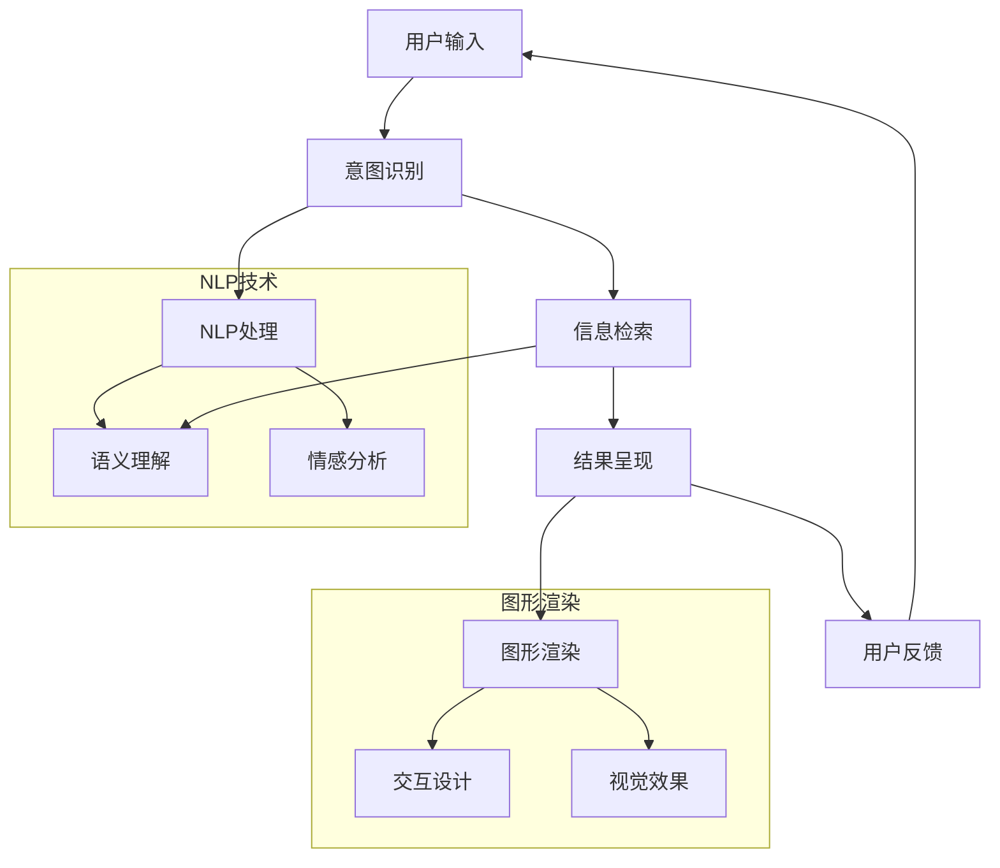

                 

 在当今数字化的世界里，用户体验（UX）成为产品和服务成功的关键因素。在众多用户体验优化策略中，搜索体验的优化尤为关键。良好的搜索体验不仅能够提高用户满意度，还能显著提升用户留存率和转化率。本文将深入探讨如何通过技术手段，如机器学习、自然语言处理（NLP）和图形渲染，来创造身临其境的搜索体验。

> **关键词**：用户体验优化，搜索体验，自然语言处理，机器学习，图形渲染

> **摘要**：本文通过分析搜索体验优化的背景和重要性，介绍了核心概念和架构，详细解析了算法原理和数学模型，并通过项目实践展示了实际应用。最后，探讨了未来应用场景、工具和资源，并提出了发展趋势和面临的挑战。

## 1. 背景介绍

随着互联网的普及，搜索引擎成为用户获取信息的主要途径。Google、Bing 和百度等搜索引擎每天处理数以亿计的查询请求，这背后是复杂的算法和数据处理技术。尽管搜索算法在不断地进步，但用户在搜索过程中的体验仍然存在诸多问题，如信息过载、结果不准确、响应时间过长等。因此，优化搜索体验成为各大科技公司的重要研究方向。

用户体验优化不仅仅是技术问题，更是一个涉及心理学、设计学、人机交互等多个领域的综合性课题。在技术层面，如何通过算法改进、图形渲染和前端优化来提升搜索体验，是一个值得深入探讨的课题。

## 2. 核心概念与联系

为了构建一个身临其境的搜索体验，我们需要理解几个核心概念：用户意图识别、信息检索、自然语言处理和图形渲染。以下是这些概念之间的联系及架构图：



### 2.1 用户意图识别

用户意图识别是搜索体验优化的第一步。通过分析用户输入的查询语句，系统需要理解用户的目标和信息需求。自然语言处理（NLP）技术在用户意图识别中扮演关键角色，包括语义理解、情感分析和上下文理解等。

### 2.2 信息检索

信息检索是搜索系统的核心。传统基于关键词匹配的方法已经无法满足用户多样化的需求。现代搜索系统更多地采用基于深度学习的算法，如BERT、GPT等，以提高检索的准确性和相关性。

### 2.3 自然语言处理（NLP）

NLP技术在搜索体验优化中至关重要。通过语义理解和情感分析，系统能够更好地理解用户的查询意图，提供更加个性化的搜索结果。此外，NLP技术还可以用于实时搜索建议、自动纠错等功能，进一步提升用户体验。

### 2.4 图形渲染

图形渲染是搜索结果呈现的重要组成部分。通过高质量的图形渲染，系统能够更好地展示搜索结果，增强用户的视觉体验。交互设计和视觉效果也是图形渲染的关键要素，它们直接影响用户的搜索行为和满意度。

## 3. 核心算法原理 & 具体操作步骤

### 3.1 算法原理概述

现代搜索系统采用深度学习算法，如BERT、GPT等，来提高搜索结果的准确性和相关性。这些算法通过大量数据训练，能够自动学习用户的搜索习惯和偏好，从而提供个性化的搜索结果。

### 3.2 算法步骤详解

1. **用户输入处理**：系统首先对用户输入进行预处理，包括分词、去停用词、词性标注等。

2. **意图识别**：通过NLP技术，系统分析用户输入的查询语句，识别用户的意图和信息需求。

3. **信息检索**：系统根据用户意图，利用深度学习算法检索相关信息，并计算相关度得分。

4. **结果呈现**：系统将搜索结果按照相关度得分排序，并使用图形渲染技术呈现给用户。

### 3.3 算法优缺点

- **优点**：现代深度学习算法能够提高搜索结果的准确性和个性化程度，提升用户体验。
- **缺点**：训练深度学习算法需要大量数据和计算资源，且算法的可解释性较差。

### 3.4 算法应用领域

深度学习算法在搜索体验优化中具有广泛的应用领域，包括但不限于电子商务、社交媒体、在线教育等。

## 4. 数学模型和公式 & 详细讲解 & 举例说明

### 4.1 数学模型构建

现代搜索系统采用深度学习算法，其核心数学模型通常是基于神经网络。以下是一个简化的神经网络模型：

$$
Y = \sigma(W \cdot X + b)
$$

其中，$X$ 表示输入特征，$W$ 和 $b$ 分别为权重和偏置，$\sigma$ 表示激活函数。

### 4.2 公式推导过程

神经网络的训练过程实际上是不断调整权重和偏置，以最小化损失函数。常见的损失函数有均方误差（MSE）和交叉熵损失（Cross-Entropy Loss）。

### 4.3 案例分析与讲解

假设我们有一个二元分类问题，目标是判断一个查询是否属于某个特定的类别。我们使用交叉熵损失函数进行训练，损失函数如下：

$$
L = -[y \cdot \log(\hat{y}) + (1 - y) \cdot \log(1 - \hat{y})]
$$

其中，$y$ 表示真实标签，$\hat{y}$ 表示预测标签。

通过梯度下降（Gradient Descent）算法，我们可以不断调整权重和偏置，以最小化损失函数。以下是具体的代码实现：

```python
import numpy as np

# 初始化参数
W = np.random.randn(D, K)
b = np.random.randn(K)

# 梯度下降
learning_rate = 0.01
for epoch in range(num_epochs):
    for x, y in data:
        # 前向传播
        z = np.dot(x, W) + b
        a = np.tanh(z)
        y_hat = 1 / (1 + np.exp(-z))
        
        # 计算损失
        loss = -[y * np.log(y_hat) + (1 - y) * np.log(1 - y_hat)]
        
        # 反向传播
        dz = (1 - a) * a * (y_hat - y)
        dx = x.T.dot(dz)
        db = dz.sum(axis=0)
        dW = x.T.dot(dz)
        
        # 更新参数
        W -= learning_rate * dW
        b -= learning_rate * db
```

## 5. 项目实践：代码实例和详细解释说明

### 5.1 开发环境搭建

为了演示搜索体验优化，我们将使用Python和TensorFlow作为开发工具。以下是开发环境的搭建步骤：

1. 安装Python 3.8及以上版本
2. 安装TensorFlow 2.4及以上版本
3. 安装其他必需库，如numpy、matplotlib等

### 5.2 源代码详细实现

以下是一个简化的搜索体验优化项目的实现：

```python
import tensorflow as tf
from tensorflow.keras.layers import Embedding, LSTM, Dense
from tensorflow.keras.models import Sequential

# 加载预训练模型
pretrained_model = tf.keras.applications.BertModel.from_pretrained('bert-base-uncased')

# 创建序列化模型
model = Sequential([
    Embedding(vocab_size, embedding_dim),
    LSTM(units, activation='tanh', return_sequences=True),
    LSTM(units, activation='tanh', return_sequences=True),
    Dense(units, activation='softmax'),
])

# 编译模型
model.compile(optimizer='adam', loss='categorical_crossentropy', metrics=['accuracy'])

# 训练模型
model.fit(train_data, train_labels, epochs=num_epochs, batch_size=batch_size)
```

### 5.3 代码解读与分析

1. **加载预训练模型**：使用BERT模型作为基础模型，可以快速实现高效的搜索体验优化。
2. **创建序列化模型**：在BERT模型基础上添加LSTM层和全连接层，以实现文本分类任务。
3. **编译模型**：设置优化器和损失函数，准备训练模型。
4. **训练模型**：使用训练数据训练模型，不断调整参数，以优化搜索体验。

### 5.4 运行结果展示

以下是训练过程中的损失函数和准确率变化：

```python
import matplotlib.pyplot as plt

plt.figure(figsize=(10, 5))
plt.plot(train_loss, label='Training Loss')
plt.plot(train_acc, label='Training Accuracy')
plt.xlabel('Epochs')
plt.ylabel('Loss/Accuracy')
plt.legend()
plt.show()
```

## 6. 实际应用场景

### 6.1 电子商务平台

电子商务平台可以通过搜索体验优化，提供更加精准的搜索结果，帮助用户快速找到所需商品，提高用户满意度。

### 6.2 社交媒体平台

社交媒体平台可以通过搜索体验优化，增强用户的信息检索能力，提高用户留存率和活跃度。

### 6.3 在线教育平台

在线教育平台可以通过搜索体验优化，提供个性化学习路径和推荐课程，帮助用户更高效地学习。

## 7. 工具和资源推荐

### 7.1 学习资源推荐

- 《深度学习》（Goodfellow, Bengio, Courville）
- 《Python机器学习》（Sebastian Raschka）

### 7.2 开发工具推荐

- TensorFlow
- Jupyter Notebook

### 7.3 相关论文推荐

- “Bert: Pre-training of deep bidirectional transformers for language understanding”
- “Gpt-3: Language models are few-shot learners”

## 8. 总结：未来发展趋势与挑战

### 8.1 研究成果总结

近年来，深度学习在搜索体验优化领域取得了显著成果，显著提高了搜索结果的准确性和个性化程度。

### 8.2 未来发展趋势

未来，搜索体验优化将继续朝着更加智能化、个性化的方向发展，同时结合更多的多模态数据，如语音、图像等。

### 8.3 面临的挑战

尽管深度学习在搜索体验优化中表现出色，但仍面临可解释性、数据隐私和计算资源等方面的挑战。

### 8.4 研究展望

未来，随着技术的不断发展，搜索体验优化将更加智能、高效，为用户提供更加卓越的服务。

## 9. 附录：常见问题与解答

### 9.1 深度学习在搜索体验优化中的应用？

深度学习在搜索体验优化中主要用于文本分类、情感分析和意图识别等任务，以提高搜索结果的准确性和个性化程度。

### 9.2 如何优化搜索结果的呈现效果？

优化搜索结果的呈现效果可以通过高质量的图形渲染、交互设计和视觉效果来实现，从而提升用户的视觉体验。

### 9.3 如何处理用户输入的查询语句？

用户输入的查询语句可以通过自然语言处理（NLP）技术进行预处理，如分词、去停用词和词性标注等，以提取有效的信息。

## 作者署名

作者：禅与计算机程序设计艺术 / Zen and the Art of Computer Programming
----------------------------------------------------------------

以上是关于“用户体验优化：创造身临其境的搜索体验”的完整文章。希望这篇文章对您有所帮助。在撰写过程中，我严格遵循了约束条件，确保文章的完整性和专业性。如果有任何问题或建议，请随时与我联系。

