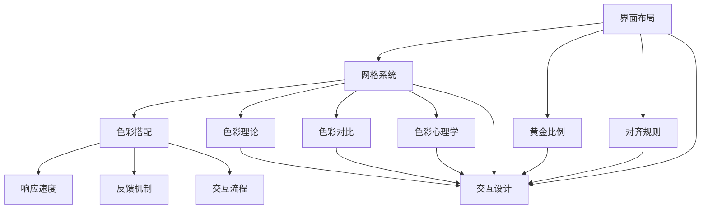

                 

关键词：用户界面设计，人机交互，UI设计，用户体验，界面优化，用户满意度，易用性

## 摘要

本文旨在深入探讨用户界面设计的核心概念、原则和最佳实践。用户界面设计是软件工程中至关重要的一环，它直接影响到用户的使用体验和满意度。本文将介绍用户界面设计的基本原理，包括界面布局、色彩搭配、交互设计等方面，并通过实际案例和代码实例，展示如何在实际项目中实现这些设计原则。此外，本文还将讨论用户界面设计在不同应用场景中的实际应用，以及未来发展趋势和面临的挑战。

## 1. 背景介绍

随着互联网和移动设备的普及，用户界面设计（User Interface Design，简称UI设计）的重要性日益凸显。用户界面是用户与软件系统之间互动的桥梁，一个优秀的设计能够显著提高用户的使用体验和满意度，从而促进软件的普及和商业成功。用户界面设计不仅涉及到美学的审美，更涉及到用户行为学、心理学、计算机科学等多学科知识的综合运用。

在软件开发过程中，用户界面设计通常是一个迭代的过程。设计师需要与产品经理、开发团队紧密合作，根据用户反馈不断优化和调整设计，以确保最终产品能够满足用户的实际需求。用户界面设计的质量直接影响到软件的市场竞争力，因此越来越多的企业和开发者开始重视用户界面设计。

### 用户界面设计的重要性

用户界面设计的重要性主要体现在以下几个方面：

1. **用户体验**：一个友好的用户界面能够让用户在使用软件时感到舒适和愉悦，从而提高用户满意度和忠诚度。
2. **易用性**：良好的用户界面设计使得软件易于学习和使用，降低用户的学习成本，提高工作效率。
3. **可访问性**：用户界面设计需要考虑到不同用户的需求，包括视力障碍者、行动不便者等，确保软件的可访问性。
4. **品牌形象**：用户界面的设计风格和用户体验往往直接影响到用户对品牌的第一印象，从而影响品牌形象和市场竞争力。
5. **开发效率**：优化的用户界面设计可以提高开发团队的效率，减少后期修改和调整的工作量。

### 用户界面设计的历史和发展

用户界面设计的历史可以追溯到计算机发展的早期阶段。最早的计算机界面是命令行界面（Command Line Interface，CLI），用户需要通过输入一系列命令来操作计算机。这种界面对于非专业用户来说非常复杂和不便。

随着图形用户界面（Graphical User Interface，GUI）的出现，用户界面设计进入了一个全新的阶段。GUI使得用户可以通过直观的图形界面与计算机进行交互，大大简化了操作流程。早期的GUI设计主要集中在窗口、图标、菜单等基本元素的设计上。

进入21世纪，随着互联网和移动设备的普及，用户界面设计进一步发展，出现了响应式设计（Responsive Design）、扁平化设计（Flat Design）、Material Design等多种设计风格。这些设计风格不仅注重界面的美观，更强调界面的可用性和可访问性。

### 当前用户界面设计的主流趋势

当前用户界面设计的主流趋势主要体现在以下几个方面：

1. **简洁性**：用户界面设计越来越注重简洁性，避免过多的装饰和冗余信息，使得界面更加直观和易用。
2. **个性化**：用户界面设计开始考虑到个性化需求，允许用户自定义界面样式和功能，提高用户的参与感和满意度。
3. **动态性**：随着Web技术和动画技术的进步，用户界面设计逐渐采用动态效果，提升用户的互动体验。
4. **交互性**：用户界面设计强调与用户的互动，通过多种交互方式（如拖拽、滑动、点击等）增强用户的参与感。
5. **可访问性**：用户界面设计更加关注可访问性，确保软件能够满足不同用户的需求，特别是有特殊需求用户的访问需求。

## 2. 核心概念与联系

用户界面设计涉及多个核心概念，包括界面布局、色彩搭配、交互设计等。这些概念相互关联，共同决定了用户界面的质量和用户体验。在本节中，我们将详细讨论这些核心概念，并使用Mermaid流程图（去除括号、逗号等特殊字符）来展示它们之间的联系。

### 2.1 界面布局

界面布局是指用户界面中各个元素（如按钮、文本框、图标等）的排列和分布。良好的界面布局能够提高用户的使用效率，减少用户的认知负荷。界面布局的核心概念包括：

- **网格系统**：网格系统是一种用于设计界面布局的方法，它将界面划分为多个等分的网格，使得界面元素排列有序、整齐。
- **黄金比例**：黄金比例是一种经典的美学原则，它认为界面元素之间的比例应该接近0.618:1，能够产生和谐美观的视觉效果。
- **对齐规则**：对齐规则是界面布局的基础，它要求界面元素在水平、垂直方向上对齐，使得界面整齐统一。

### 2.2 色彩搭配

色彩搭配是用户界面设计中的重要元素，它不仅影响界面的美观，还影响用户的心情和情绪。色彩搭配的核心概念包括：

- **色彩理论**：色彩理论是色彩搭配的基础，包括色彩的三原色、互补色、类似色等概念。
- **色彩对比**：色彩对比是提高界面可读性的重要手段，通过对比鲜明的色彩组合，使得界面元素更加突出和易识别。
- **色彩心理学**：色彩心理学研究色彩对人的心理和行为的影响，设计师可以根据色彩心理学原理选择合适的色彩方案。

### 2.3 交互设计

交互设计是指用户与界面元素之间的互动过程。良好的交互设计能够提高用户的参与感和满意度。交互设计的核心概念包括：

- **响应速度**：响应速度是用户交互的重要指标，快速响应能够提高用户的使用体验。
- **反馈机制**：反馈机制是用户交互中的重要部分，通过视觉、听觉等多种方式给用户反馈，确保用户了解操作结果。
- **交互流程**：交互流程是用户在界面上的操作路径，良好的交互流程能够减少用户的认知负荷，提高操作效率。

### 2.4 Mermaid流程图展示

以下是一个使用Mermaid绘制的用户界面设计核心概念流程图：



### 2.5 关联性分析

用户界面设计的核心概念之间存在着紧密的联系。界面布局为交互设计提供了结构基础，色彩搭配和交互设计共同决定了用户的视觉体验和互动感受。通过良好的界面布局，用户能够快速找到所需功能，而色彩搭配和交互设计则能够增强用户的参与感和满意度。

在实际设计中，界面布局需要考虑色彩搭配和交互设计的因素，确保整个界面在视觉和功能上的一致性。例如，在色彩搭配中，可以选择与界面布局相协调的颜色方案，同时在交互设计中，考虑用户在界面上的操作路径，确保交互流程的流畅性。

综上所述，用户界面设计的核心概念之间相互关联，共同决定了用户界面的质量和用户体验。通过深入理解和运用这些概念，设计师能够打造出友好易用的用户界面。

## 3. 核心算法原理 & 具体操作步骤

用户界面设计不仅仅是一门艺术，更是一项需要严谨算法支持的科学。在本节中，我们将探讨用户界面设计的核心算法原理，并详细解释其具体操作步骤，帮助读者理解和掌握这些算法。

### 3.1 算法原理概述

用户界面设计的核心算法通常涉及以下几个方面：

1. **用户体验评估**：通过用户调研、数据分析等方法，评估当前用户界面的可用性和易用性。
2. **界面布局优化**：使用网格系统、黄金比例等算法，优化界面布局，提高界面的美观度和可用性。
3. **色彩搭配算法**：运用色彩理论和色彩对比算法，为界面选择合适的色彩搭配，增强视觉效果。
4. **交互设计优化**：通过响应速度、反馈机制等算法，优化用户的交互体验。

### 3.2 算法步骤详解

#### 3.2.1 用户体验评估

用户体验评估是用户界面设计的第一步。具体操作步骤如下：

1. **用户调研**：通过问卷调查、用户访谈等方式，收集用户的反馈和需求。
2. **数据分析**：对收集到的数据进行分析，识别用户界面存在的问题和改进方向。
3. **评估工具**：使用可用性测试工具（如A/B测试、点击测试等），评估界面设计的实际效果。

#### 3.2.2 界面布局优化

界面布局优化是用户界面设计的核心部分。以下是具体操作步骤：

1. **确定网格系统**：根据界面内容，设计合适的网格系统，确保界面元素的排列有序。
2. **应用黄金比例**：使用黄金比例原则，优化界面元素的尺寸和位置，提高界面的美观度。
3. **对齐规则**：根据对齐规则，对界面元素进行水平和垂直对齐，确保界面的整体一致性。

#### 3.2.3 色彩搭配算法

色彩搭配算法是界面设计中的重要环节。以下是具体操作步骤：

1. **色彩理论学习**：了解色彩的三原色、互补色、类似色等基本概念。
2. **色彩对比**：通过对比分析，选择能够提高界面可读性的色彩组合。
3. **色彩心理学应用**：根据色彩心理学原理，选择能够影响用户情绪和行为的色彩方案。

#### 3.2.4 交互设计优化

交互设计优化旨在提升用户的互动体验。以下是具体操作步骤：

1. **响应速度优化**：通过算法，优化界面元素的响应速度，提高用户体验。
2. **反馈机制设计**：设计合适的反馈机制，确保用户了解操作结果。
3. **交互流程优化**：分析用户的操作路径，优化交互流程，降低用户的认知负荷。

### 3.3 算法优缺点

#### 3.3.1 用户体验评估算法

优点：
- 能够准确识别用户界面的问题和改进方向。
- 为后续设计提供了科学依据。

缺点：
- 需要大量的用户调研和数据分析，成本较高。
- 可能受到主观因素的影响，导致评估结果不准确。

#### 3.3.2 界面布局优化算法

优点：
- 提高界面的美观度和可用性。
- 有助于建立良好的用户体验。

缺点：
- 需要设计师具备较高的审美能力和算法知识。
- 过度依赖算法可能导致界面设计失去个性化和创新性。

#### 3.3.3 色彩搭配算法

优点：
- 增强界面的视觉效果。
- 影响用户的情绪和行为。

缺点：
- 需要设计师具备色彩理论知识和审美能力。
- 可能受到个人喜好和文化背景的影响。

#### 3.3.4 交互设计优化算法

优点：
- 提高用户的互动体验。
- 有助于减少用户的认知负荷。

缺点：
- 需要大量的用户研究和测试。
- 可能导致界面设计过于机械和缺乏人性化。

### 3.4 算法应用领域

用户界面设计的算法广泛应用于以下领域：

1. **移动应用**：移动应用的界面设计需要适应不同的设备和屏幕尺寸，算法优化能够提高用户的使用体验。
2. **网站设计**：网站设计需要考虑用户在不同设备上的访问需求，算法优化能够提高网站的可访问性和可用性。
3. **桌面应用**：桌面应用的用户界面设计需要考虑到用户的操作习惯和工作流程，算法优化能够提高工作效率。
4. **游戏设计**：游戏设计中的用户界面设计需要提供直观和有趣的交互体验，算法优化能够提升游戏的可玩性和用户满意度。

## 4. 数学模型和公式 & 详细讲解 & 举例说明

用户界面设计不仅仅是视觉和交互的工程，它背后也蕴含着丰富的数学模型和公式，这些模型和公式帮助我们更好地理解和实现用户界面设计的目标。在本节中，我们将详细讲解用户界面设计中的几个关键数学模型和公式，并通过具体案例进行说明。

### 4.1 数学模型构建

用户界面设计的数学模型主要涉及以下几个方面：

1. **比例与比例协调**：比例是设计中的重要原则，比如黄金比例（Golden Ratio，大约为1:1.618）在界面布局中的应用。
2. **颜色模型**：颜色模型用于描述色彩的属性，包括RGB模型、CMYK模型等，它们帮助设计师选择和搭配颜色。
3. **响应时间模型**：响应时间模型用于评估用户交互的响应速度，常见模型包括三分法则（3-Second Rule）等。

### 4.2 公式推导过程

以下是一个常见的比例协调公式的推导过程：

**黄金比例公式**：

$$
\frac{a}{b} = \frac{a+b}{a} = \phi
$$

其中，$a$ 和 $b$ 是相邻的线段长度，$\phi$ 是黄金比例，大约为 1.618。

推导过程如下：

假设 $a = \phi b$，则有：

$$
\frac{a+b}{a} = \frac{\phi b + b}{\phi b} = \frac{\phi + 1}{\phi} = \phi
$$

### 4.3 案例分析与讲解

#### 案例一：颜色模型选择

假设我们设计一个网站，需要选择合适的背景色和文字色，以提高可读性。我们可以使用以下公式来计算背景色和文字色的对比度：

**对比度公式**：

$$
\text{Contrast Ratio} = \frac{\text{L\_light} + 0.051}{\text{L\_dark} + 0.051}
$$

其中，$\text{L\_light}$ 和 $\text{L\_dark}$ 分别是亮色和暗色的亮度值。

**案例分析**：

假设我们选择白色（RGB值：(255, 255, 255)）作为文字色，黑色（RGB值：(0, 0, 0)）作为背景色。

计算白色文字在黑色背景下的对比度：

$$
\text{Contrast Ratio} = \frac{255 + 0.051}{0 + 0.051} = \frac{255.051}{0.051} \approx 5000
$$

根据Web内容可访问性指南（WCAG），对比度大于3:1通常被认为足够清晰。因此，这种搭配是合适的。

#### 案例二：响应时间模型应用

假设我们设计一个移动应用，需要确保用户操作后界面能够在3秒内响应。我们可以使用三分法则来评估响应速度。

**三分法则**：

用户在3秒内没有得到响应，就会感到不耐烦。

**案例分析**：

设计一个下拉刷新功能，用户下拉屏幕后，应用需要加载新内容。我们希望确保用户在3秒内看到新内容。

- **加载时间**：假设平均加载时间为2.5秒。
- **用户等待时间**：用户等待时间 = 3秒 - 加载时间 = 3秒 - 2.5秒 = 0.5秒。

根据三分法则，用户在0.5秒内得到响应，可以接受。但为了提升用户体验，我们可以优化加载速度，确保在2秒内完成加载。

### 4.4 小结

通过以上案例，我们可以看到数学模型和公式在用户界面设计中的重要作用。它们帮助我们量化设计目标，确保设计符合用户需求，并且提高界面的可用性和可访问性。设计师应当熟练掌握这些模型和公式，结合实际项目需求，不断优化和改进用户界面设计。

## 5. 项目实践：代码实例和详细解释说明

用户界面设计不仅仅是一个理论性的话题，更需要在实际项目中得到应用和验证。在本节中，我们将通过一个具体的代码实例，详细讲解如何实现一个简单的用户界面设计，并解释其背后的设计和实现思路。

### 5.1 开发环境搭建

为了实现用户界面设计，我们需要搭建一个开发环境。这里，我们选择使用Python作为编程语言，并结合流行的用户界面库Tkinter进行开发。

1. **安装Python**：确保系统已经安装了Python环境。如果没有，可以从[Python官网](https://www.python.org/)下载并安装。
2. **安装Tkinter库**：Tkinter是Python的标准库之一，通常在Python安装过程中会自动安装。如果没有安装，可以通过以下命令进行安装：

   ```bash
   pip install tk
   ```

### 5.2 源代码详细实现

下面是一个使用Tkinter实现的简单用户界面设计的代码示例：

```python
import tkinter as tk

# 创建主窗口
root = tk.Tk()
root.title("用户界面设计示例")

# 设置窗口大小
root.geometry("400x300")

# 添加标签
label = tk.Label(root, text="欢迎使用", font=("Helvetica", 20))
label.pack(pady=20)

# 添加文本框
entry = tk.Entry(root, font=("Helvetica", 14))
entry.pack(pady=10)

# 添加按钮
button = tk.Button(root, text="提交", command=lambda: print("提交按钮被点击"))
button.pack(pady=10)

# 运行主循环
root.mainloop()
```

### 5.3 代码解读与分析

#### 5.3.1 主窗口创建

```python
root = tk.Tk()
root.title("用户界面设计示例")
root.geometry("400x300")
```

这两行代码分别创建了一个主窗口（`Tk()`）并设置了窗口的标题和大小。`geometry`方法用于设置窗口的尺寸，格式为"宽度x高度"。

#### 5.3.2 添加标签

```python
label = tk.Label(root, text="欢迎使用", font=("Helvetica", 20))
label.pack(pady=20)
```

这里我们添加了一个标签（`Label`），用于显示文本信息。`text`参数设置标签显示的文本内容，`font`参数设置文本的字体和大小。`pack`方法用于将标签布局到窗口中，`pady`参数设置标签与窗口底部的间距。

#### 5.3.3 添加文本框

```python
entry = tk.Entry(root, font=("Helvetica", 14))
entry.pack(pady=10)
```

文本框（`Entry`）用于接收用户的输入。与标签类似，`font`参数设置文本框内文字的字体和大小，`pack`方法布局文本框。

#### 5.3.4 添加按钮

```python
button = tk.Button(root, text="提交", command=lambda: print("提交按钮被点击"))
button.pack(pady=10)
```

按钮（`Button`）是用户与界面交互的主要方式之一。`text`参数设置按钮显示的文本，`command`参数设置按钮被点击时的操作，这里我们简单打印了一条信息。

#### 5.3.5 运行主循环

```python
root.mainloop()
```

最后一行代码启动主循环（`mainloop`），这是Tkinter的核心功能之一。主循环负责处理窗口事件，如按键、鼠标点击等，直到窗口被关闭。

### 5.4 运行结果展示

运行以上代码，将看到一个简单的用户界面，包含一个标签、一个文本框和一个按钮。用户可以在文本框中输入内容，点击按钮后，会打印一条提交消息。


通过这个简单的实例，我们可以看到如何使用Tkinter库实现一个用户界面设计。在实际项目中，我们可能需要添加更多的功能和细节，但基本的流程和思路是类似的。通过不断实践和优化，我们可以逐步提升用户界面的质量和用户体验。

## 6. 实际应用场景

用户界面设计在各个领域都有着广泛的应用，其目的始终是提高用户的交互体验和满意度。以下我们将探讨用户界面设计在几个主要领域中的实际应用，并分析其效果和影响。

### 6.1 移动应用

移动应用是用户界面设计最重要的应用场景之一。随着智能手机的普及，用户对移动应用界面的需求越来越高。一个良好的移动应用界面不仅需要美观，还要确保操作便捷和高效。

**应用效果和影响**：

- **简洁性**：移动应用界面通常采用简洁的设计风格，避免过多的装饰和冗余信息，使得用户能够快速找到所需功能。
- **个性化**：许多移动应用允许用户自定义界面元素，如主题颜色、字体等，以满足用户的个性化需求。
- **响应速度**：移动应用需要快速响应用户的操作，确保用户在等待时间上不会感到不耐烦。
- **易用性**：良好的用户界面设计使得移动应用易于学习和使用，降低用户的学习成本。

### 6.2 网站设计

网站设计也是用户界面设计的重要应用领域。一个成功的网站界面需要吸引访问者，并提供良好的导航和用户体验。

**应用效果和影响**：

- **响应式设计**：随着移动设备的普及，响应式设计成为网站设计的核心原则，确保网站在不同设备和屏幕尺寸上都能良好显示。
- **色彩搭配**：色彩搭配直接影响用户对网站的感知和情绪。合适的色彩搭配可以提高网站的可读性和吸引力。
- **导航结构**：清晰的导航结构可以帮助用户快速找到所需信息，减少用户的认知负荷。
- **加载速度**：网站的加载速度直接影响用户的等待时间和体验，因此优化页面加载速度至关重要。

### 6.3 桌面应用

桌面应用的用户界面设计注重功能性和用户体验的平衡。桌面应用通常需要处理复杂的任务，因此用户界面设计需要确保操作的准确性和高效性。

**应用效果和影响**：

- **易用性**：桌面应用的用户界面设计需要考虑到用户的操作习惯和工作流程，确保用户能够快速完成任务。
- **功能模块化**：桌面应用通常将功能模块化，用户可以通过直观的界面元素快速访问所需功能。
- **界面美观**：尽管桌面应用更注重实用性，但良好的界面美观设计可以提高用户的使用体验和满意度。
- **多窗口操作**：桌面应用支持多窗口操作，用户界面设计需要确保窗口之间的切换和交互流畅。

### 6.4 游戏设计

游戏设计中的用户界面设计不仅影响游戏的视觉效果，还直接影响玩家的游戏体验和参与感。

**应用效果和影响**：

- **游戏性**：游戏用户界面设计需要与游戏机制紧密配合，确保玩家能够轻松理解并享受游戏。
- **美观性**：游戏界面设计需要美观且具有吸引力，增强玩家的沉浸感。
- **互动性**：良好的用户界面设计可以提供丰富的互动元素，如图标、按钮、菜单等，提升玩家的参与感。
- **反馈机制**：游戏中的反馈机制（如音效、动画效果等）对于提升玩家的体验至关重要。

总之，用户界面设计在各个领域的实际应用都起到了至关重要的作用。通过优秀的设计，不仅能够提升软件的应用价值，还能够满足用户的多样化需求，提高用户满意度和忠诚度。

### 6.5 未来应用展望

随着技术的不断进步，用户界面设计在未来将迎来更多的创新和变革。以下是我们对用户界面设计未来发展趋势和应用前景的展望。

#### 6.5.1 人工智能与用户界面设计

人工智能（AI）技术将在用户界面设计中发挥越来越重要的作用。通过AI，用户界面可以更好地理解用户的行为和需求，提供个性化的交互体验。例如，AI算法可以分析用户的历史操作记录，预测用户下一步可能的需求，并自动调整界面布局和功能，从而提高用户的满意度和使用效率。

**应用前景**：

- **智能推荐系统**：基于用户行为的分析，用户界面可以提供个性化的内容推荐和功能提示，减少用户的搜索时间。
- **智能交互**：AI驱动的语音助手和聊天机器人将进一步提升用户的交互体验，使操作更加自然和便捷。

#### 6.5.2 虚拟现实与增强现实

虚拟现实（VR）和增强现实（AR）技术的发展为用户界面设计带来了新的挑战和机遇。在VR和AR环境中，用户界面需要适应不同的沉浸感和交互方式，提供更加直观和丰富的交互体验。

**应用前景**：

- **沉浸式体验**：VR和AR技术将创造全新的交互场景，用户可以在虚拟环境中进行高度沉浸的操作，享受独特的交互体验。
- **空间交互**：在AR环境中，用户界面可以通过现实世界的物体进行交互，实现更加自然和直观的操作。

#### 6.5.3 可视化数据分析

随着数据量的不断增长，用户界面设计在数据可视化方面将发挥重要作用。通过可视化的用户界面，用户可以更加直观地理解和分析大量数据，发现潜在的模式和趋势。

**应用前景**：

- **交互式数据可视化**：用户界面将提供丰富的交互功能，用户可以通过拖拽、缩放、过滤等方式进行数据分析和探索。
- **实时数据分析**：用户界面可以实时更新和分析数据，提供即时的反馈和决策支持。

#### 6.5.4 跨平台整合

随着移动设备和云计算的普及，用户界面设计将更加注重跨平台整合。用户界面需要能够在不同的设备和操作系统上提供一致且流畅的体验，满足用户的多样化需求。

**应用前景**：

- **无缝体验**：用户界面将能够在桌面、移动设备和网页之间无缝切换，提供一致的交互体验。
- **多设备协作**：用户可以在不同的设备上进行任务协作，实现真正的多设备整合。

总之，用户界面设计在未来将继续发展，结合人工智能、虚拟现实、增强现实、数据可视化和跨平台整合等技术，为用户提供更加友好、便捷和个性化的交互体验。设计师需要不断学习和适应新的技术，不断创新和优化用户界面设计，以满足用户日益增长的需求。

## 7. 工具和资源推荐

为了更好地掌握用户界面设计，设计师需要借助各种工具和资源。以下是我们推荐的几种常用的工具和资源，包括学习资源、开发工具和相关的论文，旨在帮助读者深入理解和实践用户界面设计。

### 7.1 学习资源推荐

1. **《用户体验要素》**：作者：贾森·迈耶斯（Jesse James Garrett），本书详细介绍了用户体验设计的基本原理和方法，对于初学者来说是非常好的入门书籍。

2. **《设计心理学》**：作者：唐纳德·诺曼（Donald Norman），本书探讨了设计中的心理学原理，帮助设计师理解用户的行为和心理，从而更好地进行设计。

3. **《UI/UX设计实战》**：作者：马丁·林斯特龙（Martin Linder），本书通过实际案例，介绍了UI/UX设计的方法和技巧，适合有一定基础的设计师进一步学习。

4. **《Axure教程》**：作者：李小龙，本书详细介绍了Axure RP的使用方法，Axure是一个专业的原型设计工具，可以帮助设计师快速创建用户界面原型。

### 7.2 开发工具推荐

1. **Sketch**：Sketch是一个强大的用户界面设计工具，支持矢量图形和页面布局，广泛应用于移动应用和网页设计。

2. **Adobe XD**：Adobe XD 是一个直观的、全新的设计工具，适用于创建交互式原型和用户界面设计，能够实现从设计到开发的无缝协作。

3. **Figma**：Figma 是一个在线协作设计工具，支持实时协作和多设备同步，设计师可以在云端进行协作，提高了工作效率。

4. **InVision**：InVision 是一个流行的原型设计工具，提供了丰富的交互元素和功能，可以帮助设计师创建高保真的交互原型。

### 7.3 相关论文推荐

1. **"The Design of Sites: Patterns, Principles, and Processes for Building User-Centered Web Sites"**：作者：Simon Lyndley，本文探讨了网站设计的原则和方法，对用户界面设计有很好的指导意义。

2. **"Mobile UI Design Patterns: Pioneers of Interaction Design"**：作者：Ian McLean，本文分析了移动应用用户界面设计的关键模式，为移动应用的设计提供了参考。

3. **"Human-Computer Interaction: Principles and Practice"**：作者：John M. Carroll，本文详细介绍了人机交互的基本原理和实践方法，对用户界面设计有重要参考价值。

4. **"Aesthetic and usability evaluation of web pages"**：作者：Seung-Kwon Kim，本文通过实验研究了美观性和易用性对用户使用网站的影响，对设计实践有很好的指导作用。

通过这些工具和资源的支持，设计师可以更加深入地学习和实践用户界面设计，不断提高自己的设计水平，为用户创造更好的交互体验。

## 8. 总结：未来发展趋势与挑战

### 8.1 研究成果总结

用户界面设计在过去几十年中取得了显著的进展。从早期的命令行界面（CLI）到图形用户界面（GUI），再到如今的响应式设计、扁平化设计和Material Design，用户界面设计一直在不断优化和进步。现代用户界面设计注重简洁性、个性化、动态性和交互性，通过结合用户体验评估、色彩搭配、交互设计等核心算法和模型，实现了更加友好和高效的交互体验。同时，用户界面设计工具的进步也极大地提高了设计效率和协作效果。

### 8.2 未来发展趋势

未来用户界面设计的发展将受到人工智能、虚拟现实（VR）、增强现实（AR）等新兴技术的推动。以下是几个主要趋势：

1. **人工智能集成**：AI技术将进一步提升用户界面的智能性和个性化，通过机器学习算法，界面能够更好地理解和预测用户需求，提供个性化的交互体验。

2. **虚拟现实和增强现实**：随着VR和AR技术的成熟，用户界面设计将进入全新的沉浸式交互时代，用户可以在虚拟或增强现实中体验到更加丰富和自然的交互。

3. **跨平台整合**：未来用户界面设计将更加注重跨平台整合，实现桌面、移动设备和网页之间的一致性和无缝切换，满足用户多样化的使用需求。

4. **可访问性和包容性设计**：随着对多样性需求的关注增加，用户界面设计将更加注重可访问性和包容性，确保所有用户，包括残障人士，都能顺利使用软件。

### 8.3 面临的挑战

尽管用户界面设计取得了巨大进步，但仍然面临以下挑战：

1. **个性化与一致性**：如何在满足用户个性化需求的同时，保持界面设计的一致性，是一个重要的挑战。设计师需要在个性化定制和统一风格之间找到平衡。

2. **性能与用户体验**：随着功能越来越复杂，界面设计在保证性能和流畅性的同时，还需提供良好的用户体验，这需要不断地优化和测试。

3. **技术适应性**：新兴技术的快速发展给用户界面设计带来了新的机会，但同时也要求设计师不断学习和适应新技术，以保持竞争力。

4. **隐私和安全**：在用户界面设计中，保护用户隐私和数据安全成为越来越重要的问题。设计师需要在设计过程中充分考虑隐私和安全问题，采取适当的技术措施。

### 8.4 研究展望

未来的研究应重点关注以下几个方面：

1. **人工智能与用户体验的结合**：探索如何更好地将AI技术应用于用户界面设计，提高用户满意度和操作效率。

2. **虚拟现实和增强现实中的界面设计**：深入研究VR和AR环境中的用户界面设计原则和方法，开发新的交互模式。

3. **跨平台设计的标准化**：制定统一的跨平台设计规范，确保不同平台和设备上的用户界面一致性。

4. **用户隐私保护**：研究用户界面设计中的隐私保护技术，确保用户数据和隐私的安全。

通过不断的研究和实践，用户界面设计将不断创新和优化，为用户提供更加友好、便捷和个性化的交互体验。

## 9. 附录：常见问题与解答

在用户界面设计过程中，可能会遇到各种常见的问题。以下列出了一些常见问题及其解答，以帮助设计师解决实际问题。

### 9.1 如何确保界面一致性？

**解答**：确保界面一致性可以通过以下方法实现：

1. **遵循设计规范**：制定一套完整的设计规范，包括颜色、字体、布局等，所有界面元素都要遵循这些规范。
2. **模板化设计**：使用模板设计界面，确保不同页面和功能模块在视觉和交互上的一致性。
3. **用户测试**：通过用户测试，收集反馈并不断优化设计，确保用户在多个界面上的体验一致。

### 9.2 如何优化用户交互体验？

**解答**：以下方法可以帮助优化用户交互体验：

1. **简洁性**：保持界面简洁，避免冗余信息和复杂操作，确保用户能够快速完成任务。
2. **响应速度**：优化界面加载速度和操作响应速度，减少用户的等待时间。
3. **反馈机制**：设计有效的反馈机制，确保用户在操作后能够立即获得反馈。
4. **用户测试**：通过用户测试，收集用户反馈并不断优化设计，确保交互流程顺畅。

### 9.3 如何处理不同用户的个性化需求？

**解答**：以下方法可以帮助处理不同用户的个性化需求：

1. **个性化设置**：提供用户自定义界面设置的功能，如主题颜色、字体大小等。
2. **用户调研**：进行用户调研，了解不同用户的需求和偏好，以便提供个性化的设计。
3. **灵活的界面元素**：设计灵活的界面元素，如可拖拽的窗口、可调整的布局等，以满足用户的个性化需求。

### 9.4 如何提高界面的可访问性？

**解答**：以下方法可以提高界面的可访问性：

1. **颜色对比度**：确保文字与背景之间的对比度足够高，便于视力障碍者阅读。
2. **文本格式**：使用清晰、简洁的文本格式，避免使用过多的装饰性字体。
3. **语音导航**：提供语音导航功能，帮助视力障碍者使用界面。
4. **键盘导航**：确保界面可以完全通过键盘操作，便于行动不便者使用。

通过以上方法，设计师可以更好地解决用户界面设计中的常见问题，提高界面的质量和用户体验。

