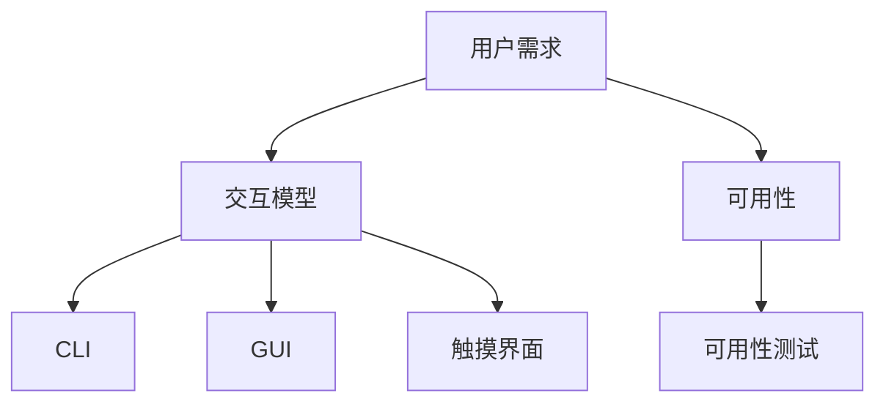

                 

关键词：用户界面设计、人机交互、用户体验、界面架构、交互模型、可用性测试

> 摘要：本文从用户界面设计的核心概念、理论框架、算法原理、实践应用等多个角度，全面探讨了如何打造友好易用的人机交互体验。通过对用户需求的理解、界面设计的最佳实践、核心算法的解析，以及实际项目中的具体应用，为开发者提供了系统性的指导。

## 1. 背景介绍

在当今的信息化时代，用户界面（User Interface，UI）设计已经成为了软件产品的重要组成部分。一个优秀的用户界面不仅能够提升用户体验（User Experience，UX），还能直接影响到产品的市场竞争力。用户界面设计的目标是确保用户能够轻松、高效地与系统进行交互，从而实现预期的功能。

随着移动互联网的快速发展，用户对软件产品的界面设计提出了更高的要求。首先，界面需要具有简洁直观的特点，使得用户能够快速掌握操作方法。其次，界面设计要考虑到不同用户群体的需求，包括年龄、文化背景、技能水平等，确保界面的普适性。此外，随着人工智能技术的进步，用户界面设计也逐渐向智能化、个性化方向演进，以满足用户的个性化需求。

本文将从以下几个方面进行探讨：

1. **核心概念与联系**：介绍用户界面设计的核心概念，如用户需求、交互模型、可用性等，并通过Mermaid流程图展示其架构。
2. **核心算法原理与具体操作步骤**：详细阐述用户界面设计中的核心算法原理，以及具体的操作步骤。
3. **数学模型和公式**：介绍用户界面设计中的数学模型和公式，并进行详细讲解和举例说明。
4. **项目实践**：通过代码实例，展示用户界面设计的实际应用。
5. **实际应用场景**：分析用户界面设计在不同场景下的应用。
6. **工具和资源推荐**：推荐学习资源、开发工具和相关论文。
7. **总结**：总结研究成果，探讨未来发展趋势与挑战。

## 2. 核心概念与联系

### 2.1 用户需求

用户需求是用户界面设计的出发点。理解用户需求是确保界面设计符合用户期望的关键。用户需求包括功能需求、性能需求、易用性需求等。功能需求是指用户希望系统能够实现的基本功能；性能需求是指系统的响应速度、稳定性等；易用性需求是指用户能够轻松、高效地使用系统。

### 2.2 交互模型

交互模型是用户与系统之间进行交互的理论框架。常见的交互模型包括命令行界面（CLI）、图形用户界面（GUI）和触摸界面。CLI主要通过文本命令进行交互，适用于专业用户；GUI通过图形界面元素进行交互，适用于普通用户；触摸界面通过触摸操作进行交互，适用于移动设备。

### 2.3 可用性

可用性是指用户能够成功地使用系统的能力。高可用性的界面设计能够减少用户的认知负荷，提高操作效率。可用性测试是评估界面设计质量的重要手段，包括任务完成时间、错误率、用户满意度等指标。

### 2.4 Mermaid流程图

下面是用户界面设计核心概念之间的联系及其架构的Mermaid流程图：



## 3. 核心算法原理与具体操作步骤

### 3.1 算法原理概述

用户界面设计中的核心算法主要包括信息架构设计、交互设计、视觉设计等。信息架构设计旨在构建一个清晰、逻辑性强的界面结构，使信息易于查找和理解；交互设计关注用户与系统的交互过程，包括操作流程、反馈机制等；视觉设计则侧重于界面的视觉效果，包括颜色、字体、图标等。

### 3.2 算法步骤详解

#### 3.2.1 信息架构设计

1. **需求分析**：了解用户需求，明确系统功能。
2. **信息分类**：将功能模块进行分类，形成信息架构。
3. **界面布局**：根据信息架构，设计界面布局，确保信息的逻辑性和易用性。

#### 3.2.2 交互设计

1. **操作流程**：设计用户操作的系统流程，确保操作的连贯性和逻辑性。
2. **反馈机制**：设计用户操作后的反馈机制，如提示、动画等，提高用户的操作体验。
3. **易用性测试**：通过实际用户操作，评估界面设计的易用性。

#### 3.2.3 视觉设计

1. **色彩搭配**：选择合适的色彩搭配，提升界面的视觉美感。
2. **字体选择**：选择合适的字体，确保文字的可读性。
3. **图标设计**：设计简洁、直观的图标，提高界面的信息传递效率。

### 3.3 算法优缺点

#### 3.3.1 优点

1. **提高用户体验**：通过优化界面设计，提升用户的操作体验。
2. **降低学习成本**：良好的界面设计能够降低用户的学习成本。
3. **提升系统效率**：通过优化操作流程，提高系统的运行效率。

#### 3.3.2 缺点

1. **设计成本高**：用户界面设计需要投入大量的时间和精力，设计成本较高。
2. **用户需求变化**：用户需求会随着时间变化，需要不断更新和优化界面设计。
3. **技术限制**：技术实现可能会对界面设计造成限制，需要不断调整和优化。

### 3.4 算法应用领域

用户界面设计广泛应用于各类软件产品，如操作系统、应用软件、Web应用、移动应用等。不同领域的软件产品对界面设计的要求有所不同，但核心目标是提升用户体验。

## 4. 数学模型和公式

### 4.1 数学模型构建

用户界面设计的数学模型主要包括信息熵、用户满意度模型、交互效率模型等。

#### 4.1.1 信息熵

信息熵是衡量界面设计信息量的重要指标，用于评估界面信息的清晰度和易用性。信息熵的计算公式为：

$$
H = -\sum_{i=1}^{n} p_i \log_2 p_i
$$

其中，$H$为信息熵，$p_i$为第$i$个信息单元的概率。

#### 4.1.2 用户满意度模型

用户满意度模型用于评估用户对界面设计的满意度。常见的用户满意度模型包括净推荐值（Net Promoter Score，NPS）、系统满意度（System Satisfaction，SS）等。以NPS为例，其计算公式为：

$$
NPS = \frac{(\text{推荐者人数} - \text{贬损者人数})}{\text{受访者总数}} \times 100
$$

#### 4.1.3 交互效率模型

交互效率模型用于评估用户在界面上的操作效率。常见的交互效率模型包括任务完成时间（Task Completion Time，TCT）、错误率（Error Rate，ER）等。以TCT为例，其计算公式为：

$$
TCT = \frac{\text{总操作时间}}{\text{任务次数}}
$$

### 4.2 公式推导过程

#### 4.2.1 信息熵推导

信息熵的推导基于香农信息论。香农信息论认为，信息量越大，信息熵越高。假设有$n$个信息单元，每个信息单元出现的概率为$p_i$，则该信息系统的信息熵为：

$$
H = -\sum_{i=1}^{n} p_i \log_2 p_i
$$

#### 4.2.2 用户满意度模型推导

用户满意度模型基于用户对界面设计的评价。假设有$m$个受访者，其中对界面设计满意的用户数为$s$，则用户满意度为：

$$
SS = \frac{s}{m} \times 100
$$

净推荐值（NPS）基于用户满意度模型。假设有$k$个受访者，其中推荐者的人数为$r$，贬损者的人数为$f$，则NPS为：

$$
NPS = \frac{r - f}{k} \times 100
$$

### 4.3 案例分析与讲解

#### 4.3.1 信息熵案例分析

以一个在线购物平台的搜索结果页面为例，假设有5个商品类别，分别为服装、家居、数码、美食、图书。根据用户行为数据，各商品类别的点击概率如下：

| 商品类别 | 点击概率 |
| :---: | :---: |
| 服装 | 0.3 |
| 家居 | 0.2 |
| 数码 | 0.2 |
| 美食 | 0.2 |
| 图书 | 0.1 |

根据信息熵公式，计算该搜索结果页面的信息熵：

$$
H = -0.3 \log_2 0.3 - 0.2 \log_2 0.2 - 0.2 \log_2 0.2 - 0.2 \log_2 0.2 - 0.1 \log_2 0.1 \approx 1.73
$$

信息熵越低，说明搜索结果页面越清晰，用户更容易找到所需商品。

#### 4.3.2 用户满意度案例分析

以一个在线教育平台的用户满意度为例，假设有100个受访者，其中对平台满意度较高的用户有70个，满意度一般的有25个，满意度较低的有5个。根据用户满意度模型，计算该平台的满意度：

$$
SS = \frac{70}{100} \times 100 = 70\%
$$

根据NPS模型，计算该平台的NPS：

$$
NPS = \frac{70 - 25}{100} \times 100 = 45
$$

NPS越高，说明用户对平台的满意度越高。

## 5. 项目实践：代码实例和详细解释说明

### 5.1 开发环境搭建

在本项目中，我们使用Python作为开发语言，结合PyQt5框架进行用户界面设计。首先，确保安装了Python 3.8及以上版本，然后使用pip命令安装PyQt5：

```bash
pip install PyQt5
```

### 5.2 源代码详细实现

以下是一个简单的用户界面设计实例，展示了一个带有菜单栏、工具栏和状态栏的基本窗口。

```python
import sys
from PyQt5.QtWidgets import QApplication, QMainWindow, QMenuBar, QToolBar, QStatusBar, QAction, QWidget

class MainWindow(QMainWindow):
    def __init__(self):
        super().__init__()
        self.initUI()

    def initUI(self):
        # 设置窗口标题和大小
        self.setWindowTitle('用户界面设计实例')
        self.setGeometry(100, 100, 800, 600)

        # 创建菜单栏
        menuBar = self.menuBar()
        fileMenu = menuBar.addMenu('文件')
        editMenu = menuBar.addMenu('编辑')

        # 添加菜单项
        exitAction = QAction('退出', self)
        exitAction.setShortcut('Ctrl+Q')
        exitAction.triggered.connect(qtutil.exit_app)
        fileMenu.addAction(exitAction)

        # 创建工具栏
        toolBar = QToolBar('工具栏')
        self.addToolBar(toolBar)
        toolBar.addAction(exitAction)

        # 创建状态栏
        self.statusBar()

        # 设置中心窗口
        centerWidget = QWidget()
        self.setCentralWidget(centerWidget)

        # 设置布局
        layout = QVBoxLayout()
        centerWidget.setLayout(layout)

        # 添加控件
        label = QLabel('欢迎使用用户界面设计！')
        layout.addWidget(label)

        # 显示窗口
        self.show()

if __name__ == '__main__':
    app = QApplication(sys.argv)
    mainWin = MainWindow()
    sys.exit(app.exec_())
```

### 5.3 代码解读与分析

1. **创建应用程序和主窗口**：首先，创建一个`QApplication`实例，这是PyQt5中的应用程序核心。然后，创建一个继承自`QMainWindow`的`MainWindow`类实例，这是我们的主窗口。

2. **初始化用户界面**：在`initUI`方法中，设置窗口的标题和位置。然后，创建菜单栏、工具栏和状态栏。菜单栏和工具栏使用了`QMenuBar`、`QToolBar`和`QAction`类。状态栏使用了`QStatusBar`类。

3. **添加控件**：创建了一个中心窗口`QWidget`，并设置了一个垂直布局`QVBoxLayout`。然后，添加了一个`QLabel`作为示例控件，显示欢迎信息。

4. **显示窗口**：调用`show()`方法显示主窗口。

### 5.4 运行结果展示

运行以上代码后，将弹出一个包含菜单栏、工具栏和状态栏的基本窗口，展示了一个简单的用户界面。

## 6. 实际应用场景

用户界面设计在各个领域都有着广泛的应用，以下是一些实际应用场景：

### 6.1 操作系统

操作系统的用户界面设计至关重要，它决定了用户与系统的交互方式。现代操作系统如Windows、macOS和Linux都采用了图形用户界面（GUI），使得用户能够通过直观的图形界面进行操作。

### 6.2 应用软件

应用软件的用户界面设计直接影响用户的使用体验。例如，办公软件、图像处理软件和视频编辑软件等，都需要精心设计的用户界面，以提高用户的工作效率和满意度。

### 6.3 Web应用

Web应用的用户界面设计需要考虑网页的布局、导航和交互效果。随着响应式设计的普及，Web应用的用户界面设计也越来越注重在不同设备上的兼容性和用户体验。

### 6.4 移动应用

移动应用的用户界面设计需要适应移动设备的特性，如触摸操作、小屏幕显示等。优秀的移动应用界面设计能够提升用户的移动体验，增加用户的粘性。

### 6.5 智能家居

智能家居的用户界面设计需要考虑家庭用户的多样化需求，如老人、儿童等。通过智能化的界面设计，智能家居系统能够更好地满足家庭用户的需求。

### 6.6 虚拟现实和增强现实

虚拟现实（VR）和增强现实（AR）的用户界面设计需要适应虚拟环境的特点。界面设计需要简洁直观，便于用户在虚拟空间中进行交互。

## 7. 工具和资源推荐

### 7.1 学习资源推荐

1. 《用户界面设计原理》（书名）
2. 《UI设计实战》（书名）
3. 《用户体验要素》（书名）
4. 网易云课堂 - UI设计入门教程
5. 果壳网 - UI设计知识库

### 7.2 开发工具推荐

1. Adobe XD
2. Sketch
3. Figma
4. Axure RP
5. PyCharm（适用于Python开发）

### 7.3 相关论文推荐

1. "User Interface Design: A Cognitive Engineering Approach"
2. "Designing User Interfaces: Strategies for Effective Interaction"
3. "The Design of Everyday Things"（书名）
4. "Information Architecture for the World Wide Web"（书名）
5. "Mobile User Experience Design"（书名）

## 8. 总结：未来发展趋势与挑战

### 8.1 研究成果总结

本文从用户需求、交互模型、可用性测试等多个角度，探讨了用户界面设计的核心概念和理论框架。通过分析信息熵、用户满意度模型等数学模型，我们了解了如何评估和优化用户界面设计的质量。实际项目中的代码实例和案例分析，展示了用户界面设计的具体应用和实践方法。

### 8.2 未来发展趋势

1. **智能化**：随着人工智能技术的发展，用户界面设计将更加智能化，能够根据用户行为和偏好进行个性化调整。
2. **自适应**：用户界面设计将更加注重在不同设备和环境下的自适应能力，以提供一致的体验。
3. **交互创新**：新的交互技术，如语音交互、手势识别等，将不断涌现，为用户界面设计带来新的可能。

### 8.3 面临的挑战

1. **用户需求多样化**：不同用户群体对界面设计的需求差异较大，如何兼顾不同需求是一个挑战。
2. **技术限制**：技术的快速迭代可能对界面设计造成限制，如何平衡技术实现和用户体验也是一个挑战。
3. **安全性**：随着界面设计的复杂度增加，如何确保用户数据的安全性和隐私保护也是一个重要挑战。

### 8.4 研究展望

未来，用户界面设计将朝着更加智能化、个性化和高效化的方向发展。通过不断探索和创新，我们有望为用户提供更加友好、易用的人机交互体验。同时，随着技术的进步，用户界面设计也将面临新的挑战和机遇。

## 9. 附录：常见问题与解答

### 9.1 什么是用户界面设计？

用户界面设计是指设计用户与计算机系统之间的交互界面，使其易于使用、直观、高效，提升用户的体验。

### 9.2 用户界面设计的关键原则是什么？

用户界面设计的关键原则包括简洁性、直观性、一致性、可控性和反馈性。

### 9.3 如何评估用户界面设计的质量？

可以通过用户满意度、可用性测试、任务完成时间、错误率等指标来评估用户界面设计的质量。

### 9.4 用户界面设计与用户体验有什么区别？

用户界面设计是用户体验的重要组成部分，用户体验还包括用户在使用产品过程中的整体感受，包括情感、认知和功能性等方面。

### 9.5 用户界面设计应考虑哪些用户需求？

用户界面设计应考虑用户的功能需求、易用性需求、性能需求和情感需求等。

### 9.6 什么是信息架构设计？

信息架构设计是指设计信息的组织结构和层次，使信息易于查找和理解。

### 9.7 如何进行可用性测试？

可用性测试通常包括任务测试、错误分析、用户反馈收集等方法，通过模拟真实用户的使用场景，评估界面设计的易用性和效率。

### 9.8 用户界面设计中的色彩搭配有什么原则？

用户界面设计中的色彩搭配应遵循对比度原则、一致性原则和情感表达原则，以达到视觉上的和谐和用户心理上的舒适。

### 9.9 用户界面设计中的交互设计包括哪些方面？

用户界面设计中的交互设计包括操作流程、反馈机制、交互元素设计等。

### 9.10 用户界面设计与前端开发有什么区别？

用户界面设计主要关注界面布局、视觉设计和交互设计等方面，前端开发则侧重于实现界面设计和交互功能的具体实现。

### 9.11 如何设计一个良好的用户界面？

设计一个良好的用户界面需要深入了解用户需求、遵循设计原则、进行可用性测试和不断优化迭代。

作者：禅与计算机程序设计艺术 / Zen and the Art of Computer Programming

[End]

