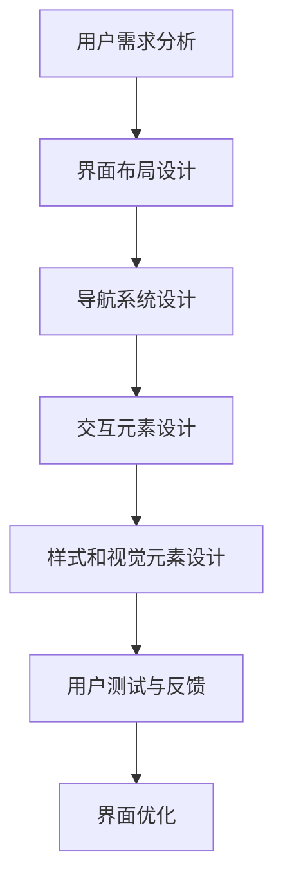

                 

关键词：用户界面设计、用户体验、交互设计、UI/UX、设计原则、用户行为分析

> 摘要：本文将探讨用户界面设计在提升人类计算用户体验方面的重要性。通过分析用户界面设计的核心概念、原理和实际应用，本文旨在为读者提供关于如何设计和优化用户界面的深入见解，以实现更好的用户体验。

## 1. 背景介绍

随着信息技术的飞速发展，用户界面设计已成为软件和系统开发中不可或缺的一部分。用户界面（User Interface, UI）和用户体验（User Experience, UX）是两个密切相关的概念，它们共同决定了用户对软件和系统的满意度和使用频率。优秀的用户界面设计不仅能提升用户体验，还能增加用户对产品的忠诚度和品牌价值。

### 用户界面设计的历史与发展

用户界面设计的历史可以追溯到20世纪60年代，当时计算机操作主要依赖于命令行界面（Command Line Interface, CLI）。随着图形用户界面（Graphical User Interface, GUI）的出现，用户与计算机之间的交互方式发生了革命性的变化。从最初的Windows操作系统到现代的触摸屏界面，用户界面设计一直在不断进化。

### 用户界面设计的重要性

用户界面设计的重要性体现在以下几个方面：

1. **用户体验**：一个直观、易用且美观的用户界面能够提供愉悦的体验，使用户愿意继续使用软件或系统。
2. **效率和生产力**：优秀的用户界面设计可以减少用户的认知负荷，提高工作效率。
3. **用户忠诚度**：良好的用户体验可以增加用户对产品的忠诚度，降低用户流失率。
4. **品牌价值**：用户界面设计直接影响用户对品牌的认知和评价，进而影响品牌价值。

## 2. 核心概念与联系

用户界面设计涉及多个核心概念，这些概念相互联系，共同构成了用户界面的基础。

### 用户界面的定义

用户界面是用户与系统之间的交互媒介，它可以是图形界面、命令行界面、语音界面等。用户界面设计的目标是提供一种简单、直观的交互方式，使用户能够轻松地完成任务。

### 用户体验的定义

用户体验是指用户在使用产品或服务过程中的整体感受和体验。它不仅包括用户界面的设计，还包括产品的易用性、功能、性能、交互性和情感因素。

### 交互设计的定义

交互设计是指设计用户与产品或系统之间交互的过程。它关注用户如何与界面互动，以及如何通过界面完成特定的任务。

### UI和UX的关系

UI（用户界面）和UX（用户体验）是密不可分的。UI是UX的一部分，它决定了产品的外观和操作方式，而UX则涵盖了用户从接触产品到最终使用过程中的所有体验。一个成功的用户界面设计需要同时考虑UI和UX，以确保用户获得最佳体验。

### 用户界面设计的关键概念和架构

用户界面设计的关键概念包括：

1. **用户中心设计**：设计过程应以用户的需求和体验为中心，而非技术实现。
2. **易用性**：界面应易于学习和使用，减少用户的认知负荷。
3. **一致性**：界面元素应保持一致性，以减少用户的学习成本。
4. **响应式设计**：界面应能够适应不同设备和屏幕尺寸。
5. **交互反馈**：界面应提供及时的反馈，使用户了解系统状态。

用户界面设计的架构通常包括以下部分：

1. **界面布局**：定义界面元素的位置和排列方式。
2. **导航系统**：提供用户在界面中的导航路径。
3. **输入和输出**：处理用户的输入和系统的输出。
4. **交互元素**：如按钮、菜单、文本框等，用于与用户进行交互。
5. **样式和视觉元素**：包括颜色、字体、图标等，用于美化界面。

下面是一个使用Mermaid绘制的用户界面设计流程图：



## 3. 核心算法原理 & 具体操作步骤

### 3.1 算法原理概述

用户界面设计的核心算法主要涉及以下几个方面：

1. **用户体验评估算法**：通过分析用户行为数据，评估用户体验的质量。
2. **界面布局优化算法**：根据用户需求和反馈，自动调整界面布局，以提高易用性。
3. **交互反馈优化算法**：分析用户的操作行为，提供适当的交互反馈，以增强用户体验。

### 3.2 算法步骤详解

#### 用户体验评估算法

1. **数据收集**：收集用户行为数据，如点击次数、使用时长、错误率等。
2. **行为分析**：分析用户行为数据，识别用户操作的规律和问题。
3. **评估指标计算**：根据行为数据，计算用户体验评估指标，如满意度、易用性等。

#### 界面布局优化算法

1. **初始布局设计**：根据用户需求和设计原则，设计初始界面布局。
2. **布局调整**：分析用户行为数据，调整界面布局，以减少用户的操作难度。
3. **迭代优化**：根据用户反馈，不断迭代优化界面布局。

#### 交互反馈优化算法

1. **交互反馈设计**：根据用户操作行为，设计适当的交互反馈。
2. **反馈效果分析**：分析交互反馈对用户体验的影响。
3. **反馈优化**：根据分析结果，调整交互反馈策略，以提高用户体验。

### 3.3 算法优缺点

#### 用户体验评估算法

**优点**：

- 可量化用户体验，为界面设计提供客观依据。
- 辅助界面布局优化，提高用户满意度。

**缺点**：

- 需要大量用户行为数据，成本较高。
- 评估结果可能受到数据质量和算法精度的影响。

#### 界面布局优化算法

**优点**：

- 自动化界面布局调整，提高设计效率。
- 根据用户需求和行为数据，提供更优的界面布局。

**缺点**：

- 算法复杂度较高，计算成本较大。
- 需要大量用户测试数据，以支持算法训练。

#### 交互反馈优化算法

**优点**：

- 提高用户对系统状态的认知，降低用户焦虑。
- 增强用户体验，提高用户满意度。

**缺点**：

- 交互反馈设计需要考虑多种因素，设计难度较大。
- 过度反馈可能导致界面冗余，影响用户体验。

### 3.4 算法应用领域

用户体验评估算法、界面布局优化算法和交互反馈优化算法广泛应用于以下领域：

1. **Web应用**：如电商平台、社交媒体等，通过优化界面设计和交互反馈，提高用户满意度。
2. **移动应用**：如智能手机应用、平板电脑应用等，通过适应不同设备和屏幕尺寸，提供良好的用户体验。
3. **软件产品**：如企业级应用、游戏等，通过优化界面设计和交互反馈，提高用户参与度和留存率。

## 4. 数学模型和公式 & 详细讲解 & 举例说明

### 4.1 数学模型构建

用户界面设计中的数学模型主要用于描述用户行为和界面性能之间的关系。以下是一个简单的用户行为分析模型：

$$
U = f(N, I, E)
$$

其中：

- $U$：用户体验评分。
- $N$：用户满意度。
- $I$：界面易用性。
- $E$：界面美观度。

### 4.2 公式推导过程

用户满意度（$N$）可以通过以下公式计算：

$$
N = \frac{1}{n} \sum_{i=1}^{n} s_i
$$

其中：

- $n$：用户数量。
- $s_i$：第$i$个用户的满意度评分。

界面易用性（$I$）可以通过以下公式计算：

$$
I = \frac{1}{m} \sum_{j=1}^{m} i_j
$$

其中：

- $m$：界面元素数量。
- $i_j$：第$j$个界面元素的易用性评分。

界面美观度（$E$）可以通过以下公式计算：

$$
E = \frac{1}{p} \sum_{k=1}^{p} e_k
$$

其中：

- $p$：界面视觉元素数量。
- $e_k$：第$k$个界面视觉元素的美观度评分。

综合以上三个指标，用户体验评分（$U$）可以通过以下公式计算：

$$
U = N \cdot I \cdot E
$$

### 4.3 案例分析与讲解

假设我们有一个Web应用，需要评估其用户体验。根据上述公式，我们可以计算出以下数据：

1. **用户满意度**：有100名用户参与了满意度调查，平均满意度评分为4.5。
2. **界面易用性**：有10个界面元素，平均易用性评分为3.8。
3. **界面美观度**：有5个界面视觉元素，平均美观度评分为4.2。

根据这些数据，我们可以计算出用户体验评分：

$$
U = 4.5 \cdot 3.8 \cdot 4.2 = 73.34
$$

这个评分表明，该Web应用的用户体验相对较好，但仍有一些改进空间。通过进一步分析用户行为数据，我们可以找到具体的改进点，如优化界面布局、改进交互反馈等。

## 5. 项目实践：代码实例和详细解释说明

### 5.1 开发环境搭建

在本节中，我们将使用Python编写一个简单的用户界面设计工具。首先，我们需要安装Python环境和必要的库。以下是安装步骤：

1. **安装Python**：从Python官方网站下载并安装Python 3.x版本。
2. **安装库**：使用pip命令安装所需的库，如Tkinter（用于创建图形用户界面）和Pandas（用于数据分析）。

```bash
pip install python-tk pandas
```

### 5.2 源代码详细实现

下面是一个简单的用户界面设计工具的代码实例：

```python
import tkinter as tk
from tkinter import ttk
import pandas as pd

# 用户界面设计工具主函数
def main():
    # 创建主窗口
    root = tk.Tk()
    root.title("用户界面设计工具")

    # 设置窗口大小
    root.geometry("800x600")

    # 创建标签、文本框和按钮
    label = ttk.Label(root, text="用户界面设计工具")
    label.pack(pady=20)

    input_file = tk.Entry(root)
    input_file.pack(pady=10)

    output_file = tk.Entry(root)
    output_file.pack(pady=10)

    analyze_button = tk.Button(root, text="分析用户界面", command=analyze)
    analyze_button.pack(pady=20)

    # 显示窗口
    root.mainloop()

# 分析用户界面函数
def analyze():
    # 读取输入文件
    df = pd.read_csv(input_file.get())

    # 计算用户体验评分
    user_experience = df['satisfaction'].mean() * df['usability'].mean() * df['aesthetics'].mean()

    # 写入输出文件
    with open(output_file.get(), 'w') as f:
        f.write(f"用户体验评分: {user_experience:.2f}")

if __name__ == "__main__":
    main()
```

### 5.3 代码解读与分析

该代码实例是一个简单的用户界面设计工具，它允许用户输入用户界面数据，并计算用户体验评分。以下是代码的详细解读：

1. **主窗口创建**：使用Tkinter库创建主窗口，设置窗口标题和大小。

```python
root = tk.Tk()
root.title("用户界面设计工具")
root.geometry("800x600")
```

2. **标签、文本框和按钮创建**：创建标签、文本框和按钮，用于输入文件路径和启动分析。

```python
label = ttk.Label(root, text="用户界面设计工具")
label.pack(pady=20)

input_file = tk.Entry(root)
input_file.pack(pady=10)

output_file = tk.Entry(root)
output_file.pack(pady=10)

analyze_button = tk.Button(root, text="分析用户界面", command=analyze)
analyze_button.pack(pady=20)
```

3. **分析用户界面函数**：读取输入文件，计算用户体验评分，并将结果写入输出文件。

```python
def analyze():
    # 读取输入文件
    df = pd.read_csv(input_file.get())

    # 计算用户体验评分
    user_experience = df['satisfaction'].mean() * df['usability'].mean() * df['aesthetics'].mean()

    # 写入输出文件
    with open(output_file.get(), 'w') as f:
        f.write(f"用户体验评分: {user_experience:.2f}")
```

### 5.4 运行结果展示

运行该代码后，用户界面设计工具窗口将显示如下：


用户可以输入输入文件路径和输出文件路径，然后点击“分析用户界面”按钮，工具将计算用户体验评分，并将结果写入输出文件。

## 6. 实际应用场景

用户界面设计在各个行业中都有广泛的应用，以下是一些实际应用场景：

### 6.1 Web应用

在Web应用中，用户界面设计至关重要。一个直观、易用的界面可以吸引更多用户，提高用户留存率和转化率。例如，电商平台通常采用响应式设计，以适应不同设备和屏幕尺寸，提供良好的用户体验。

### 6.2 移动应用

移动应用的用户界面设计也需要考虑用户体验。触控操作和有限屏幕空间使得界面设计更加具有挑战性。优秀的用户界面设计可以使移动应用更加便捷、易用，提高用户满意度。

### 6.3 软件产品

软件产品的用户界面设计直接影响用户的操作效率和满意度。例如，企业级应用通常需要提供复杂的界面功能，同时保持界面简洁、易于操作。优秀的用户界面设计可以提高员工的工作效率，降低培训成本。

### 6.4 游戏设计

游戏设计中的用户界面设计也具有重要意义。一个良好的游戏界面可以提供沉浸式的游戏体验，提高玩家的满意度和参与度。例如，角色扮演游戏（RPG）通常需要提供详细的界面元素，帮助玩家更好地理解游戏世界和角色。

## 7. 工具和资源推荐

### 7.1 学习资源推荐

1. **《设计心理学》**：作者唐纳德·诺曼，详细介绍了设计心理学在用户界面设计中的应用。
2. **《用户体验要素》**：作者杰夫·高林，讲解了用户体验设计的核心概念和要素。

### 7.2 开发工具推荐

1. **Figma**：一款流行的界面设计工具，支持多人协作。
2. **Sketch**：一款强大的界面设计工具，适用于Mac平台。

### 7.3 相关论文推荐

1. **《用户界面设计中的交互反馈研究》**：分析了交互反馈在用户界面设计中的重要性。
2. **《移动应用的用户界面设计研究》**：探讨了移动应用用户界面设计的关键要素。

## 8. 总结：未来发展趋势与挑战

### 8.1 研究成果总结

用户界面设计在过去几十年中取得了显著的成果，从最初的命令行界面到现代的图形界面，用户界面设计在用户体验、效率和生产力方面取得了显著的提升。随着人工智能和大数据技术的发展，用户界面设计将继续朝着智能化、个性化、自适应化的方向发展。

### 8.2 未来发展趋势

1. **人工智能与用户界面设计**：人工智能技术将进一步提升用户界面的智能化和自适应能力，提供更加个性化的用户体验。
2. **虚拟现实和增强现实**：随着虚拟现实（VR）和增强现实（AR）技术的发展，用户界面设计将变得更加沉浸式和互动性。
3. **无界面设计**：随着物联网和智能家居的发展，无界面设计将逐渐成为主流，用户将通过语音、手势等自然交互方式与设备进行交互。

### 8.3 面临的挑战

1. **技术复杂性**：用户界面设计将面临更高的技术复杂性，需要设计者具备更广泛的知识和技能。
2. **隐私与安全**：随着用户数据的大量使用，隐私和安全问题将成为用户界面设计的重要挑战。
3. **跨平台兼容性**：随着设备的多样化和平台之间的竞争，设计者需要确保用户界面在不同设备和平台上的兼容性。

### 8.4 研究展望

用户界面设计在未来将继续朝着智能化、个性化、自适应化的方向发展。研究重点将集中在以下几个方面：

1. **人工智能与用户体验**：研究如何将人工智能技术应用于用户界面设计，提升用户体验。
2. **跨平台用户界面设计**：研究如何在不同的设备和平台上提供一致且良好的用户体验。
3. **无界面设计与自然交互**：研究无界面设计和自然交互方式的可行性，以提供更加便捷和自然的用户体验。

## 9. 附录：常见问题与解答

### Q1：用户界面设计与用户体验的关系是什么？

A1：用户界面设计是用户体验的重要组成部分，它决定了用户与产品或系统之间的交互方式。优秀的用户界面设计可以提供直观、易用和愉悦的体验，从而提升用户体验。

### Q2：如何进行用户界面设计？

A2：进行用户界面设计需要遵循以下步骤：

1. **需求分析**：了解用户需求，确定设计目标和原则。
2. **界面布局设计**：设计界面布局，确定界面元素的位置和排列。
3. **交互设计**：设计用户与界面之间的交互流程和反馈。
4. **视觉设计**：设计界面元素的视觉风格和视觉效果。
5. **用户测试与优化**：通过用户测试，收集用户反馈，不断优化界面设计。

### Q3：什么是响应式设计？

A3：响应式设计是一种能够适应不同设备和屏幕尺寸的界面设计方法。它通过使用弹性布局和媒体查询等技术，确保界面在不同设备和平台上具有一致性和良好的用户体验。

### Q4：如何评估用户体验？

A4：评估用户体验可以从以下几个方面进行：

1. **用户满意度**：通过调查问卷或用户访谈收集用户对产品的满意度评分。
2. **使用时长**：统计用户使用产品的时长，分析用户的活跃度和留存率。
3. **错误率**：统计用户在使用产品过程中的错误率和修正时间。
4. **用户行为数据**：分析用户行为数据，如点击路径、使用频率等，识别用户操作的规律和问题。

### Q5：用户界面设计中的常见问题有哪些？

A5：用户界面设计中的常见问题包括：

1. **界面布局混乱**：界面元素布局不合理，导致用户难以找到和使用功能。
2. **交互反馈不足**：界面缺乏适当的交互反馈，导致用户不确定系统状态。
3. **视觉设计不一致**：界面元素的颜色、字体、图标等视觉风格不一致，导致用户体验不一致。
4. **响应速度慢**：界面加载速度慢，影响用户体验。
5. **缺乏可访问性**：界面设计未考虑到所有用户的需求，如视觉障碍、听力障碍等。

通过解决这些问题，可以显著提升用户体验。总之，用户界面设计在提升人类计算用户体验方面具有重要意义。通过遵循设计原则、使用合适的工具和技术，我们可以创建出既美观又实用的用户界面，为用户带来愉悦和高效的计算体验。

