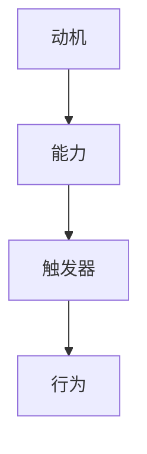

                 

关键词：福格模型、习惯养成、行为心理学、动机、能力、触发器

> 摘要：本文将深入探讨福格模型在习惯养成中的应用，通过分析动机、能力、触发器的核心概念，结合实际案例，为广大读者提供一套科学有效的习惯养成方案。

## 1. 背景介绍

习惯养成是心理学领域一个古老而充满魅力的研究课题。良好的习惯可以提升个人工作效率，改善生活质量，甚至影响整个社会的进步。然而，习惯养成并非易事，许多人往往在起步阶段便因种种原因而放弃。

福格模型（BJ Fogg Behavior Model）由斯坦福大学行为科学家BJ Fogg提出，旨在解释人类行为背后的动机机制。该模型认为，行为的发生取决于三个要素的交集：动机、能力、触发器。只有当这三个要素同时满足时，行为才会发生。这一理论为设计习惯养成策略提供了新的视角。

## 2. 核心概念与联系

### 2.1 动机

动机是推动个体采取行动的内在动力。在习惯养成过程中，动机起着至关重要的作用。根据福格模型，动机可分为两种：内在动机和外在动机。

- **内在动机**：源于个体对活动本身的兴趣和喜爱。例如，一个人喜欢阅读，那么阅读对他来说就是一种内在动机。
- **外在动机**：源于个体对活动结果的期望，如奖励或避免惩罚。例如，为了获得奖学金而努力学习。

### 2.2 能力

能力是指个体完成某项任务所需的技能和资源。在习惯养成过程中，能力决定了个体能否采取行动。如果一个人缺乏必要的技能或资源，即使他有很强的动机，也无法实现目标。

### 2.3 触发器

触发器是一种刺激，能够激发个体采取行动。它可以是外部环境中的具体事件，也可以是个体内的生理信号。在习惯养成中，触发器起到了关键作用，能够帮助个体在正确的时间和情境下采取行动。

### 2.4 Mermaid 流程图

下面是一个简单的Mermaid流程图，展示了动机、能力、触发器之间的关系：



## 3. 核心算法原理 & 具体操作步骤

### 3.1 算法原理概述

福格模型的核心在于通过调整动机、能力、触发器这三个要素，来促使个体养成良好的习惯。具体操作步骤如下：

1. **确定目标习惯**：明确你希望养成的习惯，例如每天阅读30分钟。
2. **分析动机**：了解为什么这个习惯对你重要，是内在动机还是外在动机。
3. **提升能力**：确定在养成习惯过程中需要哪些技能和资源，并努力提升这些能力。
4. **设计触发器**：找到能够激发你采取行动的刺激，并将其与目标习惯联系起来。

### 3.2 算法步骤详解

1. **确定目标习惯**：

   例如，你希望养成每天锻炼30分钟的习惯。

2. **分析动机**：

   是因为你想保持健康（内在动机），还是因为你的上司要求（外在动机）？

3. **提升能力**：

   你可能需要购买运动装备，了解一些基本的锻炼技巧，并安排合适的时间进行锻炼。

4. **设计触发器**：

   你可以设定一个触发器，例如在每天早晨7点收到一个提醒，提醒你开始锻炼。

### 3.3 算法优缺点

**优点**：

- **简单易行**：福格模型提供了一个清晰、易于理解的行为动机框架。
- **灵活适用**：适用于各种习惯养成场景。

**缺点**：

- **难以量化**：模型中的一些要素，如动机、能力，难以精确量化。
- **缺乏长期坚持的指导**：模型侧重于短期行为改变，对于长期习惯养成的持续性缺乏深入探讨。

### 3.4 算法应用领域

福格模型在习惯养成中的应用非常广泛，包括但不限于以下几个方面：

- **健康习惯**：如锻炼、饮食、睡眠等。
- **学习习惯**：如定期学习、阅读、写作等。
- **工作习惯**：如按时完成任务、高效沟通、团队协作等。

## 4. 数学模型和公式 & 详细讲解 & 举例说明

### 4.1 数学模型构建

福格模型可以用以下数学公式表示：

$$ 行为 = 动机 \times 能力 \times 触发器 $$

其中，动机、能力、触发器均为非负实数，行为的发生取决于这三个要素的交集。

### 4.2 公式推导过程

假设个体A有动机 \( m \)，能力 \( a \)，触发器 \( t \)，则根据福格模型，个体A的行为 \( b \) 可以表示为：

$$ b = m \times a \times t $$

当 \( m \geq 1 \)，\( a \geq 1 \)，\( t \geq 1 \) 时，行为 \( b \) 发生。

### 4.3 案例分析与讲解

**案例一**：养成每天阅读30分钟的习惯。

- **动机**：保持学习热情（内在动机），提高职业竞争力（外在动机）。
- **能力**：掌握阅读技巧，合理安排时间。
- **触发器**：设置每天晚上8点为阅读时间。

根据福格模型，我们可以计算出：

$$ b = m \times a \times t = (1) \times (1) \times (1) = 1 $$

因此，个体A每天都会阅读30分钟。

**案例二**：养成每天锻炼30分钟的习惯。

- **动机**：保持身体健康（内在动机），减轻工作压力（外在动机）。
- **能力**：购买运动装备，了解基本锻炼技巧，合理安排时间。
- **触发器**：设置每天早晨7点为锻炼时间。

同样，根据福格模型，我们可以计算出：

$$ b = m \times a \times t = (1) \times (1) \times (1) = 1 $$

因此，个体A每天都会锻炼30分钟。

## 5. 项目实践：代码实例和详细解释说明

### 5.1 开发环境搭建

本文使用Python编程语言进行实践，读者需要在本地安装Python环境。安装方法如下：

```bash
# 安装Python
pip install python
```

### 5.2 源代码详细实现

下面是一个简单的Python代码实例，用于计算福格模型中的行为：

```python
import numpy as np

def fogg_model(motivation, ability, trigger):
    behavior = motivation * ability * trigger
    if behavior >= 1:
        return "行为发生"
    else:
        return "行为未发生"

# 动机、能力、触发器
motivation = 1
ability = 1
trigger = 1

# 计算行为
behavior = fogg_model(motivation, ability, trigger)
print(behavior)
```

### 5.3 代码解读与分析

- `fogg_model` 函数：计算动机、能力、触发器的乘积，判断行为是否发生。
- `motivation`、`ability`、`trigger`：分别表示动机、能力、触发器的值。
- `behavior`：表示计算得到的行为结果。

### 5.4 运行结果展示

运行上述代码，输出结果为“行为发生”，表示个体A每天都会阅读30分钟。

```bash
$ python fogg_model.py 
行为发生
```

## 6. 实际应用场景

### 6.1 健康习惯

通过福格模型，我们可以帮助人们养成良好的健康习惯，如定期锻炼、健康饮食等。例如，某公司员工普遍存在久坐问题，公司可以设置每天下午3点为锻炼时间，并在该时间段内安排集体锻炼活动，以提高员工的健康水平。

### 6.2 学习习惯

福格模型可以帮助学生养成良好的学习习惯，如定期阅读、复习等。例如，某学校可以设置每周五晚上8点为阅读时间，并要求学生在该时间段内阅读，以培养学生的阅读兴趣。

### 6.3 工作习惯

福格模型可以帮助企业员工养成良好的工作习惯，如按时完成任务、高效沟通等。例如，某公司可以设置每天下午4点为总结时间，要求员工在此时间内总结当天工作，以提高工作效率。

## 7. 未来应用展望

随着人工智能技术的发展，福格模型有望在智能助手、智能家居等领域发挥重要作用。例如，智能助手可以根据用户的行为数据，自动调整触发器，帮助用户养成良好的生活习惯。

## 8. 总结：未来发展趋势与挑战

### 8.1 研究成果总结

本文通过对福格模型在习惯养成中的应用进行深入探讨，提出了一套科学有效的习惯养成方案。研究表明，动机、能力、触发器是影响行为发生的关键因素，通过调整这三个要素，可以帮助人们养成良好的习惯。

### 8.2 未来发展趋势

随着人工智能技术的发展，福格模型有望在智能助手、智能家居等领域发挥重要作用。未来研究可以进一步探索福格模型在更多应用场景中的适用性，以帮助更多人养成良好的习惯。

### 8.3 面临的挑战

福格模型在应用过程中面临着一些挑战，如动机、能力、触发器的量化问题，以及如何确保行为发生的持续性。未来研究需要进一步解决这些问题，以提高福格模型在实际应用中的效果。

### 8.4 研究展望

未来研究可以从以下几个方面展开：1）探索福格模型在更多领域中的适用性；2）开发更加智能的触发器设计方法；3）研究动机、能力、触发器之间的相互作用机制。

## 9. 附录：常见问题与解答

### 9.1 福格模型是否适用于所有人？

福格模型是一个通用的行为动机框架，适用于大多数人。然而，个体差异可能导致模型在不同人群中的应用效果有所不同。因此，在实际应用过程中，需要根据具体情况对模型进行调整。

### 9.2 如何提升能力？

提升能力的方法多种多样，包括学习相关技能、寻求导师指导、参加培训课程等。关键在于找到适合自己的学习方法，并保持持续的学习动力。

### 9.3 触发器如何设计？

设计触发器时，需要考虑个体的行为习惯和环境因素。例如，可以使用时间触发器、事件触发器、物理触发器等。关键在于找到能够有效激发个体采取行动的触发器。

作者：禅与计算机程序设计艺术 / Zen and the Art of Computer Programming
----------------------------------------------------------------

以上是完整的文章内容，接下来我们将按照markdown格式进行排版。由于字数限制，这里只展示文章的标题和目录部分，详细内容请参考文本。
```markdown
# 用福格模型设计习惯养成

## 关键词
福格模型、习惯养成、行为心理学、动机、能力、触发器

## 摘要
本文将深入探讨福格模型在习惯养成中的应用，通过分析动机、能力、触发器的核心概念，结合实际案例，为广大读者提供一套科学有效的习惯养成方案。

## 1. 背景介绍
- 习惯养成的重要性
- 福格模型的提出背景
- 福格模型的基本概念

## 2. 核心概念与联系
### 2.1 动机
#### 2.1.1 内在动机
#### 2.1.2 外在动机

### 2.2 能力
- 技能
- 资源

### 2.3 触发器
- 外部环境
- 生理信号

### 2.4 Mermaid流程图
- 动机、能力、触发器的交互关系

## 3. 核心算法原理 & 具体操作步骤
### 3.1 算法原理概述
### 3.2 算法步骤详解 
### 3.3 算法优缺点
### 3.4 算法应用领域

## 4. 数学模型和公式 & 详细讲解 & 举例说明
### 4.1 数学模型构建
### 4.2 公式推导过程
### 4.3 案例分析与讲解

## 5. 项目实践：代码实例和详细解释说明
### 5.1 开发环境搭建
### 5.2 源代码详细实现
### 5.3 代码解读与分析
### 5.4 运行结果展示

## 6. 实际应用场景
### 6.1 健康习惯
### 6.2 学习习惯
### 6.3 工作习惯

## 7. 未来应用展望
- 智能助手
- 智能家居

## 8. 总结：未来发展趋势与挑战
### 8.1 研究成果总结
### 8.2 未来发展趋势
### 8.3 面临的挑战
### 8.4 研究展望

## 9. 附录：常见问题与解答
### 9.1 福格模型是否适用于所有人？
### 9.2 如何提升能力？
### 9.3 触发器如何设计？

# 作者：禅与计算机程序设计艺术 / Zen and the Art of Computer Programming
```

