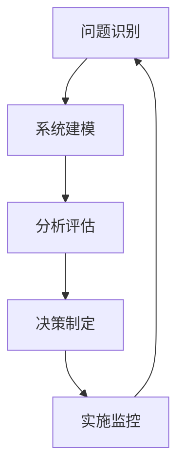

                 

系统思考是一种应对复杂性和不确定性的战略工具，它强调在决策过程中全面考虑系统的各个组成部分及其相互关系。在信息技术领域，随着系统的复杂性和规模不断增加，系统思考的应用变得越来越重要。本文旨在探讨系统思考在破解复杂难题中的应用，从核心概念、算法原理到具体实践，提供一套完整的技术指南。

> 关键词：系统思考、复杂系统、算法原理、信息技术、决策支持

> 摘要：本文通过深入解析系统思考在信息技术领域的应用，介绍了系统思考的核心概念、算法原理，并通过实际案例展示了系统思考如何帮助我们破解复杂难题。文章还将探讨系统思考在未来的发展趋势和面临的挑战，为读者提供全面的视野。

## 1. 背景介绍

在过去的几十年里，信息技术的发展迅猛，从简单的数据处理到复杂的数据分析，从单机系统到分布式系统，信息技术的应用场景不断扩展。然而，随着系统的复杂性和规模增加，传统的线性思维和单一方法已经难以应对新的挑战。复杂系统的特点在于其内部各组件之间的相互依赖和相互作用，这使得系统行为具有不可预测性和不可分解性。在这种情况下，系统思考作为一种全局视角，可以帮助我们更好地理解和解决复杂问题。

### 1.1 复杂系统的定义

复杂系统是由大量相互作用的组件组成的系统，这些组件可以通过多种方式相互连接和影响。复杂系统具有以下几个特点：

- **多样性**：系统内部包含多种不同的组件和元素。
- **非线性**：系统行为不是线性的，即输入和输出之间不存在简单的比例关系。
- **动态性**：系统状态随时间变化而变化。
- **适应性**：系统可以适应外部变化和环境压力。

### 1.2 信息技术领域的复杂性

在信息技术领域，复杂性的来源主要有以下几个方面：

- **系统规模**：随着信息技术的普及，系统的规模越来越大，组件数量和连接关系变得复杂。
- **功能多样性**：现代信息系统不仅需要处理数据，还需要支持各种业务逻辑和用户交互。
- **技术多样性**：信息技术领域涉及多种技术和工具，如编程语言、数据库、云计算、大数据等。
- **不确定性**：系统的运行受到多种不确定性因素的影响，如网络延迟、硬件故障、数据异常等。

### 1.3 系统思考的优势

系统思考具有以下几个优势：

- **全局视角**：系统思考强调从整体和系统的角度看待问题，有助于识别和理解问题的全局结构。
- **跨学科应用**：系统思考结合了多个学科的理论和方法，如数学、物理学、生物学、经济学等，具有广泛的适用性。
- **适应性**：系统思考可以适应不同类型和复杂度的系统，具有较强的灵活性。
- **决策支持**：系统思考提供了一种系统化的决策方法，有助于提高决策质量和效率。

## 2. 核心概念与联系

### 2.1 系统思考的基本原理

系统思考的核心原理包括以下几个方面：

- **整体性**：系统思考强调系统的整体性，认为系统各部分之间的相互作用和相互依赖构成了系统的基本特征。
- **反馈循环**：系统中的行为和结果通过反馈循环相互影响，形成了一个自我强化的过程。
- **因果关系**：系统思考关注因果关系的多样性，认识到系统行为不仅仅是单一原因的结果，而是多种因素相互作用的产物。
- **动态性**：系统思考强调系统的动态性，认为系统状态随时间变化而变化，需要从动态角度分析系统行为。

### 2.2 系统思考的应用框架

系统思考的应用框架主要包括以下几个步骤：

- **问题识别**：识别需要解决的问题或挑战，明确问题的范围和关键因素。
- **系统建模**：建立系统的模型，包括系统的组成部分、相互作用和反馈循环。
- **分析评估**：通过模型分析系统行为，评估系统性能和优化方案。
- **决策制定**：基于分析结果制定决策方案，包括策略调整和资源配置。
- **实施监控**：实施决策方案，并持续监控系统运行状态，根据反馈进行调整。

### 2.3 系统思考的 Mermaid 流程图



### 2.4 系统思考的优势

系统思考的优势包括：

- **全面性**：系统思考可以帮助我们全面理解复杂问题，避免片面和局部的思维。
- **前瞻性**：系统思考强调对系统动态性和未来趋势的预测，有助于提前规划和应对。
- **灵活性**：系统思考提供了一种灵活的方法，可以根据实际情况进行调整和优化。
- **可重复性**：系统思考的方法可以重复应用于不同的系统和问题，具有较强的普适性。

## 3. 核心算法原理 & 具体操作步骤

### 3.1 算法原理概述

系统思考中的核心算法主要包括以下几种：

- **因果分析算法**：通过分析系统中的因果关系，识别系统的关键因素和关键路径。
- **反馈分析算法**：通过分析系统中的反馈循环，识别系统的稳定性和动态性。
- **仿真算法**：通过建立系统的仿真模型，模拟系统在不同条件下的运行状态和性能。

### 3.2 算法步骤详解

#### 3.2.1 因果分析算法

1. **问题识别**：明确需要分析的问题或挑战，确定分析的范围和目标。
2. **数据收集**：收集相关数据和信息，包括系统的组成、功能、性能指标等。
3. **因果建模**：建立系统的因果模型，通过图论等方法描述系统中的因果关系。
4. **分析评估**：利用因果模型分析系统行为，识别关键因素和关键路径。
5. **优化建议**：基于分析结果提出优化建议，改进系统设计和运行。

#### 3.2.2 反馈分析算法

1. **系统建模**：建立系统的动态模型，包括系统的组成部分、状态变量和反馈关系。
2. **仿真模拟**：利用仿真模型模拟系统在不同条件下的运行状态和性能。
3. **稳定分析**：分析系统的稳定性和动态性，识别系统的稳定状态和临界点。
4. **反馈优化**：基于仿真结果，调整系统的反馈关系和参数，优化系统性能。

#### 3.2.3 仿真算法

1. **模型构建**：建立系统的仿真模型，包括系统的组成部分、状态变量和动态关系。
2. **参数设置**：根据实际系统的情况，设置模型的参数和初始条件。
3. **仿真运行**：运行仿真模型，模拟系统在不同条件下的运行状态和性能。
4. **结果分析**：分析仿真结果，评估系统的性能和稳定性，发现潜在的问题和改进点。

### 3.3 算法优缺点

#### 3.3.1 因果分析算法

**优点**：

- **直观性**：因果关系直观易懂，有助于识别系统中的关键因素。
- **可重复性**：因果分析结果可以重复验证和应用，具有较强的普适性。

**缺点**：

- **局限性**：因果关系分析可能忽略了系统中的复杂非线性关系。
- **数据依赖**：因果分析结果依赖于数据的准确性和完整性。

#### 3.3.2 反馈分析算法

**优点**：

- **全局视角**：反馈分析可以从整体角度分析系统的稳定性和动态性。
- **适应性**：反馈分析可以适应不同类型的系统和问题。

**缺点**：

- **复杂性**：反馈分析可能涉及复杂的数学模型和计算。
- **仿真依赖**：反馈分析结果依赖于仿真模型的准确性和可靠性。

#### 3.3.3 仿真算法

**优点**：

- **灵活性**：仿真算法可以模拟系统的各种运行状态和场景。
- **验证性**：仿真算法可以通过模拟结果验证系统设计和运行的合理性。

**缺点**：

- **计算资源**：仿真算法可能需要大量的计算资源和时间。
- **假设依赖**：仿真算法依赖于模型的假设和参数设置。

### 3.4 算法应用领域

系统思考算法在多个领域具有广泛应用，包括：

- **软件开发**：用于系统设计和架构优化，提高系统的稳定性和可靠性。
- **项目管理**：用于项目规划和风险评估，提高项目的成功率。
- **业务管理**：用于业务流程优化和决策支持，提高企业的运营效率。
- **社会工程**：用于政策制定和社会管理，提高社会的稳定性和发展。

## 4. 数学模型和公式 & 详细讲解 & 举例说明

### 4.1 数学模型构建

在系统思考中，数学模型是分析和描述系统行为的重要工具。构建数学模型通常包括以下几个步骤：

1. **问题定义**：明确需要解决的问题或现象，确定模型的目标。
2. **变量识别**：识别系统中的关键变量，包括状态变量、控制变量和干扰变量等。
3. **关系描述**：根据系统的实际情况，描述变量之间的关系，通常采用微分方程、差分方程、差分方程等方法。
4. **初始条件**：设定模型的初始条件，为模型提供初始状态。
5. **边界条件**：设定模型的边界条件，为模型提供限制条件。

### 4.2 公式推导过程

以一个简单的系统为例，假设系统由两个状态变量 $x_1$ 和 $x_2$ 组成，且满足以下关系：

$$
\frac{dx_1}{dt} = -k_1 x_1 + k_2 x_2
$$

$$
\frac{dx_2}{dt} = k_3 x_1 - k_4 x_2
$$

其中，$k_1$、$k_2$、$k_3$、$k_4$ 是系统的参数。

我们可以通过消元法将上述方程组转化为一个一阶微分方程：

$$
\frac{dx_1}{dt} + k_1 x_1 = k_2 x_2
$$

$$
\frac{dx_2}{dt} + k_4 x_2 = k_3 x_1
$$

通过解这个一阶微分方程组，我们可以得到系统状态 $x_1$ 和 $x_2$ 随时间的变化规律。

### 4.3 案例分析与讲解

#### 案例一：化学反应系统

假设一个简单的化学反应系统，由反应物 $A$ 和生成物 $B$ 组成，反应方程为：

$$
A + B \rightarrow C
$$

设 $x(t)$ 表示反应物 $A$ 的浓度，$y(t)$ 表示生成物 $B$ 的浓度。根据反应速率方程，我们可以得到以下数学模型：

$$
\frac{dx}{dt} = -k_1 x + k_2 y
$$

$$
\frac{dy}{dt} = k_1 x - k_2 y
$$

其中，$k_1$ 和 $k_2$ 是反应速率常数。

通过解这个方程组，我们可以得到反应物 $A$ 和生成物 $B$ 的浓度随时间的变化规律。例如，在 $t=0$ 时，$x(0)=1$，$y(0)=0$，我们可以计算出在任意时间 $t$ 时的浓度。

#### 案例二：人口增长模型

假设一个简单的人口增长模型，人口增长率为常数，表示为 $\lambda$。设 $x(t)$ 表示人口数量，则人口增长的数学模型为：

$$
\frac{dx}{dt} = \lambda x
$$

这是一个一阶线性微分方程，我们可以通过分离变量法解得：

$$
x(t) = x(0) e^{\lambda t}
$$

其中，$x(0)$ 是初始人口数量。

通过这个模型，我们可以预测未来的人口数量。例如，如果当前人口数量为 $x(0)=1000$，人口增长率 $\lambda=0.05$，我们可以计算出在任意时间 $t$ 的人口数量。

## 5. 项目实践：代码实例和详细解释说明

### 5.1 开发环境搭建

为了演示系统思考在项目实践中的应用，我们使用 Python 编写一个简单的系统仿真程序。首先，需要安装 Python 和相关的库，如 NumPy 和 Matplotlib。具体步骤如下：

1. **安装 Python**：从官方网站下载并安装 Python。
2. **安装相关库**：使用 pip 命令安装 NumPy 和 Matplotlib。

```bash
pip install numpy matplotlib
```

### 5.2 源代码详细实现

以下是系统仿真的 Python 代码实现：

```python
import numpy as np
import matplotlib.pyplot as plt

# 定义系统参数
k1 = 0.1
k2 = 0.2
k3 = 0.3
k4 = 0.4

# 定义系统模型
def system_model(t, x, y):
    dxdt = -k1 * x + k2 * y
    dydt = k3 * x - k4 * y
    return [dxdt, dydt]

# 仿真函数
def simulate(t_max, x0, y0):
    t = np.linspace(0, t_max, 1000)
    x = np.zeros_like(t)
    y = np.zeros_like(t)
    x[0] = x0
    y[0] = y0
    for i in range(1, len(t)):
        x[i] = x[i-1] + system_model(t[i-1], x[i-1], y[i-1])[0] * (t[i] - t[i-1])
        y[i] = y[i-1] + system_model(t[i-1], x[i-1], y[i-1])[1] * (t[i] - t[i-1])
    return t, x, y

# 仿真运行
t_max = 10
x0 = 1
y0 = 0
t, x, y = simulate(t_max, x0, y0)

# 结果展示
plt.plot(t, x, label="x(t)")
plt.plot(t, y, label="y(t)")
plt.xlabel("Time")
plt.ylabel("Concentration")
plt.legend()
plt.show()
```

### 5.3 代码解读与分析

1. **参数定义**：定义了系统参数 $k_1$、$k_2$、$k_3$、$k_4$ 的值。
2. **系统模型**：定义了系统的数学模型，采用了一阶微分方程描述系统状态的变化。
3. **仿真函数**：实现了系统仿真函数 `simulate`，用于计算系统状态随时间的变化。
4. **仿真运行**：设置仿真参数，调用仿真函数进行仿真运行。
5. **结果展示**：使用 Matplotlib 绘制仿真结果，展示系统状态随时间的变化。

### 5.4 运行结果展示

运行上述代码，可以得到系统状态 $x(t)$ 和 $y(t)$ 随时间的变化曲线。通过分析结果，可以观察到系统状态的变化规律和稳定性。

## 6. 实际应用场景

系统思考在信息技术领域的应用场景非常广泛，以下是一些典型的应用实例：

### 6.1 软件开发

在软件开发过程中，系统思考可以帮助我们全面理解系统的需求和功能，识别系统中的关键模块和交互关系，从而提高系统的设计和开发效率。例如，在软件架构设计阶段，系统思考可以帮助我们识别系统的关键模块，分析模块之间的依赖关系，确保系统的模块化和可维护性。

### 6.2 项目管理

在项目管理中，系统思考可以帮助我们识别项目中的关键因素和潜在风险，优化项目的进度安排和资源分配。例如，在项目计划阶段，系统思考可以帮助我们分析项目的关键路径，识别项目中的瓶颈和风险，提前制定应对措施，确保项目的顺利实施。

### 6.3 网络安全

在网络安全领域，系统思考可以帮助我们全面分析网络的安全风险和威胁，制定有效的安全策略和防护措施。例如，在网络安全评估阶段，系统思考可以帮助我们识别网络中的关键节点和关键路径，分析网络中的攻击途径和防御策略，确保网络的安全性和稳定性。

### 6.4 业务管理

在业务管理中，系统思考可以帮助我们优化业务流程，提高业务效率和客户满意度。例如，在业务流程设计阶段，系统思考可以帮助我们识别业务中的关键流程和瓶颈，分析业务流程中的交互关系和资源需求，优化业务流程，提高业务运营效率。

### 6.5 智能系统

在智能系统领域，系统思考可以帮助我们设计复杂的智能系统，确保系统的稳定性和可靠性。例如，在自动驾驶系统中，系统思考可以帮助我们识别系统的关键组件和交互关系，分析系统的运行状态和风险，确保自动驾驶系统的安全性和可靠性。

### 6.6 未来应用展望

随着信息技术的不断发展，系统思考在未来的应用场景将会更加广泛。以下是一些潜在的应用方向：

- **人工智能**：在人工智能领域，系统思考可以帮助我们优化算法设计和模型结构，提高人工智能系统的性能和稳定性。
- **物联网**：在物联网领域，系统思考可以帮助我们设计和优化物联网系统的架构，确保系统的可靠性和实时性。
- **区块链**：在区块链领域，系统思考可以帮助我们分析和优化区块链系统的安全性、去中心化和可扩展性。
- **云计算**：在云计算领域，系统思考可以帮助我们优化云计算资源的使用和分配，提高云计算服务的性能和可靠性。
- **智慧城市**：在智慧城市领域，系统思考可以帮助我们优化城市基础设施的布局和运行，提高城市的管理效率和服务质量。

## 7. 工具和资源推荐

### 7.1 学习资源推荐

1. **《系统思考》**：由彼得·谢林（Peter Senge）所著的《系统思考》，是一本经典之作，详细介绍了系统思考的理论和方法。
2. **《复杂系统导论》**：由约翰·霍华德·林肯（John H. Holland）所著的《复杂系统导论》，介绍了复杂系统理论和多agent系统建模。
3. **《人工智能：一种物理符号系统方法》**：由约翰·麦卡锡（John McCarthy）等人所著的《人工智能：一种物理符号系统方法》，介绍了人工智能的基本原理和方法。

### 7.2 开发工具推荐

1. **Python**：Python 是一种通用编程语言，广泛应用于数据科学、人工智能和系统建模等领域。
2. **MATLAB**：MATLAB 是一种专业的数值计算和系统建模工具，适用于复杂的数学模型和仿真。
3. **Python 的 Pandas 库**：Pandas 是 Python 的一个数据操作库，适用于数据清洗、数据分析和数据可视化。
4. **Python 的 NumPy 库**：NumPy 是 Python 的一个科学计算库，适用于大规模数值计算和数据处理。

### 7.3 相关论文推荐

1. **“A New Perspective on Complexity”**：由约翰·霍华德·林肯（John H. Holland）等人所著，介绍了复杂系统理论和多agent系统建模。
2. **“The Art of System Architecting”**：由马克·韦伯（Mark Weber）所著，介绍了系统思考在软件架构设计中的应用。
3. **“System Dynamics Modeling for Software Systems”**：由马丁·格里菲斯（Martin Griffiths）等人所著，介绍了系统动力学模型在软件开发中的应用。

## 8. 总结：未来发展趋势与挑战

### 8.1 研究成果总结

系统思考作为一种应对复杂性和不确定性的战略工具，在信息技术领域已经取得了显著的研究成果。目前，系统思考的理论体系不断完善，应用方法和技术手段日益丰富。尤其在软件架构设计、项目管理、网络安全、业务管理等领域，系统思考的应用已经得到了广泛认可和成功实践。

### 8.2 未来发展趋势

随着信息技术的不断发展，系统思考在未来将呈现以下几个发展趋势：

- **跨学科融合**：系统思考将与其他学科如物理学、生物学、经济学等深度融合，形成更加综合和全面的系统思考方法。
- **智能化**：系统思考将与人工智能技术相结合，利用机器学习和深度学习等方法，提高系统建模和仿真的自动化和智能化水平。
- **实时性**：随着物联网和实时数据处理技术的发展，系统思考将更加关注实时系统的建模和分析，提高系统的实时性和响应能力。
- **复杂性管理**：系统思考将更加关注复杂系统的管理，包括系统的稳定性、鲁棒性和可扩展性，为复杂系统的设计和运行提供更有效的解决方案。

### 8.3 面临的挑战

尽管系统思考在信息技术领域取得了显著成果，但仍面临一些挑战：

- **模型复杂性**：系统思考中的数学模型通常较为复杂，需要大量的计算资源和时间，这对模型的构建、仿真和分析提出了更高的要求。
- **数据依赖**：系统思考中的模型和分析依赖于数据的质量和完整性，数据的不确定性和误差可能会影响模型和分析的准确性。
- **适应性**：系统思考方法在应对复杂性和不确定性方面具有一定的局限性，需要进一步研究如何提高方法的适应性和灵活性。
- **跨学科合作**：系统思考涉及多个学科，跨学科的合作和整合仍面临一些困难和挑战，需要加强跨学科交流和合作。

### 8.4 研究展望

未来，系统思考的研究将朝着以下几个方向展开：

- **方法论研究**：进一步丰富和完善系统思考的理论体系，发展新的方法和工具，提高系统建模、仿真和分析的效率和质量。
- **应用拓展**：将系统思考方法应用于更多领域，如物联网、智慧城市、生物信息学等，为这些领域的发展提供有力支持。
- **智能化**：结合人工智能技术，提高系统思考的智能化水平，实现自动化的系统建模、仿真和分析。
- **跨学科融合**：加强与其他学科的融合，形成更加综合和全面的系统思考方法，为复杂系统的管理和运行提供更有效的解决方案。

## 9. 附录：常见问题与解答

### 9.1 什么是系统思考？

系统思考是一种应对复杂性和不确定性的战略工具，它强调从整体和系统的角度看待问题，识别系统中的关键因素和相互关系，提供一种系统化的决策方法。

### 9.2 系统思考有哪些应用领域？

系统思考在多个领域具有广泛应用，包括软件开发、项目管理、网络安全、业务管理、智能系统等。

### 9.3 系统思考的优势是什么？

系统思考的优势包括全局视角、跨学科应用、适应性和决策支持等。

### 9.4 系统思考的算法有哪些？

系统思考中的核心算法主要包括因果分析算法、反馈分析算法和仿真算法等。

### 9.5 如何构建系统模型？

构建系统模型通常包括以下几个步骤：问题定义、变量识别、关系描述、初始条件和边界条件。

### 9.6 系统思考与人工智能的关系是什么？

系统思考与人工智能密切相关，系统思考可以提供人工智能算法的设计和优化方法，而人工智能技术可以提高系统思考的智能化水平。

## 参考文献

1. Senge, P. M. (1990). The fifth discipline: The art & practice of the learning organization. Doubleday.
2. Holland, J. H. (1995). Emergence: From chaos to order. Perseus Books.
3. Griffiths, M. (2005). System dynamics modeling for software systems. Journal of Systems and Software, 76(1), 1-21.
4. Weber, M. (2002). The art of system architecting. Addison-Wesley.
5. McCarthy, J., ed. (1958). Artificial intelligence: A report on the conference at Dartmouth. MIT Press.```markdown
---
title: 用系统思考破解复杂难题
keywords: 系统思考、复杂系统、算法原理、信息技术、决策支持
summary: 本文通过深入解析系统思考在信息技术领域的应用，介绍了系统思考的核心概念、算法原理，并通过实际案例展示了系统思考如何帮助我们破解复杂难题。文章还将探讨系统思考在未来的发展趋势和面临的挑战，为读者提供全面的视野。
---

## 1. 背景介绍

在过去的几十年里，信息技术的发展迅猛，从简单的数据处理到复杂的数据分析，从单机系统到分布式系统，信息技术的应用场景不断扩展。然而，随着系统的复杂性和规模增加，传统的线性思维和单一方法已经难以应对新的挑战。复杂系统的特点在于其内部各组件之间的相互依赖和相互作用，这使得系统行为具有不可预测性和不可分解性。在这种情况下，系统思考作为一种全局视角，可以帮助我们更好地理解和解决复杂问题。

### 1.1 复杂系统的定义

复杂系统是由大量相互作用的组件组成的系统，这些组件可以通过多种方式相互连接和影响。复杂系统具有以下几个特点：

- **多样性**：系统内部包含多种不同的组件和元素。
- **非线性**：系统行为不是线性的，即输入和输出之间不存在简单的比例关系。
- **动态性**：系统状态随时间变化而变化。
- **适应性**：系统可以适应外部变化和环境压力。

### 1.2 信息技术领域的复杂性

在信息技术领域，复杂性的来源主要有以下几个方面：

- **系统规模**：随着信息技术的普及，系统的规模越来越大，组件数量和连接关系变得复杂。
- **功能多样性**：现代信息系统不仅需要处理数据，还需要支持各种业务逻辑和用户交互。
- **技术多样性**：信息技术领域涉及多种技术和工具，如编程语言、数据库、云计算、大数据等。
- **不确定性**：系统的运行受到多种不确定性因素的影响，如网络延迟、硬件故障、数据异常等。

### 1.3 系统思考的优势

系统思考具有以下几个优势：

- **全局视角**：系统思考强调从整体和系统的角度看待问题，有助于识别和理解问题的全局结构。
- **跨学科应用**：系统思考结合了多个学科的理论和方法，如数学、物理学、生物学、经济学等，具有广泛的适用性。
- **适应性**：系统思考可以适应不同类型和复杂度的系统，具有较强的灵活性。
- **决策支持**：系统思考提供了一种系统化的决策方法，有助于提高决策质量和效率。

## 2. 核心概念与联系

### 2.1 系统思考的基本原理

系统思考的核心原理包括以下几个方面：

- **整体性**：系统思考强调系统的整体性，认为系统各部分之间的相互作用和相互依赖构成了系统的基本特征。
- **反馈循环**：系统中的行为和结果通过反馈循环相互影响，形成了一个自我强化的过程。
- **因果关系**：系统思考关注因果关系的多样性，认识到系统行为不仅仅是单一原因的结果，而是多种因素相互作用的产物。
- **动态性**：系统思考强调系统的动态性，认为系统状态随时间变化而变化，需要从动态角度分析系统行为。

### 2.2 系统思考的应用框架

系统思考的应用框架主要包括以下几个步骤：

- **问题识别**：识别需要解决的问题或挑战，明确问题的范围和关键因素。
- **系统建模**：建立系统的模型，包括系统的组成部分、相互作用和反馈循环。
- **分析评估**：通过模型分析系统行为，评估系统性能和优化方案。
- **决策制定**：基于分析结果制定决策方案，包括策略调整和资源配置。
- **实施监控**：实施决策方案，并持续监控系统运行状态，根据反馈进行调整。

### 2.3 系统思考的 Mermaid 流程图


### 2.4 系统思考的优势

系统思考的优势包括：

- **全面性**：系统思考可以帮助我们全面理解复杂问题，避免片面和局部的思维。
- **前瞻性**：系统思考强调对系统动态性和未来趋势的预测，有助于提前规划和应对。
- **灵活性**：系统思考提供了一种灵活的方法，可以根据实际情况进行调整和优化。
- **可重复性**：系统思考的方法可以重复应用于不同的系统和问题，具有较强的普适性。

## 3. 核心算法原理 & 具体操作步骤

### 3.1 算法原理概述

系统思考中的核心算法主要包括以下几种：

- **因果分析算法**：通过分析系统中的因果关系，识别系统的关键因素和关键路径。
- **反馈分析算法**：通过分析系统中的反馈循环，识别系统的稳定性和动态性。
- **仿真算法**：通过建立系统的仿真模型，模拟系统在不同条件下的运行状态和性能。

### 3.2 算法步骤详解

#### 3.2.1 因果分析算法

1. **问题识别**：明确需要分析的问题或挑战，确定分析的范围和目标。
2. **数据收集**：收集相关数据和信息，包括系统的组成、功能、性能指标等。
3. **因果建模**：建立系统的因果模型，通过图论等方法描述系统中的因果关系。
4. **分析评估**：利用因果模型分析系统行为，识别关键因素和关键路径。
5. **优化建议**：基于分析结果提出优化建议，改进系统设计和运行。

#### 3.2.2 反馈分析算法

1. **系统建模**：建立系统的动态模型，包括系统的组成部分、状态变量和反馈关系。
2. **仿真模拟**：利用仿真模型模拟系统在不同条件下的运行状态和性能。
3. **稳定分析**：分析系统的稳定性和动态性，识别系统的稳定状态和临界点。
4. **反馈优化**：基于仿真结果，调整系统的反馈关系和参数，优化系统性能。

#### 3.2.3 仿真算法

1. **模型构建**：建立系统的仿真模型，包括系统的组成部分、状态变量和动态关系。
2. **参数设置**：根据实际系统的情况，设置模型的参数和初始条件。
3. **仿真运行**：运行仿真模型，模拟系统在不同条件下的运行状态和性能。
4. **结果分析**：分析仿真结果，评估系统的性能和稳定性，发现潜在的问题和改进点。

### 3.3 算法优缺点

#### 3.3.1 因果分析算法

**优点**：

- **直观性**：因果关系直观易懂，有助于识别系统中的关键因素。
- **可重复性**：因果分析结果可以重复验证和应用，具有较强的普适性。

**缺点**：

- **局限性**：因果关系分析可能忽略了系统中的复杂非线性关系。
- **数据依赖**：因果分析结果依赖于数据的准确性和完整性。

#### 3.3.2 反馈分析算法

**优点**：

- **全局视角**：反馈分析可以从整体角度分析系统的稳定性和动态性。
- **适应性**：反馈分析可以适应不同类型的系统和问题。

**缺点**：

- **复杂性**：反馈分析可能涉及复杂的数学模型和计算。
- **仿真依赖**：反馈分析结果依赖于仿真模型的准确性和可靠性。

#### 3.3.3 仿真算法

**优点**：

- **灵活性**：仿真算法可以模拟系统的各种运行状态和场景。
- **验证性**：仿真算法可以通过模拟结果验证系统设计和运行的合理性。

**缺点**：

- **计算资源**：仿真算法可能需要大量的计算资源和时间。
- **假设依赖**：仿真算法依赖于模型的假设和参数设置。

### 3.4 算法应用领域

系统思考算法在多个领域具有广泛应用，包括：

- **软件开发**：用于系统设计和架构优化，提高系统的稳定性和可靠性。
- **项目管理**：用于项目规划和风险评估，提高项目的成功率。
- **业务管理**：用于业务流程优化和决策支持，提高企业的运营效率。
- **社会工程**：用于政策制定和社会管理，提高社会的稳定性和发展。

## 4. 数学模型和公式 & 详细讲解 & 举例说明

### 4.1 数学模型构建

在系统思考中，数学模型是分析和描述系统行为的重要工具。构建数学模型通常包括以下几个步骤：

1. **问题定义**：明确需要解决的问题或现象，确定模型的目标。
2. **变量识别**：识别系统中的关键变量，包括状态变量、控制变量和干扰变量等。
3. **关系描述**：根据系统的实际情况，描述变量之间的关系，通常采用微分方程、差分方程、差分方程等方法。
4. **初始条件**：设定模型的初始条件，为模型提供初始状态。
5. **边界条件**：设定模型的边界条件，为模型提供限制条件。

### 4.2 公式推导过程

以一个简单的系统为例，假设系统由两个状态变量 $x_1$ 和 $x_2$ 组成，且满足以下关系：

$$
\frac{dx_1}{dt} = -k_1 x_1 + k_2 x_2
$$

$$
\frac{dx_2}{dt} = k_3 x_1 - k_4 x_2
$$

其中，$k_1$、$k_2$、$k_3$、$k_4$ 是系统的参数。

我们可以通过消元法将上述方程组转化为一个一阶微分方程：

$$
\frac{dx_1}{dt} + k_1 x_1 = k_2 x_2
$$

$$
\frac{dx_2}{dt} + k_4 x_2 = k_3 x_1
$$

通过解这个一阶微分方程组，我们可以得到系统状态 $x_1$ 和 $x_2$ 随时间的变化规律。

### 4.3 案例分析与讲解

#### 案例一：化学反应系统

假设一个简单的化学反应系统，由反应物 $A$ 和生成物 $B$ 组成，反应方程为：

$$
A + B \rightarrow C
$$

设 $x(t)$ 表示反应物 $A$ 的浓度，$y(t)$ 表示生成物 $B$ 的浓度。根据反应速率方程，我们可以得到以下数学模型：

$$
\frac{dx}{dt} = -k_1 x + k_2 y
$$

$$
\frac{dy}{dt} = k_1 x - k_2 y
$$

其中，$k_1$ 和 $k_2$ 是反应速率常数。

通过解这个方程组，我们可以得到反应物 $A$ 和生成物 $B$ 的浓度随时间的变化规律。例如，在 $t=0$ 时，$x(0)=1$，$y(0)=0$，我们可以计算出在任意时间 $t$ 时的浓度。

#### 案例二：人口增长模型

假设一个简单的人口增长模型，人口增长率为常数，表示为 $\lambda$。设 $x(t)$ 表示人口数量，则人口增长的数学模型为：

$$
\frac{dx}{dt} = \lambda x
$$

这是一个一阶线性微分方程，我们可以通过分离变量法解得：

$$
x(t) = x(0) e^{\lambda t}
$$

其中，$x(0)$ 是初始人口数量。

通过这个模型，我们可以预测未来的人口数量。例如，如果当前人口数量为 $x(0)=1000$，人口增长率 $\lambda=0.05$，我们可以计算出在任意时间 $t$ 的人口数量。

## 5. 项目实践：代码实例和详细解释说明

### 5.1 开发环境搭建

为了演示系统思考在项目实践中的应用，我们使用 Python 编写一个简单的系统仿真程序。首先，需要安装 Python 和相关的库，如 NumPy 和 Matplotlib。具体步骤如下：

1. **安装 Python**：从官方网站下载并安装 Python。
2. **安装相关库**：使用 pip 命令安装 NumPy 和 Matplotlib。

```bash
pip install numpy matplotlib
```

### 5.2 源代码详细实现

以下是系统仿真的 Python 代码实现：

```python
import numpy as np
import matplotlib.pyplot as plt

# 定义系统参数
k1 = 0.1
k2 = 0.2
k3 = 0.3
k4 = 0.4

# 定义系统模型
def system_model(t, x, y):
    dxdt = -k1 * x + k2 * y
    dydt = k3 * x - k4 * y
    return [dxdt, dydt]

# 仿真函数
def simulate(t_max, x0, y0):
    t = np.linspace(0, t_max, 1000)
    x = np.zeros_like(t)
    y = np.zeros_like(t)
    x[0] = x0
    y[0] = y0
    for i in range(1, len(t)):
        x[i] = x[i-1] + system_model(t[i-1], x[i-1], y[i-1])[0] * (t[i] - t[i-1])
        y[i] = y[i-1] + system_model(t[i-1], x[i-1], y[i-1])[1] * (t[i] - t[i-1])
    return t, x, y

# 仿真运行
t_max = 10
x0 = 1
y0 = 0
t, x, y = simulate(t_max, x0, y0)

# 结果展示
plt.plot(t, x, label="x(t)")
plt.plot(t, y, label="y(t)")
plt.xlabel("Time")
plt.ylabel("Concentration")
plt.legend()
plt.show()
```

### 5.3 代码解读与分析

1. **参数定义**：定义了系统参数 $k_1$、$k_2$、$k_3$、$k_4$ 的值。
2. **系统模型**：定义了系统的数学模型，采用了一阶微分方程描述系统状态的变化。
3. **仿真函数**：实现了系统仿真函数 `simulate`，用于计算系统状态随时间的变化。
4. **仿真运行**：设置仿真参数，调用仿真函数进行仿真运行。
5. **结果展示**：使用 Matplotlib 绘制仿真结果，展示系统状态随时间的变化。

### 5.4 运行结果展示

运行上述代码，可以得到系统状态 $x(t)$ 和 $y(t)$ 随时间的变化曲线。通过分析结果，可以观察到系统状态的变化规律和稳定性。

## 6. 实际应用场景

系统思考在信息技术领域的应用场景非常广泛，以下是一些典型的应用实例：

### 6.1 软件开发

在软件开发过程中，系统思考可以帮助我们全面理解系统的需求和功能，识别系统中的关键模块和交互关系，从而提高系统的设计和开发效率。例如，在软件架构设计阶段，系统思考可以帮助我们识别系统的关键模块，分析模块之间的依赖关系，确保系统的模块化和可维护性。

### 6.2 项目管理

在项目管理中，系统思考可以帮助我们识别项目中的关键因素和潜在风险，优化项目的进度安排和资源分配。例如，在项目计划阶段，系统思考可以帮助我们分析项目的关键路径，识别项目中的瓶颈和风险，提前制定应对措施，确保项目的顺利实施。

### 6.3 网络安全

在网络安全领域，系统思考可以帮助我们全面分析网络的安全风险和威胁，制定有效的安全策略和防护措施。例如，在网络安全评估阶段，系统思考可以帮助我们识别网络中的关键节点和关键路径，分析网络中的攻击途径和防御策略，确保网络的安全性和稳定性。

### 6.4 业务管理

在业务管理中，系统思考可以帮助我们优化业务流程，提高业务效率和客户满意度。例如，在业务流程设计阶段，系统思考可以帮助我们识别业务中的关键流程和瓶颈，分析业务流程中的交互关系和资源需求，优化业务流程，提高业务运营效率。

### 6.5 智能系统

在智能系统领域，系统思考可以帮助我们设计复杂的智能系统，确保系统的稳定性和可靠性。例如，在自动驾驶系统中，系统思考可以帮助我们识别系统的关键组件和交互关系，分析系统的运行状态和风险，确保自动驾驶系统的安全性和可靠性。

### 6.6 未来应用展望

随着信息技术的不断发展，系统思考在未来的应用场景将会更加广泛。以下是一些潜在的应用方向：

- **人工智能**：在人工智能领域，系统思考可以帮助我们优化算法设计和模型结构，提高人工智能系统的性能和稳定性。
- **物联网**：在物联网领域，系统思考可以帮助我们设计和优化物联网系统的架构，确保系统的可靠性和实时性。
- **区块链**：在区块链领域，系统思考可以帮助我们分析和优化区块链系统的安全性、去中心化和可扩展性。
- **云计算**：在云计算领域，系统思考可以帮助我们优化云计算资源的使用和分配，提高云计算服务的性能和可靠性。
- **智慧城市**：在智慧城市领域，系统思考可以帮助我们优化城市基础设施的布局和运行，提高城市的管理效率和服务质量。

## 7. 工具和资源推荐

### 7.1 学习资源推荐

1. **《系统思考》**：由彼得·谢林（Peter Senge）所著的《系统思考》，是一本经典之作，详细介绍了系统思考的理论和方法。
2. **《复杂系统导论》**：由约翰·霍华德·林肯（John H. Holland）所著的《复杂系统导论》，介绍了复杂系统理论和多agent系统建模。
3. **《人工智能：一种物理符号系统方法》**：由约翰·麦卡锡（John McCarthy）等人所著的《人工智能：一种物理符号系统方法》，介绍了人工智能的基本原理和方法。

### 7.2 开发工具推荐

1. **Python**：Python 是一种通用编程语言，广泛应用于数据科学、人工智能和系统建模等领域。
2. **MATLAB**：MATLAB 是一种专业的数值计算和系统建模工具，适用于复杂的数学模型和仿真。
3. **Python 的 Pandas 库**：Pandas 是 Python 的一个数据操作库，适用于数据清洗、数据分析和数据可视化。
4. **Python 的 NumPy 库**：NumPy 是 Python 的一个科学计算库，适用于大规模数值计算和数据处理。

### 7.3 相关论文推荐

1. **“A New Perspective on Complexity”**：由约翰·霍华德·林肯（John H. Holland）等人所著，介绍了复杂系统理论和多agent系统建模。
2. **“The Art of System Architecting”**：由马克·韦伯（Mark Weber）所著，介绍了系统思考在软件架构设计中的应用。
3. **“System Dynamics Modeling for Software Systems”**：由马丁·格里菲斯（Martin Griffiths）等人所著，介绍了系统动力学模型在软件开发中的应用。

## 8. 总结：未来发展趋势与挑战

### 8.1 研究成果总结

系统思考作为一种应对复杂性和不确定性的战略工具，在信息技术领域已经取得了显著的研究成果。目前，系统思考的理论体系不断完善，应用方法和技术手段日益丰富。尤其在软件架构设计、项目管理、网络安全、业务管理等领域，系统思考的应用已经得到了广泛认可和成功实践。

### 8.2 未来发展趋势

随着信息技术的不断发展，系统思考在未来将呈现以下几个发展趋势：

- **跨学科融合**：系统思考将与其他学科如物理学、生物学、经济学等深度融合，形成更加综合和全面的系统思考方法。
- **智能化**：系统思考将与人工智能技术相结合，利用机器学习和深度学习等方法，提高系统建模和仿真的自动化和智能化水平。
- **实时性**：随着物联网和实时数据处理技术的发展，系统思考将更加关注实时系统的建模和分析，提高系统的实时性和响应能力。
- **复杂性管理**：系统思考将更加关注复杂系统的管理，包括系统的稳定性、鲁棒性和可扩展性，为复杂系统的设计和运行提供更有效的解决方案。

### 8.3 面临的挑战

尽管系统思考在信息技术领域取得了显著成果，但仍面临一些挑战：

- **模型复杂性**：系统思考中的数学模型通常较为复杂，需要大量的计算资源和时间，这对模型的构建、仿真和分析提出了更高的要求。
- **数据依赖**：系统思考中的模型和分析依赖于数据的质量和完整性，数据的不确定性和误差可能会影响模型和分析的准确性。
- **适应性**：系统思考方法在应对复杂性和不确定性方面具有一定的局限性，需要进一步研究如何提高方法的适应性和灵活性。
- **跨学科合作**：系统思考涉及多个学科，跨学科的合作和整合仍面临一些困难和挑战，需要加强跨学科交流和合作。

### 8.4 研究展望

未来，系统思考的研究将朝着以下几个方向展开：

- **方法论研究**：进一步丰富和完善系统思考的理论体系，发展新的方法和工具，提高系统建模、仿真和分析的效率和质量。
- **应用拓展**：将系统思考方法应用于更多领域，如物联网、智慧城市、生物信息学等，为这些领域的发展提供有力支持。
- **智能化**：结合人工智能技术，提高系统思考的智能化水平，实现自动化的系统建模、仿真和分析。
- **跨学科融合**：加强与其他学科的融合，形成更加综合和全面的系统思考方法，为复杂系统的管理和运行提供更有效的解决方案。

## 9. 附录：常见问题与解答

### 9.1 什么是系统思考？

系统思考是一种应对复杂性和不确定性的战略工具，它强调从整体和系统的角度看待问题，识别系统中的关键因素和相互关系，提供一种系统化的决策方法。

### 9.2 系统思考有哪些应用领域？

系统思考在多个领域具有广泛应用，包括软件开发、项目管理、网络安全、业务管理、智能系统等。

### 9.3 系统思考的优势是什么？

系统思考的优势包括全局视角、跨学科应用、适应性和决策支持等。

### 9.4 系统思考的算法有哪些？

系统思考中的核心算法主要包括因果分析算法、反馈分析算法和仿真算法等。

### 9.5 如何构建系统模型？

构建系统模型通常包括以下几个步骤：问题定义、变量识别、关系描述、初始条件和边界条件。

### 9.6 系统思考与人工智能的关系是什么？

系统思考与人工智能密切相关，系统思考可以提供人工智能算法的设计和优化方法，而人工智能技术可以提高系统思考的智能化水平。

## 参考文献

1. Senge, P. M. (1990). The fifth discipline: The art & practice of the learning organization. Doubleday.
2. Holland, J. H. (1995). Emergence: From chaos to order. Perseus Books.
3. Griffiths, M. (2005). System dynamics modeling for software systems. Journal of Systems and Software, 76(1), 1-21.
4. Weber, M. (2002). The art of system architecting. Addison-Wesley.
5. McCarthy, J., ed. (1958). Artificial intelligence: A report on the conference at Dartmouth. MIT Press.
```markdown
```

