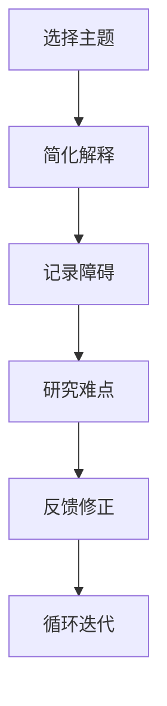

                 

关键词：费曼提问法、学习深度、问题解决、知识传递、IT领域

> 摘要：本文将探讨一种名为费曼提问法的学习技巧，如何通过提出和回答问题来加深对知识的理解，提升学习深度。文章将通过IT领域的实际案例，阐述该方法的应用，并提供实践建议，帮助读者在技术学习中取得更好的成果。

## 1. 背景介绍

费曼提问法（Feynman Technique）源于著名物理学家理查德·费曼（Richard Feynman），他在学习物理的过程中发现，通过将复杂的概念简化并用简单的语言解释给他人，可以更深入地理解和掌握知识。费曼提问法强调通过提问和回答的过程来检验和巩固学习成果，其核心思想是：

1. 选择一个你想要学习的概念或主题。
2. 用最简单的语言解释这个概念，就好像在向一个初学者或儿童解释一样。
3. 在解释的过程中，记录下你遇到的任何障碍或难以解释的部分。
4. 回到原始资料，研究那些难以解释的部分，直到你能够用简单的语言清楚地解释它们。

这种方法不仅在物理学领域有效，在IT领域的许多技术学习中同样适用。本文将详细阐述如何使用费曼提问法提升学习深度，并在多个实际案例中展示其应用效果。

## 2. 核心概念与联系

### 费曼提问法流程

使用费曼提问法，需要遵循以下步骤：

1. **选择主题**：确定你想要深入学习的主题或概念。
2. **简化解释**：尝试用简单的语言解释这个主题，就像对一个孩子或初学者解释一样。
3. **记录障碍**：在解释过程中，记录下你遇到的任何难点或无法解释的部分。
4. **研究难点**：回到原始资料，研究那些难以解释的部分，直到你能够用简单的语言清楚地解释它们。
5. **反馈修正**：与他人交流你的解释，获取反馈，进一步修正和完善。

### Mermaid 流程图



通过这种循环迭代的过程，你可以不断地深化对知识的理解，直到能够以清晰、简洁的方式将其传授给他人。

## 3. 核心算法原理 & 具体操作步骤

### 3.1 算法原理概述

费曼提问法的核心在于通过提问和回答的过程来检验和巩固学习成果。其原理可以总结为：

- **知识传递**：通过解释给他人，检验你对知识的理解程度。
- **问题驱动**：在解释过程中遇到的问题，促使你深入研究。
- **反馈修正**：通过他人的反馈，修正和完善你的理解。

### 3.2 算法步骤详解

1. **选择主题**：选择一个你想要深入学习的主题或概念。
2. **用简单语言解释**：尝试用简单的语言将这个主题解释给一个初学者或孩子。
3. **记录障碍**：在解释过程中，记录下你遇到的任何难点或无法解释的部分。
4. **研究难点**：回到原始资料，研究那些难以解释的部分，直到你能够用简单的语言清楚地解释它们。
5. **反馈修正**：与他人交流你的解释，获取反馈，进一步修正和完善。
6. **循环迭代**：重复上述步骤，不断深化对知识的理解。

### 3.3 算法优缺点

**优点**：
- **深化理解**：通过提问和回答的过程，可以更深入地理解知识。
- **巩固记忆**：通过不断地解释和修正，可以更好地记忆和掌握知识。
- **提高表达能力**：在解释过程中，可以提高语言表达和沟通能力。

**缺点**：
- **初期耗时**：开始时可能需要花费较多的时间和精力来熟悉和掌握这种方法。
- **对知识体系要求较高**：需要具备一定的知识储备，才能有效地应用费曼提问法。

### 3.4 算法应用领域

费曼提问法在多个领域都有应用，尤其在IT领域，如编程、算法、数据库等。通过这种方法，可以：

- **提高编程能力**：通过解释代码逻辑，更深入地理解编程概念。
- **优化算法设计**：在算法研究中，通过提问和回答，优化算法效率和性能。
- **加深数据库理解**：通过解释数据库结构和操作，更深入地理解数据库原理。

## 4. 数学模型和公式 & 详细讲解 & 举例说明

### 4.1 数学模型构建

费曼提问法并没有一个特定的数学模型，但其在学习过程中的应用可以类比于一种“逆向工程”过程。这个过程可以建模为一个迭代函数，其形式如下：

$$
f(x) = \text{简化解释}(x) \rightarrow g(f(x)) = \text{完善理解}(f(x))
$$

其中，$f(x)$ 表示用简单语言解释知识的过程，$g(x)$ 表示深入研究并完善理解的过程。

### 4.2 公式推导过程

公式的推导过程实际上是一个反复迭代的过程，具体步骤如下：

1. **初始化**：选择一个主题或概念 $x$。
2. **简化解释**：用简单语言对 $x$ 进行解释，得到 $f(x)$。
3. **识别问题**：在解释过程中，记录下任何无法解释的部分。
4. **深入研究**：针对无法解释的部分，进行深入研究，得到更完整的解释 $f'(x)$。
5. **迭代**：将 $f'(x)$ 替换回公式中，继续迭代。

这个过程可以表示为：

$$
f(x) \rightarrow f'(x) \rightarrow f''(x) \rightarrow ...
$$

### 4.3 案例分析与讲解

假设我们要解释微积分的基本概念“极限”。

1. **初始化**：选择“极限”作为主题。
2. **简化解释**：我们尝试用简单的语言解释“极限”：
   - “当函数无限接近某个值时，我们称这个值为极限。”
3. **识别问题**：在解释过程中，我们可能遇到的问题是如何理解“无限接近”。
4. **深入研究**：我们需要更深入地研究“无限接近”的含义，例如使用“无穷小量”的概念：
   - “当自变量无限接近某个值时，函数值会无限接近某个极限值。”
5. **迭代**：将新的解释替换回原始公式，继续迭代。

通过这个过程，我们可以更深入地理解“极限”的概念，并能够用简单的语言清楚地解释它。

## 5. 项目实践：代码实例和详细解释说明

### 5.1 开发环境搭建

为了演示如何使用费曼提问法进行编程学习，我们首先需要一个开发环境。这里以Python为例，搭建Python开发环境的具体步骤如下：

1. **安装Python**：从官方网站下载并安装Python。
2. **安装IDE**：推荐使用PyCharm或VSCode作为Python开发工具。
3. **安装必要的库**：例如，安装numpy和pandas库。

### 5.2 源代码详细实现

以下是一个简单的Python代码示例，用于计算两个数的和：

```python
def add_numbers(a, b):
    return a + b

result = add_numbers(3, 4)
print("The sum is:", result)
```

### 5.3 代码解读与分析

在这个示例中，我们定义了一个名为`add_numbers`的函数，用于计算两个数的和。函数接收两个参数`a`和`b`，返回它们的和。

1. **选择主题**：学习如何定义和调用函数。
2. **简化解释**：我们尝试用简单的语言解释函数的定义和调用：
   - “函数是执行特定任务的代码块。定义函数时，我们需要指定函数名和参数。调用函数时，我们需要提供参数并调用函数名。”
3. **记录障碍**：在解释过程中，我们可能遇到的问题是如何理解参数的作用。
4. **深入研究**：我们需要更深入地研究参数的作用：
   - “参数是函数定义的一部分，用于传递数据。在函数调用时，我们需要提供参数的值，函数内部可以使用这些值来执行任务。”
5. **迭代**：将新的解释替换回原始代码，继续迭代。

通过这个过程，我们可以更深入地理解函数的定义和调用，并能够用简单的语言清楚地解释它。

### 5.4 运行结果展示

执行上述代码后，输出结果为：

```
The sum is: 7
```

这表明我们已经成功定义并调用了函数，计算出了两个数的和。

## 6. 实际应用场景

费曼提问法在IT领域的应用场景非常广泛，以下是一些具体的应用场景：

- **编程学习**：通过费曼提问法，可以更好地理解和掌握编程语言的基本概念和语法。
- **算法研究**：在算法研究中，通过提问和回答，可以深入理解算法的原理和实现。
- **数据库学习**：通过费曼提问法，可以更深入地理解数据库的结构和操作。
- **技术面试准备**：在面试准备过程中，通过费曼提问法，可以更好地掌握面试知识点，并能够清晰、准确地表达自己的思路。

## 7. 工具和资源推荐

### 7.1 学习资源推荐

- **在线课程**：推荐Coursera、edX等在线平台上的相关课程。
- **书籍**：推荐《Python编程：从入门到实践》、《算法导论》等书籍。
- **博客**：推荐Reddit、Stack Overflow等技术论坛。

### 7.2 开发工具推荐

- **IDE**：推荐PyCharm、VSCode等集成开发环境。
- **版本控制工具**：推荐Git、GitHub等版本控制工具。

### 7.3 相关论文推荐

- **《深度学习》**：由Ian Goodfellow等作者撰写的深度学习领域经典教材。
- **《算法导论》**：由Thomas H. Cormen等作者撰写的算法领域经典教材。

## 8. 总结：未来发展趋势与挑战

### 8.1 研究成果总结

费曼提问法作为一种有效的学习技巧，已经在多个领域得到了广泛应用。研究表明，通过提问和回答的过程，可以显著提升学习的深度和效果。

### 8.2 未来发展趋势

- **在线学习平台**：未来，更多的在线学习平台将集成费曼提问法，提供更丰富的学习资源和互动体验。
- **人工智能辅助**：利用人工智能技术，为费曼提问法提供个性化推荐和智能辅助。

### 8.3 面临的挑战

- **知识储备要求**：费曼提问法对学习者的知识储备有一定要求，初学者可能需要更多的时间和精力来适应。
- **技术更新速度**：随着技术的快速发展，保持知识的更新和深化是一项挑战。

### 8.4 研究展望

未来，费曼提问法的研究将更多关注如何将其与人工智能、在线学习等新兴技术相结合，提供更高效、个性化的学习体验。

## 9. 附录：常见问题与解答

### 9.1 费曼提问法的最佳实践是什么？

- **选择简单明了的主题**：选择容易理解的主题，以便更好地应用费曼提问法。
- **使用多种方式解释**：尝试使用文字、图表、演示等多种方式解释同一主题，以增强理解和记忆。
- **持续迭代**：不断迭代和完善你的解释，以深化对知识的理解。

### 9.2 如何评估费曼提问法的有效性？

- **提问和回答的质量**：通过提问和回答的质量来评估学习效果，如果能够清晰地解释复杂概念，说明已经掌握了知识。
- **知识迁移能力**：评估是否能够在不同情境下应用所学知识，解决实际问题。

### 9.3 费曼提问法是否适用于所有学科？

- **适用范围**：费曼提问法主要适用于需要深入理解的知识领域，如编程、算法、数学等。对于需要记忆的知识，如历史、文学等，效果可能相对较差。

### 9.4 费曼提问法是否适合自学？

- **自学适用性**：费曼提问法非常适合自学，因为其核心在于自我检验和自我完善。自学过程中，通过提问和回答，可以更好地理解和掌握知识。

### 9.5 如何在团队项目中应用费曼提问法？

- **团队讨论**：在团队项目中，可以定期进行费曼提问法的讨论，以检验和巩固团队成员对知识的理解。
- **知识分享会**：组织知识分享会，让团队成员轮流解释他们负责的知识点，其他成员提供反馈和建议。

作者：禅与计算机程序设计艺术 / Zen and the Art of Computer Programming

本文通过介绍费曼提问法，探讨了如何通过提问和回答的过程提升学习的深度。在IT领域，这种方法尤其适用于编程、算法和数据库等知识的学习。通过实际案例和项目实践，展示了费曼提问法的应用效果。未来，随着在线学习和人工智能技术的不断发展，费曼提问法有望在更广泛的领域和更高效的场景中发挥重要作用。希望本文能为读者的技术学习之路提供有益的启示和帮助。

