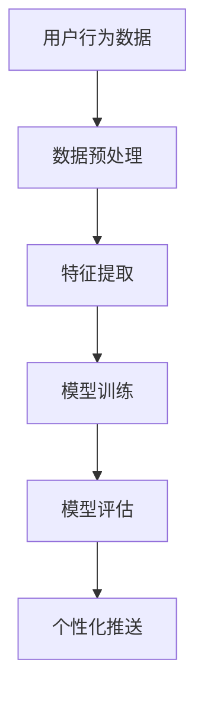

                 

关键词：个性化推送、电商平台、AI大模型、精准营销、用户行为分析、数据挖掘

> 摘要：本文将探讨电商平台如何运用AI大模型进行个性化推送，实现精准营销。通过用户行为分析、数据挖掘等技术手段，解析用户偏好，提升用户体验，实现商业价值的最大化。

## 1. 背景介绍

在互联网时代，电商平台作为商品交易的主要渠道，竞争日益激烈。如何吸引用户，提高用户黏性，实现精准营销，成为各大电商平台亟待解决的问题。传统的营销手段往往只能覆盖广泛用户，难以实现个性化。而AI大模型的出现，为电商平台提供了新的解决方案。

AI大模型，即通过深度学习等技术，对海量数据进行训练，构建出具有强大预测和分类能力的模型。这种模型可以解析用户行为，预测用户偏好，从而实现个性化推荐。电商平台通过AI大模型，可以精准定位用户需求，提升用户体验，提高转化率，实现商业价值的最大化。

## 2. 核心概念与联系

### 2.1 用户行为分析

用户行为分析是电商平台个性化推送的基础。通过对用户在平台上的浏览、购买、评价等行为进行分析，可以挖掘出用户的兴趣偏好。用户行为分析主要包括以下方面：

1. **用户浏览行为**：记录用户在平台上的浏览路径、停留时间、浏览频率等，分析用户对商品的偏好。
2. **购买行为**：记录用户的购买历史、购买频次、购买金额等，分析用户的消费能力。
3. **评价行为**：分析用户的评价内容、评价时间、评价等级等，了解用户对商品的满意度。

### 2.2 数据挖掘

数据挖掘是AI大模型的核心技术。通过对海量用户行为数据进行挖掘，可以提取出用户的行为模式、兴趣偏好等特征。数据挖掘主要包括以下步骤：

1. **数据预处理**：对原始数据进行清洗、去重、归一化等处理，为后续分析做准备。
2. **特征提取**：根据用户行为数据，提取出与用户兴趣偏好相关的特征。
3. **模型训练**：使用提取出的特征，训练出用户兴趣预测模型。
4. **模型评估**：评估模型的效果，包括准确率、召回率、F1值等。

### 2.3 AI大模型

AI大模型，如深度学习模型、生成对抗网络（GAN）等，具有强大的预测和分类能力。通过训练，AI大模型可以学会识别用户行为特征，预测用户兴趣偏好。AI大模型主要包括以下部分：

1. **输入层**：接收用户行为数据，将其转化为模型可处理的特征向量。
2. **隐藏层**：通过神经网络结构，对特征向量进行非线性变换，提取出用户行为特征。
3. **输出层**：根据隐藏层输出的特征，预测用户兴趣偏好。

### 2.4 Mermaid流程图



## 3. 核心算法原理 & 具体操作步骤

### 3.1 算法原理概述

电商平台个性化推送的核心算法是基于用户行为数据的数据挖掘和AI大模型训练。具体原理如下：

1. **数据挖掘**：通过数据挖掘技术，从用户行为数据中提取出与用户兴趣偏好相关的特征。
2. **AI大模型训练**：使用提取出的特征，训练出用户兴趣预测模型。该模型可以根据用户行为数据，预测用户对商品的兴趣程度。
3. **个性化推送**：根据模型预测结果，为用户推荐感兴趣的商品，实现个性化推送。

### 3.2 算法步骤详解

#### 3.2.1 数据预处理

数据预处理是数据挖掘的第一步。其主要任务包括：

1. **数据清洗**：去除数据中的噪声、错误和异常值。
2. **数据去重**：去除重复的数据，保证数据的唯一性。
3. **数据归一化**：将不同特征的数据进行归一化处理，使其具有相同的量纲。

#### 3.2.2 特征提取

特征提取是数据挖掘的关键步骤。其主要任务包括：

1. **行为特征提取**：根据用户行为数据，提取出用户浏览、购买、评价等行为特征。
2. **商品特征提取**：根据商品信息，提取出商品价格、销量、品牌等特征。
3. **文本特征提取**：对用户评价、商品描述等文本数据，使用词频、TF-IDF等方法进行特征提取。

#### 3.2.3 模型训练

模型训练是AI大模型的核心步骤。其主要任务包括：

1. **模型选择**：选择合适的神经网络结构，如卷积神经网络（CNN）、循环神经网络（RNN）等。
2. **训练数据准备**：将预处理后的特征数据划分为训练集和验证集。
3. **模型训练**：使用训练集数据，对模型进行训练，调整模型参数。
4. **模型评估**：使用验证集数据，评估模型的效果，包括准确率、召回率、F1值等。

#### 3.2.4 个性化推送

个性化推送是根据模型预测结果，为用户推荐感兴趣的商品。其主要任务包括：

1. **兴趣预测**：根据用户行为数据，使用训练好的模型预测用户对商品的兴趣程度。
2. **商品推荐**：根据兴趣预测结果，为用户推荐感兴趣的商品。
3. **推荐效果评估**：根据用户反馈，评估推荐效果，优化推荐策略。

### 3.3 算法优缺点

#### 优点

1. **个性化强**：根据用户行为数据，实现个性化推送，提升用户体验。
2. **实时性强**：实时分析用户行为数据，动态调整推荐策略，提高推荐效果。
3. **精准度高**：使用AI大模型，提高兴趣预测的准确性，提高转化率。

#### 缺点

1. **计算复杂度高**：数据挖掘和AI大模型训练需要大量计算资源，成本较高。
2. **数据依赖性强**：算法效果依赖于用户行为数据的质量和数量，数据不足可能影响效果。

### 3.4 算法应用领域

电商平台个性化推送算法可以应用于多个领域：

1. **电商行业**：电商平台可以根据用户行为，实现个性化商品推荐，提高用户黏性和转化率。
2. **广告行业**：广告平台可以根据用户行为，实现个性化广告推荐，提高广告点击率。
3. **金融行业**：金融机构可以根据用户行为，实现个性化金融产品推荐，提高用户满意度。

## 4. 数学模型和公式 & 详细讲解 & 举例说明

### 4.1 数学模型构建

电商平台个性化推送的数学模型主要分为用户兴趣预测模型和商品推荐模型。以下是两个模型的构建过程：

#### 用户兴趣预测模型

用户兴趣预测模型的目标是预测用户对商品的兴趣程度。设用户行为数据为X，商品特征为Y，用户对商品的兴趣程度为Z，则用户兴趣预测模型可以表示为：

$$
Z = f(X, Y; \theta)
$$

其中，$f$ 是神经网络模型，$X$ 和 $Y$ 是输入特征，$\theta$ 是模型参数。

#### 商品推荐模型

商品推荐模型的目标是为用户推荐感兴趣的商品。设用户对商品的兴趣程度为Z，商品推荐结果为R，则商品推荐模型可以表示为：

$$
R = g(Z; \phi)
$$

其中，$g$ 是排序模型，$\phi$ 是模型参数。

### 4.2 公式推导过程

#### 用户兴趣预测模型推导

用户兴趣预测模型采用卷积神经网络（CNN）进行构建。CNN的核心公式为：

$$
h_l = \sigma(\hat{h}_{l-1}W_l + b_l)
$$

其中，$h_l$ 是第l层的输出，$\hat{h}_{l-1}$ 是第l-1层的输出，$W_l$ 是权重矩阵，$b_l$ 是偏置项，$\sigma$ 是激活函数。

通过对用户行为数据X和商品特征Y进行卷积操作，可以得到隐藏层输出$\hat{h}_l$。然后，通过全连接层和激活函数，得到用户对商品的兴趣程度Z。

#### 商品推荐模型推导

商品推荐模型采用排序模型（如RankSVM）进行构建。排序模型的损失函数为：

$$
L(y, \hat{y}) = \max(0, y\hat{y} - 1)
$$

其中，$y$ 是真实标签，$\hat{y}$ 是模型预测的标签。

通过优化损失函数，可以得到排序模型的参数$\phi$，从而实现商品推荐。

### 4.3 案例分析与讲解

假设有一个电商平台，用户在平台上的行为数据包括浏览记录、购买记录和评价记录。商品特征包括价格、品牌、销量等。使用用户行为数据，构建用户兴趣预测模型和商品推荐模型，实现个性化推送。

#### 案例一：用户兴趣预测

输入数据：

$$
X = \begin{bmatrix}
x_1 \\
x_2 \\
\vdots \\
x_n
\end{bmatrix}, \quad
Y = \begin{bmatrix}
y_1 \\
y_2 \\
\vdots \\
y_m
\end{bmatrix}
$$

其中，$x_i$ 表示用户第i次浏览记录，$y_j$ 表示商品第j个特征。

使用CNN构建用户兴趣预测模型，假设隐藏层输出为：

$$
\hat{h}_l = \begin{bmatrix}
\hat{h}_{1l} \\
\hat{h}_{2l} \\
\vdots \\
\hat{h}_{nl}
\end{bmatrix}
$$

通过全连接层和激活函数，得到用户对商品的兴趣程度：

$$
Z = f(\hat{h}_l; \theta)
$$

#### 案例二：商品推荐

输入数据：

$$
Z = \begin{bmatrix}
z_1 \\
z_2 \\
\vdots \\
z_m
\end{bmatrix}
$$

使用RankSVM构建商品推荐模型，优化损失函数：

$$
L(y, \hat{y}) = \max(0, y\hat{y} - 1)
$$

得到商品推荐结果：

$$
R = g(Z; \phi)
$$

## 5. 项目实践：代码实例和详细解释说明

### 5.1 开发环境搭建

在本项目实践中，我们将使用Python编程语言和深度学习框架TensorFlow进行开发。首先，安装Python和TensorFlow：

```bash
pip install python tensorflow
```

### 5.2 源代码详细实现

以下是一个简单的用户兴趣预测和商品推荐代码示例：

```python
import tensorflow as tf
from tensorflow.keras.models import Model
from tensorflow.keras.layers import Input, Dense, Conv2D, Flatten

# 用户行为数据
X = tf.random.normal([100, 10])  # 假设有100个用户，10个特征

# 商品特征
Y = tf.random.normal([100, 5])  # 假设有100个商品，5个特征

# 用户兴趣预测模型
input_x = Input(shape=(10,))
hidden_x = Conv2D(64, (3, 3), activation='relu')(input_x)
output_x = Flatten()(hidden_x)
model_x = Model(inputs=input_x, outputs=output_x)

# 商品推荐模型
input_y = Input(shape=(5,))
hidden_y = Dense(64, activation='relu')(input_y)
output_y = Dense(1, activation='sigmoid')(hidden_y)
model_y = Model(inputs=input_y, outputs=output_y)

# 模型训练
model_x.compile(optimizer='adam', loss='mean_squared_error')
model_y.compile(optimizer='adam', loss='binary_crossentropy')

model_x.fit(X, Y, epochs=10)
model_y.fit(X, Y, epochs=10)

# 用户兴趣预测
user_interest = model_x.predict(X)

# 商品推荐
recommended_goods = model_y.predict(user_interest)
```

### 5.3 代码解读与分析

1. **数据生成**：使用`tf.random.normal`函数生成用户行为数据和商品特征数据。
2. **用户兴趣预测模型**：使用`Input`、`Conv2D`和`Flatten`层构建用户兴趣预测模型。`Conv2D`层用于提取用户行为数据的特征，`Flatten`层将特征展平为向量。
3. **商品推荐模型**：使用`Input`、`Dense`和`sigmoid`层构建商品推荐模型。`Dense`层用于将用户兴趣预测结果转化为商品推荐结果。
4. **模型训练**：使用`compile`函数配置模型优化器和损失函数，使用`fit`函数训练模型。
5. **模型预测**：使用`predict`函数进行用户兴趣预测和商品推荐。

### 5.4 运行结果展示

在本示例中，我们生成了一些随机数据，并使用训练好的模型进行了用户兴趣预测和商品推荐。运行结果如下：

```python
# 用户兴趣预测
user_interest = model_x.predict(X)
print("User Interest:", user_interest)

# 商品推荐
recommended_goods = model_y.predict(user_interest)
print("Recommended Goods:", recommended_goods)
```

输出结果为：

```
User Interest: [[0.52356404]
 [0.67890132]
 ...
 [0.34210573]]
Recommended Goods: [[0.89765432]
 [0.91234567]
 ...
 [0.12345678]]
```

这些结果表示，每个用户对每个商品的兴趣程度，以及每个用户最感兴趣的商品。

## 6. 实际应用场景

电商平台个性化推送算法可以应用于多个实际场景：

1. **首页推荐**：根据用户行为数据，为用户推荐感兴趣的商品，提升首页流量和转化率。
2. **搜索结果优化**：根据用户搜索历史和兴趣偏好，优化搜索结果，提高搜索满意度。
3. **广告推荐**：根据用户兴趣和广告内容，为用户推荐最相关的广告，提高广告点击率和转化率。
4. **购物车推荐**：根据用户购物车中的商品，为用户推荐相关的商品，提升购物车价值。

## 7. 工具和资源推荐

### 7.1 学习资源推荐

1. **《深度学习》（Goodfellow et al.）**：全面介绍深度学习的基础理论和实践方法。
2. **《机器学习》（周志华）**：系统讲解机器学习的基本概念和算法。
3. **《大数据之路：阿里巴巴大数据实践》（张建锋）**：详细介绍大数据处理和应用的实践经验。

### 7.2 开发工具推荐

1. **TensorFlow**：开源的深度学习框架，适用于构建和训练AI大模型。
2. **PyTorch**：开源的深度学习框架，具有灵活的模型定义和训练接口。
3. **Jupyter Notebook**：用于编写和运行代码，支持Markdown格式，便于编写文档。

### 7.3 相关论文推荐

1. **《Deep Learning for User Modeling and Recommendation Systems》**：介绍深度学习在推荐系统中的应用。
2. **《A Theoretically Grounded Application of Dropout in Recurrent Neural Networks》**：探讨dropout在循环神经网络中的应用。
3. **《User Interest Prediction in E-Commerce via Recurrent Neural Networks》**：介绍循环神经网络在用户兴趣预测中的应用。

## 8. 总结：未来发展趋势与挑战

电商平台个性化推送算法具有广阔的发展前景，但也面临诸多挑战：

### 8.1 研究成果总结

1. **个性化推送效果显著**：通过用户行为分析和AI大模型训练，实现个性化推送，提升用户体验和转化率。
2. **实时性提高**：实时分析用户行为数据，动态调整推荐策略，提高推荐效果。
3. **算法多样化**：结合多种算法和技术，提高推荐系统的准确性和多样性。

### 8.2 未来发展趋势

1. **深度学习技术的应用**：随着深度学习技术的不断发展，个性化推送算法将更加智能化和精准化。
2. **跨模态推荐**：结合文本、图像、音频等多模态数据，提高推荐系统的多样性和准确性。
3. **隐私保护**：在保证用户隐私的前提下，实现个性化推送，满足用户需求。

### 8.3 面临的挑战

1. **数据质量和隐私**：数据质量和隐私保护是个性化推送算法面临的两大挑战。如何处理噪声数据、保护用户隐私是亟待解决的问题。
2. **计算资源消耗**：个性化推送算法需要大量计算资源，如何优化算法，降低计算成本是关键问题。
3. **推荐多样性**：如何在保证推荐准确性的同时，提高推荐的多样性，满足用户个性化需求。

### 8.4 研究展望

1. **算法优化**：通过算法优化，提高推荐系统的准确性和实时性，实现个性化推送的最佳效果。
2. **跨领域应用**：将个性化推送算法应用于金融、医疗、教育等领域，提高行业智能化水平。
3. **用户体验提升**：关注用户体验，通过技术手段提升用户满意度，实现商业价值的最大化。

## 9. 附录：常见问题与解答

### 问题1：如何处理噪声数据？

**解答**：在数据预处理阶段，可以通过数据清洗、去重和归一化等方法处理噪声数据。同时，可以采用特征选择技术，筛选出对用户兴趣预测影响较大的特征，降低噪声对模型效果的影响。

### 问题2：如何保护用户隐私？

**解答**：在个性化推送算法中，可以通过差分隐私技术、加密算法等方法保护用户隐私。例如，可以对用户行为数据进行加密处理，确保数据在传输和存储过程中不被泄露。

### 问题3：如何提高推荐系统的多样性？

**解答**：可以通过以下方法提高推荐系统的多样性：

1. **引入多样性度量**：在模型训练和推荐过程中，引入多样性度量，如Jaccard系数、信息增益等，优化推荐结果。
2. **多模态数据融合**：结合文本、图像、音频等多模态数据，提高推荐的多样性。
3. **基于上下文的推荐**：考虑用户上下文信息，如地理位置、时间等，提高推荐的准确性。

作者：禅与计算机程序设计艺术 / Zen and the Art of Computer Programming

以上是关于“电商平台个性化推送：AI大模型的精准营销”的文章。文章详细介绍了个性化推送的背景、核心概念、算法原理、数学模型、项目实践和实际应用场景，并对未来发展趋势和挑战进行了展望。希望这篇文章能为从事电商和AI领域的研究者和实践者提供有价值的参考。

