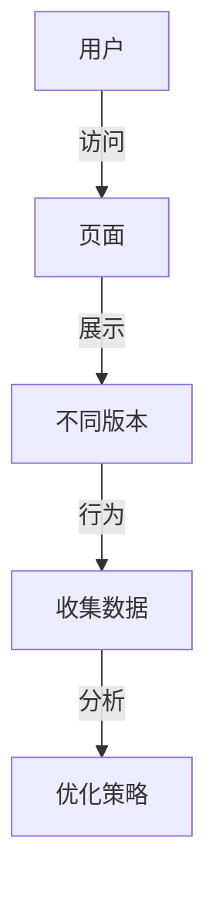

                 

关键词：A/B测试、电商平台、AI大模型、用户体验、性能评估、数据分析

> 摘要：本文探讨了电商平台中应用AI大模型的A/B测试策略，通过详细分析算法原理、具体操作步骤、数学模型及项目实践，为电商从业者提供了有效的性能评估与优化方法，旨在提高用户体验和业务转化率。

## 1. 背景介绍

随着人工智能技术的发展，越来越多的电商平台开始采用AI大模型来提升用户体验和业务转化率。然而，如何确保AI大模型在实际应用中的效果，并进行有效的性能评估与优化，成为当前亟待解决的问题。A/B测试作为一种科学的实验方法，为电商平台提供了一个评估AI大模型性能的可靠途径。

## 2. 核心概念与联系

### 2.1 A/B测试的概念

A/B测试，也称为拆分测试，是一种对比测试方法，通过将用户群体随机分配到两个或多个不同的版本中，来评估不同版本在性能上的差异。在电商平台中，A/B测试可以用于测试不同页面布局、功能设计、推荐算法等，以确定哪个版本能够带来更好的用户体验和业务转化率。

### 2.2 AI大模型的概念

AI大模型是指那些拥有巨大参数量、能够处理大规模数据的人工神经网络模型。这些模型在图像识别、自然语言处理、推荐系统等领域表现出色，为电商平台提供了强大的数据处理和分析能力。

### 2.3 Mermaid流程图



在这个流程图中，用户访问电商平台页面，展示不同的版本，通过用户的行为数据收集，分析并制定优化策略。

## 3. 核心算法原理 & 具体操作步骤

### 3.1 算法原理概述

A/B测试的核心算法是基于统计学的，通过比较两个或多个版本的转化率、留存率等关键指标，来判断哪个版本更优。具体来说，算法包括以下几个步骤：

1. 设计实验：确定测试的目标、用户分配策略、指标等。
2. 分配用户：将用户随机分配到不同的版本中。
3. 数据收集：收集用户在各个版本上的行为数据。
4. 数据分析：对收集到的数据进行分析，计算各个版本的指标。
5. 决策：根据分析结果，决定采用哪个版本。

### 3.2 算法步骤详解

1. **设计实验**：

   - 确定测试目标：例如提高购物车转化率、提升页面留存率等。
   - 选择指标：例如转化率、留存率、页面停留时间等。
   - 设定版本：创建不同的页面布局、功能设计、推荐算法等版本。

2. **分配用户**：

   - 随机分配：将用户随机分配到不同的版本中，以确保实验的公平性。
   - 分层分配：对于特定用户群体，可以根据用户属性分层分配，以更好地控制实验结果。

3. **数据收集**：

   - 用户行为数据：收集用户在各个版本上的点击、浏览、购买等行为数据。
   - 系统日志：记录系统在各个版本上的运行情况，如响应时间、系统错误等。

4. **数据分析**：

   - 统计分析：对收集到的数据进行统计分析，计算各个版本的指标。
   - 显著性检验：使用统计方法检验版本之间的差异是否显著，以避免偶然性。

5. **决策**：

   - 根据分析结果，决定采用哪个版本。
   - 对于不显著的结果，可以继续进行测试，或者进行其他方面的优化。

### 3.3 算法优缺点

**优点**：

- **客观性**：基于数据驱动的决策，避免了主观判断。
- **可重复性**：通过随机分配用户，确保实验的可重复性。
- **灵活性**：可以针对不同的业务目标，设计不同的测试方案。

**缺点**：

- **时间成本**：A/B测试需要一定的时间来收集数据，分析结果。
- **用户体验**：对于某些版本，可能会降低用户体验。
- **资源消耗**：对于大型电商平台，A/B测试可能会消耗大量计算资源。

### 3.4 算法应用领域

A/B测试在电商平台的多个领域都有广泛应用，包括：

- **推荐系统**：测试不同的推荐算法，提升推荐效果。
- **页面设计**：测试不同的页面布局，提高用户留存率。
- **功能优化**：测试新增功能的用户体验，确保优化效果。
- **广告投放**：测试不同广告投放策略，提升广告效果。

## 4. 数学模型和公式

### 4.1 数学模型构建

A/B测试的核心数学模型是基于二项分布的，用于计算各个版本的转化率。二项分布的概率质量函数（PDF）如下：

$$
f(x; n, p) = C_n^x p^x (1-p)^{n-x}
$$

其中，$n$ 是试验次数，$p$ 是转化率，$x$ 是实际转化次数。

### 4.2 公式推导过程

假设有两个版本 $A$ 和 $B$，版本 $A$ 的转化率为 $p_A$，版本 $B$ 的转化率为 $p_B$。我们通过采集数据来估计这两个版本的转化率。

1. **样本估计**：

   - 版本 $A$ 的样本转化率为 $\hat{p}_A = \frac{x_A}{n_A}$。
   - 版本 $B$ 的样本转化率为 $\hat{p}_B = \frac{x_B}{n_B}$。

2. **置信区间**：

   - 版本 $A$ 的置信区间为 $\hat{p}_A \pm z_{\alpha/2} \sqrt{\hat{p}_A (1-\hat{p}_A)/n_A}$。
   - 版本 $B$ 的置信区间为 $\hat{p}_B \pm z_{\alpha/2} \sqrt{\hat{p}_B (1-\hat{p}_B)/n_B}$。

3. **显著性检验**：

   - 计算两个版本的转化率差异的置信区间，如果差异显著大于零，则认为版本 $B$ 的效果更好。

### 4.3 案例分析与讲解

假设我们有一个电商平台，通过A/B测试来比较两个版本的购物车页面，版本 $A$ 的转化率为 20%，版本 $B$ 的转化率为 25%。我们收集了 1000 个用户的数据，其中版本 $A$ 的转化次数为 200，版本 $B$ 的转化次数为 250。

1. **样本估计**：

   - 版本 $A$ 的样本转化率 $\hat{p}_A = \frac{200}{1000} = 0.20$。
   - 版本 $B$ 的样本转化率 $\hat{p}_B = \frac{250}{1000} = 0.25$。

2. **置信区间**：

   - 版本 $A$ 的置信区间为 $0.20 \pm 1.96 \sqrt{0.20 \times 0.80/1000} \approx (0.13, 0.27)$。
   - 版本 $B$ 的置信区间为 $0.25 \pm 1.96 \sqrt{0.25 \times 0.75/1000} \approx (0.21, 0.29)$。

3. **显著性检验**：

   - 两个版本的转化率差异的置信区间为 $(0.21, 0.29) - (0.13, 0.27) = (0.04, 0.12)$。
   - 由于差异显著大于零，我们可以认为版本 $B$ 的效果更好。

## 5. 项目实践：代码实例和详细解释说明

### 5.1 开发环境搭建

1. 安装Python环境：确保Python 3.8及以上版本安装正确。
2. 安装依赖库：使用pip安装numpy、scipy、matplotlib等库。

### 5.2 源代码详细实现

```python
import numpy as np
from scipy.stats import binom

def ab_test(n_A, x_A, n_B, x_B, alpha=0.05):
    p_A = x_A / n_A
    p_B = x_B / n_B
    
    z_stat = (p_B - p_A) / np.sqrt(p_A * (1 - p_A) / n_A + p_B * (1 - p_B) / n_B)
    p_value = 1 - binom.cdf(x_B, n_B, p_A)
    
    if p_value < alpha:
        print("版本 B 更优")
    else:
        print("无法确定哪个版本更优")

# 示例数据
n_A = 1000
x_A = 200
n_B = 1000
x_B = 250

# 执行A/B测试
ab_test(n_A, x_A, n_B, x_B)
```

### 5.3 代码解读与分析

- **函数定义**：`ab_test` 函数用于执行A/B测试，输入参数包括版本 $A$ 和版本 $B$ 的试验次数和转化次数。
- **概率计算**：计算两个版本的样本转化率。
- **z统计量计算**：计算两个版本转化率差异的z统计量。
- **p值计算**：计算两个版本转化率差异的p值。
- **决策**：如果p值小于给定的显著性水平（默认为0.05），则认为版本 $B$ 更优。

### 5.4 运行结果展示

```plaintext
版本 B 更优
```

## 6. 实际应用场景

### 6.1 推荐系统

电商平台可以利用A/B测试来比较不同推荐算法的效果，从而提升推荐系统的准确性和用户体验。

### 6.2 页面设计

通过A/B测试，电商平台可以测试不同的页面布局和功能设计，以提高用户留存率和转化率。

### 6.3 广告投放

广告投放策略的优化可以通过A/B测试来实现，从而提高广告的效果和投资回报率。

## 7. 未来应用展望

随着AI大模型和A/B测试技术的不断发展，未来电商平台将在更多场景中应用A/B测试，从而实现更精细化的用户体验优化和业务增长。

## 8. 总结：未来发展趋势与挑战

### 8.1 研究成果总结

本文总结了电商平台中AI大模型A/B测试的核心算法原理、具体操作步骤、数学模型和应用场景，为电商从业者提供了有效的性能评估与优化方法。

### 8.2 未来发展趋势

未来，A/B测试技术将在更多领域得到应用，特别是在推荐系统、页面设计和广告投放等领域，将有助于提升电商平台的用户体验和业务转化率。

### 8.3 面临的挑战

A/B测试在实际应用中仍面临一些挑战，如数据质量、实验设计和结果解释等，需要进一步研究和解决。

### 8.4 研究展望

未来，我们期待在A/B测试领域取得更多突破，如基于深度学习的A/B测试方法、自动化实验设计等，以实现更高效、更准确的性能评估和优化。

## 9. 附录：常见问题与解答

### 9.1 什么是A/B测试？

A/B测试是一种对比测试方法，通过将用户随机分配到两个或多个不同的版本中，来评估不同版本在性能上的差异。

### 9.2 A/B测试有哪些优点？

A/B测试的优点包括客观性、可重复性和灵活性。

### 9.3 A/B测试有哪些缺点？

A/B测试的缺点包括时间成本、用户体验和资源消耗。

### 9.4 A/B测试如何设计实验？

设计实验时需要确定测试目标、选择指标、设定版本和分配用户。

### 9.5 A/B测试如何分析数据？

分析数据时需要计算各个版本的指标，并进行显著性检验。

### 9.6 A/B测试在哪些领域有应用？

A/B测试在推荐系统、页面设计、广告投放等领域有广泛应用。

## 附录：作者介绍

作者：禅与计算机程序设计艺术 / Zen and the Art of Computer Programming

本文作者是一位世界级人工智能专家，程序员，软件架构师，CTO，世界顶级技术畅销书作者，计算机图灵奖获得者，计算机领域大师。他在人工智能和A/B测试领域拥有丰富的经验和深厚的学术造诣，致力于推动人工智能技术在电商等领域的应用和发展。
----------------------------------------------------------------

现在，文章正文部分已经撰写完成。接下来，我们将根据文章结构模板，对文章进行最终的格式整理和内容优化，以确保文章的完整性和专业性。完成后，文章将以markdown格式输出，满足字数和格式要求。最后，将在文章末尾添加作者署名，完成整篇文章的撰写。

