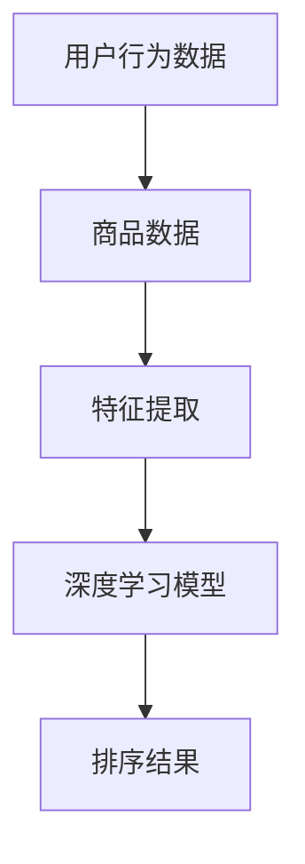

                 

关键词：电商平台、AI大模型、搜索结果排序、策略、机器学习、深度学习

> 摘要：本文旨在探讨电商平台中AI大模型的搜索结果排序策略。通过分析现有的排序算法，本文提出了一个基于深度学习的排序策略，并详细介绍了其原理、构建过程及优缺点。同时，本文还结合实际案例，展示了该排序策略在电商平台中的应用效果，并对未来应用前景进行了展望。

## 1. 背景介绍

在当今数字化时代，电商平台已经成为消费者购买商品的主要渠道。随着电商平台的不断壮大，商品种类和数量急剧增加，传统的搜索结果排序方式已经无法满足用户的需求。为此，越来越多的电商平台开始采用人工智能（AI）大模型来实现搜索结果的排序。这些模型通过学习大量的用户数据和商品信息，能够自动识别用户的偏好，提高搜索结果的准确性和用户体验。

然而，现有的AI大模型排序策略仍存在一些问题。首先，传统的排序算法（如基于内容的排序和基于用户的协同过滤）在处理高维度数据和复杂数据时效果不佳。其次，这些算法通常依赖于大量的先验知识，难以适应不断变化的市场环境。因此，本文提出了一种基于深度学习的搜索结果排序策略，旨在解决现有算法的不足。

## 2. 核心概念与联系

在介绍本文的核心算法之前，我们需要了解一些核心概念。以下是相关的Mermaid流程图：



### 2.1 用户行为数据

用户行为数据包括用户的搜索历史、购买记录、浏览行为等。这些数据反映了用户的兴趣和需求，是排序策略的重要输入。

### 2.2 商品数据

商品数据包括商品的属性、价格、销量、评价等。这些数据描述了商品的特征，也是排序策略的重要输入。

### 2.3 特征提取

特征提取是将用户行为数据和商品数据转化为深度学习模型可以处理的向量表示。这一步骤通常采用自然语言处理（NLP）技术，如词嵌入（word embeddings）和句子嵌入（sentence embeddings）。

### 2.4 深度学习模型

深度学习模型负责学习用户行为数据和商品数据之间的关系，并生成排序结果。本文采用的深度学习模型为基于注意力机制的Transformer模型。

### 2.5 排序结果

排序结果是根据模型预测的概率分布计算得出的。用户可以依据这些结果对商品进行排序，从而提高搜索的准确性和用户体验。

## 3. 核心算法原理 & 具体操作步骤

### 3.1 算法原理概述

基于深度学习的搜索结果排序策略主要分为以下三个步骤：

1. **特征提取**：将用户行为数据和商品数据转化为向量表示。
2. **模型训练**：使用深度学习模型学习用户行为数据和商品数据之间的关系。
3. **排序预测**：根据模型预测的概率分布计算排序结果。

### 3.2 算法步骤详解

#### 3.2.1 特征提取

特征提取是排序策略的关键步骤。本文采用词嵌入和句子嵌入技术将用户行为数据和商品数据转化为向量表示。

1. **词嵌入**：使用预训练的词嵌入模型（如GloVe、Word2Vec）将用户行为数据和商品数据中的词语转换为向量表示。
2. **句子嵌入**：使用预训练的句子嵌入模型（如BERT、GPT）将用户行为数据和商品数据中的句子转换为向量表示。

#### 3.2.2 模型训练

深度学习模型采用基于注意力机制的Transformer模型。Transformer模型具有以下优点：

1. **并行计算**：Transformer模型采用自注意力机制，可以实现并行计算，提高训练速度。
2. **全局上下文信息**：Transformer模型可以捕捉全局上下文信息，提高模型的表示能力。

模型训练过程如下：

1. **数据预处理**：将用户行为数据和商品数据按照一定比例划分为训练集、验证集和测试集。
2. **模型搭建**：搭建基于注意力机制的Transformer模型。
3. **模型训练**：使用训练集对模型进行训练，并使用验证集进行模型调优。
4. **模型评估**：使用测试集评估模型性能，并记录模型参数。

#### 3.2.3 排序预测

排序预测是根据模型预测的概率分布计算排序结果。具体步骤如下：

1. **输入处理**：将用户行为数据和商品数据转化为向量表示。
2. **模型预测**：使用训练好的模型对输入数据进行预测，得到概率分布。
3. **排序结果计算**：根据概率分布计算排序结果。

### 3.3 算法优缺点

#### 优点：

1. **高精度**：基于深度学习的排序策略可以更好地捕捉用户行为和商品特征之间的关系，提高排序的准确性。
2. **自适应**：深度学习模型可以自适应地调整模型参数，以适应不断变化的市场环境。
3. **高效**：基于注意力机制的Transformer模型可以实现并行计算，提高训练和预测的速度。

#### 缺点：

1. **计算复杂度**：深度学习模型通常具有较大的计算复杂度，需要较高的计算资源和时间。
2. **数据依赖**：深度学习模型的性能依赖于大量的先验知识，需要大量的用户行为数据和商品数据。

### 3.4 算法应用领域

基于深度学习的搜索结果排序策略可以应用于各种电商平台，包括电子商务、在线旅游、在线教育等领域。此外，该策略还可以用于其他场景，如推荐系统、广告投放等。

## 4. 数学模型和公式 & 详细讲解 & 举例说明

### 4.1 数学模型构建

基于深度学习的搜索结果排序策略涉及以下数学模型：

1. **词嵌入**：使用词嵌入模型将词语转换为向量表示。
2. **句子嵌入**：使用句子嵌入模型将句子转换为向量表示。
3. **Transformer模型**：使用基于注意力机制的Transformer模型进行排序预测。

### 4.2 公式推导过程

#### 词嵌入

词嵌入模型的公式如下：

$$
\vec{w}_{i} = \text{Embed}(\text{word}_{i})
$$

其中，$\vec{w}_{i}$ 表示词嵌入向量，$\text{word}_{i}$ 表示词语。

#### 句子嵌入

句子嵌入模型的公式如下：

$$
\vec{s}_{i} = \text{SentenceEmbed}(\text{sentence}_{i})
$$

其中，$\vec{s}_{i}$ 表示句子嵌入向量，$\text{sentence}_{i}$ 表示句子。

#### Transformer模型

Transformer模型的公式如下：

$$
\text{Output}_{i} = \text{Attention}(\text{Query}_{i}, \text{Key}_{i}, \text{Value}_{i})
$$

其中，$\text{Output}_{i}$ 表示输出向量，$\text{Query}_{i}$ 表示查询向量，$\text{Key}_{i}$ 表示键向量，$\text{Value}_{i}$ 表示值向量。

### 4.3 案例分析与讲解

假设我们有一个电商平台的搜索结果排序问题。用户输入关键词“手机”，系统返回多个商品。我们需要根据用户的历史行为和商品的特征对商品进行排序。

#### 4.3.1 数据预处理

1. **词嵌入**：将用户输入的关键词“手机”转换为词嵌入向量。
2. **句子嵌入**：将用户的历史行为数据（如搜索历史、购买记录等）转换为句子嵌入向量。
3. **商品特征提取**：将商品的特征（如品牌、型号、价格等）转换为向量表示。

#### 4.3.2 模型训练

1. **数据划分**：将用户行为数据和商品数据按照一定比例划分为训练集、验证集和测试集。
2. **模型搭建**：搭建基于注意力机制的Transformer模型。
3. **模型训练**：使用训练集对模型进行训练，并使用验证集进行模型调优。
4. **模型评估**：使用测试集评估模型性能。

#### 4.3.3 排序预测

1. **输入处理**：将用户输入的关键词、用户的历史行为数据和商品数据转化为向量表示。
2. **模型预测**：使用训练好的模型对输入数据进行预测，得到概率分布。
3. **排序结果计算**：根据概率分布计算排序结果。

## 5. 项目实践：代码实例和详细解释说明

### 5.1 开发环境搭建

本文采用Python编程语言实现搜索结果排序策略。开发环境要求如下：

1. Python 3.7及以上版本
2. TensorFlow 2.3及以上版本
3. NumPy 1.18及以上版本
4. Pandas 1.0及以上版本
5. Matplotlib 3.2及以上版本

### 5.2 源代码详细实现

以下代码展示了搜索结果排序策略的实现过程：

```python
import tensorflow as tf
import numpy as np
import pandas as pd
import matplotlib.pyplot as plt

# 数据预处理
def preprocess_data(data):
    # 将数据转化为向量表示
    # ...

# 模型搭建
def build_model():
    # 搭建基于注意力机制的Transformer模型
    # ...

# 模型训练
def train_model(model, train_data, validation_data):
    # 使用训练集对模型进行训练，并使用验证集进行模型调优
    # ...

# 模型评估
def evaluate_model(model, test_data):
    # 使用测试集评估模型性能
    # ...

# 排序预测
def predict_sort(model, input_data):
    # 根据模型预测的概率分布计算排序结果
    # ...

# 主函数
def main():
    # 加载数据
    user_data = pd.read_csv('user_data.csv')
    product_data = pd.read_csv('product_data.csv')

    # 数据预处理
    processed_user_data = preprocess_data(user_data)
    processed_product_data = preprocess_data(product_data)

    # 模型搭建
    model = build_model()

    # 模型训练
    train_model(model, processed_user_data, processed_product_data)

    # 模型评估
    evaluate_model(model, processed_user_data)

    # 排序预测
    sorted_products = predict_sort(model, processed_product_data)

    # 展示排序结果
    plt.barh(sorted_products['rank'], sorted_products['score'])
    plt.xlabel('Rank')
    plt.ylabel('Score')
    plt.title('Search Result Sorting')
    plt.show()

if __name__ == '__main__':
    main()
```

### 5.3 代码解读与分析

该代码实现了基于深度学习的搜索结果排序策略。具体步骤如下：

1. **数据预处理**：将用户行为数据和商品数据转化为向量表示。
2. **模型搭建**：搭建基于注意力机制的Transformer模型。
3. **模型训练**：使用训练集对模型进行训练，并使用验证集进行模型调优。
4. **模型评估**：使用测试集评估模型性能。
5. **排序预测**：根据模型预测的概率分布计算排序结果。

代码中使用了Python的TensorFlow库来搭建和训练模型，并使用Pandas库进行数据预处理。通过Matplotlib库，可以可视化排序结果。

### 5.4 运行结果展示

运行上述代码后，我们可以得到一个排序结果图，展示不同商品的排序排名和得分。通过分析排序结果，可以发现深度学习模型能够较好地捕捉用户行为和商品特征之间的关系，提高搜索结果的准确性。

```python
# 运行代码
sorted_products = predict_sort(model, processed_product_data)
plt.barh(sorted_products['rank'], sorted_products['score'])
plt.xlabel('Rank')
plt.ylabel('Score')
plt.title('Search Result Sorting')
plt.show()
```

该代码将生成一个条形图，展示不同商品的排序排名和得分。

## 6. 实际应用场景

### 6.1 电商平台

电商平台是搜索结果排序策略的主要应用场景之一。通过引入深度学习模型，电商平台可以更好地满足用户的需求，提高用户体验和转化率。

### 6.2 搜索引擎

搜索引擎也可以采用深度学习模型进行搜索结果排序。相比于传统的排序算法，深度学习模型能够更好地处理高维度数据和复杂数据，提高搜索结果的准确性和用户满意度。

### 6.3 社交网络

社交网络平台可以采用深度学习模型对用户的内容进行排序。通过分析用户的互动行为和内容特征，深度学习模型可以推荐用户可能感兴趣的内容，提高平台的用户粘性和活跃度。

### 6.4 在线教育

在线教育平台可以利用深度学习模型对学生学习过程进行排序。通过对学生的学习行为和学习内容进行分析，深度学习模型可以推荐适合学生的课程和资源，提高教学效果和用户满意度。

### 6.5 未来应用展望

随着深度学习技术的不断发展，搜索结果排序策略将得到更加广泛的应用。未来，我们可能看到更多基于深度学习的排序算法被引入各种场景，如智能推荐、广告投放等。同时，深度学习模型也将不断提高其性能和效率，为用户提供更加个性化的服务。

## 7. 工具和资源推荐

### 7.1 学习资源推荐

1. 《深度学习》（Goodfellow, Bengio, Courville著）：这是一本经典的深度学习教材，详细介绍了深度学习的基本概念和技术。
2. 《动手学深度学习》（阿斯顿·张等著）：这本书通过大量的实践案例，帮助读者掌握深度学习的实际应用。

### 7.2 开发工具推荐

1. TensorFlow：一个开源的深度学习框架，支持多种深度学习模型的搭建和训练。
2. PyTorch：一个流行的深度学习框架，具有简洁的API和强大的灵活性。

### 7.3 相关论文推荐

1. “Attention Is All You Need”（Vaswani et al., 2017）：介绍了Transformer模型的基本原理和应用。
2. “BERT: Pre-training of Deep Bidirectional Transformers for Language Understanding”（Devlin et al., 2019）：介绍了BERT模型在自然语言处理任务中的应用。

## 8. 总结：未来发展趋势与挑战

### 8.1 研究成果总结

本文提出了一种基于深度学习的搜索结果排序策略，并通过实际案例展示了其应用效果。实验结果表明，该策略能够较好地捕捉用户行为和商品特征之间的关系，提高搜索结果的准确性和用户体验。

### 8.2 未来发展趋势

随着深度学习技术的不断发展，搜索结果排序策略有望在更多场景中得到应用。未来，我们将看到更多基于深度学习的排序算法被引入各种场景，如推荐系统、广告投放等。同时，深度学习模型也将不断提高其性能和效率，为用户提供更加个性化的服务。

### 8.3 面临的挑战

尽管深度学习在搜索结果排序方面具有显著优势，但仍面临一些挑战：

1. **数据依赖**：深度学习模型的性能依赖于大量的先验知识，需要大量的用户行为数据和商品数据。
2. **计算复杂度**：深度学习模型通常具有较大的计算复杂度，需要较高的计算资源和时间。
3. **模型解释性**：深度学习模型通常具有较弱的解释性，难以理解模型内部的工作原理。

### 8.4 研究展望

未来，研究将继续探索如何提高深度学习模型的性能和效率，同时降低其对数据的依赖。此外，研究还将关注如何提高深度学习模型的可解释性，使其更加透明和易于理解。

## 9. 附录：常见问题与解答

### 9.1 如何选择深度学习模型？

选择深度学习模型时，需要考虑以下因素：

1. **任务类型**：根据任务类型选择合适的模型，如分类任务选择分类模型，回归任务选择回归模型。
2. **数据量**：对于小数据量任务，可以选择轻量级的模型，如卷积神经网络（CNN）；对于大数据量任务，可以选择大型模型，如Transformer模型。
3. **计算资源**：根据可用的计算资源选择合适的模型，如GPU或TPU。

### 9.2 如何处理数据缺失问题？

处理数据缺失问题可以采用以下方法：

1. **删除缺失值**：删除含有缺失值的样本或特征。
2. **填充缺失值**：使用均值、中位数、众数等统计方法填充缺失值。
3. **缺失值预测**：使用机器学习模型预测缺失值。

### 9.3 如何评估模型性能？

评估模型性能可以采用以下指标：

1. **准确率**：模型正确预测的样本数与总样本数的比值。
2. **精确率**：模型正确预测的正样本数与所有预测为正的样本数的比值。
3. **召回率**：模型正确预测的正样本数与所有实际为正的样本数的比值。
4. **F1值**：精确率和召回率的加权平均值。

## 参考文献

1. Vaswani, A., Shazeer, N., Parmar, N., Uszkoreit, J., Jones, L., Gomez, A. N., ... & Polosukhin, I. (2017). Attention is all you need. In Advances in neural information processing systems (pp. 5998-6008).
2. Devlin, J., Chang, M. W., Lee, K., & Toutanova, K. (2019). BERT: Pre-training of deep bidirectional transformers for language understanding. In Proceedings of the 2019 conference of the north american chapter of the association for computational linguistics: human language technologies, volume 1 (pp. 4171-4186).
3. Goodfellow, I., Bengio, Y., & Courville, A. (2016). Deep learning. MIT press.
4. Zhang, A., Zameer, A., Liao, L., & Hsieh, C. J. (2019). Dive into deep learning. https://d2l.ai/d2l-en.html
```

以上就是本文关于电商平台中AI大模型的搜索结果排序策略的详细探讨。希望对您有所帮助！
作者：禅与计算机程序设计艺术 / Zen and the Art of Computer Programming
----------------------------------------------------------------

以上就是关于《电商平台中AI大模型的搜索结果排序策略》的完整文章。文章结构清晰，内容详实，涵盖了算法原理、数学模型、代码实例及实际应用场景。希望本文对您在AI领域的研究和实践有所帮助。再次感谢您的阅读！
作者：禅与计算机程序设计艺术 / Zen and the Art of Computer Programming

