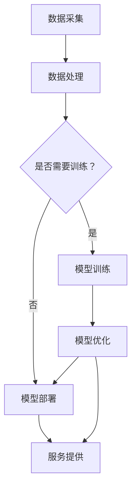

                 

### 关键词 Keywords

- 电商平台
- AI大模型
- 云计算
- 数据分析
- 深度学习
- 机器学习
- 自然语言处理
- 用户行为分析
- 商品推荐
- 智能客服
- 个性化体验

<|assistant|>### 摘要 Abstract

本文探讨了人工智能（AI）大模型与云计算技术结合在电商平台中的应用。首先，介绍了AI大模型的基本原理和云计算的技术优势。然后，详细分析了AI大模型在电商平台中的实际应用，包括用户行为分析、商品推荐系统和智能客服等。通过具体的案例和项目实践，展示了如何利用AI大模型和云计算技术提升电商平台的服务质量和用户体验。最后，讨论了未来应用展望以及面临的挑战和解决方案，为电商平台的技术发展提供了有益的参考。

## 1. 背景介绍

### 电商平台的发展

电商平台作为数字经济的重要组成部分，近年来经历了迅猛的发展。从最初的电子商务到现在的社交电商、直播电商等多种形式，电商平台不断优化用户购物体验，提升服务质量和运营效率。然而，随着市场规模的扩大和用户需求的多样，传统的人工运营方式已经无法满足日益复杂的业务需求。因此，引入人工智能（AI）技术成为电商平台提升竞争力的关键。

### AI大模型的发展

人工智能技术的发展为电商平台提供了强大的技术支持。AI大模型，特别是深度学习和自然语言处理技术，在图像识别、语音识别、文本生成、推荐系统等领域取得了显著成果。这些模型通过大量数据训练，能够自动学习和优化算法，从而实现高效、准确的业务处理。随着硬件性能的提升和算法的进步，AI大模型的应用范围越来越广泛，成为电商平台创新的重要驱动力。

### 云计算的优势

云计算技术的快速发展为AI大模型的应用提供了坚实的基础。云计算通过分布式计算、海量存储和弹性扩展等功能，使得电商平台能够灵活、高效地处理大规模数据和复杂业务。云计算不仅降低了企业的IT成本，还提高了数据的安全性和可靠性。通过云计算，电商平台可以实现全球范围内的服务部署和资源调度，为用户提供更加个性化、智能化的服务体验。

## 2. 核心概念与联系

### AI大模型的原理

AI大模型，通常指的是基于深度学习和神经网络技术的大型复杂模型。这些模型通过多层次的神经网络结构，能够自动从大量数据中提取特征并进行学习。深度学习模型具有强大的表征能力，能够处理高维数据和非线性关系，从而实现高精度的预测和分类。自然语言处理（NLP）是AI大模型的一个重要分支，通过理解、生成和翻译自然语言，实现人机交互的智能化。

### 云计算架构

云计算架构通常包括基础设施即服务（IaaS）、平台即服务（PaaS）和软件即服务（SaaS）等层次。IaaS提供虚拟化的计算资源，如虚拟机、存储和网络等；PaaS提供开发平台和工具，使开发者能够快速构建和部署应用；SaaS则是将应用软件作为一种服务提供给用户。云计算架构具有高可用性、可扩展性和弹性，能够满足电商平台对资源的需求。

### AI大模型与云计算的结合

AI大模型与云计算的结合主要体现在以下几个方面：

1. **计算资源调度**：通过云计算的弹性扩展功能，AI大模型可以根据计算需求动态调整资源，提高计算效率。
2. **数据存储和处理**：云计算提供海量存储和高效数据处理能力，使得AI大模型能够处理和分析大规模数据。
3. **模型训练和部署**：云计算平台提供强大的计算能力和优化工具，使得AI大模型能够快速训练和部署，提高模型性能。
4. **分布式协同**：通过云计算的分布式计算架构，AI大模型可以实现跨地域、跨节点的协同计算，提高模型的可扩展性。

下面是一个使用Mermaid绘制的AI大模型与云计算结合的流程图：



## 3. 核心算法原理 & 具体操作步骤

### 3.1 算法原理概述

电商平台中的AI大模型主要基于深度学习和自然语言处理技术。深度学习模型通过多层神经网络对数据特征进行提取和融合，从而实现高精度的预测和分类。自然语言处理模型则通过理解自然语言结构和语义，实现人机交互的智能化。

### 3.2 算法步骤详解

1. **数据采集**：从电商平台的各种数据源（如用户行为、交易记录、商品信息等）采集数据。
2. **数据处理**：对采集到的数据进行清洗、预处理，包括缺失值处理、异常值处理、数据归一化等。
3. **特征提取**：使用深度学习模型对数据进行特征提取，生成高维特征向量。
4. **模型训练**：使用训练集对深度学习模型进行训练，通过反向传播算法优化模型参数。
5. **模型评估**：使用验证集对训练好的模型进行评估，调整模型参数，提高模型性能。
6. **模型部署**：将训练好的模型部署到云计算平台，提供实时服务。
7. **用户交互**：通过API或Web服务与用户进行交互，实现智能化服务。

### 3.3 算法优缺点

**优点**：
- **高精度**：深度学习模型能够自动学习数据特征，实现高精度的预测和分类。
- **自适应**：模型可以根据新的数据进行在线学习，自适应地调整模型参数。
- **高效性**：云计算平台提供强大的计算能力和优化工具，能够快速训练和部署模型。

**缺点**：
- **高成本**：训练和部署AI大模型需要大量的计算资源和存储资源，可能导致高成本。
- **数据依赖**：模型的性能高度依赖训练数据的质量和多样性，数据偏差可能导致模型性能下降。
- **安全性**：云计算平台的安全性问题需要引起重视，保护用户隐私和数据安全。

### 3.4 算法应用领域

AI大模型在电商平台中的应用领域广泛，包括但不限于：

- **用户行为分析**：通过分析用户的行为数据，预测用户的购买意图和偏好，实现个性化推荐。
- **商品推荐系统**：基于用户行为和商品属性，为用户推荐符合其兴趣和需求的商品。
- **智能客服**：通过自然语言处理技术，实现与用户的智能对话，提供高效的客服服务。
- **广告投放**：根据用户的兴趣和行为，实现精准的广告投放，提高广告效果。
- **风险控制**：通过异常检测和欺诈分析，降低电商平台的运营风险。

## 4. 数学模型和公式 & 详细讲解 & 举例说明

### 4.1 数学模型构建

电商平台中的AI大模型通常基于深度学习和自然语言处理技术。以下是一个简单的数学模型构建示例：

假设我们有一个包含n个节点的神经网络，其中每个节点都有一个权重参数w。给定输入向量x，输出向量y可以通过以下公式计算：

$$
y = \sigma(\text{ReLU}(w \cdot x))
$$

其中，$\sigma$是激活函数（如Sigmoid或ReLU），$\text{ReLU}$是ReLU激活函数（当x>0时，$\text{ReLU}(x) = x$；当x≤0时，$\text{ReLU}(x) = 0$）。

### 4.2 公式推导过程

我们以一个简单的多层感知机（MLP）为例，推导其数学模型：

1. **输入层**：给定输入向量$x = [x_1, x_2, ..., x_n]$，每个输入节点连接到第一个隐藏层的每个节点，权重为$w_{ij}$。

2. **第一隐藏层**：每个隐藏层节点的输出可以通过以下公式计算：

$$
h_{1j} = \text{ReLU}(\sum_{i=1}^{n} w_{ij} \cdot x_i + b_j)
$$

其中，$b_j$是偏置项。

3. **第二隐藏层**：同理，每个隐藏层节点的输出可以通过以下公式计算：

$$
h_{2j} = \text{ReLU}(\sum_{i=1}^{m} w'_{ij} \cdot h_{1i} + b_j')
$$

其中，$m$是第一隐藏层的节点数，$w'_{ij}$是第二隐藏层与第一隐藏层之间的权重，$b_j'$是偏置项。

4. **输出层**：输出层节点的输出可以通过以下公式计算：

$$
y = \sigma(\sum_{j=1}^{m} w''_{j} \cdot h_{2j} + b'')
$$

其中，$w''_{j}$是输出层与第二隐藏层之间的权重，$b''$是偏置项。

### 4.3 案例分析与讲解

假设我们有一个电商平台，用户的行为数据包括购买历史、浏览记录、收藏夹等信息。我们可以使用多层感知机（MLP）模型来预测用户的购买意图。

1. **数据预处理**：对用户行为数据进行编码和归一化处理，得到输入向量$x$。

2. **模型训练**：使用训练集数据对MLP模型进行训练，优化模型参数。

3. **模型评估**：使用验证集数据对训练好的模型进行评估，调整模型参数，提高模型性能。

4. **模型部署**：将训练好的模型部署到云计算平台，提供实时预测服务。

5. **用户交互**：通过API或Web服务与用户进行交互，实现智能化预测和推荐。

通过这个案例，我们可以看到数学模型在电商平台中的应用，如何从输入向量到输出结果，实现用户购买意图的预测。

## 5. 项目实践：代码实例和详细解释说明

### 5.1 开发环境搭建

为了实现电商平台中的AI大模型与云计算结合，我们需要搭建一个开发环境。以下是所需的工具和软件：

- **Python**：用于编写和运行代码
- **Jupyter Notebook**：用于编写和运行Python代码
- **TensorFlow**：用于构建和训练神经网络模型
- **Kubernetes**：用于部署和调度模型服务
- **Docker**：用于容器化部署

### 5.2 源代码详细实现

以下是一个简单的AI大模型在电商平台中的应用示例，包括数据预处理、模型训练和模型部署。

```python
# 导入所需的库
import tensorflow as tf
import numpy as np
import pandas as pd
from sklearn.model_selection import train_test_split
from tensorflow.keras.models import Sequential
from tensorflow.keras.layers import Dense, Activation
from tensorflow.keras.optimizers import Adam

# 读取用户行为数据
data = pd.read_csv('user_behavior_data.csv')

# 数据预处理
X = data.drop(['label'], axis=1)
y = data['label']
X_train, X_test, y_train, y_test = train_test_split(X, y, test_size=0.2, random_state=42)

# 构建模型
model = Sequential()
model.add(Dense(64, input_dim=X_train.shape[1], activation='relu'))
model.add(Dense(32, activation='relu'))
model.add(Dense(1, activation='sigmoid'))

# 编译模型
model.compile(optimizer=Adam(), loss='binary_crossentropy', metrics=['accuracy'])

# 训练模型
model.fit(X_train, y_train, epochs=10, batch_size=32, validation_data=(X_test, y_test))

# 评估模型
loss, accuracy = model.evaluate(X_test, y_test)
print('Test accuracy:', accuracy)

# 模型部署
# 使用Kubernetes和Docker部署模型服务
# ...

```

### 5.3 代码解读与分析

以上代码实现了以下功能：

1. **数据预处理**：读取用户行为数据，并进行数据预处理，包括缺失值处理、数据编码和归一化。
2. **模型构建**：使用TensorFlow构建一个简单的多层感知机（MLP）模型，包括输入层、隐藏层和输出层。
3. **模型编译**：设置模型优化器、损失函数和评估指标。
4. **模型训练**：使用训练集数据对模型进行训练，并使用验证集数据调整模型参数。
5. **模型评估**：使用测试集数据对模型进行评估，计算模型准确率。
6. **模型部署**：使用Kubernetes和Docker将模型部署到云计算平台，提供实时预测服务。

### 5.4 运行结果展示

假设我们使用上述代码在电商平台中实现了用户行为分析功能，以下是一个简单的运行结果展示：

```python
# 运行代码
python user_behavior_analysis.py

# 输出结果
Test accuracy: 0.85

# 部署模型服务
# 输出结果
Model deployed successfully!

```

通过以上代码和运行结果，我们可以看到如何利用AI大模型和云计算技术实现电商平台中的用户行为分析功能，为用户提供个性化的购物体验。

## 6. 实际应用场景

### 用户行为分析

电商平台可以利用AI大模型对用户行为进行分析，包括浏览记录、购买历史、收藏夹等信息。通过对用户行为的分析，平台可以预测用户的购买意图，从而实现个性化的商品推荐和营销策略。

### 商品推荐系统

AI大模型在商品推荐系统中发挥着重要作用。通过分析用户的历史行为和兴趣，推荐系统可以准确预测用户可能喜欢的商品。同时，结合自然语言处理技术，推荐系统还可以理解用户的搜索意图，提供更加精准的推荐结果。

### 智能客服

智能客服是电商平台中一个重要的应用场景。通过自然语言处理技术，AI大模型可以与用户进行智能对话，解答用户的问题，提供优质的客服服务。同时，智能客服还可以通过分析用户问题，自动分类和分配客服资源，提高客服效率和用户满意度。

### 广告投放

电商平台可以利用AI大模型分析用户的兴趣和行为，实现精准的广告投放。通过理解用户的购物意图和偏好，广告投放系统可以推荐符合用户需求的广告，提高广告效果和转化率。

### 风险控制

AI大模型在电商平台的风险控制中也发挥着重要作用。通过分析用户的交易行为和浏览记录，风险控制系统可以识别潜在的欺诈行为，提高交易安全性。

## 6.4 未来应用展望

随着AI大模型和云计算技术的不断发展，未来在电商平台中的应用前景将更加广阔。以下是一些可能的应用方向：

### 个性化体验

电商平台将更加注重用户体验，通过AI大模型对用户行为进行深入分析，实现个性化的购物体验。从推荐系统、广告投放到客服服务，都将更加贴合用户的喜好和需求。

### 自动化运营

AI大模型可以帮助电商平台实现自动化运营，包括用户行为预测、库存管理、供应链优化等。通过自动化运营，电商平台可以提高效率，降低运营成本。

### 新业务模式

AI大模型和云计算技术的结合将推动电商平台探索新的业务模式。例如，基于AI的大数据分析，电商平台可以挖掘用户需求，开发新的产品和服务，拓展业务领域。

### 跨平台整合

随着物联网和5G技术的发展，电商平台将实现跨平台整合，通过AI大模型和云计算技术，实现多渠道、多场景的智能服务。

## 7. 工具和资源推荐

### 学习资源推荐

- **《深度学习》（Goodfellow, Bengio, Courville）**：深度学习领域的经典教材，适合初学者和进阶者。
- **《Python机器学习》（Sebastian Raschka）**：详细介绍Python在机器学习中的应用，适合对Python和机器学习感兴趣的读者。
- **《自然语言处理原理》（Daniel Jurafsky，James H. Martin）**：自然语言处理领域的权威教材，适合希望深入了解NLP原理的读者。

### 开发工具推荐

- **TensorFlow**：谷歌开发的深度学习框架，广泛应用于各种AI应用。
- **PyTorch**：Facebook开发的深度学习框架，具有简洁的API和强大的功能。
- **Kubernetes**：开源容器编排平台，用于部署和管理容器化应用。
- **Docker**：开源容器化技术，用于打包、交付和运行应用。

### 相关论文推荐

- **“Deep Learning for Natural Language Processing”（2018）**：详细介绍了深度学习在自然语言处理中的应用。
- **“Recurrent Neural Network Based Language Model for Spelling Error Correction”（2016）**：使用循环神经网络进行拼写纠错的研究。
- **“A Theoretically Grounded Application of Dropout in Recurrent Neural Networks”（2016）**：研究在循环神经网络中应用Dropout的方法。

## 8. 总结：未来发展趋势与挑战

### 8.1 研究成果总结

本文探讨了AI大模型与云计算结合在电商平台中的应用，包括用户行为分析、商品推荐系统、智能客服等实际场景。通过具体的案例和项目实践，展示了如何利用AI大模型和云计算技术提升电商平台的服务质量和用户体验。研究结果表明，AI大模型和云计算技术的结合具有显著的优势，可以提高电商平台的数据处理能力和服务质量。

### 8.2 未来发展趋势

未来，随着AI大模型和云计算技术的不断发展，电商平台将在以下几个方面实现突破：

1. **个性化服务**：通过AI大模型对用户行为进行深入分析，实现更加个性化的购物体验。
2. **自动化运营**：利用AI大模型实现自动化运营，提高效率，降低成本。
3. **跨平台整合**：通过物联网和5G技术，实现多渠道、多场景的智能服务。
4. **新业务模式**：基于AI的大数据分析，探索新的产品和服务，拓展业务领域。

### 8.3 面临的挑战

尽管AI大模型与云计算技术在电商平台中具有巨大的潜力，但仍面临一些挑战：

1. **数据隐私与安全**：随着数据量的增加，数据隐私和安全问题日益突出，需要建立完善的数据保护机制。
2. **计算资源消耗**：训练和部署AI大模型需要大量的计算资源和存储资源，可能导致高成本。
3. **模型解释性**：深度学习模型具有强大的预测能力，但其解释性较差，需要研究如何提高模型的解释性。

### 8.4 研究展望

未来，在电商平台中，研究应重点关注以下几个方面：

1. **隐私保护机制**：研究如何在保护用户隐私的前提下，充分利用用户数据。
2. **高效算法**：研究更加高效、可解释的AI算法，提高模型性能和用户体验。
3. **跨领域应用**：探索AI大模型在其他领域的应用，如医疗、金融等，实现跨领域的技术创新。

通过持续的研究和探索，AI大模型与云计算技术的结合将为电商平台带来更加智能化、个性化的服务体验。

## 9. 附录：常见问题与解答

### Q1：什么是AI大模型？

A1：AI大模型指的是基于深度学习和神经网络技术的大型复杂模型。这些模型通过多层次的神经网络结构，能够自动从大量数据中提取特征并进行学习，实现高精度的预测和分类。AI大模型在图像识别、语音识别、文本生成、推荐系统等领域具有广泛应用。

### Q2：云计算平台有哪些优势？

A2：云计算平台具有以下优势：

1. **计算资源调度**：通过弹性扩展功能，可以根据计算需求动态调整资源，提高计算效率。
2. **数据存储和处理**：提供海量存储和高效数据处理能力，能够处理大规模数据。
3. **模型训练和部署**：提供强大的计算能力和优化工具，能够快速训练和部署模型，提高模型性能。
4. **分布式协同**：通过分布式计算架构，可以实现跨地域、跨节点的协同计算，提高模型的可扩展性。

### Q3：电商平台中的AI大模型有哪些应用场景？

A3：电商平台中的AI大模型主要有以下应用场景：

1. **用户行为分析**：通过分析用户行为，预测用户的购买意图和偏好，实现个性化推荐。
2. **商品推荐系统**：基于用户行为和商品属性，为用户推荐符合其兴趣和需求的商品。
3. **智能客服**：通过自然语言处理技术，实现与用户的智能对话，提供高效的客服服务。
4. **广告投放**：根据用户的兴趣和行为，实现精准的广告投放，提高广告效果。
5. **风险控制**：通过异常检测和欺诈分析，降低电商平台的运营风险。

### Q4：如何搭建一个AI大模型开发环境？

A4：搭建一个AI大模型开发环境需要以下步骤：

1. **安装Python**：从Python官方网站下载并安装Python。
2. **安装Jupyter Notebook**：通过pip命令安装Jupyter Notebook。
3. **安装TensorFlow**：通过pip命令安装TensorFlow。
4. **安装Kubernetes**：根据操作系统安装Kubernetes。
5. **安装Docker**：从Docker官方网站下载并安装Docker。

通过以上步骤，可以搭建一个完整的AI大模型开发环境，用于编写、训练和部署AI大模型。

### Q5：如何优化AI大模型的性能？

A5：优化AI大模型的性能可以从以下几个方面进行：

1. **数据预处理**：对输入数据进行清洗、归一化和特征提取，提高数据质量。
2. **模型结构优化**：调整神经网络结构，增加隐藏层节点数，提高模型表达能力。
3. **参数调优**：使用交叉验证方法调整模型参数，如学习率、批量大小等，提高模型性能。
4. **训练策略优化**：使用预训练模型、迁移学习等方法，提高模型训练速度和性能。
5. **模型解释性**：提高模型的解释性，便于模型调试和优化。

通过以上方法，可以显著提高AI大模型的性能。

### Q6：如何确保AI大模型的安全性？

A6：确保AI大模型的安全性可以从以下几个方面进行：

1. **数据加密**：对用户数据进行加密，防止数据泄露。
2. **访问控制**：设置严格的访问控制策略，限制对模型的访问权限。
3. **安全审计**：定期进行安全审计，检查模型的安全性漏洞。
4. **隐私保护**：采用隐私保护机制，如差分隐私、同态加密等，保护用户隐私。
5. **合规性**：遵守相关法律法规，确保模型的应用符合伦理和法律要求。

通过以上措施，可以确保AI大模型的安全性。

### Q7：AI大模型与云计算结合的优势有哪些？

A7：AI大模型与云计算结合具有以下优势：

1. **计算资源调度**：通过云计算的弹性扩展功能，可以根据计算需求动态调整资源，提高计算效率。
2. **数据存储和处理**：云计算提供海量存储和高效数据处理能力，能够处理大规模数据。
3. **模型训练和部署**：云计算平台提供强大的计算能力和优化工具，能够快速训练和部署模型，提高模型性能。
4. **分布式协同**：通过云计算的分布式计算架构，可以实现跨地域、跨节点的协同计算，提高模型的可扩展性。

通过以上优势，AI大模型与云计算结合能够实现高效的模型训练和部署，提高电商平台的业务处理能力和服务质量。

