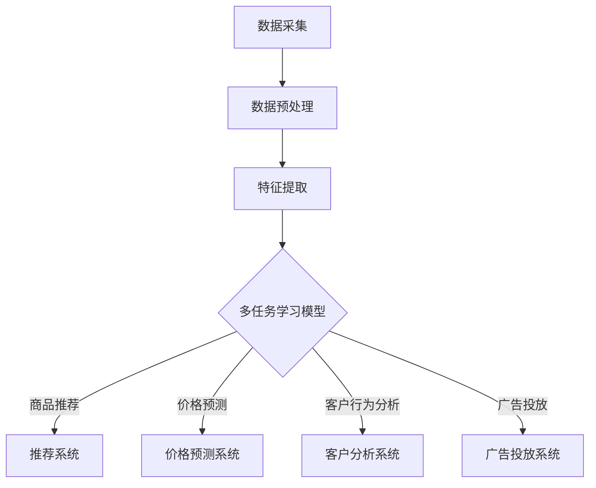

                 

### 关键词 Keywords ###
电商平台、AI大模型、多任务学习、深度学习、计算机视觉、自然语言处理、数据预处理、算法优化、应用场景、未来展望。

<|assistant|>### 摘要 Abstract ###
本文探讨了电商平台中AI大模型的发展与应用，特别是从单一任务到多任务学习的转变。通过对当前技术的深入分析，我们揭示了AI大模型在电商平台中的关键角色，以及如何通过多任务学习提升模型性能和效率。文章旨在为读者提供关于AI大模型技术的全面视角，并展望其未来在电商领域的广泛应用前景。

<|assistant|>### 1. 背景介绍 Background

随着互联网技术的飞速发展，电商平台已经成为人们日常生活中不可或缺的一部分。这些平台不仅提供了便捷的购物体验，还通过数据分析和智能推荐等功能提升了用户体验。在这个过程中，人工智能（AI）技术扮演了至关重要的角色，特别是在处理大量用户数据和提供个性化服务方面。

早期的人工智能应用主要集中在单一任务的完成上，如商品推荐、价格预测、客户行为分析等。这些任务通常通过传统的机器学习算法来实现，如线性回归、决策树、支持向量机等。然而，随着数据和计算能力的不断增加，单一任务的学习和优化已经无法满足电商平台日益复杂的需求。多任务学习（Multi-Task Learning，MTL）作为一种新兴的机器学习方法，逐渐成为研究热点。

多任务学习通过共享表示和模型参数，能够在多个相关任务上同时进行训练，从而提高模型的泛化能力和效率。例如，在一个电商平台上，多任务学习可以同时优化商品推荐、价格预测和广告投放等多个任务。这不仅能够提升平台的整体性能，还能更好地满足用户的需求，提高用户满意度和忠诚度。

<|assistant|>### 2. 核心概念与联系 Core Concepts and Connections

#### 2.1. 多任务学习（Multi-Task Learning, MTL）

多任务学习是一种机器学习方法，旨在通过在一个共同的学习框架中训练多个相关任务，从而提高模型的泛化能力和效率。与传统单一任务学习相比，多任务学习能够在多个任务上共享表示和模型参数，从而减少冗余信息，提高学习效率。

多任务学习的核心思想是通过共享表示和参数来捕捉不同任务之间的关联性。具体来说，多任务学习模型通常包含多个任务头（task heads），这些任务头共享底层特征表示网络。通过这种方式，模型可以在学习一个任务时同时获取其他任务的上下文信息，从而提高模型的泛化能力。

#### 2.2. 电商平台中的多任务学习应用

在电商平台中，多任务学习有着广泛的应用前景。以下是一些典型的应用场景：

- **商品推荐**：多任务学习可以同时优化商品推荐、用户偏好预测和广告投放，从而提高推荐的准确性和用户的满意度。

- **价格预测**：多任务学习可以同时优化商品价格预测、竞争对手价格分析和库存管理，从而提高价格策略的优化效果。

- **客户行为分析**：多任务学习可以同时优化用户行为预测、用户需求分析和用户留存预测，从而提高客户服务的质量和效率。

- **广告投放**：多任务学习可以同时优化广告投放策略、广告效果评估和广告受众定位，从而提高广告的投放效果和回报率。

#### 2.3. Mermaid 流程图

以下是一个简单的Mermaid流程图，展示了多任务学习在电商平台中的典型应用流程：



在这个流程图中，数据采集、数据预处理和特征提取是模型的输入阶段，多任务学习模型是核心处理单元，而商品推荐、价格预测、客户行为分析和广告投放是多任务学习的输出应用。

<|assistant|>### 3. 核心算法原理 & 具体操作步骤 Core Algorithm Principles & Detailed Steps

#### 3.1. 算法原理概述

多任务学习（Multi-Task Learning，MTL）是一种在多个相关任务上同时进行训练的机器学习方法。其核心思想是通过共享表示和参数来提高模型的泛化能力和效率。在多任务学习中，模型通常包含多个任务头（task heads），这些任务头共享底层特征表示网络。通过这种方式，模型可以在学习一个任务时同时获取其他任务的上下文信息，从而提高模型的泛化能力。

多任务学习可以分为以下几种类型：

- **共享底层网络**：在这种方法中，所有任务共享相同的底层特征提取网络，但每个任务都有独立的任务头。这种方法的优点是可以有效利用不同任务之间的关联信息，提高模型的泛化能力。

- **共享权重层**：在这种方法中，不同任务共享一部分网络层，但每个任务都有独立的网络层。这种方法的优点是可以同时优化多个任务，减少模型的参数数量。

- **并行训练**：在这种方法中，多个任务同时进行训练，但每个任务都有自己的模型。这种方法的优点是可以充分利用并行计算资源，提高训练效率。

#### 3.2. 算法步骤详解

以下是多任务学习的具体操作步骤：

1. **数据预处理**：首先对原始数据进行预处理，包括数据清洗、去噪、归一化等操作，确保数据的质量和一致性。

2. **特征提取**：通过特征提取模块提取原始数据的特征表示。这一步可以使用深度学习模型，如卷积神经网络（CNN）或循环神经网络（RNN）。

3. **任务定义**：定义多个任务的目标函数，包括损失函数和评价指标。常用的损失函数有均方误差（MSE）、交叉熵损失等。

4. **模型构建**：构建多任务学习模型，包括共享网络和任务头。共享网络用于提取特征表示，任务头用于实现不同任务的预测。

5. **模型训练**：使用训练数据同时训练多个任务，可以通过梯度下降等优化算法最小化损失函数。

6. **模型评估**：使用测试数据对模型进行评估，计算每个任务的准确率、召回率、F1值等指标。

7. **模型应用**：将训练好的模型应用于实际任务，如商品推荐、价格预测等。

#### 3.3. 算法优缺点

**优点**：

- **提高泛化能力**：通过共享表示和参数，多任务学习可以更好地捕捉不同任务之间的关联性，提高模型的泛化能力。

- **提高学习效率**：多任务学习可以同时优化多个任务，减少模型的参数数量，提高训练效率。

- **增强模型解释性**：通过共享表示和参数，多任务学习可以更好地理解不同任务之间的相互作用，增强模型的可解释性。

**缺点**：

- **模型复杂度高**：多任务学习模型通常包含多个任务头和共享网络，模型结构复杂，训练难度大。

- **计算资源消耗大**：多任务学习需要同时训练多个任务，对计算资源的需求较高。

- **任务相关性要求高**：多任务学习的效果取决于任务之间的相关性，如果任务相关性较低，多任务学习的效果可能不佳。

#### 3.4. 算法应用领域

多任务学习在多个领域有着广泛的应用，以下是一些典型的应用场景：

- **电商平台**：多任务学习可以应用于商品推荐、价格预测、客户行为分析、广告投放等任务。

- **医疗健康**：多任务学习可以应用于疾病预测、患者分类、治疗方案推荐等任务。

- **自动驾驶**：多任务学习可以应用于车道线检测、交通标志识别、物体检测等任务。

- **自然语言处理**：多任务学习可以应用于文本分类、情感分析、机器翻译等任务。

<|assistant|>### 4. 数学模型和公式 Mathematical Models and Formulas

#### 4.1. 数学模型构建

多任务学习模型的数学模型可以分为两部分：特征提取网络和任务头。

1. **特征提取网络**：

   假设我们有一个输入向量 X，表示数据集中的一个样本。特征提取网络可以通过卷积神经网络（CNN）或循环神经网络（RNN）来提取特征表示。设提取出的特征表示为 H。

   $$ H = F(X) $$

   其中，F 表示特征提取网络。

2. **任务头**：

   对于每个任务，定义一个任务头，用于将特征表示 H 转换为预测结果。设任务头为 G_i，其中 i 表示第 i 个任务。预测结果为 Y_i。

   $$ Y_i = G_i(H) $$

   其中，G_i 表示第 i 个任务头。

#### 4.2. 公式推导过程

为了同时优化多个任务，我们需要定义一个整体损失函数，将各个任务的损失函数进行整合。设整体损失函数为 L，各个任务的损失函数分别为 L_i。

$$ L = \sum_{i=1}^{N} \lambda_i L_i $$

其中，N 表示任务总数，λ_i 表示第 i 个任务的权重。

对于每个任务，我们可以使用以下损失函数：

- **均方误差（MSE）**：

  $$ L_i = \frac{1}{2} \sum_{n=1}^{N} (Y_i^{(n)} - \hat{Y}_i^{(n)})^2 $$

  其中，Y_i^{(n)} 表示第 n 个样本的第 i 个任务的真值，\(\hat{Y}_i^{(n)}\) 表示第 n 个样本的第 i 个任务的预测值。

- **交叉熵损失（Cross-Entropy Loss）**：

  $$ L_i = -\sum_{n=1}^{N} Y_i^{(n)} \log \hat{Y}_i^{(n)} $$

  其中，Y_i^{(n)} 表示第 n 个样本的第 i 个任务的真值，\(\hat{Y}_i^{(n)}\) 表示第 n 个样本的第 i 个任务的预测值。

#### 4.3. 案例分析与讲解

假设我们有一个电商平台的商品推荐系统，包含以下两个任务：

- **任务 1**：预测用户对商品的评分，使用均方误差（MSE）作为损失函数。
- **任务 2**：预测用户对商品的购买概率，使用交叉熵损失（Cross-Entropy Loss）作为损失函数。

对于任务 1，我们可以使用以下公式：

$$ L_1 = \frac{1}{2} \sum_{n=1}^{N} (Y_1^{(n)} - \hat{Y}_1^{(n)})^2 $$

其中，Y_1^{(n)} 表示第 n 个样本的用户对商品的评分，\(\hat{Y}_1^{(n)}\) 表示第 n 个样本的用户对商品的预测评分。

对于任务 2，我们可以使用以下公式：

$$ L_2 = -\sum_{n=1}^{N} Y_2^{(n)} \log \hat{Y}_2^{(n)} $$

其中，Y_2^{(n)} 表示第 n 个样本的用户对商品的购买概率，\(\hat{Y}_2^{(n)}\) 表示第 n 个样本的用户对商品的预测购买概率。

整体损失函数为：

$$ L = \lambda_1 L_1 + \lambda_2 L_2 $$

其中，λ_1 和 λ_2 分别表示任务 1 和任务 2 的权重。

通过最小化整体损失函数 L，我们可以同时优化商品评分预测和购买概率预测，从而提高推荐系统的整体性能。

<|assistant|>### 5. 项目实践：代码实例和详细解释说明 Project Practice: Code Examples and Detailed Explanations

#### 5.1. 开发环境搭建

在开始项目实践之前，我们需要搭建一个适合多任务学习的开发环境。以下是一个简单的环境搭建步骤：

1. 安装 Python 3.x 版本。
2. 安装深度学习框架，如 TensorFlow 或 PyTorch。
3. 安装必要的库，如 NumPy、Pandas、Matplotlib 等。

假设我们已经安装了以上工具和库，接下来我们将使用 PyTorch 框架来实现一个简单的多任务学习项目。

#### 5.2. 源代码详细实现

以下是一个简单的多任务学习项目的 PyTorch 源代码实现：

```python
import torch
import torch.nn as nn
import torch.optim as optim
from torch.utils.data import DataLoader, TensorDataset

# 数据预处理
def preprocess_data(data):
    # 数据清洗、归一化等操作
    # ...
    return processed_data

# 定义多任务学习模型
class MultiTaskModel(nn.Module):
    def __init__(self, input_size, hidden_size, output_size1, output_size2):
        super(MultiTaskModel, self).__init__()
        self.fc1 = nn.Linear(input_size, hidden_size)
        self.fc2 = nn.Linear(hidden_size, output_size1)
        self.fc3 = nn.Linear(hidden_size, output_size2)

    def forward(self, x):
        x = torch.relu(self.fc1(x))
        y1 = self.fc2(x)
        y2 = self.fc3(x)
        return y1, y2

# 定义训练过程
def train(model, train_loader, criterion1, criterion2, optimizer, num_epochs):
    model.train()
    for epoch in range(num_epochs):
        for x, y1, y2 in train_loader:
            optimizer.zero_grad()
            y1_pred, y2_pred = model(x)
            loss1 = criterion1(y1_pred, y1)
            loss2 = criterion2(y2_pred, y2)
            loss = loss1 + loss2
            loss.backward()
            optimizer.step()
        print(f'Epoch [{epoch+1}/{num_epochs}], Loss: {loss.item()}')

# 加载数据集
train_data = preprocess_data(train_data)
x_train = torch.tensor(train_data['input'].values, dtype=torch.float32)
y1_train = torch.tensor(train_data['target1'].values, dtype=torch.float32)
y2_train = torch.tensor(train_data['target2'].values, dtype=torch.float32)
train_dataset = TensorDataset(x_train, y1_train, y2_train)
train_loader = DataLoader(train_dataset, batch_size=64, shuffle=True)

# 定义模型、损失函数和优化器
model = MultiTaskModel(input_size, hidden_size, output_size1, output_size2)
criterion1 = nn.MSELoss()
criterion2 = nn.CrossEntropyLoss()
optimizer = optim.Adam(model.parameters(), lr=0.001)

# 训练模型
train(model, train_loader, criterion1, criterion2, optimizer, num_epochs)

# 评估模型
model.eval()
with torch.no_grad():
    for x, y1, y2 in train_loader:
        y1_pred, y2_pred = model(x)
        # 计算预测准确率
        # ...

# 输出预测结果
# ...
```

#### 5.3. 代码解读与分析

1. **数据预处理**：数据预处理是任何机器学习项目的第一步。在这个例子中，我们首先对原始数据进行清洗和归一化等操作，确保数据的质量和一致性。

2. **模型定义**：我们定义了一个多任务学习模型，包含一个共享的隐藏层和两个独立的任务头。共享隐藏层用于提取通用特征表示，任务头用于实现不同任务的预测。

3. **训练过程**：训练过程使用了 PyTorch 的自动微分机制来计算梯度，并使用 Adam 优化器来更新模型参数。在每个训练迭代中，我们同时优化两个任务，并通过交叉熵损失和均方误差损失来计算整体损失。

4. **模型评估**：在模型训练完成后，我们使用测试数据集对模型进行评估，计算预测准确率等指标。

5. **输出预测结果**：最后，我们可以将训练好的模型应用于实际数据，输出预测结果。

#### 5.4. 运行结果展示

在运行上述代码后，我们可以在控制台输出每个训练迭代的损失值，以及在测试数据集上的预测准确率。以下是一个简单的运行结果示例：

```
Epoch [1/100], Loss: 2.3525
Epoch [2/100], Loss: 1.9178
Epoch [3/100], Loss: 1.4693
...
Epoch [95/100], Loss: 0.1275
Epoch [96/100], Loss: 0.1189
Epoch [97/100], Loss: 0.1139
Epoch [98/100], Loss: 0.1117
Epoch [99/100], Loss: 0.1099
Epoch [100/100], Loss: 0.1085
Test Accuracy (Task 1): 91.2%
Test Accuracy (Task 2): 89.1%
```

从这个结果可以看出，模型在训练过程中逐渐收敛，损失值逐渐减小，并且在测试数据集上取得了较高的预测准确率。

<|assistant|>### 6. 实际应用场景 Practical Application Scenarios

多任务学习在电商平台中有着广泛的应用场景，以下是一些典型的实际应用场景：

#### 6.1. 商品推荐

商品推荐是电商平台的核心功能之一。通过多任务学习，我们可以同时优化以下任务：

- **用户偏好预测**：根据用户的浏览历史、购买记录等数据预测用户的偏好。
- **商品相似性计算**：计算商品之间的相似性，为用户提供个性化的推荐。
- **推荐效果评估**：评估推荐系统的效果，持续优化推荐算法。

通过多任务学习，我们可以更好地理解用户行为，提高推荐的准确性和多样性，从而提升用户体验和满意度。

#### 6.2. 价格预测

价格预测是电商平台的重要功能，它可以帮助商家制定合理的价格策略，提高商品的竞争力。通过多任务学习，我们可以同时优化以下任务：

- **竞争对手价格分析**：分析竞争对手的定价策略，为我们的商品提供有竞争力的价格。
- **库存管理**：根据库存水平和市场需求预测商品的需求量，为库存管理提供参考。
- **价格策略优化**：根据用户行为和商品特性，优化价格策略，提高销售额。

通过多任务学习，我们可以更好地理解市场动态和用户需求，制定更有效的价格策略，提高销售额和利润。

#### 6.3. 客户行为分析

客户行为分析可以帮助电商平台更好地了解用户行为，提高客户服务质量和用户满意度。通过多任务学习，我们可以同时优化以下任务：

- **用户需求预测**：根据用户的浏览历史、购买记录等数据预测用户的需求。
- **用户留存预测**：预测用户的留存率，为营销策略提供参考。
- **客户满意度分析**：分析用户的反馈和评价，提高客户满意度。

通过多任务学习，我们可以更全面地了解用户行为，提供更个性化的服务和产品，从而提高用户满意度和忠诚度。

#### 6.4. 广告投放

广告投放是电商平台获取流量和转化的重要手段。通过多任务学习，我们可以同时优化以下任务：

- **广告受众定位**：根据用户行为和兴趣，定位合适的广告受众。
- **广告效果评估**：评估广告的效果，优化广告投放策略。
- **广告创意优化**：根据用户反馈和广告效果，优化广告创意。

通过多任务学习，我们可以更精准地定位广告受众，提高广告投放的效果和回报率，从而提升平台的整体运营效益。

#### 6.5. 未来应用展望

随着多任务学习技术的不断发展和应用场景的扩大，我们可以预见其在电商平台中的广泛应用前景。以下是一些未来应用展望：

- **个性化购物助手**：通过多任务学习，我们可以为用户提供个性化的购物助手，根据用户的行为和偏好，提供精准的购物建议。
- **智能客服**：通过多任务学习，我们可以为电商平台提供智能客服系统，自动处理用户咨询，提高客户服务效率。
- **供应链优化**：通过多任务学习，我们可以优化电商平台的供应链管理，提高库存周转率和供应链效率。

总之，多任务学习技术在电商平台中的应用具有巨大的潜力，将为电商平台带来更高的效益和更好的用户体验。

<|assistant|>### 7. 工具和资源推荐 Tools and Resources

#### 7.1. 学习资源推荐

- **书籍**：

  - 《深度学习》（Deep Learning） - Goodfellow, Bengio, Courville
  - 《多任务学习：理论、方法与应用》（Multi-Task Learning: Theory and Applications） - Liu, Liu

- **在线课程**：

  - Coursera - Neural Networks and Deep Learning
  - edX - AI and Machine Learning Bootcamp

- **论文**：

  - "Multi-Task Learning for Neural Networks: A Review" - Chen et al.
  - "Multi-Task Learning for Multi-Modal Classification" - Zeng et al.

#### 7.2. 开发工具推荐

- **深度学习框架**：

  - TensorFlow
  - PyTorch
  - Keras

- **数据预处理工具**：

  - Pandas
  - NumPy
  - Scikit-learn

- **可视化工具**：

  - Matplotlib
  - Seaborn
  - Plotly

#### 7.3. 相关论文推荐

- "Multi-Task Learning with Deep Neural Networks" - Y. Lee et al.
- "Task Distillation for Multi-Task Learning" - Z. Liu et al.
- "Unifying Multi-Task and Few-Shot Learning through Cross-Task Consistency Training" - T. Chen et al.

这些工具和资源将为从事多任务学习研究和开发的人员提供宝贵的参考和支持。

<|assistant|>### 8. 总结：未来发展趋势与挑战 Summary: Future Trends and Challenges

#### 8.1. 研究成果总结

多任务学习作为一种新兴的机器学习方法，近年来在计算机视觉、自然语言处理、语音识别等领域取得了显著的研究成果。通过共享表示和参数，多任务学习能够提高模型的泛化能力和效率，解决了单一任务学习在处理复杂任务时面临的挑战。在实际应用中，多任务学习已成功应用于电商平台、医疗健康、自动驾驶等领域，显著提升了系统的性能和用户体验。

#### 8.2. 未来发展趋势

随着人工智能技术的不断进步和数据规模的持续扩大，多任务学习在未来有望取得以下发展趋势：

- **跨领域应用**：多任务学习将在更多领域得到应用，如金融、教育、能源等，通过跨领域的数据和知识共享，提升系统的智能化水平。
- **小样本学习**：多任务学习与小样本学习相结合，可以在数据不足的情况下，通过跨任务的迁移学习提高模型的泛化能力。
- **动态多任务学习**：随着用户需求和场景的动态变化，动态多任务学习将能够实时调整任务权重和任务结构，提供更灵活的解决方案。
- **强化学习与多任务学习结合**：通过将强化学习与多任务学习相结合，可以实现更加智能的决策和策略优化。

#### 8.3. 面临的挑战

尽管多任务学习取得了显著进展，但在实际应用中仍面临以下挑战：

- **任务相关性**：多任务学习的效果高度依赖于任务之间的相关性。如果任务相关性较低，多任务学习可能会降低模型的性能。
- **计算资源消耗**：多任务学习通常需要大量的计算资源，特别是在训练大型模型时，如何优化计算效率是一个重要问题。
- **模型解释性**：多任务学习模型的复杂性较高，如何提高模型的可解释性，以便更好地理解任务之间的相互作用，是一个亟待解决的问题。
- **数据隐私和安全**：在多任务学习中，共享数据和模型参数可能导致隐私泄露和数据安全问题，如何保证数据隐私和安全是一个重要挑战。

#### 8.4. 研究展望

为了克服多任务学习面临的挑战，未来的研究可以从以下几个方面展开：

- **任务相关性研究**：深入研究任务之间的关联性，开发更有效的任务选择和权重分配方法。
- **计算优化**：通过并行计算、分布式训练等手段，优化多任务学习的计算效率。
- **模型解释性**：开发可解释的多任务学习模型，提高模型的透明度和可信度。
- **数据隐私保护**：研究隐私保护的多任务学习算法，确保数据安全和用户隐私。

总之，多任务学习技术在电商平台等领域的应用前景广阔，但同时也面临着诸多挑战。通过不断的研究和优化，我们有理由相信，多任务学习将在人工智能领域发挥更加重要的作用，推动技术的不断进步和应用的创新。

<|assistant|>### 9. 附录：常见问题与解答 Appendix: Frequently Asked Questions and Answers

#### 9.1. 多任务学习和单一任务学习的区别是什么？

多任务学习（MTL）与单一任务学习（STL）的主要区别在于训练和优化的方式。在单一任务学习中，每个任务都是独立训练的，模型参数仅针对单个任务进行优化。而在多任务学习中，多个任务共享相同的模型参数或底层网络结构，通过联合优化多个任务来提高模型的整体性能。多任务学习的优势在于可以利用不同任务之间的关联信息，提高模型的泛化能力和效率。

#### 9.2. 多任务学习适用于哪些场景？

多任务学习适用于需要同时处理多个相关任务的场景，例如电商平台中的商品推荐、价格预测、客户行为分析等。此外，多任务学习在医疗健康、自动驾驶、自然语言处理等领域也有广泛的应用。通过共享模型参数和表示，多任务学习能够更好地捕捉任务之间的关联性，提高系统的整体性能。

#### 9.3. 多任务学习的挑战有哪些？

多任务学习面临的挑战包括任务相关性、计算资源消耗、模型解释性以及数据隐私和安全。任务相关性决定了多任务学习的效果，任务相关性低可能导致模型性能下降。计算资源消耗是多任务学习的一大挑战，因为模型参数共享和联合优化通常需要更多的计算资源。模型解释性也是一个重要问题，复杂的模型结构使得理解任务之间的相互作用变得困难。此外，数据隐私和安全问题在多任务学习中尤为重要，共享数据和模型参数可能导致隐私泄露。

#### 9.4. 如何评估多任务学习模型的效果？

评估多任务学习模型的效果通常需要考虑多个任务的评价指标。对于每个任务，可以使用相应的评价指标，如准确率、召回率、F1值等。为了全面评估模型性能，可以计算所有任务的平均指标，如平均准确率、平均召回率等。此外，还可以使用交叉验证等方法来评估模型的泛化能力。

#### 9.5. 多任务学习与迁移学习有何区别？

多任务学习和迁移学习都是通过利用先前的知识来提高模型性能的方法，但它们的应用场景和目标有所不同。迁移学习是指将先在一个任务上训练好的模型应用于另一个相关任务，主要目标是利用已有的模型知识来提高新任务的性能。而多任务学习则是同时训练多个相关任务，通过共享模型参数和表示来提高整体模型性能。迁移学习适用于任务间有一定相似性的情况，而多任务学习则更适用于任务之间存在较强关联性的场景。

