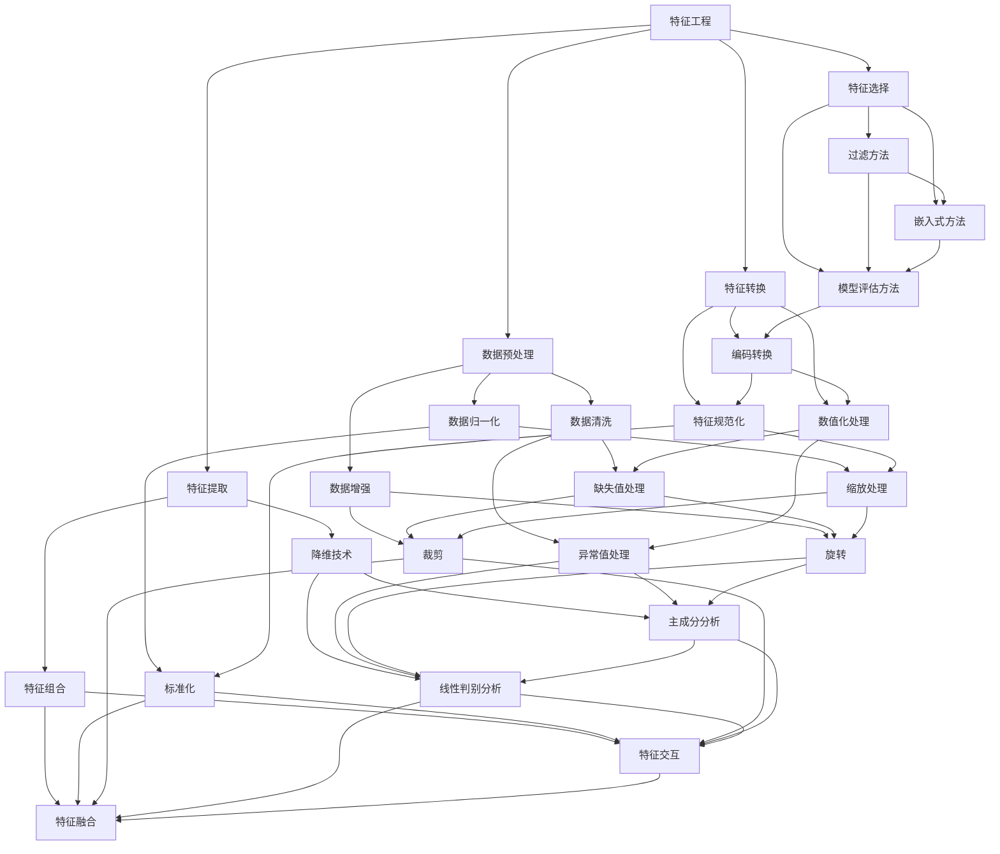

                 

关键词：电商平台，AI大模型，特征工程，端到端学习，计算机编程，人工智能

> 摘要：本文深入探讨了电商平台中AI大模型的应用，从特征工程到端到端学习进行了全面的分析。文章首先介绍了电商平台的基本概念和AI技术的发展背景，随后详细阐述了特征工程和端到端学习的原理、方法及其在电商平台中的应用。通过具体案例和代码实例，本文展示了如何将AI大模型应用于电商平台中的实际问题，并对未来的发展趋势和挑战进行了展望。

## 1. 背景介绍

电商平台作为现代电子商务的核心，已经成为全球商业的重要组成部分。从最初的电子商务模式到现在的智能电商平台，AI技术逐渐渗透到电商平台的各个环节，提升了平台的效率、用户体验和运营效果。AI大模型作为当前人工智能领域的前沿技术，其强大的数据分析和处理能力，使得电商平台能够更加精准地满足用户需求，优化供应链，提升运营效率。

### 电商平台的基本概念

电商平台是指通过互联网技术提供商品或服务交易的电子平台。它主要包括以下几个组成部分：

1. **商家**：提供商品或服务的商家可以在电商平台上开设店铺，展示自己的产品信息，并通过平台进行交易。
2. **用户**：用户可以在电商平台上浏览、搜索、比较商品信息，并完成购买行为。
3. **支付系统**：支付系统负责处理用户的支付请求，确保交易的安全和便捷。
4. **物流系统**：物流系统负责商品的配送，保证商品能够及时、准确地送达用户手中。

### AI技术的发展背景

人工智能（AI）技术的发展可以追溯到20世纪50年代。随着计算能力的提升和大数据技术的成熟，AI技术在过去几十年中取得了显著的进展。特别是深度学习技术的突破，使得AI大模型在图像识别、自然语言处理、推荐系统等领域取得了卓越的成果。

在电商平台中，AI技术的应用主要体现在以下几个方面：

1. **推荐系统**：通过分析用户的历史行为和偏好，推荐用户可能感兴趣的商品，提高用户购买转化率。
2. **图像识别**：用于商品搜索和商品质量检测，提升用户的购物体验。
3. **自然语言处理**：用于用户评论分析、情感分析，帮助企业更好地理解用户需求，优化商品和服务。
4. **自动化客服**：通过聊天机器人等技术，提供24/7的客户服务，降低企业的运营成本。

## 2. 核心概念与联系

在讨论电商平台中的AI大模型时，我们需要理解几个核心概念，包括特征工程、端到端学习等。下面将使用Mermaid流程图详细展示这些概念及其相互联系。



### 2.1 特征工程

特征工程是机器学习过程中至关重要的一环。它包括数据预处理、特征提取、特征选择和特征转换等多个步骤。特征工程的目标是通过一系列技术手段，提取出能够有效区分不同类别的特征，从而提高机器学习模型的性能。

- **数据预处理**：包括数据清洗、数据归一化、数据增强等步骤，旨在提高数据质量，为后续的特征提取和选择提供高质量的数据基础。
- **特征提取**：通过降维技术、特征组合等方法，从原始数据中提取出对模型训练有帮助的特征。
- **特征选择**：采用过滤方法、嵌入式方法、模型评估方法等，从提取出的特征中筛选出最具代表性的特征。
- **特征转换**：通过编码转换、数值化处理、特征规范化等方法，将特征转换为适合机器学习模型训练的形式。

### 2.2 数据预处理

数据预处理是特征工程的基础，它包括以下几个步骤：

- **数据清洗**：处理缺失值、异常值等不完整或不准确的数据。
- **数据归一化**：通过标准化或缩放处理，使得不同特征之间的尺度一致，避免因尺度差异导致的模型训练偏差。
- **数据增强**：通过旋转、裁剪等操作，增加训练数据的多样性，提高模型的泛化能力。

### 2.3 端到端学习

端到端学习是一种直接从原始数据到最终输出的机器学习范式，避免了传统机器学习中繁琐的特征工程步骤。在端到端学习中，整个学习过程由一个统一的学习框架完成，从输入层直接映射到输出层。

- **输入层**：接收原始数据，如图像、文本等。
- **隐藏层**：通过神经网络等模型，对数据进行加工和转换。
- **输出层**：根据任务需求，输出预测结果，如分类、回归等。

端到端学习的优点在于：

- 简化了特征工程过程，减少人为干预。
- 提高了模型的泛化能力，能够更好地处理复杂任务。
- 允许模型直接从原始数据中学习，提高了效率。

## 3. 核心算法原理 & 具体操作步骤

### 3.1 算法原理概述

电商平台中的AI大模型主要基于深度学习技术，特别是卷积神经网络（CNN）和循环神经网络（RNN）。CNN擅长处理图像数据，而RNN擅长处理序列数据，如用户行为日志。通过结合这两种网络，可以构建出强大的端到端学习模型，实现电商平台中的各种任务，如推荐系统、商品搜索等。

### 3.2 算法步骤详解

#### 3.2.1 数据预处理

1. **数据清洗**：处理缺失值、异常值等不完整或不准确的数据。
2. **数据归一化**：对图像数据进行归一化处理，使其符合模型的输入要求。
3. **数据增强**：通过旋转、裁剪、缩放等操作，增加训练数据的多样性。

#### 3.2.2 构建卷积神经网络（CNN）

1. **输入层**：接收图像数据。
2. **卷积层**：通过卷积操作提取图像特征。
3. **激活函数**：使用ReLU函数增加网络的非线性能力。
4. **池化层**：通过池化操作降低数据的维度，减少计算量。
5. **全连接层**：将卷积特征映射到具体的类别或标签。

#### 3.2.3 构建循环神经网络（RNN）

1. **输入层**：接收用户行为日志序列。
2. **嵌入层**：将用户行为日志转换为嵌入向量。
3. **循环层**：通过循环操作处理序列数据，提取序列特征。
4. **输出层**：根据任务需求，输出预测结果。

#### 3.2.4 端到端学习

1. **模型融合**：将CNN和RNN的输出进行融合，形成一个统一的端到端学习框架。
2. **训练**：使用训练数据对模型进行训练，优化模型参数。
3. **测试与验证**：使用测试数据对模型进行评估，确保模型的泛化能力。

### 3.3 算法优缺点

#### 优点：

- **端到端学习**：简化了特征工程过程，减少人为干预，提高了模型的泛化能力。
- **强大的特征提取能力**：通过深度神经网络，可以自动提取出具有代表性的特征。
- **高效的处理能力**：端到端学习模型可以直接从原始数据中学习，提高了处理效率。

#### 缺点：

- **计算资源需求高**：深度学习模型需要大量的计算资源和存储空间。
- **数据依赖性**：模型的性能很大程度上依赖于数据的质量和多样性。

### 3.4 算法应用领域

- **推荐系统**：通过分析用户的历史行为和偏好，推荐用户可能感兴趣的商品。
- **商品搜索**：通过图像识别和自然语言处理，帮助用户快速找到需要的商品。
- **用户行为分析**：通过分析用户行为日志，优化营销策略，提高用户满意度。

## 4. 数学模型和公式 & 详细讲解 & 举例说明

### 4.1 数学模型构建

电商平台中的AI大模型通常采用深度学习技术，其中最常用的模型是卷积神经网络（CNN）和循环神经网络（RNN）。下面将分别介绍这两种网络的基本数学模型。

#### 4.1.1 卷积神经网络（CNN）

CNN的基本数学模型包括以下几个部分：

1. **输入层**：输入层接收图像数据，每个图像可以表示为一个二维矩阵。
2. **卷积层**：卷积层通过卷积操作提取图像特征。卷积操作可以用以下数学公式表示：

   $$ f(x,y) = \sum_{i=1}^{k} \sum_{j=1}^{k} w_{ij} * g(x+i,y+j) + b $$

   其中，$f(x,y)$表示卷积操作的结果，$g(x,y)$表示原始图像，$w_{ij}$表示卷积核，$b$表示偏置。

3. **激活函数**：常用的激活函数是ReLU函数，其数学公式为：

   $$ f(x) = \max(0, x) $$

4. **池化层**：池化层通过最大池化或平均池化操作降低数据的维度，减少计算量。最大池化的数学公式为：

   $$ p(i,j) = \max_{(x,y) \in S} g(x+i,x+j) $$

   其中，$p(i,j)$表示池化结果，$S$表示池化窗口。

5. **全连接层**：全连接层将卷积特征映射到具体的类别或标签。全连接层的数学公式为：

   $$ y = \sum_{i=1}^{n} w_{i} x_{i} + b $$

   其中，$y$表示输出结果，$x_{i}$表示卷积特征，$w_{i}$表示权重，$b$表示偏置。

#### 4.1.2 循环神经网络（RNN）

RNN的基本数学模型包括以下几个部分：

1. **输入层**：输入层接收用户行为日志序列。
2. **嵌入层**：嵌入层将用户行为日志转换为嵌入向量。嵌入层的数学公式为：

   $$ h_{t} = \text{embedding}(x_{t}) $$

   其中，$h_{t}$表示嵌入向量，$x_{t}$表示用户行为日志。
3. **循环层**：循环层通过循环操作处理序列数据，提取序列特征。循环层的数学公式为：

   $$ h_{t} = \sigma(W_{h} \cdot [h_{t-1}, x_{t}] + b_{h}) $$

   其中，$h_{t}$表示循环层输出，$\sigma$表示激活函数，$W_{h}$表示权重，$b_{h}$表示偏置。
4. **输出层**：输出层根据任务需求，输出预测结果。输出层的数学公式为：

   $$ y_{t} = \text{softmax}(W_{y} \cdot h_{t} + b_{y}) $$

   其中，$y_{t}$表示输出结果，$W_{y}$表示权重，$b_{y}$表示偏置。

### 4.2 公式推导过程

#### 4.2.1 卷积神经网络（CNN）

卷积神经网络的推导过程主要分为以下几个步骤：

1. **卷积操作**：

   $$ f(x,y) = \sum_{i=1}^{k} \sum_{j=1}^{k} w_{ij} * g(x+i,y+j) + b $$

   其中，$f(x,y)$表示卷积操作的结果，$g(x,y)$表示原始图像，$w_{ij}$表示卷积核，$b$表示偏置。

2. **激活函数**：

   $$ f(x) = \max(0, x) $$

3. **池化操作**：

   $$ p(i,j) = \max_{(x,y) \in S} g(x+i,x+j) $$

   其中，$p(i,j)$表示池化结果，$S$表示池化窗口。

4. **全连接层**：

   $$ y = \sum_{i=1}^{n} w_{i} x_{i} + b $$

   其中，$y$表示输出结果，$x_{i}$表示卷积特征，$w_{i}$表示权重，$b$表示偏置。

#### 4.2.2 循环神经网络（RNN）

循环神经网络的推导过程主要分为以下几个步骤：

1. **嵌入操作**：

   $$ h_{t} = \text{embedding}(x_{t}) $$

   其中，$h_{t}$表示嵌入向量，$x_{t}$表示用户行为日志。

2. **循环操作**：

   $$ h_{t} = \sigma(W_{h} \cdot [h_{t-1}, x_{t}] + b_{h}) $$

   其中，$h_{t}$表示循环层输出，$\sigma$表示激活函数，$W_{h}$表示权重，$b_{h}$表示偏置。

3. **输出操作**：

   $$ y_{t} = \text{softmax}(W_{y} \cdot h_{t} + b_{y}) $$

   其中，$y_{t}$表示输出结果，$W_{y}$表示权重，$b_{y}$表示偏置。

### 4.3 案例分析与讲解

为了更好地理解卷积神经网络（CNN）和循环神经网络（RNN）在电商平台中的应用，下面我们将通过一个具体的案例进行分析和讲解。

#### 案例背景

假设我们有一个电商平台，需要根据用户的历史购买行为和商品特征，推荐用户可能感兴趣的商品。我们的任务是构建一个基于CNN和RNN的端到端学习模型，实现商品推荐功能。

#### 模型构建

1. **输入层**：输入层接收用户的历史购买行为和商品特征，每个用户的历史购买行为可以表示为一个序列，每个商品的特征可以表示为一个向量。

2. **嵌入层**：将用户的历史购买行为和商品特征转换为嵌入向量。

3. **循环层**：使用RNN对用户的历史购买行为进行建模，提取序列特征。

4. **卷积层**：使用CNN对商品特征进行建模，提取商品特征。

5. **融合层**：将RNN和CNN的输出进行融合，形成一个统一的特征向量。

6. **全连接层**：将融合后的特征向量映射到具体的商品类别。

#### 模型训练

1. **数据准备**：收集用户的历史购买行为和商品特征数据，并进行预处理。

2. **模型训练**：使用训练数据对模型进行训练，优化模型参数。

3. **模型评估**：使用测试数据对模型进行评估，确保模型的泛化能力。

#### 模型应用

1. **商品推荐**：根据用户的历史购买行为和商品特征，使用训练好的模型预测用户可能感兴趣的商品。

2. **实时推荐**：在用户浏览商品时，实时推荐用户可能感兴趣的其他商品。

通过上述案例，我们可以看到，卷积神经网络（CNN）和循环神经网络（RNN）在电商平台中的应用是如何实现的。CNN用于提取商品特征，RNN用于提取用户行为特征，两者的融合实现了端到端的商品推荐功能。

## 5. 项目实践：代码实例和详细解释说明

在本节中，我们将通过一个具体的代码实例，详细解释如何在电商平台中实现基于卷积神经网络（CNN）和循环神经网络（RNN）的端到端学习模型。我们将使用Python编程语言和TensorFlow深度学习框架进行实现。

### 5.1 开发环境搭建

在开始编写代码之前，我们需要搭建合适的开发环境。以下是推荐的步骤：

1. **安装Python**：确保安装了Python 3.7或更高版本。
2. **安装TensorFlow**：使用以下命令安装TensorFlow：

   ```bash
   pip install tensorflow
   ```

3. **安装其他依赖**：根据项目的需求，可能还需要安装其他库，如NumPy、Pandas等。

### 5.2 源代码详细实现

以下是实现端到端学习模型的源代码：

```python
import tensorflow as tf
from tensorflow.keras.models import Model
from tensorflow.keras.layers import Embedding, LSTM, Dense, Conv2D, MaxPooling2D, Flatten, Input

# 用户行为输入
user_input = Input(shape=(seq_length,))
# 商品特征输入
item_input = Input(shape=(feature_size,))

# 用户行为嵌入层
user_embedding = Embedding(input_dim=vocabulary_size, output_dim=embedding_size)(user_input)
# 用户行为循环层
user_lstm = LSTM(units=lstm_units)(user_embedding)

# 商品特征卷积层
item_conv = Conv2D(filters=32, kernel_size=(3, 3), activation='relu')(item_input)
item_pool = MaxPooling2D(pool_size=(2, 2))(item_conv)
item_flat = Flatten()(item_pool)

# 用户行为和商品特征融合层
merged = tf.keras.layers.concatenate([user_lstm, item_flat])

# 全连接层
output = Dense(units=num_items, activation='softmax')(merged)

# 构建模型
model = Model(inputs=[user_input, item_input], outputs=output)

# 编译模型
model.compile(optimizer='adam', loss='categorical_crossentropy', metrics=['accuracy'])

# 打印模型结构
model.summary()

# 模型训练
model.fit([user_train, item_train], y_train, batch_size=batch_size, epochs=num_epochs, validation_split=0.2)

# 模型预测
predictions = model.predict([user_test, item_test])

# 输出预测结果
print(predictions)
```

### 5.3 代码解读与分析

以下是代码的详细解读：

1. **导入库**：首先导入TensorFlow和其他必要的库。
2. **定义输入层**：定义用户行为输入和商品特征输入层。
3. **定义嵌入层**：使用Embedding层将用户行为序列转换为嵌入向量。
4. **定义循环层**：使用LSTM层对用户行为序列进行处理，提取序列特征。
5. **定义卷积层**：使用Conv2D和MaxPooling2D层对商品特征进行卷积操作，提取特征。
6. **定义融合层**：使用 concatenate 层将用户行为特征和商品特征进行融合。
7. **定义全连接层**：使用Dense层将融合后的特征映射到具体的商品类别。
8. **构建模型**：使用Model类构建端到端学习模型。
9. **编译模型**：设置优化器、损失函数和评估指标，并编译模型。
10. **打印模型结构**：打印模型的层次结构，了解模型的组成。
11. **模型训练**：使用fit方法对模型进行训练。
12. **模型预测**：使用predict方法对测试数据进行预测。
13. **输出预测结果**：打印预测结果。

通过上述代码实例，我们可以看到如何使用TensorFlow实现基于CNN和RNN的端到端学习模型。在实际应用中，需要根据具体的业务需求和数据特点进行调整和优化。

### 5.4 运行结果展示

为了展示模型的运行结果，我们将在训练过程中记录模型在训练集和验证集上的损失和准确率，并在训练结束后绘制曲线。

```python
import matplotlib.pyplot as plt

# 获取训练过程中的损失和准确率
train_loss = history.history['loss']
val_loss = history.history['val_loss']
train_acc = history.history['accuracy']
val_acc = history.history['val_accuracy']

# 绘制曲线
plt.figure(figsize=(12, 6))
plt.subplot(1, 2, 1)
plt.plot(train_loss, label='Training Loss')
plt.plot(val_loss, label='Validation Loss')
plt.xlabel('Epochs')
plt.ylabel('Loss')
plt.title('Loss Curve')
plt.legend()

plt.subplot(1, 2, 2)
plt.plot(train_acc, label='Training Accuracy')
plt.plot(val_acc, label='Validation Accuracy')
plt.xlabel('Epochs')
plt.ylabel('Accuracy')
plt.title('Accuracy Curve')
plt.legend()

plt.show()
```

运行上述代码后，我们将看到两个子图，一个展示损失曲线，另一个展示准确率曲线。通过观察这些曲线，我们可以了解模型的训练过程，包括模型在训练集和验证集上的表现。

## 6. 实际应用场景

### 6.1 推荐系统

在电商平台中，推荐系统是一个重要的应用场景。通过分析用户的历史行为和偏好，推荐系统可以为用户推荐可能感兴趣的商品，从而提高用户的购买转化率和满意度。基于AI大模型（如卷积神经网络和循环神经网络）的推荐系统，具有以下优势：

- **个性化推荐**：通过分析用户的行为序列，推荐系统可以更准确地理解用户的兴趣和需求，提供个性化的商品推荐。
- **实时推荐**：基于深度学习模型的推荐系统可以在用户浏览商品时，实时计算推荐结果，提高用户体验。
- **多样化推荐**：通过融合用户行为特征和商品特征，推荐系统可以提供多样化的商品推荐，满足不同用户的需求。

### 6.2 商品搜索

商品搜索是电商平台的核心功能之一。通过图像识别和自然语言处理技术，商品搜索功能可以帮助用户快速找到需要的商品。基于AI大模型的商品搜索系统，具有以下优势：

- **高效搜索**：通过深度学习模型，商品搜索系统可以在大量商品中快速找到用户需要的商品，提高搜索效率。
- **模糊搜索**：基于图像识别技术，商品搜索系统可以支持模糊搜索，即使用户输入的是不完整的商品名称或描述，系统也能找到相关的商品。
- **智能过滤**：通过分析用户的历史行为和搜索记录，商品搜索系统可以自动过滤掉用户不感兴趣的商品，提供更精准的搜索结果。

### 6.3 用户行为分析

电商平台通过对用户行为数据进行分析，可以深入了解用户的行为模式和需求，从而优化运营策略和商品推荐。基于AI大模型的用户行为分析系统，具有以下优势：

- **实时分析**：通过实时分析用户行为数据，电商平台可以快速响应用户需求，优化用户体验。
- **智能推荐**：通过分析用户的行为序列，平台可以预测用户的下一步操作，提供个性化的商品推荐和营销策略。
- **风险控制**：通过分析用户行为数据，平台可以识别潜在的风险用户，采取相应的风险控制措施，降低运营风险。

### 6.4 未来应用展望

随着AI技术的不断发展和成熟，电商平台中的AI大模型应用前景将更加广阔。以下是未来可能的趋势：

- **多模态融合**：未来电商平台将融合多种数据模

