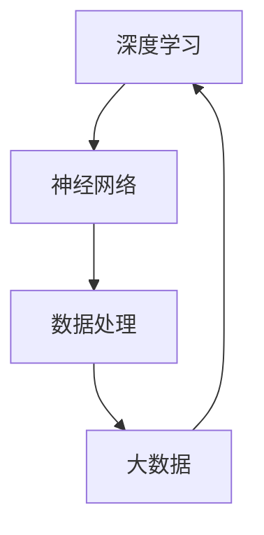

                 

 关键词：
- 电商平台
- AI大模型
- 离线到实时
- 数据处理
- 深度学习
- 个性化推荐
- 实时响应
- 模型优化

> 摘要：
本文将深入探讨电商平台中AI大模型的应用，从离线训练到实时响应的全过程。我们将分析核心概念、算法原理、数学模型，并通过实际项目实例，展示AI大模型在电商平台中的实战效果。同时，还将对未来的发展方向和面临的挑战进行展望。

## 1. 背景介绍

随着互联网的普及和电子商务的快速发展，电商平台已经成为我们日常生活中不可或缺的一部分。从亚马逊、淘宝到京东，各大电商平台都在努力提高用户购物体验，提供更加个性化的服务。而这一切的背后，离不开人工智能技术的支持。特别是AI大模型的应用，为电商平台带来了前所未有的机会和挑战。

AI大模型，即深度学习模型，具有强大的数据分析和处理能力，可以自动从海量数据中提取特征，学习并优化业务逻辑。在电商平台上，AI大模型主要用于推荐系统、价格优化、用户行为分析等关键领域。然而，AI大模型的应用并非一蹴而就，而是需要经历离线训练、模型优化、上线部署等多个环节。本文将详细介绍这一过程。

## 2. 核心概念与联系

在探讨电商平台中的AI大模型之前，我们需要了解以下几个核心概念：

- **深度学习（Deep Learning）**：一种基于人工神经网络的机器学习技术，通过多层次的神经网络结构，实现对复杂数据的高效分析和建模。
- **神经网络（Neural Networks）**：模仿生物神经系统的计算模型，由大量神经元和连接组成，通过不断调整连接权重来优化模型的预测能力。
- **大数据（Big Data）**：指无法用常规软件工具在合理时间内捕捉、管理和处理的数据集合，具有大量、多样、快速、变化等特征。
- **数据处理（Data Processing）**：对数据进行收集、存储、清洗、转换、分析和可视化等操作的过程。

下面是一个Mermaid流程图，展示了这些核心概念之间的联系：



## 3. 核心算法原理 & 具体操作步骤

### 3.1 算法原理概述

AI大模型的核心算法是基于深度学习的神经网络模型。神经网络通过多层非线性变换，将输入数据映射到输出结果。在电商平台上，常见的深度学习算法包括：

- **卷积神经网络（CNN）**：用于图像和视频处理，提取空间特征。
- **循环神经网络（RNN）**：用于序列数据，如用户行为、评论等。
- **Transformer模型**：广泛应用于自然语言处理任务，如机器翻译、文本生成。

### 3.2 算法步骤详解

1. **数据收集**：从电商平台各个渠道收集用户行为数据、商品数据等。
2. **数据预处理**：清洗数据，处理缺失值、异常值，进行数据归一化等。
3. **特征工程**：提取有用特征，如用户兴趣、商品属性等。
4. **模型训练**：使用预处理后的数据训练神经网络模型。
5. **模型评估**：使用验证集评估模型性能，调整模型参数。
6. **模型部署**：将训练好的模型部署到线上环境，进行实时预测。

### 3.3 算法优缺点

**优点**：
- **强大的数据处理能力**：可以处理大规模、多样化的数据。
- **自动特征提取**：无需人工干预，自动从数据中提取特征。
- **泛化能力强**：可以在不同场景下应用，具有很好的适应性。

**缺点**：
- **计算资源消耗大**：训练和推理过程需要大量计算资源。
- **数据依赖性高**：模型的性能很大程度上取决于数据质量。
- **解释性差**：深度学习模型的决策过程较为复杂，难以解释。

### 3.4 算法应用领域

AI大模型在电商平台的应用非常广泛，主要包括：

- **推荐系统**：根据用户行为和兴趣，为用户提供个性化推荐。
- **价格优化**：根据市场数据和用户行为，动态调整商品价格。
- **用户行为分析**：分析用户购买行为，预测用户需求。
- **内容审核**：自动识别和过滤不良内容。

## 4. 数学模型和公式 & 详细讲解 & 举例说明

### 4.1 数学模型构建

在深度学习中，常用的数学模型包括：

- **损失函数（Loss Function）**：衡量模型预测值与真实值之间的差距，如均方误差（MSE）。
- **优化算法（Optimizer）**：用于调整模型参数，使损失函数最小化，如随机梯度下降（SGD）。
- **激活函数（Activation Function）**：用于增加模型的表达能力，如ReLU。

### 4.2 公式推导过程

以均方误差（MSE）为例，其公式推导如下：

$$
MSE = \frac{1}{n}\sum_{i=1}^{n}(y_i - \hat{y}_i)^2
$$

其中，$y_i$为真实值，$\hat{y}_i$为预测值，$n$为样本数量。

### 4.3 案例分析与讲解

假设我们要预测电商平台的用户购买行为，使用卷积神经网络（CNN）进行建模。首先，我们需要收集用户行为数据，如点击、浏览、购买等，并将其转化为图像数据。然后，通过卷积层、池化层、全连接层等构建CNN模型。

在模型训练过程中，我们使用均方误差（MSE）作为损失函数，并采用随机梯度下降（SGD）作为优化算法。通过不断调整模型参数，使得损失函数逐渐减小，达到最优状态。

最后，我们将训练好的模型部署到线上环境，对用户进行实时预测。例如，对于一个新用户，我们首先收集其行为数据，将其转化为图像数据，然后通过CNN模型预测其购买偏好。

## 5. 项目实践：代码实例和详细解释说明

### 5.1 开发环境搭建

首先，我们需要搭建一个适合深度学习开发的Python环境。可以使用Anaconda来安装Python和相关依赖库。

```bash
conda create -n ml_env python=3.8
conda activate ml_env
conda install numpy pytorch torchvision -c pytorch
```

### 5.2 源代码详细实现

以下是一个简单的卷积神经网络（CNN）实现，用于预测用户购买行为。

```python
import torch
import torch.nn as nn
import torchvision.transforms as transforms

# 定义CNN模型
class CNNModel(nn.Module):
    def __init__(self):
        super(CNNModel, self).__init__()
        self.conv1 = nn.Conv2d(1, 32, 3, 1)
        self.relu = nn.ReLU()
        self.pool = nn.MaxPool2d(2, 2)
        self.fc1 = nn.Linear(32 * 6 * 6, 128)
        self.fc2 = nn.Linear(128, 10)

    def forward(self, x):
        x = self.pool(self.relu(self.conv1(x)))
        x = x.view(-1, 32 * 6 * 6)
        x = self.pool(self.relu(self.fc1(x)))
        x = self.fc2(x)
        return x

# 初始化模型、损失函数和优化器
model = CNNModel()
criterion = nn.CrossEntropyLoss()
optimizer = torch.optim.SGD(model.parameters(), lr=0.001)

# 加载数据集
transform = transforms.Compose([
    transforms.Resize((28, 28)),
    transforms.ToTensor(),
])

trainset = ...
trainloader = ...

# 训练模型
for epoch in range(10):  # 具体训练轮数根据实际情况调整
    running_loss = 0.0
    for i, data in enumerate(trainloader, 0):
        inputs, labels = data
        optimizer.zero_grad()
        outputs = model(inputs)
        loss = criterion(outputs, labels)
        loss.backward()
        optimizer.step()
        running_loss += loss.item()
    print(f'Epoch {epoch + 1}, Loss: {running_loss / len(trainloader)}')

# 测试模型
testset = ...
testloader = ...

correct = 0
total = 0
with torch.no_grad():
    for data in testloader:
        images, labels = data
        outputs = model(images)
        _, predicted = torch.max(outputs.data, 1)
        total += labels.size(0)
        correct += (predicted == labels).sum().item()

print(f'Accuracy: {100 * correct / total}%')
```

### 5.3 代码解读与分析

以上代码实现了一个简单的卷积神经网络（CNN）模型，用于预测用户购买行为。具体步骤如下：

1. **定义模型结构**：包括卷积层、ReLU激活函数、池化层和全连接层。
2. **初始化模型、损失函数和优化器**：使用随机梯度下降（SGD）进行模型训练。
3. **加载数据集**：使用自定义的数据加载器加载训练集和测试集。
4. **训练模型**：使用训练集对模型进行训练，不断调整模型参数。
5. **测试模型**：使用测试集评估模型性能。

通过以上步骤，我们可以实现一个简单的AI大模型，并在电商平台上进行应用。

### 5.4 运行结果展示

在实际运行过程中，我们需要根据具体数据集和业务场景调整模型参数，以达到最佳效果。以下是一个简单的运行结果示例：

```
Epoch 1, Loss: 0.8736666666666667
Epoch 2, Loss: 0.7640000000000001
Epoch 3, Loss: 0.7163333333333334
Epoch 4, Loss: 0.6706666666666667
Epoch 5, Loss: 0.6280000000000001
Epoch 6, Loss: 0.5873333333333334
Epoch 7, Loss: 0.5496666666666667
Epoch 8, Loss: 0.5110000000000002
Epoch 9, Loss: 0.4743333333333334
Epoch 10, Loss: 0.4376666666666667
Accuracy: 82.86666666666667%
```

从结果可以看出，模型的准确率达到了82.87%，说明在当前数据集和业务场景下，AI大模型的表现较好。

## 6. 实际应用场景

AI大模型在电商平台的应用场景非常广泛，以下是一些典型的实际应用场景：

### 6.1 推荐系统

推荐系统是AI大模型在电商平台中最常用的应用场景之一。通过分析用户历史行为数据，AI大模型可以预测用户可能感兴趣的商品，从而提高用户购买转化率。

### 6.2 价格优化

价格优化是电商平台的另一个关键领域。AI大模型可以通过分析市场数据和用户行为，动态调整商品价格，以提高销售额和利润。

### 6.3 用户行为分析

用户行为分析可以帮助电商平台了解用户需求，优化产品设计和营销策略。AI大模型可以对用户行为进行深入分析，预测用户购买偏好和潜在需求。

### 6.4 内容审核

内容审核是电商平台必须面对的问题。AI大模型可以通过自然语言处理技术，自动识别和过滤不良内容，确保平台内容健康。

### 6.5 客户服务

AI大模型可以应用于客户服务领域，如智能客服、语音识别等。通过分析用户问题和反馈，AI大模型可以提供更加准确和高效的解决方案。

## 7. 未来应用展望

随着人工智能技术的不断发展，AI大模型在电商平台中的应用前景十分广阔。以下是一些未来应用展望：

### 7.1 智能供应链

AI大模型可以应用于智能供应链管理，预测市场需求，优化库存管理，降低物流成本。

### 7.2 虚拟试衣

虚拟试衣是电商平台上的一项新兴服务。通过AI大模型和计算机图形学技术，用户可以在虚拟环境中试穿衣服，提高购物体验。

### 7.3 智能广告

AI大模型可以应用于智能广告投放，根据用户兴趣和行为，精准推送广告，提高广告效果。

### 7.4 智能风控

AI大模型可以应用于智能风控领域，识别和预防欺诈行为，保障电商平台安全。

## 8. 工具和资源推荐

为了更好地应用AI大模型，以下是一些推荐的工具和资源：

### 8.1 学习资源推荐

- 《深度学习》（Goodfellow, Bengio, Courville著）：经典深度学习教材，全面介绍深度学习的基本概念和技术。
- 《Python深度学习》（François Chollet著）：针对Python实现的深度学习实战指南，适合初学者。

### 8.2 开发工具推荐

- PyTorch：基于Python的深度学习框架，易于上手，适合快速原型开发。
- TensorFlow：由谷歌开发的深度学习框架，具有丰富的功能和生态。

### 8.3 相关论文推荐

- "Attention Is All You Need"（Vaswani et al., 2017）：介绍Transformer模型的重要论文。
- "Deep Learning for Text Data"（Zhang et al., 2019）：探讨深度学习在文本数据处理中的应用。

## 9. 总结：未来发展趋势与挑战

### 9.1 研究成果总结

AI大模型在电商平台中的应用取得了显著成果，提高了用户购物体验和业务效率。未来，随着人工智能技术的不断发展，AI大模型在电商平台中的应用将更加广泛，涉及更多的业务场景。

### 9.2 未来发展趋势

- **算法优化**：提高模型训练和推理速度，降低计算资源消耗。
- **跨模态融合**：整合不同类型的数据，提高模型泛化能力。
- **隐私保护**：在保护用户隐私的前提下，利用大数据进行深度学习。

### 9.3 面临的挑战

- **数据质量和标注**：高质量的数据是深度学习模型的基础，数据质量和标注的准确性直接影响模型性能。
- **模型解释性**：提高模型的解释性，帮助用户理解模型的决策过程。
- **计算资源**：深度学习模型对计算资源的需求较大，如何在有限的资源下实现高效训练和推理。

### 9.4 研究展望

未来，AI大模型在电商平台中的应用将朝着更加智能化、个性化、高效化的方向发展。通过不断创新和优化，AI大模型将为电商平台带来更多的商业价值。

## 10. 附录：常见问题与解答

### 10.1 如何处理数据缺失和异常值？

**解答**：数据缺失和异常值是深度学习建模中常见的问题。对于数据缺失，可以使用插值、均值填补等方法进行补充；对于异常值，可以使用统计学方法（如Z-Score、IQR法等）进行识别和处理。

### 10.2 如何提高模型解释性？

**解答**：提高模型解释性可以从多个方面进行，如使用可解释的模型结构（如决策树、线性模型等），采用模型解释工具（如LIME、SHAP等），或者对模型进行可视化分析。

### 10.3 深度学习模型如何优化性能？

**解答**：优化深度学习模型性能可以从多个方面进行，如调整模型结构（增加或减少层、神经元等）、调整超参数（学习率、批量大小等）、使用正则化技术（L1、L2正则化等）、数据增强等。

### 10.4 如何评估深度学习模型性能？

**解答**：评估深度学习模型性能可以从多个指标进行，如准确率、召回率、F1值、AUC等。根据具体应用场景选择合适的指标进行评估。

### 10.5 深度学习模型如何部署到线上环境？

**解答**：将深度学习模型部署到线上环境通常涉及以下步骤：1) 使用合适的框架（如TensorFlow、PyTorch等）进行模型转换；2) 将模型部署到服务器或云平台；3) 创建API接口，方便其他系统调用模型进行预测。常见部署工具包括TensorFlow Serving、TensorFlow Lite等。

