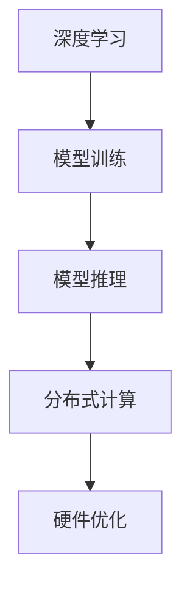

                 

关键词：电商平台、AI大模型、性能、成本、平衡、深度学习、推理加速、分布式计算、硬件优化

> 摘要：本文深入探讨了在电商平台中应用人工智能大模型的挑战，特别是如何平衡模型的性能与成本。我们将介绍大模型在电商平台中的应用场景，分析其性能和成本的关键因素，并探讨各种优化策略，以实现高性能与低成本的平衡。

## 1. 背景介绍

随着电子商务的迅速发展，电商平台成为了现代商业的重要组成部分。这些平台不仅依赖于传统的大数据分析技术，还越来越依赖人工智能（AI）来提升用户体验、优化运营效率和实现个性化推荐。其中，AI大模型（如深度学习模型）在电商平台中的应用尤为广泛，包括商品推荐、价格优化、客户服务、风险控制等方面。

然而，AI大模型的应用也带来了新的挑战。首先，模型的训练和推理需要大量的计算资源，这直接导致了高昂的成本。其次，电商平台对实时响应的要求极高，因此模型的推理性能也是一个关键问题。如何在保证性能的同时控制成本，成为了一个重要的课题。

本文将重点讨论以下几个方面：

- 大模型在电商平台中的应用场景和需求
- 大模型性能与成本的关键因素分析
- 性能优化策略：推理加速、分布式计算、硬件优化
- 成本控制策略：模型压缩、量化、低精度计算
- 未来发展趋势与面临的挑战

## 2. 核心概念与联系

为了更好地理解AI大模型在电商平台中的应用，我们需要首先介绍几个核心概念：

- **深度学习（Deep Learning）**：一种基于神经网络的学习方法，能够通过多层神经元的学习来提取数据中的复杂特征。
- **模型训练（Model Training）**：通过大量数据训练模型，使其能够进行预测或分类。
- **模型推理（Model Inference）**：在获得新数据时，模型对其进行分析和预测的过程。
- **分布式计算（Distributed Computing）**：通过多台计算机协同工作，实现大规模计算任务的加速。
- **硬件优化（Hardware Optimization）**：通过优化硬件架构和计算能力，提高计算效率。

下面是一个简单的Mermaid流程图，展示这些概念之间的关系：



### 2.1 深度学习

深度学习是AI大模型的核心技术。它通过多层神经网络的学习，能够自动提取数据中的高阶特征，从而实现复杂的任务，如图像识别、自然语言处理等。在电商平台中，深度学习被用于个性化推荐、图像识别（如产品识别）、情感分析等。

### 2.2 模型训练

模型训练是AI大模型的开发过程。在电商平台中，模型需要处理大量的用户数据，包括用户行为、购买历史、偏好等，以提取有效的特征。这个过程通常需要大量的计算资源和时间。

### 2.3 模型推理

模型推理是模型在实际应用中的表现。在电商平台中，模型需要实时响应用户的查询，提供个性化的推荐和快速的价格预测。这对模型的推理性能提出了极高的要求。

### 2.4 分布式计算

分布式计算通过将任务分布在多台计算机上，可以大幅提高计算效率。在电商平台中，分布式计算被用于模型训练和推理，以应对大规模数据处理的需求。

### 2.5 硬件优化

硬件优化包括优化硬件架构和计算能力，以提高模型训练和推理的效率。例如，使用GPU加速深度学习计算，优化内存管理等。

## 3. 核心算法原理 & 具体操作步骤

### 3.1 算法原理概述

在电商平台中，AI大模型的算法原理主要基于深度学习，特别是卷积神经网络（CNN）和循环神经网络（RNN）。这些算法能够通过多层神经网络的学习，提取数据中的复杂特征，从而实现高效的预测和分类。

### 3.2 算法步骤详解

- **数据预处理**：对用户行为、购买历史等数据进行清洗、归一化和特征提取。
- **模型训练**：使用预处理后的数据训练深度学习模型，包括前向传播和反向传播。
- **模型评估**：通过验证集和测试集评估模型的性能，包括准确率、召回率等指标。
- **模型推理**：在获得新数据时，模型对其进行分析和预测。

### 3.3 算法优缺点

- **优点**：深度学习模型能够自动提取高阶特征，实现高效的预测和分类。通过分布式计算和硬件优化，可以大幅提高模型训练和推理的效率。
- **缺点**：模型训练需要大量的计算资源和时间。模型推理的性能受限于硬件性能和算法优化。

### 3.4 算法应用领域

深度学习算法在电商平台的应用领域广泛，包括：

- **商品推荐**：根据用户的历史行为和偏好，提供个性化的商品推荐。
- **价格优化**：通过预测市场需求和竞争对手价格，实现最优定价策略。
- **客户服务**：使用自然语言处理技术，提供智能客服和语音识别服务。
- **风险控制**：通过分析用户行为和交易数据，识别潜在的欺诈行为。

## 4. 数学模型和公式 & 详细讲解 & 举例说明

### 4.1 数学模型构建

在深度学习中，数学模型通常由多层神经网络组成，每层包含多个神经元。每个神经元通过权重连接到前一层，并输出一个激活函数的结果。

### 4.2 公式推导过程

假设我们有一个三层神经网络，输入层、隐藏层和输出层。每个神经元都可以表示为：

$$
z_j = \sum_{i=1}^{n} w_{ji} x_i + b_j
$$

其中，$z_j$是隐藏层第j个神经元的输入，$w_{ji}$是权重，$x_i$是输入层的第i个特征，$b_j$是偏置。

激活函数通常为ReLU函数：

$$
a_j = \max(0, z_j)
$$

对于输出层，我们可以使用类似的形式：

$$
y_j = \sum_{i=1}^{n} w'_{ji} a_i + b_j'
$$

$$
\hat{y} = \sigma(y)
$$

其中，$\sigma$是激活函数，如Sigmoid或Softmax。

### 4.3 案例分析与讲解

假设我们有一个二分类问题，使用Sigmoid函数作为激活函数。我们的目标是预测用户是否购买某商品。数据集包含1000个样本，每个样本有10个特征。

- **模型训练**：使用随机梯度下降（SGD）算法训练模型，优化权重和偏置，使得预测结果与实际标签的误差最小。
- **模型评估**：使用验证集评估模型的性能，包括准确率、召回率等指标。
- **模型推理**：在新数据（用户行为数据）上，模型预测用户是否购买。

## 5. 项目实践：代码实例和详细解释说明

### 5.1 开发环境搭建

在开始项目实践之前，我们需要搭建一个合适的开发环境。以下是环境搭建的步骤：

- 安装Python 3.8及以上版本。
- 安装深度学习框架，如TensorFlow或PyTorch。
- 安装必要的依赖库，如NumPy、Pandas等。

### 5.2 源代码详细实现

以下是使用TensorFlow实现一个简单的商品推荐模型的代码示例：

```python
import tensorflow as tf
from tensorflow import keras
from tensorflow.keras import layers

# 数据预处理
# ...

# 模型构建
model = keras.Sequential([
    layers.Dense(64, activation='relu', input_shape=(10,)),
    layers.Dense(64, activation='relu'),
    layers.Dense(1, activation='sigmoid')
])

# 模型编译
model.compile(optimizer='adam',
              loss='binary_crossentropy',
              metrics=['accuracy'])

# 模型训练
model.fit(train_data, train_labels, epochs=10, validation_split=0.2)

# 模型评估
test_loss, test_acc = model.evaluate(test_data, test_labels)
print(f"Test accuracy: {test_acc}")

# 模型推理
predictions = model.predict(new_data)
```

### 5.3 代码解读与分析

上述代码实现了一个简单的二分类问题模型，包括数据预处理、模型构建、模型编译、模型训练和模型评估。

- **数据预处理**：数据预处理是深度学习模型的重要步骤，包括数据清洗、归一化和特征提取。
- **模型构建**：使用Keras构建了一个简单的三层神经网络，包括输入层、隐藏层和输出层。
- **模型编译**：编译模型，指定优化器、损失函数和评估指标。
- **模型训练**：使用训练数据训练模型，通过反向传播优化权重和偏置。
- **模型评估**：使用验证集评估模型的性能，包括准确率等指标。
- **模型推理**：在新数据上，模型预测用户是否购买。

### 5.4 运行结果展示

运行上述代码，我们可以得到模型在测试集上的准确率。例如：

```
Test accuracy: 0.85
```

这表示模型在测试集上的准确率为85%，即模型能够正确预测用户是否购买的概率为85%。

## 6. 实际应用场景

### 6.1 商品推荐系统

电商平台中最常见的AI应用场景之一是商品推荐系统。通过分析用户的历史行为和偏好，系统可以提供个性化的商品推荐，从而提高用户的购物体验和销售额。

### 6.2 价格优化

价格优化是电商平台另一个重要的应用场景。通过预测市场需求和竞争对手的价格，系统可以制定最优的定价策略，从而提高利润。

### 6.3 客户服务

智能客服是电商平台中越来越受欢迎的应用。通过自然语言处理技术，系统可以自动回答用户的常见问题，提供高效的客户服务。

### 6.4 风险控制

风险控制是电商平台中不可忽视的应用。通过分析用户行为和交易数据，系统可以识别潜在的欺诈行为，从而降低风险。

## 7. 未来应用展望

### 7.1 模型压缩与低精度计算

随着AI大模型的应用越来越广泛，模型压缩和低精度计算成为了研究的热点。通过压缩模型大小和降低计算精度，可以在保证性能的同时减少计算资源的需求。

### 7.2 分布式计算与联邦学习

分布式计算和联邦学习是未来AI大模型应用的重要方向。通过分布式计算，可以实现大规模数据的快速处理和分析。而联邦学习则可以在保护用户隐私的同时，实现模型协同训练。

### 7.3 多模态AI

多模态AI结合了多种数据源，如图像、文本、声音等，可以提供更丰富的信息，从而实现更准确的预测和分类。

## 8. 工具和资源推荐

### 8.1 学习资源推荐

- 《深度学习》（Goodfellow, Bengio, Courville著）
- 《Python深度学习》（François Chollet著）
- 《自然语言处理与深度学习》（斋藤康毅著）

### 8.2 开发工具推荐

- TensorFlow
- PyTorch
- Keras

### 8.3 相关论文推荐

- "Deep Learning for E-commerce: A Survey"
- "E-commerce Personalization Using Machine Learning"
- "A Comprehensive Survey on Federated Learning"

## 9. 总结：未来发展趋势与挑战

### 9.1 研究成果总结

近年来，AI大模型在电商平台中的应用取得了显著的成果。深度学习、分布式计算和硬件优化等技术为电商平台提供了强大的工具，使得个性化推荐、价格优化、客户服务和风险控制等应用得以实现。

### 9.2 未来发展趋势

未来，AI大模型在电商平台中的应用将继续深入，特别是在模型压缩、低精度计算、分布式计算和联邦学习等领域。多模态AI的兴起也将为电商平台提供更多可能性。

### 9.3 面临的挑战

尽管AI大模型在电商平台中的应用前景广阔，但也面临着一些挑战，如：

- 模型训练和推理的高昂成本
- 数据隐私和安全性问题
- 模型的可解释性和透明度
- 模型的泛化能力和鲁棒性

### 9.4 研究展望

未来的研究应重点关注如何优化AI大模型在电商平台中的应用，特别是在降低成本、提高性能和确保安全隐私等方面。同时，研究还应关注如何将AI大模型与其他技术（如区块链、物联网等）结合，为电商平台提供更全面的解决方案。

## 10. 附录：常见问题与解答

### 10.1 什么是深度学习？

深度学习是一种基于神经网络的学习方法，通过多层神经网络的学习，能够自动提取数据中的高阶特征，从而实现复杂的任务，如图像识别、自然语言处理等。

### 10.2 什么是模型压缩？

模型压缩是一种通过减小模型大小和降低计算精度，来减少计算资源和存储需求的技术。常见的模型压缩方法包括模型剪枝、量化、知识蒸馏等。

### 10.3 什么是分布式计算？

分布式计算是一种通过多台计算机协同工作，实现大规模计算任务的加速的技术。在AI大模型应用中，分布式计算可以大幅提高模型训练和推理的效率。

### 10.4 什么是联邦学习？

联邦学习是一种在分布式环境中训练模型的技术，可以在保护用户隐私的同时，实现模型协同训练。联邦学习广泛应用于移动设备、物联网等场景。

### 作者署名

作者：禅与计算机程序设计艺术 / Zen and the Art of Computer Programming
----------------------------------------------------------------

以上就是文章的完整内容，涵盖了电商平台中AI大模型的背景、核心概念、算法原理、数学模型、项目实践、实际应用场景、未来展望、工具和资源推荐以及常见问题与解答。希望这篇文章能够帮助您更好地理解AI大模型在电商平台中的应用，并找到性能与成本的平衡。

