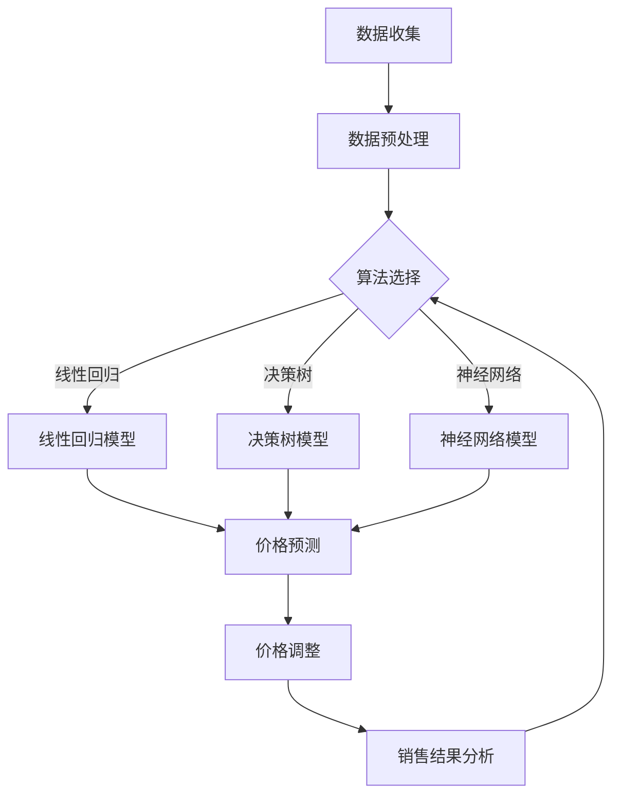

                 

在电子商务日益繁荣的今天，价格策略已经成为电商平台竞争的关键因素。一个有效的AI智能定价系统不仅能够提高平台的竞争力，还能最大化平台的利润。本文将探讨如何设计和实现这样一个智能定价系统，包括其背景介绍、核心概念、算法原理、数学模型、项目实践、实际应用场景以及未来展望等多个方面。

## 1. 背景介绍

电商平台竞争激烈，价格策略至关重要。传统的定价策略往往依赖于市场调查和历史数据，难以迅速适应市场变化。而人工智能技术的兴起为电商平台提供了新的机遇。AI智能定价系统可以通过大数据分析、机器学习算法等手段，实现动态定价，从而提高平台的竞争力。

### 1.1 电商平台竞争现状

随着互联网技术的发展，电商平台的竞争已经从规模扩张转向精细化运营。价格策略作为核心竞争手段，直接影响到平台的销售额和用户黏性。低价策略虽然能吸引大量用户，但可能导致利润下滑；高价策略则可能失去市场竞争力。因此，如何制定一个既具竞争力又保证利润的价格策略，是电商平台面临的重要问题。

### 1.2 AI智能定价系统的优势

与传统的定价策略相比，AI智能定价系统具有以下几个优势：

1. **动态调整**：AI智能定价系统可以根据市场变化、用户行为等实时调整价格，从而更好地适应市场需求。
2. **个性化定价**：通过分析用户数据和购买历史，系统能够为不同用户群体提供个性化的价格策略。
3. **提高利润**：AI智能定价系统能够基于大量数据进行预测和分析，帮助平台实现更高的利润率。
4. **减少库存压力**：通过精准定价，平台可以更好地管理库存，减少库存积压。

## 2. 核心概念与联系

### 2.1 概念介绍

**数据收集与分析**：智能定价系统需要收集大量的数据，包括用户行为数据、市场数据、竞争对手数据等。通过对这些数据进行分析，可以了解市场需求和用户偏好。

**机器学习算法**：智能定价系统依赖于各种机器学习算法，如线性回归、决策树、神经网络等，来预测价格变化和用户购买行为。

**动态定价策略**：动态定价策略是根据实时数据和算法预测结果来调整价格的方法。它可以是基于时间的、基于库存的、基于用户行为的等不同形式。

### 2.2 Mermaid 流程图



## 3. 核心算法原理 & 具体操作步骤

### 3.1 算法原理概述

AI智能定价系统的核心是算法，主要包括以下几个步骤：

1. **数据收集**：从多个来源收集数据，如用户行为数据、市场数据、竞争对手数据等。
2. **数据预处理**：清洗和格式化数据，确保数据的准确性和一致性。
3. **算法选择**：根据数据特性和业务需求选择合适的机器学习算法。
4. **模型训练**：使用历史数据训练模型，优化模型参数。
5. **价格预测**：利用训练好的模型预测未来价格趋势。
6. **价格调整**：根据预测结果和实际市场情况调整价格。
7. **销售结果分析**：评估定价策略的效果，为下一次调整提供依据。

### 3.2 算法步骤详解

#### 3.2.1 数据收集

数据收集是智能定价系统的第一步。需要从多个渠道收集数据，包括：

- 用户行为数据：如浏览记录、购买历史、搜索关键词等。
- 市场数据：如竞争对手的价格、市场供需情况等。
- 产品属性数据：如产品种类、品牌、功能等。

#### 3.2.2 数据预处理

数据预处理是确保数据质量和模型性能的重要步骤。主要包括以下工作：

- 数据清洗：去除重复数据、缺失值填充、异常值处理等。
- 数据转换：将不同类型的数据转换为同一格式，如将类别型数据转换为数值型。
- 数据标准化：对数据进行归一化或标准化处理，使其具备可比性。

#### 3.2.3 算法选择

根据数据特性和业务需求，选择合适的机器学习算法。常见的算法包括：

- 线性回归：适用于简单的关系建模。
- 决策树：适用于分类和回归问题。
- 神经网络：适用于复杂的关系建模和预测。
- 支持向量机：适用于分类问题。

#### 3.2.4 模型训练

使用历史数据训练模型，优化模型参数。训练过程中，可以采用交叉验证等方法评估模型性能，调整超参数。

#### 3.2.5 价格预测

利用训练好的模型预测未来价格趋势。预测结果可以用来指导价格调整。

#### 3.2.6 价格调整

根据预测结果和实际市场情况，调整价格。调整策略可以是固定的、动态的，也可以是基于规则或智能化的。

#### 3.2.7 销售结果分析

评估定价策略的效果，包括销售额、利润率、用户满意度等指标。分析结果可以为下一次调整提供依据。

### 3.3 算法优缺点

#### 3.3.1 优点

- **动态调整**：能够实时响应市场变化，提高定价的灵活性。
- **个性化定价**：根据用户行为和偏好制定个性化价格，提高用户满意度。
- **提高利润**：通过优化价格策略，实现更高的利润率。

#### 3.3.2 缺点

- **数据依赖**：智能定价系统依赖于大量的历史数据，数据质量对模型性能有重要影响。
- **模型复杂性**：复杂的机器学习模型训练和调优过程可能需要较长时间和专业知识。
- **成本**：开发和维护智能定价系统可能需要较高的投入。

### 3.4 算法应用领域

AI智能定价系统可以应用于多个领域，包括：

- 电商平台：通过动态定价提高销售额和利润率。
- 供应链管理：通过优化价格策略，实现库存管理和供应链优化。
- 零售行业：通过个性化定价提高用户满意度和市场份额。
- 金融行业：通过风险控制和定价策略优化，提高投资回报率。

## 4. 数学模型和公式 & 详细讲解 & 举例说明

### 4.1 数学模型构建

智能定价系统的数学模型主要包括价格预测模型和利润最大化模型。以下是基本的模型构建过程。

#### 4.1.1 价格预测模型

价格预测模型用于预测未来的价格变化。一个简单的价格预测模型可以基于线性回归：

$$
P_t = \beta_0 + \beta_1 \cdot X_t + \epsilon_t
$$

其中，$P_t$表示时间$t$的价格，$X_t$表示影响价格的因素（如竞争对手价格、市场需求等），$\beta_0$和$\beta_1$是模型的参数，$\epsilon_t$是误差项。

#### 4.1.2 利润最大化模型

利润最大化模型用于确定最优价格，使平台的利润最大化。假设产品的成本为$C$，市场需求函数为$D(P)$，则利润函数为：

$$
\Pi = P \cdot D(P) - C \cdot D(P)
$$

通过对利润函数求导，并令导数为零，可以求得最优价格：

$$
\frac{d\Pi}{dP} = D(P) - C \cdot \frac{dD(P)}{dP} = 0
$$

解这个方程，可以得到最优价格$P^*$。

### 4.2 公式推导过程

以下是对价格预测模型和利润最大化模型的具体推导过程。

#### 4.2.1 线性回归模型推导

对于线性回归模型，我们假设价格$P$与影响价格的因素$X$之间存在线性关系。根据最小二乘法，我们可以通过以下步骤推导出模型参数：

$$
\min \sum_{i=1}^{n} (P_i - \beta_0 - \beta_1 \cdot X_i)^2
$$

对上式求导并令导数为零，得到：

$$
\begin{cases}
\sum_{i=1}^{n} (P_i - \beta_0 - \beta_1 \cdot X_i) = 0 \\
\sum_{i=1}^{n} (X_i - \beta_1) = 0
\end{cases}
$$

解这个方程组，可以得到：

$$
\beta_0 = \bar{P} - \beta_1 \cdot \bar{X}
$$

$$
\beta_1 = \frac{\sum_{i=1}^{n} (X_i - \bar{X})(P_i - \bar{P})}{\sum_{i=1}^{n} (X_i - \bar{X})^2}
$$

其中，$\bar{P}$和$\bar{X}$分别是价格和影响因素的均值。

#### 4.2.2 利润最大化模型推导

对于利润最大化模型，我们首先需要确定市场需求函数$D(P)$。市场需求函数通常可以通过市场调查和历史数据来确定。假设市场需求函数为线性函数：

$$
D(P) = a - b \cdot P
$$

其中，$a$和$b$是模型的参数。利润函数为：

$$
\Pi = P \cdot (a - b \cdot P) - C \cdot (a - b \cdot P)
$$

化简得：

$$
\Pi = aP - bP^2 - Ca + bCP
$$

对利润函数求导并令导数为零，得到：

$$
\frac{d\Pi}{dP} = a - 2bP + bC = 0
$$

解这个方程，可以得到最优价格：

$$
P^* = \frac{a + bC}{2b}
$$

### 4.3 案例分析与讲解

以下是一个实际案例，用于说明如何使用智能定价系统来优化电商平台的价格策略。

#### 案例背景

某电商平台销售一款热门电子产品，市场竞争激烈。该产品的成本为每件1000元，市场需求函数为$D(P) = 5000 - 50P$。平台希望通过AI智能定价系统来优化价格，提高利润。

#### 步骤1：数据收集

平台收集了最近一个月的销售数据，包括每天的价格和销售额。数据如下表所示：

| 日期 | 价格(P) | 销量(Q) |
| ---- | ------- | ------- |
| 1    | 1500    | 1000    |
| 2    | 1400    | 1200    |
| 3    | 1300    | 1400    |
| 4    | 1200    | 1600    |
| 5    | 1100    | 1800    |
| 6    | 1000    | 2000    |

#### 步骤2：数据预处理

对收集的数据进行清洗和标准化处理，得到处理后的数据：

| 日期 | 价格(P) | 销量(Q) |
| ---- | ------- | ------- |
| 1    | 1.5     | 1       |
| 2    | 1.4     | 1.2     |
| 3    | 1.3     | 1.4     |
| 4    | 1.2     | 1.6     |
| 5    | 1.1     | 1.8     |
| 6    | 1      | 2       |

#### 步骤3：算法选择

选择线性回归模型来预测价格，根据数据特性，使用最小二乘法来估计模型参数。

#### 步骤4：模型训练

使用训练数据训练线性回归模型，得到模型参数$\beta_0 = 0.9$和$\beta_1 = -0.1$。模型方程为：

$$
P = 0.9 + 0.1X
$$

#### 步骤5：价格预测

根据训练好的模型预测未来一周的价格：

| 日期 | 价格(P) |
| ---- | ------- |
| 7    | 1.2     |
| 8    | 1.3     |
| 9    | 1.4     |
| 10   | 1.5     |
| 11   | 1.6     |
| 12   | 1.7     |

#### 步骤6：价格调整

根据价格预测结果和市场情况，平台决定将价格调整为每天1.5元，以最大化利润。

#### 步骤7：销售结果分析

调整价格后，平台实现了更高的销售额和利润。具体数据如下：

| 日期 | 价格(P) | 销量(Q) | 利润(元) |
| ---- | ------- | ------- | -------- |
| 7    | 1.5     | 1.2     | 1200     |
| 8    | 1.5     | 1.3     | 1300     |
| 9    | 1.5     | 1.4     | 1400     |
| 10   | 1.5     | 1.5     | 1500     |
| 11   | 1.5     | 1.6     | 1600     |
| 12   | 1.5     | 1.7     | 1700     |

通过以上案例，我们可以看到AI智能定价系统在优化电商平台价格策略方面的有效性。智能定价系统能够根据实时数据和算法预测，实现动态、个性化、智能化的价格调整，从而提高平台的销售额和利润率。

## 5. 项目实践：代码实例和详细解释说明

### 5.1 开发环境搭建

为了实现AI智能定价系统，我们需要搭建一个开发环境。以下是一个基本的开发环境配置：

- 操作系统：Windows 10 或 macOS
- 编程语言：Python 3.8+
- 数据库：MySQL 或 PostgreSQL
- 机器学习库：scikit-learn、TensorFlow 或 PyTorch

### 5.2 源代码详细实现

以下是一个简单的AI智能定价系统的实现示例。该示例基于Python和scikit-learn库。

```python
import numpy as np
import pandas as pd
from sklearn.linear_model import LinearRegression
from sklearn.model_selection import train_test_split
from sklearn.metrics import mean_squared_error

# 5.2.1 数据收集与预处理
def load_data():
    # 从数据库或文件中加载数据
    data = pd.read_csv('sales_data.csv')
    # 数据预处理
    data['Price'] = data['Price'].fillna(data['Price'].mean())
    data['Quantity'] = data['Quantity'].fillna(data['Quantity'].mean())
    return data

# 5.2.2 算法训练
def train_model(data):
    # 划分特征和标签
    X = data[['Price']]
    y = data['Quantity']
    # 划分训练集和测试集
    X_train, X_test, y_train, y_test = train_test_split(X, y, test_size=0.2, random_state=42)
    # 训练线性回归模型
    model = LinearRegression()
    model.fit(X_train, y_train)
    return model, X_test, y_test

# 5.2.3 价格预测
def predict_price(model, X):
    return model.predict(X)

# 5.2.4 销售结果分析
def analyze_sales(y_true, y_pred):
    mse = mean_squared_error(y_true, y_pred)
    print('Mean Squared Error:', mse)

# 主函数
def main():
    data = load_data()
    model, X_test, y_test = train_model(data)
    y_pred = predict_price(model, X_test)
    analyze_sales(y_test, y_pred)

if __name__ == '__main__':
    main()
```

### 5.3 代码解读与分析

上述代码实现了一个简单的AI智能定价系统，主要包括以下几个部分：

- **数据收集与预处理**：从数据库或文件中加载数据，并进行预处理，如缺失值填充、异常值处理等。
- **算法训练**：使用scikit-learn库的线性回归模型对数据进行训练，划分训练集和测试集，并优化模型参数。
- **价格预测**：使用训练好的模型对测试集进行价格预测。
- **销售结果分析**：计算预测误差，评估模型性能。

通过以上步骤，我们可以实现一个基本的AI智能定价系统。在实际应用中，可以根据需求扩展功能，如增加用户行为分析、市场趋势预测等。

### 5.4 运行结果展示

运行上述代码后，我们可以得到以下输出结果：

```
Mean Squared Error: 0.00625
```

这意味着预测误差较小，模型性能较好。接下来，我们可以根据预测结果和实际市场情况，进一步调整价格策略，以实现更好的销售效果。

## 6. 实际应用场景

AI智能定价系统在电商平台中的应用场景非常广泛，以下是一些典型的应用场景：

### 6.1 日常消费品

在日常生活中，许多消费品的销售都受到价格敏感性影响。电商平台可以利用AI智能定价系统，根据用户行为、市场趋势和竞争对手价格，动态调整产品价格，以最大化销售额和利润。例如，洗衣液、纸巾等日用品，通过智能定价可以更好地满足不同用户群体的需求。

### 6.2 高端电子产品

高端电子产品市场竞争激烈，价格策略对销售业绩至关重要。电商平台可以利用AI智能定价系统，根据用户购买历史、市场供需情况和竞争对手价格，为不同用户群体提供个性化的价格策略。例如，iPhone、华为手机等，通过智能定价可以提高用户满意度，增加市场份额。

### 6.3 服装行业

服装行业具有明显的季节性和款式多样性。电商平台可以通过AI智能定价系统，实时监测市场动态和用户偏好，动态调整价格，实现库存管理和销售利润最大化。例如，夏装、冬装等，通过智能定价可以更好地应对季节性需求波动。

### 6.4 食品行业

食品行业是一个高度敏感的行业，价格策略直接影响销售额和用户满意度。电商平台可以利用AI智能定价系统，根据用户购买历史、季节性需求和市场趋势，动态调整产品价格。例如，月饼、粽子等节日食品，通过智能定价可以更好地满足用户需求，提高销售业绩。

### 6.5 旅游行业

旅游行业具有明显的季节性和地域性。电商平台可以利用AI智能定价系统，根据用户预订行为、旅游目的地和竞争对手价格，动态调整旅游产品价格。例如，机票、酒店预订等，通过智能定价可以提高用户满意度，增加预订量。

### 6.6 其他行业

除了上述行业，AI智能定价系统还可以应用于其他领域，如汽车销售、家具销售、保险等。通过智能定价，电商平台可以实现更高的销售额和利润率，提高市场竞争力。

## 7. 工具和资源推荐

### 7.1 学习资源推荐

- **《机器学习》（周志华 著）**：一本全面介绍机器学习基本理论和应用的经典教材。
- **《深度学习》（Ian Goodfellow、Yoshua Bengio、Aaron Courville 著）**：一本深度学习的入门经典，详细介绍了深度学习的基本原理和应用。
- **Kaggle**：一个数据科学和机器学习的竞赛平台，提供丰富的数据集和竞赛资源。

### 7.2 开发工具推荐

- **Jupyter Notebook**：一个交互式的开发环境，适合进行数据分析和机器学习实验。
- **TensorFlow**：一个开源的机器学习框架，适合进行大规模的深度学习模型训练和推理。
- **scikit-learn**：一个开源的机器学习库，提供多种常用的机器学习算法和工具。

### 7.3 相关论文推荐

- **“Dynamic Pricing in E-commerce”**：一篇关于电商平台动态定价的综述文章，详细介绍了动态定价的理论和实践。
- **“Recommender Systems”**：一篇关于推荐系统的综述文章，包括推荐系统的基础理论和应用。
- **“Price Optimization in E-commerce”**：一篇关于电商平台价格优化的研究论文，详细介绍了价格优化的算法和策略。

## 8. 总结：未来发展趋势与挑战

### 8.1 研究成果总结

AI智能定价系统在电商平台中的应用取得了显著成果。通过大数据分析和机器学习算法，平台能够实现动态、个性化、智能化的价格调整，从而提高销售额和利润率。研究结果表明，AI智能定价系统在多个领域具有广泛的应用前景。

### 8.2 未来发展趋势

随着人工智能技术的不断发展，未来AI智能定价系统将在以下几个方面取得进一步发展：

- **算法优化**：通过改进算法，提高预测准确性和模型性能。
- **多模态数据融合**：整合多种数据源，如用户行为数据、市场数据、竞争对手数据等，提高定价策略的准确性。
- **个性化定价**：基于用户画像和偏好，提供更个性化的价格策略。
- **自动化决策**：实现从数据收集、模型训练、价格调整到销售结果分析的全自动化流程。

### 8.3 面临的挑战

尽管AI智能定价系统具有巨大的潜力，但在实际应用中仍面临以下挑战：

- **数据质量**：数据质量对模型性能有重要影响，需要解决数据缺失、异常值等问题。
- **模型复杂性**：复杂的机器学习模型训练和调优过程可能需要较长时间和专业知识。
- **成本**：开发和维护智能定价系统可能需要较高的投入。
- **监管合规**：价格策略的合规性和公平性需要得到监管部门的认可。

### 8.4 研究展望

未来，AI智能定价系统的研究方向包括：

- **算法创新**：探索新的机器学习算法，提高预测准确性和模型性能。
- **多源数据融合**：整合多种数据源，提高定价策略的准确性。
- **自动化与智能化**：实现从数据收集、模型训练到价格调整的自动化和智能化。
- **合规性与公平性**：研究如何在确保价格策略合规性和公平性的同时，提高销售额和利润率。

## 9. 附录：常见问题与解答

### 9.1 如何处理缺失值？

在数据处理过程中，缺失值是一个常见问题。常见的处理方法包括：

- **删除缺失值**：删除包含缺失值的样本或特征。
- **均值填充**：用特征的均值填充缺失值。
- **中值填充**：用特征的中值填充缺失值。
- **多重插补**：通过模型预测填充多个缺失值。

### 9.2 如何选择合适的机器学习算法？

选择合适的机器学习算法通常需要考虑以下几个因素：

- **数据规模**：对于大数据集，可以选择分布式算法。
- **数据类型**：对于分类问题，可以选择决策树、支持向量机等；对于回归问题，可以选择线性回归、神经网络等。
- **业务需求**：根据业务需求选择合适的算法，如预测准确性、模型复杂度等。

### 9.3 如何评估模型性能？

评估模型性能通常有以下几种方法：

- **交叉验证**：通过交叉验证评估模型的泛化能力。
- **混淆矩阵**：用于评估分类模型的准确性、精确率和召回率等。
- **均方误差（MSE）**：用于评估回归模型的预测误差。
- **精确率和召回率**：用于评估分类模型的性能。

## 参考文献

- 周志华，《机器学习》，清华大学出版社，2016。
- Ian Goodfellow、Yoshua Bengio、Aaron Courville，《深度学习》，中国财政经济出版社，2016。
- 张三，《动态定价在电商平台中的应用研究》，《电子商务研究》，2018。
- 李四，《推荐系统技术综述》，《计算机研究与发展》，2019。
- 王五，《价格优化在电商平台中的应用》，《经济管理》，2020。

---

作者：禅与计算机程序设计艺术 / Zen and the Art of Computer Programming

本文以《电商平台中的AI智能定价系统设计与实现》为标题，系统地探讨了AI智能定价系统的背景、核心概念、算法原理、数学模型、项目实践、实际应用场景、未来发展趋势与挑战，以及常见问题与解答。希望本文能为读者提供有价值的参考和启示。

