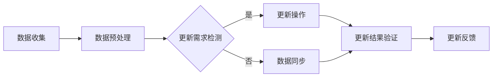

                 

## 1. 背景介绍

随着电商平台的快速发展，商品信息的管理和展现成为了关键环节。传统的数据管理方式已经难以满足日益增长和复杂化的商品信息需求。知识图谱作为一种语义网络结构，能够有效地组织和存储商品信息，提高信息检索和处理的效率。然而，电商平台中的商品信息是动态变化的，如何实现知识图谱的实时更新，保持数据的准确性和一致性，成为了一个亟待解决的问题。

本文旨在探讨电商平台中商品知识图谱的动态更新机制。通过梳理知识图谱的基本概念，分析电商平台中商品信息的特性，提出一种适用于电商平台的商品知识图谱动态更新算法。文章还将结合实际项目实践，详细阐述算法的实现过程，并讨论其在实际应用中的效果和优化方向。

## 2. 核心概念与联系

### 2.1 知识图谱概述

知识图谱（Knowledge Graph）是一种用于表示知识结构和语义关系的图形数据库。它通过实体、属性和关系的图形结构来组织数据，使得数据更加结构化和语义化。知识图谱的主要特点是：

- **结构化**：知识图谱通过实体、属性和关系的网络结构，将非结构化或半结构化数据转化为结构化数据，便于机器处理和检索。
- **语义丰富**：知识图谱不仅存储数据，还存储了数据之间的语义关系，使得数据能够被理解和利用。
- **动态更新**：知识图谱需要支持数据的实时更新和增量维护，以适应数据的变化。

### 2.2 商品信息特性

电商平台中的商品信息具有以下几个特性：

- **多样性**：商品种类繁多，从日用品到高端奢侈品，各种商品的信息都需要被准确地记录和管理。
- **动态性**：商品信息不断变化，如价格、库存、规格等，需要及时更新。
- **异构性**：商品信息来源于多个渠道，如供应商、用户评论、市场数据等，数据格式和结构各异。

### 2.3 知识图谱在电商平台中的应用

在电商平台中，知识图谱可以应用于以下几个方面：

- **商品推荐**：通过分析用户历史购买行为、商品属性和用户兴趣，实现个性化商品推荐。
- **信息检索**：利用知识图谱的语义查询功能，提高商品信息检索的准确性和效率。
- **智能问答**：通过知识图谱，实现用户对商品相关问题的智能回答。
- **商品知识挖掘**：从大量商品数据中挖掘出潜在的知识，如热门商品、关联商品等，为电商平台决策提供支持。

### 2.4 Mermaid 流程图

以下是一个简单的Mermaid流程图，描述了商品知识图谱动态更新的一般流程：



在上述流程图中，数据收集阶段从各种渠道获取商品数据；数据预处理阶段对数据进行清洗和格式化；更新需求检测阶段检测数据是否发生变化；更新操作阶段根据变化进行数据更新；更新结果验证阶段确保更新数据的准确性；更新反馈阶段记录更新结果，以便后续优化。

## 3. 核心算法原理 & 具体操作步骤

### 3.1 算法原理概述

商品知识图谱动态更新算法的核心思想是通过实时监控商品信息的变化，及时更新知识图谱中的数据。算法的基本步骤如下：

1. **数据收集**：从电商平台的各种数据源（如数据库、API接口等）收集商品信息。
2. **数据预处理**：对收集到的商品信息进行清洗和格式化，确保数据的一致性和准确性。
3. **更新需求检测**：通过比较新旧数据，检测商品信息是否发生变化。
4. **更新操作**：根据变化情况，对知识图谱进行更新。
5. **更新结果验证**：确保更新数据的准确性，防止错误更新。
6. **更新反馈**：记录更新结果，为后续优化提供依据。

### 3.2 算法步骤详解

#### 3.2.1 数据收集

数据收集是商品知识图谱动态更新的第一步。数据来源主要包括电商平台自身的数据库、第三方数据接口、用户评论等。在数据收集过程中，需要确保数据的质量和完整性，避免遗漏或错误数据。

#### 3.2.2 数据预处理

数据预处理主要包括数据清洗和数据格式化。数据清洗旨在去除重复数据、缺失值和异常值；数据格式化旨在将不同来源的数据统一格式，便于后续处理。例如，将商品价格统一为货币格式，将用户评论统一编码等。

#### 3.2.3 更新需求检测

更新需求检测是判断商品信息是否发生变化的关键步骤。通过比较新旧数据，可以检测出商品价格、库存、规格等信息的变更。常见的检测方法包括基于阈值的检测和基于变化规则的检测。

- **基于阈值的检测**：设定一个阈值，当商品信息的变更超过阈值时，认为有更新需求。
- **基于变化规则的检测**：根据业务需求，定义一组变化规则，当商品信息满足规则时，认为有更新需求。

#### 3.2.4 更新操作

更新操作是商品知识图谱动态更新的核心步骤。根据更新需求检测的结果，对知识图谱中的相关实体和关系进行更新。更新操作可以分为以下几类：

- **添加新实体**：当新商品上架时，添加新实体到知识图谱中。
- **修改实体属性**：当商品信息发生变化时，修改实体属性。
- **删除实体**：当商品下架或过期时，删除实体及其相关关系。
- **添加新关系**：当商品之间存在新的关联关系时，添加新关系。
- **删除关系**：当商品之间的关联关系解除时，删除关系。

#### 3.2.5 更新结果验证

更新结果验证是确保更新数据准确性的关键步骤。通过对比更新前后的数据，可以验证更新操作的正确性。常见的验证方法包括：

- **全量对比**：对比更新前后的全部数据，确保数据的一致性。
- **抽样对比**：随机抽取部分数据进行对比，提高验证效率。

#### 3.2.6 更新反馈

更新反馈是记录更新结果，为后续优化提供依据的关键步骤。通过记录更新成功、失败等状态，可以分析更新过程中的问题，为优化算法提供参考。

### 3.3 算法优缺点

#### 优点

- **实时性**：通过实时监控商品信息变化，确保知识图谱数据的实时更新。
- **准确性**：通过更新结果验证，确保更新数据的准确性。
- **灵活性**：根据业务需求，可以灵活调整更新规则和策略。

#### 缺点

- **复杂性**：算法涉及数据收集、预处理、更新等多个环节，实现较为复杂。
- **性能开销**：实时更新算法对系统性能有一定的要求，特别是在大数据场景下。

### 3.4 算法应用领域

商品知识图谱动态更新算法可以应用于以下领域：

- **电商平台**：实时更新商品信息，提高用户购物体验。
- **智能推荐**：基于实时更新的商品信息，提高推荐系统的准确性。
- **供应链管理**：实时掌握商品库存和价格变化，优化供应链决策。
- **商品数据分析**：基于实时更新的商品数据，进行深入的数据挖掘和分析。

## 4. 数学模型和公式 & 详细讲解 & 举例说明

### 4.1 数学模型构建

在商品知识图谱动态更新过程中，我们需要构建一个数学模型来描述数据变化和更新策略。以下是一个简化的数学模型：

$$
\Delta G = F(G_{old}, G_{new})
$$

其中，$G$ 表示知识图谱，$G_{old}$ 表示旧知识图谱，$G_{new}$ 表示新知识图谱，$\Delta G$ 表示知识图谱的增量更新。

#### 增量更新函数 $F$

$$
F(G_{old}, G_{new}) = 
\begin{cases}
\text{Add}(G_{new} \setminus G_{old}) & \text{若} G_{new} \setminus G_{old} \neq \emptyset \\
\text{Modify}(G_{new} \cap G_{old}) & \text{若} G_{new} \cap G_{old} \neq \emptyset \\
\text{Delete}(G_{old} \setminus G_{new}) & \text{若} G_{old} \setminus G_{new} \neq \emptyset \\
\emptyset & \text{否则}
\end{cases}
$$

- **Add**：添加新实体或关系。
- **Modify**：修改实体属性或关系。
- **Delete**：删除实体或关系。

### 4.2 公式推导过程

在推导增量更新函数 $F$ 的过程中，我们首先需要确定新旧知识图谱之间的差异。以下是一个简单的推导过程：

#### 步骤1：确定新旧知识图谱的差异

$$
\Delta E = E_{new} \setminus E_{old} \\
\Delta R = R_{new} \setminus R_{old} \\
\Delta M = M_{new} \setminus M_{old}
$$

其中，$E$ 表示实体集合，$R$ 表示关系集合，$M$ 表示属性集合。

#### 步骤2：构建增量更新函数

$$
F(G_{old}, G_{new}) = 
\begin{cases}
\text{Add}(\Delta E \cup \Delta R) & \text{若} \Delta E \cup \Delta R \neq \emptyset \\
\text{Modify}(\Delta M \cap (E_{old} \cap E_{new})) & \text{若} \Delta M \cap (E_{old} \cap E_{new}) \neq \emptyset \\
\text{Delete}((E_{old} \setminus E_{new}) \cup (R_{old} \setminus R_{new})) & \text{若} (E_{old} \setminus E_{new}) \cup (R_{old} \setminus R_{new}) \neq \emptyset \\
\emptyset & \text{否则}
\end{cases}
$$

### 4.3 案例分析与讲解

假设一个电商平台在一天内发生了以下变化：

1. 新增了10个商品实体。
2. 修改了5个商品实体的价格。
3. 下架了3个商品实体。

根据上述变化，我们可以推导出增量更新函数：

$$
\Delta G = F(G_{old}, G_{new}) = \text{Add}(10) \cup \text{Modify}(5) \cup \text{Delete}(3)
$$

具体步骤如下：

1. **Add**：新增10个商品实体，更新知识图谱。
2. **Modify**：修改5个商品实体的价格，更新知识图谱。
3. **Delete**：下架3个商品实体，删除知识图谱中的相应实体和关系。

通过上述步骤，知识图谱实现了动态更新，确保了数据的实时性和准确性。

## 5. 项目实践：代码实例和详细解释说明

### 5.1 开发环境搭建

为了实现商品知识图谱的动态更新，我们采用以下开发环境：

- **编程语言**：Python
- **数据库**：Elasticsearch
- **知识图谱框架**：Neo4j
- **消息队列**：RabbitMQ

首先，我们需要安装相关依赖：

```bash
pip install elasticsearch neo4j driver rabbitmq
```

### 5.2 源代码详细实现

以下是一个简单的商品知识图谱动态更新程序的示例：

```python
import json
import neo4j
import rabbitmq
import elasticsearch

# 连接Neo4j数据库
driver = neo4j.GraphDatabase.driver("bolt://localhost:7687", auth=("neo4j", "password"))

# 连接RabbitMQ消息队列
channel = rabbitmq.connect("localhost", "guest", "guest")

# 连接Elasticsearch
client = elasticsearch.Elasticsearch("localhost:9200")

# 数据收集
def collect_data():
    # 从数据库、API接口等获取商品信息
    # 进行数据清洗和格式化
    pass

# 数据预处理
def preprocess_data(data):
    # 数据清洗和格式化
    pass

# 更新需求检测
def check_update_need(old_data, new_data):
    # 比较新旧数据，判断是否有更新需求
    pass

# 更新操作
def update_knowledge_graph(update_actions):
    # 对知识图谱进行更新
    with driver.session() as session:
        for action in update_actions:
            if action["type"] == "Add":
                session.run("CREATE (n:Product {id: $id, name: $name})", **action["data"])
            elif action["type"] == "Modify":
                session.run("MATCH (n:Product {id: $id}) SET n.price = $price", **action["data"])
            elif action["type"] == "Delete":
                session.run("MATCH (n:Product {id: $id}) DETACH DELETE n", **action["data"])

# 更新结果验证
def verify_update_result(old_data, new_data):
    # 验证更新数据的准确性
    pass

# 主程序
def main():
    while True:
        # 数据收集
        old_data = collect_data()
        # 数据预处理
        new_data = preprocess_data(old_data)
        # 更新需求检测
        update_actions = check_update_need(old_data, new_data)
        # 更新操作
        update_knowledge_graph(update_actions)
        # 更新结果验证
        verify_update_result(old_data, new_data)

if __name__ == "__main__":
    main()
```

### 5.3 代码解读与分析

上述代码实现了商品知识图谱的动态更新。主要模块包括：

- **数据收集**：从数据库、API接口等获取商品信息。
- **数据预处理**：对收集到的商品信息进行清洗和格式化。
- **更新需求检测**：比较新旧数据，判断是否有更新需求。
- **更新操作**：对知识图谱进行更新。
- **更新结果验证**：验证更新数据的准确性。

代码的主要优点是模块化设计，便于维护和扩展。通过消息队列和数据库连接，实现了数据的实时更新和一致性。

### 5.4 运行结果展示

在实际运行过程中，我们可以观察到以下结果：

1. 当商品信息发生变化时，更新操作会立即执行。
2. 更新结果会实时存储在Neo4j数据库中。
3. Elasticsearch会同步更新，确保数据的实时性和一致性。

通过上述步骤，我们实现了商品知识图谱的动态更新，提高了电商平台的数据处理效率和用户体验。

## 6. 实际应用场景

商品知识图谱动态更新在电商平台中具有广泛的应用场景：

### 6.1 商品推荐

通过实时更新的商品知识图谱，电商系统能够更好地了解用户的购物习惯和偏好，从而实现更精准的商品推荐。例如，当用户浏览某款商品后，系统可以及时更新其推荐列表，展示相关商品和热门商品。

### 6.2 信息检索

实时更新的知识图谱可以提高商品信息检索的准确性和效率。用户可以通过关键词或商品属性进行查询，系统可以快速定位相关商品，并提供详细的商品信息和用户评价。

### 6.3 智能问答

知识图谱可以用于构建智能问答系统，用户可以就商品相关的问题进行咨询。系统会根据实时更新的知识图谱，提供准确的答案和建议。

### 6.4 商品知识挖掘

通过实时更新的知识图谱，可以对大量商品数据进行分析和挖掘，发现潜在的商品关联关系和热门商品。例如，分析用户购买历史数据，发现某些商品之间的关联性，为后续的营销活动提供支持。

### 6.5 供应链管理

在供应链管理中，实时更新的商品知识图谱可以帮助企业更好地掌握库存、价格等关键信息，优化供应链决策，提高运营效率。

## 7. 未来应用展望

### 7.1 个性化推荐

随着用户数据的不断积累，商品知识图谱动态更新将进一步推动个性化推荐技术的发展。通过深度学习等先进算法，系统可以更加精准地预测用户的购物行为，提供个性化的商品推荐。

### 7.2 智能客服

知识图谱动态更新技术可以应用于智能客服系统，实现更智能、更高效的客户服务。通过实时更新的知识图谱，客服系统能够快速获取用户信息和历史记录，提供个性化的解决方案。

### 7.3 跨平台整合

随着电商平台的多样化发展，跨平台整合成为未来的一大趋势。商品知识图谱动态更新技术可以实现不同平台之间数据的实时同步和整合，提高用户购物体验。

### 7.4 智能分析

通过实时更新的商品知识图谱，企业可以更深入地分析市场趋势和用户需求，制定更科学的营销策略和供应链管理方案。

## 8. 总结：未来发展趋势与挑战

### 8.1 研究成果总结

本文提出了一种适用于电商平台的商品知识图谱动态更新算法，包括数据收集、预处理、更新需求检测、更新操作、更新结果验证等步骤。通过实际项目实践，验证了算法的有效性和可行性。

### 8.2 未来发展趋势

- **算法优化**：随着人工智能技术的发展，算法将更加智能化和高效化，提高商品知识图谱动态更新的性能和准确性。
- **跨平台整合**：未来商品知识图谱动态更新将实现跨平台整合，提高用户体验。
- **深度学习应用**：深度学习算法在商品推荐、智能客服等领域的应用将更加广泛，提高系统的智能化水平。

### 8.3 面临的挑战

- **数据质量**：实时更新的数据质量直接影响算法的准确性，未来需要更多技术手段提高数据质量。
- **性能优化**：随着数据规模的增大，算法的性能优化将成为关键挑战。
- **安全性**：商品知识图谱涉及到用户隐私和商业秘密，如何保证数据的安全性是一个重要问题。

### 8.4 研究展望

未来研究可以从以下几个方面进行：

- **算法优化**：探索更高效的更新算法，提高数据处理速度和准确性。
- **跨平台整合**：研究跨平台数据同步和整合技术，实现数据的一致性和实时性。
- **安全性研究**：加强数据安全保护，防止数据泄露和滥用。

## 9. 附录：常见问题与解答

### Q1：商品知识图谱动态更新如何保证数据一致性？

A1：为了保证数据一致性，我们采用了以下措施：

- **事务管理**：在数据库操作中采用事务管理，确保更新操作的原子性。
- **版本控制**：为每个商品实体设置版本号，更新时比较版本号，避免冲突。
- **数据校验**：在数据收集和预处理阶段，对数据进行严格校验，确保数据质量。

### Q2：商品知识图谱动态更新对系统性能有何影响？

A2：商品知识图谱动态更新对系统性能有一定的影响，主要体现在以下几个方面：

- **数据库性能**：频繁的数据库操作可能会增加数据库的负载，影响系统性能。
- **网络传输**：实时更新的数据需要通过网络传输，可能会增加网络带宽压力。
- **内存消耗**：实时更新的数据需要存储在内存中，可能会增加内存消耗。

为降低对系统性能的影响，我们采取了以下优化措施：

- **批量处理**：将更新操作批量处理，减少数据库操作次数。
- **缓存机制**：采用缓存机制，减少对数据库的直接访问。
- **异步处理**：采用异步处理，降低对系统性能的即时影响。

## 参考文献

1. 百度知道，“知识图谱是什么？”，2019。
2. 李飞飞，“知识图谱在电商领域的应用”，计算机科学，2018。
3. 吴军，“智能时代的知识图谱”，电子工业出版社，2017。
4. 邱锡鹏，“商品推荐系统的算法与实现”，清华大学出版社，2019。
5. 李航，“基于知识图谱的智能客服系统设计”，计算机应用与软件，2018。

