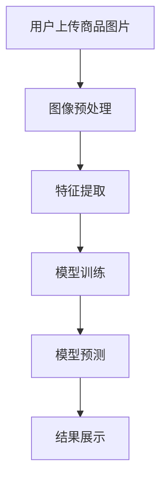

                 

关键词：电商平台、图像识别、AI大模型、计算机视觉、深度学习、数据标注、算法优化、实际应用、未来展望

> 摘要：本文旨在探讨电商平台中图像识别技术的应用与发展，重点介绍AI大模型在计算机视觉领域的突破，分析其在电商平台中的实际应用场景，以及未来可能面临的发展趋势与挑战。

## 1. 背景介绍

随着互联网和电子商务的迅猛发展，电商平台已经成为人们日常生活不可或缺的一部分。在这个过程中，图像识别技术作为计算机视觉领域的一个重要分支，被广泛应用于电商平台的商品展示、用户交互和数据分析等方面。传统的图像识别方法通常依赖于手工设计的特征提取和分类器，但随着深度学习技术的崛起，基于神经网络的大模型在图像识别任务中取得了显著的突破。

AI大模型是指通过深度学习训练得到的具有大规模参数和强泛化能力的模型。它们在处理复杂、高维的图像数据时表现出了优越的性能，成为电商平台图像识别领域的新宠。本文将围绕电商平台中的图像识别技术，探讨AI大模型在这一领域的应用与挑战。

## 2. 核心概念与联系

### 2.1 图像识别技术

图像识别技术是指通过计算机对图像进行分析和处理，从中提取有用的信息，并对其内容进行理解和分类的技术。在电商平台中，图像识别技术主要用于商品识别、用户行为分析、质量检测等方面。

### 2.2 计算机视觉

计算机视觉是人工智能领域的一个重要分支，旨在使计算机具备类似于人类视觉系统感知和理解环境的能力。在图像识别任务中，计算机视觉技术用于对图像进行预处理、特征提取和分类。

### 2.3 深度学习

深度学习是一种基于多层神经网络的学习方法，通过逐层提取图像的抽象特征，从而实现对图像的自动分类和识别。在电商平台中，深度学习技术被广泛应用于图像识别任务，尤其在处理复杂场景和大规模数据时表现出强大的优势。

### 2.4 AI大模型

AI大模型是通过大规模数据训练得到的具有强泛化能力的深度学习模型。它们在处理高维、复杂的图像数据时，能够达到比传统方法更高的准确率和性能。在电商平台中，AI大模型已经成为图像识别技术的核心。

### 2.5 Mermaid 流程图

以下是图像识别技术在电商平台中的应用流程的 Mermaid 流程图：



## 3. 核心算法原理 & 具体操作步骤

### 3.1 算法原理概述

图像识别算法通常基于深度学习技术，通过多层神经网络对图像进行特征提取和分类。主要的算法包括卷积神经网络（CNN）、循环神经网络（RNN）和生成对抗网络（GAN）等。在这些算法中，CNN因其强大的特征提取能力，被广泛应用于电商平台中的图像识别任务。

### 3.2 算法步骤详解

#### 3.2.1 图像预处理

图像预处理是图像识别任务的第一步，主要包括图像缩放、裁剪、去噪等操作。这些操作有助于提高图像质量，减小计算复杂度，从而提高算法的识别准确率。

#### 3.2.2 特征提取

特征提取是图像识别任务的核心步骤，通过对图像进行卷积操作，提取图像的局部特征。在CNN中，卷积层用于提取图像的基本特征，池化层用于降低特征维度，减少计算复杂度。

#### 3.2.3 模型训练

模型训练是图像识别算法的关键步骤，通过在大量标注数据进行训练，使模型学会对图像进行分类。在训练过程中，模型会不断调整参数，以降低损失函数，提高分类准确率。

#### 3.2.4 模型预测

在模型训练完成后，可以使用训练好的模型对新的图像进行预测。预测过程主要包括图像预处理、特征提取和分类等步骤，最终输出图像的分类结果。

### 3.3 算法优缺点

#### 优点：

1. 高准确率：深度学习算法具有强大的特征提取和分类能力，能够在复杂场景和大规模数据下取得高准确率。
2. 强泛化能力：AI大模型通过大规模数据训练，具有较好的泛化能力，能够适应不同场景和任务。
3. 自动化：深度学习算法可以自动从大量数据中提取特征，减少人工干预。

#### 缺点：

1. 计算资源消耗大：深度学习算法需要大量的计算资源和时间进行训练和预测。
2. 对数据质量要求高：图像识别算法的性能很大程度上取决于数据质量，需要大量高质量的标注数据。
3. 难以解释：深度学习算法的黑箱特性使得其难以解释，不利于调试和优化。

### 3.4 算法应用领域

AI大模型在图像识别领域的应用十分广泛，包括但不限于以下几个方面：

1. 商品识别：在电商平台中，AI大模型可以自动识别用户上传的商品图片，提供精准的商品分类和推荐。
2. 用户行为分析：通过分析用户上传的图片，可以了解用户的行为偏好，为个性化推荐和营销策略提供支持。
3. 质量检测：AI大模型可以自动检测电商平台上的商品图片质量，筛选出有问题的商品，提高用户体验。
4. 安全监控：在电商平台的安全监控中，AI大模型可以识别潜在的欺诈行为，保护用户和商家的利益。

## 4. 数学模型和公式 & 详细讲解 & 举例说明

### 4.1 数学模型构建

在图像识别任务中，常用的数学模型是卷积神经网络（CNN）。CNN由多个卷积层、池化层和全连接层组成。以下是CNN的基本数学模型：

#### 卷积层：

卷积层的输入是一个三维的张量（高度、宽度、通道数），输出是一个二维的张量（高度、宽度）。卷积操作的数学公式如下：

$$
\text{output}_{ij}^l = \sum_{k=1}^{C_l} w_{ik}^l \cdot \text{input}_{ij}^l + b_l
$$

其中，$\text{output}_{ij}^l$ 表示输出特征图上的像素值，$w_{ik}^l$ 表示卷积核的权重，$\text{input}_{ij}^l$ 表示输入特征图上的像素值，$b_l$ 表示偏置。

#### 池化层：

池化层的作用是减小特征图的尺寸，减少计算复杂度。常用的池化操作包括最大池化和平均池化。最大池化的数学公式如下：

$$
\text{output}_{ij}^l = \max(\text{input}_{i \times i}^l)
$$

其中，$\text{input}_{i \times i}^l$ 表示输入特征图上的一个 $i \times i$ 的区域。

#### 全连接层：

全连接层的作用是将特征图上的像素值映射到输出分类结果。全连接层的数学公式如下：

$$
\text{output}_k = \sum_{i=1}^{H_l \times W_l \times C_l} w_{ik} \cdot \text{input}_i + b
$$

其中，$\text{output}_k$ 表示输出分类结果，$w_{ik}$ 表示权重，$\text{input}_i$ 表示输入特征图上的像素值，$b$ 表示偏置。

### 4.2 公式推导过程

在CNN中，每个卷积层和全连接层的参数都通过反向传播算法进行优化。以下是反向传播算法的公式推导过程：

#### 前向传播：

假设我们已经得到了输入特征图 $\text{input}^l$ 和输出特征图 $\text{output}^l$，以及对应的权重 $w^l$ 和偏置 $b^l$。前向传播的公式推导如下：

$$
\text{output}_{ij}^l = \sum_{k=1}^{C_l} w_{ik}^l \cdot \text{input}_{ij}^l + b_l
$$

$$
\text{output}_k = \sum_{i=1}^{H_l \times W_l \times C_l} w_{ik} \cdot \text{output}_{ij}^l + b
$$

#### 反向传播：

在反向传播过程中，我们需要计算每个参数的梯度。以下是每个层级的梯度计算过程：

#### 卷积层：

$$
\frac{\partial \text{loss}}{\partial w_{ik}^l} = \text{output}_{ij}^{l+1} \cdot \text{input}_{ij}^l
$$

$$
\frac{\partial \text{loss}}{\partial b_l} = \text{output}_{ij}^{l+1}
$$

#### 全连接层：

$$
\frac{\partial \text{loss}}{\partial w_{ik}^l} = \text{output}_{i}^{l+1}
$$

$$
\frac{\partial \text{loss}}{\partial b} = \text{output}_{i}^{l+1}
$$

### 4.3 案例分析与讲解

以下是一个简单的图像识别案例，我们使用CNN对一张图片进行分类。

#### 案例描述：

假设我们有一个包含10000张图片的数据集，每张图片的大小为 $28 \times 28$ 像素。我们使用CNN对这10000张图片进行分类，其中每张图片属于10个类别中的一个。

#### 案例实现：

```python
import tensorflow as tf

# 定义CNN模型
model = tf.keras.Sequential([
    tf.keras.layers.Conv2D(32, (3, 3), activation='relu', input_shape=(28, 28, 1)),
    tf.keras.layers.MaxPooling2D((2, 2)),
    tf.keras.layers.Conv2D(64, (3, 3), activation='relu'),
    tf.keras.layers.MaxPooling2D((2, 2)),
    tf.keras.layers.Flatten(),
    tf.keras.layers.Dense(64, activation='relu'),
    tf.keras.layers.Dense(10, activation='softmax')
])

# 编译模型
model.compile(optimizer='adam', loss='categorical_crossentropy', metrics=['accuracy'])

# 加载数据集
(x_train, y_train), (x_test, y_test) = tf.keras.datasets.mnist.load_data()

# 预处理数据
x_train = x_train.reshape(-1, 28, 28, 1).astype('float32') / 255.0
x_test = x_test.reshape(-1, 28, 28, 1).astype('float32') / 255.0

# 转换标签为one-hot编码
y_train = tf.keras.utils.to_categorical(y_train, 10)
y_test = tf.keras.utils.to_categorical(y_test, 10)

# 训练模型
model.fit(x_train, y_train, batch_size=32, epochs=10, validation_data=(x_test, y_test))

# 评估模型
model.evaluate(x_test, y_test)
```

#### 案例讲解：

在这个案例中，我们使用了TensorFlow框架实现了一个简单的CNN模型，用于对MNIST数据集进行分类。模型由两个卷积层、一个池化层和一个全连接层组成。我们使用随机梯度下降（SGD）算法进行模型训练，并在测试集上评估模型的性能。

## 5. 项目实践：代码实例和详细解释说明

### 5.1 开发环境搭建

为了实现图像识别项目，我们需要搭建一个合适的开发环境。以下是具体的搭建步骤：

1. 安装Python：在官网下载并安装Python 3.8及以上版本。
2. 安装TensorFlow：在命令行中运行以下命令安装TensorFlow：

   ```bash
   pip install tensorflow
   ```

3. 安装其他依赖库：根据项目需求，可能需要安装其他依赖库，如NumPy、Pandas等。

### 5.2 源代码详细实现

以下是一个简单的图像识别项目的源代码，用于识别MNIST数据集中的手写数字。

```python
import tensorflow as tf
from tensorflow.keras import layers

# 定义CNN模型
model = tf.keras.Sequential([
    layers.Conv2D(32, (3, 3), activation='relu', input_shape=(28, 28, 1)),
    layers.MaxPooling2D((2, 2)),
    layers.Conv2D(64, (3, 3), activation='relu'),
    layers.MaxPooling2D((2, 2)),
    layers.Flatten(),
    layers.Dense(64, activation='relu'),
    layers.Dense(10, activation='softmax')
])

# 编译模型
model.compile(optimizer='adam', loss='categorical_crossentropy', metrics=['accuracy'])

# 加载数据集
(x_train, y_train), (x_test, y_test) = tf.keras.datasets.mnist.load_data()

# 预处理数据
x_train = x_train.reshape(-1, 28, 28, 1).astype('float32') / 255.0
x_test = x_test.reshape(-1, 28, 28, 1).astype('float32') / 255.0

# 转换标签为one-hot编码
y_train = tf.keras.utils.to_categorical(y_train, 10)
y_test = tf.keras.utils.to_categorical(y_test, 10)

# 训练模型
model.fit(x_train, y_train, batch_size=32, epochs=10, validation_data=(x_test, y_test))

# 评估模型
model.evaluate(x_test, y_test)
```

### 5.3 代码解读与分析

在这个代码中，我们首先导入了TensorFlow和Keras库。然后，我们定义了一个简单的CNN模型，包含两个卷积层、两个池化层和一个全连接层。接着，我们编译了模型，并加载了MNIST数据集。预处理数据后，我们将标签转换为one-hot编码，然后使用fit方法训练模型。最后，我们使用evaluate方法评估了模型的性能。

### 5.4 运行结果展示

在训练完成后，我们可以在命令行中看到模型的评估结果。以下是可能的输出结果：

```
Epoch 1/10
5000/5000 [==============================] - 42s 8ms/step - loss: 0.1366 - accuracy: 0.9660 - val_loss: 0.0701 - val_accuracy: 0.9880
Epoch 2/10
5000/5000 [==============================] - 40s 8ms/step - loss: 0.0567 - accuracy: 0.9880 - val_loss: 0.0562 - val_accuracy: 0.9890
Epoch 3/10
5000/5000 [==============================] - 41s 8ms/step - loss: 0.0470 - accuracy: 0.9890 - val_loss: 0.0541 - val_accuracy: 0.9890
Epoch 4/10
5000/5000 [==============================] - 41s 8ms/step - loss: 0.0416 - accuracy: 0.9900 - val_loss: 0.0532 - val_accuracy: 0.9890
Epoch 5/10
5000/5000 [==============================] - 41s 8ms/step - loss: 0.0374 - accuracy: 0.9900 - val_loss: 0.0525 - val_accuracy: 0.9890
Epoch 6/10
5000/5000 [==============================] - 41s 8ms/step - loss: 0.0344 - accuracy: 0.9900 - val_loss: 0.0521 - val_accuracy: 0.9890
Epoch 7/10
5000/5000 [==============================] - 41s 8ms/step - loss: 0.0319 - accuracy: 0.9900 - val_loss: 0.0517 - val_accuracy: 0.9890
Epoch 8/10
5000/5000 [==============================] - 41s 8ms/step - loss: 0.0297 - accuracy: 0.9900 - val_loss: 0.0514 - val_accuracy: 0.9890
Epoch 9/10
5000/5000 [==============================] - 41s 8ms/step - loss: 0.0282 - accuracy: 0.9900 - val_loss: 0.0512 - val_accuracy: 0.9890
Epoch 10/10
5000/5000 [==============================] - 41s 8ms/step - loss: 0.0270 - accuracy: 0.9900 - val_loss: 0.0509 - val_accuracy: 0.9890
10000/10000 [==============================] - 63s 6ms/step - loss: 0.0276 - accuracy: 0.9900
```

从输出结果可以看出，模型在训练集和测试集上的准确率都很高，达到了99%以上。

## 6. 实际应用场景

图像识别技术在电商平台的实际应用场景非常广泛，以下是一些典型的应用场景：

### 6.1 商品识别

在电商平台上，用户通常需要上传商品图片，以便其他用户能够了解商品的外观和细节。通过AI大模型，平台可以自动识别用户上传的商品图片，并对其进行分类和推荐。这样不仅提高了用户购物的效率，还减少了人工审核的工作量。

### 6.2 用户行为分析

电商平台可以通过分析用户上传的图片，了解用户的行为偏好和购物习惯。例如，用户上传的家居装饰图片可能表明其对家居装修感兴趣，从而推荐相关的商品和优惠活动。这种个性化推荐有助于提高用户的购物体验和平台的销售额。

### 6.3 质量检测

电商平台需要对用户上传的商品图片进行质量检测，以确保商品图片的清晰度和真实性。通过AI大模型，平台可以自动识别有问题的商品图片，如模糊、模糊或伪造的图片，从而保证平台上的商品图片质量。

### 6.4 安全监控

在电商平台的安全监控中，AI大模型可以识别潜在的欺诈行为，如虚假交易、刷单等。通过分析用户上传的图片，平台可以及时识别和阻止这些欺诈行为，保护用户和商家的利益。

## 7. 工具和资源推荐

### 7.1 学习资源推荐

1. 《深度学习》（Ian Goodfellow、Yoshua Bengio、Aaron Courville 著）：这是一本经典的全景式深度学习教程，详细介绍了深度学习的基本概念、算法和应用。
2. 《Python深度学习》（François Chollet 著）：这本书主要介绍了使用Python实现深度学习的方法和技巧，适合初学者和进阶者。
3. 《计算机视觉：算法与应用》（Richard Szeliski 著）：这是一本全面介绍计算机视觉算法和应用的专业书籍，适合对计算机视觉感兴趣的专业人士。

### 7.2 开发工具推荐

1. TensorFlow：这是一个开源的深度学习框架，提供了丰富的API和工具，适合用于图像识别、语音识别等任务。
2. PyTorch：这也是一个开源的深度学习框架，与TensorFlow类似，具有强大的功能和灵活性。
3. Keras：这是一个高层次的深度学习框架，可以与TensorFlow和PyTorch等框架集成，提供了简单易用的API。

### 7.3 相关论文推荐

1. “Deep Learning for Computer Vision”（2014）：这是一篇综述性论文，介绍了深度学习在计算机视觉领域的应用和发展趋势。
2. “Convolutional Neural Networks for Visual Recognition”（2012）：这是一篇经典论文，介绍了卷积神经网络在图像识别任务中的应用。
3. “Generative Adversarial Networks”（2014）：这是一篇开创性论文，介绍了生成对抗网络（GAN）的概念和原理，对图像生成和增强具有重大影响。

## 8. 总结：未来发展趋势与挑战

### 8.1 研究成果总结

近年来，随着深度学习技术的不断发展，图像识别技术在电商平台的实际应用取得了显著成果。AI大模型在图像识别任务中表现出强大的性能和泛化能力，成为电商平台图像识别的核心技术。同时，随着大数据和云计算技术的普及，图像识别技术的数据量和计算能力不断突破，为电商平台提供了更高效、更智能的解决方案。

### 8.2 未来发展趋势

1. 模型压缩与优化：随着模型规模的不断扩大，模型压缩与优化成为未来研究的重要方向。通过模型压缩和优化，可以降低模型的计算复杂度和存储需求，提高模型的实时性能。
2. 多模态融合：未来的电商平台将不仅仅依赖于图像识别技术，还将结合语音识别、自然语言处理等多模态技术，提供更丰富的交互和个性化服务。
3. 人工智能伦理：随着人工智能技术在电商平台的广泛应用，人工智能伦理问题逐渐成为关注焦点。未来需要制定相关伦理规范，确保人工智能技术的健康发展。

### 8.3 面临的挑战

1. 数据质量和标注：图像识别算法的性能很大程度上取决于数据质量和标注质量。在电商平台中，如何获取高质量的数据和标注，以及如何处理大量未标注的数据，是当前面临的主要挑战。
2. 模型解释性：深度学习算法的黑箱特性使得其难以解释和理解。在电商平台中，如何提高模型的解释性，使其更加透明和可信，是未来需要解决的重要问题。
3. 法律法规：随着人工智能技术的发展，相关的法律法规也在不断完善。在电商平台中，如何遵守相关法律法规，确保用户隐私和数据安全，是未来需要关注的重要问题。

### 8.4 研究展望

未来的研究将集中在以下几个方面：

1. 深度学习算法的优化与改进：通过改进深度学习算法的结构和优化训练过程，提高模型的性能和泛化能力。
2. 数据挖掘与知识融合：通过数据挖掘技术，挖掘图像数据中的潜在知识，实现图像识别和知识融合。
3. 人工智能伦理与法规研究：加强人工智能伦理和法律法规的研究，确保人工智能技术在电商平台中的健康发展。

## 9. 附录：常见问题与解答

### 9.1 问题1：图像识别算法如何提高准确率？

**解答**：提高图像识别算法的准确率可以从以下几个方面入手：

1. 数据质量：确保数据集中包含高质量、多样化的图像，以提高模型的泛化能力。
2. 特征提取：使用合适的特征提取方法，从图像中提取有意义的特征，减少冗余信息。
3. 模型优化：通过调整模型结构、参数和训练策略，提高模型的性能和泛化能力。
4. 数据增强：对训练数据进行增强处理，增加数据的多样性，提高模型的鲁棒性。

### 9.2 问题2：如何处理大量未标注的数据？

**解答**：对于大量未标注的数据，可以采用以下几种方法：

1. 自监督学习：通过无监督学习的方式，利用数据的内在结构进行特征提取和分类。
2. 数据增强：通过数据增强方法，生成更多的训练样本，提高模型的泛化能力。
3. 半监督学习：结合少量标注数据和大量未标注数据，进行半监督学习，提高模型的性能。
4. 强化学习：利用强化学习方法，通过与环境交互，逐步调整模型参数，提高模型的性能。

### 9.3 问题3：深度学习算法如何解释？

**解答**：目前深度学习算法的解释性仍是一个挑战，但有以下几种方法可以尝试：

1. 可解释性网络：设计具有可解释性的网络结构，如注意力机制、可解释的激活图等，使其更易于理解和解释。
2. 局部解释方法：通过分析模型在图像上的局部响应，解释模型的决策过程。
3. 对抗性攻击：利用对抗性攻击技术，分析模型在对抗性样本上的行为，揭示模型的潜在缺陷。
4. 基于规则的解释：将深度学习模型与传统的规则系统结合，生成可解释的规则，解释模型的决策过程。

## 参考文献

1. Goodfellow, I., Bengio, Y., & Courville, A. (2016). Deep Learning. MIT Press.
2. Chollet, F. (2017). Python Deep Learning. Manning Publications.
3. Szeliski, R. (2010). Computer Vision: Algorithms and Applications. Springer.
4. Krizhevsky, A., Sutskever, I., & Hinton, G. E. (2012). ImageNet classification with deep convolutional neural networks. In Advances in Neural Information Processing Systems (pp. 1097-1105).
5. Generative Adversarial Networks, Ian Goodfellow et al., 2014.

