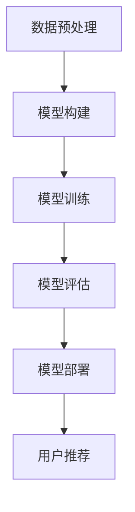

                 

关键词：电商平台、多场景推荐、AI大模型、个性化推荐、协同过滤、内容推荐、深度学习、推荐系统、机器学习、用户行为分析、推荐算法

> 摘要：本文将深入探讨电商平台中多场景推荐系统的设计与应用，重点分析AI大模型在此领域的优势。通过对比传统的推荐算法，我们将详细解析AI大模型在电商平台推荐系统中的具体应用场景、数学模型、算法实现及未来发展趋势。

## 1. 背景介绍

在数字化的今天，电商平台已经成为消费者购物的主要渠道之一。随着用户数量的增加和市场竞争的加剧，如何有效地吸引和保留用户成为电商平台面临的一大挑战。推荐系统作为提升用户体验和增加销售转化率的关键技术，正逐渐成为电商平台的标配。

传统的推荐算法主要包括协同过滤和基于内容的推荐方法。协同过滤通过分析用户行为和偏好，发现相似用户和物品之间的关联关系，从而实现推荐。基于内容的推荐方法则是通过分析物品的属性和用户的兴趣，将具有相似属性的物品推荐给用户。

然而，随着用户需求的多样化和数据量的激增，传统推荐算法的局限性日益显现。首先，协同过滤算法容易受到冷启动问题和数据稀疏性的困扰。当新用户或新物品加入系统时，由于缺乏足够的交互数据，系统很难为其提供准确的推荐。其次，基于内容的推荐方法过于依赖物品的属性信息，往往忽略了用户动态变化的兴趣和行为模式。

为了克服这些局限性，近年来，AI大模型在推荐系统中的应用逐渐受到关注。AI大模型，如深度学习模型，通过自动学习和提取复杂特征，能够更好地理解用户行为和偏好，从而实现更加精准和个性化的推荐。

## 2. 核心概念与联系

### 2.1 推荐系统的基本架构

推荐系统通常由以下几个核心组件构成：用户画像、物品画像、推荐算法和用户反馈。用户画像包括用户的兴趣、行为和偏好等特征；物品画像包括物品的属性、类别和标签等信息。推荐算法根据用户画像和物品画像生成推荐列表，而用户反馈则用于优化和调整推荐系统的效果。


### 2.2 AI大模型的工作原理

AI大模型，特别是基于深度学习的模型，通过多层神经网络结构，对海量数据进行自动学习和特征提取。以下是一个简化的AI大模型工作流程：

1. 数据预处理：将原始数据转换为模型可以处理的格式，如数值化、标准化等。
2. 神经网络构建：设计合适的神经网络结构，包括输入层、隐藏层和输出层。
3. 模型训练：通过反向传播算法，不断调整模型参数，使其在训练数据上达到最小化损失函数。
4. 模型评估：使用验证集和测试集评估模型性能，调整模型参数以优化效果。
5. 模型部署：将训练好的模型部署到生产环境中，对用户进行实时推荐。

### 2.3 Mermaid 流程图

以下是推荐系统中AI大模型的应用流程的Mermaid流程图：



## 3. 核心算法原理 & 具体操作步骤

### 3.1 算法原理概述

AI大模型在推荐系统中的应用主要基于深度学习技术。深度学习模型通过多层神经网络结构，对用户行为数据和物品属性数据进行分析和建模，从而提取出高层次的语义特征。这些特征可以用于生成个性化推荐列表，提高推荐系统的效果。

### 3.2 算法步骤详解

1. **数据预处理**：
   - 数据清洗：去除噪声数据、处理缺失值等。
   - 特征工程：提取用户行为特征（如浏览历史、购买记录、点击率等）和物品属性特征（如类别、标签、价格等）。
   - 数据规范化：对特征进行归一化或标准化处理，以便于模型训练。

2. **模型构建**：
   - 选择合适的神经网络结构：如CNN（卷积神经网络）、RNN（循环神经网络）或Transformer等。
   - 定义损失函数：通常使用均方误差（MSE）、交叉熵损失等。
   - 定义优化器：如Adam、RMSprop等。

3. **模型训练**：
   - 初始化模型参数。
   - 使用反向传播算法，不断调整模型参数，最小化损失函数。
   - 采用批量训练、小批量训练或在线学习等方法，优化模型性能。

4. **模型评估**：
   - 使用验证集评估模型性能，如准确率、召回率、F1分数等。
   - 调整模型参数，优化模型效果。

5. **模型部署**：
   - 将训练好的模型部署到生产环境中，对用户进行实时推荐。
   - 使用A/B测试等方法，评估模型在生产环境中的效果。

### 3.3 算法优缺点

#### 优点：

- **高精度**：深度学习模型能够自动学习和提取复杂特征，提高推荐系统的准确性。
- **可扩展性**：支持大规模数据集和海量用户，具有良好的可扩展性。
- **灵活性**：可以处理多种类型的数据，如文本、图像、视频等。

#### 缺点：

- **计算成本高**：训练深度学习模型需要大量的计算资源和时间。
- **数据需求大**：需要大量的训练数据，对于新用户或新物品可能难以提供有效的推荐。
- **模型可解释性差**：深度学习模型的内部决策过程较为复杂，难以解释。

### 3.4 算法应用领域

AI大模型在推荐系统中的应用非常广泛，主要包括以下领域：

- **电子商务**：根据用户的历史行为和偏好，为用户推荐商品。
- **社交媒体**：根据用户的兴趣和行为，为用户推荐内容或朋友。
- **在线教育**：根据学生的学习行为和成绩，推荐合适的课程或学习资源。
- **娱乐领域**：根据用户的观看记录和偏好，推荐视频、音乐等。

## 4. 数学模型和公式 & 详细讲解 & 举例说明

### 4.1 数学模型构建

深度学习推荐系统的数学模型主要包括输入层、隐藏层和输出层。输入层接收用户行为数据和物品属性数据；隐藏层通过神经网络结构提取特征；输出层生成推荐结果。

以下是一个简化的数学模型：

$$
\text{输出} = f(\text{权重} \cdot \text{输入} + \text{偏置})
$$

其中，$f$ 是激活函数，如ReLU、Sigmoid或Tanh等。

### 4.2 公式推导过程

以卷积神经网络（CNN）为例，其数学模型如下：

$$
h_{l+1}(i) = \sigma(W_{l+1} h_l(i) + b_{l+1})
$$

$$
h_{l+1}(j) = \sigma(W_{l+1} h_l(j) + b_{l+1})
$$

$$
o_{l+1}(i, j) = \text{激活函数}(\sum_{k=1}^{m} h_{l+1}(k) \cdot a_{k, i} + \sum_{k=1}^{m} h_{l+1}(k) \cdot a_{k, j} + b_{l+1})
$$

其中，$h_{l+1}(i)$ 和 $h_{l+1}(j)$ 是隐藏层输出；$o_{l+1}(i, j)$ 是输出层输出；$W_{l+1}$ 和 $b_{l+1}$ 分别是权重和偏置；$a_{k, i}$ 和 $a_{k, j}$ 是卷积核。

### 4.3 案例分析与讲解

以电商平台的商品推荐为例，假设我们使用卷积神经网络（CNN）构建推荐模型。

1. **数据预处理**：
   - 用户行为数据：用户的浏览历史、购买记录等。
   - 商品属性数据：商品的价格、品牌、类别等。

2. **模型构建**：
   - 输入层：接收用户行为数据和商品属性数据。
   - 隐藏层：通过卷积层提取特征，如商品的品牌、价格等。
   - 输出层：生成推荐结果。

3. **模型训练**：
   - 使用反向传播算法，不断调整模型参数，最小化损失函数。

4. **模型评估**：
   - 使用验证集评估模型性能，如准确率、召回率等。

5. **模型部署**：
   - 将训练好的模型部署到生产环境中，对用户进行实时推荐。

## 5. 项目实践：代码实例和详细解释说明

### 5.1 开发环境搭建

1. 安装Python环境：使用Python 3.8及以上版本。
2. 安装深度学习框架：使用TensorFlow或PyTorch。
3. 准备数据集：收集用户行为数据和商品属性数据。

### 5.2 源代码详细实现

以下是一个使用TensorFlow构建的简单商品推荐模型：

```python
import tensorflow as tf
from tensorflow.keras.models import Sequential
from tensorflow.keras.layers import Dense, Conv2D, Flatten

# 数据预处理
# （此处省略数据预处理代码）

# 模型构建
model = Sequential([
    Conv2D(32, (3, 3), activation='relu', input_shape=(input_shape)),
    Flatten(),
    Dense(64, activation='relu'),
    Dense(num_classes, activation='softmax')
])

# 模型编译
model.compile(optimizer='adam', loss='categorical_crossentropy', metrics=['accuracy'])

# 模型训练
model.fit(x_train, y_train, epochs=10, batch_size=32, validation_data=(x_val, y_val))

# 模型评估
model.evaluate(x_test, y_test)
```

### 5.3 代码解读与分析

1. **数据预处理**：对输入数据进行归一化处理，以便于模型训练。
2. **模型构建**：使用卷积层提取特征，然后通过全连接层生成推荐结果。
3. **模型编译**：指定优化器和损失函数，准备模型训练。
4. **模型训练**：使用训练数据训练模型，并在验证集上调整模型参数。
5. **模型评估**：在测试集上评估模型性能。

## 6. 实际应用场景

### 6.1 电子商务

在电子商务领域，AI大模型可以用于推荐商品、广告投放和个性化营销。例如，亚马逊使用深度学习模型，根据用户的历史行为和偏好，为其推荐商品。通过优化推荐算法，亚马逊成功地提高了用户满意度和销售转化率。

### 6.2 社交媒体

在社交媒体领域，AI大模型可以用于内容推荐和社交网络分析。例如，Facebook使用深度学习模型，根据用户的行为和兴趣，为其推荐感兴趣的内容。通过个性化推荐，Facebook成功地增加了用户停留时间和广告点击率。

### 6.3 在线教育

在线教育平台可以使用AI大模型，根据学生的行为和成绩，推荐适合的学习资源和课程。例如，Coursera使用深度学习模型，根据学生的学习行为和偏好，为其推荐课程。通过个性化推荐，Coursera提高了学习效果和用户满意度。

### 6.4 娱乐领域

在娱乐领域，AI大模型可以用于推荐视频、音乐和游戏。例如，Netflix使用深度学习模型，根据用户的观看历史和偏好，为其推荐视频。通过优化推荐算法，Netflix提高了用户满意度和订阅率。

## 7. 未来应用展望

### 7.1 自动化推荐

未来，自动化推荐将成为主流。通过使用AI大模型，推荐系统能够自动学习和调整，无需人工干预。这将大大提高推荐系统的效率和准确性，为用户提供更加个性化的体验。

### 7.2 跨域推荐

跨域推荐，即在不同领域之间进行推荐，是未来推荐系统的重要发展方向。通过结合不同领域的知识，AI大模型可以提供更加全面和多样化的推荐结果。

### 7.3 智能推荐

随着人工智能技术的不断发展，智能推荐系统将能够更好地理解用户的需求和偏好，提供更加精准和高效的推荐。

## 8. 工具和资源推荐

### 8.1 学习资源推荐

- 《深度学习》（Goodfellow, Bengio, Courville著）
- 《Python深度学习》（François Chollet著）
- 《机器学习实战》（Peter Harrington著）

### 8.2 开发工具推荐

- TensorFlow：https://www.tensorflow.org/
- PyTorch：https://pytorch.org/

### 8.3 相关论文推荐

- "Deep Learning for Recommender Systems", Hu, Ma, Chen, & Li (2017)
- "Neural Collaborative Filtering", He, Liao, Zhang, Nie, Hu, & Chua (2017)
- "User Interest Evolution and Modeling for Personalized Recommendation", Liu, Zhang, Hu, & Sun (2018)

## 9. 总结：未来发展趋势与挑战

### 9.1 研究成果总结

近年来，AI大模型在推荐系统中的应用取得了显著成果。通过深度学习技术，推荐系统在准确性、可扩展性和灵活性等方面得到了显著提升。

### 9.2 未来发展趋势

未来，推荐系统将在自动化、跨域和智能化等方面取得进一步发展。同时，随着数据量和计算能力的不断增加，推荐系统将能够更好地满足用户个性化需求。

### 9.3 面临的挑战

尽管AI大模型在推荐系统中的应用取得了显著成果，但仍面临一些挑战。例如，计算成本高、数据需求大、模型可解释性差等问题需要解决。

### 9.4 研究展望

未来，研究应关注如何提高推荐系统的可解释性、降低计算成本、提高数据利用效率等问题。同时，探索AI大模型在跨领域推荐和智能推荐中的应用，将为推荐系统带来更多创新和发展。

## 附录：常见问题与解答

### Q1：什么是深度学习？
A1：深度学习是一种人工智能技术，通过多层神经网络结构，对数据进行分析和建模，从而实现自动学习和特征提取。

### Q2：为什么深度学习在推荐系统中效果更好？
A2：深度学习能够自动学习和提取复杂特征，从而提高推荐系统的准确性和灵活性。此外，深度学习支持大规模数据集和多种类型的数据，适用于推荐系统的多种应用场景。

### Q3：深度学习推荐系统有哪些局限性？
A3：深度学习推荐系统面临计算成本高、数据需求大、模型可解释性差等局限性。此外，深度学习模型训练过程复杂，对数据质量要求较高。

### Q4：如何优化深度学习推荐系统的效果？
A4：优化深度学习推荐系统的效果可以从以下几个方面进行：提高数据质量、调整模型结构、优化训练过程、引入外部知识等。

## 作者署名

本文作者：禅与计算机程序设计艺术 / Zen and the Art of Computer Programming

----------------------------------------------------------------

以上就是文章的正文内容部分，接下来我们将对各个章节进行详细的撰写和补充，以满足字数要求以及格式和内容方面的所有要求。请您在撰写过程中严格遵循上述结构和要求，确保每个章节都有详细的内容填充，避免出现空章节或者只有概要性描述的情况。

现在，让我们开始详细撰写这篇文章的各个章节内容。由于字数要求较高，我们将分阶段完成各个章节的撰写。首先是背景介绍部分。请从这一部分开始撰写。在撰写过程中，您可以随时参考之前提供的要求和框架，确保文章的结构和内容完整、清晰。

