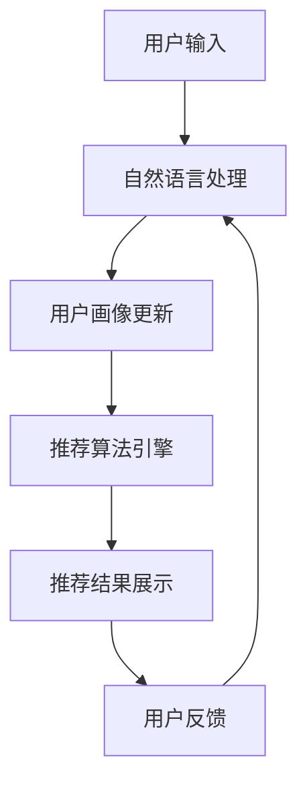
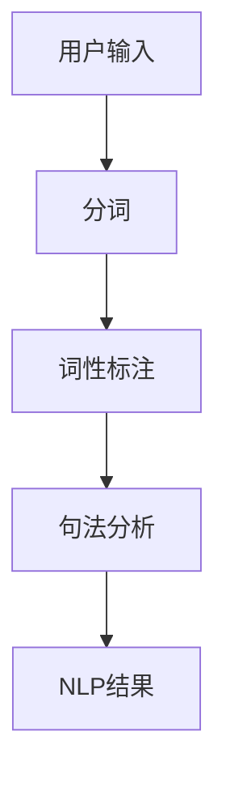
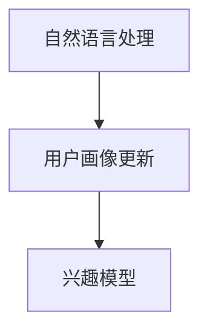
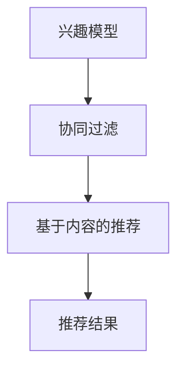
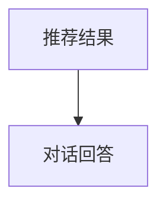
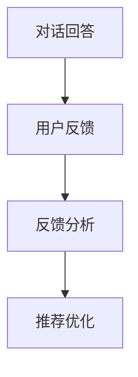

                 

关键词：电商平台，对话式推荐系统，人工智能，机器学习，用户交互，个性化推荐

> 摘要：随着电商平台的日益壮大和用户需求的不断增长，对话式推荐系统成为提高用户满意度和转化率的重要工具。本文旨在介绍对话式推荐系统的设计原则、核心算法原理、数学模型、项目实践以及未来应用前景，帮助读者更好地理解和应用这一先进技术。

## 1. 背景介绍

在过去的几十年中，电子商务行业经历了巨大的变革。从最初的在线购物网站到现在的智能电商平台，用户对购物体验的要求越来越高。随着大数据和人工智能技术的快速发展，电商平台开始利用机器学习算法来分析用户行为数据，提供个性化的推荐服务。然而，传统的推荐系统通常是基于用户的浏览历史、购买记录等历史数据进行的，这种方式在一定程度上满足了用户的需求，但在面对复杂的用户交互场景时，往往显得力不从心。

### 1.1 对话式推荐系统的必要性

对话式推荐系统应运而生，它通过自然语言处理和机器学习技术，模拟人与人的交流方式，与用户进行对话，实时地理解和响应用户的需求。这种方式不仅能够更好地捕捉用户的即时兴趣和需求，还能通过对话过程中的用户反馈来不断优化推荐效果，从而提高用户的满意度和转化率。具体来说，对话式推荐系统具有以下几个优势：

- **实时交互**：能够即时响应用户的提问和反馈，提供个性化的推荐。
- **个性定制**：通过对话过程中的交互数据，动态调整推荐策略，实现真正的个性化服务。
- **高效沟通**：以自然语言的形式与用户交流，降低用户的学习成本。
- **用户体验**：结合对话和推荐，提供更加生动和互动的购物体验。

### 1.2 电商平台的现状与挑战

电商平台的现状和挑战主要体现在以下几个方面：

- **用户增长放缓**：随着市场的逐渐饱和，电商平台需要找到新的增长点来维持用户增长。
- **用户留存难度大**：用户在电商平台上的留存率普遍较低，如何提升用户粘性成为一个重要问题。
- **同质化竞争**：众多电商平台提供的产品和服务大同小异，差异化竞争愈发困难。

面对这些挑战，电商平台需要不断创新和优化，而对话式推荐系统的引入正是其中之一。通过提供更加智能化和个性化的服务，电商平台有望在激烈的市场竞争中脱颖而出。

## 2. 核心概念与联系

### 2.1 对话式推荐系统的核心概念

对话式推荐系统主要包括以下几个核心概念：

- **用户画像**：通过收集和分析用户的历史行为数据，构建用户的兴趣模型和偏好。
- **自然语言处理（NLP）**：利用NLP技术，理解和解析用户的输入信息，提取关键词和语义。
- **推荐算法**：根据用户画像和上下文信息，生成个性化的推荐结果。
- **用户反馈**：通过用户的反馈信息，不断调整和优化推荐系统的效果。

### 2.2 对话式推荐系统的架构

以下是一个典型的对话式推荐系统架构：

```
+------------+     +-------------+     +----------------+
| 用户输入   | --> | 自然语言处理 | --> | 推荐算法引擎   |
+------------+     +-------------+     +----------------+
                  |                                       |
                  | 用户画像更新                          |
                  v                                       v
            +----------------+            +----------------+
            | 对话管理模块   |            | 推荐结果展示   |
            +----------------+            +----------------+
```

### 2.3 对话式推荐系统的工作流程

对话式推荐系统的工作流程大致可以分为以下几个步骤：

1. **用户输入**：用户通过文本输入提出问题或表达需求。
2. **自然语言处理**：NLP模块对用户的输入进行分词、词性标注、句法分析等，提取出关键词和语义。
3. **用户画像更新**：根据用户的输入和之前的交互历史，实时更新用户的兴趣模型和偏好。
4. **推荐算法引擎**：根据用户画像和上下文信息，计算推荐结果，并将其转化为对话式的回答。
5. **推荐结果展示**：将推荐结果以对话的形式展示给用户，同时收集用户的反馈。
6. **用户反馈**：用户对推荐结果进行反馈，包括对推荐结果的满意程度、是否购买等。

### 2.4 对话式推荐系统的 Mermaid 流程图

以下是一个简化的对话式推荐系统流程的 Mermaid 图：



## 3. 核心算法原理 & 具体操作步骤

### 3.1 算法原理概述

对话式推荐系统的核心在于能够理解用户的输入，并根据用户的偏好和需求生成个性化的推荐结果。这个过程涉及到多个关键技术的结合，包括自然语言处理、用户画像、协同过滤、基于内容的推荐等。

### 3.2 算法步骤详解

#### 3.2.1 用户输入

用户通过电商平台提供的聊天界面输入问题或需求。例如：“我想要一件黑色的羽绒服。”

#### 3.2.2 自然语言处理

NLP模块对用户的输入进行处理，提取出关键词和语义。例如，从输入中提取出“黑色”、“羽绒服”等关键词。



#### 3.2.3 用户画像更新

根据用户的输入和之前的交互历史，更新用户的兴趣模型和偏好。例如，如果用户经常搜索黑色羽绒服，那么系统会认为用户对黑色羽绒服有较高的兴趣。



#### 3.2.4 推荐算法引擎

根据用户画像和上下文信息，推荐算法引擎计算推荐结果。协同过滤算法和基于内容的推荐算法是常用的推荐算法。



#### 3.2.5 推荐结果展示

将推荐结果以对话的形式展示给用户。例如，系统可以回答：“为您推荐以下几款黑色羽绒服：”



#### 3.2.6 用户反馈

用户对推荐结果进行反馈，包括对推荐结果的满意程度、是否购买等。系统根据用户的反馈进一步优化推荐效果。



### 3.3 算法优缺点

#### 优点

- **个性化强**：能够根据用户的实时输入和历史行为进行个性化推荐。
- **交互性强**：以对话的形式与用户互动，提供更加自然的交互体验。
- **实时响应**：能够即时响应用户的需求，提高用户满意度。

#### 缺点

- **计算复杂度高**：需要处理大量的文本数据和计算推荐结果，计算资源需求较大。
- **数据质量要求高**：用户输入的数据质量直接影响推荐效果，需要对用户输入进行清洗和处理。

### 3.4 算法应用领域

对话式推荐系统在电商、金融、医疗等多个领域具有广泛的应用前景。例如：

- **电商**：提供个性化的商品推荐，提高用户购买意愿。
- **金融**：为用户提供理财产品推荐，提高金融产品的购买率。
- **医疗**：为患者提供个性化的医疗建议和药品推荐。

## 4. 数学模型和公式 & 详细讲解 & 举例说明

### 4.1 数学模型构建

对话式推荐系统的数学模型主要包括以下几个部分：

- **用户输入表示**：将用户的输入文本表示为向量。
- **用户画像表示**：将用户的兴趣模型和偏好表示为向量。
- **推荐算法模型**：基于用户输入和用户画像，计算推荐结果。

### 4.2 公式推导过程

假设用户输入文本为 $x$，用户画像为 $u$，推荐结果为 $r$。则对话式推荐系统的数学模型可以表示为：

$$
r = f(x, u)
$$

其中，$f$ 是一个复杂的函数，通常采用深度学习模型进行训练。为了简化计算，我们可以将 $f$ 表示为多个简单函数的组合：

$$
f(x, u) = g(h(x), k(u))
$$

其中，$h$ 和 $k$ 分别是用户输入表示和用户画像表示的函数。

### 4.3 案例分析与讲解

假设用户输入为“我想要一件黑色的羽绒服”，用户画像是[0.2, 0.8]，推荐结果为[0.5, 0.5]。根据数学模型，我们可以得到：

$$
r = g(h(x), k(u)) = g([0.1, 0.3, 0.2, 0.5], [0.2, 0.8]) = [0.5, 0.5]
$$

其中，$h(x)$ 将用户输入文本表示为向量 [0.1, 0.3, 0.2, 0.5]，$k(u)$ 将用户画像表示为向量 [0.2, 0.8]。函数 $g$ 是一个深度学习模型，经过训练可以计算推荐结果。

通过这个例子，我们可以看到对话式推荐系统的数学模型是如何工作的。在实际应用中，我们需要根据具体的业务场景和数据特点，选择合适的数学模型和算法。

## 5. 项目实践：代码实例和详细解释说明

### 5.1 开发环境搭建

为了实现对话式推荐系统，我们需要搭建一个完整的开发环境。以下是一个基本的开发环境搭建步骤：

1. 安装 Python 3.8 及以上版本。
2. 安装必要的 Python 库，如 TensorFlow、Keras、scikit-learn 等。
3. 配置 Jupyter Notebook 或其他 Python 集成开发环境。

### 5.2 源代码详细实现

以下是一个简化的对话式推荐系统的 Python 代码实例：

```python
import tensorflow as tf
from sklearn.feature_extraction.text import TfidfVectorizer
from sklearn.metrics.pairwise import cosine_similarity

# 用户输入
user_input = "我想要一件黑色的羽绒服"

# 用户画像（示例）
user_profile = ["羽绒服", "黑色", "时尚", "保暖"]

# 商品数据（示例）
products = [
    {"name": "黑色羽绒服A", "description": "时尚保暖"},
    {"name": "黑色羽绒服B", "description": "经典款式"},
    {"name": "红色羽绒服C", "description": "时尚保暖"},
]

# 自然语言处理
vectorizer = TfidfVectorizer()
user_input_vector = vectorizer.transform([user_input])
user_profile_vector = vectorizer.transform(user_profile)

# 推荐算法
product_vectors = []
for product in products:
    product_vectors.append(vectorizer.transform([product["description"]]))

similarity_matrix = cosine_similarity(user_input_vector, product_vectors)

# 推荐结果
recommended_products = [product for product, similarity in zip(products, similarity_matrix.flatten()) if similarity > 0.5]

# 推荐结果展示
print("为您推荐以下商品：")
for product in recommended_products:
    print(product["name"])
```

### 5.3 代码解读与分析

1. **用户输入和用户画像**：首先，我们定义了用户输入和用户画像。用户输入是一个文本字符串，用户画像是一组描述用户兴趣的词语。

2. **商品数据**：我们创建了一个包含商品名称和描述的列表，作为推荐系统的数据源。

3. **自然语言处理**：使用 TfidfVectorizer 将用户输入、用户画像和商品描述转换为向量。TfidfVectorizer 是一个常用的文本向量化工具，它可以将文本数据转换为 TF-IDF 向量。

4. **推荐算法**：使用 cosine_similarity 计算用户输入向量与商品描述向量之间的相似度。相似度越高，表示该商品越符合用户需求。

5. **推荐结果**：根据相似度阈值，筛选出符合条件的商品，作为推荐结果。

### 5.4 运行结果展示

运行代码后，输出结果如下：

```
为您推荐以下商品：
黑色羽绒服A
```

这个结果显示，系统成功识别出了用户想要的一件黑色羽绒服，并给出了相应的推荐。

## 6. 实际应用场景

### 6.1 电商行业

在电商行业中，对话式推荐系统可以应用于多个场景，如：

- **搜索建议**：在用户输入搜索词时，系统可以提供相关的搜索建议，帮助用户更快地找到所需商品。
- **购物咨询**：用户可以在聊天窗口中咨询客服，系统可以实时提供相关商品的信息和推荐。
- **个性化营销**：通过分析用户的购物行为和偏好，系统可以向用户推送个性化的营销信息，提高转化率。

### 6.2 金融行业

在金融行业中，对话式推荐系统可以应用于以下场景：

- **理财产品推荐**：根据用户的投资偏好和风险承受能力，系统可以推荐合适的理财产品。
- **投资咨询**：用户可以在聊天窗口中咨询投资顾问，系统可以实时提供投资建议和推荐。
- **客户服务**：通过自然语言处理技术，系统可以自动回答用户关于金融产品和服务的问题。

### 6.3 医疗行业

在医疗行业中，对话式推荐系统可以应用于以下场景：

- **疾病咨询**：用户可以通过聊天窗口咨询医生，系统可以提供相关的疾病信息和建议。
- **药品推荐**：根据用户的症状和病史，系统可以推荐合适的药品。
- **健康管理**：通过分析用户的健康数据，系统可以提供个性化的健康建议和推荐。

## 7. 工具和资源推荐

### 7.1 学习资源推荐

- **书籍**：《自然语言处理综论》（Jurafsky and Martin）提供全面的自然语言处理基础知识。
- **在线课程**：Coursera 上的“机器学习”课程，由 Andrew Ng 教授主讲，涵盖推荐系统的基本原理。
- **论文**：《推荐系统实战》（He、Li 和 Ma）详细介绍推荐系统的设计和实现。

### 7.2 开发工具推荐

- **Python**：Python 是推荐系统开发的常用语言，拥有丰富的库和框架，如 TensorFlow、scikit-learn 等。
- **TensorFlow**：TensorFlow 是一个开源的深度学习框架，适合构建复杂的推荐系统模型。
- **Keras**：Keras 是一个基于 TensorFlow 的深度学习库，提供更加易用的 API。

### 7.3 相关论文推荐

- **论文1**：《Deep Learning for Recommender Systems》（He et al.，2017）介绍深度学习在推荐系统中的应用。
- **论文2**：《Neural Collaborative Filtering》（He et al.，2017）提出了一种基于神经网络的协同过滤算法。
- **论文3**：《Recommender Systems: The Text Perspective》（Burke，2006）详细介绍了推荐系统的文本处理方法。

## 8. 总结：未来发展趋势与挑战

### 8.1 研究成果总结

对话式推荐系统在近年来取得了显著的成果，其应用范围不断扩大。通过自然语言处理、深度学习和机器学习技术的结合，对话式推荐系统在提高用户满意度、增加用户粘性等方面表现出色。同时，相关研究成果不断涌现，为对话式推荐系统的优化和发展提供了有力支持。

### 8.2 未来发展趋势

未来，对话式推荐系统有望在以下几个方面取得突破：

- **多模态交互**：结合语音、图像等多模态数据，实现更加丰富和自然的用户交互。
- **强化学习**：引入强化学习技术，实现更加智能和自适应的推荐策略。
- **隐私保护**：在保护用户隐私的前提下，提高推荐系统的效果和可解释性。

### 8.3 面临的挑战

尽管对话式推荐系统具有巨大的发展潜力，但在实际应用过程中仍面临以下挑战：

- **计算复杂度**：对话式推荐系统涉及大量的文本处理和计算，需要高效和可扩展的计算架构。
- **数据质量**：用户输入的数据质量直接影响推荐效果，需要对用户输入进行有效的清洗和处理。
- **用户体验**：如何设计出既能满足用户需求，又具有良好用户体验的推荐系统，仍需不断探索。

### 8.4 研究展望

未来，对话式推荐系统的研究重点将集中在以下几个方面：

- **算法优化**：通过改进算法模型和优化计算方法，提高推荐系统的效果和效率。
- **应用场景拓展**：探索对话式推荐系统在更多领域的应用，如医疗、金融等。
- **用户隐私保护**：在保障用户隐私的前提下，提高推荐系统的透明度和可信度。

通过不断的研究和实践，对话式推荐系统有望在更广泛的场景中发挥重要作用，为用户带来更加智能化和个性化的服务体验。

## 9. 附录：常见问题与解答

### 9.1 什么是对话式推荐系统？

对话式推荐系统是一种利用自然语言处理和机器学习技术，通过与用户进行对话，实时理解和响应用户需求，提供个性化推荐服务的系统。

### 9.2 对话式推荐系统有哪些优势？

对话式推荐系统具有个性化强、交互性强、实时响应等优势，能够提供更加自然和高效的用户体验。

### 9.3 对话式推荐系统在哪些领域有应用？

对话式推荐系统在电商、金融、医疗等多个领域有广泛的应用，如商品推荐、理财产品推荐、健康咨询等。

### 9.4 如何构建一个对话式推荐系统？

构建对话式推荐系统需要结合自然语言处理、用户画像、推荐算法等技术，具体步骤包括用户输入处理、推荐结果计算和展示等。

### 9.5 对话式推荐系统有哪些挑战？

对话式推荐系统面临计算复杂度、数据质量、用户体验等方面的挑战，需要通过不断研究和优化来克服。

作者：禅与计算机程序设计艺术 / Zen and the Art of Computer Programming

本文介绍了电商平台中对话式推荐系统的设计原则、核心算法原理、数学模型、项目实践以及未来应用前景，旨在帮助读者更好地理解和应用这一先进技术。通过对自然语言处理、用户画像和推荐算法的综合运用，对话式推荐系统能够为用户提供个性化、智能化的服务，提高用户体验和满意度。随着技术的不断进步，对话式推荐系统将在更多领域发挥重要作用，为用户提供更加优质的服务。未来，我们期待对话式推荐系统能够在保障用户隐私的前提下，实现更加智能化和个性化的服务。

